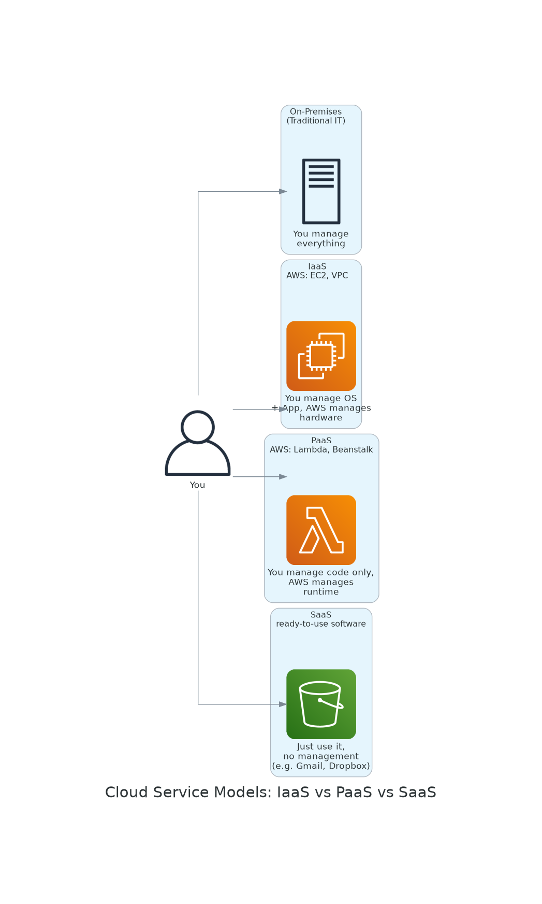
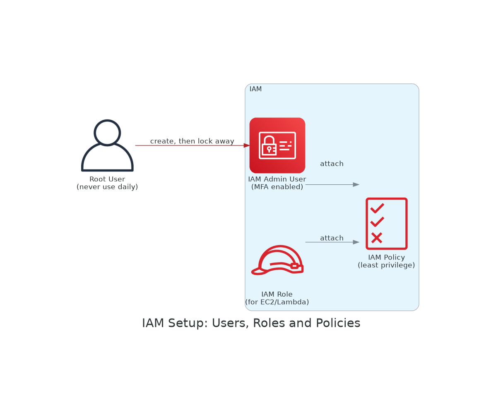
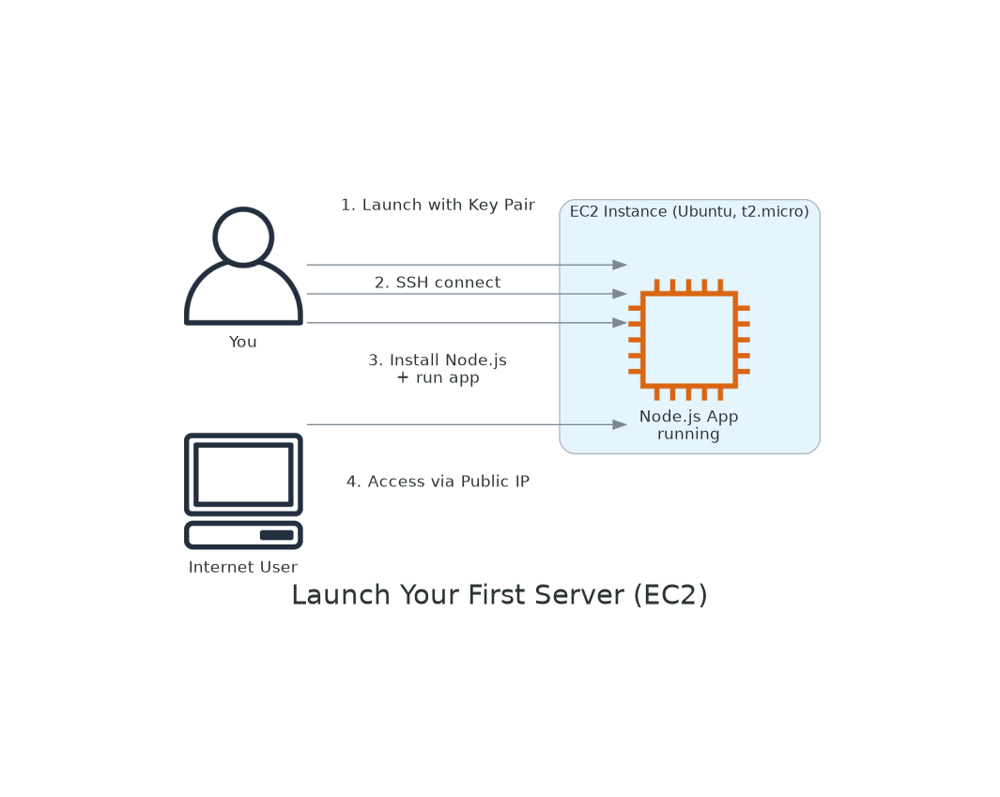
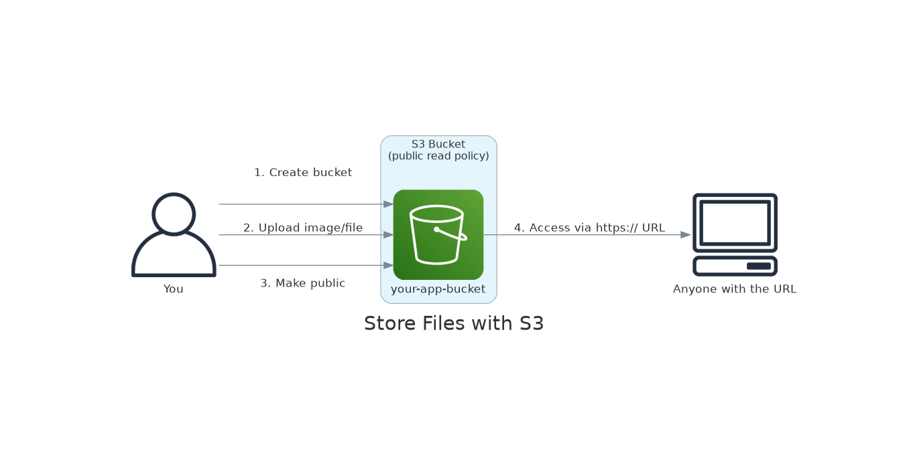
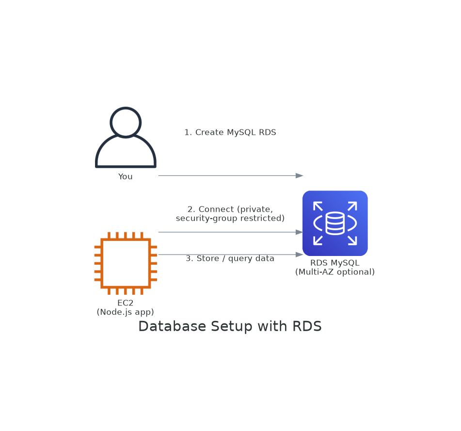
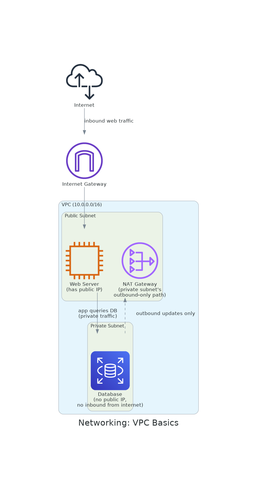
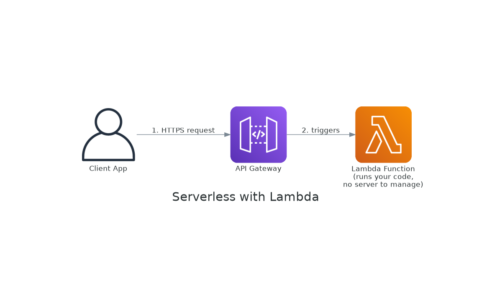
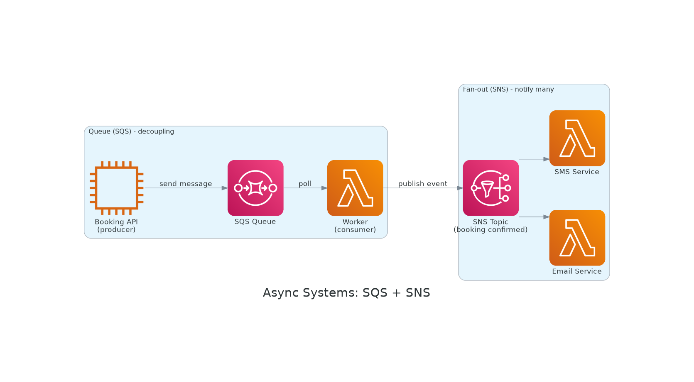
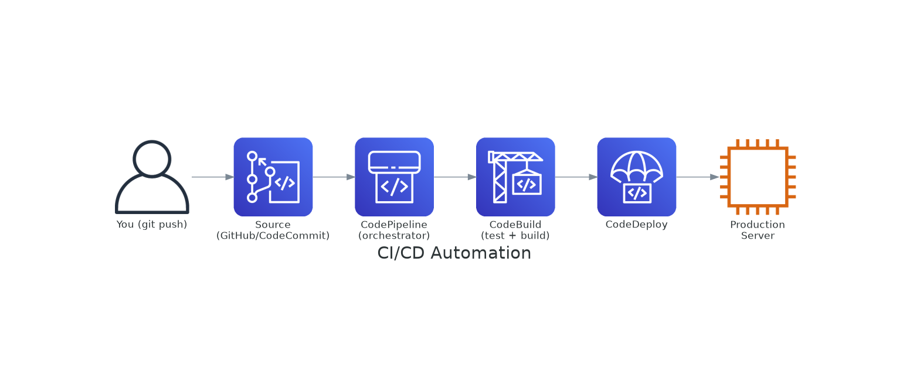

Got it—let’s go **step by step in a practical way**, like you’re actually learning and building, not just reading.

---

# ☁️ Step-by-Step AWS Learning (Beginner → Job Ready)

---

## 🟢 Step 1: Understand Cloud Basics



**Goal:** Know what AWS actually is.

### Learn:

* What is Cloud (instead of physical servers)
* Types:

  * IaaS (infrastructure)
  * PaaS (platform)
  * SaaS (software)
* Regions & Availability Zones

### Outcome:

👉 You understand *where your app runs*

---

## 🟢 Step 2: Create AWS Account + IAM Setup



**Goal:** Secure your account (very important)

### Learn:

* AWS IAM basics
* Users vs Roles vs Policies

### Do:

* Create IAM user (don’t use root)
* Enable MFA
* Create admin policy

### Outcome:

👉 You can safely use AWS

---

## 🟢 Step 3: Launch Your First Server (EC2)



**Goal:** Run your backend server

### Learn:

* Amazon EC2
* Instance types (t2.micro etc.)
* Key pair & SSH

### Do:

* Launch Ubuntu EC2
* Connect via SSH
* Install Node.js
* Run simple app

### Outcome:

👉 Your backend is live on the internet

---

## 🟢 Step 4: Store Files (S3)



**Goal:** Handle file storage

### Learn:

* Amazon S3
* Buckets & permissions

### Do:

* Create bucket
* Upload image/file
* Make it public
* Access via URL

### Outcome:

👉 You can store images, logs, backups

---

## 🟢 Step 5: Database Setup (RDS)



**Goal:** Use database like production

### Learn:

* Amazon RDS
* MySQL/PostgreSQL setup

### Do:

* Create MySQL RDS
* Connect from EC2
* Store data

### Outcome:

👉 Production-ready database

---

## 🟢 Step 6: Networking (VPC Basics)



**Goal:** Understand how traffic flows

### Learn:

* Amazon VPC
* Public vs Private subnet
* Internet Gateway

### Outcome:

👉 You understand secure architecture

---

## 🟢 Step 7: Serverless (Lambda)



**Goal:** Run code without servers

### Learn:

* AWS Lambda

### Do:

* Create simple function
* Trigger via API

### Outcome:

👉 You can build scalable APIs

---

## 🟢 Step 8: Async Systems (SQS + SNS)



**Goal:** Build scalable backend (very important for you)

### Learn:

* Amazon SQS
* Amazon SNS

### Use Case:

* Background jobs
* Email notifications
* Booking systems (like your flight system)

### Outcome:

👉 Event-driven architecture

---

## 🟢 Step 9: Docker + Containers


**Goal:** Modern deployment

### Learn:

* Containers (Docker)
* Amazon ECS
* Amazon EKS

### Outcome:

👉 Scalable microservices

---

## 🟢 Step 10: CI/CD (Automation)



**Goal:** Auto deploy your app

### Learn:

* AWS CodePipeline
* AWS CodeBuild

### Outcome:

👉 No manual deployment

---

# 🚀 Final Real-World Project (Must Do)

Build this:

👉 Flight/Booking API (your domain)

* EC2 → run NestJS
* RDS → store bookings
* S3 → store tickets/files
* SQS → async processing
* Lambda → background jobs

---

# 🎯 Simple Summary Flow

```
Cloud Basics
   ↓
IAM (Security)
   ↓
EC2 (Server)
   ↓
S3 (Storage)
   ↓
RDS (Database)
   ↓
VPC (Networking)
   ↓
Lambda (Serverless)
   ↓
SQS/SNS (Async)
   ↓
Docker + ECS
   ↓
CI/CD
```

---


