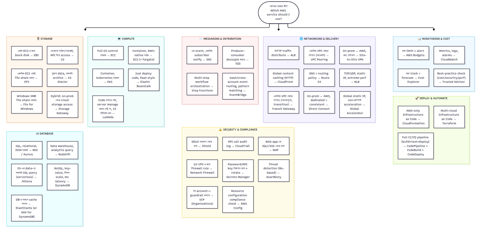

# 🧭 AWS Service Decision Map

> **"আমার এই কাজটা করতে হবে — কোন AWS service ব্যবহার করব?"** — পুরো course জুড়ে শেখা প্রায় সব service একটা diagram-এ। Exam বা interview-এর সময় scenario পড়েই দ্রুত service বেছে নেওয়ার জন্য এটা ব্যবহার করুন।

---

## কীভাবে ব্যবহার করবেন

1. প্রশ্ন/scenario পড়ে বুঝুন এটা কোন category-র (Compute? Storage? Database? ইত্যাদি)।
2. সেই category-র বাক্সগুলোর মধ্যে যেটার শর্ত মিলছে সেটা বেছে নিন।
3. একাধিক শর্ত মিললে (যেমন "serverless" + "database") — দুই category মিলিয়ে answer বানান (Lambda + DynamoDB)।
4. নিশ্চিত না হলে সংশ্লিষ্ট module-এর [Cheat Sheet](../96-Module-Cheat-Sheets/)-এ গিয়ে detail দেখুন।

## দ্রুত মনে রাখার নিয়ম (qualifier ধরে ধরে)

| Exam/Interview-এ এই শব্দ দেখলে | ভাবুন |
|---|---|
| "least operational overhead" | Serverless: Lambda, Fargate, DynamoDB, Aurora Serverless |
| "decouple" | SQS |
| "notify multiple subscribers" | SNS |
| "global, HTTP, cache" | CloudFront |
| "global, TCP/UDP, static IP" | Global Accelerator |
| "on-prem to AWS, consistent bandwidth" | Direct Connect |
| "interruption acceptable, cheapest" | Spot Instance |
| "unknown access pattern" | S3 Intelligent-Tiering |
| "audit / who did what" | CloudTrail |
| "compliance / configuration drift" | AWS Config |
| "account-wide guardrail" | SCP |
| "rotate password automatically" | Secrets Manager |

এই টেবিলের বড় ভার্সন: [SAA-C03 Common Traps ও Comparisons](../98-SAA-C03-Exam-Prep/07-Common-Traps-and-Comparisons.md)

---

**🏠 ফিরে যান:** [README](../README.md) | **📚 সব Cheat Sheet:** [96-Module-Cheat-Sheets](../96-Module-Cheat-Sheets/)
