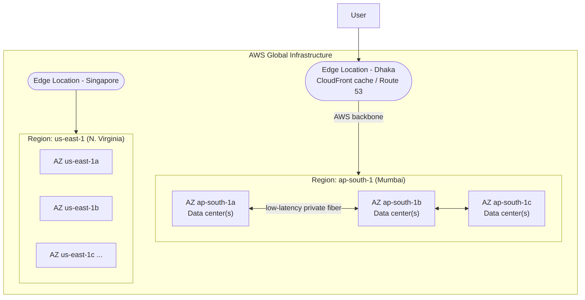
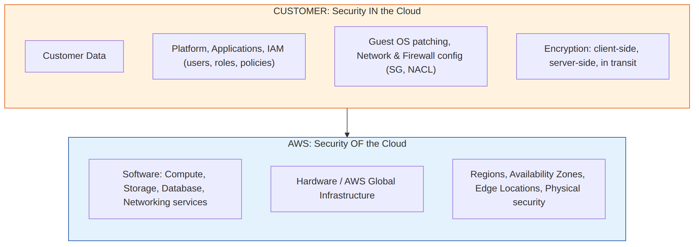

# 📚 Cloud Computing, AWS Infrastructure & Account Setup

> 📊 **Visual Summary** — সহজে বোঝার জন্য diagram:






---

## Part 1: Cloud Computing — গভীরভাবে বুঝুন

### 🎯 Cloud আসার আগে কী ছিল? (এটা না বুঝলে cloud-এর value বুঝবেন না)

ধরুন ২০০৫ সালে আপনি একটা e-commerce website বানাতে চান (যেমন Daraz)। আপনাকে যা যা করতে হতো:

**Step 1: Server কেনা**
- Dell বা HP থেকে physical server কিনতে হবে — একটার দাম ৫-১০ লাখ টাকা
- কমপক্ষে ৩-৪টা server লাগবে (web server, database server, backup)
- Server আসতে ২-৩ মাস সময় লাগবে

**Step 2: Data Center Setup**
- একটা আলাদা ঘর লাগবে যেখানে server রাখা হবে
- 24/7 AC চালু রাখতে হবে (server গরম হয়)
- Backup generator লাগবে (বিদ্যুৎ গেলে)
- Fire safety system
- Physical security (তালা, CCTV)

**Step 3: Network Setup**
- ISP থেকে dedicated internet line
- Router, Switch, Firewall কেনা
- Static IP address configure

**Step 4: Staff**
- System administrator — ৫০-৮০ হাজার টাকা/মাস
- Network engineer
- Security expert

**Step 5: Software License**
- Windows Server License
- Database License (Oracle/SQL Server)
- Antivirus

**মোট খরচ:** শুরু করতেই ৫০ লাখ - ১ কোটি টাকা, এবং প্রতি মাসে ৫-১০ লাখ টাকা maintenance।

### 😱 সমস্যা কোথায় ছিল?

**সমস্যা ১: Capacity Planning করা প্রায় অসম্ভব**

ধরুন আপনি Eid sale করবেন। ৭ দিনের জন্য ১০ গুণ traffic আসবে। এখন কী করবেন?

- **Option A:** ১০ গুণ server কিনে রাখুন — বছরের বাকি ৩৫৮ দিন খালি পড়ে থাকবে। টাকা নষ্ট।
- **Option B:** শুধু normal traffic-এর server রাখুন — Eid-এ website crash করবে। Customer হারাবেন।

**সমস্যা ২: Upfront investment**
কোটি টাকা লাগবে শুরু করতে। Startup-দের জন্য impossible।

**সমস্যা ৩: Slow scaling**
Server কিনে, data center-এ install করে, configure করতে ২-৩ মাস। ততদিনে competitor বাজার নিয়ে যাবে।

**সমস্যা ৪: Disaster Recovery**
আপনার data center-এ আগুন লাগলে সব শেষ। দ্বিতীয় data center আরেকটা শহরে বানাতে গেলে আরও কোটি টাকা।

---

### ☁️ Cloud এসে কী পরিবর্তন করল?

Amazon ২০০৬ সালে AWS লঞ্চ করল। তাদের idea ছিল — "আমাদের নিজেদের তো বিশাল data center আছে Amazon.com চালানোর জন্য। অন্যদের ভাড়া দিই কেন?"

এখন cloud-এ একই e-commerce site:

| কাজ | আগে (Traditional) | এখন (Cloud) |
|---|---|---|
| Server পাওয়া | ২-৩ মাস | ২ মিনিট |
| Upfront cost | ১ কোটি টাকা | $0 |
| Eid-এর scaling | Server কিনতে হবে | ১ ক্লিকে ১০ গুণ |
| Disaster recovery | আরেকটা data center | Checkbox enable |
| Staff | ৫-১০ জন | ১-২ জন |

---

### 🧩 Cloud-এর ৫টা মূল বৈশিষ্ট্য (NIST Definition) — গভীরে

#### ১. On-demand Self-service
**মানে:** যখন দরকার, নিজে নিজেই নিতে পারবেন। AWS-এর কাউকে phone/email করতে হবে না।

**উদাহরণ:** রাত ৩টায় আপনার website-এ হঠাৎ traffic আসছে। আপনি AWS console-এ log in করে ২ মিনিটে ৫টা নতুন server চালু করলেন। কেউ approve করল না, কেউ delay করল না।

**Traditional-এ কী হতো:** IT team-কে email, তারা manager-কে, manager procurement-কে, procurement vendor-কে... ২ সপ্তাহ লাগত।

#### ২. Broad Network Access
**মানে:** যে কোনো device থেকে, যে কোনো জায়গা থেকে internet দিয়ে access করতে পারবেন।

**উদাহরণ:** আপনি Dhaka-তে বসে AWS console খুলে Mumbai-এর server manage করছেন mobile দিয়ে।

#### ৩. Resource Pooling (সবচেয়ে important concept)
**মানে:** AWS-এর একটা physical server-এ অনেক customer-এর virtual server চলে — কিন্তু কেউ কারো ডেটা দেখতে পারে না।

**Analogy:** একটা apartment building ভাবুন। একই building-এ ১০০টা ফ্ল্যাট, ১০০টা পরিবার। সবাই একই electricity, water, lift share করছে, কিন্তু প্রতিটা ফ্ল্যাট আলাদা, প্রাইভেট।

**কেন এটা সম্ভব?** — **Virtualization** technology। একটা physical server-এ Hypervisor software থাকে, যেটা ১০-৫০টা virtual machine (VM) তৈরি করতে পারে।

**Cost benefit:** ১০০ জন customer একটা $10,000 server share করলে, প্রত্যেকের জন্য cost $100-এর মতো হয়। তাই cloud এত সস্তা।

#### ৪. Rapid Elasticity
**মানে:** চাহিদা অনুযায়ী resource সাথে সাথে বাড়ানো/কমানো যায়, automatically।

**উদাহরণ:**
- সকাল ৯টা — ১টা server (কম traffic)
- দুপুর ২টা — ৫টা server (লাঞ্চের সময় order বেশি)
- রাত ১২টা — ২টা server

এটা **Auto Scaling** দিয়ে automatically হয় (মডিউল ১-এ শিখবেন)।

#### ৫. Measured Service ("Pay-as-you-go")
**মানে:** যতটুকু ব্যবহার, ততটুকু bill। ঠিক বিদ্যুৎ বিলের মতো।

**উদাহরণ:** EC2 server প্রতি ঘণ্টায় charge হয় (কোনো কোনোটা প্রতি সেকেন্ডে)। আপনি ২ ঘণ্টা চালালে ২ ঘণ্টার বিল।

---

### 🏗️ Cloud-এর ৩টা Service Model — বিস্তারিত

এই তিনটা বোঝা critical। একটা pizza analogy দিয়ে বুঝাই:

| Model | কে কী দেয় | Pizza Analogy |
|---|---|---|
| **On-premise** | আপনি সব কিছু | ঘরে pizza বানান — ময়দা, চিজ, oven, electricity সব আপনার |
| **IaaS** | AWS infrastructure, আপনি OS-এর উপরে সব | Frozen pizza কিনে আপনার oven-এ গরম করেন |
| **PaaS** | AWS platform, আপনি শুধু code | Pizza delivery — ঘরে খাচ্ছেন, কিন্তু বানাতে হয়নি |
| **SaaS** | AWS সব কিছু, আপনি শুধু user | Restaurant-এ গিয়ে pizza খাচ্ছেন |

#### IaaS (Infrastructure as a Service)
**AWS দেয়:** Virtual machine, network, storage
**আপনি manage করেন:** OS, patches, security, application, data

**AWS-এ উদাহরণ:** EC2, EBS, VPC

**কখন ব্যবহার:** আপনার OS-level control দরকার, custom software install করতে চান।

#### PaaS (Platform as a Service)
**AWS দেয়:** Ready platform (OS, runtime, database সব configured)
**আপনি manage করেন:** শুধু আপনার application code ও data

**AWS-এ উদাহরণ:** Elastic Beanstalk, RDS, Lambda

**কখন ব্যবহার:** দ্রুত app deploy করতে চান, infrastructure নিয়ে মাথা ঘামাতে চান না।

#### SaaS (Software as a Service)
**AWS (বা অন্য vendor) দেয়:** পুরো ready software
**আপনি manage করেন:** শুধু আপনার ব্যবহার ও data

**উদাহরণ:** Gmail, Office 365, Salesforce, Zoom, Dropbox

---

### 🌐 Cloud-এর ৩টা Deployment Model

#### Public Cloud
- সব customer একই infrastructure share করে
- সবচেয়ে সস্তা
- উদাহরণ: AWS, Azure, GCP
- **Use case:** Startup, general application

#### Private Cloud
- এক কোম্পানির নিজস্ব cloud (নিজেদের data center-এ বা vendor-এর কাছে dedicated)
- বেশি দামি কিন্তু বেশি control
- **Use case:** Bank, government, defense — যেখানে data খুব sensitive

#### Hybrid Cloud
- Public + Private mix
- Sensitive data private cloud-এ, normal data public cloud-এ
- **Use case:** বড় enterprise (banks যারা cloud-এ যাচ্ছে ধীরে ধীরে)

---

## Part 2: AWS Global Infrastructure — আরও গভীরে

### 🌍 Region — বিস্তারিত

#### Region কী (আবার)?
Region = পৃথিবীর একটা ভৌগোলিক এলাকায় AWS-এর data center cluster।

#### প্রতিটা Region-এর একটা Code আছে:

| Region | Code | Location |
|---|---|---|
| Mumbai | `ap-south-1` | India |
| Singapore | `ap-southeast-1` | Singapore |
| Tokyo | `ap-northeast-1` | Japan |
| N. Virginia | `us-east-1` | USA (oldest, largest) |
| Frankfurt | `eu-central-1` | Germany |
| Ireland | `eu-west-1` | Ireland |

**Code breakdown:** `ap-south-1` মানে
- `ap` = Asia Pacific
- `south` = South
- `1` = first region in that area

#### Region পছন্দ করার ৪টা মূল factor

**১. Latency (Response time)**
- User যত কাছে, response তত দ্রুত
- Bangladesh-এর user-দের জন্য:
  - Mumbai → ~৪০-৬০ ms (best)
  - Singapore → ~৮০-১০০ ms (good)
  - N. Virginia → ~২৫০-৩০০ ms (slow)
- ১০০ ms-এর উপরে গেলে user-রা "slow" feel করে

**২. Price**
- প্রতিটা region-এ AWS-এর cost আলাদা
- সবচেয়ে সস্তা: `us-east-1` (N. Virginia)
- সবচেয়ে দামি: `sa-east-1` (São Paulo, Brazil), Middle East regions
- পার্থক্য: একই EC2 server Mumbai-তে $0.012/hour, Virginia-তে $0.0104/hour

**৩. Compliance & Law**
- EU-র GDPR: EU citizen-এর data EU-র বাইরে রাখা যায় না → `eu-*` region লাগবে
- কিছু দেশের আইনে citizen data দেশের বাইরে রাখা যায় না
- HIPAA (US health data), PCI-DSS (payment) — বিশেষ region-এ compliance সহজ

**৪. Service Availability**
- সব AWS service সব region-এ available না
- নতুন service প্রথমে আসে `us-east-1`-এ, তারপর ধীরে ধীরে অন্য region-এ
- **উদাহরণ:** কিছু AI/ML service এখনও Mumbai-তে নেই, Singapore-এ আছে
- Check করুন: `aws.amazon.com/about-aws/global-infrastructure/regional-product-services`

---

### 🏢 Availability Zone (AZ) — গভীরে

#### AZ আসলে কী?
এক Region-এর মধ্যে ২-৬টা AZ থাকে। প্রতিটা AZ হলো **১ বা একাধিক আলাদা physical data center**, যেগুলো:

- একে অপরের থেকে physically দূরে (কয়েক কিলোমিটার, কিন্তু একই region-এর মধ্যে)
- আলাদা electricity supply
- আলাদা network connection
- আলাদা cooling
- কিন্তু একে অপরের সাথে high-speed fiber দিয়ে connected (< ২ ms latency)

#### কেন এই design?

**Scenario ১ — Electricity fail:**
Mumbai AZ-1-এ electricity গেল। আপনার server down। কিন্তু যদি আপনার app AZ-1 এবং AZ-2 দুই জায়গায় থাকে, AZ-2 চালু থাকবে, user কিছু টের পাবে না।

**Scenario ২ — Natural disaster:**
AZ-1-এর building-এ আগুন লাগল। AZ-2 কয়েক কিলোমিটার দূরে, safe।

**Scenario ৩ — Network issue:**
AZ-1-এর network cable কাটা গেল। AZ-2 আলাদা network দিয়ে চলছে।

#### AZ Naming
- Mumbai-তে: `ap-south-1a`, `ap-south-1b`, `ap-south-1c`
- গুরুত্বপূর্ণ: আপনার account-এ যে `ap-south-1a` দেখাচ্ছে, আমার account-এ সেটা আসলে অন্য physical AZ হতে পারে। AWS এটা randomize করে load balance করার জন্য।

#### Best Practice
**Production app সবসময় কমপক্ষে ২টা AZ-এ deploy করুন।** এটাকে বলে **Multi-AZ deployment**। AWS SLA (Service Level Agreement) এই condition-এ ৯৯.৯৯% uptime guarantee করে।

---

### 📡 Edge Location — বিস্তারিত

#### Edge Location কেন লাগে?

ধরুন আপনার website US-এ hosted (N. Virginia)। Bangladesh থেকে কেউ visit করলে, প্রতিটা image, CSS, video US থেকে আসতে হবে — ২৫০+ ms latency। Website slow লাগবে।

**Edge Location-এর কাজ:** Dhaka-র কাছে একটা ছোট cache server রাখা, যেখানে website-এর images, CSS, videos copy হয়ে থাকে। User request করলে Dhaka থেকেই দ্রুত pay করে।

#### Region vs AZ vs Edge — সংক্ষেপে

| | Region | AZ | Edge Location |
|---|---|---|---|
| সংখ্যা | ৩০+ | Region-এ ২-৬ | ৪০০+ |
| কী রাখে | সব কিছু | সব কিছু (full data center) | শুধু cache |
| আকার | অনেক বড় | বড় | ছোট |
| ব্যবহার | primary infra | high availability | content delivery |

#### Edge Location-এর service:
- **CloudFront** — CDN (images, videos fast delivery)
- **Route 53** — DNS (domain resolve দ্রুত)
- **Global Accelerator** — traffic optimization

**Bangladesh-এ Edge Location:** Dhaka-তে CloudFront Edge Location আছে (একাধিক)।

---

### 🗺️ AWS Infrastructure Hierarchy — পুরো চিত্র

```
AWS (Global)
│
├── Region (ap-south-1 - Mumbai)
│   ├── AZ (ap-south-1a)
│   │   ├── Data Center 1
│   │   └── Data Center 2
│   ├── AZ (ap-south-1b)
│   │   └── Data Centers
│   └── AZ (ap-south-1c)
│       └── Data Centers
│
├── Region (ap-southeast-1 - Singapore)
│   └── AZs...
│
└── Edge Locations (Dhaka, Chennai, Bangkok, ...)
    └── Only for caching (CloudFront, Route 53)
```

---

## Part 3: AWS Account Setup — বিস্তারিত Guide

### 🆓 Free Tier — কী কী পাবেন?

AWS Free Tier-এর ৩ ধরনের offer:

#### ১. ১২-মাস Free (নতুন account-এর জন্য প্রথম ১২ মাস)

| Service | Free Limit |
|---|---|
| EC2 | t2.micro/t3.micro — ৭৫০ ঘণ্টা/মাস (মানে ১টা server সারা মাস চলতে পারে) |
| S3 | ৫ GB storage, ২০,০০০ GET requests, ২,০০০ PUT requests |
| RDS | db.t2.micro — ৭৫০ ঘণ্টা, ২০ GB storage |
| CloudFront | ১ TB data transfer |
| EBS | ৩০ GB storage |

#### ২. Always Free (সবসময় free, limit এর মধ্যে থাকলে)

| Service | Free Limit |
|---|---|
| Lambda | ১ মিলিয়ন requests/মাস |
| DynamoDB | ২৫ GB storage |
| CloudWatch | ১০ custom metrics, ১০ alarms |
| SNS | ১ মিলিয়ন publishes |
| SQS | ১ মিলিয়ন requests |

#### ৩. Trial (সীমিত সময়)
কিছু service নির্দিষ্ট দিন বা মাসের জন্য free trial দেয়।

---

### 📝 Account তৈরির Step-by-step

**যা যা লাগবে:**
1. Email address (আগে AWS-এ ব্যবহার হয়নি এমন)
2. একটা International debit/credit card (DBBL Nexus, EBL Aqua, City Bank দিয়েও হয়)
3. Active phone number (SMS/call verification-এর জন্য)
4. ১০-১৫ মিনিট সময়

**Steps:**

**Step 1:** `aws.amazon.com/free` এ যান → "Create a Free Account" ক্লিক করুন

**Step 2:** Email ও AWS account name দিন
- AWS account name = আপনার account-এর একটা নাম (পরে change করা যায়)

**Step 3:** Email verification code আসবে, দিন

**Step 4:** Root user password set করুন (strong password — কমপক্ষে ৮ character, uppercase, lowercase, number, symbol)

**Step 5:** Contact information
- **Personal** select করুন (business না, শেখার জন্য)
- আপনার নাম, ঠিকানা, phone দিন

**Step 6:** Billing Information
- Card details দিন
- AWS $1 temporary charge করবে verify করার জন্য — ৩-৫ দিনে ফেরত আসবে
- **চিন্তা করবেন না** — free tier-এর মধ্যে থাকলে আর charge হবে না

**Step 7:** Identity Verification
- Phone number দিন → SMS/call-এ code আসবে → দিন

**Step 8:** Support Plan select
- **Basic (Free)** select করুন। Developer/Business plan পরে চাইলে নিতে পারবেন।

**Step 9:** Account ready! Console login করুন।

---

### 🚨 Day 1-এ অবশ্যই যা করবেন (Security + Billing Protection)

#### ১. Billing Alert সেট করুন (সবচেয়ে গুরুত্বপূর্ণ)

AWS-এ নতুনরা সবচেয়ে বেশি ভয় পায় "অজানা bill"। এটা prevent করুন:

**Steps:**
1. Top right-এ আপনার account name → **Billing Dashboard**
2. বাঁ দিকে **Billing Preferences**
3. Enable করুন:
   - "Receive PDF Invoice By Email"
   - "Receive Free Tier Usage Alerts"
   - "Receive Billing Alerts"
4. Email address দিন যেখানে alert পেতে চান

**তারপর CloudWatch Alarm:**
1. Region switch করুন **N. Virginia** (`us-east-1`)-এ (billing alarm শুধু এই region-এ কাজ করে)
2. CloudWatch → Alarms → Create Alarm
3. Metric: **Billing > Total Estimated Charge > USD**
4. Threshold: $1 বা $5 (যা খুশি)
5. SNS topic তৈরি করুন email-এর জন্য
6. Alarm name দিন: "Billing-Alert-5USD"

এখন bill $5 ছাড়ালেই email আসবে।

#### ২. MFA (Multi-Factor Authentication) চালু করুন Root account-এ

Root user = সবচেয়ে powerful, সব কিছু করতে পারে। Hack হলে সর্বনাশ।

**Steps:**
1. Top right → Security Credentials
2. MFA → Assign MFA device
3. **Authenticator app** select করুন
4. Google Authenticator / Authy / Microsoft Authenticator app দিয়ে QR scan
5. পরপর ২টা code দিন

এরপর login-এ password + 6-digit code লাগবে।

#### ৩. IAM User তৈরি করুন (Root user আর সরাসরি ব্যবহার করবেন না)

**Best practice:** Root account শুধু একটা জিনিসের জন্য — IAM user তৈরি করতে। তারপর সব কাজ IAM user দিয়ে।

এটা Day 1-এ না পারলেও চলবে, পরের module-গুলোতে আসবে। কিন্তু মাথায় রাখুন।

---

## 🎯 আজকের মূল takeaways (মুখস্থ করুন)

1. **Cloud** = internet দিয়ে IT resource ভাড়া নেওয়া
2. **Service Models:** IaaS (infrastructure), PaaS (platform), SaaS (software)
3. **Region** = ভৌগোলিক এলাকা, সবকিছু region-scoped
4. **AZ** = region-এর মধ্যে আলাদা data center, high availability-র জন্য
5. **Edge Location** = content caching-এর জন্য, ৪০০+ জায়গায়
6. **Free Tier** = ১২ মাস free usage (সীমিত), কিছু service always free
7. **Billing Alert** — account খুলেই ১ম কাজ

---

## 📝 Self-check (নিজে উত্তর দিন)

1. একটা company হিসেবে US customer আর EU customer-এর জন্য আলাদা region কেন লাগতে পারে?
2. AZ-1 এবং AZ-2 আসলে একই data center-এ থাকতে পারে কি?
3. Edge Location কি EC2 server run করতে পারে?
4. IaaS আর PaaS-এর মধ্যে কে বেশি control দেয়?
5. Bangladesh-এ বসে Daraz-এর মতো site বানালে কোন region choose করবেন? কেন?

---

**কাল (Day 2):** EC2 Instance Types গভীরে — t2.micro vs m5.large vs c5.xlarge vs r5.2xlarge, কেন এত পরিবার, কোনটা কোন কাজে, AMI-র পুরো concept।

কাল সকালে এসে লিখবেন **"Day 2"** 👍
