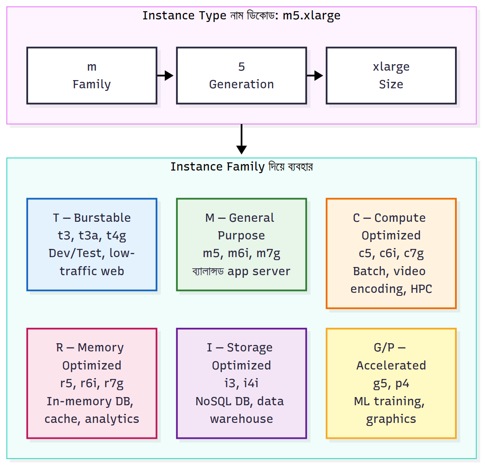
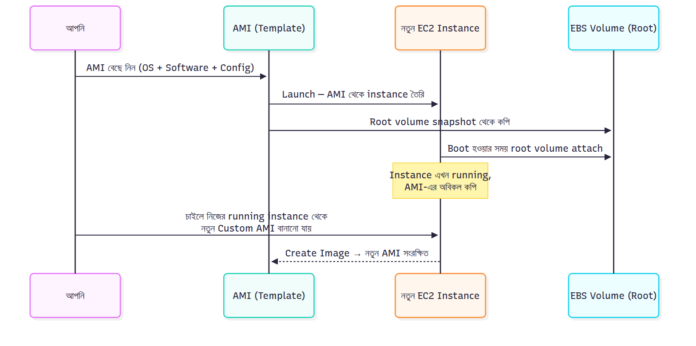

---

# 📚 Day 2 — EC2 Instance Types & AMI

> 📊 **Visual Summary** — সহজে বোঝার জন্য diagram:





**সময়:** ১.৫ ঘণ্টা | **Module:** ১ (EC2 & Storage Fundamentals)

## 🎯 আজকের লক্ষ্য
- EC2 কী, কীভাবে কাজ করে — গভীরভাবে বুঝবেন
- Instance type-এর পুরো family system শিখবেন (t, m, c, r, এবং আরও)
- Instance type naming convention decode করতে পারবেন
- AMI কী ও কীভাবে ব্যবহার হয় — পুরোটা জানবেন
- কোন কাজে কোন instance — decide করতে পারবেন

---

## Part 1: EC2 আসলে কী?

### 🖥️ EC2-এর পূর্ণরূপ
**EC2 = Elastic Compute Cloud**

- **Elastic** = বাড়ানো/কমানো যায়
- **Compute** = processing power (CPU, RAM)
- **Cloud** = internet-এ

সহজ কথায়: **AWS-এর virtual computer** যেটা আপনি ভাড়া নিচ্ছেন।

### 🏢 EC2 কীভাবে কাজ করে — Behind the scenes

AWS-এর data center-এ বিশাল physical server আছে। প্রতিটা physical server-এ **Hypervisor** নামে software চলে। Hypervisor একটা physical server-কে অনেকগুলো virtual server (VM) বানিয়ে দেয়।

```
Physical Server (AWS Data Center)
│
├── Hypervisor (Nitro System)
│
├── Your EC2 Instance #1 (t3.micro) — 1 vCPU, 1 GB RAM
├── Another customer's EC2 (m5.large) — 2 vCPU, 8 GB RAM
├── Another customer's EC2 (c5.xlarge) — 4 vCPU, 8 GB RAM
└── ... (আরও customers)
```

গুরুত্বপূর্ণ: সবাই একই physical hardware share করছে, কিন্তু কেউ কারো data দেখতে পারে না। Hypervisor isolate করে রাখে।

### 🔑 EC2-এর Key Terminology

| Term | মানে |
|---|---|
| **Instance** | একটা virtual server (EC2-র একটা চলন্ত copy) |
| **AMI** | Amazon Machine Image — instance-এর blueprint/template |
| **Instance Type** | Hardware configuration (t3.micro, m5.large, ইত্যাদি) |
| **Region** | কোথায় চলবে (Mumbai, Singapore) |
| **AZ** | Region-এর কোন AZ-এ |
| **Key Pair** | SSH দিয়ে login করার জন্য security key |
| **Security Group** | Firewall rules |
| **EBS Volume** | Instance-এর hard disk |

---

## Part 2: Instance Type — বিস্তারিত

### 🤔 কেন এত Instance Type?

বিভিন্ন application-এর বিভিন্ন চাহিদা। একটা পরিবারের জন্য ছোট গাড়ি, পরিবহনের জন্য ট্রাক, racing-এর জন্য sports car — সবই গাড়ি, কিন্তু আলাদা কাজের জন্য।

**উদাহরণ:**
- একটা ছোট blog website → কম CPU, কম RAM (t3.micro)
- Video encoding app → প্রচুর CPU দরকার (c5 family)
- Database server → প্রচুর RAM দরকার (r5 family)
- Machine learning → GPU দরকার (p3, g4 family)

---

### 🏠 Instance Family — ৫টা মূল ভাগ

AWS instance-দের ৫টা বড় family-তে ভাগ করেছে:

| Family | Purpose | Prefix | উদাহরণ |
|---|---|---|---|
| **General Purpose** | Balanced CPU, RAM, Network | t, m, mac | t3.micro, m5.large |
| **Compute Optimized** | High CPU | c | c5.xlarge |
| **Memory Optimized** | High RAM | r, x, z | r5.large, x1e.xlarge |
| **Storage Optimized** | High disk I/O | i, d, h | i3.large, d2.xlarge |
| **Accelerated Computing** | GPU, FPGA | p, g, f, inf, trn | p3.2xlarge, g4dn.xlarge |

এখন একটা একটা করে বুঝি।

---

### 1️⃣ General Purpose (t, m families)

**কখন ব্যবহার:** Balanced workload — web server, small database, development environment, normal application।

#### T-family (Burstable Performance)

**কী special:** এগুলো সস্তা, কারণ CPU সবসময় পুরো power দেয় না। সাধারণত ১০-৪০% CPU চালায়। দরকার হলে "burst" করে পুরো power দেয় কিছুক্ষণের জন্য।

**কীভাবে burst কাজ করে:**
- প্রতিটা t-instance-এর "CPU credits" জমা হয় যখন idle থাকে
- Load আসলে credits খরচ করে full CPU পায়
- Credits শেষ হলে আবার base performance-এ ফিরে যায়

**উদাহরণ:**
- **t2.nano** — 1 vCPU, 0.5 GB RAM — খুব ছোট কাজ
- **t3.micro** — 2 vCPU, 1 GB RAM — **Free Tier eligible** ⭐
- **t3.small** — 2 vCPU, 2 GB RAM
- **t3.medium** — 2 vCPU, 4 GB RAM
- **t3.large** — 2 vCPU, 8 GB RAM

**কখন ব্যবহার করবেন না:** এমন application যার সবসময় 70%+ CPU লাগে (ML training, video encoding) — credits শেষ হয়ে slow হয়ে যাবে।

#### M-family (Balanced, No Burst)

**কী special:** সবসময় full performance দেয়। Consistent workload-এর জন্য।

**উদাহরণ:**
- **m5.large** — 2 vCPU, 8 GB RAM
- **m5.xlarge** — 4 vCPU, 16 GB RAM
- **m5.2xlarge** — 8 vCPU, 32 GB RAM
- **m5.4xlarge** — 16 vCPU, 64 GB RAM

**কখন:** Production web server, small-to-medium database, application server।

---

### 2️⃣ Compute Optimized (C family)

**কী special:** CPU-RAM ratio বেশি CPU-র দিকে। অর্থাৎ একই দামে বেশি CPU পাবেন, তুলনামূলক কম RAM।

**কখন ব্যবহার:**
- Video/audio encoding
- Scientific modeling
- High-performance web server
- Gaming server
- Batch processing
- Machine learning inference (model trained, এখন predict করছে)

**উদাহরণ:**
- **c5.large** — 2 vCPU, 4 GB RAM (m5.large: 2 vCPU, 8 GB)
- **c5.xlarge** — 4 vCPU, 8 GB RAM
- **c5.4xlarge** — 16 vCPU, 32 GB RAM
- **c5.18xlarge** — 72 vCPU, 144 GB RAM

দেখুন m5 vs c5:
- m5.large → 2 vCPU : 8 GB RAM (1:4)
- c5.large → 2 vCPU : 4 GB RAM (1:2)

Same vCPU, কিন্তু c5-এর RAM কম → দাম কম, কিন্তু CPU performance বেশি (newer processor)।

---

### 3️⃣ Memory Optimized (R, X, Z families)

**কী special:** প্রচুর RAM, কম CPU-per-GB ratio।

**কখন ব্যবহার:**
- **Relational Database** (MySQL, PostgreSQL with big datasets)
- **In-memory database** (Redis, Memcached)
- **Real-time big data analytics**
- **SAP HANA** (corporate ERP)
- **Distributed web cache**

#### R-family (General Memory-Optimized)

**উদাহরণ:**
- **r5.large** — 2 vCPU, 16 GB RAM (m5.large-এর ২ গুণ RAM)
- **r5.xlarge** — 4 vCPU, 32 GB RAM
- **r5.8xlarge** — 32 vCPU, 256 GB RAM

#### X-family (Extreme Memory)

**উদাহরণ:**
- **x1e.xlarge** — 4 vCPU, 122 GB RAM!
- **x1.32xlarge** — 128 vCPU, 1,952 GB RAM (প্রায় 2 TB RAM!)

**দাম:** Obviously অনেক বেশি। SAP HANA-এর মতো enterprise software-এর জন্য।

---

### 4️⃣ Storage Optimized (I, D, H families)

**কী special:** Fast local storage (NVMe SSD)। High disk read/write।

**কখন ব্যবহার:**
- NoSQL database (Cassandra, MongoDB)
- Data warehouse
- Transactional database যেখানে দ্রুত disk access দরকার
- Log processing

**উদাহরণ:**
- **i3.large** — 2 vCPU, 15 GB RAM, 475 GB NVMe SSD
- **i3.2xlarge** — 8 vCPU, 61 GB RAM, 1,900 GB NVMe SSD
- **d2.xlarge** — 4 vCPU, 30 GB RAM, 6 TB HDD (data warehouse)

---

### 5️⃣ Accelerated Computing (P, G, F, Inf, Trn)

**কী special:** GPU, FPGA, বা custom AI chip।

**কখন ব্যবহার:**
- **P family** — Machine Learning training (NVIDIA GPU)
- **G family** — Graphics rendering, gaming, ML inference
- **F family** — FPGA (custom hardware acceleration)
- **Inf family** — AI inference (AWS-এর Inferentia chip)
- **Trn family** — AI training (AWS-এর Trainium chip)

**উদাহরণ:**
- **p3.2xlarge** — 8 vCPU, 61 GB RAM, 1x V100 GPU (ML training)
- **g4dn.xlarge** — 4 vCPU, 16 GB RAM, 1x T4 GPU (cheaper ML)
- **p4d.24xlarge** — 96 vCPU, 1152 GB RAM, 8x A100 GPU (large ML training, dangerously expensive)

**দাম:** প্রচুর। p3.2xlarge-এ প্রায় $3/hour। ২৪ ঘণ্টা চালালে $72। সাবধান।

---

## Part 3: Instance Naming Convention — Decode করুন

একটা instance-এর নাম দেখে সব information বের করা শিখুন।

**উদাহরণ:** `m5.xlarge`, `c5n.2xlarge`, `t3a.medium`

### Format Breakdown:

```
m   5   n    .   xlarge
│   │   │        │
│   │   │        └── Size (নিচে টেবিলে)
│   │   └── Additional capabilities (optional)
│   └── Generation (যত বড় সংখ্যা, তত নতুন)
└── Family (m = general, c = compute, r = memory, ...)
```

### Family letters:
- `t` — burstable general purpose
- `m` — general purpose
- `c` — compute optimized
- `r` — memory optimized
- `i` — storage optimized (SSD)
- `d` — storage optimized (HDD)
- `p` — GPU (ML training)
- `g` — GPU (graphics)

### Generation number:
- `m4` (older) → `m5` (newer) → `m6` (newest)
- নতুন generation সাধারণত better performance, সস্তা বা একই দাম
- Best practice: সবসময় latest generation ব্যবহার করুন

### Additional Capabilities (optional letters):
- `a` — AMD processor (সাধারণত Intel-এর চেয়ে সস্তা)
  - উদাহরণ: `t3a.medium`, `m5a.large`
- `g` — Graviton processor (AWS-এর own ARM-based, সস্তা ও efficient)
  - উদাহরণ: `t4g.micro`, `m6g.large`
- `n` — Network optimized (faster networking)
  - উদাহরণ: `c5n.xlarge`
- `d` — NVMe SSD local storage included
  - উদাহরণ: `m5d.large`
- `i` — Intel-specific feature
- `z` — High frequency CPU

### Size options (ছোট থেকে বড়):

| Size | সংজ্ঞা |
|---|---|
| nano | খুব ছোট |
| micro | ছোট |
| small | ছোট |
| medium | মাঝারি |
| large | বড় (base size) |
| xlarge | 2x large |
| 2xlarge | 4x large |
| 4xlarge | 8x large |
| 8xlarge | 16x large |
| 16xlarge | 32x large |
| 24xlarge, 32xlarge | আরও বড় |
| metal | পুরো physical server (bare metal) |

### Practice — এই নামগুলো decode করুন:

**`t3.micro`**
- t = burstable general purpose
- 3 = 3rd generation
- micro = small size
- → Free tier eligible, সাধারণ development/testing

**`m5a.2xlarge`**
- m = general purpose
- 5 = 5th generation
- a = AMD processor
- 2xlarge = 8 vCPU, 32 GB RAM
- → Medium production server, AMD দিয়ে সস্তা

**`c5n.4xlarge`**
- c = compute optimized
- 5 = 5th generation
- n = network optimized
- 4xlarge = 16 vCPU
- → High-performance computing যেখানে দ্রুত network দরকার

**`r6g.large`**
- r = memory optimized
- 6 = 6th generation
- g = Graviton (ARM) processor
- large = 2 vCPU, 16 GB RAM
- → Cheap memory-intensive workload

---

## Part 4: AMI (Amazon Machine Image) — বিস্তারিত

### 🤔 AMI আসলে কী?

**AMI = Instance-এর blueprint বা template।**

Analogy: Pizza-র recipe। একটা recipe থেকে যতগুলো pizza চান বানাতে পারেন, সব একরকম হবে।

AMI একটা instance তৈরি করার সব তথ্য রাখে:
- **Operating System** (Ubuntu, Amazon Linux, Windows Server, Red Hat, ইত্যাদি)
- **Pre-installed software** (যদি থাকে — web server, database, ইত্যাদি)
- **Configuration** (settings, environment variables)
- **Storage setup** (disk configuration)
- **Permissions** (কে ব্যবহার করতে পারবে)

### 🏭 AMI-এর ৪টা Source

#### ১. AWS-provided AMIs
AWS নিজেই কিছু ready AMI দেয়। Free, trusted।

**উদাহরণ:**
- **Amazon Linux 2023** — AWS-এর own Linux, EC2-র জন্য optimized
- **Ubuntu Server** (20.04, 22.04, 24.04)
- **Windows Server** (2019, 2022)
- **Red Hat Enterprise Linux (RHEL)**
- **SUSE Linux**
- **Debian**

#### ২. AWS Marketplace AMIs
Third-party vendor-রা pre-configured AMI বিক্রি করে। কিছু free, কিছু paid।

**উদাহরণ:**
- Bitnami WordPress (WordPress pre-installed)
- Palo Alto Networks Firewall
- Check Point Security Gateway
- Cisco CSR 1000v Router

**কাজ:** এগুলো ব্যবহার করলে আপনি software কেনার পাশাপাশি server-ও ভাড়া নিচ্ছেন — একসাথে।

#### ৩. Community AMIs
Open-source community-র বানানো। Free কিন্তু trust করার আগে সাবধান।

**সতর্কতা:** Unknown source-এর AMI-তে malware থাকতে পারে। Production-এ unverified community AMI ব্যবহার করবেন না।

#### ৪. Custom AMIs (আপনার নিজের বানানো)
আপনি একটা instance launch করলেন, software install করলেন, configure করলেন → তারপর সেই instance থেকে AMI তৈরি করলেন। পরেরবার যখন নতুন instance দরকার, একই configuration পাবেন।

**কেন কাজে আসে:**
- Auto Scaling — একই configuration-এর ১০টা server দরকার
- Disaster Recovery — একটা server-এর full backup
- Standardization — সব team একই environment ব্যবহার করবে
- Fast deployment — ২ মিনিটে ready server পাবেন, install-setup করতে হবে না

---

### 🧬 AMI-এর ভেতরে কী থাকে?

```
AMI
│
├── Root Volume Snapshot
│   ├── Operating System files
│   ├── Installed software
│   ├── User accounts
│   └── Configuration
│
├── Launch Permissions
│   ├── Public / Private / Shared
│   └── Which AWS accounts can use
│
├── Block Device Mapping
│   └── Storage configuration (EBS volumes)
│
└── Metadata
    ├── Architecture (x86, ARM)
    ├── Virtualization type (HVM, PV)
    └── Region
```

---

### 🌍 AMI ও Region-এর সম্পর্ক

**Critical:** AMI **region-specific**। Mumbai-তে তৈরি AMI সরাসরি Singapore-এ ব্যবহার করা যাবে না।

**যা করতে হবে:** AMI-টা **copy** করতে হবে অন্য region-এ।

**Steps:**
1. AMI select করুন
2. Actions → Copy AMI
3. Destination region select করুন
4. কয়েক মিনিট পরে target region-এ available হবে

**কেন?** Region-গুলো physically আলাদা data center। Data transfer করতে হয়।

---

### 📊 AMI Virtualization Types

**HVM (Hardware Virtual Machine)** — modern, সব নতুন instance HVM ব্যবহার করে। এটাই default।

**PV (Paravirtual)** — পুরানো technology। নতুন instance type-এ supported না। শুধু legacy পুরানো AMI-তে আছে।

**আপনি নতুন বলে চিন্তা করবেন না — HVM-ই ব্যবহার করবেন।**

---

## Part 5: EC2 Launch করার পুরো Process

এখন conceptually দেখুন কীভাবে একটা EC2 launch হয়। (আজ hands-on না, শুধু workflow বুঝুন।)

### Step-by-step Launch Flow:

**১. Region & AZ Select**
- কোন region-এ চলবে (Mumbai/Singapore)?

**২. AMI Choose**
- Amazon Linux 2023? Ubuntu 22.04?

**৩. Instance Type Select**
- t3.micro (free tier)? m5.large? c5.xlarge?

**৪. Network Setup**
- কোন VPC-তে যাবে?
- Public subnet না private subnet?
- Public IP assign করবে কি না?

**৫. Key Pair**
- SSH দিয়ে login করতে Key Pair লাগবে
- নতুন Key Pair create করুন অথবা existing select করুন
- `.pem` file download হবে — **হারাবেন না, backup রাখুন**

**৬. Security Group**
- Firewall rules
- কোন port open থাকবে? (SSH = 22, HTTP = 80, HTTPS = 443)
- কোন IP access করতে পারবে?

**৭. Storage**
- Root volume কত GB? (default 8 GB)
- EBS type কী? (gp3/gp2 recommended)

**৮. User Data (Optional)**
- Instance boot হওয়ার সময় auto-run করার script
- যেমন: "boot হওয়ার পরেই Nginx install করো"

**৯. Tags**
- Name, Environment (dev/staging/prod), Owner
- Cost tracking ও identification-এর জন্য

**১০. Review & Launch**
- সব check করে Launch

**১১. Instance চালু হচ্ছে**
- Status: pending → running (১-২ মিনিট)
- Public IP আসবে
- SSH/RDP দিয়ে connect করা যাবে

---

## Part 6: আপনার জন্য Decision Framework

যখন instance choose করবেন, এই ধাপে চিন্তা করুন:

**Question 1:** Workload কী?
- Web server → General Purpose (t3, m5)
- High CPU task → Compute (c5)
- Database/cache → Memory (r5)
- ML → GPU (g4, p3)

**Question 2:** Budget কেমন?
- Learning/dev → t3.micro (free tier)
- Low budget production → m5a (AMD) বা m6g (Graviton)
- High performance → latest generation (m6, c6, r6)

**Question 3:** Traffic pattern কী?
- সবসময় busy → non-burstable (m, c, r)
- মাঝে মাঝে busy → burstable (t)

**Question 4:** Scale কেমন?
- Small → large/xlarge
- Medium → 2xlarge / 4xlarge
- Massive → 16xlarge+ বা অনেক ছোট instance একসাথে

---

## 🎯 আজকের মূল takeaways

1. **EC2** = AWS-এর virtual computer (Hypervisor দিয়ে physical server share)
2. **৫টা Instance Family:** General (t/m), Compute (c), Memory (r), Storage (i/d), GPU (p/g)
3. **Naming:** `<family><generation><options>.<size>` — যেমন `m5a.xlarge`
4. **Burstable (t-family):** CPU credit system, সস্তা কিন্তু consistent workload-এ সাবধান
5. **AMI** = Instance blueprint, region-specific, ৪টা source (AWS/Marketplace/Community/Custom)
6. **Free Tier-এর star:** `t3.micro` — শেখার জন্য সবচেয়ে ভালো

---

## 📝 Self-check Questions

১. আপনার একটা WordPress blog আছে, দিনে ১,০০০ visitor। কোন instance type?
২. `c5n.4xlarge` — এটা কী? Decode করুন।
৩. Mumbai-তে তৈরি করা custom AMI Singapore-এ ব্যবহার করতে কী করতে হবে?
৪. Burstable (t) instance কখন ব্যবহার করবেন না?
৫. `m5.large` আর `r5.large` — একই size, পার্থক্য কী?
৬. GPU instance-এর দাম কেন এত বেশি?
৭. AMI-র ভেতরে কী কী থাকে — ৩টা বলুন।
৮. HVM আর PV virtualization-এর মধ্যে কোনটা ব্যবহার করবেন?

---

## 💡 Pro Tips

- **সবসময় latest generation** ব্যবহার করুন (m6 > m5 > m4)। Same দামে better performance।
- **Graviton (g suffix) চেষ্টা করুন** — 20-40% সস্তা, performance ভালো (আপনার software ARM support করলে)।
- **t3.micro-তেই শেখা শুরু করুন** — Free tier-এ থাকবেন, bill আসবে না।
- **Instance stop করতে ভুলবেন না** যখন ব্যবহার করছেন না — charge হতেই থাকবে।

---
