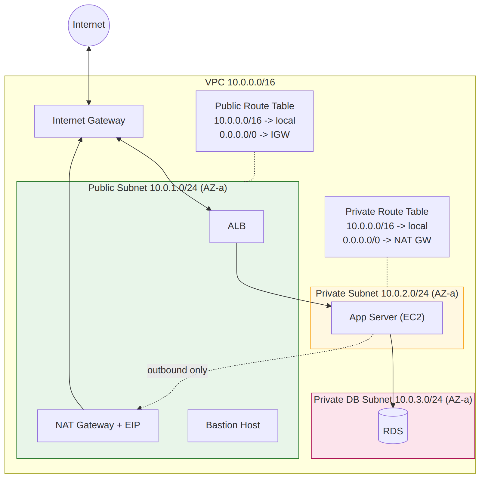

# 📚 Day 8 — VPC Core Components & CIDR

> 📊 **Visual Summary** — সহজে বোঝার জন্য diagram:




**সময়:** ১.৫ ঘণ্টা | **Module:** ২ (VPC Design & Network Architecture) — Day 1

## 🎯 আজকের লক্ষ্য
- VPC কী ও কেন দরকার বুঝবেন
- IP Address, CIDR notation, subnet math শিখবেন
- Public Subnet vs Private Subnet পার্থক্য
- Default VPC vs Custom VPC
- VPC planning — কীভাবে IP range choose করবেন
- Hands-on: একটা VPC conceptually design করা

---

## Part 1: VPC কেন দরকার?

### 🤔 AWS-এর Challenge

AWS-এর millions of customer একই data center share করছে। আপনার EC2 instance, আমার EC2 instance — সব physically একই জায়গায়।

**Problem:**
- আপনার server সরাসরি internet-এ exposed থাকলে নিরাপদ না
- অন্য customer-এর server আপনার network-এ দেখতে পারলে security disaster
- Corporate policy: "আমাদের network আলাদা থাকতে হবে"

**Solution: VPC।**

### 🏢 VPC কী?

**VPC = Virtual Private Cloud**

AWS-এর ভেতরে আপনার **নিজস্ব isolated network**। অন্য কেউ ঢুকতে পারে না, আপনিও অন্যের VPC-তে যেতে পারেন না (default-এ)।

### 🏘️ Analogy: Gated Community

ভাবুন একটা বিশাল শহর (AWS) যেখানে অনেক gated community (VPCs) আছে:

- প্রতিটা community-র নিজস্ব address range
- প্রতিটা community-র নিজস্ব gate (Internet Gateway)
- Community-র ভেতরে বিভিন্ন পাড়া (Subnets)
- কেউ ভেতরে ঢুকতে হলে permission লাগবে
- Community-র ভেতরের সবাই সবার সাথে যোগাযোগ করতে পারে

আপনার VPC = আপনার gated community।

---

## Part 2: VPC-এর Key Characteristics

### ১. Region-bound
- VPC একটা specific region-এ তৈরি হয়
- অন্য region-এ copy করা যায় না (নতুন বানাতে হবে)
- Multi-region application চাইলে multiple VPC লাগবে

### ২. Multi-AZ Spanning
- একটা VPC region-এর সব AZ-তে span করে
- Subnets specific AZ-এ create হয়
- Multi-AZ deployment সম্ভব এক VPC-তেই

### ৩. Logically Isolated
- Default-এ সম্পূর্ণ isolated
- External connection আপনি explicit allow করেন (IGW, VPN, Peering)

### ৪. Customizable
- আপনার নিজস্ব IP range
- আপনার subnet design
- আপনার routing

### ৫. Default VPC আছে
- Account তৈরি করলে প্রতি region-এ একটা Default VPC automatic থাকে
- পুরোপুরি configured, internet connectivity সহ
- Quick start-এর জন্য perfect

### ৬. Free
- VPC তৈরি করা free
- Data transfer, specific services (NAT Gateway, VPN)-এ charge

---

## Part 3: IP Address Basics

VPC বুঝতে হলে IP address ভালোভাবে বুঝতে হবে। এটা AWS-এর foundation।

### 🔢 IPv4 Address কী?

**32-bit number, ৪টা অংশে divided (4 octets)।**

Format: `xxx.xxx.xxx.xxx`

Each octet: 0-255 (8 bits, 2^8 = 256 values)

**Examples:**
- `192.168.1.1`
- `10.0.0.5`
- `172.16.55.200`

**Binary representation:**
```
192.168.1.1

192 → 11000000
168 → 10101000
1   → 00000001
1   → 00000001

Full: 11000000.10101000.00000001.00000001 (32 bits)
```

### 🏡 Private vs Public IP

#### Private IP Ranges (RFC 1918)

Internet-এ route হয় না, শুধু local network-এ use:

| Range | CIDR | Total IPs |
|---|---|---|
| `10.0.0.0` to `10.255.255.255` | `10.0.0.0/8` | ~16.7 million |
| `172.16.0.0` to `172.31.255.255` | `172.16.0.0/12` | ~1 million |
| `192.168.0.0` to `192.168.255.255` | `192.168.0.0/16` | ~65,536 |

**VPC সবসময় private IP range-এ তৈরি হয়।**

#### Public IP
- Internet-routable
- Unique globally
- ISP বা AWS allocate করে
- যেমন: `54.203.12.45`

---

## Part 4: CIDR Notation — সবচেয়ে Important

**CIDR = Classless Inter-Domain Routing**

এটা VPC শেখার **সবচেয়ে গুরুত্বপূর্ণ concept**। সময় নিয়ে ভালোভাবে বুঝুন।

### 📝 CIDR Format

`IP_address/prefix_length`

**Examples:**
- `10.0.0.0/16`
- `192.168.1.0/24`
- `172.16.0.0/12`

### 🔑 The `/number` — কী বোঝায়?

**Prefix length = কতগুলো bit "fixed" (network portion)।**

Total 32 bits। `/16` মানে প্রথম ১৬ bit fixed, বাকি ১৬ bit variable।

**Example: `10.0.0.0/16`**

```
Binary: 00001010.00000000.00000000.00000000
        ↑ First 16 bits ↑  ↑ Last 16 bits ↑
           FIXED              VARIABLE
```

First 16 bits always `00001010.00000000` (= `10.0`)
Last 16 bits change → `0.0` to `255.255`

**So range:**
- `10.0.0.0` to `10.0.255.255`
- Total IPs = 2^16 = **65,536 addresses**

---

### 🧮 CIDR Math — Formula

**Total IPs = 2^(32 - prefix)**

| CIDR | Calculation | Total IPs | Range Example |
|---|---|---|---|
| `/8` | 2^24 | 16,777,216 | `10.0.0.0 - 10.255.255.255` |
| `/16` | 2^16 | 65,536 | `10.0.0.0 - 10.0.255.255` |
| `/20` | 2^12 | 4,096 | `10.0.0.0 - 10.0.15.255` |
| `/24` | 2^8 | 256 | `10.0.0.0 - 10.0.0.255` |
| `/26` | 2^6 | 64 | `10.0.0.0 - 10.0.0.63` |
| `/28` | 2^4 | 16 | `10.0.0.0 - 10.0.0.15` |
| `/32` | 2^0 | 1 | `10.0.0.0` (exact single IP) |

### 📏 ছোট vs বড় Prefix

**Rule: ছোট number = বড় network।**

- `/8` = HUGE network (16M IPs)
- `/16` = Big (65K)
- `/24` = Medium (256)
- `/28` = Small (16)
- `/32` = Single IP

---

### 🎯 Common CIDR Patterns

**/16 (Most common for VPC)**
- 65,536 IPs
- Enough for years of growth
- `10.0.0.0/16`

**/24 (Common for Subnets)**
- 256 IPs (AWS-এ 251 usable)
- Perfect subnet size
- `10.0.1.0/24`

**/32 (Single IP)**
- Used in Security Group rules
- "Only this exact IP"
- `203.0.113.45/32`

**/0 (Everything)**
- `0.0.0.0/0` = all IPs on the internet
- Used in route tables (default route)

---

## Part 5: AWS VPC CIDR Rules

### AWS-এর Restrictions:

**1. Allowed Prefix Range:** `/16` (largest) to `/28` (smallest)

আপনি `/8` দিয়ে VPC বানাতে পারবেন না। AWS limit `/16` সর্বোচ্চ।

**2. Can't overlap with AWS Reserved:**
- Don't use AWS service IPs

**3. Should use RFC 1918 Private Ranges:**
- `10.0.0.0/8`
- `172.16.0.0/12`
- `192.168.0.0/16`

**4. CIDR can be extended later:**
- মূল VPC-এ secondary CIDR add করা যায়
- Growth-এর জন্য flexibility

### 🏆 AWS Reserved IPs in Subnet

প্রতিটা AWS subnet-এ **৫টা IP reserved** থাকে (আপনি use করতে পারবেন না):

**Example subnet: `10.0.1.0/24`** (256 IPs total)

| IP | Reserved For |
|---|---|
| `10.0.1.0` | Network address |
| `10.0.1.1` | VPC router |
| `10.0.1.2` | DNS server (AWS) |
| `10.0.1.3` | Future use |
| `10.0.1.255` | Broadcast address |

**Usable IPs:** 256 - 5 = **251**

**Important:** `/28` subnet (16 IPs) → usable only 11।

---

## Part 6: Subnets — VPC-এর ভেতরে বিভাজন

### 🏘️ Subnet কী?

**Subnet = VPC-র ভেতরে IP range-এর একটা "ভাগ"।**

একটা VPC-কে ছোট ছোট সেকশনে ভাগ করে বিভিন্ন কাজের জন্য আলাদা করা।

### 🗺️ Subnet Structure Example

**VPC: `10.0.0.0/16` (65,536 IPs)**

এটা আপনি ভাগ করতে পারেন:

```
VPC: 10.0.0.0/16
│
├── Subnet A (Public):  10.0.1.0/24   (AZ-a) — Web servers
├── Subnet B (Public):  10.0.2.0/24   (AZ-b) — Web servers
├── Subnet C (Private): 10.0.11.0/24  (AZ-a) — App servers
├── Subnet D (Private): 10.0.12.0/24  (AZ-b) — App servers
├── Subnet E (Private): 10.0.21.0/24  (AZ-a) — Database
└── Subnet F (Private): 10.0.22.0/24  (AZ-b) — Database
```

### 🏢 Subnet-এর Characteristics

**1. AZ-bound**
- একটা subnet **একটা specific AZ-এ** থাকে
- Multi-AZ subnet বানানো যায় না
- প্রতিটা AZ-এ আলাদা subnet লাগবে high availability-র জন্য

**2. IP Range = VPC-র ভেতরে**
- VPC: `10.0.0.0/16` → Subnet CIDR অবশ্যই এই range-এ
- Valid: `10.0.1.0/24`
- Invalid: `192.168.1.0/24` (VPC-র বাইরে)

**3. Subnets Don't Overlap**
- Same VPC-তে ২টা subnet overlap করতে পারে না
- `10.0.1.0/24` + `10.0.1.128/25` — overlap, not allowed

**4. Can be Public or Private**
- Default-এ সব subnet private
- Route table configuration-এ public/private ঠিক হয়

---

## Part 7: Public Subnet vs Private Subnet

এই পার্থক্য **critical** বুঝতে।

### 🌐 Public Subnet

**Definition:** যে subnet-এর Route Table-এ Internet Gateway-এর route আছে।

**Characteristics:**
- Direct internet access (incoming + outgoing)
- Instances-এ public IP / Elastic IP থাকলে internet-এ reach করা যায়
- Internet থেকেও reach করা যায় (SG permit করলে)

**Typical use:**
- Web servers
- Load balancers
- Bastion hosts (SSH jump box)
- NAT Gateway

**Route Table Example:**
```
Destination       Target
10.0.0.0/16      local          (VPC-র ভেতরে communication)
0.0.0.0/0        igw-xxxxx      (internet, IGW-এ route)
```

### 🔒 Private Subnet

**Definition:** Internet Gateway-এর direct route **নেই** যে subnet-এ।

**Characteristics:**
- Internet থেকে directly access করা যায় না
- Outgoing internet access NAT Gateway/Instance দিয়ে possible
- Maximum security
- Public IP assign করা যায় না (useless)

**Typical use:**
- Database servers (RDS, EC2-based)
- Application servers
- Internal services
- Sensitive workloads

**Route Table Example:**
```
Destination       Target
10.0.0.0/16      local          (VPC-র ভেতরে)
0.0.0.0/0        nat-xxxxx      (NAT Gateway, outgoing only)
```

বা আরো restrictive:
```
Destination       Target
10.0.0.0/16      local
```
(কোনো internet access নেই, সম্পূর্ণ isolated)

### 🎭 Public/Private-এর Difference Summary

| Feature | Public Subnet | Private Subnet |
|---|---|---|
| Route to IGW | হ্যাঁ | না |
| Internet from outside | হ্যাঁ | না |
| Internet to outside | হ্যাঁ | শুধু NAT দিয়ে |
| Public IP use | হ্যাঁ | না |
| Typical resource | Web server, LB | DB, App server |
| Security level | মাঝারি | সর্বোচ্চ |

---

## Part 8: Default VPC vs Custom VPC

### 🎁 Default VPC

**প্রতি region-এ automatic একটা Default VPC থাকে।**

**Default VPC Configuration:**
- CIDR: `172.31.0.0/16`
- 6টা subnet, প্রতিটা AZ-এ একটা `/20`
- সব subnet **Public** (IGW attached)
- সব instance automatic public IP পায়
- Default Security Group
- Default NACL (all allow)

**Use case:**
- Quick start, learning
- Simple applications
- Testing

**সমস্যা:**
- Customization কম
- সব public = security compromise
- Production-এ না

### 🛠️ Custom VPC

**আপনি নিজে design করা VPC।**

**সুবিধা:**
- IP range choose করতে পারবেন
- Public + Private subnet mix
- Custom routing
- Custom security
- Production-ready design

**Steps to create:**
1. CIDR choose করুন (যেমন `10.0.0.0/16`)
2. Subnets create (multiple AZ-তে)
3. Internet Gateway attach
4. Route Tables configure
5. Security Groups ready
6. Instances launch

আমরা Day 9 থেকে এগুলো বিস্তারিত দেখব।

---

## Part 9: VPC Planning — Real-world Design

একটা VPC design করতে গেলে কী কী বিবেচনা করবেন?

### 🎯 Step 1: CIDR Block Choose

**প্রশ্ন নিজেকে:**
- How many IPs might I need? (current + future)
- Will this VPC connect with on-premise network?
- Will this VPC peer with other VPCs?

**Best Practice:**
- Use `10.0.0.0/16` (65K IPs, plenty)
- On-premise network-এর সাথে overlap avoid করুন
- Multiple VPC plan থাকলে আলাদা range (e.g., `10.0.0.0/16`, `10.1.0.0/16`)

**Anti-patterns:**
- `192.168.0.0/24` — too small (256 IPs only)
- Overlapping with home WiFi (`192.168.1.0/24`) — problematic for VPN
- `172.16.0.0/16` + on-premise `172.16.0.0/12` = overlap

### 🗺️ Step 2: Subnet Design

**Rule of thumb:**
- **Multi-AZ:** Minimum 2 AZ, ideal 3
- **Multi-tier:** Public + Private separation
- **Subnet size:** `/24` typical (256 IPs each)

**Example Design for 3-tier web app:**

```
VPC: 10.0.0.0/16

Public Tier (Web/LB):
├── Public-1a: 10.0.1.0/24    (AZ-a)
├── Public-1b: 10.0.2.0/24    (AZ-b)
└── Public-1c: 10.0.3.0/24    (AZ-c)

App Tier (Private):
├── App-1a: 10.0.11.0/24      (AZ-a)
├── App-1b: 10.0.12.0/24      (AZ-b)
└── App-1c: 10.0.13.0/24      (AZ-c)

Database Tier (Private):
├── DB-1a: 10.0.21.0/24       (AZ-a)
├── DB-1b: 10.0.22.0/24       (AZ-b)
└── DB-1c: 10.0.23.0/24       (AZ-c)
```

**Numbering Logic:**
- 1-10 range: Public
- 11-20 range: App
- 21-30 range: DB

Pattern দেখলেই বোঝা যায় কোনটা কোন tier।

### 📐 Step 3: Size Planning

**Subnet size depend করে:**

| Use Case | Recommended Size |
|---|---|
| Small test env | /28 (16 IPs) |
| Typical application | /24 (256) |
| Medium app | /22 (1,024) |
| Container workload (many IPs) | /20 (4,096) |
| Lambda VPC | /22 or bigger |

**Future growth:** ২-৩x বেশি size নিন।

### 🔒 Step 4: Security Tier Separation

**Principle:** Defense in depth

```
Internet
   │
   ▼
[Public Subnet] - Load Balancer (exposed)
   │
   ▼
[Private Subnet] - App Servers (not internet-accessible)
   │
   ▼
[Private Subnet] - Database (most protected)
```

Database-এ যেতে হলে App server হয়ে যেতে হবে, Public থেকে direct না।

---

## Part 10: IPv6 Support

### 🆕 IPv6 আসছে

IPv4-এ public IP scarce হয়ে যাচ্ছে। IPv6 future।

**IPv6 Format:**
- 128-bit address (IPv4 32-bit)
- Hex notation: `2001:db8:85a3::8a2e:370:7334`
- Virtually unlimited addresses

**AWS IPv6:**
- Optional to enable in VPC
- CIDR `/56` provided by AWS (cannot choose)
- Can run dual-stack (IPv4 + IPv6)
- IPv6 addresses all **public** (no NAT needed)

**Current status:** Optional, gradually adopting। শেখার শুরুতে IPv4 focus করুন।

---

## Part 11: Default VPC — Hands-on Conceptual

আসুন Default VPC-এর structure দেখি:

### Default VPC Structure (Mumbai region):

```
Default VPC: 172.31.0.0/16

Default Subnets (one per AZ):
├── Subnet: 172.31.0.0/20  (AZ-a) - Public
├── Subnet: 172.31.16.0/20 (AZ-b) - Public
└── Subnet: 172.31.32.0/20 (AZ-c) - Public

Route Table:
- 172.31.0.0/16 → local
- 0.0.0.0/0 → igw-default

Internet Gateway: igw-default (attached)

Security Group (default): 
- Allow all internal
- Allow all outbound

NACL (default): 
- Allow all in/out
```

**এই reason-এ default VPC-তে instance launch করলে internet access থাকে।**

---

## Part 12: Subnet CIDR Breakdown Practice

**Exercise: VPC `10.0.0.0/16` কে ৩টা equal subnet-এ ভাগ করুন।**

**Solution:**
- Total IPs: 65,536
- 3 parts = ~21,000 each
- Closest: `/18` (16,384 IPs each) বা `/17` (32,768 each)

**With /18:**
- Subnet 1: `10.0.0.0/18` (10.0.0.0 - 10.0.63.255)
- Subnet 2: `10.0.64.0/18` (10.0.64.0 - 10.0.127.255)
- Subnet 3: `10.0.128.0/18` (10.0.128.0 - 10.0.191.255)
- Unused: 10.0.192.0 - 10.0.255.255 (future growth)

**Simpler with /24 (most common):**

```
10.0.1.0/24 → 256 IPs, AZ-a public
10.0.2.0/24 → 256 IPs, AZ-b public
10.0.3.0/24 → 256 IPs, AZ-c public
10.0.11.0/24 → private app AZ-a
... এবং অনেক room আছে growth-এর জন্য
```

---

## Part 13: Common VPC Mistakes

### ❌ Mistake 1: Too Small CIDR

**Example:** `192.168.0.0/24` — 256 IPs total

**Problem:** 3 subnet করলেই IPs ফুরিয়ে যায়। Scaling impossible।

**Fix:** Start with `/16` always (65K IPs)।

### ❌ Mistake 2: Overlapping with On-Premise

**Example:** Office network `10.0.0.0/16`, VPC also `10.0.0.0/16`

**Problem:** VPN/Direct Connect setup-এ conflict। Traffic ঠিক route হবে না।

**Fix:** Use different ranges (on-prem `10.0.0.0/16`, VPC `10.1.0.0/16`)।

### ❌ Mistake 3: Single AZ Deployment

**Problem:** AZ fail করলে পুরো app down।

**Fix:** Minimum 2 AZ। Subnets in each AZ।

### ❌ Mistake 4: All Subnets Public

**Problem:** Database internet-এ exposed। Hacker-দের invitation।

**Fix:** Tier separation — web public, app/db private।

### ❌ Mistake 5: Small Subnet-এ Lambda/Container

**Problem:** Lambda/ECS prime consume IPs fast। Subnet exhausted।

**Fix:** Large subnet (`/22` or `/20`) compute-heavy workload-এর জন্য।

---

## Part 14: VPC Sharing (Advanced)

**AWS Resource Access Manager (RAM)** দিয়ে VPC-র subnets অন্য AWS account-এর সাথে share করা যায়।

**Use case:**
- Large organization, multiple accounts
- Central network team VPC manage করে
- Application teams subnets use করে

**Module 6-এ বিস্তারিত আসবে।**

---

## 🎯 আজকের মূল Takeaways

1. **VPC** = AWS-এ আপনার isolated private network
2. **Region-bound, multi-AZ span** করে
3. **CIDR** = `IP/prefix` format, prefix = fixed bits
4. **Total IPs** = 2^(32 - prefix)
5. **Private IP ranges:** `10.0.0.0/8`, `172.16.0.0/12`, `192.168.0.0/16`
6. **AWS 5 IPs reserve** করে প্রতি subnet-এ
7. **Public Subnet** = IGW route আছে, **Private Subnet** = নেই
8. **Multi-AZ subnet design** = high availability
9. **3-tier design:** Public (web) → Private (app) → Private (db)
10. **Default VPC** quick start, **Custom VPC** production

---

## 📝 Self-check Questions

১. VPC কি multi-region হতে পারে?
২. `10.0.0.0/16`-এ কতগুলো IP আছে?
৩. `192.168.1.0/24` subnet-এ কতগুলো usable IP?
৪. AWS প্রতি subnet-এ কয়টা IP reserve করে?
৫. Public Subnet আর Private Subnet-এর পার্থক্য কী technically?
৬. একটা subnet কি multiple AZ-এ থাকতে পারে?
৭. Default VPC-এর CIDR block কী?
৮. `/16` আর `/24`-এ কোনটা বড় network?
৯. VPC CIDR-এ AWS-এর maximum prefix size কী?
১০. একটা 3-tier design describe করুন (Public/Private breakdown)।
১১. `172.16.0.0/12` range-এ কতগুলো IP?
১২. Default VPC-তে সব subnet public না private?
১৩. VPC overlap কেন problem?
১৪. Subnets design-এ numbering convention কেন important?
১৫. Lambda-র জন্য বড় subnet কেন দরকার?

---

## 💡 Pro Tips

- **Always use `10.0.0.0/16`** for VPC — simplest, enough space
- **Subnet naming convention:** tier-az (like `web-1a`, `db-2c`)
- **Document your VPC design** — Excel sheet-এ IP plan
- **Plan for 3x growth** — subnet size choose করার সময়
- **Multi-AZ from Day 1** — পরে retrofit difficult
- **Non-overlapping ranges** multi-VPC environment-এ
- **Reserve a `/24`** for future use per VPC

---

## 🎨 Visual: VPC Hierarchy

```
AWS Account
│
└── Region (Mumbai)
    │
    └── VPC (10.0.0.0/16)
        │
        ├── AZ-a
        │   ├── Public Subnet (10.0.1.0/24)
        │   ├── App Subnet (10.0.11.0/24)
        │   └── DB Subnet (10.0.21.0/24)
        │
        ├── AZ-b
        │   ├── Public Subnet (10.0.2.0/24)
        │   ├── App Subnet (10.0.12.0/24)
        │   └── DB Subnet (10.0.22.0/24)
        │
        └── AZ-c
            ├── Public Subnet (10.0.3.0/24)
            ├── App Subnet (10.0.13.0/24)
            └── DB Subnet (10.0.23.0/24)
```

এই diagram আপনার memory-তে fix করুন। Module 2-এর সব আলোচনা এই structure-এর উপর।

---

## 🚨 Real-world Design Story

**Story 1:** একটা startup `192.168.0.0/24` দিয়ে VPC বানাল। ৬ মাসে ২৫০+ instance/container চলল। IP ফুরিয়ে গেল। পুরো infrastructure redesign + migrate — ২ সপ্তাহের downtime।

**Moral:** Start large (/16), even if now only 10 servers।

**Story 2:** Enterprise-এ on-premise `10.0.0.0/16`, AWS VPC-ও `10.0.0.0/16`। VPN setup-এ route table conflict। কোনটা office, কোনটা AWS — traffic confused।

**Moral:** Plan IP ranges globally।

---

## 🔜 সামনের Days — Module 2 Preview

**Day 9:** Subnets (Public vs Private deeper), Internet Gateway, Route Tables
**Day 10:** Network ACL vs Security Groups (detailed comparison)
**Day 11:** NAT Gateway vs NAT Instance, Bastion Host
**Day 12:** VPC Endpoints (Interface vs Gateway), PrivateLink
**Day 13:** Route 53 Resolver, DHCP Options, EIP, IPv6
**Day 14:** Network Design Patterns, Hub-and-Spoke, Module 2 Revision

---
