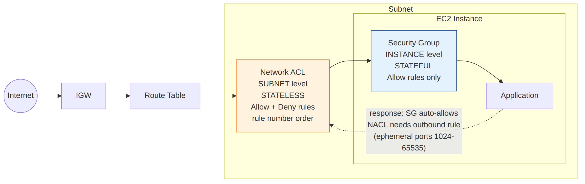

# 📚 Day 10 — Network ACL vs Security Group

> 📊 **Visual Summary** — সহজে বোঝার জন্য diagram:




**সময়:** ১.৫ ঘণ্টা | **Module:** ২ (VPC Design & Network Architecture) — Day 3

## 🎯 আজকের লক্ষ্য
- Security Group (SG) এবং Network ACL (NACL) — দুটোর architecture বুঝবেন
- Stateful vs Stateless firewall — মূল পার্থক্য
- Inbound vs Outbound rule গভীরে
- Layer-by-layer defense (Defense in Depth)
- কখন কোনটা ব্যবহার, কখন দুটো একসাথে
- Real-world configuration ও troubleshooting

---

## Part 1: Firewall Basics — ভিত্তি বুঝুন

### 🛡️ Firewall কী?

**Firewall = network traffic-এর gate keeper।**

Traffic আসছে/যাচ্ছে — Firewall rules check করে decide করে: "এটা allow করব না block?"

### 🏠 Analogy: বাড়ির Security

ভাবুন একটা apartment building:

**Building Gate (NACL-এর মতো):**
- Building-এ কে ঢুকবে কে বের হবে check করে
- General rules ("delivery man-রা lobby পর্যন্ত যেতে পারবে")
- Building-level decision

**Apartment Door (SG-এর মতো):**
- প্রতিটা apartment-এর নিজস্ব door
- Resident-specific rules ("শুধু আমার বন্ধুরা ঢুকবে")
- Apartment-level decision

দুটো guard একসাথে কাজ করে — building gate পার করে আসলেই apartment-এ ঢোকা যাবে না, dual check।

AWS-এও same — **NACL = subnet level, SG = instance level**।

### 🎭 Defense in Depth — Multiple Layers

Security-এর core principle: **একটা layer fail করলেও অন্যটা protect করবে।**

AWS-এর security layers:

```
Internet
   │
   ▼
[AWS Edge - DDoS Protection]
   │
   ▼
[Network Firewall (optional)]
   │
   ▼
[Network ACL — Subnet level]
   │
   ▼
[Security Group — Instance level]
   │
   ▼
[OS Firewall - iptables/Windows Firewall]
   │
   ▼
[Application Security]
```

আজ NACL আর SG-তে focus।

---

## Part 2: Security Group (SG) — Recap + Deeper

আগে Day 3-এ basic আলোচনা হয়েছে। আজ আরও গভীরে।

### 🛡️ Security Group কী?

**Security Group = EC2 instance-এর virtual firewall।**

Instance-এর Network Interface (ENI)-এ attach হয়।

### 🔑 SG-এর ৫টা Critical Properties

#### 1. Stateful

**মানে:** SG outgoing connection track করে। Reply automatic allow।

**Example:**
- Instance থেকে `google.com`-এ request যাচ্ছে (outbound port 443)
- Google reply পাঠাচ্ছে (inbound port 443)
- **আপনি inbound port 443 explicitly allow করেননি, তবু reply আসবে**
- কারণ SG state remember রাখে — "এই connection আমিই শুরু করেছি, reply allow"

#### 2. Allow Rules Only

**মানে:** শুধু "Allow" rule লেখা যায়, "Deny" না।

**Default behavior:**
- Inbound: সব **deny** (যা explicitly allow না)
- Outbound: সব **allow**

**Implication:** "এই IP block করো" — এটা SG-তে possible না। NACL-এ possible।

#### 3. Instance-Level Application

**মানে:** SG attach হয় ENI-তে, subnet-এ না।

একই subnet-এ ১০টা instance থাকতে পারে:
- কিছু এক SG use করে
- কিছু আরেক SG use করে
- কিছু multiple SG use করে

**Subnet-এর সাথে SG-র সরাসরি সম্পর্ক নেই।**

#### 4. Multiple SGs per Instance

**একটা instance-এ ৫টা পর্যন্ত SG attach করা যায় (default, request করে বাড়ানো)।**

**Multiple SG-র effect:** Union of all rules।

**Example:**
- SG-A allows port 22 from office IP
- SG-B allows port 80 from anywhere
- Instance-এ both attached
- Effective: port 22 (office) + port 80 (everywhere)

কোনো deny নেই, যেহেতু SG-তে deny নেই। Just ADD rules।

#### 5. Source/Destination Flexibility

Source/Destination হিসেবে use করা যায়:
- IP address (`203.0.113.45/32`)
- IP range (`10.0.0.0/16`)
- Another Security Group (powerful!)
- Prefix list

---

### 🔄 SG Stateful Behavior — গভীরে

এটা SG-র সবচেয়ে important feature। বুঝতেই হবে।

#### Connection Tracking

প্রতিটা connection-এর জন্য SG track করে:
- Source IP, Source Port
- Destination IP, Destination Port
- Protocol (TCP/UDP)
- Connection state (NEW, ESTABLISHED, etc.)

#### Example Scenario:

**Setup:**
- EC2 instance with SG
- Outbound: All allowed (default)
- Inbound: Only port 22 (SSH)

**Action:** Instance থেকে `curl https://google.com`

**Step-by-step:**

1. **Outbound packet:**
   - Source: instance:54321
   - Dest: google:443
   - SG checks outbound: allowed ✓
   - SG **records this connection in state table**

2. **Reply from Google:**
   - Source: google:443
   - Dest: instance:54321
   - Inbound port 54321 not in SG rules
   - **But SG checks state table** → "this is reply to existing connection"
   - **Allowed automatically** ✓

**মূল কথা:** SG কে শুধু **request initiation** allow করতে হয়, reply আপনাআপনি পাবেন।

#### Stateful-এর Implication

**Inbound traffic-এ:**
- Outside থেকে কেউ request পাঠাচ্ছে (NEW connection)
- SG inbound rule check করে
- Allow হলে reply automatic outbound (state-এর কারণে)

**Outbound traffic-এ:**
- Instance থেকে request যাচ্ছে (NEW connection)
- SG outbound rule check করে
- Allow হলে reply automatic inbound

---

### 📋 SG Rule Components — গভীরে

প্রতিটা SG rule-এ:

| Field | Purpose | Example |
|---|---|---|
| **Type** | Pre-built protocol type | SSH, HTTP, Custom TCP |
| **Protocol** | TCP/UDP/ICMP/All | TCP |
| **Port Range** | Single or range | 22, 80, 8080-8090 |
| **Source/Destination** | Where from/to | 0.0.0.0/0, sg-xxx |
| **Description** | Documentation | "SSH from office" |

#### Type-এর Magic

Type select করলে protocol + port auto-fill হয়:
- "SSH" → TCP, Port 22
- "HTTP" → TCP, Port 80
- "HTTPS" → TCP, Port 443
- "MySQL" → TCP, Port 3306
- "RDP" → TCP, Port 3389

Custom port চাইলে "Custom TCP/UDP"।

#### ICMP — Ping Allow করতে

```
Type: All ICMP - IPv4
Protocol: ICMP
Source: 0.0.0.0/0 (anyone can ping)
```

Default-এ ICMP block থাকে। Ping চাইলে explicit add।

---

### 🎨 SG-এর Powerful Feature: SG as Source

এটা SG-র killer feature।

#### Traditional firewall:
- Source = IP address
- IP change হলে rule update

#### SG:
- Source = অন্য SG
- IP নিয়ে চিন্তা নেই
- Auto-tracking

#### Example:

**3-Tier Setup:**
- Web tier instances: attached to `sg-web`
- App tier instances: attached to `sg-app`
- DB tier instances: attached to `sg-db`

**SG Rules:**

```
sg-web:
- Inbound: HTTP/HTTPS from 0.0.0.0/0 (public)
- Inbound: SSH from office IP

sg-app:
- Inbound: Port 8080 from sg-web (only web tier)
- Inbound: SSH from office IP

sg-db:
- Inbound: Port 3306 (MySQL) from sg-app (only app tier)
- Inbound: SSH from office IP
```

**Magic:**
- Web tier scale up করলে নতুন instance-ও sg-web পাবে
- App tier-এর traffic accept হবে
- IP nothing manage করতে হবে
- New instance auto-trusted

**ছাড়া হবে যদি IP-based হতো:**
- প্রতিটা instance-এর IP add করতে হতো
- Auto Scaling-এ chaos
- Maintenance nightmare

---

### 🔗 Default Security Group

**প্রতিটা VPC-তে একটা "default" SG আছে।**

**Default SG rules:**

**Inbound:**
- Allow all from same SG (instances in default SG can talk to each other)

**Outbound:**
- Allow all (anywhere)

**Behavior:**
- Default SG attach করা সব instance একে অপরের সাথে communicate করতে পারে
- External access-এর জন্য আলাদা SG লাগবে

**Best practice:** Default SG modify না করে নিজস্ব SG use করুন।

---

### 🎯 Common SG Patterns

#### Pattern 1: Web Server

```
sg-webserver:
Inbound:
- HTTP (80) from 0.0.0.0/0
- HTTPS (443) from 0.0.0.0/0
- SSH (22) from your-office-IP/32

Outbound:
- All traffic (default)
```

#### Pattern 2: App Server (Behind LB)

```
sg-appserver:
Inbound:
- Port 8080 from sg-loadbalancer
- SSH (22) from sg-bastion

Outbound:
- All traffic
```

#### Pattern 3: Database

```
sg-database:
Inbound:
- Port 3306 from sg-appserver
- SSH (22) from sg-bastion (rarely)

Outbound:
- All traffic (or restricted)
```

#### Pattern 4: Bastion/Jump Host

```
sg-bastion:
Inbound:
- SSH (22) from your-office-IP/32

Outbound:
- All traffic
```

#### Pattern 5: Load Balancer

```
sg-loadbalancer:
Inbound:
- HTTP (80) from 0.0.0.0/0
- HTTPS (443) from 0.0.0.0/0

Outbound:
- All traffic (or specific to backend)
```

---

## Part 3: Network ACL (NACL) — পুরোপুরি ভিন্ন

### 🛡️ NACL কী?

**NACL = Subnet-level firewall।**

Subnet-এ ঢোকা/বের হওয়া সব traffic check করে।

### 🆚 NACL vs SG — মূল পার্থক্য

এই tablet মুখস্থ করুন:

| Feature | Security Group | Network ACL |
|---|---|---|
| **Level** | Instance (ENI) | Subnet |
| **State** | Stateful | Stateless |
| **Rules** | Allow only | Allow + Deny |
| **Default inbound** | Deny all | Allow all |
| **Default outbound** | Allow all | Allow all |
| **Rule evaluation** | All rules together | Numbered, in order |
| **Source/Dest** | IP, SG, Prefix list | IP only (no SG) |
| **Multiple per resource** | 5 SGs/instance | 1 NACL/subnet |

---

### 🔄 Stateless — এটা কী?

**Stateless = "memory নেই"।** Each packet independently check।

#### Stateless Behavior:

**Outbound packet (instance → google):**
- NACL outbound rules check
- Allow হলে যাবে
- **State save নেই**

**Inbound reply (google → instance):**
- NACL inbound rules check **separately**
- Outbound allow ছিল কি না — মাথায় নেই
- Inbound rule explicitly need

#### Implication:

**SG-তে:** Outbound allow → reply automatic
**NACL-তে:** Outbound allow করতে হবে + Inbound-ও explicit allow করতে হবে

#### Example:

EC2 → google.com (HTTPS)

**Working SG:**
- Outbound: allow (default)
- Inbound: not needed (stateful)

**Working NACL:**
- Outbound rule: TCP 443 to 0.0.0.0/0 — Allow
- **Inbound rule: TCP from 1024-65535 to 0.0.0.0/0 — Allow** (ephemeral ports for reply!)

**দুটো-ই need!**

---

### 🔢 NACL Rules — Numbered & Ordered

NACL-এর rules sequentially evaluate হয় **rule number অনুযায়ী**।

#### Default NACL:

**Inbound:**
| Rule # | Type | Protocol | Port | Source | Allow/Deny |
|---|---|---|---|---|---|
| 100 | All | All | All | 0.0.0.0/0 | ALLOW |
| * | All | All | All | 0.0.0.0/0 | DENY |

**Outbound:**
| Rule # | Type | Protocol | Port | Destination | Allow/Deny |
|---|---|---|---|---|---|
| 100 | All | All | All | 0.0.0.0/0 | ALLOW |
| * | All | All | All | 0.0.0.0/0 | DENY |

**Special:** Rule `*` (asterisk) = catch-all DENY। Cannot be modified or deleted।

#### Rule Evaluation Logic:

1. Start with rule number 100 (lowest)
2. Check if packet matches
3. If match: apply ALLOW or DENY (stop checking)
4. If no match: go to next rule (higher number)
5. If reach `*` (asterisk): DENY

#### Example Custom NACL:

**Inbound:**
| Rule # | Type | Source | Allow/Deny |
|---|---|---|---|
| 100 | HTTP | 0.0.0.0/0 | ALLOW |
| 110 | HTTPS | 0.0.0.0/0 | ALLOW |
| 120 | SSH | 203.0.113.0/24 | ALLOW |
| 130 | All | 198.51.100.0/24 | DENY |
| * | All | 0.0.0.0/0 | DENY |

**Reading:**
- Web traffic from anywhere — allowed
- SSH only from specific range
- Specific bad range — explicitly denied
- Everything else — denied

**Important:** Rule order matters! Number ছোট = priority বেশি।

#### Rule Numbering Best Practice:

- Use increments of 10 or 100 (10, 20, 30 or 100, 200, 300)
- Future-এ middle-এ rule add করা সহজ
- Rule 105 fits between 100 and 110

---

### 📋 NACL Default vs Custom

#### Default NACL

VPC তৈরির সাথে auto-create:
- Allow all inbound
- Allow all outbound
- Initially attached to all subnets

**Behavior:** No restriction। SG-ই main protection।

#### Custom NACL

**Default state when created:**
- DENY all inbound
- DENY all outbound

**আপনাকে explicit ALLOW rules add করতে হবে।**

**সতর্কতা:** Custom NACL তৈরি করে subnet-এ apply করলে — আপনি explicit allow না দিলে সব traffic block!

---

### 🌐 NACL-এ Ephemeral Ports — Critical Concept

NACL-এ অনেক জায়গায় "ephemeral ports" শুনবেন। এটা ভালোভাবে বুঝতে হবে।

#### Ephemeral Port কী?

**Ephemeral port = client-side connection-এর জন্য temporary, random port।**

#### Example:

আপনার laptop থেকে `google.com:443`-এ HTTPS request।

**Source:** Your laptop, port `54321` (random, ephemeral)
**Destination:** Google server, port `443` (well-known)

**Reply আসবে:**
**Source:** Google, port `443`
**Destination:** Your laptop, port `54321`

#### Range:

Different OS-এ different range:
- **Linux:** 32768-60999
- **Windows 10+:** 49152-65535
- **AWS conservative:** 1024-65535

#### NACL-এ কেন Matter?

EC2 instance থেকে google.com-এ HTTPS request।

**Outbound (request):**
- Source port: ephemeral (32768-60999)
- Dest port: 443

**Inbound (reply):**
- Source port: 443
- Dest port: ephemeral (32768-60999)

**NACL Configuration (stateless):**

```
Outbound:
| 100 | TCP | 443 | 0.0.0.0/0 | ALLOW |  (allow request)

Inbound:
| 100 | TCP | 32768-60999 | 0.0.0.0/0 | ALLOW |  (allow reply!)
```

**দুটোই দরকার! এটাই stateless-এর জটিলতা।**

#### Common Mistake:

Developer outbound 443 allow করে, ভাবে done। কিন্তু inbound ephemeral ports allow করে না। Result: connection works না।

---

### 🎯 NACL Application Patterns

#### Pattern 1: Default Allow-All NACL (Simple)

```
Inbound:
| 100 | All | All | 0.0.0.0/0 | ALLOW |

Outbound:
| 100 | All | All | 0.0.0.0/0 | ALLOW |
```

**Use:** Small environment, SG-on primary protection।

#### Pattern 2: Block Specific Bad IPs

```
Inbound:
| 100 | All | All | bad-IP-range/24 | DENY |
| 200 | All | All | 0.0.0.0/0 | ALLOW |

Outbound:
| 100 | All | All | 0.0.0.0/0 | ALLOW |
```

**Use:** Known malicious IPs block।

#### Pattern 3: Web Subnet Strict NACL

```
Inbound:
| 100 | HTTP | 80 | 0.0.0.0/0 | ALLOW |
| 110 | HTTPS | 443 | 0.0.0.0/0 | ALLOW |
| 120 | SSH | 22 | office-IP/32 | ALLOW |
| 130 | TCP | 1024-65535 | 0.0.0.0/0 | ALLOW |  (ephemeral for replies)
| * | All | All | 0.0.0.0/0 | DENY |

Outbound:
| 100 | HTTP | 80 | 0.0.0.0/0 | ALLOW |
| 110 | HTTPS | 443 | 0.0.0.0/0 | ALLOW |
| 120 | TCP | 1024-65535 | 0.0.0.0/0 | ALLOW |  (ephemeral for outgoing)
| * | All | All | 0.0.0.0/0 | DENY |
```

**Use:** Strict subnet, explicit traffic only।

---

## Part 4: SG vs NACL — Complete Comparison

### 📊 Side-by-Side Comparison

| Aspect | Security Group | NACL |
|---|---|---|
| **Scope** | Instance (ENI) | Subnet |
| **State** | Stateful (smart) | Stateless (manual) |
| **Rule Types** | Allow only | Allow + Deny |
| **Rule Order** | All rules together | Sequential by number |
| **Default Inbound** | Deny all | Default NACL: Allow / Custom: Deny |
| **Default Outbound** | Allow all | Default NACL: Allow / Custom: Deny |
| **Source as SG** | Yes | No |
| **Multiple per resource** | 5 SG/instance | 1 NACL/subnet |
| **Per VPC quota** | 2,500 | 200 |
| **Rules per resource** | 60 (60 in + 60 out) | 20 (or 40 with hard limit) |
| **Use as primary security** | Yes | Supplementary |
| **Best for** | Granular instance control | Subnet-wide policies |

---

### 🎯 কোনটা কখন ব্যবহার?

#### Always Use SG (Primary Defense)

- SG হলো **primary firewall**
- Instance-level control
- Stateful (less work)
- IP/SG/Prefix list flexibility
- প্রতিটা production instance-এ থাকবে

#### Use NACL Selectively (When Needed)

NACL ব্যবহার করুন:

**1. Subnet-wide deny rules:**
- Specific bad IP range block (SG can't deny)
- Compliance-required restrictions

**2. Defense in depth:**
- Critical workloads
- Multiple security layers

**3. Subnet isolation:**
- Block all inter-subnet traffic
- Restrict by network segment

**4. Beyond SG capability:**
- Block-list specific IPs (SG-এ possible না)
- Network-wide policy

#### Don't Overuse NACL

- Stateless complexity
- Easy to misconfigure
- SG-তেই বেশিরভাগ use case cover

---

## Part 5: Practical Examples — Real Configurations

### Example 1: Public Web Server

**Subnet:** Public subnet
**Instance:** Web server with Apache

**SG Configuration (`sg-web`):**

```
Inbound:
- HTTP (80) from 0.0.0.0/0
- HTTPS (443) from 0.0.0.0/0
- SSH (22) from your-office-IP/32

Outbound:
- All traffic (default)
```

**NACL Configuration (subnet-wide):**

Default NACL (allow all) usually OK। কিন্তু strict-এ:

```
Inbound:
| 100 | HTTP | 80 | 0.0.0.0/0 | ALLOW |
| 110 | HTTPS | 443 | 0.0.0.0/0 | ALLOW |
| 120 | SSH | 22 | office-IP/32 | ALLOW |
| 130 | TCP | 1024-65535 | 0.0.0.0/0 | ALLOW (ephemeral) |
| * | DENY |

Outbound:
| 100 | All | All | 0.0.0.0/0 | ALLOW |
| * | DENY |
```

---

### Example 2: 3-Tier Application

**Architecture:**
- Web tier (public subnet)
- App tier (private subnet)
- DB tier (private subnet)

**Security Groups:**

```
sg-web:
Inbound: HTTP/HTTPS from 0.0.0.0/0
Outbound: TCP 8080 to sg-app

sg-app:
Inbound: TCP 8080 from sg-web
Outbound: TCP 3306 to sg-db

sg-db:
Inbound: TCP 3306 from sg-app
Outbound: None (or restricted)
```

**Result:**
- Web: only public traffic
- App: only from web tier
- DB: only from app tier

**NACL (subnet-wide):**
- Public subnet: allow web traffic
- Private subnets: usually default allow OK (SG controls)

---

### Example 3: Restrict Outgoing Internet

**Goal:** App server can update software but can't connect to arbitrary IPs।

**SG Configuration:**

```
sg-app:
Outbound:
- HTTP (80) to 0.0.0.0/0 (for updates)
- HTTPS (443) to 0.0.0.0/0
- DNS (53) to 0.0.0.0/0
- TCP 3306 to sg-db
- (no general outbound)
```

**NACL (additional layer):**

```
Outbound:
| 100 | HTTP | 80 | 0.0.0.0/0 | ALLOW |
| 110 | HTTPS | 443 | 0.0.0.0/0 | ALLOW |
| 120 | DNS | 53 | 0.0.0.0/0 | ALLOW |
| * | DENY |

Inbound (for return traffic):
| 100 | TCP | 1024-65535 | 0.0.0.0/0 | ALLOW |
| 110 | UDP | 1024-65535 | 0.0.0.0/0 | ALLOW (DNS reply) |
| * | DENY |
```

---

### Example 4: Block Known Bad Actor

**Scenario:** আপনার logs দেখে identify করেছেন `198.51.100.0/24` থেকে attack হচ্ছে।

**SG-এ কি deny করা যাবে?** না। SG শুধু allow।

**NACL-এ:**

```
Inbound:
| 50 | All | All | 198.51.100.0/24 | DENY |  (block first)
| 100 | HTTP | 80 | 0.0.0.0/0 | ALLOW |
| 110 | HTTPS | 443 | 0.0.0.0/0 | ALLOW |
...
```

**Important:** DENY rule SG-এ possible না, NACL-ই solution।

---

## Part 6: Stateful vs Stateless — Visual Understanding

### Scenario: Web Browser Visiting Site

**Setup:**
- User: `203.0.113.50:54321` (random ephemeral)
- EC2: `10.0.1.5` with public IP `54.203.12.45:80`

#### With SG (Stateful):

**Request:**
```
User → IGW → SG inbound check (port 80 from 0.0.0.0/0 ALLOW) → EC2
```

**Response:**
```
EC2 → SG (no outbound check needed, conn tracked) → IGW → User
```

**SG Configuration needed:**
- Inbound: Port 80 from 0.0.0.0/0
- Outbound: nothing extra (default allow)

#### With NACL (Stateless):

**Request:**
```
User → NACL inbound check (port 80 from 0.0.0.0/0) → SG check → EC2
```

**Response:**
```
EC2 → SG → NACL OUTBOUND check (port to ephemeral range!) → User
```

**NACL Configuration needed:**
- Inbound: Port 80
- **Outbound: Port 1024-65535** (for the response!)

**Without ephemeral outbound rule, response stuck।**

---

### Same Scenario, Reverse Direction

**EC2 makes outbound HTTPS to API:**

#### With SG:

**Request:**
```
EC2:54321 → SG (outbound default allow) → IGW → API:443
```

**Response:**
```
API:443 → IGW → SG (no inbound check, tracked) → EC2:54321
```

**SG Configuration:**
- Outbound: Default allow
- Inbound: nothing extra

#### With NACL:

**Request:**
```
EC2:54321 → NACL outbound check (port 443 to 0.0.0.0/0) → IGW → API
```

**Response:**
```
API:443 → IGW → NACL INBOUND check (port to 54321 — ephemeral) → EC2
```

**NACL Configuration:**
- Outbound: Port 443
- **Inbound: Port 1024-65535** (for the response!)

---

## Part 7: Defense in Depth Strategy

### 🛡️ Layered Security Model

একটা production VPC-তে সব layer একসাথে:

```
Internet
  │
  ▼
[CloudFront / WAF — Edge protection]
  │
  ▼
[Route 53 — DNS]
  │
  ▼
[ALB — Load Balancer]
  │
  ▼
[NACL — Subnet level]    ← Layer 1
  │
  ▼
[Security Group — Instance level]  ← Layer 2
  │
  ▼
[OS Firewall - iptables]   ← Layer 3
  │
  ▼
[Application Auth]    ← Layer 4
  │
  ▼
[Database Encryption]   ← Layer 5
```

প্রতিটা layer fail করলে পরের layer protect করে।

---

### 🎯 Security Best Practices

#### Layer 1: NACL (Subnet)

**Use for:**
- Wide-net policies
- Deny known bad actors
- Compliance restrictions
- Subnet isolation

**Don't use for:**
- Granular per-instance rules
- Frequent changes
- Primary firewall

#### Layer 2: Security Group (Instance)

**Use for:**
- Primary firewall
- Per-application rules
- Tier-to-tier access (SG as source)
- Most security needs

**Best practice:**
- One SG per role (web, app, db)
- Tag SGs clearly
- Document each rule
- Regular audit

---

## Part 8: SG and NACL Combined Behavior

### 🔍 Traffic Flow Through Both

**Inbound packet to instance:**

```
Internet
  │
  ▼
NACL Inbound Check
  │
  ▼ (if allowed)
SG Inbound Check
  │
  ▼ (if allowed)
Instance receives packet
```

**Reply from instance:**

```
Instance sends packet
  │
  ▼
SG Outbound Check (stateful — auto-allow if reply)
  │
  ▼
NACL Outbound Check (stateless — explicit rule needed)
  │
  ▼
Internet
```

### Truth Table:

| NACL Inbound | NACL Outbound | SG Inbound | SG Outbound | Result |
|---|---|---|---|---|
| Allow | Allow | Allow | Allow | ✅ Works |
| Allow | Allow | Allow | Deny | ⚠️ Request OK, Reply blocked by SG outbound |
| Allow | Deny | Allow | Allow | ❌ NACL blocks return |
| Deny | Allow | Allow | Allow | ❌ NACL blocks request |
| Allow | Allow | Deny | Allow | ❌ SG blocks request |

**Both must allow।**

---

## Part 9: Troubleshooting Connectivity Issues

### 🔧 Systematic Debugging

**Problem:** Can't connect to EC2 instance from internet.

**Step 1: Identify the connection**
- Source: my laptop (`203.0.113.50`)
- Destination: EC2 (`54.203.12.45:80`)
- Protocol: HTTP

**Step 2: Trace the path**

```
Laptop → Internet → IGW → Subnet → NACL → SG → ENI → EC2
```

**Step 3: Check each layer**

#### Check 1: VPC Connectivity
- IGW attached?
- Route table has 0.0.0.0/0 → IGW?

#### Check 2: NACL Inbound
- Port 80 from 0.0.0.0/0 allowed?
- Inbound rule number low enough?

#### Check 3: SG Inbound
- HTTP (80) inbound rule exists?
- Source matches my laptop's IP / 0.0.0.0/0?

#### Check 4: Instance OS
- Apache/Nginx running?
- iptables not blocking?

#### Check 5: Application
- Listening on port 80?
- Health endpoint responding?

#### For Reply Path (if outbound issue):

**SG outbound:** default allow OK
**NACL outbound:** ephemeral ports allowed?

---

### 🛠️ AWS Tools for Troubleshooting

#### VPC Reachability Analyzer

**What:** Source-destination test built into AWS।

**How:**
- Specify source (instance, IGW)
- Specify destination
- Run test
- Tool shows path or blocking layer

**Output example:**
```
Path: ✗
Blocked at: Security Group sg-xxx
Reason: No inbound rule for port 80
```

#### VPC Flow Logs

**What:** Network traffic logs (accept/reject) for ENI/subnet/VPC।

**Use:** Post-mortem analysis, "why was this blocked?"

**Sample log:**
```
2 123456789010 eni-1235b8ca123456789 203.0.113.50 10.0.1.5 22 32841 6 20 4249 1418530010 1418530070 REJECT OK
                                                     ^^^^^^                                              ^^^^^^
                                                     Source                                              Reject!
```

Day 8 module 8-এ আরও details আসবে।

---

## Part 10: Common Mistakes & Their Fixes

### ❌ Mistake 1: SG Outbound Default Allow

**Problem:** Default SG allows all outbound. Compromised instance can connect anywhere.

**Fix:** Production-এ outbound restrict করুন:
```
Outbound:
- HTTP/HTTPS for updates
- Specific app dependencies
- DNS
- Internal SGs
- Block else
```

### ❌ Mistake 2: NACL ephemeral Port Forgotten

**Problem:** Custom NACL with strict rules, forgot ephemeral ports.

**Fix:** Always allow ephemeral ports for return traffic:
```
Inbound and Outbound: TCP 1024-65535 ALLOW
```

### ❌ Mistake 3: SG Source 0.0.0.0/0 for SSH

**Problem:** SSH open to world, brute force attack.

**Fix:** Restrict to office IP:
```
SSH: from 203.0.113.0/24 (office) ONLY
```

### ❌ Mistake 4: Multiple SG Rules Conflict Confusion

**Problem:** Instance has 3 SGs, behavior unexpected.

**Reality:** SG rules are UNION (not conflict)। All rules combined apply।

**Fix:** Keep SGs simple, one role per SG.

### ❌ Mistake 5: NACL Rule Numbering Mistakes

**Problem:** Used rule numbers 1, 2, 3. Can't insert in middle.

**Fix:** Use 100, 200, 300 increments. Plenty of room.

### ❌ Mistake 6: Trusting NACL Alone

**Problem:** Set NACL strict, ignored SG.

**Reality:** SG is primary। NACL stateless complications।

**Fix:** Use both, but SG = main firewall.

### ❌ Mistake 7: Forgot Default NACL Allow All

**Problem:** "I configured everything strict, why traffic still works?"

**Reality:** Default NACL allows all. Need custom NACL or modify default.

---

## Part 11: Real-world Architecture Example

আসুন দেখি Day 9-এ design করা VPC-তে SG/NACL কেমন হবে।

### 🏗️ Architecture Recap

```
Public Subnet (Web/LB)
    │
Private Subnet (App)
    │
Private Subnet (DB)
```

### 🛡️ Security Groups Design

#### sg-alb (Load Balancer)
```
Inbound:
- HTTP (80) from 0.0.0.0/0
- HTTPS (443) from 0.0.0.0/0

Outbound:
- TCP 8080 to sg-app
```

#### sg-app (App Tier)
```
Inbound:
- TCP 8080 from sg-alb (only LB)
- SSH from sg-bastion

Outbound:
- TCP 3306 to sg-db
- HTTPS to 0.0.0.0/0 (updates via NAT)
- HTTP to 0.0.0.0/0 (updates)
```

#### sg-db (Database Tier)
```
Inbound:
- TCP 3306 from sg-app
- SSH from sg-bastion (rare)

Outbound:
- (nothing or restricted)
```

#### sg-bastion (Jump Host)
```
Inbound:
- SSH (22) from office-IP/32

Outbound:
- All (or restricted to internal SGs)
```

### 🛡️ NACL Design (Optional, defense in depth)

#### Public Subnet NACL
```
Inbound:
| 100 | HTTP | 80 | 0.0.0.0/0 | ALLOW |
| 110 | HTTPS | 443 | 0.0.0.0/0 | ALLOW |
| 120 | SSH | 22 | office-IP/32 | ALLOW |
| 130 | TCP | 1024-65535 | 0.0.0.0/0 | ALLOW (ephemeral) |
| * | DENY |

Outbound:
| 100 | All | All | 0.0.0.0/0 | ALLOW |
| * | DENY |
```

#### App Subnet NACL
```
Inbound:
| 100 | TCP | 8080 | 10.0.0.0/16 | ALLOW (within VPC) |
| 110 | SSH | 22 | 10.0.0.0/16 | ALLOW (bastion in VPC) |
| 120 | TCP | 1024-65535 | 0.0.0.0/0 | ALLOW (ephemeral for outbound replies) |
| * | DENY |

Outbound:
| 100 | TCP | 3306 | 10.0.0.0/16 | ALLOW (to DB) |
| 110 | HTTP | 80 | 0.0.0.0/0 | ALLOW (updates) |
| 120 | HTTPS | 443 | 0.0.0.0/0 | ALLOW |
| 130 | TCP | 1024-65535 | 10.0.0.0/16 | ALLOW (ephemeral inbound) |
| * | DENY |
```

#### DB Subnet NACL (Strictest)
```
Inbound:
| 100 | TCP | 3306 | 10.0.11.0/24 | ALLOW (only app subnet) |
| 110 | SSH | 22 | 10.0.1.0/24 | ALLOW (only bastion subnet) |
| 120 | TCP | 1024-65535 | 10.0.0.0/16 | ALLOW (ephemeral) |
| * | DENY |

Outbound:
| 100 | TCP | 1024-65535 | 10.0.11.0/24 | ALLOW (replies to app) |
| 110 | TCP | 1024-65535 | 10.0.1.0/24 | ALLOW (replies to bastion) |
| * | DENY |
```

**Beautiful security:** SG + NACL আবার application security + encryption — full defense in depth।

---

## 🎯 আজকের মূল Takeaways

1. **SG = instance level, stateful, allow only**
2. **NACL = subnet level, stateless, allow + deny**
3. **Stateful (SG)** mean reply automatic; **stateless (NACL)** mean explicit return rule needed
4. **Multiple SG per instance** = union of rules
5. **NACL rules numbered**, lower number = higher priority
6. **Default NACL = allow all**, Custom NACL = deny all initially
7. **Ephemeral ports critical** for NACL stateless behavior
8. **SG = primary firewall**, NACL = supplementary
9. **SG as source** = powerful (auto-tracking with scaling)
10. **Defense in depth** — multiple layers always

---

## 📝 Self-check Questions

১. SG stateful আর NACL stateless মানে কী?
২. SG-এ deny rule লেখা যায়?
৩. NACL-এর default-এ inbound কী?
৪. একটা instance-এ কয়টা SG attach করা যায়?
৫. একটা subnet-এ কয়টা NACL attach করা যায়?
৬. NACL rule-এ priority কীভাবে decide হয়?
৭. Ephemeral port কী এবং NACL-এ কেন matter?
৮. SG source হিসেবে আরেক SG use-এর benefit কী?
৯. SG আর NACL দুটো একসাথে কীভাবে কাজ করে?
১০. SG-এ outbound default কী?
১১. Custom NACL তৈরি করলে initial state কী?
১২. Bad IP block করতে SG না NACL?
১৩. Web tier থেকে App tier-এ traffic restrict করতে কী use?
১৪. NACL-এ rule number 50 আর 100 — কোনটা আগে evaluate?
১৫. Default SG-এর behavior কী?

---

## 💡 Pro Tips

- **SG as primary firewall**, NACL second layer
- **One SG per role** (web, app, db, bastion) — clean separation
- **Use SG references** instead of IP whenever possible
- **NACL rule numbers in increments of 10/100** — future flexibility
- **Document every rule** — description field use
- **Audit SGs quarterly** — unused/over-permissive remove
- **Restrict default SG** — modify to deny all, force explicit SG
- **Tag SGs and NACLs** consistently
- **VPC Flow Logs always enable** production-এ
- **Test with Reachability Analyzer** before production

---

## 🚨 Real-world Stories

**Story 1:** A startup left default SG outbound allow-all, app server compromised, attacker exfiltrated data. Lost millions in customer trust।

**Moral:** Restrict outbound SG production-এ।

**Story 2:** Developer made custom NACL strict but forgot ephemeral ports. App couldn't make any outbound calls. 4 hours debugging for ephemeral concept।

**Moral:** NACL ephemeral always remember।

**Story 3:** SG had SSH open to 0.0.0.0/0. Bot scanned, found weak password, mined crypto for 2 days. $5,000 bill।

**Moral:** SSH never `0.0.0.0/0`।

**Story 4:** Team thought NACL was their security. SG had everything open. Reality: SG was primary, NACL just supplementary। One SG misconfiguration = breach।

**Moral:** SG is the main firewall।

---

## 🎨 Visual Cheat Sheet

```
┌─────────────────────────────────────────┐
│           VPC                           │
│                                         │
│   ┌─────────────────────────────────┐  │
│   │       Subnet                    │  │
│   │  ╔══════════════════════════╗   │  │
│   │  ║  NACL (Stateless)        ║   │  │
│   │  ║  - Subnet boundary       ║   │  │
│   │  ║  - Allow + Deny          ║   │  │
│   │  ║  - Numbered rules        ║   │  │
│   │  ╚══════════════════════════╝   │  │
│   │                                 │  │
│   │   ┌─────────────────────┐       │  │
│   │   │  EC2 Instance       │       │  │
│   │   │  ┌──────────────┐   │       │  │
│   │   │  │ SG (Stateful)│   │       │  │
│   │   │  │ - Allow only │   │       │  │
│   │   │  │ - Auto reply │   │       │  │
│   │   │  └──────────────┘   │       │  │
│   │   └─────────────────────┘       │  │
│   │                                 │  │
│   └─────────────────────────────────┘  │
│                                         │
└─────────────────────────────────────────┘
```

---
