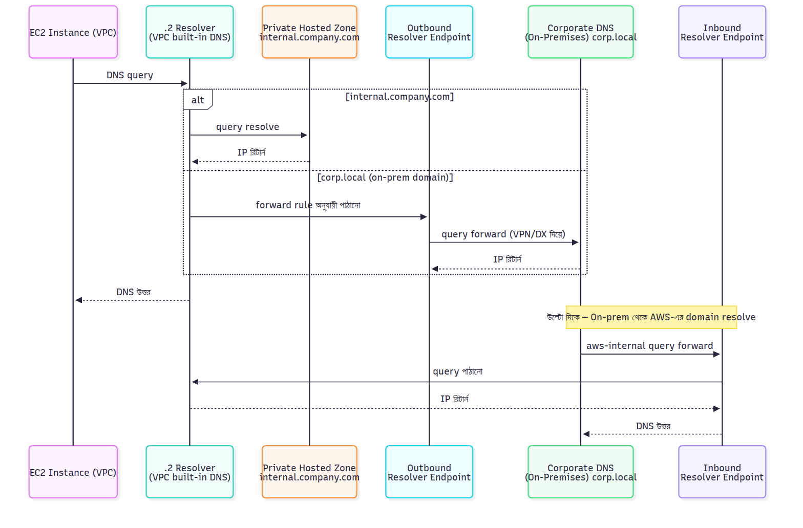

# 📚 Day 13 — Route 53 Resolver, DHCP Options, EIP & IPv6

> 📊 **Visual Summary** — সহজে বোঝার জন্য diagram:



**সময়:** ১.৫ ঘণ্টা | **Module:** ২ (VPC Design & Network Architecture) — Day 6

## 🎯 আজকের লক্ষ্য
- DNS basics — কীভাবে কাজ করে গভীরে
- Route 53 Resolver — VPC-এর DNS engine
- Inbound/Outbound Resolver Endpoints
- DHCP Option Sets configuration
- Elastic IP advanced concepts
- IPv6 in VPC — addressing ও routing
- Hybrid DNS scenarios

---

## Part 1: DNS — Foundation Refresh

VPC-এর DNS বুঝতে গেলে DNS-এর basics চাই। সংক্ষেপে দেখি।

### 🌐 DNS কী?

**DNS = Domain Name System।**

মানুষ মনে রাখে নাম (`google.com`), computer চাই IP (`142.250.190.46`)। DNS translation করে।

### 🏛️ DNS Hierarchy

```
.                          (Root)
├── com                    (TLD - Top Level Domain)
│   ├── google             (Domain)
│   │   ├── www            (Subdomain)
│   │   └── mail
│   └── amazon
│       └── aws
└── org
```

### 🔍 DNS Resolution Process

আপনি browser-এ `www.google.com` লিখলেন:

```
1. Browser asks OS: "What's www.google.com IP?"
2. OS asks DNS resolver (typically ISP)
3. Resolver checks cache → if not, asks Root server
4. Root: "Try .com TLD server"
5. Resolver asks .com server
6. .com: "Try google.com authoritative server"
7. Resolver asks google's authoritative server
8. Google: "www.google.com is at 142.250.190.46"
9. Resolver caches and returns to OS
10. Browser connects to 142.250.190.46
```

**Important concept:** Caching at multiple levels speeds this up।

### 📋 DNS Record Types

| Type | Purpose |
|---|---|
| **A** | IPv4 address |
| **AAAA** | IPv6 address |
| **CNAME** | Alias to another name |
| **MX** | Mail server |
| **TXT** | Text data (SPF, verification) |
| **NS** | Name server |
| **PTR** | Reverse lookup (IP → name) |
| **SOA** | Start of Authority (zone info) |

### ⏱️ TTL (Time to Live)

প্রতিটা DNS record-এ TTL আছে — কত সময় cache করা যাবে।

- Short TTL (60s): দ্রুত change reflect, বেশি load
- Long TTL (24h): কম load, slow change propagation

---

## Part 2: Route 53 — AWS-এর DNS Service

### 🌍 Route 53 কী?

**Route 53 = AWS-এর highly available, scalable DNS service।**

(নাম "53" এসেছে — DNS standard port 53 থেকে।)

### Route 53-এর Components:

#### 1. Public Hosted Zone
- Internet-facing DNS
- যেমন `mywebsite.com`
- পৃথিবীর যে কেউ resolve করতে পারে

#### 2. Private Hosted Zone
- VPC-internal DNS
- শুধু associated VPC থেকে resolve
- যেমন `internal.company.com`

#### 3. Route 53 Resolver
- VPC-এর DNS engine
- Queries handle করে
- VPC + on-premise integration

আজ আমাদের focus mostly Resolver-এ।

---

## Part 3: Route 53 Resolver — VPC-এর DNS

### 🔧 Resolver কী?

**Route 53 Resolver = প্রতিটা VPC-তে built-in DNS server।**

আপনি কিছু সেট না করলেও Resolver default-এ চলছে।

### 🎯 Resolver-এর Default Functions

#### 1. Public DNS Resolution
- VPC-এর instances `google.com` query করলে — Resolver public DNS-এ যায়, IP নিয়ে আসে
- Internet DNS-এর সাথে integration

#### 2. AWS Service DNS
- `s3.ap-south-1.amazonaws.com` query করলে — Resolver AWS service DNS-এ resolve
- VPC Endpoint থাকলে private IP-তে resolve (Day 12)

#### 3. EC2 Instance DNS
- প্রতিটা EC2-এর internal DNS hostname:
  - `ip-10-0-1-5.ap-south-1.compute.internal`
- VPC-এর ভেতরে instance-এ-instance discovery

#### 4. Private Hosted Zone Resolution
- Private hosted zone associate করা থাকলে — internal domain resolve

### 🌐 Resolver Endpoint IP

প্রতিটা VPC-এর Resolver-এর একটা IP আছে:

**VPC's CIDR + 2:**
- VPC: `10.0.0.0/16`
- Resolver IP: `10.0.0.2`

Linux-এ `/etc/resolv.conf` দেখুন EC2-তে:
```
nameserver 10.0.0.2
```

(VPC-র ভেতরের Resolver-এ পাঠাচ্ছে।)

### ⚙️ VPC DNS Settings

VPC-এ দুটো critical settings আছে:

#### enableDnsSupport
- Default: **Enabled**
- Resolver service চালু রাখে
- Disabled হলে DNS resolution কাজ করবে না

#### enableDnsHostnames
- Default in default VPC: **Enabled**
- Default in custom VPC: **Disabled** (be careful!)
- Public IP-having instances DNS hostname পাবে

**Important for custom VPC:** Both enable করতে ভুলবেন না।

```
VPC Console → VPC → Edit DNS settings:
☑ Enable DNS resolution
☑ Enable DNS hostnames
```

---

## Part 4: Resolver Endpoints — Hybrid DNS

### 🤔 The Problem

**Scenario:** আপনার AWS VPC + on-premise data center আছে (VPN connected)।

- AWS-এর instances on-premise-এর domain resolve করতে পারে না
- On-premise-এর servers AWS private domain resolve করতে পারে না

**দুটো DNS world isolated।**

### 🌉 Solution: Resolver Endpoints

দুটো জিনিস:

#### 1. Inbound Resolver Endpoint
**Purpose:** On-premise → AWS DNS resolution

```
On-premise DNS server
       │
       │ "What's the IP of internal.aws.company.com?"
       ▼
Inbound Resolver Endpoint (in AWS VPC)
       │
       ▼
Route 53 Private Hosted Zone
       │
       ▼
Returns: 10.0.5.10
```

**Setup:**
- VPC-এর subnet-এ ENI deploy
- ENI-এর private IP দিয়ে on-premise DNS forward করতে পারে
- Cross multiple AZs for HA

#### 2. Outbound Resolver Endpoint
**Purpose:** AWS → On-premise DNS resolution

```
EC2 in VPC
       │
       │ "What's onprem.company.com?"
       ▼
VPC Resolver
       │
       │ (forwarding rule says: send to on-prem)
       ▼
Outbound Resolver Endpoint
       │
       ▼ (over VPN)
On-premise DNS server
       │
       ▼
Returns: 192.168.1.50
```

**Setup:**
- Outbound endpoint creates ENI in subnet
- Forwarding rules say "for domain X, forward to IP Y"

### 📋 Forwarding Rules

**Outbound Resolver-এর জন্য:**

```
Rule: forward-to-onprem
Domain: company.local
Target IPs: 192.168.1.10, 192.168.1.11 (on-prem DNS)
Outbound endpoint: out-endpoint-xxx
```

**Effect:** VPC-এ যেকোনো query for `*.company.local` → outbound endpoint → on-premise DNS।

### 🎯 Real-world Use Case

**Hybrid Application:**
- Web tier in AWS
- Database in on-premise (legacy)
- App needs to resolve: `db.company.local` → on-premise IP

**Configuration:**
1. VPN connect AWS ↔ on-premise
2. Outbound Resolver Endpoint create
3. Forwarding rule: `company.local` → on-prem DNS IPs
4. App resolves seamlessly

**Result:** Single application code, transparent DNS, hybrid functioning।

---

## Part 5: Private Hosted Zone — Internal DNS

### 🏠 Private Hosted Zone কী?

**VPC-এর ভেতরে private DNS।**

`mycompany.internal` like domain যা শুধু VPC-এর instances resolve করতে পারে।

### 🎯 Use Cases

**1. Internal Service Names:**
```
db.internal.company.com → 10.0.21.5
cache.internal.company.com → 10.0.22.10
api.internal.company.com → 10.0.11.20
```

App code-এ name use করুন, IP change হলেও code unchanged।

**2. Microservices Discovery:**
```
auth-service.internal → 10.0.11.5
payment-service.internal → 10.0.11.10
notification-service.internal → 10.0.11.15
```

**3. Multi-VPC Common Names:**
- VPC-A and VPC-B both associate with same private zone
- Same DNS names work in both

### 🛠️ Setup

```
Route 53 Console → Hosted Zones → Create
- Domain name: internal.company.com
- Type: Private hosted zone
- VPC: associate with my-vpc
- Region: ap-south-1
```

**Add records:**
```
Name: db.internal.company.com
Type: A
Value: 10.0.21.5
```

**Test from VPC:**
```bash
nslookup db.internal.company.com
# Returns: 10.0.21.5
```

### 🔗 Multiple VPC Association

একটা private hosted zone একাধিক VPC-তে associate করা যায়:

```
internal.company.com:
├── VPC-A (us-east-1)
├── VPC-B (us-east-1)
└── VPC-C (eu-west-1)
```

সব VPC একই DNS view পাবে।

### ⚠️ Limitations

- Public internet থেকে resolve হয় না (only associated VPCs)
- Same domain public + private zone থাকলে private VPC-এ priority
- Cross-account VPC association possible (advanced)

---

## Part 6: DHCP Option Sets

### 🤔 DHCP কী?

**DHCP = Dynamic Host Configuration Protocol।**

Network-এ join করা device-কে automatic configuration:
- IP address
- DNS servers
- Domain name
- NTP servers

### 🎯 VPC-এ DHCP Options

প্রতিটা VPC-এর সাথে একটা DHCP Option Set associated থাকে।

**Default DHCP Option Set:**
```
domain-name: ap-south-1.compute.internal (region-specific)
domain-name-servers: AmazonProvidedDNS (uses VPC Resolver)
```

### Default Configuration:

EC2 launch করলে automatic পায়:
- IP from subnet
- DNS = VPC Resolver
- Domain name = `region.compute.internal`

### 🛠️ Custom DHCP Option Set

আপনি custom করতে পারেন:

#### Use Case 1: Custom DNS Servers

**Scenario:** On-premise DNS use করতে চান।

```
DHCP Option Set:
- domain-name-servers: 192.168.1.10, 192.168.1.11
```

**Effect:** EC2 instances এই DNS use করবে, AWS-এর Resolver না।

⚠️ **Caution:** AWS service DNS resolution-এ problem হতে পারে। সাধারণত mixed approach ভালো।

#### Use Case 2: Custom Domain Name

```
DHCP Option Set:
- domain-name: dev.mycompany.com
- domain-name-servers: AmazonProvidedDNS
```

**Effect:** Instance hostnames `<hostname>.dev.mycompany.com` format-এ।

#### Use Case 3: NTP Servers

```
DHCP Option Set:
- ntp-servers: 169.254.169.123 (AWS time service)
- (or your NTP servers)
```

#### Use Case 4: NetBIOS (Windows)

```
DHCP Option Set:
- netbios-name-servers: 10.0.5.10
- netbios-node-type: 2
```

### 📋 DHCP Options Available

| Option | Purpose |
|---|---|
| `domain-name` | DNS suffix |
| `domain-name-servers` | DNS servers |
| `ntp-servers` | Time servers |
| `netbios-name-servers` | NetBIOS WINS |
| `netbios-node-type` | NetBIOS type |

### 🛠️ Creating Custom DHCP Options

```
VPC Console → DHCP Option Sets → Create
- Tag: dev-dhcp-options
- domain-name: dev.company.local
- domain-name-servers: AmazonProvidedDNS, 192.168.1.10
- ntp-servers: 169.254.169.123
- Create
```

**Then associate with VPC:**
```
VPC → Edit DHCP Options Set → select new one
```

### ⚠️ Important Notes

- DHCP option set-এর change instance-এ apply হতে হবে DHCP renewal-এ (boot/restart বা manual renew)
- New DHCP option set create + associate with VPC = old one detaches (one VPC, one set)
- Default option set delete করা যায় না, কিন্তু VPC থেকে disassociate করতে পারেন

---

## Part 7: Elastic IP (EIP) — Advanced

Day 3-এ basic শিখেছেন, আজ গভীরে।

### 🎯 EIP Recap

- Static public IPv4 address
- Allocated to your AWS account
- Stop/start করলে IP retain
- NAT Gateway-এও use হয়

### 💰 EIP Pricing — Critical Detail

**Free conditions:**
- Attached to a running EC2 instance
- Attached to a running NAT Gateway

**Charged ($3.65/month per IP):**
- Allocated but not attached
- Attached to stopped instance
- Multiple EIPs on single ENI (only first is free)

**Why these rules?** IPv4 scarce। AWS discourages hoarding।

### 📊 EIP Use Cases

#### 1. Production Server Static IP
- Domain points to EIP
- Instance replace করেও IP same
- DNS change-এর দরকার নেই

#### 2. Whitelisting
- Third-party service আপনার IP whitelist করে
- IP change হলে whitelist break

#### 3. Disaster Recovery
- Standby instance ready
- DR scenario-এ EIP move করুন
- Quick switchover

#### 4. NAT Gateway
- প্রতিটা NAT Gateway-এ একটা EIP attached

#### 5. Bring Your Own IP (BYOIP)
- নিজের IP range AWS-এ আনতে পারেন
- Specific scenarios (legacy, compliance)

### 🔄 EIP Move Operations

#### Detach from Current Instance:
```
EC2 Console → Elastic IPs → Select → Actions → Disassociate
```

#### Attach to Different Instance:
```
Select EIP → Actions → Associate
- Instance: select target
- Network interface: ENI
```

**Disconnection time:** Almost instant। Existing connections may drop briefly।

### 🚨 EIP Limits

**Default per region:** 5 EIPs
- Need more? Request via Service Quotas
- Approval depends on usage justification

### 🌐 Public IPv4 Address Charge (April 2025+)

**বড় change:** AWS started charging **$0.005/hour** for ALL public IPv4 addresses (allocated to running EC2 too)।

**Effect:**
- EIP attached to running EC2: $0.005/hr (~$3.65/month)
- EIP unattached: also $0.005/hr
- Auto-assigned public IP on EC2: also charged
- Service like NAT Gateway: charged

**Implication:**
- Old "free if attached" rule changed
- All public IPv4 use now costs
- Encourages IPv6 adoption + endpoints
- Encourages reducing public IP usage

**Cost optimization তখনই important হয়েছে।**

### 💡 BYOIP — Bring Your Own IP

**Advanced feature:** Your own IP range (CIDR) bring AWS-এ।

**Use cases:**
- Maintain customer trust (same IP)
- Compliance (specific IP whitelisted globally)
- Legacy applications

**Process:**
1. Own a /24 or larger publicly routable IP block
2. Provide ROA (Route Origin Authorization)
3. AWS verifies, advertises via BGP
4. Use as EIPs

Most users-এর জন্য irrelevant। Enterprise-specific feature।

---

## Part 8: IPv6 in VPC

### 🌐 IPv6 Overview

**Problem with IPv4:**
- 32-bit addresses → ~4 billion
- পৃথিবীতে exhausted
- NAT এ workaround কিন্তু complex

**IPv6 Solution:**
- 128-bit addresses
- ~340 undecillion addresses (effectively unlimited)
- No NAT needed (every device gets globally unique IP)

### 📐 IPv6 Address Format

```
2001:db8:85a3:0000:0000:8a2e:0370:7334
```

**Structure:** 8 groups of 4 hex digits separated by `:`

**Shortened forms:**
- Leading zeros omit: `2001:db8:85a3:0:0:8a2e:370:7334`
- Consecutive zeros to `::`: `2001:db8:85a3::8a2e:370:7334`
- Only one `::` per address

### 🏗️ IPv6 in AWS VPC

#### Enabling IPv6

```
VPC Console → VPC → Actions → Edit CIDRs → Add IPv6 CIDR
- Choose: Amazon-provided IPv6 CIDR block
```

**AWS gives you:** `/56` block (free)
- Like: `2406:da12:abcd:1234::/56`
- 256 `/64` subnets possible

⚠️ You **cannot choose** the IPv6 CIDR — AWS assigns।

#### Subnet IPv6 CIDR

```
Subnet → Edit IPv6 CIDR
- Add /64 block
- Like: 2406:da12:abcd:1234:0:1::/64
```

প্রতিটা subnet-এ একটা `/64`।

#### Dual-Stack VPC

VPC IPv4 + IPv6 simultaneously support করতে পারে:
```
VPC: 
- IPv4 CIDR: 10.0.0.0/16
- IPv6 CIDR: 2406:da12:abcd:1234::/56
```

### 🎯 IPv6 Routing

#### Internet Gateway
- IPv4 → IGW (NAT-translated public IP)
- IPv6 → IGW directly (already public)

#### Egress-Only Internet Gateway (EIGW)
**Purpose:** IPv6-এর "NAT equivalent"।

IPv6-এ traditional NAT possible না (no private/public concept)। কিন্তু আপনি চাইতে পারেন instance outbound-only:

```
Egress-Only IGW:
- IPv6 only
- Outbound allowed
- Inbound blocked (stateful)
- Free
```

**Setup:**
```
Route Table:
- ::/0 → eigw-xxx (IPv6 default route)
```

### 🔧 IPv6 Configuration on EC2

#### Auto-assign IPv6 on Launch

Subnet setting:
```
Auto-assign IPv6 address: Enable
```

**Effect:** New instances auto get IPv6 from subnet's `/64` block।

#### Multiple IPv6 per Instance

```
EC2 → Networking → Manage IP addresses
- Assign new IPv6 address
```

Multiple IPv6 possible per instance।

### 🆚 IPv4 vs IPv6 in VPC

| Feature | IPv4 | IPv6 |
|---|---|---|
| Address space | Limited | Effectively unlimited |
| NAT needed | Yes | No (or EIGW) |
| Public/Private concept | Yes | All addresses public |
| AWS choose CIDR | Sometimes | Always (Amazon-provided) |
| BYOIP | Possible | Possible (limited) |
| Cost (since 2025) | $0.005/hr per public IP | Free |
| Default in new VPCs | Yes | Optional |
| Universal support | Yes | Growing |

### 💰 IPv6 Cost Advantage

**Big incentive:** IPv6 addresses are FREE।

With IPv4 public IP charging $0.005/hour, large infrastructures save significantly with IPv6।

### 🎯 IPv6 Use Cases

#### 1. Public-Facing Services
- Direct IPv6 connectivity
- No NAT, simpler routing

#### 2. IoT Workloads
- Many devices need unique IPs
- IPv6 perfect

#### 3. Cost Optimization
- Avoid public IPv4 charges
- Free IPv6 addresses

#### 4. Modern App Architecture
- Future-proof
- Mobile/cloud-native

### ⚠️ IPv6 Considerations

#### Compatibility
- All AWS services don't yet support IPv6
- Older protocols/apps may not work
- Mixed environment common (dual-stack)

#### Security Group / NACL
- IPv6 separate rules needed
- `::/0` = IPv6 internet (vs `0.0.0.0/0` for IPv4)

#### Public by Default
- IPv6 globally unique = always reachable (if route exists)
- Security Group critical
- Don't assume "private" status

---

## Part 9: Real-world DNS Architecture

### 🏗️ Production Hybrid DNS Setup

**Scenario:**
- AWS VPC: applications
- On-premise data center: legacy DBs, AD
- VPN connected
- Both need to resolve each other's names

```
                    On-Premise
                    ─────────
                   ┌──────────┐
                   │ DNS:     │
                   │192.168.1.10│
                   └─────┬────┘
                         │
                         │ VPN
                         │
              ┌──────────┼──────────┐
              │          │          │
       ┌──────▼─────┐ AWS VPC ┌────▼────┐
       │ Outbound   │         │ Inbound │
       │ Resolver   │         │Resolver │
       │ Endpoint   │         │Endpoint │
       └──────┬─────┘         └────┬────┘
              │                    │
              ▼                    │
       Forwarding Rule:            │
       *.company.local →           │
       on-prem DNS                 │
              │                    │
              ▼                    │
       Route 53 Resolver           │
              │                    │
              ▼                    │
       Private Hosted Zone:        │
       internal.aws.company.com    │
                                   │
                                   ▼
                            On-prem queries
                            *.aws.company.com
                            arrive here
```

**Configuration:**

**1. Private Hosted Zone:**
- `internal.aws.company.com`
- Records: db.internal, app.internal, etc.

**2. Outbound Resolver Endpoint:**
- ENI in 2 AZs
- Forwarding rule: `company.local` → on-prem DNS

**3. Inbound Resolver Endpoint:**
- ENI in 2 AZs
- On-prem DNS forwards `*.aws.company.com` to these IPs

**Result:**
- AWS apps resolve `db.company.local` → on-prem
- On-prem apps resolve `app.aws.company.com` → AWS

### 🎯 DNS Best Practices

**1. Use Private Hosted Zones for internal services**
**2. Don't use public DNS for internal naming**
**3. Hybrid setup needs Resolver endpoints**
**4. Custom DHCP options carefully**
**5. Monitor DNS query metrics**

---

## Part 10: VPC Peering & DNS

### 🔗 Peering DNS Issue

**Problem:** Two VPCs peered, কিন্তু DNS resolution cross-VPC কাজ করে না by default।

**Cause:** Each VPC's Resolver isolated।

### Solution: Route 53 Resolver Rules

**Rule:** When VPC-A queries domain associated with VPC-B's private zone, forward to that zone's resolver।

```
Resolver Rule:
- Domain: internal.vpc-b.com
- Target: VPC-B's resolver
- Associated VPC: VPC-A
```

**Or:** Associate same private hosted zone with both VPCs।

---

## Part 11: Common DNS Issues & Solutions

### 🔧 Issue 1: EC2 Can't Resolve Public DNS

**Diagnostic:**
```bash
nslookup google.com
# Server: 10.0.0.2 (VPC Resolver)
# (timeout or fails)
```

**Possible causes:**
- VPC `enableDnsSupport` disabled
- Custom DHCP option set with bad DNS
- Internet route missing (Resolver needs internet for public queries)
- NACL/SG blocking DNS port 53

**Fix sequence:**
1. Check VPC DNS settings
2. Verify DHCP options
3. Check route table for internet
4. Check NACL allows UDP/TCP 53

### 🔧 Issue 2: Private Hosted Zone Not Resolving

**Diagnostic:**
```bash
nslookup db.internal.company.com
# Doesn't resolve
```

**Possible causes:**
- Private zone not associated with VPC
- VPC `enableDnsHostnames` disabled
- Custom DHCP options pointing elsewhere

**Fix:**
- Associate hosted zone with VPC
- Enable both VPC DNS settings
- Verify default DHCP option set

### 🔧 Issue 3: AWS Service Endpoint DNS

**Diagnostic:**
```bash
nslookup s3.ap-south-1.amazonaws.com
# Returns public IP, want private
```

**Cause:** Interface VPC Endpoint Private DNS not enabled।

**Fix:**
- Endpoint settings → Enable Private DNS
- Ensure VPC `enableDnsSupport` + `enableDnsHostnames`

### 🔧 Issue 4: On-Premise Names Not Resolving

**Cause:** Outbound Resolver Endpoint not configured।

**Fix:**
- Create Outbound Resolver Endpoint
- Add forwarding rule for on-prem domains
- Verify VPN/network connectivity

---

## Part 12: Monitoring DNS

### 📊 Route 53 Resolver Query Logging

**What:** All DNS queries from VPC logged।

**Setup:**
```
VPC Console → Route 53 Resolver → Query logging → Configure
- VPC: select
- Destination: CloudWatch Logs / S3
```

**Log format:**
```
{
  "version": "1.1",
  "account_id": "123456789012",
  "region": "ap-south-1",
  "vpc_id": "vpc-xxxxx",
  "query_timestamp": "2026-04-25T10:30:00Z",
  "query_name": "google.com.",
  "query_type": "A",
  "query_class": "IN",
  "rcode": "NOERROR",
  "answers": [{"Rdata": "142.250.190.46", "Type": "A", "Class": "IN"}],
  "srcaddr": "10.0.1.5",
  "srcport": "54321"
}
```

**Use cases:**
- Security analysis (suspicious queries)
- Compliance auditing
- Troubleshooting
- Usage patterns

### 📊 Resolver Endpoint Metrics

CloudWatch metrics for endpoints:
- Inbound/Outbound query count
- Query failures
- Endpoint health

---

## 🎯 আজকের মূল Takeaways

1. **DNS** = name to IP translation
2. **Route 53** = AWS DNS service
3. **VPC Resolver** = built-in DNS for VPC (IP: VPC + 2)
4. **enableDnsSupport + enableDnsHostnames** must be on
5. **Private Hosted Zone** = VPC-internal DNS
6. **Inbound Resolver Endpoint** = on-prem → AWS resolution
7. **Outbound Resolver Endpoint** = AWS → on-prem resolution
8. **DHCP Option Set** = VPC-wide DNS/NTP/domain config
9. **Elastic IP** = static public IPv4, $3.65/month if unattached
10. **IPv6** = free, vast addresses, no NAT
11. **Egress-Only IGW** = IPv6 outbound-only
12. **Public IPv4 now charged** ($0.005/hr)

---

## 📝 Self-check Questions

১. VPC-এর Resolver-এর default IP কী?
২. Private Hosted Zone কী?
৩. Inbound Resolver Endpoint-এর purpose?
৪. Outbound Resolver Endpoint কখন দরকার?
৫. enableDnsSupport disabled হলে কী হবে?
৬. DHCP Option Set-এ কী কী configure করা যায়?
৭. EIP কখন free আর কখন paid?
৮. IPv6 CIDR-এ AWS কী allocate করে?
৯. Egress-Only IGW আর IGW-এর পার্থক্য?
১০. IPv6-এ NAT লাগে?
১১. Hybrid DNS-এ কী কী endpoint দরকার?
১২. Private Hosted Zone multiple VPC-তে associate করা যায়?
১৩. BYOIP কী?
১৪. Resolver Query Logging-এর use case?
১৫. Custom DHCP option set-এ DNS server পরিবর্তন করলে কী risk?

---

## 💡 Pro Tips

- **VPC তৈরির পরই DNS settings enable করুন** (custom VPC-এ disabled by default)
- **Private Hosted Zone for internal service naming** — IP change protection
- **Outbound Resolver Endpoint** for hybrid setup
- **Custom DHCP options carefully** — AWS service DNS break হতে পারে
- **EIP audit করুন** unattached থাকলে $3.65/month waste
- **IPv6 enable** for new VPCs cost benefit
- **Resolver Query Logging** security monitoring-এর জন্য
- **Same DNS name** internal + external = use private + public hosted zones
- **Multi-VPC association** with private zone for shared internal services
- **Document DNS architecture** especially hybrid setups

---

## 🚨 Real-world Stories

**Story 1:** Team enabled custom DHCP option set with on-premise DNS only। Suddenly all S3, DynamoDB calls failed (couldn't resolve AWS hostnames)। 2 hours debugging। Fix: include AmazonProvidedDNS in list।

**Moral:** Don't replace AWS DNS, supplement।

**Story 2:** Company had 50 EIPs, mostly unattached (legacy projects)। $182/month wasted। Audit released 40 EIPs, saved $146/month।

**Moral:** EIP regular audit।

**Story 3:** Migrated to IPv6, eliminated NAT for some workloads। Saved $200/month NAT cost + simpler architecture। 

**Moral:** IPv6 cost-saving real।

**Story 4:** Private hosted zone created, but VPC association forgot। Apps couldn't resolve internal names। 1 hour debug। Fix: associate VPC।

**Moral:** Private zone needs explicit VPC association।

---
