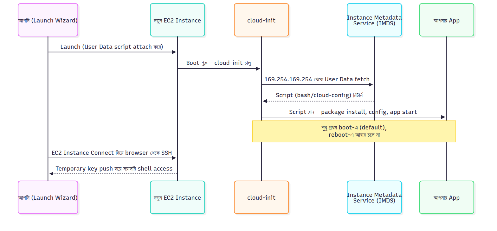

# 📚 Day 15 — User Data, Cloud-init & EC2 Instance Connect

> 📊 **Visual Summary** — সহজে বোঝার জন্য diagram:



**সময়:** ১.৫ ঘণ্টা | **Module:** ৩ (Application Deployment on EC2) — Day 1

## 🎯 আজকের লক্ষ্য
- User Data কী এবং কীভাবে কাজ করে গভীরে বুঝবেন
- Cloud-init architecture ও lifecycle
- EC2 boot process step-by-step
- EC2 Instance Connect — browser-based SSH
- Instance Metadata Service (IMDS)
- Real-world bootstrap scripts

---

## Part 1: EC2 Bootstrap Problem

### 🤔 The Problem

আপনি ১০টা identical EC2 instance launch করতে চান। প্রতিটায় একই software install:
- Nginx
- Node.js
- Application code
- Configuration

**Manual approach:**
1. Instance launch
2. SSH করে login
3. Software install
4. Config file create
5. Service start
6. পরের instance — repeat

**Time:** Each instance = 30 min × 10 = 5 hours।

**Problem:** Manual, error-prone, not scalable, not repeatable।

### 💡 Solution: Bootstrap Automation

**Bootstrap = instance launch হওয়ার সময় automatic setup script run।**

এটাকেই বলে **User Data**।

---

## Part 2: User Data — Concept

### 📜 User Data কী?

**User Data = একটা script (or text data) যা EC2 instance-এর first boot-এ automatically execute হয়।**

আপনি launch wizard-এ user data field-এ script paste করেন। AWS instance boot-এ সেই script run করে।

### 🎬 User Data কীভাবে কাজ করে

```
EC2 Launch
    │
    ▼
AMI loads
    │
    ▼
OS boots (Linux/Windows)
    │
    ▼
Cloud-init starts (during boot)
    │
    ▼
Cloud-init reads User Data
    │
    ▼
Executes the script
    │
    ▼
Instance ready (with software installed)
```

### 📍 User Data Key Properties

#### 1. Runs Once by Default
- First boot only
- Subsequent reboots: না (default behavior)
- Re-run করতে চাইলে configurable

#### 2. Runs as Root (Linux)
- No `sudo` needed in script
- Full system access
- Be careful — root permissions

#### 3. Size Limit: 16 KB
- Base64-encoded
- বড় script হলে S3-এ রেখে download করুন user data থেকে

#### 4. Plain Text or Base64
- Console-এ paste করলে plain text
- API/CLI-এ base64 encoded

#### 5. Logs Available
- `/var/log/cloud-init-output.log`
- `/var/log/cloud-init.log`
- Debugging-এর জন্য essential

---

## Part 3: User Data Examples

### 📝 Example 1: Simple Web Server

```bash
#!/bin/bash
yum update -y
yum install -y httpd
systemctl start httpd
systemctl enable httpd
echo "<h1>Hello from $(hostname -f)</h1>" > /var/www/html/index.html
```

**কী হয়:**
1. `#!/bin/bash` — shebang, bash script
2. System packages update
3. Apache install
4. Service start
5. Enable on boot
6. Default web page create

Instance launch-এর ২ মিনিট পর browser-এ public IP visit করলেই page দেখবেন।

### 📝 Example 2: Node.js Application

```bash
#!/bin/bash
yum update -y

# Node.js install
curl -fsSL https://rpm.nodesource.com/setup_20.x | bash -
yum install -y nodejs

# Git install
yum install -y git

# Application clone
cd /home/ec2-user
git clone https://github.com/myorg/myapp.git
cd myapp

# Dependencies
npm install

# Environment variables
cat > /home/ec2-user/myapp/.env <<EOF
NODE_ENV=production
PORT=3000
DB_HOST=db.internal.company.com
EOF

# Start with PM2 (we'll learn Day 20)
npm install -g pm2
pm2 start app.js
pm2 startup
pm2 save
```

### 📝 Example 3: Python Flask App

```bash
#!/bin/bash
yum update -y
yum install -y python3 python3-pip git

# App download
cd /opt
git clone https://github.com/myorg/flask-app.git
cd flask-app

# Dependencies
pip3 install -r requirements.txt

# Run as service (systemd — Day 17)
cat > /etc/systemd/system/flask-app.service <<EOF
[Unit]
Description=Flask App
After=network.target

[Service]
User=ec2-user
WorkingDirectory=/opt/flask-app
ExecStart=/usr/bin/python3 app.py
Restart=always

[Install]
WantedBy=multi-user.target
EOF

systemctl daemon-reload
systemctl enable flask-app
systemctl start flask-app
```

### 📝 Example 4: Pull Code from S3

বড় application code S3-এ রাখুন, instance boot-এ download:

```bash
#!/bin/bash
yum update -y

# Install AWS CLI
yum install -y aws-cli

# Download app from S3
aws s3 cp s3://my-app-bucket/release/app.tar.gz /tmp/app.tar.gz

# Extract
mkdir -p /opt/myapp
tar -xzf /tmp/app.tar.gz -C /opt/myapp

# Install dependencies (assuming app brings its own)
cd /opt/myapp
./install.sh
./start.sh
```

**Prerequisite:** Instance-এ IAM role with S3 read permission।

### 📝 Example 5: Update Hostname & Tagging

```bash
#!/bin/bash

# Get instance metadata
INSTANCE_ID=$(curl -s http://169.254.169.254/latest/meta-data/instance-id)
REGION=$(curl -s http://169.254.169.254/latest/meta-data/placement/region)

# Set hostname based on instance ID
hostnamectl set-hostname web-server-${INSTANCE_ID:2:6}

# Update /etc/hosts
echo "127.0.0.1 web-server-${INSTANCE_ID:2:6}" >> /etc/hosts

# Tag the instance
aws ec2 create-tags \
  --resources $INSTANCE_ID \
  --tags Key=Status,Value=Configured \
  --region $REGION
```

---

## Part 4: Cloud-init — The Engine

### 🔧 Cloud-init কী?

**Cloud-init = open-source tool যা cloud instance-এর initial setup automate করে।**

AWS, Azure, GCP — সব major cloud-এ ব্যবহার হয়। AMI-এর সাথে pre-installed (Amazon Linux, Ubuntu, RHEL, etc.)।

### 🎬 Cloud-init Lifecycle

Boot-এর সময় cloud-init multiple stage-এ চলে:

#### Stage 1: Local
- Hostname set
- Filesystem mount
- User data download (from metadata service)

#### Stage 2: Network
- Network configuration
- DNS setup
- Storage attach

#### Stage 3: Config
- Package install
- File creation
- User creation

#### Stage 4: Final
- **User data script runs here**
- Custom commands execute
- Service start

### 📂 Cloud-init Configuration

#### Method 1: Shell Script (#!)

```bash
#!/bin/bash
# Standard shell script
yum install -y nginx
systemctl start nginx
```

#### Method 2: Cloud-config (#cloud-config)

YAML format, more declarative:

```yaml
#cloud-config

package_update: true
package_upgrade: true

packages:
  - nginx
  - git
  - htop

write_files:
  - path: /etc/nginx/conf.d/myapp.conf
    content: |
      server {
        listen 80;
        location / {
          proxy_pass http://localhost:3000;
        }
      }
    permissions: '0644'

users:
  - name: appuser
    sudo: ALL=(ALL) NOPASSWD:ALL
    ssh_authorized_keys:
      - ssh-rsa AAAAB3NzaC1...

runcmd:
  - systemctl start nginx
  - systemctl enable nginx
```

**Benefits of cloud-config:**
- More readable
- Built-in modules (users, packages, files)
- Idempotent
- Cleaner than shell scripts for complex setups

#### Method 3: Multi-part MIME

Combine multiple types:

```
Content-Type: multipart/mixed; boundary="MIMEBOUNDARY"

--MIMEBOUNDARY
Content-Type: text/cloud-config

#cloud-config
packages:
  - nginx

--MIMEBOUNDARY
Content-Type: text/x-shellscript

#!/bin/bash
echo "Custom setup" >> /var/log/setup.log
systemctl start nginx

--MIMEBOUNDARY--
```

বেশিরভাগ user simple shell script use করে।

---

## Part 5: User Data Best Practices

### ✅ Do's

#### 1. Always Start with Update
```bash
#!/bin/bash
yum update -y  # Amazon Linux/RHEL
# or
apt-get update -y  # Ubuntu/Debian
```

#### 2. Log Everything
```bash
#!/bin/bash
exec > >(tee /var/log/user-data.log|logger -t user-data -s 2>/dev/console) 2>&1

echo "User data starting at $(date)"
# ... your commands
echo "User data completed at $(date)"
```

#### 3. Idempotent Where Possible
Re-run-safe scripts:
```bash
# Bad: errors if already exists
useradd appuser

# Good: skip if exists
id -u appuser &>/dev/null || useradd appuser
```

#### 4. Error Handling
```bash
#!/bin/bash
set -e  # Exit on error
set -o pipefail  # Catch pipe errors
set -u  # Error on undefined variables

# Now any command failure stops the script
```

#### 5. Use Variables
```bash
#!/bin/bash

APP_DIR="/opt/myapp"
APP_USER="appuser"
APP_VERSION="1.2.3"

mkdir -p $APP_DIR
useradd -d $APP_DIR -s /bin/bash $APP_USER
```

#### 6. Region-aware
```bash
#!/bin/bash
REGION=$(curl -s http://169.254.169.254/latest/meta-data/placement/region)
INSTANCE_ID=$(curl -s http://169.254.169.254/latest/meta-data/instance-id)

aws s3 cp s3://my-bucket/app.zip /tmp/ --region $REGION
```

### ❌ Don'ts

#### 1. Don't Embed Secrets

**Bad:**
```bash
DB_PASSWORD="MySecretPassword123"
```

**Good:** Use AWS Secrets Manager
```bash
DB_PASSWORD=$(aws secretsmanager get-secret-value \
  --secret-id prod/db/password \
  --query SecretString --output text)
```

#### 2. Don't Run Long Operations Synchronously

**Bad:** Blocking 30-minute install in user data

**Good:** Run async, check status separately
```bash
nohup ./long-install.sh > /var/log/install.log 2>&1 &
```

#### 3. Don't Skip Error Handling
```bash
# Bad: silent failures
yum install nginx
systemctl start nginx

# Good
yum install -y nginx || { echo "Install failed"; exit 1; }
systemctl start nginx || { echo "Start failed"; exit 1; }
```

#### 4. Don't Forget File Permissions
```bash
# Important for security
chmod 600 /etc/myapp/secrets.conf
chown appuser:appuser /etc/myapp/secrets.conf
```

---

## Part 6: User Data Debugging

### 🔍 Where Are the Logs?

#### Linux logs:
```bash
# Cloud-init log
sudo cat /var/log/cloud-init.log

# User data output
sudo cat /var/log/cloud-init-output.log

# Specific user data execution
sudo cat /var/log/user-data.log  # (if you logged here)
```

#### Windows logs:
```
C:\ProgramData\Amazon\EC2-Windows\Launch\Log\UserdataExecution.log
```

### 🔧 Common Issues

#### Issue 1: Script Not Executing

**Symptom:** Software not installed after launch

**Check:**
```bash
# Did cloud-init run?
sudo cloud-init status

# Did user data download?
sudo cat /var/lib/cloud/instance/user-data.txt
```

**Common causes:**
- Missing `#!/bin/bash` shebang
- Wrong line endings (CRLF instead of LF)
- Indentation issues in cloud-config YAML

#### Issue 2: Permissions Errors

```bash
# Script runs as root, but accesses files as user?
# Check user/group ownership
ls -la /home/ec2-user/

# Fix ownership
chown -R ec2-user:ec2-user /home/ec2-user/myapp
```

#### Issue 3: Network Not Ready

User data sometimes runs before network fully up:

```bash
# Wait for network
until curl -s http://169.254.169.254/latest/meta-data/instance-id; do
  sleep 1
done

# Now safe to download
yum install -y nginx
```

#### Issue 4: AWS CLI Permission Denied

```bash
# Without IAM role
aws s3 cp s3://bucket/file .
# Error: Unable to locate credentials

# Fix: Attach IAM Instance Profile
```

### 🔄 Re-running User Data

By default, user data runs once. To force re-run:

```bash
# Delete cloud-init's "already ran" markers
sudo rm -rf /var/lib/cloud/instances/*

# Reboot
sudo reboot
```

Or modify cloud-init config:

```bash
# /etc/cloud/cloud.cfg
# Set: cloud_final_modules to run user data each boot
```

---

## Part 7: Instance Metadata Service (IMDS)

### 🤔 IMDS কী?

**IMDS = Special service চলে প্রতিটা EC2 instance-এ যা instance-এর own information return করে।**

**Magic IP:** `169.254.169.254` — link-local address, only accessible from within the instance।

### 📋 What IMDS Provides

#### Instance Info:
```bash
# Instance ID
curl http://169.254.169.254/latest/meta-data/instance-id

# Instance Type
curl http://169.254.169.254/latest/meta-data/instance-type

# AMI ID
curl http://169.254.169.254/latest/meta-data/ami-id

# Region
curl http://169.254.169.254/latest/meta-data/placement/region

# Availability Zone
curl http://169.254.169.254/latest/meta-data/placement/availability-zone

# Hostname
curl http://169.254.169.254/latest/meta-data/local-hostname

# Public IP
curl http://169.254.169.254/latest/meta-data/public-ipv4

# Private IP
curl http://169.254.169.254/latest/meta-data/local-ipv4

# Security Groups
curl http://169.254.169.254/latest/meta-data/security-groups
```

#### IAM Credentials:
```bash
# Role name
curl http://169.254.169.254/latest/meta-data/iam/security-credentials/

# Temporary credentials (used by AWS SDK automatically)
curl http://169.254.169.254/latest/meta-data/iam/security-credentials/MyRole
```

#### User Data:
```bash
curl http://169.254.169.254/latest/user-data
```

### 🔒 IMDSv1 vs IMDSv2 — Critical Security

#### IMDSv1 (Legacy)
- Simple GET request
- No authentication
- **Vulnerability:** Server-Side Request Forgery (SSRF) attacks

**Attack scenario:**
- Compromised web app on EC2
- Attacker tricks app to fetch `http://169.254.169.254/...`
- App returns IAM credentials to attacker
- Attacker uses credentials to access AWS

#### IMDSv2 (Recommended)
- Token-based, two-step process
- PUT request to get token
- Token in header for GET request
- Prevents SSRF

**IMDSv2 example:**
```bash
# Step 1: Get token
TOKEN=$(curl -X PUT "http://169.254.169.254/latest/api/token" \
  -H "X-aws-ec2-metadata-token-ttl-seconds: 21600")

# Step 2: Use token
curl -H "X-aws-ec2-metadata-token: $TOKEN" \
  http://169.254.169.254/latest/meta-data/instance-id
```

### 🛡️ Best Practice: Force IMDSv2

```bash
# When launching instance:
HttpTokens=required
HttpEndpoint=enabled
```

Or via console: launch wizard → Advanced details → Metadata version → V2 only।

**AWS recommends:** Always use IMDSv2 for new launches।

---

## Part 8: EC2 Instance Connect

### 🌐 EC2 Instance Connect কী?

**Browser-based SSH directly from AWS console।** No SSH key management on local machine needed।

### 🆚 Comparison

| Method | Key Required Locally | Public IP Needed | Browser-only |
|---|---|---|---|
| **Traditional SSH** | Yes | Yes | No |
| **EC2 Instance Connect** | No | Yes | Yes (or CLI) |
| **Bastion Host** | Yes (multiple) | Yes (bastion) | No |
| **Session Manager (SSM)** | No | No | Yes (or CLI) |

### 🔧 কীভাবে কাজ করে

#### Two Modes:

**Mode 1: Browser-based (no setup)**
```
EC2 Console → Select instance → Connect → EC2 Instance Connect → Connect
```

A browser-based shell opens. Done.

**Mode 2: SSH client with temporary keys**

```bash
aws ec2-instance-connect send-ssh-public-key \
  --instance-id i-xxx \
  --availability-zone ap-south-1a \
  --instance-os-user ec2-user \
  --ssh-public-key file://~/.ssh/id_rsa.pub
```

This pushes your public key, valid for 60 seconds. Then:
```bash
ssh ec2-user@<instance-public-ip>
```

### 🔐 How Authentication Works

#### Behind the scenes:

```
You click "Connect" in console
       │
       ▼
AWS generates temporary SSH key pair
       │
       ▼
Public key pushed to EC2 instance
(via EC2 Instance Connect Agent)
       │
       ▼
Public key valid for 60 seconds
       │
       ▼
Browser establishes SSH connection
using private key (server-side)
       │
       ▼
After 60s, public key removed
```

**Critical:** Authentication via IAM (not SSH keys)। You need IAM permission `ec2-instance-connect:SendSSHPublicKey`।

### 📋 Requirements

**For instance:**
- EC2 Instance Connect agent installed
- Pre-installed in:
  - Amazon Linux 2023
  - Amazon Linux 2 (newer)
  - Ubuntu 16.04+
  - Some others
- Manual install for others

**For network:**
- Public IP (or specific endpoint setup)
- Security Group allows SSH from EC2 Instance Connect IP ranges
- Or AWS-managed prefix list

**For user:**
- IAM permission for `ec2-instance-connect:SendSSHPublicKey`

### 🎯 Use Cases

**✅ Good for:**
- Quick troubleshooting
- No local SSH key management
- Browser-based access
- Demo environments
- Quick fixes

**❌ Not ideal for:**
- Long-running sessions
- File transfers (use SSH/SCP)
- Private subnet instances (use Session Manager)
- Production debugging (use Session Manager + audit)

### 🆚 vs Session Manager

| Feature | Instance Connect | Session Manager |
|---|---|---|
| Public IP needed | Yes | No |
| Inbound port 22 | Yes | No |
| SSH protocol | Yes | No (SSM API) |
| Audit logging | Limited | Full |
| Browser support | Yes | Yes |
| File transfer | Via SCP | Limited |

**Modern recommendation:** Session Manager > Instance Connect, especially for production।

### 🔒 Security Configuration

#### IAM Policy (limit who can use):

```json
{
  "Version": "2012-10-17",
  "Statement": [{
    "Effect": "Allow",
    "Action": "ec2-instance-connect:SendSSHPublicKey",
    "Resource": "arn:aws:ec2:*:*:instance/*",
    "Condition": {
      "StringEquals": {
        "ec2:osuser": "ec2-user"
      }
    }
  }]
}
```

**Effect:** User can use Instance Connect but only as `ec2-user` (not root)।

#### Security Group:

For browser-based access, allow SSH from AWS Instance Connect IP ranges (managed prefix list):
```
Inbound:
- SSH (22) from prefix list (com.amazonaws.region.ec2-instance-connect)
```

This auto-updates as AWS IP ranges change।

### 🌐 EC2 Instance Connect Endpoint (newer feature)

For private subnet instances:

```
EC2 Instance Connect Endpoint:
- Deploy in your VPC
- Acts like a SSM-style proxy
- SSH to private instances without bastion
```

**Setup:**
```
EC2 Console → EC2 Instance Connect Endpoints → Create
- VPC, Subnet
- Security Group
```

Then connect:
```bash
aws ec2-instance-connect ssh --instance-id i-xxx
```

Routes through the endpoint, no bastion needed।

---

## Part 9: Real-world Bootstrap Example

আজকে শেখা সব combine করে একটা production-ready bootstrap example দেখি।

### Scenario: Web Server with Auto Scaling

User data script for ASG launch template:

```bash
#!/bin/bash
set -e

# Logging setup
exec > >(tee /var/log/user-data.log) 2>&1
echo "===== User data starting: $(date) ====="

# Get instance metadata (IMDSv2)
TOKEN=$(curl -X PUT "http://169.254.169.254/latest/api/token" \
  -H "X-aws-ec2-metadata-token-ttl-seconds: 21600")

INSTANCE_ID=$(curl -H "X-aws-ec2-metadata-token: $TOKEN" \
  http://169.254.169.254/latest/meta-data/instance-id)

REGION=$(curl -H "X-aws-ec2-metadata-token: $TOKEN" \
  http://169.254.169.254/latest/meta-data/placement/region)

AZ=$(curl -H "X-aws-ec2-metadata-token: $TOKEN" \
  http://169.254.169.254/latest/meta-data/placement/availability-zone)

echo "Instance: $INSTANCE_ID, Region: $REGION, AZ: $AZ"

# System update
echo "===== Updating system ====="
yum update -y

# Install dependencies
echo "===== Installing packages ====="
yum install -y \
  nginx \
  amazon-cloudwatch-agent \
  awscli \
  jq

# Get app version from SSM Parameter Store
APP_VERSION=$(aws ssm get-parameter \
  --name /myapp/prod/version \
  --region $REGION \
  --query 'Parameter.Value' \
  --output text)

echo "===== Deploying app version: $APP_VERSION ====="

# Download app from S3
APP_BUCKET="my-app-deployments"
mkdir -p /opt/myapp
aws s3 cp s3://$APP_BUCKET/releases/$APP_VERSION/app.tar.gz /tmp/ \
  --region $REGION

tar -xzf /tmp/app.tar.gz -C /opt/myapp

# Get database password from Secrets Manager
DB_PASSWORD=$(aws secretsmanager get-secret-value \
  --secret-id prod/db/password \
  --region $REGION \
  --query SecretString --output text | jq -r '.password')

# Create config
cat > /opt/myapp/config.json <<EOF
{
  "instance_id": "$INSTANCE_ID",
  "az": "$AZ",
  "db_host": "db.internal.company.com",
  "db_password": "$DB_PASSWORD",
  "version": "$APP_VERSION"
}
EOF

chmod 600 /opt/myapp/config.json

# Configure Nginx
cat > /etc/nginx/conf.d/myapp.conf <<'EOF'
server {
    listen 80;
    server_name _;
    
    location / {
        proxy_pass http://localhost:3000;
        proxy_set_header Host $host;
        proxy_set_header X-Real-IP $remote_addr;
    }
    
    location /health {
        access_log off;
        return 200 "OK\n";
    }
}
EOF

# Start services
systemctl enable nginx
systemctl start nginx

# CloudWatch agent (we'll learn Day 16)
/opt/aws/amazon-cloudwatch-agent/bin/amazon-cloudwatch-agent-ctl \
  -a fetch-config -m ec2 \
  -c ssm:AmazonCloudWatch-MyApp -s

# Tag instance with status
aws ec2 create-tags \
  --resources $INSTANCE_ID \
  --region $REGION \
  --tags \
    Key=Status,Value=Configured \
    Key=Version,Value=$APP_VERSION

echo "===== User data completed: $(date) ====="
```

**এই script-এ আমরা যা use করেছি:**
- ✅ Logging
- ✅ IMDSv2 for metadata
- ✅ SSM Parameter Store for version
- ✅ Secrets Manager for credentials
- ✅ S3 for app artifacts
- ✅ Nginx reverse proxy (Day 19)
- ✅ Systemd service management (Day 17)
- ✅ Instance tagging
- ✅ Error handling (`set -e`)

---

## 🎯 আজকের মূল Takeaways

1. **User Data** = first-boot script automation
2. **16 KB limit**, runs as root, runs once by default
3. **Cloud-init** = engine that processes user data
4. **Two formats:** Shell script (#!) or cloud-config YAML
5. **Logs:** `/var/log/cloud-init-output.log`
6. **IMDS:** `169.254.169.254` returns instance info
7. **IMDSv2 mandatory** for security (token-based)
8. **EC2 Instance Connect** = browser SSH, IAM-based
9. **Session Manager preferred** over Instance Connect for production
10. **Best practices:** logging, idempotent, error handling, no secrets

---

## 📝 Self-check Questions

১. User Data কখন execute হয়?
২. User Data-এর size limit কত?
৩. User Data কোন user হিসেবে run হয়?
৪. Cloud-init কী?
৫. Cloud-config (#cloud-config) format কখন use করবেন?
৬. User Data log কোথায়?
৭. IMDS-এর IP address কী?
৮. IMDSv1 vs IMDSv2 — কোনটা secure?
৯. EC2 Instance Connect-এ local SSH key লাগে?
১০. Session Manager vs Instance Connect — কোনটা production-এ preferred?
১১. User Data re-run কীভাবে force করবেন?
১২. IMDSv2-তে token কীভাবে get?
১৩. Bootstrap script-এ secret কোথায় store করা উচিত?
১৪. User data fail হলে instance launch হবে?
১৫. EC2 Instance Connect-এর IAM permission কী?

---

## 💡 Pro Tips

- **Always use `set -e`** — fail fast
- **Log everything** — debugging easier
- **IMDSv2 required** — security
- **No secrets in user data** — Secrets Manager or SSM Parameter Store
- **Test user data** in dev environment first
- **Keep scripts under 16 KB** — bigger? S3 download
- **Use cloud-config for declarative** setups
- **Idempotent scripts** safer for re-launch
- **Tag with status** — visibility for ASG
- **Enable IMDSv2 organization-wide** via Service Control Policy

---

## 🚨 Real-world Stories

**Story 1:** Developer hardcoded database password in user data. Instance terminated, user data visible in launch template versions. Password leaked to other team members।

**Moral:** Never hardcode secrets. Use Secrets Manager।

**Story 2:** User data took 15 minutes to install large software. ASG marked instance unhealthy (1 minute timeout)। ASG kept terminating fresh instances।

**Moral:** Long install? Pre-bake AMI or run async।

**Story 3:** IMDSv1 enabled, web app SSRF vulnerability. Attacker fetched IAM credentials, accessed S3, exfiltrated customer data।

**Moral:** IMDSv2 always।

**Story 4:** Script lacked `set -e`. Failed `yum install`, but rest of script continued, system half-configured. Service started without dependencies, crashed every minute।

**Moral:** Error handling critical।

---
