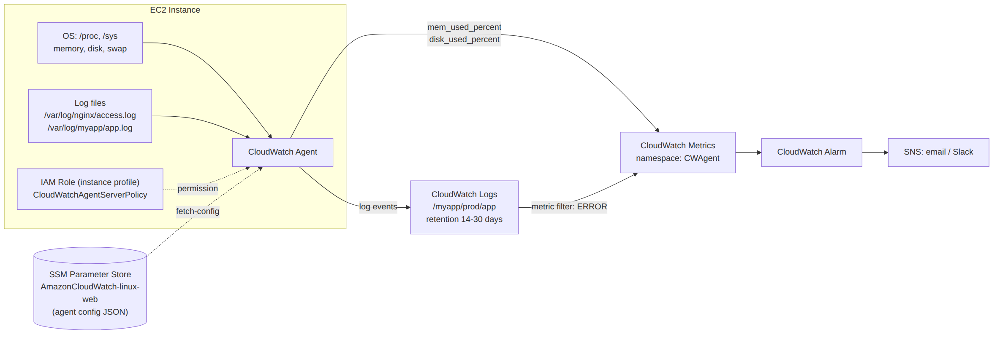

# 📚 Day 17 — CloudWatch Agent: EC2-এর Memory, Disk ও Log Monitoring

> 📊 **Visual Summary** — সহজে বোঝার জন্য diagram:



**সময়:** ১.৫ ঘণ্টা | **Module:** ৩ (Application Deployment on EC2) — Day 3

## 🎯 আজকের লক্ষ্য
- Default EC2 metrics-এ কী থাকে আর কী থাকে না, সেটা বোঝা
- CloudWatch Agent কী, কেন দরকার
- Agent install ও IAM permission
- Config file লেখা (metrics + logs)
- Parameter Store থেকে config নিয়ে অনেক instance-এ একসাথে চালানো
- Log group, retention, metric filter, alarm
- Troubleshooting

---

## Part 1: Default EC2 Metrics-এর সীমাবদ্ধতা

### 🤔 সমস্যাটা কী?

EC2 launch করলেই CloudWatch-এ কিছু metric আসে। কিন্তু এগুলো আসে **hypervisor-এর বাইরে থেকে** মাপা। Hypervisor শুধু দেখতে পায় VM বাইরে থেকে কী করছে, ভেতরের OS-এর অবস্থা দেখে না।

| Default-এ পাওয়া যায় ✅ | Default-এ পাওয়া যায় না ❌ |
|---|---|
| CPUUtilization | **Memory (RAM) usage** |
| NetworkIn / NetworkOut | **Disk space usage** (কত % ভরা) |
| DiskReadOps / DiskWriteOps (instance store) | Swap usage |
| StatusCheckFailed | Process-level metric (nginx চলছে কিনা) |
| EBS metrics (EBS namespace-এ) | **Application log** (`/var/log/app.log`) |

- Default resolution: **৫ মিনিট** (Detailed monitoring চালু করলে ১ মিনিট, paid)।

### 💥 বাস্তব উদাহরণ
Server-এর CPU 10%, সব ঠিক দেখাচ্ছে। কিন্তু app crash করছে। কারণ disk ১০০% ভরে গেছে log file-এ। Default metric দিয়ে এটা **কখনো ধরা পড়বে না**।

👉 সমাধান: **CloudWatch Agent**

---

## Part 2: CloudWatch Agent কী?

**CloudWatch Agent** = EC2 (বা on-prem server)-এর **ভেতরে চলা** একটা software, যেটা:
1. OS-level **metrics** সংগ্রহ করে (memory, disk, swap, process, netstat)
2. **Log file** পড়ে CloudWatch Logs-এ পাঠায়
3. **StatsD / collectd** থেকে custom application metric নেয়

```
EC2 Instance
 ├── CloudWatch Agent
 │     ├── /proc, /sys থেকে memory, disk পড়ে ──► CloudWatch Metrics (namespace: CWAgent)
 │     └── /var/log/nginx/access.log tail করে ──► CloudWatch Logs (log group)
 └── IAM Role (CloudWatchAgentServerPolicy)
```

| Feature | বিবরণ |
|---|---|
| OS | Amazon Linux, Ubuntu, RHEL, Windows Server ইত্যাদি |
| Default namespace | `CWAgent` |
| Custom metric | হ্যাঁ, এগুলো **custom metric হিসেবে charge** হয় |
| On-prem | হ্যাঁ (IAM user credential বা IAM Roles Anywhere দিয়ে) |

> 💡 পুরনো "CloudWatch Logs Agent" (awslogs) এখন **deprecated**। নতুন সব কাজে unified **CloudWatch Agent** ব্যবহার করুন।

---

## Part 3: IAM Permission (Instance Profile)

Agent-কে CloudWatch-এ data পাঠাতে permission লাগবে। Day 16-এর Instance Profile এখানে কাজে লাগবে।

**Role-এ attach করুন:**
- `CloudWatchAgentServerPolicy`: metric ও log পাঠানোর জন্য
- `AmazonSSMManagedInstanceCore`: SSM দিয়ে install ও config করতে চাইলে

```bash
# Instance-এ role আছে কিনা দেখা (IMDSv2)
TOKEN=$(curl -s -X PUT "http://169.254.169.254/latest/api/token" \
  -H "X-aws-ec2-metadata-token-ttl-seconds: 60")
curl -s -H "X-aws-ec2-metadata-token: $TOKEN" \
  http://169.254.169.254/latest/meta-data/iam/security-credentials/
```

> ⚠️ Config Parameter Store-এ **save** করতে চাইলে (wizard থেকে) `CloudWatchAgentAdminPolicy` লাগে। সেটা শুধু একটা "admin" instance-এ দিন, সব server-এ না।

---

## Part 4: Agent Install

### Option 1: Package manager (সবচেয়ে সহজ)

```bash
# Amazon Linux 2023 / Amazon Linux 2
sudo dnf install -y amazon-cloudwatch-agent     # AL2-তে: sudo yum install -y amazon-cloudwatch-agent

# Ubuntu (x86_64)
wget https://amazoncloudwatch-agent.s3.amazonaws.com/ubuntu/amd64/latest/amazon-cloudwatch-agent.deb
sudo dpkg -i -E ./amazon-cloudwatch-agent.deb
```

### Option 2: SSM দিয়ে অনেক instance-এ একসাথে
Systems Manager → **Run Command** → `AWS-ConfigureAWSPackage` → Name: `AmazonCloudWatchAgent` → target: tag `Env=prod`।

### Option 3: User Data (Day 15)
Launch-এর সময়েই install ও start (নিচে Part 7-এ পুরো script)।

**Install location:** `/opt/aws/amazon-cloudwatch-agent/`

---

## Part 5: Config File বোঝা

Config হলো একটা JSON file, যার ৩টা মূল অংশ:

```json
{
  "agent": { ... },     // agent নিজে কীভাবে চলবে
  "metrics": { ... },   // কোন metric পাঠাবে
  "logs": { ... }       // কোন log file পাঠাবে
}
```

### 📝 সম্পূর্ণ উদাহরণ (Linux web server)

```json
{
  "agent": {
    "metrics_collection_interval": 60,
    "run_as_user": "cwagent"
  },
  "metrics": {
    "namespace": "CWAgent",
    "append_dimensions": {
      "InstanceId": "${aws:InstanceId}",
      "AutoScalingGroupName": "${aws:AutoScalingGroupName}"
    },
    "aggregation_dimensions": [["AutoScalingGroupName"]],
    "metrics_collected": {
      "mem": {
        "measurement": ["mem_used_percent"]
      },
      "disk": {
        "measurement": ["used_percent"],
        "resources": ["/"],
        "ignore_file_system_types": ["sysfs", "devtmpfs", "tmpfs"]
      },
      "swap": {
        "measurement": ["swap_used_percent"]
      },
      "procstat": [
        { "exe": "nginx", "measurement": ["pid_count"] }
      ]
    }
  },
  "logs": {
    "logs_collected": {
      "files": {
        "collect_list": [
          {
            "file_path": "/var/log/nginx/access.log",
            "log_group_name": "/myapp/prod/nginx/access",
            "log_stream_name": "{instance_id}",
            "retention_in_days": 30
          },
          {
            "file_path": "/var/log/myapp/app.log",
            "log_group_name": "/myapp/prod/app",
            "log_stream_name": "{instance_id}",
            "retention_in_days": 14
          }
        ]
      }
    }
  }
}
```

### 🔍 গুরুত্বপূর্ণ field

| Field | মানে |
|---|---|
| `metrics_collection_interval` | কত সেকেন্ড পরপর metric নেবে (৬০ = ১ মিনিট; ১০ দিলে high-resolution, বেশি খরচ) |
| `append_dimensions` | প্রতিটা metric-এ InstanceId ইত্যাদি যোগ করে, যাতে কোন server-এর metric তা বোঝা যায় |
| `aggregation_dimensions` | পুরো ASG-র গড় memory আলাদা metric হিসেবে পাওয়া যায়, alarm দিতে সুবিধা |
| `procstat` | নির্দিষ্ট process চলছে কিনা (`pid_count = 0` মানে process মরে গেছে) |
| `log_stream_name: {instance_id}` | প্রতিটা server-এর log আলাদা stream-এ যায় |
| `retention_in_days` | কতদিন log রাখবে। **না দিলে চিরকাল থাকে, আর খরচ বাড়তেই থাকে!** |

> 💡 Log group-এর নাম `/app/env/component` ধাঁচে দিন। Day 16-এর Parameter Store-এর মতো hierarchy থাকলে IAM দিয়ে access control সহজ হয়।

### 🧙 Wizard দিয়ে config বানানো
```bash
sudo /opt/aws/amazon-cloudwatch-agent/bin/amazon-cloudwatch-agent-config-wizard
```
কয়েকটা প্রশ্নের উত্তর দিলে JSON তৈরি হয়ে যায়। চাইলে Parameter Store-এ save করার option-ও দেয়।

---

## Part 6: Agent চালানো (`amazon-cloudwatch-agent-ctl`)

```bash
CTL=/opt/aws/amazon-cloudwatch-agent/bin/amazon-cloudwatch-agent-ctl

# Local file থেকে config নিয়ে start
sudo $CTL -a fetch-config -m ec2 -s \
  -c file:/opt/aws/amazon-cloudwatch-agent/etc/config.json

# Parameter Store থেকে config নিয়ে start
sudo $CTL -a fetch-config -m ec2 -s -c ssm:AmazonCloudWatch-linux-web

# Status দেখা
sudo $CTL -a status

# Stop
sudo $CTL -a stop
```

| Flag | মানে |
|---|---|
| `-a fetch-config` | config পড়ে agent-এর format-এ convert করে |
| `-m ec2` | mode: `ec2` বা `onPremise` |
| `-s` | config নেওয়ার পর agent restart করে |
| `-c file:...` / `-c ssm:...` | config কোথা থেকে নেবে |

Agent নিজেই একটা **systemd service** (`amazon-cloudwatch-agent.service`) হিসেবে চলে। কাল (Day 18) systemd গভীরে শিখব।

---

## Part 7: Production Pattern — Parameter Store + User Data

১০০টা server-এ আলাদা আলাদা config file বসানো কঠিন। তাই:

1. Config JSON **একবার** Parameter Store-এ রাখুন, নাম দিন `AmazonCloudWatch-linux-web`
2. সব instance boot-এর সময় সেখান থেকে config টেনে নেয়

```bash
#!/bin/bash
# EC2 User Data (Amazon Linux 2023)
dnf install -y amazon-cloudwatch-agent
/opt/aws/amazon-cloudwatch-agent/bin/amazon-cloudwatch-agent-ctl \
  -a fetch-config -m ec2 -s -c ssm:AmazonCloudWatch-linux-web
```

✅ সুবিধা:
- Config বদলাতে শুধু parameter update করুন, তারপর SSM Run Command দিয়ে `fetch-config` আবার চালান
- Auto Scaling-এ নতুন instance এলে নিজে থেকেই monitoring চালু হয়
- Parameter-এর নাম `AmazonCloudWatch-` দিয়ে শুরু করুন। `CloudWatchAgentServerPolicy` শুধু এই নামের parameter পড়ার অনুমতি দেয়। অন্য নাম দিলে instance role-এ নিজে `ssm:GetParameter` permission যোগ করতে হবে।

---

## Part 8: CloudWatch Logs — Log Group, Metric Filter, Insights

### 📂 গঠন
```
Log Group:  /myapp/prod/app          ← retention, KMS encryption এই level-এ
 ├── Log Stream: i-0abc123          ← প্রতিটা instance
 │     ├── Log event (timestamp + message)
 │     └── ...
 └── Log Stream: i-0def456
```

### 🔎 Metric Filter: log থেকে metric
Log-এ কতবার `ERROR` এসেছে, সেটা গুনে metric বানানো যায়:

```bash
aws logs put-metric-filter \
  --log-group-name /myapp/prod/app \
  --filter-name app-errors \
  --filter-pattern "ERROR" \
  --metric-transformations \
    metricName=AppErrorCount,metricNamespace=MyApp,metricValue=1
```

### 📊 Logs Insights: log-এ SQL-এর মতো query
```
fields @timestamp, @message
| filter @message like /ERROR/
| stats count(*) as errors by bin(5m)
| sort errors desc
```

---

## Part 9: Alarm তৈরি

### Memory ৮০%-এর বেশি হলে email
```bash
aws cloudwatch put-metric-alarm \
  --alarm-name high-memory-i-0abc123 \
  --namespace CWAgent \
  --metric-name mem_used_percent \
  --dimensions Name=InstanceId,Value=i-0abc123 \
  --statistic Average --period 300 --evaluation-periods 2 \
  --threshold 80 --comparison-operator GreaterThanThreshold \
  --alarm-actions arn:aws:sns:ap-south-1:111122223333:ops-alerts
```

⚠️ **Dimension হুবহু মিলতে হবে।** Config-এ `append_dimensions` দিয়ে যে dimension পাঠাচ্ছেন (যেমন InstanceId + ImageId + InstanceType), alarm-এও ঠিক সেগুলোই দিতে হবে। না মিললে alarm চিরকাল `INSUFFICIENT_DATA` দেখাবে। এটা সবচেয়ে common ভুল।

### যে alarm-গুলো রাখা উচিত

| Alarm | Threshold (উদাহরণ) |
|---|---|
| `mem_used_percent` | > 80% (৫ মিনিট × ২) |
| `disk_used_percent` (`/`) | > 85% |
| `procstat pid_count` (nginx) | < 1 |
| `AppErrorCount` (metric filter) | > 10 per 5 min |
| `StatusCheckFailed` (default) | ≥ 1, সাথে EC2 recover action |

---

## Part 10: খরচ (Cost) মাথায় রাখুন

| জিনিস | খরচের কারণ |
|---|---|
| Custom metrics | প্রতিটা metric + dimension combination আলাদা metric হিসেবে বিল হয়। ১০০টা server × ৫টা metric = ৫০০টা metric |
| Log ingestion | প্রতি GB log পাঠাতে charge |
| Log storage | Retention না দিলে চিরকাল জমতে থাকে |
| High-resolution (১০ সেকেন্ড) | বেশি data point, বেশি API call |

**খরচ কমানোর উপায়:**
- শুধু দরকারি metric রাখুন (সব `measurement` চালু করবেন না)
- `retention_in_days` অবশ্যই দিন
- Debug-level log production-এ পাঠাবেন না
- পুরনো log S3-এ export করুন (সস্তা)

---

## Part 11: Troubleshooting

| সমস্যা | কোথায় দেখবেন / সমাধান |
|---|---|
| Agent চলছে না | `sudo systemctl status amazon-cloudwatch-agent` |
| Agent-এর নিজের log | `/opt/aws/amazon-cloudwatch-agent/logs/amazon-cloudwatch-agent.log` |
| `AccessDenied` error | Instance profile-এ `CloudWatchAgentServerPolicy` আছে কিনা |
| Private subnet-এ data যাচ্ছে না | NAT Gateway, অথবা VPC Interface Endpoint (`monitoring`, `logs`, `ssm`) লাগবে |
| Log আসছে না | file path ঠিক কিনা, আর `cwagent` user-এর file পড়ার permission আছে কিনা (`ls -l /var/log/...`) |
| Alarm INSUFFICIENT_DATA | Dimension মিলছে না (Part 9 দেখুন) |
| Config-এ ভুল | `fetch-config` চালালে validation error দেখায়। JSON syntax চেক করুন |

---

## 🎯 আজকের মূল Takeaways

1. Default EC2 metrics-এ **memory আর disk usage নেই**, এগুলোর জন্য CloudWatch Agent লাগে
2. Agent-এর জন্য IAM role-এ **`CloudWatchAgentServerPolicy`**
3. Config-এর তিন অংশ: `agent`, `metrics`, `logs`
4. Production-এ config **Parameter Store**-এ রাখুন, User Data বা SSM দিয়ে deploy করুন
5. Log group-এ **retention অবশ্যই দিন**
6. Metric filter দিয়ে log থেকে metric, তারপর alarm
7. Alarm-এর dimension config-এর সাথে হুবহু মিলতে হবে

---

## 📝 Self-check Questions

1. EC2-এর RAM usage দেখতে চাইলে কী করতে হবে? কেন default-এ এটা পাওয়া যায় না?
2. CloudWatch Agent-এর config-এর ৩টা মূল অংশ কী কী?
3. ৫০টা instance-এ একই config কীভাবে সবচেয়ে সহজে চালাবেন?
4. `retention_in_days` না দিলে কী হয়?
5. Log-এ "ERROR" কতবার আসছে তার উপর alarm কীভাবে বানাবেন?
6. Private subnet-এর instance থেকে metric যাচ্ছে না। কী কী কারণ হতে পারে?
7. Alarm সবসময় `INSUFFICIENT_DATA` দেখাচ্ছে। সম্ভাব্য কারণ কী?

<details><summary>▶ উত্তর দেখুন</summary>

1. CloudWatch Agent install করে `mem` metric collect করতে হবে। Hypervisor VM-এর ভেতরের OS-এর memory দেখতে পায় না।
2. `agent`, `metrics`, `logs`।
3. Config Parameter Store-এ রেখে SSM Run Command (বা User Data) দিয়ে `fetch-config -c ssm:...` চালানো।
4. Log চিরকাল থেকে যায়, storage খরচ বাড়তেই থাকে।
5. Metric filter (`ERROR` pattern) দিয়ে custom metric বানিয়ে তার উপর alarm।
6. NAT বা VPC endpoint নেই, IAM role নেই বা ভুল, agent বন্ধ।
7. Alarm-এর dimension agent-এর পাঠানো dimension-এর সাথে মিলছে না, অথবা agent data পাঠাচ্ছেই না।
</details>

---

## 💡 Pro Tips

- **ASG-তে** `aggregation_dimensions: [["AutoScalingGroupName"]]` দিন। তাহলে পুরো group-এর জন্য একটা alarm দিলেই হয়, instance বদলালেও alarm ভাঙে না
- **JSON log** লিখলে (যেমন `{"level":"error","msg":"..."}`) Logs Insights-এ field ধরে query করা অনেক সহজ হয়
- `procstat` দিয়ে নিজের app process monitor করুন
- **CloudWatch Dashboard** বানিয়ে CPU, memory, disk আর error count এক জায়গায় রাখুন
- On-call-এর জন্য SNS → email/Slack (Amazon Q Developer in chat applications, আগের নাম AWS Chatbot)

---

## 🎨 Quick Reference

```bash
# Install (AL2023)
sudo dnf install -y amazon-cloudwatch-agent

# Wizard
sudo /opt/aws/amazon-cloudwatch-agent/bin/amazon-cloudwatch-agent-config-wizard

# Start with SSM config
sudo /opt/aws/amazon-cloudwatch-agent/bin/amazon-cloudwatch-agent-ctl \
  -a fetch-config -m ec2 -s -c ssm:AmazonCloudWatch-linux-web

# Status / agent log
sudo /opt/aws/amazon-cloudwatch-agent/bin/amazon-cloudwatch-agent-ctl -a status
sudo tail -f /opt/aws/amazon-cloudwatch-agent/logs/amazon-cloudwatch-agent.log
```

```
Metrics → namespace CWAgent → mem_used_percent, disk_used_percent, swap_used_percent
Logs    → /app/env/component log group → {instance_id} stream → retention!
IAM     → CloudWatchAgentServerPolicy (+ AmazonSSMManagedInstanceCore)
```

---

## 🚨 বাস্তব পরিস্থিতি (যেসব ভুল প্রায়ই হয়)

**পরিস্থিতি ১:** Server হঠাৎ বন্ধ হয়ে গেল, কিন্তু CPU graph স্বাভাবিক। পরে দেখা গেল disk ১০০% ভরা ছিল log-এ। Disk alarm থাকলে কয়েক দিন আগেই জানা যেত।
**শিক্ষা:** `disk_used_percent` alarm সবসময় রাখুন।

**পরিস্থিতি ২:** এক বছর পর CloudWatch bill-এ দেখা গেল log storage-এর খরচ সবচেয়ে বেশি। কোনো log group-এ retention দেওয়া ছিল না।
**শিক্ষা:** প্রথম দিন থেকেই `retention_in_days` দিন।

**পরিস্থিতি ৩:** Alarm সেট করা আছে, কিন্তু কখনো বাজেনি, কারণ চিরকাল `INSUFFICIENT_DATA` দেখাচ্ছিল। Dimension মিলছিল না।
**শিক্ষা:** Alarm বানানোর পর CloudWatch console-এ metric-এর dimension মিলিয়ে দেখুন, আর একবার test করুন (`set-alarm-state`)।

---

**⏭ পরের দিন:** [Day 18 — systemd দিয়ে Service Management](./Day-18-systemd-Service-Management.md)
