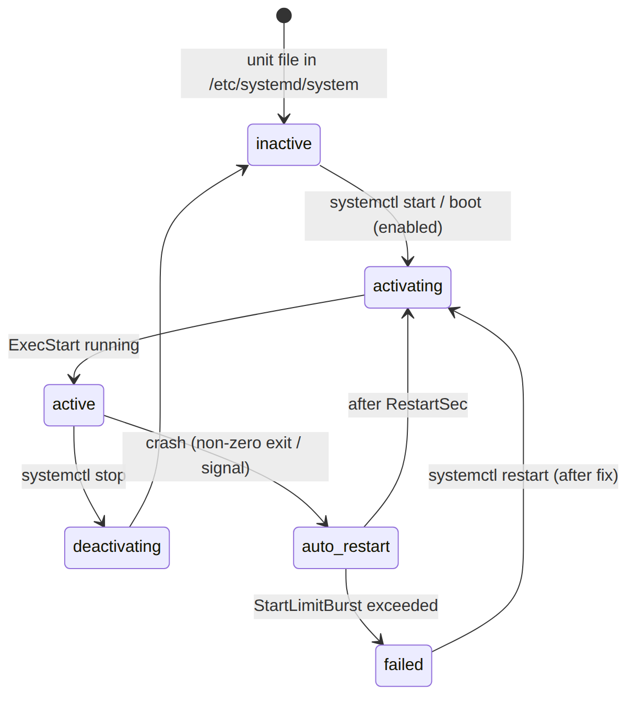

# 📚 Day 18 — systemd দিয়ে Service Management

> 📊 **Visual Summary** — সহজে বোঝার জন্য diagram:



**সময়:** ১.৫ ঘণ্টা | **Module:** ৩ (Application Deployment on EC2) — Day 4

## 🎯 আজকের লক্ষ্য
- systemd কী, কেন app-কে service হিসেবে চালাতে হয়
- Unit file-এর গঠন (`[Unit]`, `[Service]`, `[Install]`)
- `ExecStart`, `WorkingDirectory`, `User`, Environment variable
- Restart policy (`always`, `on-failure`)
- `systemctl` দিয়ে enable/start/status
- Security hardening
- Troubleshooting

---

## Part 1: সমস্যা — কেন `node app.js` যথেষ্ট না?

ধরুন EC2-তে SSH/SSM দিয়ে ঢুকে চালালেন:

```bash
node /opt/myapp/server.js
```

সমস্যাগুলো:

| সমস্যা | কী হয় |
|---|---|
| Terminal বন্ধ করলেন | App-ও বন্ধ হয়ে যায় |
| App crash করল | কেউ আবার চালু করে না, site down |
| Server reboot হলো | App আর চালু হয় না |
| Log কোথায়? | Terminal-এ print হয়ে হারিয়ে যায় |
| Root হিসেবে চলছে | App hack হলে পুরো server হাতছাড়া |

`nohup node server.js &` বা `screen` দিয়ে কিছুটা সামলানো যায়, কিন্তু crash হলে restart বা boot-এ auto start হয় না।

👉 সমাধান: App-কে **systemd service** বানানো।

---

## Part 2: systemd কী?

**systemd** = আধুনিক Linux-এর (Amazon Linux 2/2023, Ubuntu, RHEL) **init system ও service manager**। Boot-এর সময় সবার আগে চালু হয় (PID 1), তারপর বাকি সব service চালায় আর দেখাশোনা করে।

systemd আপনার app-এর জন্য যা করে:
- ✅ Boot-এর সময় **auto start**
- ✅ Crash করলে **auto restart**
- ✅ কোন user হিসেবে চলবে তা ঠিক করা
- ✅ Environment variable দেওয়া
- ✅ Log **journald**-এ রাখা (`journalctl` দিয়ে দেখা)
- ✅ Dependency: "network চালু হওয়ার পরে app চালাও"
- ✅ Resource limit (memory, open file)

> আপনি ইতিমধ্যে systemd ব্যবহার করেছেন: `sshd`, `amazon-ssm-agent`, `amazon-cloudwatch-agent` (Day 17), `nginx` সব systemd service।

### 🧩 Unit type

| Unit | Extension | কাজ |
|---|---|---|
| **Service** | `.service` | একটা process/daemon চালানো ← আজকের মূল বিষয় |
| Timer | `.timer` | cron-এর মতো schedule |
| Socket | `.socket` | socket activation |
| Target | `.target` | অনেক unit-এর group (যেমন `multi-user.target`) |
| Mount | `.mount` | file system mount |

---

## Part 3: Unit File-এর গঠন

Unit file রাখার জায়গা:
- **`/etc/systemd/system/`** ← আপনার নিজের service এখানে রাখবেন
- `/usr/lib/systemd/system/` (বা `/lib/systemd/system/`) ← package-এর service, এখানে হাত দেবেন না

### 📝 উদাহরণ: `/etc/systemd/system/myapp.service`

```ini
[Unit]
Description=MyApp Node.js API
Documentation=https://github.com/example/myapp
After=network-online.target
Wants=network-online.target

[Service]
Type=simple
User=myapp
Group=myapp
WorkingDirectory=/opt/myapp
EnvironmentFile=/etc/myapp/myapp.env
Environment=NODE_ENV=production
ExecStart=/usr/bin/node /opt/myapp/server.js
Restart=on-failure
RestartSec=5

StandardOutput=journal
StandardError=journal

[Install]
WantedBy=multi-user.target
```

### 🔍 তিনটা section

| Section | কী থাকে |
|---|---|
| `[Unit]` | বর্ণনা আর **dependency/order**: কার পরে চালু হবে |
| `[Service]` | **কীভাবে চালাবে**: command, user, env, restart policy |
| `[Install]` | `enable` করলে **কোন target-এর সাথে boot-এ চালু হবে** |

---

## Part 4: `[Unit]` Section

| Directive | মানে |
|---|---|
| `Description=` | `systemctl status`-এ যে নাম দেখায় |
| `After=network-online.target` | network পুরোপুরি ready হওয়ার **পরে** চালু হবে (ordering) |
| `Wants=network-online.target` | network-online target-কেও চালু করতে বলে (dependency) |
| `Requires=` | কঠিন dependency: ওটা fail করলে এটাও বন্ধ |
| `StartLimitIntervalSec=` / `StartLimitBurst=` | কত সময়ে কতবার restart চেষ্টা করবে (নিচে Part 6) |

> ⚠️ `After=` শুধু **ক্রম** ঠিক করে, নিজে কিছু চালু করে না। তাই সাধারণত `After=` আর `Wants=` একসাথে লেখা হয়।

---

## Part 5: `[Service]` Section — সবচেয়ে গুরুত্বপূর্ণ

### ▶️ ExecStart
```ini
ExecStart=/usr/bin/node /opt/myapp/server.js
```
- **Absolute path** দিতে হবে। `node server.js` লিখলে কাজ করবে না
- Path বের করতে: `which node` → `/usr/bin/node`
- nvm দিয়ে install করা node user-এর home-এ থাকে (`~/.nvm/...`)। Service-এ সেই পুরো path দিন, অথবা system-wide node install করুন

**Python (Gunicorn) উদাহরণ:**
```ini
WorkingDirectory=/opt/flaskapp
ExecStart=/opt/flaskapp/venv/bin/gunicorn --workers 3 --bind 127.0.0.1:8000 app:app
```

অন্যান্য:
- `ExecStartPre=`: start-এর আগে কিছু চালানো (যেমন migration)
- `ExecReload=/bin/kill -HUP $MAINPID`: `systemctl reload`-এ কী হবে

### 📁 WorkingDirectory
App যে folder থেকে চলবে। Relative path (`./config.json`) এখান থেকে ধরা হয়।

### 👤 User / Group
```bash
# আলাদা system user বানানো (login করা যায় না)
sudo useradd --system --no-create-home --shell /sbin/nologin myapp
sudo chown -R myapp:myapp /opt/myapp
```
কখনো **root** হিসেবে app চালাবেন না।

### 🌱 Environment Variables

**উপায় ১: সরাসরি unit file-এ** (secret নয় এমন মানের জন্য)
```ini
Environment=NODE_ENV=production
Environment=PORT=3000
```

**উপায় ২: EnvironmentFile** (recommended)
```ini
EnvironmentFile=/etc/myapp/myapp.env
```
```bash
# /etc/myapp/myapp.env
PORT=3000
DB_HOST=mydb.xxxx.ap-south-1.rds.amazonaws.com
```
```bash
sudo chmod 600 /etc/myapp/myapp.env   # শুধু root পড়তে পারবে (systemd root হিসেবে পড়ে app-এ দেয়)
```

> 🔐 Password বা API key file-এ রাখার চেয়ে ভালো: **Parameter Store / Secrets Manager** (Day 16) থেকে app নিজে পড়ুক, অথবা `ExecStartPre` script দিয়ে env file বানান। Day 20-এ বিস্তারিত।

### 🏷 Type

| Type | কখন |
|---|---|
| `simple` (default) | Process foreground-এ চলে: node, gunicorn, java -jar ← বেশিরভাগ app |
| `exec` | `simple`-এর মতো, কিন্তু binary শুরু হওয়া নিশ্চিত হলে তবেই "started" ধরে |
| `forking` | পুরনো ধাঁচের daemon, যেটা নিজে background-এ fork করে |
| `oneshot` | একবার চলে শেষ হয়ে যায় (script, migration) |
| `notify` | App নিজে systemd-কে "ready" জানায় |

---

## Part 6: Restart Policy

```ini
Restart=on-failure
RestartSec=5
```

| `Restart=` | কখন restart করে |
|---|---|
| `no` (default) | কখনো না |
| **`on-failure`** | Non-zero exit code, signal-এ মারা গেলে, timeout হলে ← **app-এর জন্য সাধারণত সবচেয়ে ভালো** |
| **`always`** | যেকোনো ভাবে বন্ধ হলেই (স্বাভাবিকভাবে exit করলেও) |
| `on-abnormal` | signal বা timeout-এ, কিন্তু exit code-এ না |

### 🔁 Restart loop ঠেকানো
App যদি start হয়েই crash করে (যেমন config ভুল), systemd বারবার restart করতে থাকবে। সীমা দিন:

```ini
[Unit]
StartLimitIntervalSec=300
StartLimitBurst=5

[Service]
Restart=on-failure
RestartSec=5
```
মানে: ৫ মিনিটে ৫ বারের বেশি fail করলে systemd হাল ছেড়ে দেবে (state: `failed`), আর তখন আপনার alarm বাজা উচিত।

---

## Part 7: `[Install]` Section

```ini
[Install]
WantedBy=multi-user.target
```
- `multi-user.target` = স্বাভাবিক server boot (GUI ছাড়া)
- `systemctl enable` চালালে systemd `multi-user.target.wants/`-এ symlink বানায়, তাই boot-এ চালু হয়

---

## Part 8: `systemctl` Commands

```bash
# নতুন বা পরিবর্তিত unit file পড়ানো (প্রতিবার edit-এর পর!)
sudo systemctl daemon-reload

# Boot-এ auto start + এখনই start
sudo systemctl enable --now myapp

# অবস্থা দেখা
sudo systemctl status myapp

# Start / Stop / Restart / Reload
sudo systemctl start myapp
sudo systemctl stop myapp
sudo systemctl restart myapp
sudo systemctl reload myapp          # ExecReload থাকলে

# Boot-এ চালু হবে কিনা
systemctl is-enabled myapp
systemctl is-active myapp

# সব failed service
systemctl --failed

# Unit file দেখা
systemctl cat myapp
```

### 📊 `systemctl status` output পড়া
```
● myapp.service - MyApp Node.js API
     Loaded: loaded (/etc/systemd/system/myapp.service; enabled; preset: disabled)
     Active: active (running) since Mon 2026-09-28 10:00:00 UTC; 5min ago
   Main PID: 12345 (node)
      Tasks: 11
     Memory: 45.2M
     CGroup: /system.slice/myapp.service
             └─12345 /usr/bin/node /opt/myapp/server.js
```

| অংশ | মানে |
|---|---|
| `Loaded ... enabled` | boot-এ চালু হবে |
| `Active: active (running)` | এখন চলছে ✅ |
| `Active: failed` | বন্ধ হয়ে গেছে ❌ → log দেখুন |
| `activating (auto-restart)` | crash করেছে, restart-এর অপেক্ষায় |

---

## Part 9: Log দেখা — `journalctl`

stdout/stderr-এ যা print হয়, সব **journald**-এ যায়:

```bash
journalctl -u myapp              # সব log
journalctl -u myapp -f           # live (tail -f এর মতো)
journalctl -u myapp -n 100       # শেষ ১০০ লাইন
journalctl -u myapp --since "1 hour ago"
journalctl -u myapp -p err       # শুধু error level
journalctl -u myapp -b           # এই boot-এর log
```
Day 20-এ journald-এর retention আর CloudWatch-এ পাঠানো শিখব।

---

## Part 10: Security Hardening (Production)

systemd নিজেই app-কে sandbox-এ রাখতে পারে। কোনো code বদলাতে হয় না:

```ini
[Service]
NoNewPrivileges=true          # sudo/setuid দিয়ে বেশি privilege নিতে পারবে না
PrivateTmp=true               # নিজস্ব আলাদা /tmp
ProtectSystem=strict          # পুরো file system read-only
ReadWritePaths=/var/lib/myapp /var/log/myapp   # শুধু এগুলোতে লিখতে পারবে
ProtectHome=true              # /home দেখতে পারবে না
LimitNOFILE=65535             # বেশি connection-এর জন্য open file limit
MemoryMax=512M                # memory সীমা (cgroup)
```

> 💡 Port 80/443-এর মতো ১০২৪-এর নিচের port-এ non-root user bind করতে পারে না। দুটো উপায়:
> 1. **App 3000-এ চালান, সামনে Nginx 80/443-এ রাখুন** (Day 19): recommended
> 2. `AmbientCapabilities=CAP_NET_BIND_SERVICE`

নিজের service কতটা নিরাপদ তা দেখতে: `systemd-analyze security myapp`

---

## Part 11: Hands-on Lab — Node.js app-কে service বানানো

```bash
# 1. Node install (Amazon Linux 2023)
sudo dnf install -y nodejs

# 2. User ও folder
sudo useradd --system --no-create-home --shell /sbin/nologin myapp
sudo mkdir -p /opt/myapp /etc/myapp

# 3. ছোট একটা app
sudo tee /opt/myapp/server.js > /dev/null <<'EOF'
const http = require('http');
const port = process.env.PORT || 3000;
http.createServer((req, res) => {
  res.end(`Hello from ${require('os').hostname()}\n`);
}).listen(port, '127.0.0.1', () => console.log(`listening on ${port}`));
EOF
sudo chown -R myapp:myapp /opt/myapp

# 4. Env file
echo "PORT=3000" | sudo tee /etc/myapp/myapp.env
sudo chmod 600 /etc/myapp/myapp.env

# 5. Unit file (Part 3-এর উদাহরণ) লিখুন: /etc/systemd/system/myapp.service

# 6. চালু করা
sudo systemctl daemon-reload
sudo systemctl enable --now myapp
curl http://127.0.0.1:3000

# 7. Crash test: process মেরে দেখুন systemd আবার চালু করে কিনা
sudo kill -9 $(systemctl show -p MainPID --value myapp)
sleep 6 && systemctl status myapp    # নতুন PID দেখাবে ✅

# 8. Reboot test
sudo reboot
# আবার ঢুকে: systemctl status myapp → active (running) ✅
```

---

## Part 12: Troubleshooting

| লক্ষণ | কারণ / সমাধান |
|---|---|
| `status=203/EXEC` | `ExecStart`-এর path ভুল বা file executable না। `which node` দিয়ে সঠিক path দিন |
| `status=200/CHDIR` | `WorkingDirectory` নেই |
| `status=217/USER` | `User=`-এর user নেই |
| `Permission denied` | app folder-এর owner ঠিক নেই (`chown -R myapp:myapp`) |
| Edit করলাম, কিছু বদলায়নি | `daemon-reload` দেননি |
| `EADDRINUSE` | ঐ port-এ আগে থেকে অন্য process চলছে (`sudo ss -tlnp \| grep 3000`) |
| Env variable পাচ্ছে না | `EnvironmentFile` path ভুল; অথবা `.bashrc`-এ set করেছেন, systemd ওটা পড়ে না! |
| Boot-এ চালু হয় না | `enable` করা হয়নি (`systemctl is-enabled`) |
| বারবার restart | `journalctl -u myapp -n 50` দেখে আসল error বের করুন |

---

## 🎯 আজকের মূল Takeaways

1. Production app **systemd service** হিসেবে চালান: auto start, auto restart, log
2. Unit file থাকবে `/etc/systemd/system/<name>.service`-এ
3. `[Unit]` = ক্রম/dependency, `[Service]` = কীভাবে চালাবে, `[Install]` = boot target
4. `ExecStart`-এ **absolute path**
5. আলাদা **non-root user** দিয়ে চালান
6. `Restart=on-failure` + `StartLimitBurst` দিয়ে loop ঠেকান
7. প্রতিবার edit-এর পর **`daemon-reload`**
8. Log দেখতে: `journalctl -u <name> -f`

---

## 📝 Self-check Questions

1. `nohup node app.js &` আর systemd service-এর মূল পার্থক্য কী?
2. `After=` আর `Wants=`-এর পার্থক্য কী?
3. `Restart=always` আর `Restart=on-failure`-এর পার্থক্য কী?
4. Unit file edit করার পর কোন command চালাতে হয়?
5. `status=203/EXEC` error মানে কী?
6. `.bashrc`-এ export করা variable service পায় না কেন?
7. Non-root app-কে port 80-এ চালানোর দুটো উপায় কী?

<details><summary>▶ উত্তর দেখুন</summary>

1. systemd crash-এ auto restart, boot-এ auto start, journald log আর user/resource control দেয়। nohup এগুলোর কোনোটাই দেয় না।
2. `After=` শুধু ক্রম ঠিক করে, `Wants=` ঐ unit-টা চালু করতেও বলে।
3. `always` স্বাভাবিক exit-এও restart করে; `on-failure` শুধু error বা crash হলে।
4. `sudo systemctl daemon-reload` (তারপর `restart`)।
5. `ExecStart`-এর binary পাওয়া যাচ্ছে না বা executable না।
6. systemd login shell চালায় না, তাই `.bashrc` পড়ে না। `Environment=` বা `EnvironmentFile=` ব্যবহার করুন।
7. সামনে Nginx reverse proxy রাখা (recommended), অথবা `AmbientCapabilities=CAP_NET_BIND_SERVICE`।
</details>

---

## 💡 Pro Tips

- Package-এর service বদলাতে মূল file edit না করে **drop-in override** দিন: `sudo systemctl edit nginx` (তাহলে package update-এ আপনার পরিবর্তন মুছে যায় না)
- Cron-এর বদলে **systemd timer** ব্যবহার করতে পারেন। log journald-এ যায়, আর missed run-ও ধরে (`Persistent=true`)
- `systemd-analyze blame` দিয়ে দেখুন boot-এ কোন service বেশি সময় নিচ্ছে
- User Data (Day 15)-তে unit file লিখে `enable --now` করলে instance launch হলেই app চালু হয়ে যায়
- Service fail হলে জানতে `OnFailure=notify@%n.service` দিয়ে alert পাঠাতে পারেন

---

## 🎨 Quick Reference

```ini
[Unit]
Description=My App
After=network-online.target
Wants=network-online.target
StartLimitIntervalSec=300
StartLimitBurst=5

[Service]
Type=simple
User=myapp
WorkingDirectory=/opt/myapp
EnvironmentFile=/etc/myapp/myapp.env
ExecStart=/usr/bin/node /opt/myapp/server.js
Restart=on-failure
RestartSec=5
NoNewPrivileges=true

[Install]
WantedBy=multi-user.target
```

```bash
sudo systemctl daemon-reload
sudo systemctl enable --now myapp
systemctl status myapp
journalctl -u myapp -f
```

---

## 🚨 বাস্তব পরিস্থিতি (যেসব ভুল প্রায়ই হয়)

**পরিস্থিতি ১:** Developer `screen`-এর ভেতরে app চালিয়ে রেখেছিলেন। রাতে AWS maintenance-এ instance reboot হলো, আর সকাল পর্যন্ত site down থাকল।
**শিক্ষা:** `systemctl enable` করা service হলে reboot-এর পর নিজে থেকেই চালু হতো।

**পরিস্থিতি ২:** Unit file-এ port বদলানো হলো, restart-ও করা হলো, কিন্তু app পুরনো port-এই চলছিল। `daemon-reload` দেওয়া হয়নি।
**শিক্ষা:** Edit → `daemon-reload` → `restart`।

**পরিস্থিতি ৩:** App root হিসেবে চলছিল। একটা file upload vulnerability দিয়ে attacker পুরো server-এর control নিয়ে নিল।
**শিক্ষা:** আলাদা system user, `NoNewPrivileges`, `ProtectSystem` দিলে ক্ষতি অনেক সীমিত থাকত।

---

**⏮ আগের দিন:** [Day 17 — CloudWatch Agent](./Day-17-CloudWatch-Agent-Setup.md) | **⏭ পরের দিন:** [Day 19 — Nginx Reverse Proxy ও App Deploy](./Day-19-Nginx-Reverse-Proxy-App-Deploy.md)
