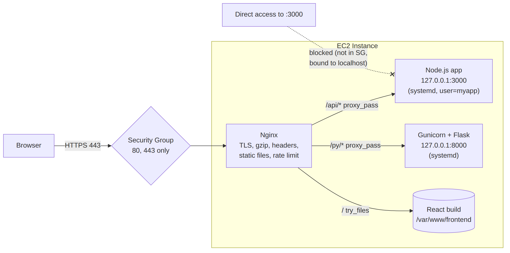

# 📚 Day 19 — Nginx Reverse Proxy ও Node.js / Python App Deploy

> 📊 **Visual Summary** — সহজে বোঝার জন্য diagram:



**সময়:** ১.৫ ঘণ্টা | **Module:** ৩ (Application Deployment on EC2) — Day 5

## 🎯 আজকের লক্ষ্য
- Reverse proxy কী, কেন app-এর সামনে Nginx রাখতে হয়
- Nginx install ও config file-এর গঠন
- Node.js app deploy (Nginx → Node + systemd)
- Python app deploy (Nginx → Gunicorn + systemd)
- Static file, WebSocket, gzip, header
- HTTPS: Let's Encrypt বনাম ALB + ACM
- Security Group ও troubleshooting (502/504)

---

## Part 1: Reverse Proxy কী?

**Reverse proxy** = client আর আপনার app-এর মাঝখানে বসা একটা server। Client মনে করে Nginx-এর সাথে কথা বলছে, কিন্তু Nginx ভেতরে request app-এ পাঠিয়ে দেয়।

```
Browser ──HTTP :80/443──► Nginx ──HTTP 127.0.0.1:3000──► Node.js app
                          (public)                       (শুধু localhost)
```

### 🤔 কেন সরাসরি Node-কে port 80-এ চালাব না?

| Nginx সামনে থাকলে যা পাই | ব্যাখ্যা |
|---|---|
| 🔐 **TLS/HTTPS termination** | Certificate Nginx-এ, app-কে HTTPS নিয়ে ভাবতে হয় না |
| 🚪 **Port 80/443** | App non-root user হয়ে 3000-এ চলে (Day 18) |
| ⚡ **Static file দ্রুত serve** | CSS/JS/image Nginx নিজেই দেয়, app-এর উপর চাপ কমে |
| 🔀 **Routing** | `/api` → Node, `/` → React build, `/admin` → অন্য app |
| 🛡 **Buffering ও protection** | ধীর client (slowloris), বড় request size limit, rate limit |
| 🗜 **gzip compression** | কম bandwidth |
| ⚖️ **Load balancing** | একই server-এ একাধিক app process-এ ভাগ করা |
| 🔄 **Zero-downtime reload** | `nginx -s reload`-এ চলমান connection কাটে না |

---

## Part 2: Nginx Install

```bash
# Amazon Linux 2023
sudo dnf install -y nginx
sudo systemctl enable --now nginx

# Ubuntu
sudo apt update && sudo apt install -y nginx
```

যাচাই:
```bash
curl -I http://localhost      # HTTP/1.1 200 OK, Server: nginx
```

Browser থেকে `http://<public-ip>` খুলতে হলে **Security Group-এ port 80 খোলা থাকতে হবে** (Day 3)।

### 📂 গুরুত্বপূর্ণ file ও folder

| Path | কাজ |
|---|---|
| `/etc/nginx/nginx.conf` | মূল config |
| `/etc/nginx/conf.d/*.conf` | আপনার site config (Amazon Linux/RHEL-এ) |
| `/etc/nginx/sites-available/` + `sites-enabled/` | Ubuntu/Debian-এর ধরন (symlink দিয়ে enable) |
| `/var/log/nginx/access.log` | প্রতিটা request |
| `/var/log/nginx/error.log` | error (502 ইত্যাদির কারণ এখানে) |
| `/usr/share/nginx/html` | default web root |

---

## Part 3: Config-এর গঠন

```nginx
http {                               # nginx.conf-এ আগে থেকে থাকে
    server {                         # একটা website / virtual host
        listen 80;
        server_name api.example.com;

        location / {                 # কোন URL path-এ কী হবে
            proxy_pass http://127.0.0.1:3000;
        }
    }
}
```

- **server block** = একটা domain বা site
- **location block** = URL path অনুযায়ী rule
- **`proxy_pass`** = request কোথায় পাঠাবে
- **upstream** = একাধিক backend-এর group (load balancing)

---

## Part 4: Node.js App Deploy — সম্পূর্ণ ধাপ

### Step 1: App আর systemd (Day 18 থেকে)
App চলছে `127.0.0.1:3000`-এ, systemd service `myapp` হিসেবে।

> ⚠️ App-কে `127.0.0.1`-এ bind করুন, `0.0.0.0`-এ নয়। তাহলে বাইরে থেকে কেউ Nginx-কে পাশ কাটিয়ে সরাসরি 3000-এ ঢুকতে পারবে না।

### Step 2: Nginx site config — `/etc/nginx/conf.d/myapp.conf`

```nginx
upstream myapp_backend {
    server 127.0.0.1:3000;
    keepalive 32;
}

server {
    listen 80;
    server_name api.example.com;          # domain না থাকলে: server_name _;

    client_max_body_size 10m;             # upload সীমা (default 1m)

    location / {
        proxy_pass http://myapp_backend;
        proxy_http_version 1.1;

        # app যেন আসল client-এর তথ্য জানে
        proxy_set_header Host              $host;
        proxy_set_header X-Real-IP         $remote_addr;
        proxy_set_header X-Forwarded-For   $proxy_add_x_forwarded_for;
        proxy_set_header X-Forwarded-Proto $scheme;
        proxy_set_header Connection        "";

        proxy_connect_timeout 5s;
        proxy_read_timeout    60s;
    }

    location /health {
        proxy_pass http://myapp_backend;
        access_log off;                    # health check দিয়ে log ভরাবেন না
    }
}
```

### Step 3: Test ও reload
```bash
sudo nginx -t                    # syntax check — সবসময় আগে!
sudo systemctl reload nginx      # downtime ছাড়া নতুন config
curl -H "Host: api.example.com" http://localhost/
```

### 🔍 Header-গুলো কেন?

| Header | না দিলে কী হয় |
|---|---|
| `Host` | App ভুল domain দেখে (redirect ভুল হয়) |
| `X-Real-IP` / `X-Forwarded-For` | App-এর log-এ সব request `127.0.0.1` থেকে আসছে দেখায়; rate limit কাজ করে না |
| `X-Forwarded-Proto` | App বুঝতে পারে না user HTTPS-এ ছিল, ফলে redirect loop বা insecure cookie |

> Express-এ `app.set('trust proxy', 1)` দিন, তাহলে `req.ip` আসল IP দেখাবে।

---

## Part 5: Python App Deploy — Nginx → Gunicorn

Flask/Django-র নিজস্ব dev server (`flask run`, `manage.py runserver`) production-এর জন্য না। দরকার **WSGI server: Gunicorn**।

```bash
# App setup
sudo dnf install -y python3 python3-pip
sudo mkdir -p /opt/flaskapp && cd /opt/flaskapp
sudo python3 -m venv venv
sudo ./venv/bin/pip install flask gunicorn

sudo tee app.py > /dev/null <<'EOF'
from flask import Flask
app = Flask(__name__)

@app.get("/")
def home():
    return "Hello from Flask behind Nginx!"
EOF
sudo chown -R myapp:myapp /opt/flaskapp
```

**systemd unit** — `/etc/systemd/system/flaskapp.service`:
```ini
[Unit]
Description=Flask app via Gunicorn
After=network-online.target
Wants=network-online.target

[Service]
User=myapp
WorkingDirectory=/opt/flaskapp
ExecStart=/opt/flaskapp/venv/bin/gunicorn --workers 3 --bind 127.0.0.1:8000 app:app
Restart=on-failure

[Install]
WantedBy=multi-user.target
```

- `--workers`: সাধারণ নিয়ম **(2 × vCPU) + 1**
- `app:app` = `app.py` file-এর ভেতরের `app` object

**Nginx** — আগের config-এর মতোই, শুধু `server 127.0.0.1:8000;`।

---

## Part 6: Static Files ও SPA (React/Vue)

```nginx
server {
    listen 80;
    server_name example.com;

    root /var/www/frontend/dist;          # React build
    index index.html;

    # API → backend
    location /api/ {
        proxy_pass http://127.0.0.1:3000;
        proxy_set_header Host $host;
        proxy_set_header X-Forwarded-For $proxy_add_x_forwarded_for;
        proxy_set_header X-Forwarded-Proto $scheme;
    }

    # static asset — লম্বা cache
    location ~* \.(js|css|png|jpg|svg|woff2)$ {
        expires 30d;
        add_header Cache-Control "public, immutable";
    }

    # SPA routing — অজানা path-এ index.html
    location / {
        try_files $uri $uri/ /index.html;
    }
}
```

> 💡 বড় scale-এ static file **S3 + CloudFront**-এ রাখুন (Module 7)। Nginx শুধু API proxy করবে।

---

## Part 7: WebSocket, gzip, Security Header

### WebSocket (Socket.IO, live chat)
```nginx
location /socket.io/ {
    proxy_pass http://127.0.0.1:3000;
    proxy_http_version 1.1;
    proxy_set_header Upgrade $http_upgrade;
    proxy_set_header Connection "upgrade";
    proxy_read_timeout 3600s;
}
```

### gzip (`http` বা `server` block-এ)
```nginx
gzip on;
gzip_types text/plain text/css application/json application/javascript image/svg+xml;
gzip_min_length 1024;
```

### Security header ও version লুকানো
```nginx
server_tokens off;
add_header X-Content-Type-Options nosniff;
add_header X-Frame-Options SAMEORIGIN;
add_header Referrer-Policy strict-origin-when-cross-origin;
```

### Rate limit (brute force ঠেকাতে)
```nginx
# http block-এ
limit_req_zone $binary_remote_addr zone=login:10m rate=5r/m;

# server block-এ
location /api/login {
    limit_req zone=login burst=5 nodelay;
    proxy_pass http://127.0.0.1:3000;
}
```

---

## Part 8: HTTPS — দুটো পথ

### পথ ১: EC2-তে Let's Encrypt (single server)
```bash
# Amazon Linux 2023
sudo dnf install -y certbot python3-certbot-nginx
sudo certbot --nginx -d api.example.com
# certbot নিজেই Nginx config-এ ssl যোগ করে, আর HTTP → HTTPS redirect দেয়
sudo systemctl list-timers | grep certbot   # auto-renew timer
```
- দরকার: domain-এর DNS (Route 53 A record) এই EC2-এর **Elastic IP**-তে point করা, আর SG-তে 80 ও 443 খোলা
- ✅ Free, সহজ। ❌ Server একটাই হলে ঠিক আছে, অনেক server হলে প্রতিটায় certificate manage করা ঝামেলা

### পথ ২: ALB + ACM (production, recommended)
```
Browser ──HTTPS 443──► ALB (ACM certificate) ──HTTP 80──► EC2: Nginx ──► app
```
- **ACM certificate free, auto-renew** হয় (Q104 দেখুন)
- TLS termination হয় ALB-এ, EC2-তে certificate লাগে না
- EC2 থাকে **private subnet**-এ। EC2-এর SG-তে port 80 শুধু **ALB-এর SG** থেকে allow
- ALB listener: 80 → 443 redirect, 443 → target group
- Nginx-এ `X-Forwarded-Proto` ALB থেকে আসে, তাই `$http_x_forwarded_proto` pass করুন

| | Let's Encrypt on EC2 | ALB + ACM |
|---|---|---|
| Cost | Free | ALB-এর ঘণ্টাপ্রতি খরচ |
| Scaling | Single server | Auto Scaling-এর সাথে সহজ |
| EC2 exposure | Public | Private subnet |
| Certificate management | Certbot renew | AWS নিজে |

---

## Part 9: Security Group Setup

**Single server (পথ ১):**

| Inbound | Port | Source |
|---|---|---|
| HTTP | 80 | 0.0.0.0/0 |
| HTTPS | 443 | 0.0.0.0/0 |
| ~~Custom 3000~~ | ❌ খুলবেন না | App শুধু localhost-এ |
| ~~SSH 22~~ | ❌ | SSM Session Manager ব্যবহার করুন (Day 16) |

**ALB-এর পেছনে (পথ ২):**

| SG | Inbound |
|---|---|
| `alb-sg` | 80, 443 from 0.0.0.0/0 |
| `app-sg` | 80 **from `alb-sg`** (SG reference) |

---

## Part 10: Troubleshooting — 502, 504, 413

| Error | মানে | কী দেখবেন |
|---|---|---|
| **502 Bad Gateway** | Nginx backend-এ পৌঁছাতে পারেনি | App চলছে কি? `systemctl status myapp`; port মিলছে কি? `ss -tlnp` |
| **504 Gateway Timeout** | Backend খুব দেরি করছে | ধীর query; `proxy_read_timeout` বাড়ানো (সাবধানে) |
| **413 Request Entity Too Large** | Upload বড় | `client_max_body_size` বাড়ান |
| **403 Forbidden** | Static file পড়ার permission নেই | `root` folder-এর permission; SELinux (RHEL) |
| **(13: Permission denied) while connecting to upstream** | RHEL/SELinux-এ Nginx network connect করতে পারছে না | `sudo setsebool -P httpd_can_network_connect 1` |
| Config reload হচ্ছে না | Syntax error | `sudo nginx -t` |
| ALB target **unhealthy** | Health check path 200 দিচ্ছে না | `/health` route; SG-তে ALB থেকে port খোলা কিনা |

**Debug-এর ক্রম:**
```bash
curl -v http://127.0.0.1:3000/          # 1. app নিজে চলছে?
curl -v http://localhost/                # 2. nginx হয়ে যাচ্ছে?
sudo tail -f /var/log/nginx/error.log    # 3. nginx কী বলছে?
journalctl -u myapp -n 50                # 4. app কী বলছে?
```

---

## 🎯 আজকের মূল Takeaways

1. App থাকে `127.0.0.1:<port>`-এ, সামনে **Nginx reverse proxy** 80/443-এ
2. `proxy_set_header` দিয়ে আসল client IP আর protocol app-কে জানান
3. Python-এ dev server না, **Gunicorn** (+ systemd)
4. Config বদলালে: **`nginx -t` → `systemctl reload nginx`**
5. HTTPS: একটা server হলে **Let's Encrypt**, production-এ **ALB + ACM**
6. SG-তে শুধু 80/443; app port আর SSH খুলবেন না
7. 502 = app পৌঁছানো যাচ্ছে না, 504 = app দেরি করছে

---

## 📝 Self-check Questions

1. Reverse proxy ব্যবহারের ৪টা সুবিধা বলুন।
2. App `0.0.0.0:3000`-এ না, `127.0.0.1:3000`-এ bind করা কেন ভালো?
3. `X-Forwarded-Proto` header না দিলে কী সমস্যা হতে পারে?
4. Flask app production-এ কীভাবে চালাবেন?
5. 502 আর 504-এর পার্থক্য কী?
6. ALB + ACM ব্যবহার করলে EC2-এর Security Group কেমন হবে?
7. CloudFront-এর জন্য ACM certificate কোন region-এ বানাতে হয়? ALB-এর জন্য?

<details><summary>▶ উত্তর দেখুন</summary>

1. TLS termination, static file serve, routing, buffering/rate limit, gzip, zero-downtime reload (যেকোনো ৪টা)।
2. তাহলে বাইরে থেকে কেউ Nginx-কে পাশ কাটিয়ে সরাসরি app-এ ঢুকতে পারবে না।
3. App বুঝবে না user HTTPS-এ ছিল, ফলে redirect loop বা cookie-র Secure flag নিয়ে সমস্যা।
4. Gunicorn (WSGI) + systemd service, সামনে Nginx।
5. 502 = backend-এ পৌঁছানো যায়নি (app বন্ধ বা ভুল port); 504 = পৌঁছেছে কিন্তু সময়মতো উত্তর আসেনি।
6. App port (যেমন 80) শুধু ALB-এর security group থেকে allow; public থেকে কিছু খোলা না।
7. CloudFront → `us-east-1`; ALB → ALB যে region-এ আছে সেখানেই।
</details>

---

## 💡 Pro Tips

- Config edit-এর আগে backup: `sudo cp myapp.conf myapp.conf.bak`
- Nginx access log JSON format-এ লিখলে CloudWatch Logs Insights-এ (Day 17) query সহজ হয়
- `/health` endpoint রাখুন। ALB health check আর monitoring দুটোতেই লাগে
- এক server-এ একাধিক app: আলাদা `server_name` (subdomain) বা আলাদা `location`
- Node-এ CPU core-এর সংখ্যা অনুযায়ী একাধিক process চালাতে Nginx `upstream`-এ একাধিক port দিন, অথবা PM2 cluster mode (Day 20)

---

## 🎨 Quick Reference

```nginx
server {
    listen 80;
    server_name _;
    location / {
        proxy_pass http://127.0.0.1:3000;
        proxy_http_version 1.1;
        proxy_set_header Host $host;
        proxy_set_header X-Real-IP $remote_addr;
        proxy_set_header X-Forwarded-For $proxy_add_x_forwarded_for;
        proxy_set_header X-Forwarded-Proto $scheme;
    }
}
```

```bash
sudo nginx -t && sudo systemctl reload nginx
sudo tail -f /var/log/nginx/error.log
sudo ss -tlnp | grep -E ':80|:3000'
```

```
Internet → [SG 80/443] → Nginx :80 → 127.0.0.1:3000 (Node, systemd)
                                   → 127.0.0.1:8000 (Gunicorn, systemd)
```

---

## 🚨 বাস্তব পরিস্থিতি (যেসব ভুল প্রায়ই হয়)

**পরিস্থিতি ১:** Deploy-এর পর সব request-এ 502। App আসলে `localhost:3001`-এ চলছিল, Nginx পাঠাচ্ছিল 3000-এ।
**শিক্ষা:** `ss -tlnp` দিয়ে port মিলিয়ে দেখুন; port একটা env variable-এ রাখুন।

**পরিস্থিতি ২:** Login-এর পর user বারবার login page-এ ফিরে আসছিল। ALB-তে HTTPS, কিন্তু app `X-Forwarded-Proto` পাচ্ছিল না, তাই secure cookie set হচ্ছিল না।
**শিক্ষা:** Proxy header আর `trust proxy` setting ঠিক রাখুন।

**পরিস্থিতি ৩:** SG-তে port 3000 খোলা ছিল। Scanner সরাসরি app-এ ঢুকে Nginx-এর rate limit পাশ কাটিয়ে গেল।
**শিক্ষা:** App localhost-এ bind করুন, SG-তে শুধু 80/443।

---

**⏮ আগের দিন:** [Day 18 — systemd](./Day-18-systemd-Service-Management.md) | **⏭ পরের দিন:** [Day 20 — PM2, Environment Config ও Log Management](./Day-20-PM2-Env-Config-Log-Management.md)
