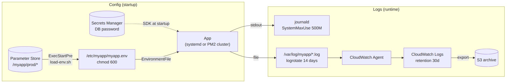

# 📚 Day 20 — PM2, Environment-based Config ও Log Management

> 📊 **Visual Summary** — সহজে বোঝার জন্য diagram:



**সময়:** ১.৫ ঘণ্টা | **Module:** ৩ (Application Deployment on EC2) — Day 6

## 🎯 আজকের লক্ষ্য
- PM2 কী, systemd-এর সাথে তুলনা
- PM2 cluster mode, ecosystem file, zero-downtime reload
- Environment-based config: `.env` বনাম Parameter Store / Secrets Manager
- journald: log দেখা, retention, persistent storage
- logrotate দিয়ে file log সামলানো
- Log → CloudWatch (Day 17-এর সাথে যোগ)

---

## Part 1: PM2 কী?

**PM2** = Node.js-এর জন্য বানানো **process manager**। systemd-এর মতো app চালু রাখে, তবে Node-এর জন্য বাড়তি কিছু সুবিধা দেয়।

| Feature | PM2 | systemd |
|---|---|---|
| Crash-এ auto restart | ✅ | ✅ |
| Boot-এ auto start | ✅ (`pm2 startup` → আসলে systemd ব্যবহার করে) | ✅ |
| **Cluster mode** (সব CPU core ব্যবহার) | ✅ `-i max` | ❌ (নিজে একাধিক instance বানাতে হয়) |
| **Zero-downtime reload** | ✅ `pm2 reload` | ❌ (restart-এ সামান্য downtime) |
| Memory limit-এ restart | ✅ `max_memory_restart` | ✅ `MemoryMax` (kill করে) |
| Live dashboard | ✅ `pm2 monit` | ❌ |
| যেকোনো ভাষা | মূলত Node (Python-ও চালানো যায়) | সব ভাষা |
| বাড়তি dependency | npm package | OS-এর অংশ |

### 🤔 কোনটা বাছবেন?
- **Node.js, একাধিক core, zero-downtime reload চাই** → PM2 (নিজে systemd-এর অধীনে চলবে)
- **Python, Go, Java, বা সব কিছু এক রকম রাখতে চান** → শুধু systemd
- Container-এ (ECS/Docker) → এসবের কোনোটাই না, orchestrator নিজেই restart করে

---

## Part 2: PM2 Basic

```bash
# Install (global)
sudo npm install -g pm2

# App চালানো
pm2 start server.js --name api

# অবস্থা দেখা
pm2 list                 # সব process
pm2 show api             # বিস্তারিত
pm2 monit                # live CPU/memory dashboard

# Log
pm2 logs api             # live log
pm2 logs api --lines 200

# নিয়ন্ত্রণ
pm2 restart api          # stop + start (সামান্য downtime)
pm2 reload api           # zero-downtime (cluster mode-এ)
pm2 stop api
pm2 delete api
```

---

## Part 3: Cluster Mode

Node.js single-threaded, তাই একটা process একটাই CPU core ব্যবহার করে। ৪ vCPU-এর instance-এ বাকি ৩টা core অলস বসে থাকে।

```bash
pm2 start server.js --name api -i max     # যত core, তত process
pm2 start server.js --name api -i 2       # নির্দিষ্ট সংখ্যা
```

```
        PM2 (master)
   ┌──────┼──────┬──────┐
 api-0  api-1  api-2  api-3     ← সবাই একই port 3000 শেয়ার করে
```

**Zero-downtime reload:** `pm2 reload api` একটা একটা করে process restart করে। বাকিগুলো ততক্ষণ request নেয়, তাই deploy-এর সময় site down হয় না।

> ⚠️ Cluster mode-এ **in-memory session বা cache** process-গুলোর মধ্যে share হয় না। Session রাখুন Redis/ElastiCache-এ (Domain 2-এর "stateless" নীতি)।

---

## Part 4: Ecosystem File (config as code)

Command line flag মনে রাখার দরকার নেই, সব এক file-এ লিখে রাখুন: `ecosystem.config.js`

```js
module.exports = {
  apps: [
    {
      name: "api",
      script: "./server.js",
      cwd: "/opt/myapp",
      instances: "max",
      exec_mode: "cluster",
      max_memory_restart: "400M",
      env: {
        NODE_ENV: "development",
        PORT: 3000
      },
      env_production: {
        NODE_ENV: "production",
        PORT: 3000
      },
      out_file: "/var/log/myapp/out.log",
      error_file: "/var/log/myapp/error.log",
      time: true
    }
  ]
};
```

```bash
pm2 start ecosystem.config.js --env production
pm2 reload ecosystem.config.js --env production   # deploy-এর পর
```

---

## Part 5: PM2 — Boot-এ Auto Start

```bash
pm2 startup systemd -u myapp --hp /home/myapp
# ↑ একটা sudo command print করবে — সেটা copy করে চালান
#   এটা pm2-myapp.service নামে systemd unit বানায়

pm2 save        # এখন যা চলছে তার list save — reboot-এ এগুলোই আবার চালু হবে
```

⚠️ নতুন app যোগ বা বাদ দিলে আবার `pm2 save` দিতে ভুলবেন না।

---

## Part 6: Environment-based Config

### 🧭 নীতি (12-Factor App)
Code একটাই থাকবে; **dev / staging / prod-এর পার্থক্য থাকবে শুধু config-এ**, আর config আসবে environment variable থেকে। Code-এ hardcode করবেন না।

```js
const port = process.env.PORT || 3000;
const dbHost = process.env.DB_HOST;
```

### Config রাখার জায়গা — তুলনা

| উপায় | কখন | সতর্কতা |
|---|---|---|
| **`.env` file** (dotenv) | Local development | ❌ **Git-এ commit করবেন না** (`.gitignore`-এ দিন); server-এ থাকলে `chmod 600` |
| **systemd `EnvironmentFile`** | ছোট setup (Day 18) | File-এ secret plain text থাকে |
| **PM2 `env_production`** | Non-secret config | Ecosystem file git-এ যায়, তাই secret রাখবেন না |
| **SSM Parameter Store** | Config + secret (SecureString) | ✅ Central, IAM-controlled, audit, free (standard tier) |
| **Secrets Manager** | DB password, auto-rotation | ✅ Rotation; প্রতি secret-এ খরচ |

### ✅ Production pattern: boot-এ Parameter Store থেকে env file বানানো

Parameter hierarchy (Day 16):
```
/myapp/prod/PORT            = 3000
/myapp/prod/DB_HOST         = mydb.xxxx.rds.amazonaws.com
/myapp/prod/DB_PASSWORD     = ******** (SecureString)
```

Script: `/opt/myapp/bin/load-env.sh`
```bash
#!/bin/bash
set -euo pipefail
aws ssm get-parameters-by-path \
  --path "/myapp/prod/" --with-decryption --recursive \
  --query "Parameters[].[Name,Value]" --output text |
while read -r name value; do
  echo "${name##*/}=${value}"
done > /etc/myapp/myapp.env
chmod 600 /etc/myapp/myapp.env
```

systemd-এ যোগ করুন:
```ini
[Service]
User=myapp
ExecStartPre=+/opt/myapp/bin/load-env.sh
EnvironmentFile=-/etc/myapp/myapp.env
```
> - `+` = script-টা `User=myapp` না, **root** হিসেবে চলবে। না দিলে `/etc/myapp`-এ লিখতে পারবে না।
> - `-` = file না থাকলেও service fail করবে না। প্রথমবার file-টা script-ই বানায়।
> - Instance role-এ `ssm:GetParametersByPath` আর SecureString-এর KMS key-তে `kms:Decrypt` লাগবে।

**অথবা** app নিজেই start-এর সময় AWS SDK দিয়ে Parameter Store/Secrets Manager পড়ে। এতে file-এ secret লেখাই লাগে না, সবচেয়ে নিরাপদ।

---

## Part 7: journald — systemd-এর Log

### দেখা ও filter
```bash
journalctl -u myapp -f                       # live
journalctl -u myapp --since "2026-09-28 09:00" --until "10:00"
journalctl -u myapp -p warning               # warning ও তার উপরের level
journalctl -u myapp -o json-pretty -n 5      # JSON format
journalctl -k                                # kernel (OOM killer ইত্যাদি)
journalctl --disk-usage                      # কত জায়গা নিচ্ছে
```

### Retention ও persistent storage
কিছু distro-তে journal শুধু memory-তে (`/run/log/journal`) থাকে, reboot-এ মুছে যায়। Persistent করতে আর সীমা দিতে `/etc/systemd/journald.conf`:

```ini
[Journal]
Storage=persistent
SystemMaxUse=500M
MaxRetentionSec=14day
```
```bash
sudo mkdir -p /var/log/journal
sudo systemctl restart systemd-journald

# হাতে পরিষ্কার
sudo journalctl --vacuum-size=300M
sudo journalctl --vacuum-time=7d
```

---

## Part 8: logrotate — File Log সামলানো

App বা PM2 যদি নিজে file-এ log লেখে (`/var/log/myapp/*.log`), সেগুলো বাড়তেই থাকে, একসময় **disk ভরে যায়** (Day 17-এর পরিস্থিতি ১!)।

`/etc/logrotate.d/myapp`:
```
/var/log/myapp/*.log {
    daily
    rotate 14
    compress
    delaycompress
    missingok
    notifempty
    copytruncate
}
```

| Directive | মানে |
|---|---|
| `daily` | প্রতিদিন নতুন file |
| `rotate 14` | ১৪টা পুরনো file রাখবে, বাকি মুছে ফেলবে |
| `compress` / `delaycompress` | পুরনো file gzip (সবশেষেরটা বাদে) |
| `copytruncate` | file copy করে মূলটা খালি করে, app-কে restart করতে হয় না |

```bash
sudo logrotate -d /etc/logrotate.d/myapp    # dry-run test
sudo logrotate -f /etc/logrotate.d/myapp    # এখনই চালানো
```

> PM2-এর নিজস্ব module আছে: `pm2 install pm2-logrotate`।

---

## Part 9: Log Strategy — সব একসাথে

```
App (stdout JSON log)
   │
   ├─ systemd → journald ──(retention 14d)
   │
   └─ /var/log/myapp/app.log ──(logrotate 14d)
            │
            └─ CloudWatch Agent (Day 17) ──► CloudWatch Logs
                                              ├─ retention 30d
                                              ├─ Metric filter → Alarm
                                              └─ Export → S3 (দীর্ঘমেয়াদি, সস্তা)
```

### ✅ ভালো log-এর নিয়ম
- **Structured (JSON) log**: `{"level":"error","msg":"db timeout","requestId":"abc"}`
- **Log level**: prod-এ `info` বা `warn`; debug শুধু দরকারে
- **Request ID** সব log-এ, যাতে একটা request-এর পুরো পথ খোঁজা যায়
- ❌ **Password, token, card number কখনো log করবেন না**
- Server-এ log থাকে সাময়িকভাবে, আসল ঠিকানা **CloudWatch** (instance terminate হলেও log থেকে যায়)

---

## Part 10: Troubleshooting

| সমস্যা | সমাধান |
|---|---|
| Reboot-এর পর PM2 app চালু হয়নি | `pm2 startup` চালিয়ে দেওয়া command run করেছেন? তারপর `pm2 save`? |
| `pm2: command not found` (sudo দিয়ে) | global npm path; `sudo env PATH=$PATH:/usr/bin pm2 ...` |
| Env variable বদলালাম, app পুরনো মান দেখায় | `pm2 reload ... --update-env` অথবা systemd হলে `restart` |
| Disk ভরে যাচ্ছে | `du -sh /var/log/*`, `journalctl --disk-usage`; logrotate আর retention ঠিক করুন |
| Parameter Store থেকে পড়তে `AccessDenied` | Instance role-এ `ssm:GetParametersByPath` আর `kms:Decrypt` |
| Cluster mode-এ user বারবার logout হয় | Session memory-তে আছে; Redis-এ সরান |

---

## 🎯 আজকের মূল Takeaways

1. **PM2** = Node-এর process manager; cluster mode + zero-downtime reload
2. `pm2 startup` + `pm2 save` = reboot-এ auto start (পেছনে systemd)
3. Config থাকবে environment-এ, code-এ না (**12-Factor**)
4. `.env` শুধু local-এ; production secret → **Parameter Store / Secrets Manager**
5. journald-এ `SystemMaxUse`/retention, file log-এ **logrotate**
6. চূড়ান্ত log destination **CloudWatch Logs** (retention সহ)
7. Log-এ কখনো secret নয়

---

## 📝 Self-check Questions

1. PM2 cluster mode কী সমস্যা সমাধান করে?
2. `pm2 restart` আর `pm2 reload`-এর পার্থক্য কী?
3. `pm2 save` না দিলে reboot-এর পর কী হবে?
4. DB password কোথায় রাখা উচিত, আর কেন `.env` file git-এ রাখা বিপজ্জনক?
5. journald-এর log কতটা জায়গা নেবে তা কীভাবে সীমিত করবেন?
6. `copytruncate` কেন দরকার হয়?
7. EC2-র log শুধু server-এ রাখলে কী ঝুঁকি?

<details><summary>▶ উত্তর দেখুন</summary>

1. Node single-threaded; cluster mode প্রতি CPU core-এ একটা করে process চালিয়ে সব core ব্যবহার করে।
2. `restart` সব একসাথে বন্ধ করে চালু করে (downtime); `reload` একটা একটা করে (zero-downtime)।
3. `pm2 startup` service চালু হবে, কিন্তু save করা list খালি বা পুরনো, তাই app চালু হবে না।
4. Parameter Store (SecureString) বা Secrets Manager। Git-এ গেলে history-তে চিরকাল থেকে যায়, repo public হলে সবাই দেখতে পায়।
5. `/etc/systemd/journald.conf`-এ `SystemMaxUse`, `MaxRetentionSec`; অথবা `journalctl --vacuum-size`।
6. App file handle খোলা রেখেই লিখতে থাকে; copytruncate করলে app restart ছাড়াই rotate হয়।
7. Disk ভরে যেতে পারে, আর instance terminate হলে (Auto Scaling) সব log হারিয়ে যায়।
</details>

---

## 💡 Pro Tips

- `pm2 reload` + Nginx upstream + health check মিলিয়ে একটা server-এও প্রায় zero-downtime deploy পাওয়া যায়
- `max_memory_restart` memory leak থাকা app-কে সাময়িকভাবে বাঁচায়, কিন্তু আসল leak খুঁজে ঠিক করুন
- Parameter Store-এর **standard parameter free**। ছোট project-এ Secrets Manager-এর বদলে SecureString যথেষ্ট
- Log-এ `requestId` রাখলে ALB-এর `X-Amzn-Trace-Id` header-ও log করুন, X-Ray-এর সাথে মেলানো যায়

---

## 🎨 Quick Reference

```bash
# PM2
pm2 start ecosystem.config.js --env production
pm2 reload api            # zero-downtime
pm2 logs api
pm2 startup systemd && pm2 save

# Parameter Store
aws ssm get-parameters-by-path --path /myapp/prod/ --with-decryption

# journald
journalctl -u myapp -f
sudo journalctl --vacuum-time=7d

# logrotate
sudo logrotate -d /etc/logrotate.d/myapp
```

---

## 🚨 বাস্তব পরিস্থিতি (যেসব ভুল প্রায়ই হয়)

**পরিস্থিতি ১:** `.env` file ভুল করে GitHub-এ push হয়ে গেল। কয়েক মিনিটের মধ্যে bot DB password আর AWS key পেয়ে গেল।
**শিক্ষা:** `.gitignore`-এ `.env`; production secret শুধু Parameter Store/Secrets Manager-এ। (Leak হলে কী করবেন: Interview Q125 দেখুন।)

**পরিস্থিতি ২:** নতুন server-এ PM2 দিয়ে app চালানো হলো, কিন্তু `pm2 save` দেওয়া হয়নি। প্রথম reboot-এ app উধাও।
**শিক্ষা:** `pm2 startup` + `pm2 save` দুটোই।

**পরিস্থিতি ৩:** Auto Scaling scale-in করে instance terminate করল। পরদিন ঐ instance-এর error তদন্ত করতে গিয়ে দেখা গেল কোনো log নেই, সব ছিল local disk-এ।
**শিক্ষা:** Log CloudWatch-এ পাঠান (Day 17)।

---

**⏮ আগের দিন:** [Day 19 — Nginx](./Day-19-Nginx-Reverse-Proxy-App-Deploy.md) | **⏭ পরের দিন:** [Day 21 — CI/CD + Module 3 Revision](./Day-21-CICD-CodeDeploy-GitHub-Actions-Module-3-Revision.md)
