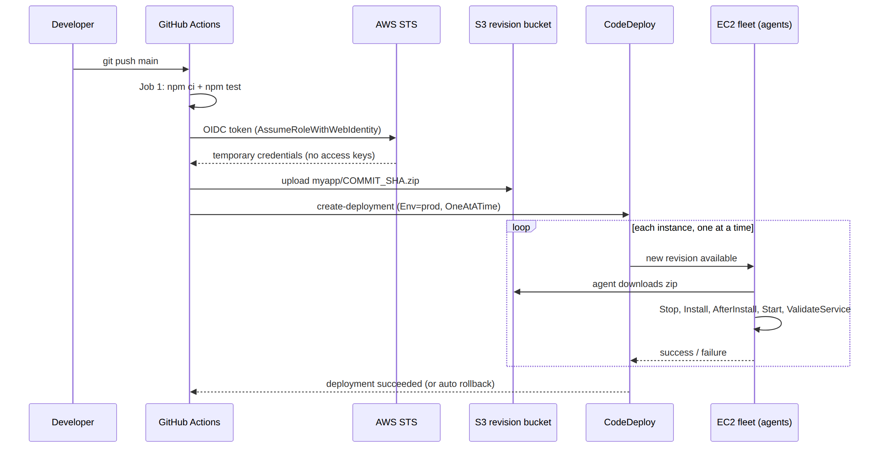
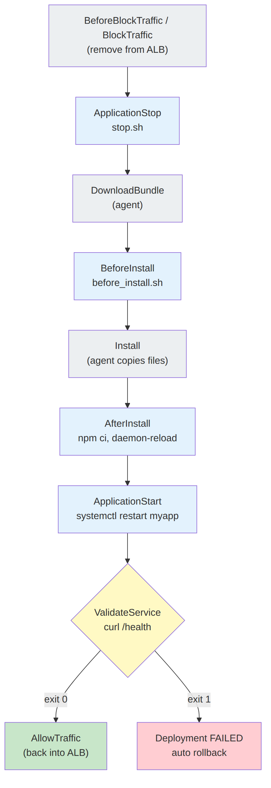

# 📚 Day 21 — CI/CD: CodeDeploy + GitHub Actions to EC2 + Module 3 Revision

> 📊 **Visual Summary** — সহজে বোঝার জন্য diagram:





**সময়:** ২ ঘণ্টা | **Module:** ৩ (Application Deployment on EC2) — Day 7 (শেষ দিন)

## 🎯 আজকের লক্ষ্য
- হাতে deploy করার সমস্যা আর CI/CD-র ধারণা
- AWS CodeDeploy: application, deployment group, agent
- `appspec.yml` আর lifecycle hooks
- In-place (rolling) বনাম Blue/Green deployment
- GitHub Actions → AWS: **OIDC** দিয়ে (access key ছাড়া)
- সম্পূর্ণ pipeline: push → test → S3 → CodeDeploy → EC2
- Module 3 revision ও mini project

---

## Part 1: হাতে Deploy করার সমস্যা

এতদিন deploy মানে ছিল:
```bash
ssh ec2 → git pull → npm ci → sudo systemctl restart myapp
```

| সমস্যা | ফল |
|---|---|
| প্রতিটা server-এ হাতে করতে হয় | ১০টা server = ১০ গুণ কাজ, ভুলের সম্ভাবনা |
| Test চালানো মনে না থাকলে | ভাঙা code production-এ চলে যায় |
| সব server একসাথে restart | Downtime |
| কিছু ভাঙলে rollback | আবার হাতে, চাপের মধ্যে |
| কে কখন কী deploy করল | কোনো record নেই |
| Server-এ SSH key/Git credential রাখা | Security ঝুঁকি |

👉 সমাধান: **CI/CD**
- **CI (Continuous Integration)**: প্রতি push-এ automatically build + test
- **CD (Continuous Deployment/Delivery)**: test pass করলে automatically server-এ deploy (Delivery-তে মাঝে manual approval থাকে)

---

## Part 2: AWS CodeDeploy — মূল ধারণা

**CodeDeploy** = EC2, on-prem server, Lambda, আর ECS-এ deploy automate করার managed service। EC2, Lambda আর ECS-এ CodeDeploy-এর নিজের কোনো charge নেই (on-prem server-এ প্রতি update-এ সামান্য charge)।

| Concept | মানে |
|---|---|
| **Application** | একটা নাম, যার ভেতরে deployment config থাকে (যেমন `myapp`) |
| **Deployment Group** | **কোন server-গুলোতে** deploy হবে: EC2 **tag** (`Env=prod`) বা **Auto Scaling Group** দিয়ে বাছাই |
| **Revision** | কী deploy হবে: S3-এ রাখা zip (বা GitHub) |
| **Deployment configuration** | একসাথে কতগুলো server-এ: AllAtOnce / HalfAtATime / OneAtATime |
| **CodeDeploy Agent** | প্রতিটা EC2-তে চলা program, যেটা revision নামিয়ে hook script চালায় |
| **appspec.yml** | Revision-এর ভেতরের "নির্দেশনা": file কোথায় যাবে, কোন script কখন চলবে |
| **Service role** | CodeDeploy-কে EC2/ASG/ELB পড়ার অনুমতি (`AWSCodeDeployRole` policy) |

```
Revision (S3: myapp-v42.zip)
        │
        ▼
CodeDeploy ──► Deployment Group (tag Env=prod) ──► EC2-1 [agent]
                                                  ──► EC2-2 [agent]
                                                  ──► EC2-3 [agent]
```

---

## Part 3: CodeDeploy Agent Install ও IAM

### Agent install (Amazon Linux 2023)
```bash
sudo dnf install -y ruby wget
cd /tmp
REGION=ap-south-1
wget https://aws-codedeploy-${REGION}.s3.${REGION}.amazonaws.com/latest/install
chmod +x ./install
sudo ./install auto
sudo systemctl status codedeploy-agent
```
- Agent log: `/var/log/aws/codedeploy-agent/codedeploy-agent.log`
- বিকল্প: **SSM Distributor** দিয়ে `AWSCodeDeployAgent` package অনেক server-এ একসাথে install

### IAM — দুটো আলাদা role

| Role | কার জন্য | Permission |
|---|---|---|
| **EC2 instance profile** (Day 16) | Agent | Revision bucket থেকে `s3:GetObject` (+ `AmazonSSMManagedInstanceCore`, `CloudWatchAgentServerPolicy`) |
| **CodeDeploy service role** | CodeDeploy service | `AWSCodeDeployRole` managed policy; trust: `codedeploy.amazonaws.com` |

---

## Part 4: `appspec.yml` — Deploy-এর নির্দেশনা

Repo-র **root**-এ রাখতে হয়:

```yaml
version: 0.0
os: linux

files:
  - source: /
    destination: /opt/myapp

file_exists_behavior: OVERWRITE

permissions:
  - object: /opt/myapp
    owner: myapp
    group: myapp

hooks:
  ApplicationStop:
    - location: scripts/stop.sh
      timeout: 60
      runas: root
  BeforeInstall:
    - location: scripts/before_install.sh
      timeout: 120
      runas: root
  AfterInstall:
    - location: scripts/after_install.sh
      timeout: 300
      runas: root
  ApplicationStart:
    - location: scripts/start.sh
      timeout: 60
      runas: root
  ValidateService:
    - location: scripts/validate.sh
      timeout: 120
      runas: root
```

### 📜 Script উদাহরণ

`scripts/stop.sh`
```bash
#!/bin/bash
systemctl stop myapp || true      # প্রথম deploy-এ service নাও থাকতে পারে
```

`scripts/after_install.sh`
```bash
#!/bin/bash
set -e
cd /opt/myapp
sudo -u myapp npm ci --omit=dev
cp deploy/myapp.service /etc/systemd/system/myapp.service
systemctl daemon-reload
```

`scripts/start.sh`
```bash
#!/bin/bash
systemctl enable --now myapp
systemctl restart myapp
```

`scripts/validate.sh`
```bash
#!/bin/bash
for i in {1..10}; do
  curl -fs http://127.0.0.1:3000/health && exit 0
  sleep 3
done
echo "health check failed" >&2
exit 1          # non-zero → deployment FAILED → rollback চালু থাকলে rollback
```

> ⚠️ Script-গুলো git-এ **executable** করে commit করুন: `git update-index --chmod=+x scripts/*.sh`

---

## Part 5: Lifecycle Hooks — ক্রম

**In-place deployment (Load Balancer সহ):**

```
BeforeBlockTraffic → BlockTraffic → AfterBlockTraffic      (ALB থেকে instance সরানো)
ApplicationStop                                            ← আপনার script
DownloadBundle                                             (agent নিজে)
BeforeInstall                                              ← আপনার script
Install                                                    (agent file copy করে)
AfterInstall                                               ← আপনার script
ApplicationStart                                           ← আপনার script
ValidateService                                            ← আপনার script
BeforeAllowTraffic → AllowTraffic → AfterAllowTraffic      (ALB-তে ফিরিয়ে আনা)
```

| Hook | সাধারণত কী করবেন |
|---|---|
| `ApplicationStop` | পুরনো app বন্ধ (এটা **আগের revision**-এর script থেকে চলে!) |
| `BeforeInstall` | পুরনো file পরিষ্কার, dependency install, backup |
| `AfterInstall` | `npm ci`, config বসানো, permission, migration |
| `ApplicationStart` | Service start/restart |
| `ValidateService` | Health check। fail করলে deployment fail |

> 💡 Load balancer-এর block/allow traffic অংশ agent নিজে সামলায়, script লাগে না। ALB থেকে instance সরানোর পর চলমান request শেষ হওয়ার সময় দেয় **deregistration delay** (connection draining)।

---

## Part 6: In-place (Rolling) বনাম Blue/Green

### In-place
একই server-গুলোতে নতুন version বসানো হয়, deployment configuration অনুযায়ী ধাপে ধাপে:

| Config | কী হয় | Downtime / ঝুঁকি |
|---|---|---|
| `CodeDeployDefault.AllAtOnce` | সব একসাথে | দ্রুত; ALB থাকলেও সব একসাথে বেরিয়ে যায়, তাই downtime |
| `CodeDeployDefault.HalfAtATime` | অর্ধেক অর্ধেক | অর্ধেক capacity থাকে |
| `CodeDeployDefault.OneAtATime` | একটা একটা | সবচেয়ে নিরাপদ, সবচেয়ে ধীর |
| Custom | যেমন "কমপক্ষে ৭৫% healthy" | নিজের মতো |

### Blue/Green (EC2)
- CodeDeploy **নতুন instance** তৈরি করে (ASG copy করে), সেখানে deploy করে, তারপর ALB traffic নতুনগুলোতে সরায়
- পুরনো (blue) instance কিছুক্ষণ রেখে দেওয়া যায়, তাই rollback দ্রুত
- Load balancer **আবশ্যক**

| | In-place | Blue/Green |
|---|---|---|
| নতুন instance | না | হ্যাঁ |
| Rollback | আবার পুরনো revision deploy (ধীর) | Traffic পুরনোতে ফেরত (দ্রুত) |
| খরচ | কম | Deploy-এর সময় দ্বিগুণ instance |
| Downtime | Config অনুযায়ী কম বা বেশি | প্রায় শূন্য |

### 🔙 Automatic rollback
Deployment group-এ চালু করুন:
- ✅ Deployment fail করলে rollback
- ✅ **CloudWatch alarm** বাজলে rollback (যেমন 5xx error বেড়ে গেলে)

---

## Part 7: GitHub Actions → AWS — OIDC (Access Key ছাড়া!)

### ❌ পুরনো পদ্ধতি
GitHub Secrets-এ `AWS_ACCESS_KEY_ID` / `AWS_SECRET_ACCESS_KEY` রাখা। এগুলো long-term key, leak হলে বিপদ (Interview Q125)।

### ✅ আধুনিক পদ্ধতি: OIDC Federation
GitHub প্রতিটা workflow run-এ একটা ছোট-মেয়াদি **identity token** দেয়। AWS সেটা যাচাই করে একটা IAM role-এর **temporary credential** দেয়।

```
GitHub Actions run ──(OIDC token)──► AWS STS ──(AssumeRoleWithWebIdentity)──► temp credentials (১ ঘণ্টা)
```

### Step 1: IAM-এ OIDC Identity Provider (একবারই)
- Provider URL: `https://token.actions.githubusercontent.com`
- Audience: `sts.amazonaws.com`

### Step 2: Role + Trust policy — শুধু আপনার repo-র main branch
```json
{
  "Version": "2012-10-17",
  "Statement": [{
    "Effect": "Allow",
    "Principal": {
      "Federated": "arn:aws:iam::111122223333:oidc-provider/token.actions.githubusercontent.com"
    },
    "Action": "sts:AssumeRoleWithWebIdentity",
    "Condition": {
      "StringEquals": {
        "token.actions.githubusercontent.com:aud": "sts.amazonaws.com",
        "token.actions.githubusercontent.com:sub": "repo:my-org/myapp:ref:refs/heads/main"
      }
    }
  }]
}
```
> ⚠️ `sub` condition **অবশ্যই** দিন। না দিলে GitHub-এর **যেকোনো repo** আপনার role assume করতে পারবে!

### Step 3: Role-এর permission (least privilege)
- Revision bucket-এ `s3:PutObject`
- `codedeploy:CreateDeployment`, `codedeploy:GetDeployment`, `codedeploy:GetDeploymentConfig`, `codedeploy:RegisterApplicationRevision`, `codedeploy:GetApplicationRevision`

---

## Part 8: সম্পূর্ণ Workflow — `.github/workflows/deploy.yml`

```yaml
name: Deploy to EC2

on:
  push:
    branches: [main]

permissions:
  id-token: write      # OIDC token-এর জন্য আবশ্যক
  contents: read

env:
  AWS_REGION: ap-south-1
  BUCKET: myapp-deploy-artifacts
  APP: myapp
  GROUP: myapp-prod

jobs:
  test:
    runs-on: ubuntu-latest
    steps:
      - uses: actions/checkout@v4
      - uses: actions/setup-node@v4
        with:
          node-version: 20
          cache: npm
      - run: npm ci
      - run: npm test

  deploy:
    needs: test
    runs-on: ubuntu-latest
    environment: production        # চাইলে GitHub-এ manual approval
    steps:
      - uses: actions/checkout@v4

      - uses: aws-actions/configure-aws-credentials@v4
        with:
          role-to-assume: arn:aws:iam::111122223333:role/github-actions-deploy
          aws-region: ${{ env.AWS_REGION }}

      - name: Package & upload revision
        run: |
          KEY="${APP}/${GITHUB_SHA}.zip"
          zip -r app.zip . -x '.git/*' 'node_modules/*'
          aws s3 cp app.zip "s3://${BUCKET}/${KEY}"
          echo "KEY=${KEY}" >> "$GITHUB_ENV"

      - name: Create CodeDeploy deployment
        run: |
          ID=$(aws deploy create-deployment \
            --application-name "$APP" \
            --deployment-group-name "$GROUP" \
            --s3-location bucket=$BUCKET,key=$KEY,bundleType=zip \
            --description "GitHub ${GITHUB_SHA}" \
            --query deploymentId --output text)
          echo "Deployment: $ID"
          aws deploy wait deployment-successful --deployment-id "$ID"
```

### 🔄 পুরো flow
```
git push main
  → GitHub Actions: test (fail হলে থামে)
  → OIDC → temporary AWS credential
  → zip → S3 (commit SHA নামে, প্রতিটা version আলাদা)
  → CodeDeploy create-deployment
  → প্রতিটা EC2-র agent: stop → install → start → validate
  → সব healthy? ✅ : ❌ auto rollback
```

### বিকল্প পদ্ধতি (তুলনা)

| পদ্ধতি | কেমন |
|---|---|
| GitHub Actions + SSH | সহজ, কিন্তু SSH key secret-এ, port 22 খোলা, rolling বা rollback নেই ❌ |
| GitHub Actions + **SSM Run Command** | Port খোলা লাগে না; ছোট setup-এর জন্য ভালো, কিন্তু rolling বা rollback নিজে বানাতে হয় |
| GitHub Actions + **CodeDeploy** | Rolling/Blue-Green, health check, auto rollback, deploy history ✅ |
| **CodePipeline** (সব AWS-এ) | Source → CodeBuild → CodeDeploy, সম্পূর্ণ AWS-native |

---

## Part 9: Troubleshooting

| সমস্যা | কারণ / সমাধান |
|---|---|
| Deployment "Pending" থেকে নড়ে না | Agent চলছে না বা instance-এর tag ভুল; `systemctl status codedeploy-agent` |
| `The overall deployment failed because too many individual instances failed` | কোন instance-এ কোন hook fail করেছে, console-এ event দেখুন |
| Hook `ScriptFailed` | Script-এর exit code ≠ 0; agent log আর `/opt/codedeploy-agent/deployment-root/.../logs/scripts.log` |
| `ScriptMissing` / permission denied | Script executable না, বা path ভুল |
| প্রথম deploy-এ `ApplicationStop` fail | Service তখনো নেই; `|| true` দিন |
| Agent S3 থেকে নামাতে পারছে না | Instance profile-এ bucket-এর `s3:GetObject` নেই; private subnet-এ S3 gateway endpoint নেই |
| GitHub: `Not authorized to perform sts:AssumeRoleWithWebIdentity` | Trust policy-র `sub` মিলছে না (branch/repo নাম), অথবা workflow-এ `id-token: write` নেই |
| `file already exists` error | `file_exists_behavior: OVERWRITE` দিন |

---

## 🎯 আজকের মূল Takeaways

1. CI = প্রতি push-এ build + test; CD = automatically deploy
2. CodeDeploy: **Application → Deployment Group (tag/ASG) → Revision (S3)**
3. প্রতিটা EC2-তে **CodeDeploy agent** + instance profile-এ S3 read
4. `appspec.yml` → files + permissions + **hooks** (Stop → BeforeInstall → AfterInstall → Start → **Validate**)
5. `ValidateService` fail = deployment fail = **auto rollback**
6. In-place (OneAtATime/HalfAtATime) বনাম **Blue/Green** (নতুন instance, দ্রুত rollback)
7. GitHub → AWS **OIDC** দিয়ে, access key কখনো না; trust policy-তে `sub` condition অবশ্যই

---

## 📝 Self-check Questions

1. Deployment Group কীভাবে ঠিক করে কোন server-এ deploy হবে?
2. `ApplicationStop` hook কোন revision-এর script থেকে চলে? এতে কী সমস্যা হতে পারে?
3. `ValidateService` fail করলে কী হয়?
4. In-place আর Blue/Green-এর মধ্যে rollback-এর গতিতে পার্থক্য কেন?
5. GitHub Actions-এ AWS access key না রেখে কীভাবে deploy করবেন?
6. OIDC trust policy-তে `sub` condition না দিলে কী ঝুঁকি?
7. Agent S3 থেকে revision নামাতে পারছে না। দুটো সম্ভাব্য কারণ বলুন।

<details><summary>▶ উত্তর দেখুন</summary>

1. EC2 tag (যেমন `Env=prod`) বা Auto Scaling Group দিয়ে।
2. আগের (বর্তমানে চলা) revision-এর script থেকে। আগের script-এ bug থাকলে বা প্রথম deploy-এ service না থাকলে fail করতে পারে, তাই `|| true`।
3. ঐ instance-এর deployment fail হয়; auto rollback চালু থাকলে আগের revision ফেরত যায়।
4. Blue/Green-এ পুরনো instance চালু থাকে, শুধু traffic ফেরাতে হয়; In-place-এ পুরনো version আবার deploy করতে হয়।
5. OIDC identity provider + IAM role; workflow-এ `id-token: write` আর `aws-actions/configure-aws-credentials`।
6. GitHub-এর যেকোনো repo-র workflow আপনার role assume করে AWS account-এ ঢুকতে পারবে।
7. Instance profile-এ `s3:GetObject` নেই; অথবা private subnet থেকে S3-এ যাওয়ার পথ (NAT/Gateway endpoint) নেই।
</details>

---

# 🔁 Module 3 Revision

## 🗺 পুরো Module এক নজরে

| Day | বিষয় | এক লাইনে মনে রাখুন |
|---|---|---|
| 15 | User Data, Cloud-init, EC2 Instance Connect | Boot-এর সময় automatic setup; key ছাড়া browser SSH |
| 16 | SSM Session Manager, IAM Instance Profile | Port 22 ছাড়া shell; EC2-কে access key ছাড়া AWS permission |
| 17 | CloudWatch Agent | Memory/disk metric + log → CloudWatch; retention দিন |
| 18 | systemd | Auto start, auto restart, non-root user, journald |
| 19 | Nginx reverse proxy | 80/443 → localhost app; HTTPS: Let's Encrypt বা ALB+ACM |
| 20 | PM2, config, logs | Cluster + reload; secret → Parameter Store; logrotate |
| 21 | CI/CD | GitHub Actions (OIDC) → S3 → CodeDeploy → hooks → validate → rollback |

## 🏗 Production-ready EC2 App — সব একসাথে

```
GitHub push
   └─► GitHub Actions (test) ──OIDC──► S3 revision ──► CodeDeploy
                                                          │ (OneAtATime / Blue-Green)
Internet ─► ALB (ACM HTTPS) ─► [private subnet, ASG]      ▼
                                  EC2 ─ CodeDeploy agent
                                   ├─ Nginx :80 ─► 127.0.0.1:3000
                                   ├─ myapp.service (systemd / PM2, user=myapp)
                                   ├─ env ← Parameter Store / Secrets Manager
                                   ├─ CloudWatch Agent ─► metrics + logs ─► alarms ─► SNS
                                   ├─ Instance Profile (least privilege)
                                   └─ Access: SSM Session Manager (no SSH, no port 22)
```

## ✅ Checklist — আপনার deployment production-ready?

- [ ] EC2 private subnet-এ, সামনে ALB
- [ ] SSH/port 22 বন্ধ, access শুধু SSM Session Manager দিয়ে
- [ ] IAM instance profile, কোনো access key নেই
- [ ] App systemd (বা PM2) দিয়ে, non-root user, `Restart=on-failure`
- [ ] Nginx reverse proxy, app শুধু localhost-এ
- [ ] HTTPS (ACM)
- [ ] Secret Parameter Store/Secrets Manager-এ, git-এ কিছু নেই
- [ ] CloudWatch Agent: memory/disk metric, app log, retention
- [ ] Alarm: CPU, memory, disk, 5xx, process down
- [ ] CI/CD: test → deploy → health check → auto rollback
- [ ] User Data দিয়ে নতুন instance নিজে থেকেই পুরোপুরি ready (Auto Scaling-এর জন্য)

## 🛠 Mini Project (নিজে করুন)

**লক্ষ্য:** একটা Node.js বা Flask app GitHub থেকে push করলেই EC2-তে deploy হবে।

1. VPC: public subnet-এ ALB, private subnet-এ EC2 (Module 2)
2. Instance profile: SSM + CloudWatch Agent + S3 read
3. User Data: Nginx, Node, CloudWatch Agent, CodeDeploy agent install
4. systemd unit + Nginx config (Day 18–19)
5. Parameter Store-এ `/myapp/prod/*` config (Day 20)
6. CodeDeploy application + deployment group (tag `Env=prod`, OneAtATime, auto rollback)
7. GitHub OIDC role + `deploy.yml` workflow
8. `/health` endpoint + ALB health check + validate.sh
9. **Test:** ইচ্ছা করে ভাঙা code push করুন। Validate fail করে rollback হয় কিনা দেখুন ✅

## 📝 Module 3 Final Quiz

1. Default EC2 metric-এ কোন দুটো গুরুত্বপূর্ণ metric নেই?
2. systemd unit edit করার পর কোন দুটো command?
3. App-কে `127.0.0.1`-এ bind করার সুবিধা কী?
4. Node.js-এ সব CPU core ব্যবহারের উপায় কী?
5. Private subnet-এর EC2-তে SSH ছাড়া কীভাবে ঢুকবেন?
6. GitHub Actions থেকে AWS-এ access key ছাড়া deploy কীভাবে?
7. CodeDeploy-এ কোন hook fail করলে deployment fail ধরা হয় (health check)?

<details><summary>▶ উত্তর দেখুন</summary>

1. Memory usage আর disk space usage (CloudWatch Agent লাগে)।
2. `systemctl daemon-reload` → `systemctl restart <name>`।
3. বাইরে থেকে সরাসরি app-এ ঢোকা যায় না; সব traffic Nginx দিয়ে আসে।
4. PM2 cluster mode (`-i max`), অথবা একাধিক process + Nginx upstream।
5. SSM Session Manager (instance profile-এ `AmazonSSMManagedInstanceCore` + SSM agent)।
6. OIDC identity provider + IAM role (`sub` condition সহ) + `configure-aws-credentials` action।
7. `ValidateService` (আসলে যেকোনো hook non-zero exit দিলেই fail, তবে health check রাখা হয় `ValidateService`-এ)।
</details>

---

## 💡 Pro Tips

- Revision-এর নাম **commit SHA** দিন, তাহলে কোন version কোথায় চলছে সবসময় জানা যায়, আর rollback সহজ হয়
- বড় team-এ `environment: production` দিয়ে GitHub-এ **required reviewer** (manual approval) রাখুন
- DB migration আলাদা step-এ রাখুন, আর backward-compatible রাখুন (Interview Q130: expand/contract)
- Auto Scaling group-কে deployment group করলে নতুন scale-out instance নিজে থেকেই সর্বশেষ revision পায়
- পরের ধাপে container: একই pipeline দিয়ে ECR → ECS (Module 4-এর পরে)

---

## 🎨 Quick Reference

```yaml
# appspec.yml
version: 0.0
os: linux
files:
  - source: /
    destination: /opt/myapp
hooks:
  ApplicationStop:  [{ location: scripts/stop.sh,  timeout: 60 }]
  AfterInstall:     [{ location: scripts/after_install.sh, timeout: 300 }]
  ApplicationStart: [{ location: scripts/start.sh, timeout: 60 }]
  ValidateService:  [{ location: scripts/validate.sh, timeout: 120 }]
```

```bash
sudo systemctl status codedeploy-agent
tail -f /var/log/aws/codedeploy-agent/codedeploy-agent.log
aws deploy create-deployment --application-name myapp \
  --deployment-group-name myapp-prod \
  --s3-location bucket=BUCKET,key=myapp/SHA.zip,bundleType=zip
```

---

## 🚨 বাস্তব পরিস্থিতি (যেসব ভুল প্রায়ই হয়)

**পরিস্থিতি ১:** Deploy script-এ `ValidateService` ছিল না। একটা ভাঙা build সব server-এ চলে গেল, আর deployment "Succeeded" দেখাল।
**শিক্ষা:** Health check ছাড়া deployment-এর সফলতার কোনো মানে নেই।

**পরিস্থিতি ২:** OIDC role-এর trust policy-তে `sub` condition দেওয়া হয়নি। Security audit-এ ধরা পড়ল, যেকোনো GitHub repo এই role নিতে পারত।
**শিক্ষা:** Trust policy-তে repo আর branch নির্দিষ্ট করুন।

**পরিস্থিতি ৩:** `AllAtOnce` দিয়ে deploy করা হলো। নতুন version-এ bug ছিল, তাই সব server একসাথে ভাঙল, পুরো site down।
**শিক্ষা:** Production-এ `OneAtATime`/custom বা Blue/Green, আর alarm-ভিত্তিক auto rollback।

---

**⏮ আগের দিন:** [Day 20 — PM2, Config ও Logs](./Day-20-PM2-Env-Config-Log-Management.md) | **⏭ পরের module:** [Day 22 — Lambda Basics (Module 4)](../05-Module-4-Serverless-and-Lambda/Day-22-Lambda-Basics-Execution-Model.md)
