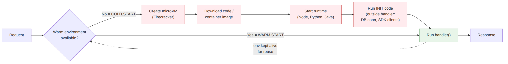

# 📚 Day 22 — AWS Lambda Basics: Execution Model, Handler, Memory ও Timeout

> 📊 **Visual Summary** — সহজে বোঝার জন্য diagram:



**সময়:** ১.৫ ঘণ্টা | **Module:** ৪ (Serverless & Lambda Fundamentals) — Day 1

## 🎯 আজকের লক্ষ্য
- Serverless মানে কী, আর কী না
- Lambda কীভাবে চলে: execution environment, cold start, warm start
- Handler function-এর গঠন (Node.js, Python)
- `event` আর `context` object
- Memory, CPU, timeout, `/tmp` storage
- Lambda-র খরচ কীভাবে হিসাব হয়
- Console থেকে প্রথম function বানানো ও test

---

## Part 1: Serverless কী?

Module 3-এ আমরা EC2-তে app চালিয়েছি: OS patch, Nginx, systemd, Auto Scaling, CloudWatch Agent সব নিজে সামলাতে হয়েছে।

**Serverless** মানে server নেই এমন না। Server আছে, কিন্তু **আপনাকে দেখতে বা manage করতে হয় না**।

| | EC2 (Module 3) | Lambda (Serverless) |
|---|---|---|
| Server manage | আপনি (OS, patch, agent) | AWS |
| Scaling | Auto Scaling Group configure করতে হয় | Request অনুযায়ী automatic |
| Idle খরচ | চালু থাকলেই টাকা | **কোনো request না এলে খরচ শূন্য** |
| চলার সময় | যতক্ষণ খুশি | এক invocation সর্বোচ্চ **১৫ মিনিট** |
| Billing | প্রতি সেকেন্ড instance | প্রতি request + প্রতি millisecond × memory |
| State | Disk/memory-তে রাখা যায় | **Stateless**: প্রতিটা call নতুন ধরে নিন |

### ✅ Lambda কখন ভালো
- Event-এ সাড়া দেওয়া: file upload, queue message, schedule
- অনিয়মিত বা হঠাৎ বাড়া traffic
- ছোট API, webhook, cron job
- দ্রুত বানানো, কম ops

### ❌ Lambda কখন ভালো না
- ১৫ মিনিটের বেশি চলা কাজ → ECS/Fargate, Batch
- সারাক্ষণ বেশি traffic (তখন EC2/Fargate সস্তা হতে পারে)
- Persistent connection server (WebSocket server, game server). তবে API Gateway WebSocket API দিয়ে Lambda-ও সম্ভব
- Special hardware (GPU)

---

## Part 2: Execution Model — Lambda আসলে কীভাবে চলে?

Lambda প্রতিটা function-এর জন্য **execution environment** বানায়। এটা একটা ছোট isolated microVM (**Firecracker**), যার ভেতরে থাকে runtime (Node/Python), আপনার code আর `/tmp`।

### 🔄 Lifecycle: তিনটা phase

```
┌─────────── INIT ───────────┐┌──── INVOKE ────┐┌─ SHUTDOWN ─┐
 microVM তৈরি                   handler() চলে      কিছুক্ষণ idle
 runtime চালু                   (প্রতি request-এ)  থাকার পর
 code download                                    environment
 handler-এর বাইরের code চলে                         মুছে ফেলা
```

| Phase | কী হয় | কতবার |
|---|---|---|
| **Init** | Environment তৈরি, runtime চালু, **handler-এর বাইরের code** (import, DB client তৈরি) চলে | নতুন environment-এ একবার |
| **Invoke** | `handler(event, context)` চলে | প্রতিটা request-এ |
| **Shutdown** | কিছুক্ষণ কাজ না থাকলে environment মুছে ফেলা | একবার |

### ❄️ Cold start বনাম 🔥 Warm start

- **Cold start**: নতুন environment লাগলে Init phase চলে, তাই প্রথম request দেরিতে হয় (সাধারণত ১০০ ms থেকে কয়েক সেকেন্ড, runtime ও package size অনুযায়ী)।
- **Warm start**: আগের environment খালি থাকলে সেটা আবার ব্যবহার হয়। Init বাদ, শুধু handler চলে, তাই দ্রুত।

**Cold start কখন হয়:**
- Function-এর প্রথম call
- কিছুক্ষণ কোনো call না আসার পর (environment মুছে গেছে)
- একসাথে অনেক request এলে: প্রতিটা **concurrent** request-এর জন্য আলাদা environment লাগে
- Code বা config update করার পর

### 🔑 Concurrency-র মূল ধারণা
**একটা environment একসময়ে একটাই request সামলায়।** ১০০টা request একসাথে এলে Lambda ১০০টা environment চালায়। এটাই Lambda-র automatic scaling।

```
Concurrency ≈ প্রতি সেকেন্ডে request × গড় duration (সেকেন্ড)
উদাহরণ: 50 req/s × 0.2 s = 10 concurrent environment
```
Account-এ region প্রতি default সীমা **১,০০০ concurrent** (বাড়ানো যায়)। Day 27-এ বিস্তারিত।

---

## Part 3: Handler Function-এর গঠন

**Handler** = Lambda যে function-টা call করে। নাম দিতে হয় `file.function` format-এ।

### Node.js (`index.mjs`, handler: `index.handler`)
```js
// ── INIT phase: একবারই চলে, পরের warm call-এ reuse হয় ──
import { DynamoDBClient } from "@aws-sdk/client-dynamodb";
const db = new DynamoDBClient({});          // connection বাইরে বানান

// ── INVOKE phase: প্রতি request-এ ──
export const handler = async (event, context) => {
  console.log("Request ID:", context.awsRequestId);
  const name = event.name ?? "World";
  return { message: `Hello, ${name}!` };
};
```

### Python (`app.py`, handler: `app.lambda_handler`)
```python
import json, os, boto3

# INIT phase
s3 = boto3.client("s3")
TABLE = os.environ.get("TABLE_NAME")

# INVOKE phase
def lambda_handler(event, context):
    print("Remaining ms:", context.get_remaining_time_in_millis())
    name = event.get("name", "World")
    return {"message": f"Hello, {name}!"}
```

> 💡 **সবচেয়ে গুরুত্বপূর্ণ performance নিয়ম:** SDK client, DB connection, config load **handler-এর বাইরে** রাখুন। তাহলে warm call-এ এগুলো আবার বানাতে হয় না।

### 📦 `event` object
Trigger অনুযায়ী আলাদা: API Gateway থেকে এলে HTTP request (path, headers, body), S3 থেকে এলে bucket ও key, SQS থেকে এলে message-এর list। Day 24–25-এ প্রতিটার format দেখব।

### 🧾 `context` object

| Property (Node / Python) | মানে |
|---|---|
| `awsRequestId` / `aws_request_id` | এই invocation-এর unique ID (log খুঁজতে) |
| `functionName` / `function_name` | Function-এর নাম |
| `getRemainingTimeInMillis()` / `get_remaining_time_in_millis()` | Timeout হতে আর কত ms বাকি |
| `memoryLimitInMB` / `memory_limit_in_mb` | Configure করা memory |
| `logGroupName` / `log_group_name` | CloudWatch log group |

---

## Part 4: Runtime

| Runtime | উদাহরণ identifier | বৈশিষ্ট্য |
|---|---|---|
| Node.js | `nodejs22.x` | দ্রুত cold start, API-র জন্য জনপ্রিয় |
| Python | `python3.13` | Data/script/automation-এ জনপ্রিয়, দ্রুত cold start |
| Java | `java21` | Cold start বেশি; **SnapStart** দিয়ে কমানো যায় |
| .NET | `dotnet8` | |
| Ruby | `ruby3.3` | |
| Custom (`provided.al2023`) | Go, Rust ইত্যাদি | নিজের binary |
| Container image | যেকোনো ভাষা | ১০ GB পর্যন্ত image (Day 23) |

> Runtime version সময়ের সাথে পুরনো হয়ে deprecated হয়। Console-এ সর্বশেষ version দেখে নিন, আর deprecation email এলে upgrade করুন।

**Architecture:** `x86_64` বা **`arm64` (Graviton)**। arm64 সাধারণত সস্তা আর দ্রুত; native binary dependency না থাকলে এটাই বেছে নিন।

---

## Part 5: Memory, CPU, Timeout ও `/tmp`

| Setting | Range | Default | মনে রাখুন |
|---|---|---|---|
| **Memory** | 128 MB – 10,240 MB | 128 MB | **CPU memory-র সাথে বাড়ে** (~1,769 MB = ১টা পূর্ণ vCPU, সর্বোচ্চ ৬ vCPU) |
| **Timeout** | 1 s – **900 s (15 মিনিট)** | **3 s** | Default ৩ সেকেন্ড, তাই DB call থাকলে প্রায়ই বাড়াতে হয় |
| **Ephemeral storage (`/tmp`)** | 512 MB – 10,240 MB | 512 MB | Warm call-এ থেকে যেতে পারে, কিন্তু ভরসা করবেন না |
| **Environment variables** | মোট 4 KB | — | Day 23 |

### 🧠 Memory বাড়ালে কেন খরচ কমতে পারে?
CPU memory-র সাথে বাড়ে। ধরুন একটা CPU-heavy function:

| Memory | Duration | GB-second | খরচ |
|---|---|---|---|
| 128 MB | 2,000 ms | 0.125 × 2 = 0.25 | বেশি সময় |
| 1,024 MB | 200 ms | 1 × 0.2 = 0.2 | **কম খরচ + ১০ গুণ দ্রুত** |

তাই শুধু "কম memory = সস্তা" ভাববেন না। মেপে দেখুন: **Lambda Power Tuning** (Day 27)।

---

## Part 6: খরচ কীভাবে হিসাব হয়

```
খরচ = (request সংখ্যা × request-এর দাম)
     + (মোট GB-second × duration-এর দাম)

GB-second = (memory GB) × (duration সেকেন্ড, 1 ms পর্যন্ত নিখুঁত)
```

- **Free tier (প্রতি মাসে, চিরকাল):** ১০ লাখ request + ৪ লাখ GB-second
- arm64-এ প্রতি GB-second-এর দাম x86-এর চেয়ে কম
- বাড়তি খরচ: Provisioned Concurrency, ৫১২ MB-এর বেশি `/tmp`, data transfer, আর Lambda যা call করে (DynamoDB, S3, CloudWatch Logs)

> 💡 CloudWatch Logs-এর খরচ অনেক সময় Lambda-র নিজের খরচের চেয়ে বেশি হয়ে যায়। অপ্রয়োজনীয় `console.log` কমান আর log retention দিন (Day 17-এর মতো)।

---

## Part 7: Hands-on Lab — প্রথম Lambda Function

### Console দিয়ে
1. Lambda → **Create function** → Author from scratch
2. Name: `hello-lambda`, Runtime: Python 3.13 (বা Node.js), Architecture: arm64
3. Permissions: "Create a new role with basic Lambda permissions" (CloudWatch Logs-এ লেখার অনুমতি পায়)
4. Code-এ Part 3-এর handler বসান → **Deploy**
5. **Test** → নতুন test event: `{"name": "Jasim"}` → Invoke
6. Output দেখুন: response, আর নিচে **log output**

### Log-এর REPORT লাইন পড়া
```
REPORT RequestId: 3f1c...  Duration: 12.45 ms  Billed Duration: 13 ms
Memory Size: 128 MB  Max Memory Used: 41 MB  Init Duration: 180.21 ms
```

| অংশ | মানে |
|---|---|
| `Duration` | Handler চলার সময় |
| `Billed Duration` | যতটুকুর টাকা লাগবে (ms-এ round up) |
| `Max Memory Used` | আসলে কত memory লেগেছে, right-size করতে কাজে লাগে |
| `Init Duration` | **শুধু cold start-এ দেখায়**। দ্বিতীয়বার Test চাপলে এটা থাকবে না (warm) |

### CLI দিয়ে invoke
```bash
aws lambda invoke --function-name hello-lambda \
  --cli-binary-format raw-in-base64-out \
  --payload '{"name":"Jasim"}' out.json && cat out.json
```

---

## Part 8: Stateless-এর নিয়ম ও Common ভুল

| ভুল | কেন সমস্যা | ঠিক উপায় |
|---|---|---|
| Global variable-এ user data রাখা | Warm environment-এ পরের user সেটা দেখতে পারে | প্রতি request-এর data handler-এর ভেতরে |
| `/tmp`-এ file রেখে পরের call-এ আশা করা | অন্য environment-এ call গেলে পাবেন না | S3/DynamoDB-তে রাখুন |
| DB connection handler-এর ভেতরে | প্রতি call-এ নতুন connection, ধীর | Handler-এর বাইরে (RDS হলে **RDS Proxy**) |
| Timeout default ৩ s রেখে দেওয়া | External API call-এ timeout error | প্রয়োজনমতো বাড়ান, তবে অসীম না |
| Handler থেকে async কাজ `await` না করা | Response দিয়ে দেয়, কাজ শেষ হয় না | সব promise `await` করুন |
| Recursion: Lambda নিজের trigger-এ লেখে | অসীম loop, বড় bill | Day 25-এ দেখব |

---

## 🎯 আজকের মূল Takeaways

1. Serverless = server manage করতে হয় না, idle-এ খরচ নেই, automatic scaling
2. Lifecycle: **Init → Invoke → Shutdown**; cold start = নতুন environment-এর Init
3. একটা environment একসময়ে **একটা request**; concurrency ≈ req/s × duration
4. SDK client ও connection **handler-এর বাইরে**
5. Memory 128 MB–10 GB (CPU সাথে বাড়ে), timeout সর্বোচ্চ **১৫ মিনিট**, default **৩ সেকেন্ড**
6. খরচ = request + GB-second (ms হিসাবে); free tier ১M request + ৪ লাখ GB-s
7. REPORT লাইনের `Init Duration` = cold start-এর চিহ্ন

---

## 📝 Self-check Questions

1. Cold start কখন হয়? তিনটা পরিস্থিতি বলুন।
2. DB client handler-এর বাইরে বানানো কেন ভালো?
3. প্রতি সেকেন্ডে ২০০ request আসে, প্রতিটা ৫০০ ms চলে। Concurrency কত লাগবে?
4. Lambda-র timeout-এর default আর সর্বোচ্চ মান কত?
5. Memory বাড়ালে কীভাবে খরচ কমতে পারে?
6. REPORT লাইনে `Init Duration` না থাকলে কী বুঝবেন?
7. কোন কাজের জন্য Lambda উপযুক্ত নয়?

<details><summary>▶ উত্তর দেখুন</summary>

1. প্রথম call, দীর্ঘ idle-এর পর, একসাথে অনেক concurrent request এলে, code/config update-এর পর।
2. Init phase-এ একবার তৈরি হয়ে warm call-গুলোতে reuse হয়, প্রতি request-এ connection বানানোর সময় বাঁচে।
3. 200 × 0.5 = ১০০।
4. Default ৩ সেকেন্ড, সর্বোচ্চ ৯০০ সেকেন্ড (১৫ মিনিট)।
5. বেশি memory = বেশি CPU = কম duration; GB-second কমে যেতে পারে।
6. এটা warm start ছিল, আগের environment reuse হয়েছে।
7. ১৫ মিনিটের বেশি চলা কাজ, সারাক্ষণ উচ্চ traffic, GPU, persistent connection server।
</details>

---

## 💡 Pro Tips

- **arm64** default বানান, যদি native dependency না থাকে
- Function-কে ছোট রাখুন: এক function, এক কাজ
- **Powertools for AWS Lambda** (Python/TypeScript/Java/.NET) ব্যবহার করুন: structured log, metrics, tracing, idempotency সহজে পাওয়া যায়
- Console-এ code edit ভালো শেখার জন্য, কিন্তু production-এ **IaC** (SAM/CDK/Terraform) দিয়ে deploy করুন (Day 23)
- Timeout দিন **প্রত্যাশিত সর্বোচ্চ সময়ের একটু বেশি**, অনেক বেশি না। আটকে থাকা function-এর টাকা লাগে

---

## 🎨 Quick Reference

```
Lifecycle:   INIT (cold) → INVOKE (every request) → SHUTDOWN
Memory:      128 MB – 10,240 MB   (1,769 MB ≈ 1 vCPU)
Timeout:     default 3 s, max 900 s
/tmp:        512 MB – 10,240 MB
Concurrency: default 1,000 / region (account)
Billing:     requests + GB-seconds (1 ms)
Free tier:   1M requests + 400,000 GB-s / month
```

```bash
aws lambda invoke --function-name hello-lambda \
  --cli-binary-format raw-in-base64-out --payload '{"name":"x"}' out.json
aws logs tail /aws/lambda/hello-lambda --follow
```

---

## 🚨 বাস্তব পরিস্থিতি (যেসব ভুল প্রায়ই হয়)

**পরিস্থিতি ১:** Function external API call করছিল, মাঝে মাঝে `Task timed out after 3.00 seconds`। Default timeout ৩ সেকেন্ড কেউ বদলায়নি।
**শিক্ষা:** Timeout জেনেশুনে set করুন, আর external call-এ নিজস্ব timeout দিন।

**পরিস্থিতি ২:** Global variable-এ "current user" রাখা হয়েছিল। Warm environment-এ পরের request আগের user-এর data দেখে ফেলল।
**শিক্ষা:** Request-এর data শুধু handler-এর ভেতরে।

**পরিস্থিতি ৩:** প্রতি call-এ handler-এর ভেতরে নতুন DB connection খোলা হচ্ছিল। Traffic বাড়তেই database-এর connection শেষ।
**শিক্ষা:** Connection বাইরে রাখুন, RDS হলে RDS Proxy।

---

**⏮ আগের module:** [Day 21 — CI/CD + Module 3 Revision](../04-Module-3-Application-Deployment/Day-21-CICD-CodeDeploy-GitHub-Actions-Module-3-Revision.md) | **⏭ পরের দিন:** [Day 23 — Deployment Packages, Layers, Versions & Aliases](./Day-23-Deployment-Packages-Layers-Versions-Aliases.md)
