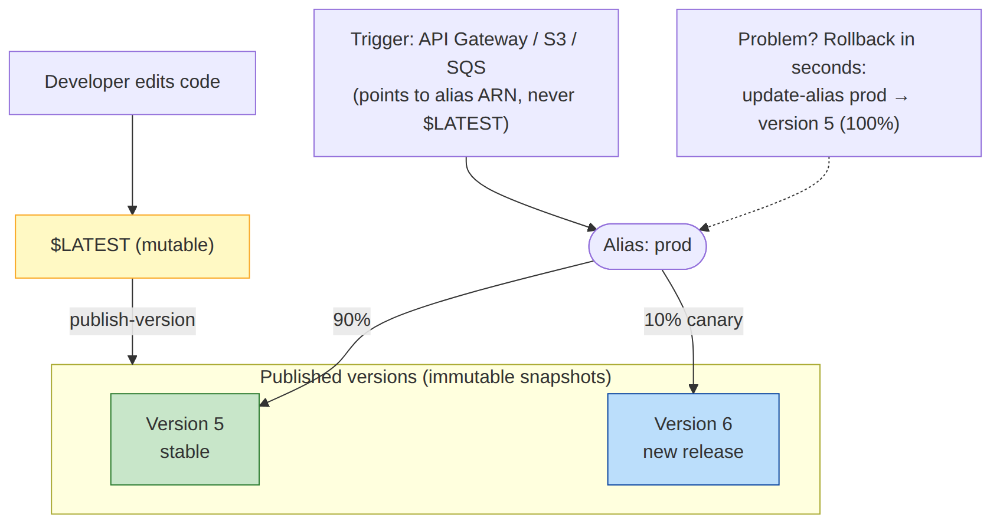

# 📚 Day 23 — Deployment Packages, Layers, Versions, Aliases ও Environment Variables

> 📊 **Visual Summary** — সহজে বোঝার জন্য diagram:



**সময়:** ১.৫ ঘণ্টা | **Module:** ৪ (Serverless & Lambda Fundamentals) — Day 2

## 🎯 আজকের লক্ষ্য
- Code Lambda-তে পৌঁছানোর তিন উপায়: inline, zip, container image
- Dependency সহ zip package বানানো (Node, Python)
- **Layers**: shared code আর library
- Environment variables
- **Versions** আর **Aliases** দিয়ে নিরাপদ release ও rollback
- SAM দিয়ে IaC deploy

---

## Part 1: Deployment Package-এর ধরন

| ধরন | সীমা | কখন |
|---|---|---|
| **Console inline editor** | ছোট code, dependency ছাড়া | শেখা, ছোট test |
| **.zip archive** | সরাসরি upload ৫০ MB (zipped); S3 থেকে দিলে unzipped সর্বোচ্চ **২৫০ MB** (layer সহ) | বেশিরভাগ function |
| **Container image** (ECR) | সর্বোচ্চ **১০ GB** | বড় dependency (ML model, pandas+numpy), Docker-এ অভ্যস্ত team |

> Zip বনাম image: package যতটা ছোট, cold start সাধারণত তত দ্রুত। বড় dependency না লাগলে zip-ই সহজ।

---

## Part 2: Zip Package বানানো

### Node.js
```bash
mkdir my-fn && cd my-fn
npm init -y
npm install axios              # runtime dependency
# index.mjs লিখুন (handler)
zip -r function.zip index.mjs node_modules package.json

aws lambda update-function-code --function-name my-fn \
  --zip-file fileb://function.zip
```
- `devDependencies` (jest, eslint) zip-এ দেবেন না: `npm ci --omit=dev`
- **AWS SDK v3** Node.js runtime-এ আগে থেকেই থাকে, তবে version নিয়ন্ত্রণে রাখতে অনেকে নিজে bundle করেন
- বড় project-এ **esbuild** দিয়ে bundle + minify করলে package ছোট হয়, cold start কমে

### Python
```bash
mkdir package
pip install requests -t package/          # dependency একটা folder-এ
cd package && zip -r ../function.zip . && cd ..
zip function.zip app.py                   # নিজের code যোগ

aws lambda update-function-code --function-name my-fn \
  --zip-file fileb://function.zip
```

> ⚠️ **Native library** (যেমন `psycopg2`, `numpy`, `cryptography`) Linux-এর জন্য compile করা দরকার। Windows/Mac-এ install করা version Lambda-তে চলবে না। সমাধান: `pip install --platform manylinux2014_aarch64 --only-binary=:all: ...` (arm64-এর জন্য), অথবা Docker-এ build, অথবা SAM `sam build --use-container`।

---

## Part 3: Container Image

```dockerfile
FROM public.ecr.aws/lambda/python:3.13
COPY requirements.txt .
RUN pip install -r requirements.txt
COPY app.py ${LAMBDA_TASK_ROOT}
CMD ["app.lambda_handler"]
```
```bash
docker build -t my-fn .
aws ecr create-repository --repository-name my-fn
docker tag my-fn:latest 111122223333.dkr.ecr.ap-south-1.amazonaws.com/my-fn:latest
aws ecr get-login-password | docker login --username AWS --password-stdin 111122223333.dkr.ecr.ap-south-1.amazonaws.com
docker push 111122223333.dkr.ecr.ap-south-1.amazonaws.com/my-fn:latest
```
- AWS-এর **base image** ব্যবহার করুন (runtime interface আগে থেকে থাকে)
- Image-based function-এ **Layers ব্যবহার করা যায় না**, সব image-এর ভেতরেই দিন
- Image update হলে function-কে নতুন image-এর দিকে update করতে হয়

---

## Part 4: Lambda Layers

**Layer** = একটা আলাদা zip, যেটা একাধিক function-এ attach করা যায়। Runtime-এ এটা `/opt`-এ খুলে যায়।

```
Function A ─┐
Function B ─┼──► Layer: shared-utils (v3)  →  /opt/nodejs/node_modules/...
Function C ─┘    Layer: requests-lib (v1)  →  /opt/python/...
```

### ✅ কখন Layer
- একাধিক function-এ একই library (যেমন `requests`, company-র shared helper)
- বড় dependency আলাদা রাখলে function code ছোট থাকে, console-এ edit করা যায়
- AWS/3rd-party-র দেওয়া layer: **Powertools**, **Parameters and Secrets Extension** (Day 26), monitoring agent

### 📁 Layer-এর folder structure (গুরুত্বপূর্ণ!)
| Runtime | Zip-এর ভেতরের path |
|---|---|
| Node.js | `nodejs/node_modules/<package>` |
| Python | `python/<package>` (বা `python/lib/python3.13/site-packages/`) |

```bash
# Python layer
mkdir -p layer/python
pip install requests -t layer/python
cd layer && zip -r ../requests-layer.zip python && cd ..

aws lambda publish-layer-version --layer-name requests-lib \
  --zip-file fileb://requests-layer.zip \
  --compatible-runtimes python3.13 --compatible-architectures arm64

aws lambda update-function-configuration --function-name my-fn \
  --layers arn:aws:lambda:ap-south-1:111122223333:layer:requests-lib:1
```

### ⚠️ Layer-এর সীমা
- এক function-এ সর্বোচ্চ **৫টা layer**
- Function + সব layer মিলিয়ে unzipped **২৫০ MB**
- Layer version **immutable**: বদলাতে নতুন version publish, তারপর function update
- বেশি layer = dependency কোথা থেকে আসছে বোঝা কঠিন। Bundler (esbuild) দিয়ে এক package করাও একটা ভালো বিকল্প

---

## Part 5: Environment Variables

```bash
aws lambda update-function-configuration --function-name my-fn \
  --environment "Variables={TABLE_NAME=orders,LOG_LEVEL=info}"
```
```python
import os
TABLE = os.environ["TABLE_NAME"]
```

- মোট সীমা **৪ KB**
- Default-এ **KMS দিয়ে at rest encrypted** (AWS managed key)। নিজের KMS key-ও দেওয়া যায়
- কিন্তু console-এ বা `get-function-configuration`-এ permission থাকলে plain text দেখা যায়
- তাই **password/API key রাখবেন না**, সেগুলো Secrets Manager/Parameter Store-এ (Day 26)
- Environment variable **version-এর সাথে freeze** হয়ে যায় (নিচে দেখুন)

> Lambda নিজে কিছু reserved variable দেয়: `AWS_REGION`, `AWS_LAMBDA_FUNCTION_NAME`, `AWS_LAMBDA_FUNCTION_MEMORY_SIZE` ইত্যাদি। এগুলো override করবেন না।

---

## Part 6: Versions — code-এর snapshot

- আপনি যখন edit করেন, সেটা **`$LATEST`**। এটা সবসময় পরিবর্তনশীল।
- **Publish version** করলে `$LATEST`-এর তখনকার code + config (runtime, memory, env var) একটা **immutable** snapshot হয়: `1`, `2`, `3`...

```bash
aws lambda publish-version --function-name my-fn --description "v1.2 checkout fix"
# → Version: 5
```

প্রতিটা version-এর নিজস্ব ARN:
```
arn:aws:lambda:ap-south-1:111122223333:function:my-fn       ← unqualified ($LATEST)
arn:aws:lambda:ap-south-1:111122223333:function:my-fn:5     ← version 5
arn:aws:lambda:ap-south-1:111122223333:function:my-fn:prod  ← alias
```

---

## Part 7: Aliases — version-এর দিকে "pointer"

**Alias** = একটা নাম (`prod`, `staging`), যেটা একটা নির্দিষ্ট version-কে point করে।

```bash
aws lambda create-alias --function-name my-fn --name prod --function-version 5
```

### 🎯 কেন alias?
- API Gateway, S3, SQS trigger-কে **alias ARN** দিন, version নম্বর না
- নতুন release: শুধু alias-কে নতুন version-এ সরান, trigger বদলাতে হয় না
- **Rollback = alias আবার পুরনো version-এ সরানো**, কয়েক সেকেন্ডে

```bash
aws lambda update-alias --function-name my-fn --name prod --function-version 6
# সমস্যা? rollback:
aws lambda update-alias --function-name my-fn --name prod --function-version 5
```

### 🐤 Weighted alias (Canary release)
Alias দুটো version-এর মধ্যে traffic ভাগ করতে পারে:
```bash
aws lambda update-alias --function-name my-fn --name prod \
  --function-version 5 \
  --routing-config '{"AdditionalVersionWeights": {"6": 0.1}}'
# 90% → v5, 10% → v6 (canary)
```
**CodeDeploy** এটা automate করে: `LambdaCanary10Percent5Minutes`, `LambdaLinear10PercentEvery1Minute`, আর CloudWatch alarm বাজলে auto rollback (Day 21-এর ধারণা, এবার Lambda-তে)।

> ⚠️ Provisioned Concurrency (Day 27) **alias বা version**-এ দিতে হয়, `$LATEST`-এ দেওয়া যায় না।

---

## Part 8: IaC দিয়ে Deploy — AWS SAM

Console বা CLI-তে হাতে deploy repeatable না। **AWS SAM (Serverless Application Model)** = CloudFormation-এর serverless-বান্ধব extension।

`template.yaml`:
```yaml
AWSTemplateFormatVersion: "2010-09-09"
Transform: AWS::Serverless-2016-10-31

Globals:
  Function:
    Runtime: python3.13
    Architectures: [arm64]
    Timeout: 10
    MemorySize: 512

Resources:
  HelloFunction:
    Type: AWS::Serverless::Function
    Properties:
      CodeUri: src/
      Handler: app.lambda_handler
      AutoPublishAlias: prod          # প্রতি deploy-এ নতুন version + alias update
      DeploymentPreference:
        Type: Canary10Percent5Minutes # CodeDeploy canary + rollback
      Environment:
        Variables:
          TABLE_NAME: orders
```

```bash
sam build            # dependency সহ package
sam local invoke HelloFunction -e event.json   # local-এ test (Docker লাগে)
sam deploy --guided  # প্রথমবার; পরে শুধু sam deploy
```

বিকল্প: **AWS CDK** (TypeScript/Python-এ infra), **Terraform**, **Serverless Framework**।

---

## 🎯 আজকের মূল Takeaways

1. Package: inline / **zip** (২৫০ MB unzipped) / **container image** (১০ GB)
2. Native dependency Linux (আর ঠিক architecture)-এর জন্য build করুন
3. **Layer** = shared library, `/opt`-এ; সর্বোচ্চ ৫টা; image function-এ চলে না
4. Env var ৪ KB, KMS-encrypted, কিন্তু **secret রাখবেন না**
5. **Version** = immutable snapshot; **`$LATEST`** = পরিবর্তনশীল
6. **Alias** = version-এর pointer; trigger-এ alias দিন; rollback = alias সরানো
7. Weighted alias + CodeDeploy = canary release
8. Production-এ **SAM/CDK/Terraform**

---

## 📝 Self-check Questions

1. ৩ GB-এর ML model সহ function কোন package ধরনে deploy করবেন?
2. Python layer zip-এর ভেতরে folder-এর নাম কী হওয়া উচিত?
3. Version আর alias-এর পার্থক্য কী?
4. Trigger-এ `$LATEST` না দিয়ে alias দেওয়া কেন ভালো?
5. নতুন version-এ bug পাওয়া গেল। সবচেয়ে দ্রুত rollback কীভাবে?
6. Environment variable-এ DB password রাখা কেন ঠিক না, যদিও সেটা encrypted?
7. Mac-এ `pip install psycopg2` করে zip করলাম, Lambda-তে import error। কেন?

<details><summary>▶ উত্তর দেখুন</summary>

1. Container image (১০ GB পর্যন্ত); zip-এর ২৫০ MB সীমায় ধরবে না।
2. `python/` (যেমন `python/requests/...`)।
3. Version = immutable code+config snapshot; alias = পরিবর্তনযোগ্য নাম যেটা একটা (বা দুটো, weighted) version-কে point করে।
4. `$LATEST` যেকোনো edit-এ বদলে যায়; alias দিলে শুধু জেনেশুনে publish করা version চলে, আর trigger না বদলেই release/rollback করা যায়।
5. Alias-কে আগের version-এ `update-alias` করা।
6. Function পড়ার permission থাকা যে কেউ console বা API-তে plain text দেখতে পায়; rotation নেই। Secrets Manager ভালো।
7. Native library Mac-এর জন্য compile হয়েছে; Lambda Linux (আর হয়তো arm64)। Linux target দিয়ে build করতে হবে।
</details>

---

## 💡 Pro Tips

- `AutoPublishAlias` (SAM) ব্যবহার করলে version/alias হাতে সামলাতে হয় না
- Version publish-এর সময় description-এ git commit SHA দিন
- পুরনো version জমতে থাকে, মাঝে মাঝে পরিষ্কার করুন (code storage-এর account সীমা আছে)
- Dev-এ `$LATEST`, prod-এ সবসময় alias
- Layer-এর বদলে bundler ব্যবহার করলে "কোন version কোথায়" গোলমাল কম হয়

---

## 🎨 Quick Reference

```bash
# code update
aws lambda update-function-code --function-name fn --zip-file fileb://function.zip
# layer
aws lambda publish-layer-version --layer-name lib --zip-file fileb://layer.zip
# version + alias
aws lambda publish-version --function-name fn
aws lambda create-alias --function-name fn --name prod --function-version 1
aws lambda update-alias --function-name fn --name prod --function-version 2
# SAM
sam build && sam deploy
```

```
zip: 50 MB direct / 250 MB unzipped (with layers) | image: 10 GB
layers: max 5 → /opt | env vars: 4 KB
$LATEST (mutable) → publish → v1, v2 (immutable) ← alias prod (pointer, weighted)
```

---

## 🚨 বাস্তব পরিস্থিতি (যেসব ভুল প্রায়ই হয়)

**পরিস্থিতি ১:** API Gateway সরাসরি `$LATEST`-কে call করছিল। একজন developer console-এ test করতে code বদলালেন, আর সেটা সাথে সাথে production-এ চলে গেল।
**শিক্ষা:** Production trigger সবসময় alias-এ।

**পরিস্থিতি ২:** Deploy-এর পর error বেড়ে গেল। Rollback করতে পুরনো code খুঁজে আবার build করতে ৪০ মিনিট লাগল।
**শিক্ষা:** Version + alias থাকলে rollback এক command-এ।

**পরিস্থিতি ৩:** Mac-এ build করা `cryptography` package দিয়ে deploy, production-এ `invalid ELF header`।
**শিক্ষা:** `sam build --use-container` বা Linux target-এ build।

---

**⏮ আগের দিন:** [Day 22 — Lambda Basics](./Day-22-Lambda-Basics-Execution-Model.md) | **⏭ পরের দিন:** [Day 24 — Invocation Models ও API Gateway](./Day-24-Invocation-Models-API-Gateway.md)
