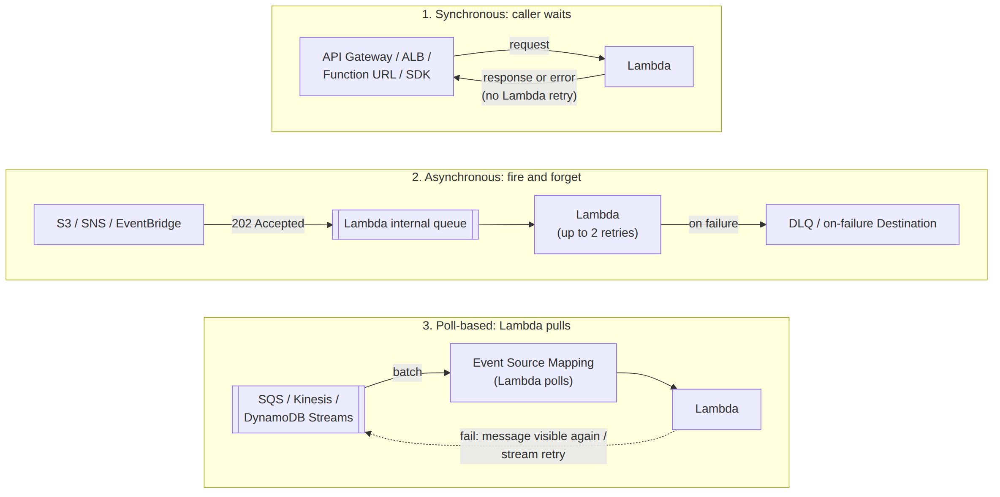

# 📚 Day 24 — Invocation Models ও API Gateway (HTTP Trigger)

> 📊 **Visual Summary** — সহজে বোঝার জন্য diagram:



**সময়:** ১.৫ ঘণ্টা | **Module:** ৪ (Serverless & Lambda Fundamentals) — Day 3

## 🎯 আজকের লক্ষ্য
- Lambda call হওয়ার ৩টা উপায়: Synchronous, Asynchronous, Poll-based
- কোন trigger কোন model-এ চলে, আর retry কীভাবে হয়
- API Gateway: REST API বনাম HTTP API
- Lambda proxy integration-এর event আর response format
- CORS, authorization, throttling
- Lambda Function URL
- Hands-on: API Gateway + Lambda দিয়ে একটা ছোট API

---

## Part 1: তিনটা Invocation Model

Trigger কীভাবে Lambda-কে call করে, সেটাই ঠিক করে দেয় error হলে কী হবে। Exam আর interview-এ এটা খুব গুরুত্বপূর্ণ।

| | **Synchronous** | **Asynchronous** | **Poll-based (Event Source Mapping)** |
|---|---|---|---|
| কীভাবে | Caller অপেক্ষা করে, সরাসরি response পায় | Lambda event নিজের internal queue-তে রাখে, caller সাথে সাথে `202` পায় | **Lambda নিজে** source poll করে batch এনে synchronously চালায় |
| Trigger উদাহরণ | **API Gateway**, ALB, Function URL, SDK `RequestResponse`, Cognito | **S3**, **SNS**, **EventBridge**, CloudWatch Logs, SDK `Event` | **SQS**, **Kinesis**, **DynamoDB Streams**, MSK/Kafka, MQ |
| Error হলে retry | **Lambda retry করে না**; caller-কে error ফেরত যায় | Lambda **২ বার retry** করে (মোট ৩ চেষ্টা), event সর্বোচ্চ ৬ ঘণ্টা রাখে | Source অনুযায়ী: SQS-এ message আবার visible হয়; Stream-এ record expire না হওয়া পর্যন্ত retry |
| ব্যর্থ event কোথায় যায় | Caller সামলাবে | **DLQ** বা **on-failure Destination** | SQS: queue-এর **redrive DLQ**; Stream: **on-failure destination** |
| Payload সীমা | ৬ MB request/response | ২৫৬ KB (২০২৫-এ ১ MB পর্যন্ত বাড়ানো হয়েছে, docs মিলিয়ে নিন) | Batch অনুযায়ী |

> 💡 মনে রাখার কৌশল: **"কেউ অপেক্ষা করছে?"** হ্যাঁ হলে sync। **"Lambda-কে push করছে, কিন্তু অপেক্ষা করছে না?"** হলে async। **"Lambda নিজে টেনে আনছে?"** হলে poll-based।

### Async Destinations (DLQ-র আধুনিক বিকল্প)
Async invocation-এর ফল পাঠানো যায়:
- **On success** → SQS / SNS / EventBridge / আরেকটা Lambda
- **On failure** → একই অপশন (DLQ-র চেয়ে বেশি তথ্য দেয়: error message, stack trace, request context)

### ⚠️ Idempotency
Async আর poll-based-এ একই event **একাধিকবার** আসতে পারে (retry, at-least-once)। তাই function **idempotent** রাখুন: একই event দুবার এলেও ফল একই থাকবে (যেমন order ID দিয়ে duplicate চেক, DynamoDB conditional write)।

---

## Part 2: API Gateway কী?

**Amazon API Gateway** = Managed service যেটা HTTP API তৈরি, publish আর secure করে। Client request → API Gateway → Lambda (বা অন্য backend) → response।

API Gateway আপনার হয়ে যা করে:
- Routing (`GET /users/{id}`)
- Authentication (IAM, Cognito, JWT, Lambda authorizer)
- Throttling আর usage plan
- CORS
- Request validation (REST API)
- Custom domain + TLS certificate (ACM)
- Stage (`dev`, `prod`)

### REST API বনাম HTTP API বনাম WebSocket API

| | **HTTP API** | **REST API** |
|---|---|---|
| দাম | **সস্তা** (REST-এর তুলনায় অনেক কম) | বেশি |
| Latency | কম | একটু বেশি |
| Auth | IAM, **JWT** (Cognito/OIDC), Lambda authorizer | IAM, Cognito, Lambda authorizer, **API key** |
| Usage plan + API key | ❌ | ✅ |
| Request validation / transformation (mapping template) | ❌ | ✅ |
| Caching | ❌ | ✅ |
| AWS WAF | ❌ | ✅ |
| Private API (শুধু VPC থেকে) | ❌ | ✅ |
| কখন | বেশিরভাগ সাধারণ Lambda API | Enterprise feature লাগলে |

**WebSocket API**: real-time two-way (chat, live notification), connect/disconnect/message route-এ Lambda।

> 💡 নতুন সাধারণ API হলে **HTTP API** দিয়ে শুরু করুন। API key/usage plan, WAF, caching বা request validation লাগলে REST API।

---

## Part 3: Lambda Proxy Integration — Event ও Response

**Proxy integration**-এ পুরো HTTP request Lambda-র `event`-এ আসে, আর Lambda-কে HTTP response-এর format-এ ফেরত দিতে হয়।

### 📥 HTTP API (payload format 2.0) event — সংক্ষেপে
```json
{
  "version": "2.0",
  "routeKey": "GET /users/{id}",
  "rawPath": "/users/42",
  "rawQueryString": "include=orders",
  "headers": { "content-type": "application/json", "user-agent": "curl/8.0" },
  "queryStringParameters": { "include": "orders" },
  "pathParameters": { "id": "42" },
  "requestContext": {
    "http": { "method": "GET", "sourceIp": "203.0.113.10" },
    "requestId": "abc123"
  },
  "body": null,
  "isBase64Encoded": false
}
```
> REST API (payload 1.0)-তে field-এর নাম একটু আলাদা: `httpMethod`, `path`, `resource` ইত্যাদি।

### 📤 Response format
```python
import json

def lambda_handler(event, context):
    user_id = event["pathParameters"]["id"]
    return {
        "statusCode": 200,
        "headers": {"Content-Type": "application/json"},
        "body": json.dumps({"id": user_id, "name": "Jasim"})
    }
```

| নিয়ম | ভুল করলে |
|---|---|
| `body` অবশ্যই **string** (`json.dumps`) | `502 Bad Gateway` / "Malformed Lambda proxy response" |
| `statusCode` দিন | REST API-তে 502 |
| POST-এর `body` আসে string হিসেবে | `json.loads(event["body"])` করতে ভুলবেন না |

> HTTP API-তে (format 2.0) শুধু একটা object return করলেও API Gateway নিজে 200 + JSON বানিয়ে দেয়, কিন্তু পরিষ্কার থাকতে পুরো format ব্যবহার করুন।

### ⏱ Timeout
API Gateway-র integration timeout default **২৯ সেকেন্ড**। Lambda ১৫ মিনিট চলতে পারলেও API client ২৯ সেকেন্ডের বেশি অপেক্ষা করবে না। লম্বা কাজ হলে **async pattern**: request নিয়ে SQS/Step Functions-এ পাঠান, সাথে সাথে `202 Accepted` + job ID দিন, পরে status দেখার endpoint।

---

## Part 4: CORS

Browser-এর JavaScript অন্য domain-এর API call করলে **CORS** header লাগে।

- **HTTP API:** API-র settings-এ CORS configure করুন (allowed origins, methods, headers)। OPTIONS preflight API Gateway নিজে সামলায়।
- **REST API + proxy integration:** Lambda-র response-এও header দিতে হয়:
```python
"headers": {
    "Access-Control-Allow-Origin": "https://app.example.com",
    "Access-Control-Allow-Headers": "Content-Type,Authorization"
}
```
> ⚠️ Production-এ `Access-Control-Allow-Origin: *` দিয়ে credential (cookie) পাঠানো যায় না, আর নিরাপদও না। নির্দিষ্ট domain দিন।

---

## Part 5: Authorization

| উপায় | কীভাবে | কখন |
|---|---|---|
| **IAM (SigV4)** | Caller-কে AWS credential দিয়ে request sign করতে হয় | Service-to-service, internal tool |
| **JWT authorizer** (HTTP API) / **Cognito authorizer** (REST) | `Authorization: Bearer <token>` যাচাই | Web/mobile app-এর user login |
| **Lambda authorizer** | নিজের Lambda token/header যাচাই করে allow/deny policy দেয় | Custom auth, 3rd-party token |
| **API key + usage plan** (REST) | `x-api-key` header | **Throttling/quota**-র জন্য; একা **authentication হিসেবে যথেষ্ট না** |

---

## Part 6: Throttling ও Stages

- Account-level default: প্রতি region **১০,০০০ request/সেকেন্ড**, burst **৫,০০০** (soft limit)
- Route/stage-level throttle দিয়ে নির্দিষ্ট endpoint সীমিত করা যায়
- Throttle হলে client পায় **`429 Too Many Requests`**
- **Stage** = deployment environment (`dev`, `prod`); প্রতিটার আলাদা URL: `https://abc123.execute-api.ap-south-1.amazonaws.com/prod`
- Stage variable দিয়ে stage অনুযায়ী আলাদা Lambda alias call করা যায় (Day 23-এর alias)

---

## Part 7: Lambda Function URL — সবচেয়ে সহজ HTTP endpoint

API Gateway ছাড়াই function-এর নিজস্ব HTTPS URL:
```bash
aws lambda create-function-url-config --function-name my-fn --auth-type AWS_IAM
# → https://<id>.lambda-url.ap-south-1.on.aws/
```

| Auth type | মানে |
|---|---|
| `AWS_IAM` | Signed request লাগবে |
| `NONE` | Public; যে কেউ call করতে পারে (resource policy-তে `lambda:InvokeFunctionUrl` public allow হয়) |

| | Function URL | API Gateway |
|---|---|---|
| Setup | এক command | বেশি config |
| Routing | একটা function = একটা URL | অনেক route, অনেক backend |
| Auth | IAM বা none | IAM, JWT, Cognito, Lambda authorizer |
| Throttling, usage plan, custom domain | নিজে (reserved concurrency দিয়ে সীমা) | Built-in |
| Response streaming | ✅ | সীমিত |
| খরচ | বাড়তি charge নেই | API Gateway-র request charge |

**Function URL কখন:** webhook receiver (Stripe/GitHub), internal tool, single-purpose endpoint, response streaming।

---

## Part 8: Hands-on Lab — HTTP API + Lambda

1. Day 22-এর মতো Lambda `users-api` বানান (Part 3-এর handler)
2. API Gateway → **Create API** → **HTTP API** → Integration: Lambda `users-api`
3. Route: `GET /users/{id}` → Stage: `$default` (auto-deploy)
4. Test:
```bash
curl https://<api-id>.execute-api.ap-south-1.amazonaws.com/users/42
# {"id": "42", "name": "Jasim"}
```
5. Lambda-র **Configuration → Triggers**-এ দেখুন API Gateway যোগ হয়েছে, আর **Permissions → Resource-based policy**-তে API Gateway-কে `lambda:InvokeFunction` দেওয়া হয়েছে (Day 26-এ বিস্তারিত)

### CLI-তে async invoke test
```bash
aws lambda invoke --function-name users-api --invocation-type Event \
  --cli-binary-format raw-in-base64-out --payload '{}' out.json
# StatusCode: 202 → Lambda নিয়েছে, ফল অপেক্ষা করেনি
```

---

## Part 9: Troubleshooting

| লক্ষণ | কারণ |
|---|---|
| `502 Bad Gateway` / `Internal server error` | Response format ভুল (body string না), বা Lambda exception ছুঁড়েছে; CloudWatch log দেখুন |
| `503 Service Unavailable` / `504` | Lambda timeout বা API Gateway-র ২৯ s সীমা |
| `403 Forbidden` / `Missing Authentication Token` | ভুল path/stage বা method (REST API-তে route নেই এমন URL-এ এই message আসে), অথবা auth ব্যর্থ |
| `429` | Throttle (API Gateway বা Lambda concurrency) |
| Browser-এ CORS error, curl-এ ঠিক আছে | CORS config বা response header নেই |
| `event["body"]` dict না | Body string; `json.loads` করুন; `isBase64Encoded` true হলে আগে decode |

---

## 🎯 আজকের মূল Takeaways

1. **Sync** (API Gateway, ALB): retry নেই, caller সামলায়
2. **Async** (S3, SNS, EventBridge): Lambda ২ বার retry, তারপর DLQ/Destination
3. **Poll-based** (SQS, Kinesis, DynamoDB Streams): Lambda নিজে poll করে, retry source অনুযায়ী
4. Async/poll-এ duplicate আসতে পারে → **idempotent** function
5. সাধারণ API → **HTTP API** (সস্তা, দ্রুত); enterprise feature → REST API
6. Proxy response: `statusCode` + `headers` + **string `body`**
7. API Gateway timeout **২৯ s**; লম্বা কাজ → async pattern
8. সহজ single endpoint → **Function URL**

---

## 📝 Self-check Questions

1. S3 upload-এ Lambda ব্যর্থ হলে কতবার retry হয়? তারপর event কোথায় যায়?
2. API Gateway থেকে call হওয়া Lambda-তে error হলে retry কে করবে?
3. SQS trigger কোন invocation model-এ পড়ে?
4. HTTP API আর REST API-র মধ্যে কখন REST বাছবেন? দুটো কারণ বলুন।
5. Lambda `{"statusCode": 200, "body": {"a": 1}}` return করল, client 502 পেল। কেন?
6. একটা report বানাতে ৩ মিনিট লাগে। API দিয়ে কীভাবে design করবেন?
7. API key কেন একা authentication হিসেবে যথেষ্ট না?

<details><summary>▶ উত্তর দেখুন</summary>

1. ২ বার retry (মোট ৩ চেষ্টা); তারপর configure করা DLQ বা on-failure destination-এ, না থাকলে event হারিয়ে যায়।
2. Lambda না; caller (client বা API consumer) retry করবে।
3. Poll-based (event source mapping)।
4. API key + usage plan, WAF, caching, request validation, private API (যেকোনো দুটো)।
5. `body` string হতে হবে; `json.dumps({"a": 1})` দিতে হবে।
6. API request নিয়ে SQS বা Step Functions-এ পাঠিয়ে সাথে সাথে `202` + job ID; background-এ কাজ; আলাদা `GET /jobs/{id}` দিয়ে status/result।
7. Key সহজে share বা leak হয়, user-কে চেনায় না; মূলত throttling/quota-র জন্য। Auth-এর জন্য IAM/JWT/Cognito/Lambda authorizer।
</details>

---

## 💡 Pro Tips

- API-র জন্য Lambda-র timeout ২৯ সেকেন্ডের নিচে রাখুন
- **Powertools**-এর event handler (Python `APIGatewayHttpResolver`) দিয়ে এক function-এ routing সহজ হয়, তবে "এক route, এক function" নিয়মও ভালো
- Custom domain (`api.example.com`) + ACM certificate দিন, stage URL client-কে দেবেন না
- Access log চালু রাখুন (JSON format), CloudWatch Logs Insights-এ query করা যায়
- Public API-তে throttling সবসময় দিন

---

## 🎨 Quick Reference

```
SYNC   : API Gateway, ALB, Function URL, SDK  → no Lambda retry
ASYNC  : S3, SNS, EventBridge                 → 2 retries → DLQ / Destination
POLL   : SQS, Kinesis, DynamoDB Streams       → Lambda polls, source-based retry
```

```python
return {"statusCode": 200,
        "headers": {"Content-Type": "application/json"},
        "body": json.dumps(data)}
```

```
HTTP API: cheaper, JWT auth       | REST API: API keys, WAF, cache, validation
API GW timeout: 29 s              | throttle default 10,000 rps / 5,000 burst
```

---

## 🚨 বাস্তব পরিস্থিতি (যেসব ভুল প্রায়ই হয়)

**পরিস্থিতি ১:** Payment function async-এ call হতো। Retry-তে একই payment দুবার charge হলো।
**শিক্ষা:** Async/poll-এ idempotency key বাধ্যতামূলক।

**পরিস্থিতি ২:** PDF report তৈরি API-তে ৪০ সেকেন্ড লাগত। User সবসময় `504` পেত, অথচ Lambda log-এ সব সফল।
**শিক্ষা:** API Gateway ২৯ s-এ কেটে দেয়; async pattern।

**পরিস্থিতি ৩:** Function URL `NONE` auth দিয়ে খুলে রাখা হয়েছিল test-এর জন্য। Bot খুঁজে পেয়ে লাখো request পাঠাল, বিল বাড়ল।
**শিক্ষা:** Public URL-এ reserved concurrency দিয়ে সীমা, আর test শেষে বন্ধ।

---

**⏮ আগের দিন:** [Day 23 — Packages, Layers, Versions](./Day-23-Deployment-Packages-Layers-Versions-Aliases.md) | **⏭ পরের দিন:** [Day 25 — S3, SQS, SNS, DynamoDB Streams, EventBridge Triggers](./Day-25-Event-Triggers-S3-SQS-SNS-DynamoDB-EventBridge.md)
