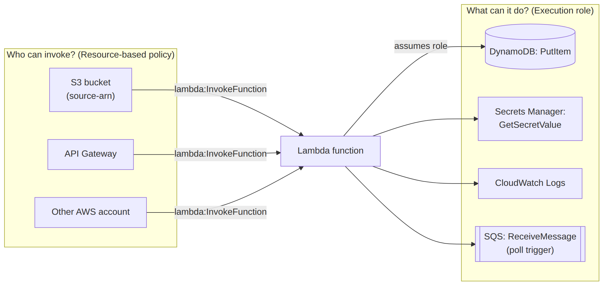
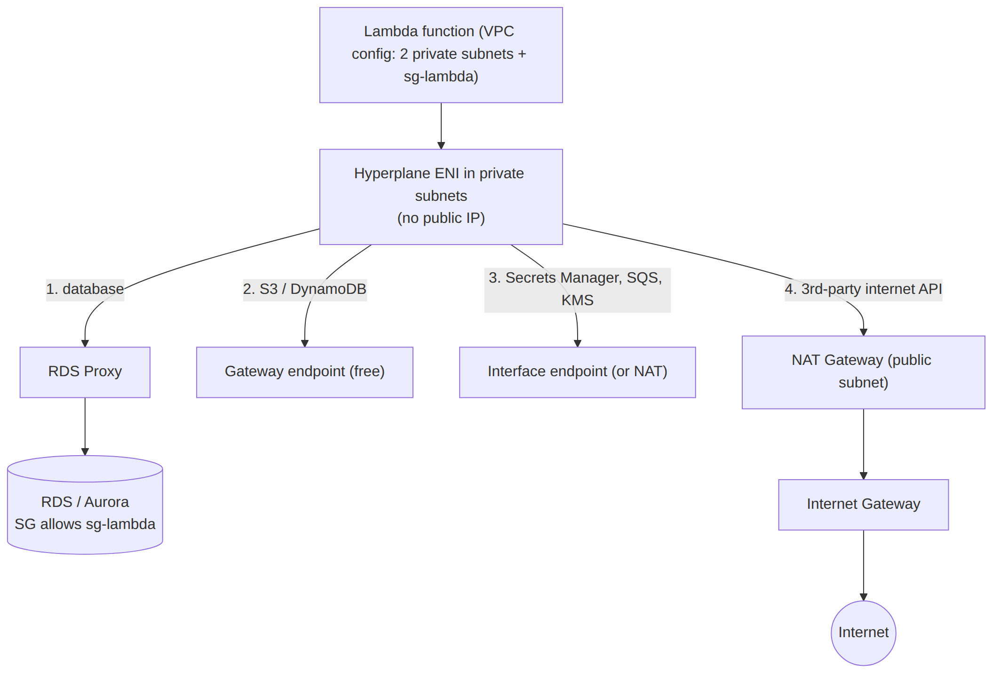

# 📚 Day 26 — Lambda Permissions ও Security: Execution Role, Resource Policy, VPC, Secrets

> 📊 **Visual Summary** — সহজে বোঝার জন্য diagram:





**সময়:** ১.৫ ঘণ্টা | **Module:** ৪ (Serverless & Lambda Fundamentals) — Day 5

## 🎯 আজকের লক্ষ্য
- Lambda-র দুই দিকের permission: **কে Lambda-কে call করতে পারে** আর **Lambda কী করতে পারে**
- Execution Role আর least privilege
- Resource-based policy (API Gateway, S3, অন্য account)
- VPC-র ভেতরে Lambda: কখন দরকার, internet/AWS service access
- Environment variable encryption
- Secrets Manager / Parameter Store integration (extension সহ)
- Code signing ও অন্যান্য security practice

---

## Part 1: দুই দিকের Permission — মূল ধারণা

```
[কে call করবে?]                     [Lambda কী করতে পারবে?]
S3 / API Gateway / SNS  ──►  Lambda function  ──►  DynamoDB / S3 / Secrets Manager
     Resource-based policy          Execution Role (IAM role)
```

| | **Resource-based policy** | **Execution role** |
|---|---|---|
| প্রশ্ন | "**কে** এই function invoke করতে পারবে?" | "এই function **কোন AWS service**-এ কী করতে পারবে?" |
| কোথায় থাকে | Function-এর সাথে | IAM role, function-এ attach |
| উদাহরণ | `s3.amazonaws.com`-কে `lambda:InvokeFunction` | `dynamodb:PutItem` on `orders` table |

> ⚠️ **Poll-based trigger** (SQS, Kinesis, DynamoDB Streams)-এ Lambda নিজেই source পড়ে। তাই সেখানে resource policy না, **execution role**-এ source পড়ার permission লাগে (যেমন `sqs:ReceiveMessage`, `sqs:DeleteMessage`)।

---

## Part 2: Execution Role

প্রতিটা Lambda-র একটা IAM role থাকে, যেটা Lambda চলার সময় **assume** করে। SDK নিজে থেকেই এই role-এর temporary credential পায় (environment variable-এ), code-এ কোনো key লাগে না। Day 16-এর EC2 instance profile-এর মতো।

### Trust policy (Lambda service এই role নিতে পারবে)
```json
{
  "Version": "2012-10-17",
  "Statement": [{
    "Effect": "Allow",
    "Principal": { "Service": "lambda.amazonaws.com" },
    "Action": "sts:AssumeRole"
  }]
}
```

### AWS managed policy (common)

| Policy | কী দেয় |
|---|---|
| `AWSLambdaBasicExecutionRole` | CloudWatch Logs-এ log লেখা (প্রায় সব function-এ লাগে) |
| `AWSLambdaSQSQueueExecutionRole` | SQS poll ও delete |
| `AWSLambdaDynamoDBExecutionRole` | DynamoDB Streams পড়া |
| `AWSLambdaVPCAccessExecutionRole` | VPC-তে ENI তৈরি/মুছা |
| `AWSXRayDaemonWriteAccess` | X-Ray trace পাঠানো |

### ✅ Least privilege custom policy
```json
{
  "Version": "2012-10-17",
  "Statement": [
    {
      "Effect": "Allow",
      "Action": ["dynamodb:PutItem", "dynamodb:GetItem"],
      "Resource": "arn:aws:dynamodb:ap-south-1:111122223333:table/orders"
    },
    {
      "Effect": "Allow",
      "Action": "s3:GetObject",
      "Resource": "arn:aws:s3:::my-photos/uploads/*"
    }
  ]
}
```

**নিয়ম:**
- **এক function = এক role** (সব function-এ একটা বড় shared role না)
- `*` action/resource এড়িয়ে চলুন; `AmazonDynamoDBFullAccess` ধরনের policy production-এ না
- SAM-এ ready policy template: `DynamoDBCrudPolicy: {TableName: orders}`, `S3ReadPolicy`, `SQSPollerPolicy`
- **IAM Access Analyzer** দিয়ে CloudTrail থেকে আসল ব্যবহার দেখে policy ছোট করুন

---

## Part 3: Resource-based Policy

Push-ধরনের trigger (API Gateway, S3, SNS, EventBridge) Lambda invoke করার অনুমতি এখানে পায়। Console-এ trigger যোগ করলে এটা নিজে থেকেই বসে যায়। CLI/IaC-তে নিজে দিতে হয়:

```bash
aws lambda add-permission \
  --function-name thumbnailer \
  --statement-id s3-invoke \
  --action lambda:InvokeFunction \
  --principal s3.amazonaws.com \
  --source-arn arn:aws:s3:::my-photos \
  --source-account 111122223333
```

> 🔐 **`--source-arn` আর `--source-account` অবশ্যই দিন।** না দিলে অন্য কারো bucket বা API-ও আপনার function trigger করতে পারে (**confused deputy** সমস্যা)।

### অন্য account-কে invoke করতে দেওয়া
```bash
aws lambda add-permission --function-name shared-fn \
  --statement-id partner-account --action lambda:InvokeFunction \
  --principal 444455556666
```

দেখা:
```bash
aws lambda get-policy --function-name thumbnailer
```

---

## Part 4: VPC-র ভেতরে Lambda

Default-এ Lambda AWS-এর নিজস্ব network-এ চলে: **internet আর public AWS API-তে যেতে পারে**, কিন্তু **আপনার VPC-র private resource (RDS, ElastiCache, private EC2)-এ পারে না**।

### কখন VPC-তে দেবেন
- ✅ Private subnet-এর **RDS/Aurora, ElastiCache, OpenSearch, internal API** access করতে হবে
- ❌ শুধু DynamoDB, S3, SQS ব্যবহার করলে **VPC-তে দেবেন না**। এগুলো public endpoint-এ IAM দিয়ে secure, VPC শুধু জটিলতা বাড়ায়

### কীভাবে কাজ করে
- Function config-এ **subnet** (একাধিক AZ, private) আর **security group** দিন
- Lambda ঐ subnet-এ **Hyperplane ENI** বানায় (function-গুলো share করে, তাই আগের মতো বড় cold start penalty আর নেই)
- Execution role-এ `AWSLambdaVPCAccessExecutionRole` লাগে

```bash
aws lambda update-function-configuration --function-name orders-api \
  --vpc-config SubnetIds=subnet-aaa,subnet-bbb,SecurityGroupIds=sg-lambda
```

### ⚠️ VPC-তে দেওয়ার পর internet বা AWS service-এ যাওয়া
VPC Lambda **public IP পায় না**। Public subnet-এ রাখলেও internet-এ যেতে পারবে না।

| দরকার | সমাধান |
|---|---|
| Internet (3rd-party API) | Private subnet + **NAT Gateway** (Module 2, Day 11) |
| S3 / DynamoDB | **Gateway VPC Endpoint** (free) |
| Secrets Manager, SQS, SNS, KMS ইত্যাদি | **Interface VPC Endpoint** (Day 12) অথবা NAT |

### Security Group chaining
```
sg-lambda (outbound: 5432 → sg-rds)
sg-rds    (inbound: 5432 from sg-lambda)
```

### RDS-এর সাথে Lambda: RDS Proxy
Lambda-র concurrency হঠাৎ অনেক বাড়তে পারে, প্রতিটা environment নিজের DB connection খোলে, ফলে RDS-এর connection শেষ হয়ে যায়। **RDS Proxy** connection pool করে সমস্যাটা মেটায় (Interview Q93)। IAM authentication-ও support করে।

---

## Part 5: Environment Variable Encryption

- Lambda env var সবসময় **at rest KMS দিয়ে encrypted** (default: AWS managed key `aws/lambda`)
- **Customer managed KMS key** দিলে: কে decrypt করতে পারবে তা key policy দিয়ে নিয়ন্ত্রণ, আর CloudTrail audit
- কিন্তু যার `lambda:GetFunctionConfiguration` permission আছে, সে console-এ **plain text দেখতে পায়**
- **"Encryption in transit helpers"** (console option) দিয়ে নির্দিষ্ট value আলাদা করে KMS-encrypt করা যায়; তখন code-এ নিজে `kms:Decrypt` করতে হয়

👉 তাই **আসল secret-এর জায়গা env var না**, Secrets Manager বা Parameter Store। Env var-এ রাখুন শুধু **নাম/ARN** (যেমন `DB_SECRET_ARN`)।

---

## Part 6: Secrets Manager ও Parameter Store Integration

### উপায় ১: SDK দিয়ে সরাসরি (INIT phase-এ cache)
```python
import json, os, boto3

sm = boto3.client("secretsmanager")
_secret = None

def get_db_secret():
    global _secret
    if _secret is None:                     # warm call-এ আবার fetch না
        resp = sm.get_secret_value(SecretId=os.environ["DB_SECRET_ARN"])
        _secret = json.loads(resp["SecretString"])
    return _secret

def lambda_handler(event, context):
    db = get_db_secret()
    # db["username"], db["password"]
```
> ⚠️ Secret **rotate** হলে cache পুরনো থাকবে। TTL দিয়ে cache করুন (যেমন ৫ মিনিট), অথবা auth error পেলে আবার fetch করুন।

### উপায় ২: AWS Parameters and Secrets Lambda Extension (recommended)
AWS-এর দেওয়া একটা **layer**, যেটা function-এর পাশে local cache server চালায়। Code localhost-এ HTTP call করে:

```python
import os, json, urllib.request

def get_secret(name):
    url = f"http://localhost:2773/secretsmanager/get?secretId={name}"
    req = urllib.request.Request(url, headers={
        "X-Aws-Parameters-Secrets-Token": os.environ["AWS_SESSION_TOKEN"]
    })
    return json.loads(json.loads(urllib.request.urlopen(req).read())["SecretString"])
```
- Parameter Store-এর জন্য: `/systemsmanager/parameters/get?name=/myapp/prod/api_key&withDecryption=true`
- Cache TTL env var দিয়ে (`SECRETS_MANAGER_TTL`, `SSM_PARAMETER_STORE_TTL`)
- কম API call, তাই খরচ আর latency কমে

### Permission
Execution role-এ:
- `secretsmanager:GetSecretValue` (নির্দিষ্ট secret ARN-এ)
- Parameter Store হলে `ssm:GetParameter`
- Customer managed KMS key হলে `kms:Decrypt`

---

## Part 7: আরও Security Practice

| বিষয় | কী করবেন |
|---|---|
| **Code signing** | AWS Signer দিয়ে sign করা code ছাড়া deploy আটকানো (Code signing config) |
| **Function URL / API** | Auth ছাড়া (`NONE`) খুলবেন না, খুললে throttle/reserved concurrency দিন |
| **Input validation** | Event-এর data বিশ্বাস করবেন না (API body, S3 key, SQS message) |
| **Dependency** | `npm audit` / `pip-audit`; **Amazon Inspector** Lambda code আর dependency scan করে |
| **Log-এ secret** | কখনো password/token print না; Powertools logger-এ mask |
| **Least privilege invoke** | কে কোন function call করতে পারে, IAM policy-তে নির্দিষ্ট ARN |
| **Runtime update** | Deprecated runtime-এ security patch আসে না, সময়মতো upgrade |
| **CloudTrail** | `UpdateFunctionCode`, `AddPermission` ধরনের পরিবর্তনে alert |

---

## Part 8: Hands-on Lab — Secret পড়া Lambda

1. Secrets Manager-এ secret বানান: `prod/myapp/db` → `{"username":"app","password":"S3cure!"}`
2. Lambda `read-secret` (Python), env var `DB_SECRET_ARN` = secret-এর ARN
3. Execution role-এ inline policy:
```json
{"Effect": "Allow", "Action": "secretsmanager:GetSecretValue",
 "Resource": "arn:aws:secretsmanager:ap-south-1:111122223333:secret:prod/myapp/db-*"}
```
4. Part 6-এর উপায় ১ code দিয়ে test করুন (password print করবেন না, শুধু `username`)
5. Permission সরিয়ে আবার test করুন → `AccessDeniedException` দেখুন
6. **বোনাস:** Parameters and Secrets Extension layer যোগ করে উপায় ২ চেষ্টা করুন

---

## 🎯 আজকের মূল Takeaways

1. **Resource-based policy** = কে Lambda call করবে; **Execution role** = Lambda কী করবে
2. Poll-based trigger-এ source পড়ার permission **execution role**-এ
3. এক function এক role, **least privilege**, নির্দিষ্ট ARN
4. `add-permission`-এ **`--source-arn` + `--source-account`** (confused deputy ঠেকাতে)
5. VPC-তে দিন **শুধু private resource লাগলে**; তারপর internet → NAT, S3/DynamoDB → Gateway endpoint
6. Env var encrypted হলেও **secret না**; secret → Secrets Manager/Parameter Store, cache সহ
7. RDS + Lambda = **RDS Proxy**

---

## 📝 Self-check Questions

1. S3 event দিয়ে Lambda চালাতে কোন permission কোথায় লাগে? Lambda-কে S3 থেকে file পড়তে কোথায় permission লাগে?
2. SQS trigger-এর জন্য resource-based policy লাগে না কেন?
3. VPC-তে দেওয়া Lambda হঠাৎ 3rd-party API call করতে পারছে না। কেন, আর সমাধান কী?
4. Lambda শুধু DynamoDB ব্যবহার করে। VPC-তে দেওয়া উচিত?
5. `add-permission`-এ `--source-arn` না দিলে কী ঝুঁকি?
6. Env var-এ DB password রাখার দুটো সমস্যা বলুন।
7. Secrets Manager call প্রতি invocation-এ না করে কীভাবে optimize করবেন?

<details><summary>▶ উত্তর দেখুন</summary>

1. S3-কে invoke করতে দিতে: Lambda-র **resource-based policy**। Lambda-র S3 পড়তে: **execution role**-এ `s3:GetObject`।
2. SQS-এ Lambda নিজে poll করে; invoke-এর কোনো বাইরের caller নেই। তাই execution role-এ `sqs:ReceiveMessage` ইত্যাদি লাগে।
3. VPC Lambda-র public IP নেই; private subnet + NAT Gateway লাগবে (public subnet-এ দিলেও কাজ করবে না)।
4. না; DynamoDB public endpoint-এ IAM দিয়ে secure। VPC শুধু জটিলতা বাড়াবে (দরকার হলে Gateway endpoint)।
5. অন্য account-এর যেকোনো S3 bucket বা API আপনার function trigger করতে পারে (confused deputy)।
6. Function config পড়ার permission থাকা যে কেউ plain text দেখে; rotation নেই (আর version-এ freeze হয়ে থাকে)।
7. INIT-এ বা global-এ TTL সহ cache, অথবা Parameters and Secrets Lambda Extension।
</details>

---

## 💡 Pro Tips

- SAM-এর `Policies:` section-এ policy template ব্যবহার করুন, least privilege সহজে পাওয়া যায়
- Private subnet-এ Lambda থাকলে NAT-এর খরচ বাঁচাতে যতটা সম্ভব **VPC endpoint** ব্যবহার করুন
- VPC Lambda-কে **কমপক্ষে দুটো AZ**-এর subnet দিন
- Subnet-এ যথেষ্ট free IP রাখুন
- Organization-এ SCP দিয়ে "Function URL with auth NONE" নিষেধ করা যায় (`lambda:FunctionUrlAuthType` condition)

---

## 🎨 Quick Reference

```
Who can invoke?  → Resource-based policy  (aws lambda add-permission --source-arn ...)
What can it do?  → Execution role          (trust: lambda.amazonaws.com)
Poll triggers    → permissions in execution role (sqs:ReceiveMessage ...)
VPC Lambda       → subnets + SG + AWSLambdaVPCAccessExecutionRole
                   internet via NAT, S3/DDB via Gateway endpoint
Secrets          → Secrets Manager / Parameter Store + cache (extension: localhost:2773)
```

---

## 🚨 বাস্তব পরিস্থিতি (যেসব ভুল প্রায়ই হয়)

**পরিস্থিতি ১:** সব ২০টা Lambda একটা `AdministratorAccess` role share করত। একটা function-এর dependency-তে vulnerability দিয়ে attacker পুরো account-এ ঢুকে পড়ল।
**শিক্ষা:** এক function এক role, least privilege।

**পরিস্থিতি ২:** RDS access-এর জন্য Lambda VPC-তে দেওয়ার পর payment gateway-র API call timeout হতে লাগল। NAT Gateway ছিল না।
**শিক্ষা:** VPC Lambda-র internet লাগলে private subnet + NAT।

**পরিস্থিতি ৩:** Env var-এ Stripe secret key ছিল। একজন contractor-কে read-only Lambda console access দেওয়া হয়েছিল, তিনি key দেখে ফেললেন।
**শিক্ষা:** Secret → Secrets Manager, env var-এ শুধু ARN।

---

**⏮ আগের দিন:** [Day 25 — Event Triggers](./Day-25-Event-Triggers-S3-SQS-SNS-DynamoDB-EventBridge.md) | **⏭ পরের দিন:** [Day 27 — Monitoring ও Performance](./Day-27-Monitoring-Performance-Concurrency.md)
