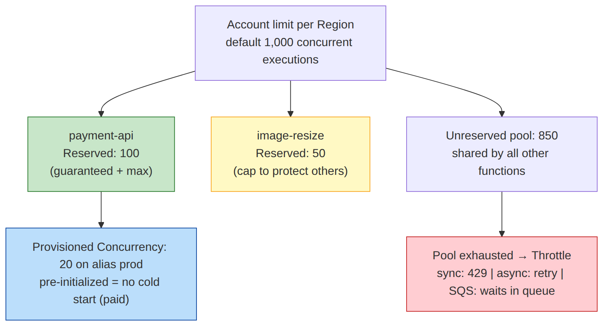

# 📚 Day 27 — Lambda Monitoring ও Performance: Logs, Metrics, X-Ray, Concurrency, Power Tuning

> 📊 **Visual Summary** — সহজে বোঝার জন্য diagram:



**সময়:** ১.৫ ঘণ্টা | **Module:** ৪ (Serverless & Lambda Fundamentals) — Day 6

## 🎯 আজকের লক্ষ্য
- CloudWatch Logs: log group, structured log, Logs Insights
- গুরুত্বপূর্ণ Lambda metrics আর alarm
- X-Ray দিয়ে distributed tracing
- Concurrency: account limit, **Reserved** আর **Provisioned** concurrency, throttling
- Cold start কমানোর উপায় (SnapStart সহ)
- **Lambda Power Tuning** দিয়ে সঠিক memory বাছাই

---

## Part 1: CloudWatch Logs

Lambda-র `console.log` / `print` সব যায় **CloudWatch Logs**-এ:
```
Log group:  /aws/lambda/<function-name>
Log stream: 2026/09/28/[$LATEST]a1b2c3...   ← প্রতিটা execution environment-এর জন্য একটা
```

- Execution role-এ `AWSLambdaBasicExecutionRole` লাগে
- **Retention default চিরকাল!** Log group-এ retention দিন (৭–৩০ দিন)
- Function-এর **log format = JSON** আর **log level** (`INFO`, `WARN`...) config থেকে set করা যায়
- নিজের log group নাম দেওয়াও যায় (অনেক function এক group-এ)

### Structured log (JSON)
```python
import json
def lambda_handler(event, context):
    print(json.dumps({"level": "INFO", "msg": "order processed",
                      "orderId": 101, "requestId": context.aws_request_id}))
```
**Powertools Logger** এটা আরও সহজ করে (request ID, cold start flag নিজে যোগ করে)।

### Logs Insights query
```
fields @timestamp, @message
| filter @type = "REPORT"
| stats avg(@duration), max(@duration), max(@maxMemoryUsed/1000/1000) as maxMemMB,
        count(@initDuration) as coldStarts, count(*) as invocations by bin(1h)
```
```
fields @timestamp, @message
| filter level = "ERROR"
| sort @timestamp desc
| limit 50
```

```bash
aws logs tail /aws/lambda/process-order --follow --since 10m
```

---

## Part 2: গুরুত্বপূর্ণ Metrics

Lambda নিজে থেকেই (namespace `AWS/Lambda`) এই metric পাঠায়:

| Metric | মানে | Alarm কখন |
|---|---|---|
| **Invocations** | কতবার call হয়েছে | হঠাৎ শূন্য (trigger ভেঙে গেছে?) বা অস্বাভাবিক বেশি |
| **Errors** | Function-এর ভেতরে error (exception, timeout) | Error rate > ১% |
| **Throttles** | Concurrency সীমার কারণে প্রত্যাখ্যাত | > ০ |
| **Duration** | চলার সময় (avg, p95, p99, max) | p99 timeout-এর কাছে গেলে |
| **ConcurrentExecutions** | একসাথে কতগুলো চলছে | Account/reserved সীমার ৮০% |
| **IteratorAge** | Stream (Kinesis/DDB)-এ কত পিছিয়ে | বাড়তে থাকলে |
| **DeadLetterErrors** / **DestinationDeliveryFailures** | DLQ/destination-এ পাঠাতে ব্যর্থ | > ০ |
| **AsyncEventAge**, **AsyncEventsDropped** | Async queue-তে event কতক্ষণ অপেক্ষা / বাদ | বাড়লে / > ০ |

### Error rate alarm (metric math)
```
error_rate = 100 * Errors / Invocations      → > 1% হলে SNS alert
```

> 💡 SQS trigger-এর জন্য SQS-এর `ApproximateAgeOfOldestMessage` আর DLQ-র `ApproximateNumberOfMessagesVisible`-এ-ও alarm দিন।

---

## Part 3: X-Ray — Distributed Tracing

একটা request API Gateway → Lambda → DynamoDB → SQS → আরেকটা Lambda হয়ে যায়। কোথায় ধীর বা কোথায় error, শুধু log দেখে বোঝা কঠিন। **X-Ray** পুরো পথটা দেখায়।

### চালু করা
- Function config → Monitoring → **Active tracing** ON (execution role-এ `AWSXRayDaemonWriteAccess`)
- API Gateway stage-এও tracing চালু করুন
- SDK call-গুলো আলাদা segment হিসেবে দেখতে code instrument করুন: Powertools Tracer, X-Ray SDK, বা **AWS Distro for OpenTelemetry (ADOT)** layer

```python
from aws_lambda_powertools import Tracer
tracer = Tracer()

@tracer.capture_lambda_handler
def lambda_handler(event, context):
    ...
```

### যা দেখা যায়
- **Service map**: কোন service কাকে call করছে, প্রতিটার latency ও error
- **Trace timeline**: Initialization (cold start) কত, handler কত, DynamoDB call কত ms
- Annotation দিয়ে filter (যেমন `orderId = 101`)

> CloudWatch-এর **Application Signals** আর **Lambda Insights** (extension layer; memory, CPU, network-এর বিস্তারিত) আরও গভীর monitoring দেয়।

---

## Part 4: Concurrency — সবচেয়ে গুরুত্বপূর্ণ Performance ধারণা

মনে করুন (Day 22): **একটা environment একসময়ে একটা request**। Concurrency = একসাথে কতগুলো environment চলছে।

### Account limit
- Region প্রতি default **১,০০০ concurrent executions** (সব function মিলিয়ে, বাড়ানো যায়)
- Scaling গতি: প্রতি function প্রতি **১০ সেকেন্ডে ১,০০০** করে বাড়তে পারে
- সীমা পার হলে **Throttle**:
  - Sync (API Gateway): client `429 TooManyRequestsException` পায়
  - Async: Lambda নিজে পরে আবার চেষ্টা করে (event age সীমা পর্যন্ত)
  - SQS: message queue-তে থেকে যায়, পরে process হয়

### ⚠️ "Noisy neighbor" সমস্যা
একটা function-এ হঠাৎ spike (বা recursive loop) হলে সে পুরো account-এর ১,০০০ খেয়ে ফেলে, আর **বাকি সব function throttle** হয়। Payment API বন্ধ হয়ে যায় একটা image resize function-এর জন্য!

### Reserved Concurrency
```bash
aws lambda put-function-concurrency --function-name payment-api \
  --reserved-concurrent-executions 100
```
- এই function-এর জন্য ১০০ **সংরক্ষিত**; অন্য কেউ নিতে পারবে না
- একই সাথে এটাই এই function-এর **সর্বোচ্চ সীমা**
- **Free**
- ব্যবহার:
  - Critical function-এর capacity নিশ্চিত করা
  - **Downstream রক্ষা**: RDS বা 3rd-party API যেন ২০টার বেশি connection না পায়
  - **Kill switch**: `0` দিলে function বন্ধ (recursive loop থামাতে)

### Provisioned Concurrency
```bash
aws lambda put-provisioned-concurrency-config --function-name checkout-api \
  --qualifier prod --provisioned-concurrent-executions 20
```
- ২০টা environment **আগে থেকেই initialize** হয়ে ready থাকে, তাই **cold start থাকে না**
- **Alias বা version**-এ দিতে হয় (`$LATEST`-এ না)
- **খরচ আছে**: চালু থাকলেই টাকা (ব্যবহার না হলেও)
- বাড়তি traffic এলে সাধারণ (on-demand) concurrency-তে যায়, সেখানে cold start হতে পারে
- **Application Auto Scaling** দিয়ে schedule (অফিস সময়ে বেশি) বা utilization অনুযায়ী বাড়ানো-কমানো

| | Reserved | Provisioned |
|---|---|---|
| উদ্দেশ্য | Capacity সংরক্ষণ + সর্বোচ্চ সীমা | Cold start দূর করা |
| Cold start কমায়? | ❌ | ✅ |
| খরচ | Free | চালু থাকলেই charge |
| কোথায় | Function | Alias/version |

---

## Part 5: Cold Start কমানোর উপায়

| উপায় | প্রভাব |
|---|---|
| **Package ছোট** (esbuild bundle, অদরকারি dependency বাদ) | Download ও init দ্রুত |
| **Lazy import** (যা শুধু কিছু path-এ লাগে তা handler-এর ভেতরে import) | Init কম |
| হালকা runtime (Node/Python/Go) | Java/.NET-এর তুলনায় কম cold start |
| **Memory বাড়ানো** | বেশি CPU = দ্রুত init |
| **arm64** | প্রায়ই সামান্য দ্রুত ও সস্তা |
| **Provisioned Concurrency** | Cold start প্রায় শূন্য (খরচ সহ) |
| **SnapStart** (Java, Python, .NET) | Init-এর পর snapshot রেখে সেখান থেকে resume; Java-তে cold start অনেক কমে |
| VPC | আগে বড় penalty ছিল, এখন Hyperplane ENI-র কারণে সামান্য |

> 💡 "Warmer" (প্রতি ৫ মিনিটে ping) পুরনো কৌশল। শুধু একটা environment warm রাখে, concurrent spike-এ কাজ করে না। দরকার হলে Provisioned Concurrency বা SnapStart ব্যবহার করুন।

---

## Part 6: Lambda Power Tuning — সঠিক Memory বাছাই

Day 22-এ দেখেছি memory বাড়ালে CPU বাড়ে, আর কখনো খরচ কমে। কিন্তু **কোন memory সবচেয়ে ভালো** তা অনুমান না করে মাপুন।

**AWS Lambda Power Tuning** = open-source tool (Step Functions state machine), Serverless Application Repository থেকে deploy করা যায়।

### কীভাবে কাজ করে
1. আপনার function-কে বিভিন্ন memory-তে চালায় (যেমন 128, 256, 512, 1024, 1536, 3008 MB)
2. প্রতিটায় অনেকবার invoke করে গড় duration আর খরচ মাপে
3. একটা graph দেয়: **cost বনাম speed**

### Input উদাহরণ
```json
{
  "lambdaARN": "arn:aws:lambda:ap-south-1:111122223333:function:resize-image",
  "powerValues": [128, 256, 512, 1024, 1536, 3008],
  "num": 20,
  "payload": { "key": "uploads/sample.jpg" },
  "strategy": "balanced"
}
```
- `strategy`: `cost` (সবচেয়ে সস্তা), `speed` (সবচেয়ে দ্রুত), `balanced`

### সাধারণ ফলাফল
- **I/O-bound** (DB/API-র অপেক্ষা): বেশি memory-তে খুব একটা দ্রুত হয় না → কম memory-ই সস্তা
- **CPU-bound** (image, JSON parsing, encryption): memory বাড়ালে duration অনেক কমে → মাঝামাঝি memory-তে প্রায়ই সবচেয়ে সস্তা

> আরও সহজ recommendation: **AWS Compute Optimizer** Lambda-র memory-র জন্যও পরামর্শ দেয়।

---

## Part 7: Hands-on Lab

1. Day 25-এর `process-order` function-এ **JSON log format** আর log group-এ **১৪ দিন retention** দিন
2. Active tracing চালু করুন, কয়েকটা message পাঠিয়ে X-Ray service map দেখুন
3. Alarm বানান: `Errors / Invocations > 1%` আর `Throttles > 0` → SNS email
4. `put-function-concurrency` দিয়ে reserved concurrency `2` দিন; একসাথে অনেক message পাঠিয়ে `Throttles` বা SQS backlog দেখুন (SQS-এ message হারায় না, ধীরে process হয়)
5. Logs Insights-এ Part 1-এর query চালিয়ে cold start সংখ্যা দেখুন
6. **বোনাস:** Power Tuning deploy করে একটা CPU-heavy function (যেমন hash গণনা) ৬টা memory-তে চালান, graph দেখুন

---

## 🎯 আজকের মূল Takeaways

1. Log → `/aws/lambda/<name>`; **retention দিন**; JSON structured log
2. মূল metric: **Errors, Throttles, Duration (p99), ConcurrentExecutions, IteratorAge**
3. **X-Ray** = পুরো request path, cold start আর downstream latency আলাদা করে দেখায়
4. Account concurrency region প্রতি ১,০০০ (default); এক function সব খেয়ে ফেলতে পারে
5. **Reserved** = সংরক্ষণ + সীমা + kill switch (free); **Provisioned** = cold start নেই (paid, alias-এ)
6. Cold start কমান: ছোট package, lazy import, SnapStart, Provisioned Concurrency
7. Memory অনুমান না, **Power Tuning** দিয়ে মাপুন

---

## 📝 Self-check Questions

1. Lambda-র log কোথায় যায়, আর retention না দিলে কী হয়?
2. `Errors` আর `Throttles` metric-এর পার্থক্য কী?
3. একটা function-এর spike-এ অন্য সব function throttle হচ্ছে। কীভাবে ঠেকাবেন?
4. Checkout API-তে cold start-এর কারণে প্রথম কিছু request ধীর। সমাধান কী, আর খরচের দিক কী?
5. RDS সর্বোচ্চ ৫০টা connection নিতে পারে। Lambda-কে কীভাবে সীমিত করবেন?
6. Provisioned Concurrency `$LATEST`-এ দেওয়া যায়?
7. একটা I/O-bound function-এ memory ১২৮ থেকে ১০২৪ MB করলে কী আশা করবেন?

<details><summary>▶ উত্তর দেখুন</summary>

1. CloudWatch Logs-এর `/aws/lambda/<function-name>` log group-এ; retention না দিলে চিরকাল থাকে, খরচ বাড়তে থাকে।
2. `Errors` = function চলেছে কিন্তু fail করেছে; `Throttles` = concurrency সীমার কারণে চলতেই পারেনি।
3. Spike হওয়া function-এ reserved concurrency দিয়ে সীমা, আর critical function-এ reserved concurrency দিয়ে capacity সংরক্ষণ (দরকারে account limit বাড়ানো)।
4. Provisioned Concurrency (alias-এ, দরকারে auto scaling), অথবা runtime অনুযায়ী SnapStart; Provisioned-এর খরচ ব্যবহার না হলেও চলতে থাকে।
5. Reserved concurrency (যেমন ৪০), আর/অথবা RDS Proxy; SQS trigger হলে maximum concurrency setting।
6. না; alias বা published version-এ দিতে হয়।
7. Duration খুব একটা কমবে না (অপেক্ষাই বেশি), ফলে খরচ প্রায় ৮ গুণ বেড়ে যেতে পারে। Power Tuning দিয়ে মেপে নিন।
</details>

---

## 💡 Pro Tips

- প্রতিটা production function-এর জন্য dashboard: Invocations, Errors, Throttles, Duration p99, ConcurrentExecutions
- **Powertools Metrics** (Embedded Metric Format) দিয়ে custom business metric (`OrdersProcessed`) API call ছাড়াই পাঠান
- Timeout-এর কাছাকাছি p99 = বিপদের সংকেত; কারণ খুঁজুন (ধীর downstream?)
- Recursive loop বা runaway cost থামানোর দ্রুত উপায়: reserved concurrency `0`
- Provisioned Concurrency-র utilization দেখে সংখ্যা ঠিক করুন, অপ্রয়োজনে বেশি রাখবেন না

---

## 🎨 Quick Reference

```bash
aws logs tail /aws/lambda/fn --follow
aws logs put-retention-policy --log-group-name /aws/lambda/fn --retention-in-days 14
aws lambda put-function-concurrency --function-name fn --reserved-concurrent-executions 50
aws lambda put-function-concurrency --function-name fn --reserved-concurrent-executions 0   # kill switch
aws lambda put-provisioned-concurrency-config --function-name fn --qualifier prod \
  --provisioned-concurrent-executions 10
```

```
Metrics: Invocations | Errors | Throttles | Duration p99 | ConcurrentExecutions | IteratorAge
Reserved  = guarantee + cap (free)      Provisioned = pre-warmed, no cold start (paid, alias)
Account default: 1,000 concurrent / region
```

---

## 🚨 বাস্তব পরিস্থিতি (যেসব ভুল প্রায়ই হয়)

**পরিস্থিতি ১:** Marketing campaign-এ একটা image function-এর spike পুরো account-এর concurrency খেয়ে ফেলল; checkout API ২০ মিনিট `429` দিল।
**শিক্ষা:** Critical function-এ reserved concurrency, আর spike-প্রবণ function-এ সীমা।

**পরিস্থিতি ২:** "বেশি memory = দ্রুত" ভেবে সব function ৩ GB করা হলো। মাস শেষে bill ৬ গুণ, অথচ বেশিরভাগ function DB-র অপেক্ষায় বসে থাকে।
**শিক্ষা:** Power Tuning দিয়ে মেপে memory ঠিক করুন।

**পরিস্থিতি ৩:** Function error দিচ্ছিল, কিন্তু কেউ জানত না। Alarm ছিল না, আর log retention চিরকাল হওয়ায় log bill-ও বাড়ছিল।
**শিক্ষা:** Errors/Throttles alarm আর log retention প্রথম দিন থেকেই।

---

**⏮ আগের দিন:** [Day 26 — Permissions ও Security](./Day-26-Permissions-Security-VPC-Secrets.md) | **⏭ পরের দিন:** [Day 28 — Module 4 Revision + Mini Project](./Day-28-Module-4-Revision-Serverless-API-Project.md)
