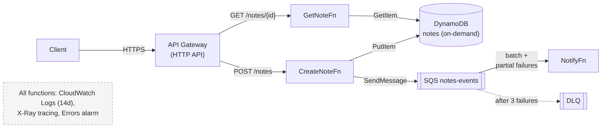

# 📚 Day 28 — Module 4 Revision + Mini Project: Serverless Notes API

> 📊 **Visual Summary** — সহজে বোঝার জন্য diagram:



**সময়:** ২ ঘণ্টা | **Module:** ৪ (Serverless & Lambda Fundamentals) — Day 7 (শেষ দিন)

## 🎯 আজকের লক্ষ্য
- পুরো Module 4 এক নজরে revision
- Mini project: **API Gateway + Lambda + DynamoDB + SQS** দিয়ে একটা serverless API, SAM দিয়ে deploy
- Production checklist
- Final quiz (exam-ধাঁচের প্রশ্ন সহ)

---

# 🔁 Module 4 Revision

## 🗺 পুরো Module এক নজরে

| Day | বিষয় | এক লাইনে মনে রাখুন |
|---|---|---|
| 22 | Lambda basics | Init → Invoke → Shutdown; client handler-এর বাইরে; timeout default ৩ s, max ১৫ মিনিট |
| 23 | Packages, Layers, Versions, Aliases | zip ২৫০ MB / image ১০ GB; layer `/opt`-এ; trigger-এ alias; rollback = alias সরানো |
| 24 | Invocation ও API Gateway | Sync (retry নেই) / Async (২ retry → DLQ) / Poll; HTTP API সস্তা; body string; ২৯ s |
| 25 | Event triggers | S3 loop সাবধান; SQS: visibility ≥ ৬× timeout + partial batch; Stream: bisect + age limit; EventBridge Scheduler |
| 26 | Permissions ও Security | Resource policy = কে call করবে; Execution role = কী করবে; VPC শুধু private resource-এর জন্য; secret → Secrets Manager |
| 27 | Monitoring ও Performance | Errors/Throttles/p99 alarm; X-Ray; Reserved (সীমা, free) বনাম Provisioned (cold start নেই, paid); Power Tuning |

## 🧠 EC2 (Module 3) বনাম Lambda (Module 4) — কখন কোনটা?

| প্রশ্ন | EC2 | Lambda |
|---|---|---|
| কাজ ১৫ মিনিটের বেশি? | ✅ | ❌ |
| Traffic অনিয়মিত, মাঝে শূন্য? | ❌ (idle-এ খরচ) | ✅ |
| সারাক্ষণ উচ্চ, স্থির traffic? | ✅ (প্রায়ই সস্তা) | ⚠️ হিসাব করে দেখুন |
| OS/special software control? | ✅ | ❌ |
| Ops টিম ছোট, দ্রুত ship? | ❌ | ✅ |
| Event-driven (file, queue, schedule)? | সম্ভব কিন্তু বেশি কাজ | ✅ স্বাভাবিক পছন্দ |

---

# 🛠 Mini Project: Serverless Notes API

## Requirement
- `POST /notes`: নতুন note তৈরি (DynamoDB-তে save)
- `GET /notes/{id}`: note পড়া
- Note তৈরি হলে background-এ একটা "notification" কাজ চলবে (SQS → আরেকটা Lambda), API-কে দেরি না করিয়ে
- সব IaC (SAM) দিয়ে, least privilege, log retention, alarm

## Architecture
```
Client ──HTTPS──► API Gateway (HTTP API)
                     ├── POST /notes     ──► CreateNoteFn ──► DynamoDB (notes)
                     │                             └────────► SQS (notes-events) ──► NotifyFn
                     │                                              └─ DLQ
                     └── GET /notes/{id} ──► GetNoteFn   ──► DynamoDB (notes)
```

## Folder structure
```
serverless-notes/
├── template.yaml
└── src/
    ├── create_note.py
    ├── get_note.py
    └── notify.py
```

## `template.yaml` (AWS SAM)
```yaml
AWSTemplateFormatVersion: "2010-09-09"
Transform: AWS::Serverless-2016-10-31
Description: Serverless Notes API (Module 4 project)

Globals:
  Function:
    Runtime: python3.13
    Architectures: [arm64]
    Timeout: 10
    MemorySize: 256
    Tracing: Active
    LoggingConfig:
      LogFormat: JSON
    Environment:
      Variables:
        TABLE_NAME: !Ref NotesTable

Resources:
  NotesTable:
    Type: AWS::DynamoDB::Table
    Properties:
      BillingMode: PAY_PER_REQUEST
      AttributeDefinitions:
        - { AttributeName: id, AttributeType: S }
      KeySchema:
        - { AttributeName: id, KeyType: HASH }

  NotesDLQ:
    Type: AWS::SQS::Queue

  NotesQueue:
    Type: AWS::SQS::Queue
    Properties:
      VisibilityTimeout: 60              # ≥ 6 × NotifyFn timeout (10 s)
      RedrivePolicy:
        deadLetterTargetArn: !GetAtt NotesDLQ.Arn
        maxReceiveCount: 3

  CreateNoteFn:
    Type: AWS::Serverless::Function
    Properties:
      CodeUri: src/
      Handler: create_note.handler
      AutoPublishAlias: live
      Environment:
        Variables:
          QUEUE_URL: !Ref NotesQueue
      Policies:
        - DynamoDBWritePolicy: { TableName: !Ref NotesTable }
        - SQSSendMessagePolicy: { QueueName: !GetAtt NotesQueue.QueueName }
      Events:
        Create:
          Type: HttpApi
          Properties:
            Path: /notes
            Method: POST

  GetNoteFn:
    Type: AWS::Serverless::Function
    Properties:
      CodeUri: src/
      Handler: get_note.handler
      AutoPublishAlias: live
      Policies:
        - DynamoDBReadPolicy: { TableName: !Ref NotesTable }
      Events:
        Get:
          Type: HttpApi
          Properties:
            Path: /notes/{id}
            Method: GET

  NotifyFn:
    Type: AWS::Serverless::Function
    Properties:
      CodeUri: src/
      Handler: notify.handler
      Events:
        FromQueue:
          Type: SQS
          Properties:
            Queue: !GetAtt NotesQueue.Arn
            BatchSize: 10
            FunctionResponseTypes: [ReportBatchItemFailures]

  CreateNoteLogs:
    Type: AWS::Logs::LogGroup
    Properties:
      LogGroupName: !Sub /aws/lambda/${CreateNoteFn}
      RetentionInDays: 14

  CreateNoteErrorsAlarm:
    Type: AWS::CloudWatch::Alarm
    Properties:
      Namespace: AWS/Lambda
      MetricName: Errors
      Dimensions: [{ Name: FunctionName, Value: !Ref CreateNoteFn }]
      Statistic: Sum
      Period: 300
      EvaluationPeriods: 1
      Threshold: 1
      ComparisonOperator: GreaterThanOrEqualToThreshold
      TreatMissingData: notBreaching

Outputs:
  ApiUrl:
    Value: !Sub https://${ServerlessHttpApi}.execute-api.${AWS::Region}.amazonaws.com
```
> বাকি দুটো function-এর log group আর DLQ-র alarm একইভাবে যোগ করুন (অনুশীলন)।

## `src/create_note.py`
```python
import json, os, uuid, time, boto3

ddb = boto3.resource("dynamodb").Table(os.environ["TABLE_NAME"])
sqs = boto3.client("sqs")
QUEUE_URL = os.environ["QUEUE_URL"]

def handler(event, context):
    try:
        body = json.loads(event.get("body") or "{}")
    except json.JSONDecodeError:
        return _resp(400, {"error": "invalid JSON"})

    text = (body.get("text") or "").strip()
    if not text or len(text) > 2000:
        return _resp(400, {"error": "text is required (max 2000 chars)"})

    note = {"id": str(uuid.uuid4()), "text": text, "createdAt": int(time.time())}
    ddb.put_item(Item=note)
    sqs.send_message(QueueUrl=QUEUE_URL, MessageBody=json.dumps({"noteId": note["id"]}))
    return _resp(201, note)

def _resp(code, data):
    return {"statusCode": code,
            "headers": {"Content-Type": "application/json"},
            "body": json.dumps(data)}
```

## `src/get_note.py`
```python
import json, os, boto3

ddb = boto3.resource("dynamodb").Table(os.environ["TABLE_NAME"])

def handler(event, context):
    note_id = event["pathParameters"]["id"]
    item = ddb.get_item(Key={"id": note_id}).get("Item")
    if not item:
        return {"statusCode": 404, "body": json.dumps({"error": "not found"})}
    item["createdAt"] = int(item["createdAt"])     # DynamoDB Decimal → int
    return {"statusCode": 200,
            "headers": {"Content-Type": "application/json"},
            "body": json.dumps(item)}
```

## `src/notify.py`
```python
import json

def handler(event, context):
    failures = []
    for msg in event["Records"]:
        try:
            data = json.loads(msg["body"])
            print(json.dumps({"level": "INFO", "msg": "notify", "noteId": data["noteId"]}))
            # এখানে SES/SNS দিয়ে আসল notification পাঠানো যায়
        except Exception as e:
            print(json.dumps({"level": "ERROR", "msg": str(e), "messageId": msg["messageId"]}))
            failures.append({"itemIdentifier": msg["messageId"]})
    return {"batchItemFailures": failures}
```

## Deploy ও Test
```bash
sam build
sam deploy --guided            # stack name, region, "Allow SAM CLI IAM role creation" = Y

API=https://xxxx.execute-api.ap-south-1.amazonaws.com
curl -s -X POST $API/notes -d '{"text":"AWS শিখছি"}'
# {"id": "3f2a...", "text": "AWS শিখছি", "createdAt": 1790000000}

curl -s $API/notes/3f2a...
curl -s -X POST $API/notes -d 'not-json'       # 400
sam logs -n NotifyFn --stack-name serverless-notes --tail
```

## যাচাই করুন ✅
- [ ] POST → 201, GET → 200, অজানা id → 404, ভাঙা JSON → 400
- [ ] NotifyFn-এর log-এ `noteId` দেখা যাচ্ছে
- [ ] X-Ray service map-এ API → Lambda → DynamoDB/SQS দেখা যাচ্ছে
- [ ] CreateNoteFn-এর role-এ শুধু `PutItem` (আর আনুষঙ্গিক) আর `SendMessage`, আর কিছু না
- [ ] Log group retention ১৪ দিন

## 🚀 Extension (নিজে চেষ্টা করুন)
1. **Cognito/JWT authorizer** দিয়ে শুধু login করা user note বানাতে পারবে (Day 24)
2. `DELETE /notes/{id}` আর `GET /notes` (DynamoDB Query/Scan, pagination)
3. Note তৈরির পর DynamoDB Streams → Lambda দিয়ে search index (Day 25)
4. `DeploymentPreference: Canary10Percent5Minutes` + alarm = safe deploy (Day 23)
5. Power Tuning দিয়ে CreateNoteFn-এর memory ঠিক করা (Day 27)
6. `sam delete` দিয়ে সব পরিষ্কার করা (খরচ এড়াতে!)

---

## ✅ Production Checklist — Serverless App

- [ ] সব কিছু IaC-তে (SAM/CDK/Terraform), console-এ হাতে বদলানো কিছু নেই
- [ ] প্রতিটা function-এর নিজস্ব least-privilege role
- [ ] Trigger-এ alias; deploy-এ canary + auto rollback
- [ ] Timeout জেনেশুনে set (API-র জন্য ২৯ s-এর নিচে)
- [ ] Secret Secrets Manager/Parameter Store-এ, env var-এ না
- [ ] Async/poll trigger-এ DLQ বা on-failure destination, আর idempotency
- [ ] SQS: visibility timeout ≥ ৬× Lambda timeout, `ReportBatchItemFailures`
- [ ] Log retention, JSON log, X-Ray
- [ ] Alarm: Errors, Throttles, Duration p99, DLQ depth, IteratorAge
- [ ] Critical function-এ reserved concurrency; spike-প্রবণ function-এ সীমা
- [ ] Memory Power Tuning দিয়ে মাপা; arm64
- [ ] API-তে auth + throttling; public Function URL নেই (বা সীমিত)

---

## 📝 Module 4 Final Quiz

1. Lambda-র সর্বোচ্চ timeout আর সর্বোচ্চ memory কত?
2. Cold start কমানোর তিনটা উপায় বলুন।
3. S3 → Lambda ব্যর্থ হলে কী হয়? SQS → Lambda ব্যর্থ হলে কী হয়?
4. API Gateway দিয়ে ৪৫ সেকেন্ডের কাজ চালালে user কী পাবে? সমাধান কী?
5. Lambda-কে RDS-এ connect করতে কী কী লাগে? (তিনটা)
6. Reserved আর Provisioned concurrency-র পার্থক্য কী?
7. নতুন version-এ error বাড়লে কীভাবে কয়েক সেকেন্ডে rollback করবেন?

### 🎓 Exam-ধাঁচের প্রশ্ন

**Q8.** A company processes uploaded images with Lambda. Occasionally a burst of uploads causes the function to consume all account concurrency, and a critical payment API (also Lambda) starts returning throttling errors. What is the MOST effective solution?
- A. Increase the payment function's memory.
- B. Configure reserved concurrency for the payment function (and cap the image function).
- C. Enable Provisioned Concurrency on the image function.
- D. Move the image function into a VPC.

**Q9.** A Lambda function in a private subnet must read objects from S3 and call a third-party payment API on the internet. Which combination is required? **(Select TWO)**
- A. An S3 Gateway VPC endpoint
- B. A NAT gateway in a public subnet with a route from the private subnet
- C. Assign a public IP to the Lambda function
- D. An internet gateway route in the private subnet
- E. Place the function in a public subnet

**Q10.** An SQS-triggered Lambda sometimes fails on one message in a batch of 10, causing all 10 to be reprocessed and duplicate emails to be sent. What should be done? **(Select TWO)**
- A. Enable `ReportBatchItemFailures` and return failed message IDs.
- B. Make the processing idempotent.
- C. Decrease the visibility timeout to 1 second.
- D. Switch to SNS.
- E. Increase the batch size to 100.

<details><summary>▶ উত্তর দেখুন</summary>

1. ৯০০ সেকেন্ড (১৫ মিনিট); ১০,২৪০ MB (১০ GB)।
2. ছোট package/lazy import, বেশি memory, Provisioned Concurrency, SnapStart, হালকা runtime (যেকোনো ৩টা)।
3. S3 (async): Lambda ২ বার retry, তারপর DLQ/on-failure destination। SQS (poll): message visibility timeout শেষে আবার আসে, `maxReceiveCount` পার হলে queue-র DLQ-তে।
4. ২৯ s-এ `504`/timeout। Async pattern: request নিয়ে SQS/Step Functions, `202` + job ID, পরে status endpoint।
5. VPC config (private subnet + SG), `AWSLambdaVPCAccessExecutionRole`, RDS-এর SG-তে Lambda SG থেকে port allow; (ভালো অভ্যাস: RDS Proxy + Secrets Manager)।
6. Reserved = capacity সংরক্ষণ + সর্বোচ্চ সীমা, free, cold start কমায় না; Provisioned = আগে থেকে warm environment, cold start নেই, paid, alias/version-এ।
7. Alias-কে আগের version-এ `update-alias` (বা CodeDeploy auto rollback)।
8. **B**: reserved concurrency payment-এর জন্য capacity নিশ্চিত করে, আর image function-এ সীমা দিলে সে সব খেয়ে ফেলতে পারে না।
9. **A, B**: S3-এর জন্য Gateway endpoint (বা NAT), internet-এর জন্য NAT। VPC Lambda public IP পায় না, public subnet-এ দিলেও internet পাবে না।
10. **A, B**: শুধু ব্যর্থ message আবার আসবে, আর idempotency থাকলে duplicate হলেও ক্ষতি নেই।
</details>

---

## 💡 Pro Tips

- Project শেষে **`sam delete`** করুন। DynamoDB on-demand, SQS আর Lambda idle-এ প্রায় free, কিন্তু অভ্যাস ভালো
- `sam sync --watch` দিয়ে development-এ code বদলালেই দ্রুত cloud-এ update হয়
- Local test: `sam local start-api` (Docker লাগে)
- Module 5-এ এই project-কে বড় করব: Step Functions, EventBridge, SNS fan-out দিয়ে event-driven architecture

---

## 🚨 বাস্তব পরিস্থিতি (যেসব ভুল প্রায়ই হয়)

**পরিস্থিতি ১:** Tutorial শেষে resource মুছে ফেলা হয়নি। একটা public API-তে bot request পাঠাতে থাকল, মাস শেষে অপ্রত্যাশিত bill।
**শিক্ষা:** `sam delete`, Budgets alert, আর public API-তে throttling।

**পরিস্থিতি ২:** POST API-র ভেতরেই email পাঠানো হতো। Email service ধীর হলে API-ও ধীর হয়ে timeout দিত।
**শিক্ষা:** ধীর বা ঝুঁকিপূর্ণ কাজ SQS দিয়ে background-এ (এই project-এর NotifyFn-এর মতো)।

---

**⏮ আগের দিন:** [Day 27 — Monitoring ও Performance](./Day-27-Monitoring-Performance-Concurrency.md) | **⏭ পরের module:** Module 5 — Event-Driven Architectures with Lambda (আসছে)
