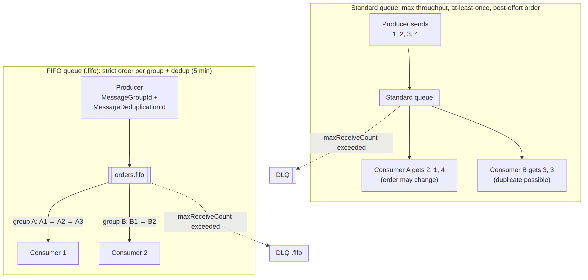

# 📚 Day 29 — SQS গভীরে: Standard বনাম FIFO, Visibility, Long Polling ও DLQ

> 📊 **Visual Summary** — সহজে বোঝার জন্য diagram:



**সময়:** ১.৫ ঘণ্টা | **Module:** ৫ (Event-Driven Architectures with Lambda) — Day 1

## 🎯 আজকের লক্ষ্য
- Event-driven architecture কী, আর কেন "loosely coupled" হওয়া দরকার
- SQS message-এর পুরো জীবনচক্র (send → receive → process → delete)
- Visibility timeout, message retention, delay queue
- Short polling বনাম **long polling**
- **Standard বনাম FIFO**: ordering, duplicate, message group, deduplication
- **DLQ** আর redrive
- SQS-এর সীমা আর খরচ

---

## Part 1: Event-Driven Architecture কী?

### 🔗 Tightly coupled (সমস্যা)
```
Order Service ──(সরাসরি HTTP call)──► Payment Service ──► Email Service
```
- Payment service ধীর হলে order service-ও ধীর
- Email service down হলে পুরো order fail
- নতুন service যোগ করতে order service-এর code বদলাতে হয়

### 🔓 Loosely coupled (event-driven)
```
Order Service ──"OrderPlaced" event──► [Queue / Topic / Event Bus] ──► Payment
                                                                   ──► Email
                                                                   ──► Analytics
```
- Producer জানে না কে consume করবে; শুধু event পাঠায়
- Consumer নিজের গতিতে কাজ করে, down থাকলেও event হারায় না
- নতুন consumer যোগ করতে producer-কে বদলাতে হয় না

| ধারণা | মানে |
|---|---|
| **Event** | "কিছু ঘটেছে" (অতীত কাল): `OrderPlaced`, `PaymentFailed` |
| **Command** | "কিছু করো": `ChargeCard` |
| **Producer** | Event পাঠায় |
| **Consumer** | Event পড়ে কাজ করে |
| **Broker** | মাঝখানের service: SQS, SNS, EventBridge, Kinesis |

### AWS-এর তিনটা মূল broker (এই module-এর মেরুদণ্ড)

| | SQS | SNS | EventBridge |
|---|---|---|---|
| ধরন | Queue (pull) | Pub/Sub (push) | Event bus (rule-based routing) |
| একটা message কতজন পায় | **একজন** consumer | **সব** subscriber | যতগুলো rule মেলে |
| Message রাখে? | হ্যাঁ, ১৪ দিন পর্যন্ত | না | না (archive করা যায়) |
| সবচেয়ে ভালো কাজ | Buffer, decoupling, load leveling | Fan-out, notification | Routing, AWS/SaaS event |

আজ **SQS**, কাল SNS, পরশু EventBridge।

---

## Part 2: SQS Message-এর জীবনচক্র

```
1. Producer ──SendMessage──► Queue
2. Consumer ──ReceiveMessage──► message পায় (সাথে ReceiptHandle)
   → message এখন "in flight": অন্যদের কাছে অদৃশ্য (visibility timeout)
3. Consumer কাজ শেষ করে ──DeleteMessage(ReceiptHandle)──► queue থেকে মুছে যায় ✅
   যদি delete না করে (crash/error) → visibility timeout শেষে message আবার দৃশ্যমান → অন্য কেউ আবার নেয় 🔁
```

```python
import boto3, json
sqs = boto3.client("sqs")
URL = "https://sqs.ap-south-1.amazonaws.com/111122223333/orders"

# Producer
sqs.send_message(QueueUrl=URL, MessageBody=json.dumps({"orderId": 101}))

# Consumer
resp = sqs.receive_message(QueueUrl=URL, MaxNumberOfMessages=10, WaitTimeSeconds=20)
for m in resp.get("Messages", []):
    process(json.loads(m["Body"]))
    sqs.delete_message(QueueUrl=URL, ReceiptHandle=m["ReceiptHandle"])   # ভুলবেন না!
```
> Lambda trigger (Day 25) হলে receive আর delete Lambda নিজেই করে। সফলভাবে return করলে delete, error হলে message আবার আসে।

---

## Part 3: গুরুত্বপূর্ণ Queue Setting

| Setting | Default | Range | মানে |
|---|---|---|---|
| **Visibility timeout** | 30 s | 0 s – 12 ঘণ্টা | Receive-এর পর কতক্ষণ অন্যদের কাছে লুকানো |
| **Message retention** | 4 দিন | 1 মিনিট – **14 দিন** | Delete না হলে কতদিন থাকবে |
| **Delivery delay** (delay queue) | 0 | 0 – **15 মিনিট** | নতুন message কতক্ষণ পরে দৃশ্যমান হবে |
| **Receive wait time** (long polling) | 0 | 0 – **20 s** | Message না থাকলে কতক্ষণ অপেক্ষা |
| **Maximum message size** | — | **1 MiB** পর্যন্ত (২০২৫-এর আগে 256 KB ছিল) | বড় payload → S3-এ রেখে শুধু reference পাঠান (Extended Client Library) |
| Receive-এ সর্বোচ্চ message | — | **10** | এক call-এ |

### ⏱ Visibility timeout ঠিক রাখা
- খুব কম → কাজ শেষ হওয়ার আগেই message আবার দৃশ্যমান → **duplicate processing**
- খুব বেশি → consumer crash করলে message অনেকক্ষণ আটকে থাকে
- লম্বা কাজে মাঝপথে বাড়ান: `ChangeMessageVisibility` (heartbeat)
- Lambda trigger হলে: **visibility timeout ≥ ৬ × Lambda timeout**

### 🐢 Delay queue বনাম message timer
- **Delay queue**: পুরো queue-এর সব message দেরিতে দৃশ্যমান
- **Message timer** (`DelaySeconds` per message): নির্দিষ্ট message দেরিতে (Standard queue-তে)
- ব্যবহার: "order দেওয়ার ১০ মিনিট পর payment চেক করো"

---

## Part 4: Short Polling বনাম Long Polling

| | Short polling (`WaitTimeSeconds=0`) | **Long polling** (`WaitTimeSeconds=1–20`) |
|---|---|---|
| Message না থাকলে | সাথে সাথে খালি উত্তর | ২০ সেকেন্ড পর্যন্ত অপেক্ষা করে, message এলেই ফেরত দেয় |
| খালি response | অনেক বেশি | অনেক কম |
| খরচ | বেশি (প্রতিটা call-এর টাকা) | **কম** |
| Latency | — | Message এলে সাথে সাথে পায় |
| কোন server poll করে | কিছু server-এর sample | সব server |

👉 প্রায় সবসময় **long polling** (queue-এর `ReceiveMessageWaitTimeSeconds = 20`)। Lambda trigger নিজেই long polling ব্যবহার করে।

---

## Part 5: Standard বনাম FIFO Queue

| | **Standard** | **FIFO** |
|---|---|---|
| Throughput | প্রায় **unlimited** | প্রতি API action-এ 300 msg/s (batch করলে 3,000); **high throughput mode**-এ অনেক বেশি |
| Ordering | **Best-effort** (ক্রম বদলে যেতে পারে) | **Strict**, প্রতিটা **Message Group ID**-এর মধ্যে |
| Delivery | **At-least-once** (কখনো duplicate) | **Exactly-once processing** (৫ মিনিটের dedup window) |
| নাম | যেকোনো | অবশ্যই `.fifo` দিয়ে শেষ |
| Per-message delay | ✅ | ❌ (শুধু queue-level delay) |
| খরচ | কম | একটু বেশি |

### 🧩 Message Group ID: FIFO-র আসল শক্তি
Ordering **পুরো queue-তে না, প্রতিটা group-এর ভেতরে**।

```
Group "customer-A": A1 → A2 → A3   (এই ক্রমেই process হবে)
Group "customer-B": B1 → B2        (A-র সাথে parallel-এ চলতে পারে)
```
- এক group-এর message একসময়ে **একজন consumer**-ই পায় (আগেরটা delete না হওয়া পর্যন্ত পরেরটা আটকে থাকে)
- তাই **বেশি group = বেশি parallelism**। সব message একই group ID দিলে FIFO আসলে single-threaded হয়ে যায়!
- ভালো group ID: `customerId`, `orderId`, `accountId`

### 🔁 Deduplication
৫ মিনিটের মধ্যে একই dedup ID-র message আবার এলে SQS সেটা বাদ দেয়:
- **`MessageDeduplicationId`** নিজে দিন (যেমন order ID), অথবা
- Queue-তে **content-based deduplication** চালু করুন (body-র SHA-256 hash)

```python
sqs.send_message(
    QueueUrl=FIFO_URL,
    MessageBody=json.dumps({"accountId": "A1", "amount": 500}),
    MessageGroupId="A1",
    MessageDeduplicationId="txn-98765",
)
```

### কখন কোনটা?
- **Standard**: order জরুরি না, বিশাল volume (image processing, log, email, analytics)। Consumer idempotent রাখুন।
- **FIFO**: ক্রম আর duplicate-মুক্ত হওয়া জরুরি (bank transaction, inventory update, order status পরিবর্তন, chat message)।

---

## Part 6: Dead-Letter Queue (DLQ) ও Redrive

কোনো message বারবার fail করলে (ভাঙা JSON, bug, "poison message") সেটা queue-তে ঘুরতেই থাকে, খরচ বাড়ায় আর অন্য message-কে দেরি করায়।

**সমাধান: Redrive policy + DLQ**
```bash
aws sqs create-queue --queue-name orders-dlq
aws sqs set-queue-attributes --queue-url $ORDERS_URL --attributes '{
  "RedrivePolicy": "{\"deadLetterTargetArn\":\"arn:aws:sqs:ap-south-1:111122223333:orders-dlq\",\"maxReceiveCount\":\"5\"}"
}'
```
- `maxReceiveCount` = কতবার receive হওয়ার পর DLQ-তে যাবে (সাধারণত ৩–৫)
- DLQ-র ধরন source-এর মতো হতে হবে: **FIFO queue-এর DLQ-ও FIFO**
- **DLQ-র retention মূল queue-এর চেয়ে বেশি রাখুন** (Standard queue-তে message-এর বয়স মূল enqueue সময় থেকে ধরা হয়, তাই DLQ-তে গিয়ে তাড়াতাড়ি মুছে যেতে পারে)

### 🔧 DLQ-তে message এলে কী করবেন
1. **Alarm**: DLQ-র `ApproximateNumberOfMessagesVisible > 0` হলে SNS alert
2. Message পড়ে কারণ খুঁজুন (log, bug)
3. Bug ঠিক করুন
4. **Redrive**: console-এ "Start DLQ redrive" বা CLI দিয়ে message মূল queue-তে ফেরত পাঠান
```bash
aws sqs start-message-move-task --source-arn arn:aws:sqs:ap-south-1:111122223333:orders-dlq
```

---

## Part 7: গুরুত্বপূর্ণ Metrics

| Metric | মানে | Alarm |
|---|---|---|
| `ApproximateNumberOfMessagesVisible` | Queue-তে অপেক্ষমাণ (backlog) | অস্বাভাবিকভাবে বাড়লে consumer পিছিয়ে পড়েছে |
| **`ApproximateAgeOfOldestMessage`** | সবচেয়ে পুরনো message কত সেকেন্ড অপেক্ষা করছে | **সবচেয়ে ভালো "consumer আটকে গেছে" সংকেত** |
| `ApproximateNumberOfMessagesNotVisible` | In-flight (process হচ্ছে) | — |
| `NumberOfMessagesSent` / `Deleted` | Throughput | — |
| DLQ-র `ApproximateNumberOfMessagesVisible` | ব্যর্থ message | > 0 |

> 💡 Queue backlog দেখে EC2/ECS consumer scale করা যায়: metric = **backlog per instance** (visible messages ÷ running tasks)। Lambda trigger-এ Lambda নিজেই scale করে।

---

## Part 8: Security ও খরচ

### Security
- **Encryption at rest**: SSE-SQS (default) বা SSE-KMS (নিজের key)
- **In transit**: HTTPS; policy-তে `aws:SecureTransport` enforce
- **Queue access policy** (resource-based): অন্য account বা SNS/S3-কে send করার অনুমতি (`aws:SourceArn` condition সহ)
- Private subnet থেকে: **Interface VPC endpoint**

### খরচ
- প্রতি ১০ লাখ **request**-এ দাম (প্রথম ১০ লাখ/মাস free)। FIFO-র দাম একটু বেশি
- ১টা request = সর্বোচ্চ ৬৪ KB-এর অংশ; বড় message একাধিক request ধরা হয়
- **Batch** (`SendMessageBatch`, `DeleteMessageBatch`, receive-এ ১০টা) = কম request, কম খরচ
- Long polling = কম খালি request

---

## Part 9: Hands-on Lab

1. Standard queue `lab-orders` + DLQ `lab-orders-dlq` (maxReceiveCount = 2), receive wait time = 20 s
2. CLI দিয়ে ৫টা message পাঠান, তারপর receive করে **delete না করে** ৩০ সেকেন্ড অপেক্ষা করুন, আবার receive করুন। একই message আবার আসছে কিনা দেখুন (visibility timeout)
3. একটা message ২ বারের বেশি receive করুন (delete ছাড়া) → DLQ-তে গেছে কিনা দেখুন
4. FIFO queue `lab-txn.fifo` (content-based dedup চালু):
   - একই body দুবার পাঠান → একটাই থাকবে
   - Group `A` আর `B`-তে message পাঠিয়ে receive করে ক্রম দেখুন
5. Console-এ DLQ redrive চালিয়ে message মূল queue-তে ফেরত পাঠান
6. CloudWatch-এ `ApproximateAgeOfOldestMessage` দেখুন

---

## 🎯 আজকের মূল Takeaways

1. Event-driven = producer আর consumer আলাদা; broker মাঝখানে
2. SQS জীবনচক্র: send → receive (লুকায়) → **delete**; delete না হলে আবার আসে
3. Visibility timeout কাজের সময়ের চেয়ে বেশি; retention সর্বোচ্চ ১৪ দিন; delay সর্বোচ্চ ১৫ মিনিট
4. **Long polling** (২০ s) = কম খরচ, কম খালি response
5. **Standard** = অসীম throughput, at-least-once, best-effort order → consumer idempotent
6. **FIFO** = group-এর ভেতরে strict order + ৫ মিনিটের dedup; বেশি group = বেশি parallelism
7. **DLQ** + alarm + redrive; FIFO-র DLQ-ও FIFO
8. `ApproximateAgeOfOldestMessage` = সেরা health metric

---

## 📝 Self-check Questions

1. Consumer message receive করে process করল কিন্তু delete করল না। কী হবে?
2. Long polling কেন খরচ কমায়?
3. FIFO queue-তে সব message একই `MessageGroupId` দিলে কী সমস্যা?
4. ৫ মিনিটের মধ্যে একই order দুবার পাঠানো হলে FIFO কীভাবে duplicate আটকায়?
5. Standard queue-তে ক্রম আর duplicate নিয়ে কী নিশ্চয়তা আছে?
6. DLQ-র retention মূল queue-এর চেয়ে বেশি রাখা উচিত কেন?
7. Consumer আটকে গেছে কিনা বোঝার সবচেয়ে ভালো metric কোনটা?

<details><summary>▶ উত্তর দেখুন</summary>

1. Visibility timeout শেষে message আবার দৃশ্যমান হবে, আর আবার process হবে (duplicate)।
2. Message না থাকলে সাথে সাথে খালি উত্তর না দিয়ে অপেক্ষা করে, তাই খালি (billable) request অনেক কমে।
3. সব message একটা group-এ পড়ে, তাই একসাথে একটাই process হয়। কোনো parallelism থাকে না।
4. `MessageDeduplicationId` (বা content-based dedup) দিয়ে; ৫ মিনিটের মধ্যে একই ID এলে বাদ দেয়।
5. কোনো ক্রমের নিশ্চয়তা নেই (best-effort), আর at-least-once, তাই duplicate হতে পারে।
6. Standard queue-তে message-এর বয়স মূল enqueue থেকে গোনা হয়; DLQ-র retention কম হলে সেখানে যাওয়ার পরপরই মুছে যেতে পারে।
7. `ApproximateAgeOfOldestMessage`।
</details>

---

## 💡 Pro Tips

- Message-এ শুধু দরকারি তথ্য বা ID রাখুন; বড় data S3/DynamoDB-তে
- Consumer সবসময় **idempotent** (Day 34-এ বিস্তারিত)
- Batch API ব্যবহার করুন: খরচ কমে, throughput বাড়ে
- Queue আর DLQ দুটোই IaC-তে, একসাথে
- "Temporary queue" দিয়ে request/response pattern (Day 34-এ async request/response)

---

## 🎨 Quick Reference

```
Visibility timeout: default 30 s, max 12 h   | Retention: 1 min – 14 days (default 4)
Delay: 0 – 15 min                             | Long polling: WaitTimeSeconds up to 20
Max message: 1 MiB (was 256 KB)               | Receive batch: max 10
Standard: unlimited TPS, at-least-once, best-effort order
FIFO: .fifo, MessageGroupId (order), MessageDeduplicationId (5-min window), 300/3,000 TPS (more with high throughput)
DLQ: RedrivePolicy {deadLetterTargetArn, maxReceiveCount}; FIFO → FIFO DLQ
```

---

## 🚨 বাস্তব পরিস্থিতি (যেসব ভুল প্রায়ই হয়)

**পরিস্থিতি ১:** Consumer-এর কাজে ২ মিনিট লাগত, কিন্তু visibility timeout ছিল ৩০ সেকেন্ড। প্রতিটা order ৪–৫ বার process হলো।
**শিক্ষা:** Visibility timeout কাজের সর্বোচ্চ সময়ের চেয়ে বেশি রাখুন।

**পরিস্থিতি ২:** FIFO queue-তে সব message-এর group ID ছিল `"default"`। Traffic বাড়তেই queue-তে হাজারো message জমে গেল, কারণ একসাথে একটাই process হচ্ছিল।
**শিক্ষা:** Group ID এমনভাবে দিন যাতে অনেকগুলো আলাদা group হয় (যেমন customerId)।

**পরিস্থিতি ৩:** DLQ ছিল না। একটা ভাঙা message ১৪ দিন ধরে বারবার fail করল, আর log-এ হাজারো error।
**শিক্ষা:** প্রতিটা queue-র সাথে DLQ + alarm।

---

**⏮ আগের module:** [Day 28 — Module 4 Revision](../05-Module-4-Serverless-and-Lambda/Day-28-Module-4-Revision-Serverless-API-Project.md) | **⏭ পরের দিন:** [Day 30 — SNS ও Fan-out Pattern](./Day-30-SNS-Fan-out-Pattern.md)
