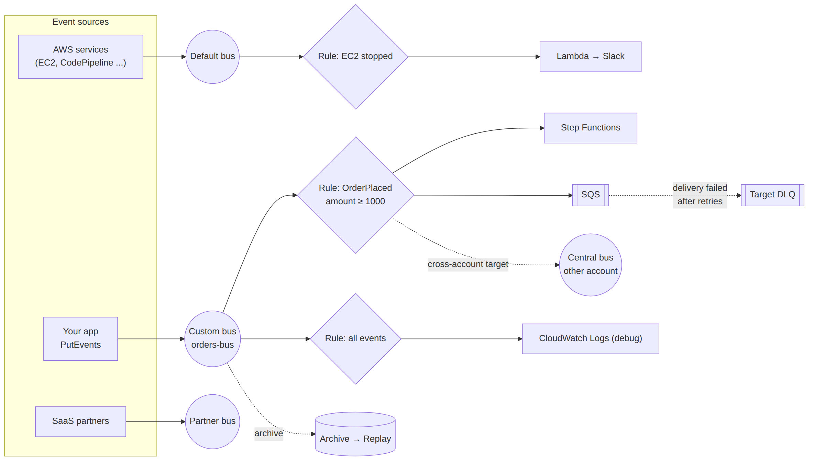

# 📚 Day 31 — EventBridge গভীরে: Event Bus, Rules, Patterns, Targets ও Cross-account

> 📊 **Visual Summary** — সহজে বোঝার জন্য diagram:



**সময়:** ১.৫ ঘণ্টা | **Module:** ৫ (Event-Driven Architectures with Lambda) — Day 3

## 🎯 আজকের লক্ষ্য
- Event-এর গঠন (envelope)
- Default, custom আর partner event bus
- Rule আর event pattern: সব ধরনের matching
- Target, input transformer, retry আর DLQ
- Scheduled event (Scheduler)
- **Cross-account** event
- Archive & replay, schema registry, Pipes

---

## Part 1: Event-এর গঠন

EventBridge-এর প্রতিটা event একই "envelope"-এ আসে:

```json
{
  "version": "0",
  "id": "6a7e8feb-b491-4cf7-a9f1-bf3703467718",
  "detail-type": "OrderPlaced",
  "source": "myapp.orders",
  "account": "111122223333",
  "time": "2026-09-28T10:00:00Z",
  "region": "ap-south-1",
  "resources": [],
  "detail": {
    "orderId": "101",
    "amount": 1500,
    "customer": { "id": "C9", "tier": "gold", "country": "BD" }
  }
}
```

| Field | কে দেয় | মানে |
|---|---|---|
| `source` | আপনি / AWS | Event কোথা থেকে (`aws.ec2`, `myapp.orders`) |
| `detail-type` | আপনি / AWS | কী ঘটেছে (`OrderPlaced`) |
| `detail` | আপনি / AWS | আসল data (JSON) |
| `id`, `time`, `account`, `region` | EventBridge | Metadata |

> 💡 নিজের event-এ `source` দিন reverse-domain ধাঁচে (`com.mycompany.orders` বা `myapp.orders`)। `aws.` দিয়ে শুরু করা যায় না।

---

## Part 2: Event Bus-এর ধরন

| Bus | কী আসে | কখন |
|---|---|---|
| **Default bus** | **AWS service event** নিজে থেকেই (EC2 state change, S3 (চালু করলে), CodePipeline, Health...) | AWS event-এ সাড়া দিতে; নিজের event-ও পাঠানো যায় |
| **Custom bus** | আপনার app-এর event | App event আলাদা রাখতে, আলাদা permission ও archive |
| **Partner bus** | SaaS event (Shopify, Zendesk, Datadog, Auth0...) | SaaS integration, কোনো code ছাড়া |

```bash
aws events create-event-bus --name orders-bus
```

```python
import json, boto3
events = boto3.client("events")
events.put_events(Entries=[{
    "EventBusName": "orders-bus",
    "Source": "myapp.orders",
    "DetailType": "OrderPlaced",
    "Detail": json.dumps({"orderId": "101", "amount": 1500,
                          "customer": {"tier": "gold", "country": "BD"}})
}])
```
> ⚠️ `put_events` আংশিক ব্যর্থ হতে পারে। Response-এর `FailedEntryCount` দেখে ব্যর্থ entry আবার পাঠান।

---

## Part 3: Rule ও Event Pattern

**Rule** = "যদি event এই pattern-এর সাথে মেলে, তাহলে এই target-গুলোতে পাঠাও।"

### মূল নিয়ম
- Pattern-এ যে field দেবেন শুধু সেগুলো মেলানো হয়; বাকি field যা খুশি হতে পারে
- মান সবসময় **array**-তে: `"source": ["myapp.orders"]`
- একই field-এ একাধিক মান = **OR**; আলাদা field = **AND**

### উদাহরণ ১: বড় gold order
```json
{
  "source": ["myapp.orders"],
  "detail-type": ["OrderPlaced"],
  "detail": {
    "amount": [{ "numeric": [">=", 1000] }],
    "customer": { "tier": ["gold", "platinum"] }
  }
}
```

### সব ধরনের matching

| Operator | উদাহরণ | মেলে |
|---|---|---|
| Exact | `"country": ["BD"]` | `"BD"` |
| Prefix | `"sku": [{"prefix": "ELEC-"}]` | `"ELEC-123"` |
| Suffix | `"file": [{"suffix": ".png"}]` | `"cat.png"` |
| Anything-but | `"status": [{"anything-but": ["TEST"]}]` | TEST বাদে সব |
| Numeric | `"amount": [{"numeric": [">", 0, "<=", 5000]}]` | ০ থেকে ৫০০০ |
| Exists | `"coupon": [{"exists": false}]` | coupon field নেই |
| Equals-ignore-case | `"country": [{"equals-ignore-case": "bd"}]` | `"BD"`, `"bd"` |
| Wildcard | `"path": [{"wildcard": "/orders/*/items"}]` | `/orders/9/items` |
| IP range | `"sourceIp": [{"cidr": "10.0.0.0/16"}]` | `10.0.5.4` |
| `$or` | `"$or": [{"amount": [{"numeric": [">", 5000]}]}, {"vip": [true]}]` | যেকোনো একটা শর্ত |

### Pattern test করা (খুব কাজের)
```bash
aws events test-event-pattern --event-pattern file://pattern.json --event file://event.json
# {"Result": true}
```

### AWS service event-এর উদাহরণ
```json
{ "source": ["aws.ec2"],
  "detail-type": ["EC2 Instance State-change Notification"],
  "detail": { "state": ["stopped", "terminated"] } }
```
```json
{ "source": ["aws.codepipeline"],
  "detail-type": ["CodePipeline Pipeline Execution State Change"],
  "detail": { "state": ["FAILED"] } }
```

---

## Part 4: Targets

প্রতিটা rule-এ সর্বোচ্চ **৫টা target**। জনপ্রিয় target:

| Target | কখন |
|---|---|
| **Lambda** | Code চালানো |
| **SQS** (Standard/FIFO) | Buffer, নির্ভরযোগ্য processing |
| **SNS** | Fan-out বা মানুষকে notification |
| **Step Functions** | Workflow শুরু (Day 32) |
| **Kinesis / Firehose** | Stream / archive |
| **ECS task**, **Batch job** | Container কাজ |
| **API destination** | যেকোনো HTTP API (Slack, 3rd-party), rate limit আর auth সহ |
| **অন্য event bus** | অন্য account বা region-এ পাঠানো |
| CloudWatch Logs | Debug (সব event দেখতে) |

### Input Transformer: target-এ কী যাবে তা বদলানো
```json
{
  "InputPathsMap": { "id": "$.detail.orderId", "amt": "$.detail.amount" },
  "InputTemplate": "{\"orderId\": <id>, \"total\": <amt>, \"source\": \"eventbridge\"}"
}
```
Slack-এর জন্য message বানানো, বা target-কে শুধু দরকারি field দেওয়া যায়।

### Retry ও DLQ (target-level)
- EventBridge target-এ পৌঁছাতে না পারলে retry করে: default **২৪ ঘণ্টা** পর্যন্ত, **১৮৫ বার** পর্যন্ত (কমানো যায়)
- তারপরও ব্যর্থ হলে target-এর **DLQ (SQS)**-তে, না থাকলে event হারায়
- Permission: EventBridge-কে target invoke করার অনুমতি (Lambda resource policy, SQS queue policy, বা rule-এর IAM role)

> ⚠️ Target-এ পৌঁছানো আর target-এর **ভেতরের** ব্যর্থতা আলাদা। Lambda async invoke হয়ে গেলে EventBridge-এর কাজ শেষ; Lambda-র ভেতরের error-এর জন্য Lambda-র নিজের retry/destination (Day 24)।

---

## Part 5: Scheduled Events

### EventBridge Scheduler (recommended)
```bash
aws scheduler create-schedule --name daily-cleanup \
  --schedule-expression "cron(30 1 * * ? *)" \
  --schedule-expression-timezone "Asia/Dhaka" \
  --flexible-time-window Mode=FLEXIBLE,MaximumWindowInMinutes=15 \
  --target '{"Arn":"arn:aws:lambda:ap-south-1:111122223333:function:cleanup","RoleArn":"arn:aws:iam::111122223333:role/scheduler-role"}'
```
- `rate(1 hour)`, `cron(...)`, আর **one-time** `at(2026-10-01T09:00:00)`
- Timezone আর daylight saving support
- **Flexible time window**: অনেক job একসাথে না চালিয়ে ছড়িয়ে দেয়
- লাখো schedule বানানো যায় (যেমন প্রতিটা user-এর reminder)
- ২৭০+ service-এর API সরাসরি target (Lambda ছাড়াই, যেমন রাতে EC2 বন্ধ)

### পুরনো পদ্ধতি: Scheduled rule
Rule-এ `ScheduleExpression` (UTC)। নতুন কাজে Scheduler ব্যবহার করুন।

### Cron format মনে রাখুন (৬টা field)
```
cron(মিনিট ঘণ্টা দিন-মাসের মাস দিন-সপ্তাহের বছর)
cron(0 9 ? * MON-FRI *)   → সোম–শুক্র সকাল ৯টা
```
দিন-মাসের আর দিন-সপ্তাহের, এই দুটোর একটায় অবশ্যই `?` দিতে হয়।

---

## Part 6: Cross-account Events

**Scenario:** অনেক workload account-এর event এক জায়গায় (central/security account) জমা করা, বা এক team-এর event অন্য team-এর account-এ পাঠানো।

```
Account A (producer)                        Account B (consumer)
orders-bus ──rule: OrderPlaced──►  target = Account B-র central-bus ──rule──► Lambda / SQS
```

### ধাপ
1. **Account B**: receiving bus-এর **resource-based policy**-তে Account A (বা পুরো Organization)-কে `events:PutEvents` অনুমতি:
```json
{
  "Version": "2012-10-17",
  "Statement": [{
    "Sid": "AllowOrgPutEvents",
    "Effect": "Allow",
    "Principal": "*",
    "Action": "events:PutEvents",
    "Resource": "arn:aws:events:ap-south-1:222222222222:event-bus/central-bus",
    "Condition": { "StringEquals": { "aws:PrincipalOrgID": "o-abc123xyz" } }
  }]
}
```
2. **Account A**: rule-এর target = Account B-র bus ARN, আর একটা IAM role যেটার `events:PutEvents` অনুমতি আছে
3. **Account B**: নিজের bus-এ rule বানিয়ে local target (Lambda, SQS)

> 💡 Cross-region-ও একইভাবে: target হিসেবে অন্য region-এর bus। (Global endpoint দিয়ে region failover-ও করা যায়।)

**ব্যবহার:** সব account-এর GuardDuty/Security Hub finding central security account-এ; microservice team-গুলোর মধ্যে event শেয়ার।

---

## Part 7: Archive, Replay, Schema Registry ও Pipes

### 🗄 Archive & Replay
```bash
aws events create-archive --archive-name orders-archive \
  --event-source-arn arn:aws:events:ap-south-1:111122223333:event-bus/orders-bus \
  --retention-days 30
```
- Bus-এর event (সব বা pattern অনুযায়ী) জমা রাখে
- **Replay**: নির্দিষ্ট সময়ের event আবার bus-এ চালানো। Bug ঠিক করার পর ব্যর্থ event আবার process, বা নতুন consumer-কে পুরনো event খাওয়ানো

### 📐 Schema Registry
- Bus-এ আসা event থেকে schema **automatically discover**
- Schema থেকে Java/Python/TypeScript-এর code binding তৈরি: event-এর field typo কমে

### 🔧 EventBridge Pipes
Point-to-point integration, code ছাড়াই:
```
Source (SQS, DynamoDB Stream, Kinesis, MQ, Kafka)
   → Filter → Enrichment (Lambda/Step Functions/API) → Target (বিভিন্ন service)
```
উদাহরণ: DynamoDB Stream-এর শুধু `INSERT` event → Lambda দিয়ে customer info যোগ → EventBridge bus। আগে এর জন্য একটা "glue" Lambda লিখতে হতো।

---

## Part 8: Hands-on Lab

1. Custom bus `lab-orders-bus`
2. Rule `big-gold-orders` (Part 3-এর pattern) → target: SQS `lab-big-orders`
3. Rule `all-orders-debug` → target: CloudWatch Logs group `/aws/events/lab-orders` (সব event দেখতে)
4. Pattern test: `aws events test-event-pattern` দিয়ে দুটো event (একটা মেলে, একটা মেলে না)
5. `put_events` দিয়ে ৩টা event পাঠান: amount 500 (silver), 1500 (gold), 3000 (platinum)
6. যাচাই: SQS-এ ২টা, log group-এ ৩টা
7. Archive চালু করে একটা replay চালান, SQS-এ আবার event এসেছে দেখুন
8. **বোনাস:** Scheduler দিয়ে প্রতি ৫ মিনিটে একটা Lambda যেটা একটা test event bus-এ পাঠায়

---

## 🎯 আজকের মূল Takeaways

1. Event envelope: `source`, `detail-type`, `detail` (+ metadata)
2. **Default bus** = AWS service event; **custom bus** = app event; **partner bus** = SaaS
3. Pattern: array-তে মান; একই field-এ OR, আলাদা field-এ AND; prefix, numeric, anything-but, exists, wildcard, `$or`
4. Rule প্রতি ৫টা target; **input transformer**; target retry (২৪ h / ১৮৫) + **DLQ**
5. **Scheduler** = timezone সহ cron/rate/one-time, API সরাসরি target
6. **Cross-account**: receiving bus-এর resource policy + sender rule-এর target = অন্য bus
7. **Archive & replay**, schema registry, **Pipes**

---

## 📝 Self-check Questions

1. EC2 instance বন্ধ হলে Slack-এ message পাঠাতে কোন bus, আর কী ধরনের target?
2. Pattern `{"detail": {"country": ["BD", "IN"], "tier": ["gold"]}}`-এর মানে কী?
3. EventBridge target Lambda-কে invoke করতে পারছে না। কী চেক করবেন?
4. Target বারবার ব্যর্থ হলে event কোথায় যায়?
5. প্রতি সোম–শুক্র বাংলাদেশ সময় সকাল ৯টায় report চালাতে কী ব্যবহার করবেন?
6. ২০টা account-এর event এক account-এ আনতে কী কী configure করতে হবে?
7. একটা bug-এর কারণে গতকালের সব order event ভুলভাবে process হয়েছে। Bug ঠিক করার পর কীভাবে আবার চালাবেন?

<details><summary>▶ উত্তর দেখুন</summary>

1. Default bus (EC2 event সেখানে আসে); target API destination (Slack webhook) বা Lambda, input transformer দিয়ে message বানিয়ে।
2. Country BD **অথবা** IN, **এবং** tier gold।
3. Lambda-র resource-based policy-তে `events.amazonaws.com`-কে (rule ARN সহ) invoke-এর অনুমতি আছে কিনা।
4. Retry শেষে (default ২৪ ঘণ্টা/১৮৫ বার) target-এর DLQ-তে; DLQ না থাকলে হারিয়ে যায়।
5. EventBridge Scheduler: `cron(0 9 ? * MON-FRI *)`, timezone `Asia/Dhaka`।
6. Central account-এর bus-এ resource policy (Organization ID দিয়ে `events:PutEvents`), আর প্রতিটা account-এ rule যার target central bus (IAM role সহ)।
7. Archive থাকলে গতকালের সময়সীমার জন্য **replay** চালানো (consumer idempotent থাকতে হবে)।
</details>

---

## 💡 Pro Tips

- একটা "catch-all" debug rule → CloudWatch Logs রাখুন development-এ, event দেখা সহজ হয়
- Event-এ `version` field রাখুন (`detail.version`), schema বদলালে consumer ভাঙে না
- Event ছোট রাখুন: ID আর মূল তথ্য; বড় data S3/DynamoDB-তে ("claim check" pattern)
- Target-এ SQS রাখলে buffer আর নিজের retry পাওয়া যায়
- Rule-এর `FailedInvocations` আর target DLQ-র depth-এ alarm দিন

---

## 🎨 Quick Reference

```
Event: {source, detail-type, detail, id, time, account, region}
Buses: default (AWS events) | custom (app) | partner (SaaS)
Pattern: ["a","b"]=OR | fields=AND | prefix, suffix, anything-but, numeric, exists,
         equals-ignore-case, wildcard, cidr, $or
Targets: max 5 per rule | input transformer | retry 24h/185 + DLQ
Scheduler: cron/rate/at + timezone + flexible window
Cross-account: receiver bus policy (PutEvents) + sender rule target = remote bus ARN
Archive/Replay | Schema registry | Pipes (source → filter → enrich → target)
```

```bash
aws events put-events --entries file://events.json
aws events test-event-pattern --event-pattern file://p.json --event file://e.json
```

---

## 🚨 বাস্তব পরিস্থিতি (যেসব ভুল প্রায়ই হয়)

**পরিস্থিতি ১:** Pattern-এ `"amount": 1000` লেখা হয়েছিল (array ছাড়া)। Rule তৈরি হলো না, আর কেউ খেয়াল করেনি যে event কোথাও যাচ্ছে না।
**শিক্ষা:** মান সবসময় array-তে; `test-event-pattern` দিয়ে যাচাই।

**পরিস্থিতি ২:** Target Lambda-র permission ভুল ছিল। ২৪ ঘণ্টা retry-র পর সব event হারিয়ে গেল, DLQ ছিল না।
**শিক্ষা:** Target DLQ + `FailedInvocations` alarm।

**পরিস্থিতি ৩:** Consumer-এর bug-এ তিন দিনের event ভুলভাবে process হয়েছিল। Archive না থাকায় সেগুলো আর ফেরানো গেল না।
**শিক্ষা:** গুরুত্বপূর্ণ bus-এ archive চালু রাখুন।

---

**⏮ আগের দিন:** [Day 30 — SNS ও Fan-out](./Day-30-SNS-Fan-out-Pattern.md) | **⏭ পরের দিন:** [Day 32 — Step Functions Basics](./Day-32-Step-Functions-Basics-States-Workflows.md)
