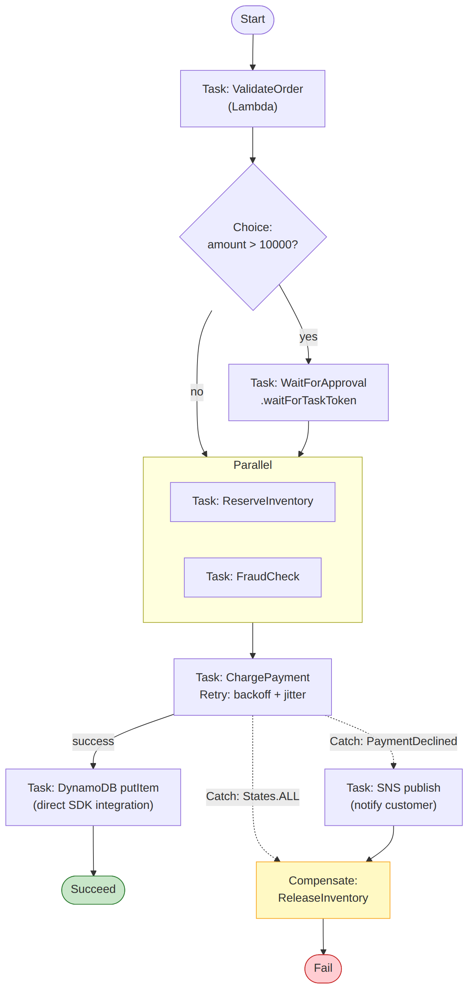

# 📚 Day 33 — Step Functions: Error Handling, Retry, Callback ও Lambda Orchestration

> 📊 **Visual Summary** — সহজে বোঝার জন্য diagram:



**সময়:** ১.৫ ঘণ্টা | **Module:** ৫ (Event-Driven Architectures with Lambda) — Day 5

## 🎯 আজকের লক্ষ্য
- Step Functions-এ error-এর ধরন
- **Retry**: backoff, jitter, max attempts
- **Catch**: fallback আর error তথ্য রাখা
- Timeout আর heartbeat
- তিনটা integration pattern: Request-Response, **Run a Job (`.sync`)**, **Wait for Callback (task token)**
- Distributed Map দিয়ে বড় dataset
- Orchestration বনাম Choreography

---

## Part 1: Error-এর ধরন

Task fail করলে Step Functions একটা **error name** দেয়। Retry/Catch এই নাম দিয়ে মেলায়।

| Error name | কখন |
|---|---|
| `States.ALL` | সব error (wildcard) |
| `States.TaskFailed` | Task ব্যর্থ (States.Timeout বাদে প্রায় সব task error) |
| `States.Timeout` | Task `TimeoutSeconds` পার করেছে, বা heartbeat আসেনি |
| `States.HeartbeatTimeout` | Heartbeat আসেনি |
| `States.Permissions` | Execution role-এ অনুমতি নেই |
| `States.DataLimitExceeded` | Output ২৫৬ KB-এর বেশি |
| `Lambda.ServiceException`, `Lambda.AWSLambdaException`, `Lambda.SdkClientException`, `Lambda.TooManyRequestsException` | Lambda service-এর ক্ষণস্থায়ী সমস্যা (retry করা উচিত) |
| **Custom error** | আপনার code-এর exception class-এর নাম, যেমন `PaymentDeclinedError` |

### Custom error ছোঁড়া (Python Lambda)
```python
class PaymentDeclinedError(Exception):
    pass

def lambda_handler(event, context):
    if event["amount"] > event["balance"]:
        raise PaymentDeclinedError("Insufficient balance")
    return {"txnId": "T-" + event["orderId"]}
```
Step Functions-এ error name হবে `PaymentDeclinedError`, তাই আলাদাভাবে ধরা যায়।

---

## Part 2: Retry

```json
"ChargePayment": {
  "Type": "Task",
  "Resource": "arn:aws:states:::lambda:invoke",
  "Parameters": { "FunctionName": "charge-payment", "Payload.$": "$" },
  "OutputPath": "$.Payload",
  "Retry": [
    {
      "ErrorEquals": ["Lambda.ServiceException", "Lambda.AWSLambdaException",
                      "Lambda.SdkClientException", "Lambda.TooManyRequestsException"],
      "IntervalSeconds": 1,
      "MaxAttempts": 3,
      "BackoffRate": 2
    },
    {
      "ErrorEquals": ["PaymentGatewayTimeout"],
      "IntervalSeconds": 2,
      "MaxAttempts": 5,
      "BackoffRate": 2,
      "MaxDelaySeconds": 30,
      "JitterStrategy": "FULL"
    }
  ],
  "Next": "SaveOrder"
}
```

| Field | মানে | Default |
|---|---|---|
| `ErrorEquals` | কোন error-এ retry | — (আবশ্যক) |
| `IntervalSeconds` | প্রথম retry-র আগে অপেক্ষা | 1 |
| `MaxAttempts` | সর্বোচ্চ retry (0 = retry নেই) | 3 |
| `BackoffRate` | প্রতিবার অপেক্ষা কত গুণ বাড়বে | 2.0 |
| `MaxDelaySeconds` | অপেক্ষার ঊর্ধ্বসীমা | — |
| `JitterStrategy` | `FULL` = অপেক্ষায় random ভাব, একসাথে সবাই retry করে না | `NONE` |

**উপরের উদাহরণে অপেক্ষা:** 2 s → 4 s → 8 s → 16 s → 30 s (সীমা)।

### ⚠️ কোন error-এ retry করবেন, কোনটায় না
| Retry করুন ✅ | Retry করবেন না ❌ |
|---|---|
| Throttling, timeout, ক্ষণস্থায়ী network সমস্যা | Validation error (ভুল input আবার দিলেও ভুল) |
| Lambda service exception | `PaymentDeclinedError` (card declined, বারবার চেষ্টা = খারাপ অভিজ্ঞতা) |
| Downstream 5xx | Permission error |

> Retry-এর array ক্রমানুসারে দেখা হয়; প্রথম যে rule মেলে সেটা ব্যবহার হয়। `States.ALL` থাকলে সেটা শেষে দিন।

---

## Part 3: Catch — ব্যর্থ হলে কোথায় যাবে

Retry শেষ হলে (বা retry না থাকলে) **Catch** error ধরে অন্য state-এ পাঠায়:

```json
"ChargePayment": {
  "Type": "Task",
  "...": "...",
  "Retry": [ "..." ],
  "Catch": [
    {
      "ErrorEquals": ["PaymentDeclinedError"],
      "ResultPath": "$.error",
      "Next": "NotifyCustomerDeclined"
    },
    {
      "ErrorEquals": ["States.ALL"],
      "ResultPath": "$.error",
      "Next": "ReleaseInventory"
    }
  ],
  "Next": "SaveOrder"
}
```

- **`ResultPath: "$.error"`** = মূল input রেখে error তথ্য (`Error`, `Cause`) যোগ করে। না দিলে input হারিয়ে যায়, আর fallback state জানতে পারে না কোন order!
- Catch-এর fallback state-এ **compensation** (যেমন reserve করা inventory ছেড়ে দেওয়া) → এটাই **Saga pattern** (Day 34)

### Retry + Catch একসাথে: ক্রম
```
Task fails → Retry rules মেলে? → হ্যাঁ: অপেক্ষা করে আবার চেষ্টা (MaxAttempts পর্যন্ত)
                                → retry শেষ বা না মেলে → Catch rules মেলে? → হ্যাঁ: Next state
                                                                          → না: পুরো execution FAILED
```

---

## Part 4: Timeout ও Heartbeat

```json
"GenerateReport": {
  "Type": "Task",
  "Resource": "arn:aws:states:::lambda:invoke",
  "Parameters": { "FunctionName": "report", "Payload.$": "$" },
  "TimeoutSeconds": 300,
  "Next": "Done"
}
```
- **`TimeoutSeconds`**: task এর বেশি চললে `States.Timeout`
- **Standard workflow-এ task-এর default timeout অনেক লম্বা** (সীমা না দিলে কোনো task আটকে থাকলে execution বছরখানেক ঝুলে থাকতে পারে!), তাই সবসময় দিন
- **`HeartbeatSeconds`**: লম্বা কাজ (callback, activity) নির্দিষ্ট সময় পরপর "বেঁচে আছি" সংকেত না দিলে fail। কাজ মরে গেলে তাড়াতাড়ি ধরা পড়ে
- পুরো state machine-এর জন্যও `TimeoutSeconds` দেওয়া যায় (top level-এ)

---

## Part 5: তিনটা Integration Pattern

### 1. Request-Response (default)
Service call করে, **response পেলেই** পরের ধাপে যায়। কাজ শেষ হওয়ার জন্য অপেক্ষা করে না।
```json
"Resource": "arn:aws:states:::sqs:sendMessage"
```

### 2. Run a Job (`.sync`): কাজ শেষ হওয়া পর্যন্ত অপেক্ষা
```json
"RunBatchJob": {
  "Type": "Task",
  "Resource": "arn:aws:states:::ecs:runTask.sync",
  "Parameters": { "Cluster": "etl", "TaskDefinition": "transform:3", "LaunchType": "FARGATE" },
  "Next": "LoadToRedshift"
}
```
ECS task, Glue job, Batch job, CodeBuild, অন্য Step Functions execution শেষ না হওয়া পর্যন্ত অপেক্ষা করে; Lambda-র ১৫ মিনিটের সীমা এখানে নেই। (শুধু Standard-এ)

### 3. Wait for Callback (`.waitForTaskToken`): বাইরের কেউ জানাবে
Workflow একটা **task token** পাঠায়, আর **থেমে অপেক্ষা করে** যতক্ষণ না কেউ সেই token দিয়ে জানায় "কাজ শেষ"।

```json
"WaitForManagerApproval": {
  "Type": "Task",
  "Resource": "arn:aws:states:::sqs:sendMessage.waitForTaskToken",
  "Parameters": {
    "QueueUrl": "https://sqs.ap-south-1.amazonaws.com/111122223333/approvals",
    "MessageBody": { "orderId.$": "$.orderId", "amount.$": "$.amount", "taskToken.$": "$$.Task.Token" }
  },
  "TimeoutSeconds": 86400,
  "Next": "ChargePayment",
  "Catch": [{ "ErrorEquals": ["States.Timeout", "Rejected"], "Next": "CancelOrder" }]
}
```
Approval app (manager button চাপলে):
```python
import json, boto3
sfn = boto3.client("stepfunctions")

sfn.send_task_success(taskToken=token, output=json.dumps({"approved": True}))
# অথবা
sfn.send_task_failure(taskToken=token, error="Rejected", cause="Manager rejected")
```
- `$$.Task.Token` = **context object** থেকে token
- **ব্যবহার:** মানুষের approval, 3rd-party-র webhook-এর অপেক্ষা, legacy system-এর কাজ
- অপেক্ষার সময় খরচ হয় না (Standard); ১ বছর পর্যন্ত অপেক্ষা করা যায়
- `TimeoutSeconds` অবশ্যই দিন (নাহলে চিরকাল অপেক্ষা)

---

## Part 6: Distributed Map — বিশাল Dataset

Inline Map execution-এর ভেতরে চলে, সীমিত। **Distributed Map** প্রতিটা batch-এর জন্য আলাদা **child execution** চালায়:
- S3-এর লাখো object, বা বড় CSV/JSON Lines file-এর প্রতিটা row
- সর্বোচ্চ **১০,০০০ parallel** child execution
- Child হিসেবে Express workflow ব্যবহার করলে সস্তা
- Failure tolerance (যেমন "৫% item fail হলেও চলবে"), আর ফলাফল S3-এ লেখা

```json
"ProcessAllInvoices": {
  "Type": "Map",
  "ItemReader": {
    "Resource": "arn:aws:states:::s3:getObject",
    "ReaderConfig": { "InputType": "CSV", "CSVHeaderLocation": "FIRST_ROW" },
    "Parameters": { "Bucket": "invoices", "Key": "2026-09.csv" }
  },
  "ItemProcessor": {
    "ProcessorConfig": { "Mode": "DISTRIBUTED", "ExecutionType": "EXPRESS" },
    "StartAt": "ProcessInvoice",
    "States": { "ProcessInvoice": { "Type": "Task", "Resource": "arn:aws:states:::lambda:invoke",
                "Parameters": { "FunctionName": "process-invoice", "Payload.$": "$" }, "End": true } }
  },
  "MaxConcurrency": 500,
  "ToleratedFailurePercentage": 5,
  "End": true
}
```

---

## Part 7: Orchestration বনাম Choreography

দুটো উপায়ে অনেকগুলো service মিলিয়ে কাজ করানো যায়:

| | **Orchestration** (Step Functions) | **Choreography** (EventBridge/SNS/SQS) |
|---|---|---|
| নিয়ন্ত্রণ | একটা central "conductor" জানে পুরো flow | কেউ পুরো flow জানে না; প্রতিটা service event-এ সাড়া দেয় |
| Visibility | এক জায়গায় পুরো অবস্থা | ছড়ানো; tracing লাগে |
| Coupling | Orchestrator সবাইকে চেনে | খুব loose |
| Error/rollback | সহজ (Catch, compensation) | কঠিন (প্রতিটা service নিজে) |
| নতুন ধাপ যোগ | Workflow বদলাতে হয় | নতুন consumer শুধু subscribe করে |
| কখন | ধাপের **ক্রম জরুরি**, transaction-এর মতো কাজ (order, payment) | স্বাধীন reaction (email, analytics, audit) |

👉 বাস্তবে **দুটো মিলিয়ে**: বড় domain event-গুলো EventBridge-এ (choreography), প্রতিটা service-এর ভেতরের ধাপগুলো Step Functions-এ (orchestration)।

```
OrderService (Step Functions: validate → reserve → charge → confirm)
      └── শেষে "OrderConfirmed" event → EventBridge → Email, Analytics, Loyalty (choreography)
```

---

## Part 8: Hands-on Lab

Day 32-এর workflow উন্নত করুন:
1. `charge-payment` Lambda-য় random ভাবে (৩০%) `PaymentGatewayTimeout` আর amount > balance হলে `PaymentDeclinedError` ছোঁড়ান
2. Charge state-এ Part 2-এর **Retry** (gateway timeout-এ backoff + jitter) যোগ করুন
3. **Catch**: `PaymentDeclinedError` → `NotifyDeclined` (SNS publish, direct integration); `States.ALL` → `ReleaseInventory` (Pass) → Fail
4. সব task-এ `TimeoutSeconds`
5. Approval ধাপ: amount > 10000 হলে `sqs:sendMessage.waitForTaskToken`; CLI দিয়ে approve করুন:
```bash
aws stepfunctions send-task-success --task-token "$TOKEN" --task-output '{"approved": true}'
```
6. Execution-এর **event history**-তে retry-র চেষ্টাগুলো আর Catch-এর পথ দেখুন

---

## 🎯 আজকের মূল Takeaways

1. Error name দিয়ে মেলানো: `States.ALL`, `States.Timeout`, Lambda service error, **custom error**
2. **Retry**: `IntervalSeconds`, `MaxAttempts`, `BackoffRate`, `MaxDelaySeconds`, `JitterStrategy`; শুধু ক্ষণস্থায়ী error-এ
3. **Catch** + `ResultPath: "$.error"` → fallback/compensation state
4. সব task-এ **`TimeoutSeconds`**; লম্বা কাজে heartbeat
5. Integration: Request-Response / **`.sync`** (কাজ শেষ পর্যন্ত) / **`.waitForTaskToken`** (বাইরের callback, human approval)
6. **Distributed Map** = লাখো item, ১০,০০০ parallel
7. **Orchestration** (ক্রম জরুরি) + **Choreography** (স্বাধীন reaction) একসাথে

---

## 📝 Self-check Questions

1. কোন error-গুলোতে retry করা ঠিক না? দুটো উদাহরণ।
2. `IntervalSeconds: 1, BackoffRate: 2, MaxAttempts: 4` হলে অপেক্ষার সময়গুলো কত?
3. Catch-এ `ResultPath` না দিলে কী সমস্যা হয়?
4. Manager-এর approval-এর জন্য workflow ২ দিন থামিয়ে রাখতে কোন pattern?
5. ECS task শেষ হওয়া পর্যন্ত workflow অপেক্ষা করবে, কীভাবে?
6. S3-এ ২০ লাখ row-এর CSV-র প্রতিটা row process করতে কী ব্যবহার করবেন?
7. Orchestration আর choreography-র মধ্যে কখন কোনটা?

<details><summary>▶ উত্তর দেখুন</summary>

1. Validation error, card declined, permission error (যেকোনো দুটো); এগুলো আবার চেষ্টা করলেও একই ফল।
2. 1 s, 2 s, 4 s, 8 s।
3. Error output পুরো input-কে প্রতিস্থাপন করে; fallback state orderId ইত্যাদি হারায়।
4. `.waitForTaskToken` (callback) + লম্বা `TimeoutSeconds`, Standard workflow।
5. `arn:aws:states:::ecs:runTask.sync` (Run a Job pattern)।
6. Distributed Map with S3 CSV ItemReader (child Express workflow, MaxConcurrency, ToleratedFailurePercentage)।
7. ক্রম আর rollback জরুরি হলে orchestration (Step Functions); স্বাধীন, loosely coupled reaction হলে choreography (EventBridge/SNS)।
</details>

---

## 💡 Pro Tips

- Lambda task-এ AWS-এর recommended Lambda service error retry সবসময় রাখুন (Workflow Studio নিজে দেয়)
- Error class-এর নাম অর্থপূর্ণ দিন; Step Functions সেগুলো দিয়েই routing করে
- Execution fail হলে **"Redrive"** দিয়ে ব্যর্থ ধাপ থেকে আবার চালানো যায় (Standard), পুরোটা আবার না
- CloudWatch alarm: `ExecutionsFailed`, `ExecutionsTimedOut`
- X-Ray tracing চালু করলে workflow আর Lambda একসাথে দেখা যায়

---

## 🎨 Quick Reference

```json
"Retry": [{"ErrorEquals": ["States.TaskFailed"], "IntervalSeconds": 2,
           "MaxAttempts": 3, "BackoffRate": 2, "JitterStrategy": "FULL"}],
"Catch": [{"ErrorEquals": ["States.ALL"], "ResultPath": "$.error", "Next": "Compensate"}],
"TimeoutSeconds": 60
```

```
Patterns: request-response | .sync (wait for job) | .waitForTaskToken ($$.Task.Token)
Callback: send-task-success / send-task-failure / send-task-heartbeat
Distributed Map: S3 ItemReader, up to 10,000 parallel children
Orchestration (Step Functions) + Choreography (EventBridge)
```

---

## 🚨 বাস্তব পরিস্থিতি (যেসব ভুল প্রায়ই হয়)

**পরিস্থিতি ১:** `States.ALL`-এ ৫ বার retry দেওয়া ছিল। Card declined হলেও ৫ বার charge করার চেষ্টা হলো, আর customer-এর bank fraud alert পাঠাল।
**শিক্ষা:** Business error-এ retry না; আলাদা Catch।

**পরিস্থিতি ২:** Approval-এর callback task-এ timeout ছিল না। Manager কখনো click করেননি, আর কয়েকশো execution মাসের পর মাস "Running" অবস্থায় ঝুলে থাকল।
**শিক্ষা:** Callback-এ `TimeoutSeconds` (আর দরকারে heartbeat), timeout-এ cancel শাখা।

**পরিস্থিতি ৩:** Catch-এ ResultPath না দেওয়ায় compensation state orderId পেল না, তাই inventory আর ছাড়া হলো না।
**শিক্ষা:** Catch-এ `"ResultPath": "$.error"`।

---

**⏮ আগের দিন:** [Day 32 — Step Functions Basics](./Day-32-Step-Functions-Basics-States-Workflows.md) | **⏭ পরের দিন:** [Day 34 — Event-Driven Design Patterns](./Day-34-Design-Patterns-Saga-Event-Sourcing-CQRS-Idempotency.md)
