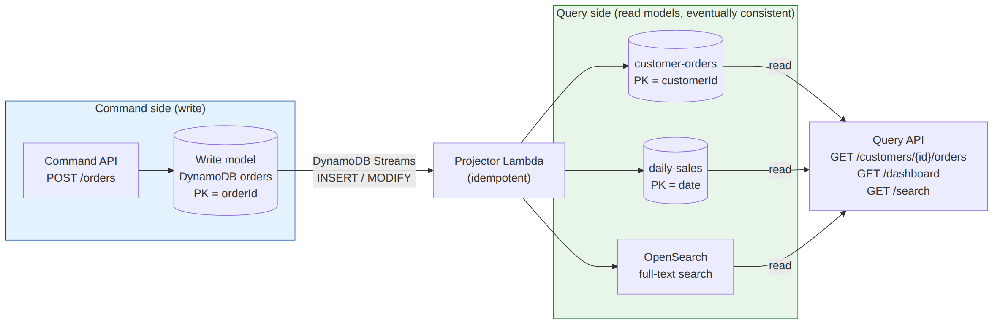

# 📚 Day 34 — Event-Driven Design Patterns: Saga, Event Sourcing, CQRS, Async Request/Response ও Idempotency

> 📊 **Visual Summary** — সহজে বোঝার জন্য diagram:




**সময়:** ২ ঘণ্টা | **Module:** ৫ (Event-Driven Architectures with Lambda) — Day 6

## 🎯 আজকের লক্ষ্য
- **Saga pattern**: microservice-এ distributed transaction আর compensation
- **Event Sourcing**: state না, ঘটনা (event) জমা রাখা
- **CQRS**: লেখা আর পড়া আলাদা model (DynamoDB Streams দিয়ে)
- **Async request/response**: লম্বা কাজের API
- **Idempotency**: duplicate event নিরাপদে সামলানো
- বোনাস: Transactional Outbox, Claim Check

---

## Part 1: Saga Pattern — Distributed Transaction

### 🤔 সমস্যা
একটা database-এ transaction সহজ: সব হবে, না হলে কিছুই না (ACID)। কিন্তু microservice-এ প্রতিটা service-এর **আলাদা database**:
```
Order DB (DynamoDB)  |  Inventory DB (RDS)  |  Payment (3rd-party)  |  Shipping API
```
এদের মধ্যে একটা "global transaction" সম্ভব না। Inventory reserve হলো, তারপর payment fail করলে কী হবে?

### ✅ সমাধান: Saga
**Saga** = কয়েকটা **local transaction**-এর ক্রম। প্রতিটা ধাপের একটা **compensating action** (উল্টো কাজ) থাকে। কোনো ধাপ fail করলে **আগের সফল ধাপগুলো উল্টো ক্রমে undo** করা হয়।

| ধাপ | কাজ | Compensation (undo) |
|---|---|---|
| 1 | Order তৈরি (PENDING) | Order CANCELLED |
| 2 | Inventory reserve | Inventory release |
| 3 | Payment charge | Payment refund |
| 4 | Shipment তৈরি | Shipment cancel |

```
Create Order ✅ → Reserve Inventory ✅ → Charge Payment ❌
                                            ↓
                  Release Inventory ↩  ←  (compensate)
                          ↓
                  Cancel Order ↩
```

### Saga-র দুই ধরন

| | **Orchestrated Saga** (Step Functions) | **Choreographed Saga** (events) |
|---|---|---|
| কীভাবে | একটা workflow প্রতিটা ধাপ চালায়, fail হলে Catch দিয়ে compensation | প্রতিটা service event শুনে কাজ করে; fail হলে "Failed" event দেয়, অন্যরা নিজে undo করে |
| বোঝা ও debug | ✅ সহজ (visual) | কঠিন |
| কখন | বেশিরভাগ ক্ষেত্রে **recommended** | খুব loosely coupled team/service |

### Step Functions-এ Orchestrated Saga (সংক্ষেপে)
```json
"ReserveInventory": { "Type": "Task", "...": "...",
  "Catch": [{ "ErrorEquals": ["States.ALL"], "ResultPath": "$.error", "Next": "CancelOrder" }],
  "Next": "ChargePayment" },
"ChargePayment": { "Type": "Task", "...": "...",
  "Catch": [{ "ErrorEquals": ["States.ALL"], "ResultPath": "$.error", "Next": "ReleaseInventory" }],
  "Next": "CreateShipment" },
"CreateShipment": { "Type": "Task", "...": "...",
  "Catch": [{ "ErrorEquals": ["States.ALL"], "ResultPath": "$.error", "Next": "RefundPayment" }],
  "Next": "OrderConfirmed" },
"RefundPayment":    { "Type": "Task", "...": "...", "Next": "ReleaseInventory" },
"ReleaseInventory": { "Type": "Task", "...": "...", "Next": "CancelOrder" },
"CancelOrder":      { "Type": "Task", "...": "...", "Next": "OrderFailed" },
"OrderFailed":      { "Type": "Fail", "Error": "OrderFailed" },
"OrderConfirmed":   { "Type": "Succeed" }
```

### ⚠️ Saga-র নিয়ম
- **Compensation-ও fail করতে পারে** → compensation-এ **retry** দিন, আর compensation idempotent রাখুন
- Saga-তে মাঝের অবস্থা বাইরে দেখা যায় (যেমন কিছুক্ষণ inventory "reserved") → **eventual consistency** মেনে design করুন
- Refund করা যায় না এমন ধাপ (যেমন email পাঠানো) **শেষে** রাখুন

---

## Part 2: Event Sourcing

### সাধারণ পদ্ধতি (state-based)
Database-এ শুধু **বর্তমান অবস্থা**:
```
accounts: {id: A1, balance: 700}
```
আগে কী হয়েছিল? জানা নেই।

### Event Sourcing
**প্রতিটা পরিবর্তন একটা immutable event** হিসেবে জমা থাকে; বর্তমান অবস্থা = সব event যোগ করে বের করা:
```
A1: AccountOpened(0) → Deposited(1000) → Withdrawn(200) → Withdrawn(100)
    → বর্তমান balance = 1000 - 200 - 100 = 700
```

| সুবিধা ✅ | অসুবিধা ❌ |
|---|---|
| সম্পূর্ণ **audit trail** (banking, compliance) | জটিল |
| যেকোনো সময়ের অবস্থা আবার বানানো যায় ("time travel") | অনেক event হলে state বানাতে সময় লাগে → **snapshot** |
| Bug ঠিক করে event **replay** | Event schema বদলানো (versioning) কঠিন |
| নতুন read model পরে বানানো যায় | Query করতে আলাদা read model লাগে (→ CQRS) |

### AWS-এ implement
**Event store = DynamoDB table:**
```
PK = aggregateId (A1)     SK = version (1, 2, 3...)     eventType, data, timestamp
```
- নতুন event লিখুন **conditional write** দিয়ে: `attribute_not_exists(SK)` → একই version-এ দুজন একসাথে লিখতে পারবে না (**optimistic concurrency**)
- Current state পড়তে: `Query PK = A1` (ক্রমানুসারে) → fold
- অনেক event হলে প্রতি ১০০ event-এ একটা **snapshot** item
- Event publish: **DynamoDB Streams** → Lambda → EventBridge / read model
- বিকল্প: Kinesis Data Streams (বড় volume), S3-এ দীর্ঘমেয়াদি archive

---

## Part 3: CQRS (Command Query Responsibility Segregation)

**মূল ধারণা:** লেখা (**command**) আর পড়া (**query**)-র জন্য **আলাদা model/database**। প্রতিটাকে নিজের কাজের জন্য optimize করা যায়।

### কেন?
- লেখার model normalize করা, validation-এ ভরা; পড়ার জন্য অনেক JOIN/aggregation লাগে, ধীর
- পড়া সাধারণত লেখার চেয়ে ১০–১০০ গুণ বেশি; আলাদা scale করা যায়
- বিভিন্ন ধরনের query: dashboard-এ aggregate, search-এ full-text, mobile-এ ছোট summary

### AWS-এ CQRS with DynamoDB Streams
```
Command API ──► Write model: DynamoDB "orders" (PK = orderId)
                    │ DynamoDB Streams (INSERT/MODIFY)
                    ▼
               Projector Lambda
                    ├──► Read model 1: DynamoDB "customer-orders" (PK = customerId) → "আমার order"
                    ├──► Read model 2: DynamoDB "daily-sales" (PK = date) → dashboard
                    └──► Read model 3: OpenSearch → full-text search
Query API ◄──────── read model থেকে পড়ে
```

```python
from boto3.dynamodb.types import TypeDeserializer
import boto3
deser = TypeDeserializer()
sales = boto3.resource("dynamodb").Table("daily-sales")

def handler(event, context):
    for rec in event["Records"]:
        if rec["eventName"] != "INSERT":
            continue
        img = {k: deser.deserialize(v) for k, v in rec["dynamodb"]["NewImage"].items()}
        day = img["createdAt"][:10]
        sales.update_item(
            Key={"date": day},
            UpdateExpression="ADD total :a, orderCount :one",
            ExpressionAttributeValues={":a": img["amount"], ":one": 1},
        )
```

### ⚠️ মনে রাখুন
- Read model **eventually consistent**: লেখার কয়েক মিলিসেকেন্ড থেকে সেকেন্ড পরে update হয়। UI-তে "প্রক্রিয়াধীন" দেখানো বা লেখার response থেকে সরাসরি দেখানো
- Projector **idempotent** হতে হবে (stream retry করে)। উপরের `ADD` duplicate এলে দুবার যোগ করবে! সমাধান নিচে Part 5
- Stream-এর error handling (Day 25): bisect, retry limit, on-failure destination, `IteratorAge` alarm
- CQRS **সব জায়গায় লাগে না**। সাধারণ CRUD-এ অপ্রয়োজনীয় জটিলতা

---

## Part 4: Async Request/Response

### সমস্যা
Report বানাতে ৩ মিনিট লাগে, কিন্তু API Gateway ২৯ সেকেন্ডে কেটে দেয় (Day 24)। User-কে অপেক্ষায় রাখা খারাপ অভিজ্ঞতা।

### ✅ Pattern: "202 Accepted + status check"
```
1. POST /reports ──► API ──► job record (DynamoDB: status=PENDING) + SQS/Step Functions শুরু
                     ◄── 202 Accepted {"jobId": "J42", "statusUrl": "/reports/J42"}
2. Worker background-এ কাজ করে ──► S3-এ report, DynamoDB status=DONE, resultUrl
3. Client:
   a) Polling:  GET /reports/J42 → {"status": "PENDING"} ... {"status": "DONE", "url": "<pre-signed S3 URL>"}
   b) Push:     WebSocket (API Gateway WebSocket / AppSync subscription) দিয়ে "DONE" জানানো
   c) Webhook:  Client-এর দেওয়া callback URL-এ POST (server-to-server)
```

```python
# POST /reports
import json, uuid, time, boto3, os
jobs = boto3.resource("dynamodb").Table(os.environ["JOBS_TABLE"])
sqs = boto3.client("sqs")

def create_report(event, context):
    job_id = str(uuid.uuid4())
    jobs.put_item(Item={"jobId": job_id, "status": "PENDING", "createdAt": int(time.time())})
    sqs.send_message(QueueUrl=os.environ["QUEUE_URL"], MessageBody=json.dumps({"jobId": job_id}))
    return {"statusCode": 202,
            "body": json.dumps({"jobId": job_id, "statusUrl": f"/reports/{job_id}"})}
```
> 💡 Job record-এ **TTL** দিন (যেমন ৭ দিন), পুরনো job নিজে থেকে মুছে যাবে। বড় ফলাফল S3-এ রেখে **pre-signed URL** দিন।

---

## Part 5: Idempotency — Event-Driven-এর সবচেয়ে গুরুত্বপূর্ণ নিয়ম

### কেন duplicate আসে?
- SQS Standard: at-least-once
- Lambda async retry, SNS/EventBridge retry
- Stream retry (Kinesis, DynamoDB Streams)
- Client timeout পেয়ে আবার request পাঠায়
- Express workflow: at-least-once

👉 **ধরে নিন প্রতিটা event একাধিকবার আসতে পারে।**

**Idempotent** = একই operation একবার বা দশবার চালালে ফল একই।

| Idempotent ✅ | Idempotent না ❌ |
|---|---|
| `status = "PAID"` set করা | `balance = balance - 100` |
| `PUT /users/42` (পুরোটা বদলানো) | `POST /orders` (নতুন তৈরি) |
| Delete by ID | Counter `+1` |
| Email "যদি আগে পাঠানো না হয়" | Email পাঠানো |

### কৌশল ১: DynamoDB conditional write (idempotency key)
```python
from botocore.exceptions import ClientError
processed = boto3.resource("dynamodb").Table("processed-events")

def handle(event_id, do_work):
    try:
        processed.put_item(
            Item={"eventId": event_id, "expiresAt": int(time.time()) + 7*24*3600},
            ConditionExpression="attribute_not_exists(eventId)",
        )
    except ClientError as e:
        if e.response["Error"]["Code"] == "ConditionalCheckFailedException":
            return "duplicate - skipped"
        raise
    return do_work()
```
> ⚠️ এই সরল version-এ key লেখার পর কাজ fail করলে পরের retry "duplicate" ভেবে বাদ দেবে। আসল সমাধানে status (`IN_PROGRESS` → `COMPLETED`) আর expiry রাখতে হয়। তাই নিচের library ব্যবহার করুন।

### কৌশল ২: Powertools for AWS Lambda — Idempotency utility (recommended)
```python
from aws_lambda_powertools.utilities.idempotency import (
    DynamoDBPersistenceLayer, idempotent, IdempotencyConfig)

persistence = DynamoDBPersistenceLayer(table_name="idempotency")
config = IdempotencyConfig(event_key_jmespath="orderId", expires_after_seconds=3600)

@idempotent(persistence_store=persistence, config=config)
def lambda_handler(event, context):
    charge_card(event["orderId"], event["amount"])
    return {"status": "charged", "orderId": event["orderId"]}
```
- প্রথমবার: কাজ চালায়, ফল DynamoDB-তে রাখে
- একই `orderId` আবার এলে: **আগের ফলই ফেরত দেয়**, কাজ আবার চালায় না
- In-progress অবস্থা, expiry, error হলে record মুছে retry সুযোগ, সব নিজে সামলায়

### কৌশল ৩: প্রাকৃতিকভাবে idempotent design
- Counter `ADD`-এর বদলে: event ID সহ আলাদা item লিখে পরে গোনা, বা conditional update (`lastEventId <> :id`)
- 3rd-party API-তে **idempotency key header** পাঠানো (Stripe-এর মতো payment API support করে)
- SQS FIFO dedup ID, Step Functions execution name = orderId

---

## Part 6: বোনাস Pattern

### 📤 Transactional Outbox
সমস্যা: DB-তে লেখা **আর** event publish দুটো আলাদা; মাঝে crash হলে DB-তে আছে কিন্তু event যায়নি।
সমাধান: DB-তে লেখার সময় একই transaction-এ একটা "outbox" item লিখুন; আলাদা process সেটা পড়ে publish করে।
**AWS-এ সহজ রূপ:** DynamoDB-তে লিখুন → **DynamoDB Streams** নিজেই outbox → Lambda/Pipes → EventBridge। লেখা হলে event নিশ্চিত।

### 🎫 Claim Check
বড় payload (message সীমা ১ MiB / ২৫৬ KB, Step Functions ২৫৬ KB) → data **S3**-এ রাখুন, message-এ শুধু S3 key পাঠান।

### 🔁 Retry with Backoff + Jitter, Circuit Breaker
Downstream বারবার fail করলে অবিরাম retry না করে কিছুক্ষণ বন্ধ রাখা (circuit open), পরে আবার চেষ্টা। Step Functions + DynamoDB-তে circuit state রেখে implement করা যায়।

---

## 🎯 আজকের মূল Takeaways

1. **Saga** = local transaction-এর ক্রম + প্রতিটার **compensation**; Step Functions দিয়ে orchestrated saga সবচেয়ে সহজ
2. **Event Sourcing** = পরিবর্তনগুলো immutable event হিসেবে; audit, replay; DynamoDB conditional write (version)
3. **CQRS** = আলাদা write আর read model; DynamoDB Streams → projector → read model; eventual consistency
4. **Async request/response** = `202` + jobId → polling / WebSocket / webhook
5. **Idempotency** = প্রতিটা consumer-এ বাধ্যতামূলক; **Powertools idempotency** বা conditional write
6. Outbox (DynamoDB Streams), Claim check (S3)

---

## 📝 Self-check Questions

1. Payment সফল হওয়ার পর shipment তৈরি fail করল। Saga-তে কী কী ঘটবে?
2. Compensation action-ও fail করলে কী করবেন?
3. Event sourcing-এ বর্তমান balance কীভাবে পাওয়া যায়? অনেক event হলে কী করবেন?
4. CQRS-এ user order দেওয়ার সাথে সাথে "আমার order" list-এ দেখতে পাচ্ছে না। কেন?
5. `balance = balance - 100` consumer-এ duplicate event এলে কী হবে? কীভাবে ঠেকাবেন?
6. ৫ মিনিটের export কাজের API কীভাবে design করবেন?
7. DB-তে order লেখা আর "OrderPlaced" event পাঠানো দুটোই নিশ্চিত করতে কী pattern?

<details><summary>▶ উত্তর দেখুন</summary>

1. উল্টো ক্রমে compensation: Refund payment → Release inventory → Cancel order → workflow Failed।
2. Compensation-এ retry (backoff), compensation idempotent রাখা; তারপরও ব্যর্থ হলে DLQ/alert আর manual হস্তক্ষেপ।
3. ঐ account-এর সব event ক্রমানুসারে পড়ে যোগ করে (fold); অনেক event হলে snapshot রেখে তার পরের event-গুলো।
4. Read model eventually consistent; stream → projector-এ কিছুটা দেরি হয় (বা projector আটকে আছে, `IteratorAge` দেখুন)।
5. দুবার কাটা যাবে। Idempotency key (event ID) দিয়ে conditional write বা Powertools idempotency।
6. `POST` → `202` + jobId, SQS/Step Functions-এ কাজ, DynamoDB-তে status, S3-এ ফল; client polling (বা WebSocket/webhook) দিয়ে pre-signed URL পায়।
7. Transactional outbox। AWS-এ DynamoDB-তে লেখা → DynamoDB Streams → EventBridge।
</details>

---

## 💡 Pro Tips

- Saga design করার আগে একটা table বানান: প্রতিটা ধাপ, তার compensation, আর compensation fail হলে কী হবে
- Event-এ সবসময় **unique `eventId`** আর `version` রাখুন
- Idempotency table-এ **TTL** দিন, নাহলে চিরকাল বাড়বে
- Event sourcing আর CQRS শক্তিশালী কিন্তু জটিল; শুধু দরকার হলে (audit, বিভিন্ন read pattern)
- Eventual consistency-র জন্য UI design করুন ("প্রক্রিয়াধীন..." অবস্থা)

---

## 🎨 Quick Reference

```
Saga:            step + compensation; fail → undo in reverse (Step Functions Catch)
Event Sourcing:  append-only events (DDB PK=aggregateId, SK=version, conditional write) + snapshots
CQRS:            write DDB → Streams → projector Lambda → read models (DDB/OpenSearch)
Async req/resp:  202 + jobId → poll GET /jobs/{id} | WebSocket | webhook; result via pre-signed URL
Idempotency:     assume duplicates; idempotency key + conditional write / Powertools @idempotent
Outbox:          DynamoDB write → Streams → EventBridge | Claim check: payload in S3, key in message
```

---

## 🚨 বাস্তব পরিস্থিতি (যেসব ভুল প্রায়ই হয়)

**পরিস্থিতি ১:** Payment fail হলে inventory ছাড়ার কোনো ব্যবস্থা ছিল না। কয়েক সপ্তাহে হাজারো item "reserved" অবস্থায় আটকে থাকল, অথচ বিক্রি হয়নি।
**শিক্ষা:** প্রতিটা ধাপের compensation আগে থেকে design করুন।

**পরিস্থিতি ২:** Wallet service-এ SQS Standard থেকে duplicate message আসায় কিছু customer-এর টাকা দুবার কাটা গেল।
**শিক্ষা:** টাকা সংক্রান্ত সব consumer-এ idempotency key।

**পরিস্থিতি ৩:** CQRS projector-এর bug-এ read model ভুল data দেখাচ্ছিল। Stream-এ শুধু ২৪ ঘণ্টার data থাকায় পুরনো read model আবার বানানো গেল না।
**শিক্ষা:** Event archive রাখুন (EventBridge archive/S3); read model যেন আবার বানানো যায়।

---

**⏮ আগের দিন:** [Day 33 — Step Functions Error Handling](./Day-33-Step-Functions-Error-Handling-Orchestration.md) | **⏭ পরের দিন:** [Day 35 — Module 5 Revision + Mini Project](./Day-35-Module-5-Revision-Event-Driven-Order-System.md)
