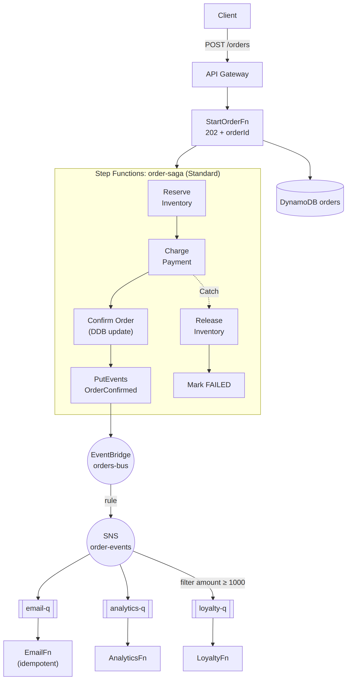

# 📚 Day 35 — Module 5 Revision + Mini Project: Event-Driven Order System

> 📊 **Visual Summary** — সহজে বোঝার জন্য diagram:



**সময়:** ২ ঘণ্টা | **Module:** ৫ (Event-Driven Architectures with Lambda) — Day 7 (শেষ দিন)

## 🎯 আজকের লক্ষ্য
- পুরো Module 5 এক নজরে
- কোন messaging service কখন: সিদ্ধান্তের গাইড
- Mini project: **API → Step Functions saga → EventBridge → SNS/SQS fan-out**
- Production checklist
- Final quiz (exam-ধাঁচের প্রশ্ন সহ)

---

# 🔁 Module 5 Revision

## 🗺 পুরো Module এক নজরে

| Day | বিষয় | এক লাইনে মনে রাখুন |
|---|---|---|
| 29 | SQS | Receive → লুকায় → delete; visibility timeout; long polling ২০ s; Standard বনাম FIFO (group + dedup); DLQ + redrive |
| 30 | SNS | Push, সবাই পায়; filter policy; subscription DLQ; FIFO topic; **SNS → SQS fan-out** |
| 31 | EventBridge | Default/custom/partner bus; pattern (prefix, numeric, anything-but...); ৫ target; DLQ; Scheduler; cross-account; archive/replay |
| 32 | Step Functions basics | Task/Choice/Wait/Parallel/Map; direct SDK integration; ResultPath; Standard বনাম Express |
| 33 | Error handling | Retry (backoff, jitter) + Catch (`$.error`); timeout; `.sync`; `.waitForTaskToken`; Distributed Map; orchestration বনাম choreography |
| 34 | Patterns | Saga (compensation), Event Sourcing, CQRS (Streams), async 202, **idempotency**, outbox |

## 🧭 কোন Service কখন? — সিদ্ধান্তের গাইড

```
একটা কাজ buffer করে পরে process করতে চান?          → SQS (Standard / FIFO)
একটা message অনেকের কাছে পাঠাতে চান?               → SNS (→ SQS per consumer)
Event-এর content দেখে বিভিন্ন জায়গায় route?          → EventBridge
AWS service বা SaaS-এর event-এ সাড়া?                 → EventBridge
ধাপে ধাপে workflow, retry, rollback, human approval?  → Step Functions
নির্দিষ্ট সময়ে চালানো?                                → EventBridge Scheduler
Real-time বিশাল stream, replay, অনেক consumer, ক্রম?  → Kinesis Data Streams
Kafka দরকার?                                          → Amazon MSK
পুরনো JMS/AMQP/MQTT app migrate?                      → Amazon MQ
```

| প্রয়োজন | SQS | SNS | EventBridge | Kinesis |
|---|---|---|---|---|
| Message জমা থাকে | ✅ ১৪ দিন | ❌ | ❌ (archive) | ✅ ২৪ h–৩৬৫ দিন |
| একাধিক consumer একই message | ❌ (fan-out দিয়ে) | ✅ | ✅ | ✅ |
| Replay | ❌ | ❌ | ✅ archive | ✅ |
| Ordering | FIFO | FIFO topic | ❌ | Shard-এর ভেতরে |
| Content-based routing | ❌ | Filter policy | ✅ সবচেয়ে শক্তিশালী | ❌ |

---

# 🛠 Mini Project: Event-Driven Order System

## Requirement
- `POST /orders` → সাথে সাথে `202 Accepted` + orderId
- **Step Functions (Standard)** order saga চালাবে: Reserve inventory → Charge payment → Confirm
  - Payment fail → inventory release (compensation) → order `FAILED`
- সফল হলে **EventBridge**-এ `OrderConfirmed` event
- EventBridge rule → **SNS** → তিনটা **SQS** consumer: email, analytics, loyalty (loyalty শুধু ১০০০+ টাকার order)
- সব consumer idempotent, সব queue-তে DLQ
- `GET /orders/{id}` দিয়ে status দেখা

## Architecture
```
Client ─POST /orders─► API Gateway ─► StartOrderFn ─► DynamoDB orders (PENDING)
                                            └──► Step Functions "order-saga" (execution name = orderId)
                                                   ReserveInventory ─► ChargePayment ─► ConfirmOrder (DDB: CONFIRMED)
                                                        ↑ Catch            │ Catch                    │
                                                        │                  ▼                          ▼
                                                   MarkFailed ◄── ReleaseInventory        EventBridge PutEvents
                                                                                          "OrderConfirmed" (orders-bus)
                                                                                                │ rule
                                                                                                ▼
                                                                                          SNS order-events
                                                                    ┌───────────────────────┼─────────────────────┐
                                                               SQS email-q            SQS analytics-q      SQS loyalty-q [amount ≥ 1000]
                                                               → EmailFn              → AnalyticsFn        → LoyaltyFn     (+ DLQ each)
Client ─GET /orders/{id}─► GetOrderFn ─► DynamoDB orders
```

## ধাপ ১: Order শুরু (`StartOrderFn`)
```python
import json, os, uuid, time, boto3

orders = boto3.resource("dynamodb").Table(os.environ["ORDERS_TABLE"])
sfn = boto3.client("stepfunctions")

def handler(event, context):
    body = json.loads(event.get("body") or "{}")
    if not body.get("items") or body.get("amount", 0) <= 0:
        return {"statusCode": 400, "body": json.dumps({"error": "items and amount required"})}

    order_id = str(uuid.uuid4())
    orders.put_item(Item={"orderId": order_id, "status": "PENDING",
                          "amount": body["amount"], "customerId": body.get("customerId", "guest"),
                          "createdAt": int(time.time())})
    sfn.start_execution(stateMachineArn=os.environ["SAGA_ARN"], name=order_id,
                        input=json.dumps({"orderId": order_id, "amount": body["amount"],
                                          "items": body["items"]}))
    return {"statusCode": 202,
            "body": json.dumps({"orderId": order_id, "statusUrl": f"/orders/{order_id}"})}
```
> `name=order_id`: একই order দুবার শুরু হতে পারে না (idempotency, Day 32)।

## ধাপ ২: Saga State Machine (ASL)
```json
{
  "Comment": "Order saga with compensation",
  "StartAt": "ReserveInventory",
  "States": {
    "ReserveInventory": {
      "Type": "Task",
      "Resource": "arn:aws:states:::lambda:invoke",
      "Parameters": { "FunctionName": "${ReserveFnArn}", "Payload.$": "$" },
      "ResultSelector": { "reservationId.$": "$.Payload.reservationId" },
      "ResultPath": "$.inventory",
      "TimeoutSeconds": 30,
      "Retry": [{ "ErrorEquals": ["Lambda.ServiceException", "Lambda.TooManyRequestsException"],
                  "IntervalSeconds": 1, "MaxAttempts": 3, "BackoffRate": 2 }],
      "Catch": [{ "ErrorEquals": ["States.ALL"], "ResultPath": "$.error", "Next": "MarkFailed" }],
      "Next": "ChargePayment"
    },
    "ChargePayment": {
      "Type": "Task",
      "Resource": "arn:aws:states:::lambda:invoke",
      "Parameters": { "FunctionName": "${ChargeFnArn}", "Payload.$": "$" },
      "ResultSelector": { "txnId.$": "$.Payload.txnId" },
      "ResultPath": "$.payment",
      "TimeoutSeconds": 30,
      "Retry": [{ "ErrorEquals": ["PaymentGatewayTimeout"], "IntervalSeconds": 2,
                  "MaxAttempts": 3, "BackoffRate": 2, "JitterStrategy": "FULL" }],
      "Catch": [{ "ErrorEquals": ["States.ALL"], "ResultPath": "$.error", "Next": "ReleaseInventory" }],
      "Next": "ConfirmOrder"
    },
    "ConfirmOrder": {
      "Type": "Task",
      "Resource": "arn:aws:states:::dynamodb:updateItem",
      "Parameters": {
        "TableName": "${OrdersTable}",
        "Key": { "orderId": { "S.$": "$.orderId" } },
        "UpdateExpression": "SET #s = :s",
        "ExpressionAttributeNames": { "#s": "status" },
        "ExpressionAttributeValues": { ":s": { "S": "CONFIRMED" } }
      },
      "ResultPath": null,
      "Next": "PublishConfirmed"
    },
    "PublishConfirmed": {
      "Type": "Task",
      "Resource": "arn:aws:states:::events:putEvents",
      "Parameters": {
        "Entries": [{
          "EventBusName": "${OrdersBus}",
          "Source": "myapp.orders",
          "DetailType": "OrderConfirmed",
          "Detail": { "orderId.$": "$.orderId", "amount.$": "$.amount", "txnId.$": "$.payment.txnId" }
        }]
      },
      "ResultPath": null,
      "End": true
    },
    "ReleaseInventory": {
      "Type": "Task",
      "Resource": "arn:aws:states:::lambda:invoke",
      "Parameters": { "FunctionName": "${ReleaseFnArn}", "Payload.$": "$" },
      "ResultPath": null,
      "Retry": [{ "ErrorEquals": ["States.ALL"], "IntervalSeconds": 2, "MaxAttempts": 5, "BackoffRate": 2 }],
      "Next": "MarkFailed"
    },
    "MarkFailed": {
      "Type": "Task",
      "Resource": "arn:aws:states:::dynamodb:updateItem",
      "Parameters": {
        "TableName": "${OrdersTable}",
        "Key": { "orderId": { "S.$": "$.orderId" } },
        "UpdateExpression": "SET #s = :s",
        "ExpressionAttributeNames": { "#s": "status" },
        "ExpressionAttributeValues": { ":s": { "S": "FAILED" } }
      },
      "ResultPath": null,
      "Next": "OrderFailed"
    },
    "OrderFailed": { "Type": "Fail", "Error": "OrderFailed", "Cause": "See execution history" }
  }
}
```
> `${...}` placeholder-গুলো SAM-এর `DefinitionSubstitutions` দিয়ে বসানো হয়। Compensation (`ReleaseInventory`)-এ বেশি retry, কারণ এটা fail করা চলবে না।

## ধাপ ৩: EventBridge → SNS → SQS fan-out
- Custom bus `orders-bus`, rule:
```json
{ "source": ["myapp.orders"], "detail-type": ["OrderConfirmed"] }
```
- Target: SNS topic `order-events`; target-এর **Input Path** `$.detail` দিন, যাতে শুধু `detail` অংশ যায় (loyalty filter তখন সরাসরি `amount` দেখতে পায়)
- SNS topic policy-তে EventBridge (`events.amazonaws.com`)-কে publish-এর অনুমতি
- তিনটা SQS queue (প্রতিটার DLQ, maxReceiveCount = 3), raw message delivery
- `loyalty-q` subscription-এ **body-based filter** (`FilterPolicyScope = MessageBody`):
```json
{ "amount": [{ "numeric": [">=", 1000] }] }
```

## ধাপ ৪: Idempotent consumer (Powertools)
```python
import json
from aws_lambda_powertools.utilities.idempotency import (
    DynamoDBPersistenceLayer, IdempotencyConfig, idempotent_function)
from aws_lambda_powertools.utilities.batch import (
    BatchProcessor, EventType, process_partial_response)

persistence = DynamoDBPersistenceLayer(table_name="idempotency")
config = IdempotencyConfig(event_key_jmespath="orderId", expires_after_seconds=86400)
processor = BatchProcessor(event_type=EventType.SQS)

@idempotent_function(data_keyword_argument="order", persistence_store=persistence, config=config)
def send_email(order: dict):
    print(json.dumps({"level": "INFO", "msg": "email sent", "orderId": order["orderId"]}))
    return {"sent": True}

def record_handler(record):
    send_email(order=json.loads(record.body))

def handler(event, context):
    config.register_lambda_context(context)
    return process_partial_response(event=event, record_handler=record_handler,
                                    processor=processor, context=context)
```
👆 Powertools-এর **batch processor** নিজেই partial batch failure (Day 25) সামলায়, আর idempotency একই order-এ দুবার email আটকায়।

## Test ও যাচাই
```bash
curl -X POST $API/orders -d '{"items":["book"],"amount":1500,"customerId":"C9"}'
# {"orderId": "7c1e...", "statusUrl": "/orders/7c1e..."}
curl $API/orders/7c1e...            # PENDING → কয়েক সেকেন্ড পর CONFIRMED
```
- [ ] Step Functions graph-এ সবুজ পথ
- [ ] email-q, analytics-q, loyalty-q তিনটাতেই message (amount ১৫০০)
- [ ] amount ৫০০-এর order-এ loyalty-q-তে message নেই
- [ ] Charge Lambda-কে ইচ্ছা করে fail করালে: ReleaseInventory → MarkFailed, status `FAILED`, কোনো event যায়নি
- [ ] একই SQS message হাতে আবার পাঠালে email দ্বিতীয়বার যায় না (idempotency)
- [ ] ভাঙা message DLQ-তে যায়

## 🚀 Extension
1. ১০,০০০ টাকার বেশি order-এ **manager approval** (`.waitForTaskToken`, Day 33)
2. EventBridge **archive** চালু করে replay test
3. `OrderFailed` event-ও publish করে customer-কে জানানো
4. Analytics consumer-এর বদলে **Firehose → S3 → Athena**
5. পুরোটা SAM/CDK-তে, আর `sam delete` দিয়ে পরিষ্কার

---

## ✅ Production Checklist — Event-Driven System

- [ ] প্রতিটা consumer **idempotent** (event ID / business key)
- [ ] প্রতিটা queue ও async target-এ **DLQ** + depth alarm + redrive প্রক্রিয়া
- [ ] SQS visibility timeout ≥ ৬× consumer timeout; long polling
- [ ] FIFO দরকার হলে ভালো message group ID
- [ ] SNS filter policy / EventBridge pattern দিয়ে উৎসেই বাছাই
- [ ] Step Functions: সব task-এ timeout, ক্ষণস্থায়ী error-এ retry, business error-এ Catch, compensation
- [ ] Event-এ `eventId`, `version`, ছোট payload (বড় data S3-এ)
- [ ] Event archive (replay-এর জন্য)
- [ ] Tracing (X-Ray) আর correlation ID সব service-এ
- [ ] Alarm: `ApproximateAgeOfOldestMessage`, DLQ depth, `ExecutionsFailed`, EventBridge `FailedInvocations`
- [ ] Resource policy-তে `aws:SourceArn`/`aws:SourceAccount`/`aws:PrincipalOrgID`
- [ ] Eventual consistency মাথায় রেখে UI/API design

---

## 📝 Module 5 Final Quiz

1. SQS Standard আর FIFO-র তিনটা পার্থক্য বলুন।
2. SNS → SQS fan-out-এ queue-তে message আসছে না। দুটো সম্ভাব্য কারণ।
3. EventBridge rule-এর target ব্যর্থ হলে event কোথায় যায়?
4. Step Functions-এ Standard আর Express কখন?
5. Retry আর Catch-এর পার্থক্য কী?
6. Saga pattern কী সমস্যা সমাধান করে?
7. Idempotency কেন event-driven system-এ বাধ্যতামূলক?

### 🎓 Exam-ধাঁচের প্রশ্ন

**Q8.** An order service must notify an email service, an inventory service, and an analytics service whenever an order is placed. Each service must be able to process messages at its own pace and must not lose messages if it is temporarily unavailable. What is the MOST appropriate design?
- A. The order service calls each service's API synchronously.
- B. Publish to an SNS topic with an SQS queue subscribed for each service.
- C. Publish to a single SQS queue polled by all three services.
- D. Write orders to S3 and have each service scan the bucket every minute.

**Q9.** A bank processes account transactions that must be applied in the exact order they occur per account, without duplicates, while different accounts are processed in parallel. What should be used?
- A. SQS Standard queue
- B. SQS FIFO queue with MessageGroupId set to the account ID
- C. SNS standard topic
- D. SQS FIFO queue with a single MessageGroupId for all messages

**Q10.** A workflow must reserve inventory, charge a payment, and create a shipment. If any step fails, previously completed steps must be undone. The solution should require the LEAST custom code for error handling. What should be used?
- A. A single Lambda function calling each service in try/except blocks
- B. AWS Step Functions with Catch blocks that invoke compensating tasks (saga)
- C. Amazon SQS with a dead-letter queue
- D. Amazon EventBridge Scheduler

<details><summary>▶ উত্তর দেখুন</summary>

1. Ordering (best-effort বনাম group-এর ভেতরে strict), delivery (at-least-once বনাম exactly-once processing/dedup), throughput (প্রায় অসীম বনাম সীমিত), নাম `.fifo`।
2. Queue access policy-তে SNS-কে `sqs:SendMessage` অনুমতি নেই; queue customer KMS key দিয়ে encrypted আর key policy-তে SNS নেই; অথবা filter policy মিলছে না।
3. Retry শেষে (default ২৪ ঘণ্টা/১৮৫ বার) target-এর DLQ-তে; DLQ না থাকলে হারায়।
4. Standard: লম্বা, exactly-once, audit, callback/human approval। Express: ছোট (≤৫ মিনিট), বিশাল volume, সস্তা।
5. Retry একই task আবার চেষ্টা করে (ক্ষণস্থায়ী error-এ); Catch ব্যর্থতার পর অন্য state-এ পাঠায় (fallback/compensation)।
6. আলাদা database-এর microservice-গুলোর মধ্যে "transaction": প্রতিটা ধাপের compensation দিয়ে consistency।
7. SQS Standard, retry, stream, client-এর পুনরায় পাঠানো ইত্যাদি কারণে একই event একাধিকবার আসে; idempotent না হলে দুবার charge বা email-এর মতো ক্ষতি।
8. **B**: fan-out; প্রতিটা service-এর নিজস্ব queue, নিজের গতি, message জমা থাকে।
9. **B**: প্রতি account একটা group (ক্রম), আলাদা account parallel-এ; FIFO dedup।
10. **B**: Step Functions-এর Catch + compensation (orchestrated saga), declarative, কম custom code।
</details>

---

## 💡 Pro Tips

- Event catalog রাখুন: কোন event কে পাঠায়, কে শোনে, schema কী (EventBridge schema registry সাহায্য করে)
- সব service-এ একটা **correlation ID** (যেমন orderId) log করুন, পুরো পথ খোঁজা সহজ হয়
- শুরুতে সহজ রাখুন: SQS + Lambda; দরকার হলে SNS/EventBridge/Step Functions যোগ করুন
- Local-এ test কঠিন; ছোট dev account-এ আসল service দিয়ে test করুন, আর project শেষে পরিষ্কার করুন

---

## 🚨 বাস্তব পরিস্থিতি (যেসব ভুল প্রায়ই হয়)

**পরিস্থিতি ১:** সব consumer একটা SQS queue share করছিল। Email service message নিয়ে delete করে দিত, তাই analytics কখনো সেই order দেখত না।
**শিক্ষা:** একাধিক consumer = SNS/EventBridge fan-out, প্রতিটার নিজস্ব queue।

**পরিস্থিতি ২:** Order saga-র compensation-এ retry ছিল না। একবার inventory service ক্ষণিক down থাকায় release ব্যর্থ হলো, আর stock আটকে থাকল।
**শিক্ষা:** Compensation-এ বেশি retry, আর তারপরও fail হলে alert।

---

**⏮ আগের দিন:** [Day 34 — Design Patterns](./Day-34-Design-Patterns-Saga-Event-Sourcing-CQRS-Idempotency.md) | **⏭ পরের module:** Module 6 — Multi-VPC & Private Connectivity (আসছে)
