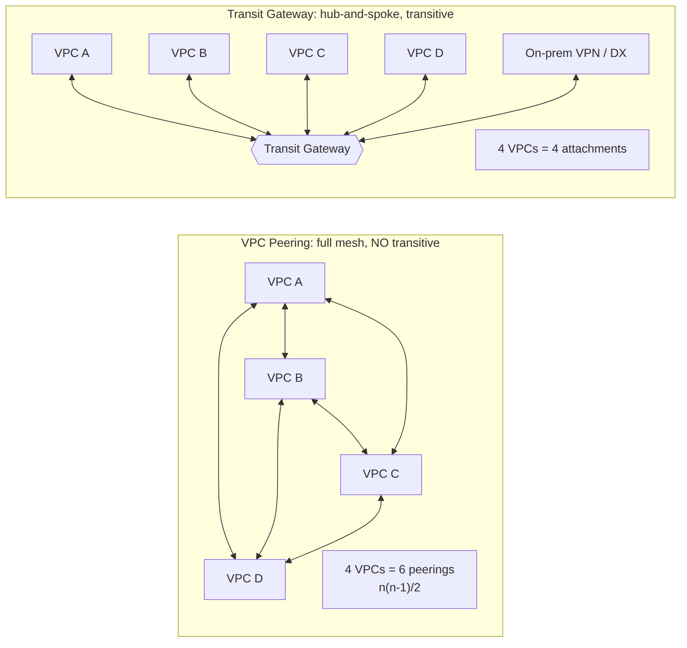

# 📚 Day 36 — VPC Peering গভীরে ও IP Address Planning

> 📊 **Visual Summary** — সহজে বোঝার জন্য diagram:



**সময়:** ১.৫ ঘণ্টা | **Module:** ৬ (Multi-VPC & Private Connectivity) — Day 1

## 🎯 আজকের লক্ষ্য
- কেন একাধিক VPC আর একাধিক account
- VPC Peering: setup, route table, security group
- Same-account, cross-account আর **inter-region** peering
- Peering-এর সীমাবদ্ধতা: **non-transitive**, CIDR overlap, edge-to-edge routing
- Peering-এ DNS resolution
- **IP address planning** আর Amazon VPC IPAM

> 📖 Module 2 (Day 8–14)-এর VPC, route table আর security group-এর ধারণা এখানে কাজে লাগবে।

---

## Part 1: কেন একাধিক VPC?

Module 2-এ একটা VPC-তে সব রেখেছিলাম। বাস্তবে প্রতিষ্ঠান বড় হলে অনেকগুলো VPC লাগে:

| কারণ | উদাহরণ |
|---|---|
| **Environment আলাদা** | dev, staging, prod: একটার ভুল অন্যটায় না ছড়ায় |
| **Team/application আলাদা** | payment team, analytics team |
| **Account আলাদা** | Multi-account strategy (Day 40): প্রতিটা account-এ নিজের VPC |
| **Compliance** | PCI data আলাদা VPC-তে |
| **Region আলাদা** | DR, user-এর কাছাকাছি |
| **Shared services** | CI/CD, monitoring, directory: একটা আলাদা VPC থেকে সবাই ব্যবহার করে |

কিন্তু এরা একে অপরের সাথে কথা বলবে কীভাবে? এই module-এর পুরোটাই সেই প্রশ্নের উত্তর:

| প্রয়োজন | সমাধান | কোন দিন |
|---|---|---|
| অল্প কয়েকটা VPC সরাসরি যুক্ত | **VPC Peering** | আজ |
| অনেক VPC + on-prem, central routing | **Transit Gateway** | Day 37 |
| On-prem ↔ AWS (internet দিয়ে, encrypted) | **Site-to-Site VPN** | Day 38 |
| On-prem ↔ AWS (dedicated line) | **Direct Connect** | Day 39 |
| একটা VPC অনেক account share করে | **Shared VPC (RAM)** | Day 40 |
| শুধু একটা service expose করা | **PrivateLink** | Day 41 |

---

## Part 2: VPC Peering কী?

**VPC Peering** = দুটো VPC-র মধ্যে **private, one-to-one** network সংযোগ। দুই VPC-র resource private IP দিয়ে এমনভাবে কথা বলে যেন একই network-এ আছে।

- Traffic **AWS backbone**-এ থাকে, internet-এ যায় না
- কোনো gateway, VPN বা physical device না; তাই **single point of failure নেই** আর **bandwidth-এর আলাদা সীমা নেই**
- **Peering-এর নিজের কোনো hourly charge নেই**; শুধু data transfer (AZ বা region পার হলে)

```
VPC A (10.0.0.0/16) ◄──── pcx-1a2b3c ────► VPC B (10.1.0.0/16)
```

---

## Part 3: Peering Setup — ধাপে ধাপে

### Step 1: Request ও Accept
```bash
# Requester (VPC A-র account থেকে)
aws ec2 create-vpc-peering-connection --vpc-id vpc-aaaa --peer-vpc-id vpc-bbbb
# → pcx-1a2b3c (status: pending-acceptance)

# Accepter (VPC B-র মালিক)
aws ec2 accept-vpc-peering-connection --vpc-peering-connection-id pcx-1a2b3c
# → status: active
```

### Step 2: **দুই দিকের** route table-এ route যোগ (সবচেয়ে বেশি ভুল হয় এখানে!)
```bash
# VPC A-র route table: B-র CIDR → peering
aws ec2 create-route --route-table-id rtb-aaaa \
  --destination-cidr-block 10.1.0.0/16 --vpc-peering-connection-id pcx-1a2b3c

# VPC B-র route table: A-র CIDR → peering
aws ec2 create-route --route-table-id rtb-bbbb \
  --destination-cidr-block 10.0.0.0/16 --vpc-peering-connection-id pcx-1a2b3c
```
> ⚠️ Peering "active" মানেই traffic চলবে না। **দুই পাশের route table** না বদলালে কিছুই যাবে না।

### Step 3: Security Group ও NACL
- VPC B-র app server-এর SG-তে VPC A-র CIDR (বা নির্দিষ্ট subnet) থেকে port allow
- **Same region**-এর peering-এ অন্য VPC-র **security group ID reference** করা যায় (cross-account হলে `account-id/sg-id`)
- NACL থাকলে দুই দিকের rule (stateless, Day 10)

### Step 4: যাচাই
```bash
# VPC A-র instance থেকে
ping 10.1.1.25          # SG-তে ICMP allow থাকলে
nc -zv 10.1.1.25 5432   # নির্দিষ্ট port
```

---

## Part 4: Cross-account ও Inter-region Peering

### Cross-account
- Requester অন্য account-এর **account ID + VPC ID** দিয়ে request পাঠায়
- ঐ account-এর মালিক accept করে
- Route table দুই account-এ আলাদা আলাদা বদলাতে হয়

### Inter-region
```bash
aws ec2 create-vpc-peering-connection --vpc-id vpc-aaaa \
  --peer-vpc-id vpc-cccc --peer-region eu-west-1
```

| | Same region | Inter-region |
|---|---|---|
| Traffic encryption | AWS backbone | AWS backbone, **automatically encrypted** |
| SG ID reference | ✅ | ❌ (CIDR দিয়ে rule দিতে হয়) |
| Jumbo frames (MTU 9001) | ✅ | ❌ (1500) |
| Data transfer খরচ | AZ পার হলে সামান্য | Inter-region rate (বেশি) |

---

## Part 5: Peering-এর সীমাবদ্ধতা (Exam-এর প্রিয় বিষয়!)

### ❌ 1. No transitive peering
```
A ◄──► B ◄──► C
A থেকে C-তে যাওয়া যাবে না, B হয়ে যাওয়া যায় না।
```
A↔C-র জন্য আলাদা peering লাগবে। ১০টা VPC-র মধ্যে সবাইকে যুক্ত করতে (full mesh) লাগবে **n(n−1)/2 = ৪৫টা** peering, আর প্রতিটার দুই দিকের route। এটা manage করা কঠিন, তাই Day 37-এর **Transit Gateway**।

### ❌ 2. CIDR overlap করা যাবে না
দুই VPC-র CIDR একই বা overlap হলে (যেমন দুটোই `10.0.0.0/16`) peering তৈরিই হবে না। এজন্য **শুরু থেকেই IP planning** (Part 7) জরুরি।

### ❌ 3. No edge-to-edge routing
Peer VPC-র এগুলো **ব্যবহার করা যায় না**:
- Internet Gateway (A-র instance B-র IGW দিয়ে internet-এ যেতে পারবে না)
- NAT Gateway
- VPN / Direct Connect (B থেকে on-prem-এ যাওয়া A-র traffic)
- Gateway VPC endpoint (B-র S3 endpoint A ব্যবহার করতে পারবে না)

### অন্যান্য সীমা
- VPC প্রতি active peering: default ৫০, বাড়িয়ে সর্বোচ্চ ১২৫
- একই দুই VPC-র মধ্যে একটাই peering

---

## Part 6: Peering-এ DNS Resolution

Peer VPC-র instance-এর **public DNS name** (যেমন `ec2-3-110-5-6.ap-south-1.compute.amazonaws.com`) default-এ public IP-তে resolve হয়, ফলে traffic peering দিয়ে না গিয়ে internet-এর দিকে যায়।

**সমাধান:** Peering connection-এর option-এ **"Allow DNS resolution from peer VPC"** চালু করুন (দুই পাশেই, যার যার দিকের জন্য)। তখন ঐ নাম **private IP**-তে resolve হয়।

```bash
aws ec2 modify-vpc-peering-connection-options --vpc-peering-connection-id pcx-1a2b3c \
  --requester-peering-connection-options AllowDnsResolutionFromRemoteVpc=true
```
> শর্ত: দুই VPC-তেই `enableDnsHostnames` আর `enableDnsSupport` চালু থাকতে হবে (Day 13)। নিজের internal domain হলে **Private Hosted Zone**-কে দুই VPC-র সাথে associate করুন।

---

## Part 7: IP Address Planning — যে ভুল পরে ঠিক করা যায় না

সব VPC `10.0.0.0/16` দিয়ে বানালে পরে কোনোটাকেই peer, TGW বা on-prem-এর সাথে যুক্ত করা যাবে না। VPC-র CIDR পরে বদলানো প্রায় অসম্ভব (শুধু secondary CIDR যোগ করা যায়)।

### ✅ একটা plan-এর উদাহরণ
```
10.0.0.0/8  → পুরো organization
├── 10.0.0.0/12   → ap-south-1 (Mumbai)
│    ├── 10.0.0.0/16   → shared-services / network hub
│    ├── 10.1.0.0/16   → prod-app
│    ├── 10.2.0.0/16   → staging-app
│    └── 10.3.0.0/16   → dev-app
├── 10.16.0.0/12  → eu-west-1 (DR)
└── 172.16.0.0/12 → on-premises data center (AWS-এ ব্যবহার করবেন না!)
```

### নিয়ম
- **On-prem-এর range** জেনে নিন আর AWS-এ এড়িয়ে চলুন
- Region অনুযায়ী বড় block, তারপর environment/account অনুযায়ী ছোট
- ভবিষ্যতের জন্য জায়গা রাখুন
- Route **summarize** করা যায় এমনভাবে (যেমন পুরো Mumbai = `10.0.0.0/12` একটা route)
- Subnet-এ AWS **৫টা IP reserve** করে (Day 8)

### Amazon VPC IPAM
Organization জুড়ে IP পরিকল্পনা ও বণ্টনের managed service:
- **Pool** বানিয়ে (region/environment অনুযায়ী) নতুন VPC তৈরির সময় automatically non-overlapping CIDR দেয়
- Overlap আর ব্যবহার monitor করে
- AWS Organizations-এর সাথে কাজ করে; পুরনো spreadsheet-এর বদলে

---

## Part 8: কখন Peering, কখন অন্য কিছু?

| পরিস্থিতি | বাছাই |
|---|---|
| ২–৩টা VPC, সরাসরি যোগাযোগ, খরচ কম রাখতে চান | ✅ **Peering** |
| বেশি bandwidth, কম latency, কোনো বাড়তি hop চান না | ✅ **Peering** (TGW-তে per-GB processing charge আছে) |
| ১০+ VPC, বা transitive routing দরকার | **Transit Gateway** |
| VPC + on-prem সব এক জায়গা থেকে route | **Transit Gateway** |
| CIDR overlap আছে, শুধু একটা service দরকার | **PrivateLink** (Day 41) |
| অন্য team-কে পুরো network না, শুধু একটা API দিতে চান | **PrivateLink** |

> 💡 বাস্তবে মিশ্রণ: বেশিরভাগ VPC TGW-তে, আর বিশাল data আদান-প্রদানের দুটো VPC-র মধ্যে বাড়তি peering (খরচ বাঁচাতে)। একই destination-এ peering আর TGW দুটোরই route থাকলে **longest prefix match** জেতে।

---

## Part 9: Hands-on Lab

1. তিনটা VPC: `lab-a` (10.10.0.0/16), `lab-b` (10.20.0.0/16), `lab-c` (10.30.0.0/16), প্রতিটায় একটা private subnet আর একটা ছোট EC2 (SSM Session Manager দিয়ে ঢোকার জন্য, Day 16)
2. A↔B peering: request → accept → **দুই পাশের route** → SG-তে ICMP allow
3. A থেকে B-র instance-এ ping ✅
4. B↔C peering তৈরি করুন, তারপর A থেকে C-তে ping করুন → ❌ (non-transitive প্রমাণ)
5. `lab-d` বানান `10.10.0.0/16` দিয়ে, আর A↔D peering চেষ্টা করুন → overlap error
6. DNS resolution option চালু করে B-র instance-এর public DNS name A থেকে `nslookup` করুন, private IP দেখায় কিনা দেখুন
7. সব মুছে ফেলুন (EC2 খরচ)

---

## 🎯 আজকের মূল Takeaways

1. একাধিক VPC = isolation (env/team/account/compliance)
2. **Peering** = দুটো VPC-র private one-to-one সংযোগ; কোনো hourly charge বা bandwidth bottleneck নেই
3. Active peering-এর পর **দুই পাশের route table** আর SG বদলাতে হয়
4. Cross-account আর inter-region সম্ভব; inter-region-এ SG reference নেই, encrypted
5. সীমা: **non-transitive**, **CIDR overlap না**, **edge-to-edge routing নেই** (IGW, NAT, VPN, gateway endpoint share হয় না)
6. Peering DNS option চালু করলে public DNS name private IP-তে resolve হয়
7. **IP planning** শুরুতেই; **VPC IPAM** দিয়ে organization-wide

---

## 📝 Self-check Questions

1. Peering active, কিন্তু ping যাচ্ছে না। কোন তিনটা জিনিস দেখবেন?
2. A↔B আর B↔C peering আছে। A কি C-র সাথে কথা বলতে পারবে?
3. VPC B-তে NAT Gateway আছে। A কি peering দিয়ে সেটা ব্যবহার করে internet-এ যেতে পারবে?
4. দুটো VPC-ই `10.0.0.0/16`। কীভাবে যুক্ত করবেন?
5. ১২টা VPC সবাইকে সবার সাথে যুক্ত করতে কয়টা peering লাগবে? ভালো বিকল্প কী?
6. Inter-region peering-এ SG rule কীভাবে লিখবেন?
7. VPC IPAM কী সমস্যা সমাধান করে?

<details><summary>▶ উত্তর দেখুন</summary>

1. দুই পাশের route table-এ peering route, দুই পাশের security group, আর NACL।
2. না; peering transitive না। A↔C আলাদা peering বা Transit Gateway লাগবে।
3. না; edge-to-edge routing নেই। A-র নিজের NAT লাগবে (বা TGW দিয়ে centralized egress, Day 37)।
4. Peering বা TGW সম্ভব না; PrivateLink দিয়ে নির্দিষ্ট service expose করা যায়, বা একটার CIDR বদলে নতুন VPC।
5. 12 × 11 ÷ 2 = ৬৬টা; Transit Gateway ভালো বিকল্প।
6. অন্য VPC-র CIDR (বা subnet CIDR) দিয়ে; inter-region-এ SG ID reference চলে না।
7. Organization জুড়ে non-overlapping CIDR পরিকল্পনা, স্বয়ংক্রিয় বণ্টন আর overlap monitoring।
</details>

---

## 💡 Pro Tips

- Peering connection-এ tag দিন (`Name = prod-app<->shared-services`), পরে খুঁজতে সুবিধা
- Route শুধু দরকারি subnet-এর জন্য দিন (পুরো VPC CIDR না), আরও নিয়ন্ত্রিত
- Peering-এর traffic দেখতে **VPC Flow Logs** (দুই পাশে)
- **Reachability Analyzer** দিয়ে "A-র instance থেকে B-র port 5432-এ যাওয়া যায় কিনা" আর কোথায় আটকাচ্ছে বোঝা যায়
- IP plan একটা document-এ লিখে রাখুন, নতুন VPC বানানোর আগে দেখুন

---

## 🎨 Quick Reference

```bash
aws ec2 create-vpc-peering-connection --vpc-id A --peer-vpc-id B [--peer-owner-id ACCT] [--peer-region R]
aws ec2 accept-vpc-peering-connection --vpc-peering-connection-id pcx-...
aws ec2 create-route --route-table-id rtb-A --destination-cidr-block <B-CIDR> --vpc-peering-connection-id pcx-...
aws ec2 create-route --route-table-id rtb-B --destination-cidr-block <A-CIDR> --vpc-peering-connection-id pcx-...
```

```
Peering: 1:1, no transit, no overlap, no edge-to-edge (IGW/NAT/VPN/GW endpoint)
Cost: no hourly; data transfer only | Limit: 50 default, 125 max per VPC
Inter-region: encrypted, no SG reference, no jumbo frames
```

---

## 🚨 বাস্তব পরিস্থিতি (যেসব ভুল প্রায়ই হয়)

**পরিস্থিতি ১:** Company-র সব team নিজেদের VPC `10.0.0.0/16` দিয়ে বানিয়েছিল। দুই বছর পর সব VPC যুক্ত করার দরকার হলো, আর কয়েকটা VPC পুরোপুরি নতুন করে বানাতে হলো।
**শিক্ষা:** প্রথম দিন থেকেই IP plan / IPAM।

**পরিস্থিতি ২:** Peering তৈরি করে accept করা হলো, কিন্তু কেউ route table বদলায়নি। Team এক দিন ধরে "network ভাঙা" ভেবে debug করল।
**শিক্ষা:** Peering = connection + দুই পাশের route + SG। Reachability Analyzer ব্যবহার করুন।

**পরিস্থিতি ৩:** Dev VPC-র instance prod VPC-র NAT Gateway দিয়ে internet-এ যাবে ভেবে design করা হয়েছিল। Deploy-এর দিন দেখা গেল peering-এ এটা সম্ভবই না।
**শিক্ষা:** Edge-to-edge routing নেই; centralized egress-এর জন্য TGW।

---

**⏮ আগের module:** [Day 35 — Module 5 Revision](../06-Module-5-Event-Driven-Architectures/Day-35-Module-5-Revision-Event-Driven-Order-System.md) | **⏭ পরের দিন:** [Day 37 — Transit Gateway](./Day-37-Transit-Gateway-Route-Tables-Segmentation.md)
