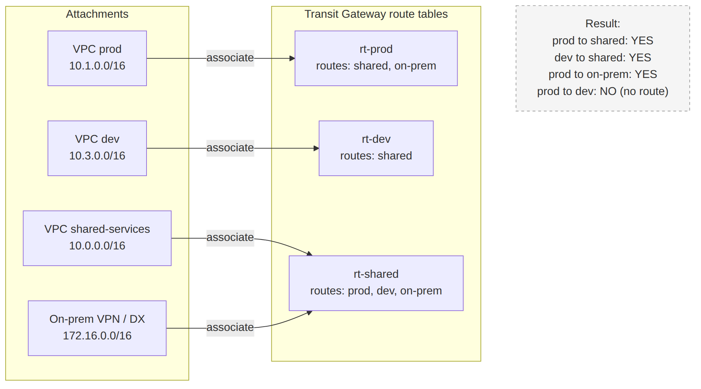

# 📚 Day 37 — Transit Gateway: Attachments, Route Tables, Segmentation ও Inter-region

> 📊 **Visual Summary** — সহজে বোঝার জন্য diagram:



**সময়:** ২ ঘণ্টা | **Module:** ৬ (Multi-VPC & Private Connectivity) — Day 2

## 🎯 আজকের লক্ষ্য
- Transit Gateway (TGW) কী, কেন peering-এর চেয়ে বড় scale-এ ভালো
- Attachment-এর ধরন (VPC, VPN, Direct Connect Gateway, Peering, Connect)
- **TGW route table**: association আর propagation
- **Segmentation**: prod আর dev আলাদা, কিন্তু দুটোই shared services দেখতে পায়
- Centralized egress (একটা NAT সবার জন্য) আর centralized inspection (appliance mode)
- Inter-region TGW peering
- খরচ আর সীমা

---

## Part 1: Transit Gateway কী?

**AWS Transit Gateway** = একটা regional **cloud router**। সব VPC, VPN আর Direct Connect একটা central hub-এ যুক্ত হয়, আর hub ঠিক করে কে কার সাথে কথা বলবে।

```
            ┌──────── VPC prod ─────┐
            │                       │
VPC dev ────┤   Transit Gateway     ├──── VPC shared-services
            │   (hub-and-spoke)     │
On-prem ────┤ (VPN / Direct Connect)├──── VPC egress (NAT)
            └───────────────────────┘
```

| | VPC Peering (Day 36) | Transit Gateway |
|---|---|---|
| Topology | Full mesh, 1:1 | **Hub-and-spoke** |
| ১০টা VPC | ৪৫টা peering | **১০টা attachment** |
| Transitive routing | ❌ | ✅ |
| On-prem VPN/DX share | ❌ | ✅ একবার যুক্ত করলেই সব VPC পায় |
| Routing নিয়ন্ত্রণ | প্রতিটা VPC-র route table | **Central TGW route table**, segmentation |
| Centralized NAT/firewall | ❌ | ✅ |
| খরচ | Data transfer শুধু | **প্রতি attachment-hour + প্রতি GB processing** |
| Bandwidth | কোনো সীমা নেই | প্রতি VPC attachment প্রতি AZ-এ উচ্চ (Gbps-এর ঘরে, burst সহ) |

> Module 2-এর Day 14-এ hub-and-spoke ধারণা দেখেছিলাম; আজ সেটা কীভাবে TGW দিয়ে বানানো হয় তা বিস্তারিত।

---

## Part 2: Attachment-এর ধরন

**Attachment** = TGW-এর সাথে কোনো network-কে যুক্ত করার "port"।

| Attachment | কী যুক্ত করে | মনে রাখুন |
|---|---|---|
| **VPC** | একটা VPC | প্রতিটা AZ-এ **একটা subnet** বেছে দিতে হয় (TGW ঐ subnet-এ ENI বসায়)। যে AZ-এ subnet দেননি, সেই AZ-এর resource TGW-তে পৌঁছাতে পারবে না |
| **VPN** | Site-to-Site VPN (Day 38) | ECMP দিয়ে একাধিক tunnel-এর bandwidth যোগ করা যায় |
| **Direct Connect Gateway** | DX (Day 39) | Transit VIF দিয়ে |
| **Peering** | অন্য TGW (অন্য region/account) | **Static route** লাগে |
| **Connect** | SD-WAN appliance (GRE + BGP) | 3rd-party SD-WAN integration |

### VPC attachment-এর best practice
- TGW attachment-এর জন্য প্রতিটা AZ-এ **আলাদা ছোট subnet** (যেমন `/28`) রাখুন, app subnet না। তাহলে আলাদা NACL/route table দেওয়া যায়
- **সব AZ-এ** subnet দিন

---

## Part 3: TGW Route Table — Association বনাম Propagation

এটাই TGW-এর সবচেয়ে গুরুত্বপূর্ণ আর সবচেয়ে বিভ্রান্তিকর অংশ।

| ধারণা | মানে | প্রশ্ন |
|---|---|---|
| **Association** | একটা attachment **কোন route table দেখে** traffic পাঠাবে | "এই VPC থেকে আসা traffic কোন table দেখবে?" |
| **Propagation** | একটা attachment-এর CIDR **কোন route table-এ নিজে থেকে যোগ হবে** | "কোন table এই VPC-তে পৌঁছানোর পথ জানবে?" |
| **Static route** | হাতে লেখা route (যেমন `0.0.0.0/0 → egress VPC`) | Default route, peering |
| **Blackhole route** | ঐ destination-এর traffic ফেলে দেওয়া | নির্দিষ্ট range আটকাতে |

- প্রতিটা attachment **একটাই** route table-এ associate হয়
- কিন্তু **একাধিক** route table-এ propagate করতে পারে

### Default behavior
TGW তৈরির সময় default route table চালু থাকলে: সব attachment সেই একটা table-এ associate **আর** propagate হয় → **সবাই সবার সাথে কথা বলে** (flat network)। ছোট setup-এ ঠিক আছে, কিন্তু prod-dev আলাদা রাখতে চাইলে নিজের route table বানাতে হবে।

### ⚠️ দুটো জায়গায় route লাগে!
TGW route table ছাড়াও **VPC-র নিজের subnet route table**-এ route দিতে হয়:
```bash
# VPC prod-এর private subnet route table
aws ec2 create-route --route-table-id rtb-prod \
  --destination-cidr-block 10.0.0.0/8 --transit-gateway-id tgw-0abc
```
না দিলে traffic TGW পর্যন্ত যায়ই না।

---

## Part 4: Segmentation — সবচেয়ে Common Design

**লক্ষ্য:**
- prod ↔ shared-services ✅
- dev ↔ shared-services ✅
- **prod ↔ dev ❌**
- সবাই on-prem ✅ (দরকার হলে)

### তিনটা TGW route table
| Route table | কে **associate** করে | কাদের route **propagate** হয় | ফলাফল |
|---|---|---|---|
| `rt-prod` | prod VPC | shared-services, on-prem VPN | prod শুধু shared আর on-prem দেখে |
| `rt-dev` | dev VPC | shared-services | dev শুধু shared দেখে |
| `rt-shared` | shared-services VPC, VPN | prod, dev, on-prem | shared সবাইকে দেখে (উত্তর পাঠাতে) |

```
prod VPC ──assoc──► rt-prod   [10.0.0.0/16 shared, 172.16.0.0/12 on-prem]      → dev-এর route নেই → dev-এ যেতে পারে না ✅
dev VPC  ──assoc──► rt-dev    [10.0.0.0/16 shared]                              → prod-এর route নেই ✅
shared   ──assoc──► rt-shared [10.1.0.0/16 prod, 10.3.0.0/16 dev, on-prem]      → সবাইকে উত্তর দিতে পারে
```

### CLI (সংক্ষেপে)
```bash
aws ec2 create-transit-gateway-route-table --transit-gateway-id tgw-0abc   # → tgw-rtb-prod
aws ec2 associate-transit-gateway-route-table \
  --transit-gateway-route-table-id tgw-rtb-prod --transit-gateway-attachment-id tgw-attach-prod
aws ec2 enable-transit-gateway-route-table-propagation \
  --transit-gateway-route-table-id tgw-rtb-prod --transit-gateway-attachment-id tgw-attach-shared
```

> 💡 **Routing দিয়ে segmentation** হলো network-level সীমানা। তবু Security Group/NACL দিয়ে দ্বিতীয় স্তরের সুরক্ষা রাখুন (defense in depth)।

---

## Part 5: Centralized Egress — একটা NAT সবার জন্য

১০টা VPC × ৩টা AZ = ৩০টা NAT Gateway, প্রতিটার hourly খরচ। বিকল্প: একটা **egress VPC**-তে NAT, বাকি সব VPC TGW দিয়ে সেখানে।

```
spoke VPCs ──(0.0.0.0/0 → TGW)──► TGW ──(rt-spokes: 0.0.0.0/0 → egress attachment)──► Egress VPC
                                                                                       ├─ NAT GW (প্রতি AZ)
                                                                                       └─ IGW → Internet
```
- Spoke VPC-র subnet route: `0.0.0.0/0 → TGW`
- TGW `rt-spokes`: **static** `0.0.0.0/0 → egress VPC attachment`
- Egress VPC-র TGW-subnet route: `0.0.0.0/0 → NAT`; public subnet route: spoke CIDR গুলো `→ TGW` (ফেরত traffic)
- Spoke-গুলো একে অপরকে দেখবে কিনা আলাদা করে নিয়ন্ত্রণ (blackhole বা propagation না করা)

**Trade-off:** NAT-এর সংখ্যা কমে, কিন্তু সব internet traffic-এ TGW processing charge যোগ হয়। অনেক বেশি internet traffic হলে হিসাব করে দেখুন।

---

## Part 6: Centralized Inspection ও Appliance Mode

সব east-west (VPC↔VPC) বা north-south (internet) traffic একটা **inspection VPC**-র firewall দিয়ে পাঠানো: **AWS Network Firewall** বা Gateway Load Balancer-এর পেছনে 3rd-party appliance।

### ⚠️ Appliance mode
Stateful firewall-কে একটা connection-এর **যাওয়া আর আসা দুটোই** দেখতে হয়। Default-এ TGW traffic যে AZ থেকে এসেছে সেই AZ-এ রাখার চেষ্টা করে, ফলে যাওয়া আর ফেরার পথ আলাদা AZ-এর firewall-এ যেতে পারে (asymmetric routing) আর firewall connection ফেলে দেয়।

**সমাধান:** inspection VPC-র attachment-এ **appliance mode চালু**:
```bash
aws ec2 modify-transit-gateway-vpc-attachment \
  --transit-gateway-attachment-id tgw-attach-inspection --options ApplianceModeSupport=enable
```
তখন একটা flow সবসময় একই AZ-এর appliance-এ যায়।

---

## Part 7: Inter-region ও Cross-account

### Inter-region TGW peering
```
Mumbai TGW ◄──── TGW peering attachment ────► Frankfurt TGW
```
- AWS backbone, **encrypted**
- **Dynamic routing propagate হয় না**: দুই পাশের TGW route table-এ **static route** দিতে হয়
- DR, global application-এর জন্য region-গুলো যুক্ত করা
- (বড় global network-এর জন্য **AWS Cloud WAN**: policy দিয়ে অনেক region-এর network একসাথে manage)

### Cross-account (একই region)
- TGW থাকে **network account**-এ (Day 40)
- **AWS RAM** দিয়ে TGW অন্য account-গুলোর সাথে share করা হয়
- Workload account নিজের VPC attach করে; network account attachment accept করে আর route table নিয়ন্ত্রণ করে
- ফলে network team central control রাখে, app team নিজের VPC রাখে

---

## Part 8: খরচ ও সীমা

| খরচ | কখন |
|---|---|
| **প্রতি attachment প্রতি ঘণ্টা** | প্রতিটা VPC/VPN/DX/peering attachment |
| **প্রতি GB data processing** | TGW দিয়ে যাওয়া প্রতিটা GB |
| Data transfer | AZ/region পার হলে স্বাভাবিক নিয়মে |

**খরচ কমানোর উপায়:**
- বিশাল data আদান-প্রদানের দুটো VPC-র মধ্যে সরাসরি **peering** (processing charge নেই)
- S3/DynamoDB-র জন্য প্রতিটা VPC-তে **gateway endpoint** (free), TGW বা NAT দিয়ে না পাঠিয়ে
- অপ্রয়োজনীয় attachment মুছে ফেলুন

**সীমা (উদাহরণ):** TGW প্রতি হাজারের ঘরে attachment, route table প্রতি হাজারো route; region-এ একাধিক TGW-ও বানানো যায়।

---

## Part 9: Troubleshooting

| সমস্যা | দেখুন |
|---|---|
| Traffic TGW পর্যন্ত যাচ্ছে না | **VPC subnet route table**-এ destination → TGW আছে? |
| TGW-তে এসে হারিয়ে যাচ্ছে | Source attachment কোন TGW route table-এ **associated**? সেখানে destination-এর route আছে (propagated/static)? |
| যাওয়া যায়, উত্তর আসে না | **ফেরার পথ**: destination VPC-র subnet route আর তার TGW route table |
| একটা AZ-এর instance পৌঁছাতে পারে না | ঐ AZ-এ attachment subnet দেওয়া হয়েছে? |
| Firewall connection ফেলে দিচ্ছে | Appliance mode চালু? |
| SG/NACL | Attachment subnet-এর NACL, আর destination-এর SG |

**Tool:** **Reachability Analyzer** (path বিশ্লেষণ), **TGW Flow Logs**, **Network Manager** (topology দেখা), TGW route table-এ **"Search routes"**।

---

## Part 10: Hands-on Lab — Segmentation

1. তিনটা VPC: `shared` (10.0.0.0/16), `prod` (10.1.0.0/16), `dev` (10.3.0.0/16), প্রতিটায় একটা `/28` TGW subnet আর একটা test EC2 (SSM দিয়ে)
2. TGW তৈরি করুন, **default association আর propagation বন্ধ** রেখে
3. তিনটা VPC attachment
4. তিনটা TGW route table (`rt-shared`, `rt-prod`, `rt-dev`) আর Part 4-এর টেবিল অনুযায়ী association/propagation
5. প্রতিটা VPC-র subnet route table: `10.0.0.0/8 → TGW`
6. Test:
   - prod → shared ✅, dev → shared ✅
   - prod → dev ❌ (route নেই)
7. Reachability Analyzer দিয়ে prod → dev path চালিয়ে দেখুন কোথায় আটকায়
8. **সব মুছুন**: TGW attachment-এর hourly খরচ আছে

---

## 🎯 আজকের মূল Takeaways

1. TGW = regional hub router; **transitive**, n VPC-তে n attachment
2. Attachment: VPC (প্রতি AZ-এ subnet), VPN, DX Gateway, Peering, Connect
3. **Association** = কোন table দেখে; **Propagation** = কোন table-এ নিজের route যোগ হয়
4. দুটো জায়গায় route: **VPC subnet route table** আর **TGW route table**
5. একাধিক route table দিয়ে **segmentation** (prod ↮ dev, দুটোই → shared)
6. **Centralized egress** (একটা NAT VPC) আর **inspection** (Network Firewall + **appliance mode**)
7. Inter-region TGW peering = **static route**; cross-account = **RAM** দিয়ে share
8. খরচ: attachment-hour + প্রতি GB processing

---

## 📝 Self-check Questions

1. Association আর propagation-এর পার্থক্য এক লাইনে বলুন।
2. Prod আর dev VPC একে অপরকে যেন দেখতে না পায়, কিন্তু দুটোই shared services দেখে। কীভাবে?
3. TGW attachment বানানো হয়েছে, TGW route table-ও ঠিক, কিন্তু traffic যাচ্ছে না। কী বাদ পড়েছে?
4. Stateful firewall-এর পেছনে TGW traffic মাঝে মাঝে drop হচ্ছে। কারণ ও সমাধান?
5. Mumbai আর Frankfurt-এর TGW peering-এ route কীভাবে যোগ হয়?
6. ১৫টা VPC-র প্রতিটায় ৩টা করে NAT Gateway-র খরচ কমাতে কী করবেন? Trade-off কী?
7. দুটো VPC-র মধ্যে মাসে ৫০ TB data যায়। TGW নাকি peering?

<details><summary>▶ উত্তর দেখুন</summary>

1. Association = attachment-এর traffic কোন TGW route table দেখবে; propagation = attachment-এর CIDR কোন route table-এ নিজে থেকে যোগ হবে।
2. তিনটা TGW route table: prod আর dev নিজের table-এ associate, সেখানে শুধু shared (আর দরকারে on-prem) propagate; shared-এর table-এ prod আর dev দুটোই propagate।
3. VPC-র নিজের subnet route table-এ destination → TGW route (বা ঐ AZ-এ attachment subnet, বা SG/NACL)।
4. Asymmetric routing: যাওয়া-আসা আলাদা AZ-এর appliance-এ যাচ্ছে। Inspection VPC attachment-এ appliance mode চালু করুন।
5. Static route (দুই পাশের TGW route table-এ); peering-এ propagation হয় না।
6. Centralized egress VPC (TGW দিয়ে)। NAT-এর সংখ্যা কমে, কিন্তু সব internet traffic-এ TGW data processing charge যোগ হয়।
7. Peering: TGW-এর প্রতি GB processing charge এড়ানো যায়, কোনো bandwidth সীমা নেই।
</details>

---

## 💡 Pro Tips

- TGW তৈরির সময় **default association/propagation বন্ধ** রাখুন যদি segmentation লাগে; পরে বন্ধ করা ঝামেলা
- প্রতিটা VPC attachment-এ আলাদা `/28` subnet, আলাদা NACL
- TGW-এর নিজের **ASN** আগে থেকে ঠিক করুন (on-prem-এর BGP ASN-এর সাথে যেন না মেলে, Day 38)
- Route table-এর নাম আর tag পরিষ্কার দিন (`rt-prod`, `rt-dev`)
- Network topology **IaC**-তে রাখুন; হাতে বানানো TGW routing পরে কেউ বোঝে না

---

## 🎨 Quick Reference

```
Attachment types: VPC (subnet per AZ) | VPN | DX Gateway | Peering (static routes) | Connect (SD-WAN)
Association: attachment → ONE route table (which table it uses)
Propagation: attachment → MANY route tables (who learns its CIDR)
Routes needed in: VPC subnet RT (→ tgw-id) AND TGW RT
Segmentation: separate TGW route tables per environment
Egress VPC: spoke 0.0.0.0/0 → TGW → static 0.0.0.0/0 → egress attachment → NAT → IGW
Inspection: Network Firewall / GWLB + ApplianceModeSupport=enable
Cost: per attachment-hour + per GB processed
```

---

## 🚨 বাস্তব পরিস্থিতি (যেসব ভুল প্রায়ই হয়)

**পরিস্থিতি ১:** Default route table রেখে সব VPC TGW-তে যুক্ত করা হয়েছিল। Security audit-এ ধরা পড়ল dev-এর যেকোনো instance prod database-এ পৌঁছাতে পারে।
**শিক্ষা:** Segmentation-এর জন্য আলাদা TGW route table, default বন্ধ।

**পরিস্থিতি ২:** TGW attachment-এ শুধু দুটো AZ-এর subnet দেওয়া হয়েছিল। তৃতীয় AZ-এর instance-গুলো on-prem-এ পৌঁছাতে পারছিল না, আর সমস্যাটা মাঝে মাঝে দেখা দিত।
**শিক্ষা:** Attachment-এ সব AZ-এর subnet দিন।

**পরিস্থিতি ৩:** Inspection firewall বসানোর পর কিছু connection এলোমেলোভাবে timeout হচ্ছিল। Appliance mode বন্ধ ছিল।
**শিক্ষা:** Stateful appliance-এর attachment-এ appliance mode।

---

**⏮ আগের দিন:** [Day 36 — VPC Peering](./Day-36-VPC-Peering-Deep-Dive-IP-Planning.md) | **⏭ পরের দিন:** [Day 38 — Site-to-Site VPN ও BGP](./Day-38-Site-to-Site-VPN-BGP-Basics.md)
