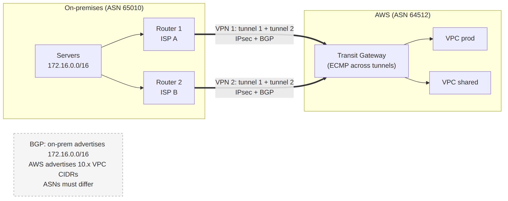

# 📚 Day 38 — Site-to-Site VPN ও BGP Routing Basics

> 📊 **Visual Summary** — সহজে বোঝার জন্য diagram:



**সময়:** ১.৫ ঘণ্টা | **Module:** ৬ (Multi-VPC & Private Connectivity) — Day 3

## 🎯 আজকের লক্ষ্য
- Hybrid connectivity কেন দরকার
- Site-to-Site VPN-এর component: Customer Gateway, Virtual Private Gateway / Transit Gateway, দুটো tunnel
- Static বনাম dynamic (BGP) routing
- **BGP basics**: ASN, route advertisement, path selection
- VGW বনাম TGW-তে VPN; ECMP; Accelerated VPN
- High availability design
- Client VPN (সংক্ষেপে)
- Troubleshooting

---

## Part 1: Hybrid Connectivity কেন?

বেশিরভাগ প্রতিষ্ঠান একদিনে পুরো cloud-এ যায় না। কিছু জিনিস থাকে অফিসের **data center (on-premises)**-এ:
- পুরনো database বা ERP
- Active Directory
- Factory/branch office-এর device
- Compliance-এর কারণে কিছু data

AWS-এর app-কে এগুলোর সাথে **private IP দিয়ে, নিরাপদে** কথা বলতে হয়। দুটো মূল উপায়:

| | **Site-to-Site VPN** (আজ) | **Direct Connect** (Day 39) |
|---|---|---|
| পথ | Public internet-এর উপর **IPsec encrypted tunnel** | **Dedicated private line** |
| Setup | **মিনিটে** | সপ্তাহ থেকে মাস |
| Bandwidth | প্রতি tunnel ~১.২৫ Gbps (ECMP দিয়ে বেশি) | ১ থেকে ৪০০ Gbps |
| Latency | Internet-এর উপর নির্ভর, ওঠানামা করে | স্থির, কম |
| Encryption | ✅ built-in | ❌ default-এ না (MACsec / VPN over DX) |
| খরচ | কম | বেশি (port-hour), কিন্তু data out সস্তা |

---

## Part 2: Site-to-Site VPN-এর Component

```
On-premises                                        AWS
┌─────────────────────┐                ┌────────────────────────────────┐
│ Server 172.16.1.10  │                │ VPC 10.1.0.0/16                │
│        │            │  Tunnel 1 ════►│ AWS endpoint (AZ-a) ┐          │
│  Customer router    │  (IPsec)       │                      ├─ VGW / TGW
│  (Customer Gateway  │  Tunnel 2 ════►│ AWS endpoint (AZ-b) ┘          │
│   device, public IP)│                │                                │
└─────────────────────┘                └────────────────────────────────┘
```

| Component | কী | কোথায় |
|---|---|---|
| **Customer Gateway device** | আপনার physical/software router বা firewall (Cisco, Juniper, Fortinet, pfSense...) | On-prem |
| **Customer Gateway (CGW)** | AWS-এ ঐ device-এর **বর্ণনা**: public IP, BGP ASN | AWS resource |
| **Virtual Private Gateway (VGW)** | একটা VPC-র সাথে যুক্ত AWS-পাশের VPN endpoint | একটা VPC-তে attach |
| **Transit Gateway (TGW)** | বিকল্প AWS-পাশ: একটা VPN অনেক VPC-র জন্য (Day 37) | Region-এ |
| **VPN connection** | CGW আর VGW/TGW-এর মধ্যে সংযোগ | — |
| **Tunnel** | প্রতিটা VPN connection-এ **দুটো** IPsec tunnel, AWS-এর দুটো আলাদা endpoint-এ | HA-র জন্য |

### Setup (সংক্ষেপে)
```bash
# 1. Customer Gateway
aws ec2 create-customer-gateway --type ipsec.1 --public-ip 203.0.113.10 --bgp-asn 65010

# 2. Virtual Private Gateway (বা TGW ব্যবহার করুন)
aws ec2 create-vpn-gateway --type ipsec.1 --amazon-side-asn 64512
aws ec2 attach-vpn-gateway --vpn-gateway-id vgw-0abc --vpc-id vpc-app

# 3. VPN connection (dynamic = BGP)
aws ec2 create-vpn-connection --type ipsec.1 \
  --customer-gateway-id cgw-0abc --vpn-gateway-id vgw-0abc

# 4. Configuration download → on-prem router-এ বসান (device অনুযায়ী ready file)
# 5. VPC route table-এ route propagation চালু (VGW-এর ক্ষেত্রে)
aws ec2 enable-vgw-route-propagation --route-table-id rtb-app --gateway-id vgw-0abc
```

> ⚠️ **দুটো tunnel-ই configure করুন।** AWS মাঝে মাঝে maintenance-এর জন্য একটা tunnel বন্ধ করে। একটা tunnel-এ চললে তখন সংযোগ বিচ্ছিন্ন হবে।

---

## Part 3: Static বনাম Dynamic (BGP) Routing

AWS-কে জানতে হবে on-prem-এর কোন IP range এই VPN দিয়ে যাবে, আর on-prem-কে জানতে হবে VPC-র range।

| | **Static** | **Dynamic (BGP)** |
|---|---|---|
| Route কীভাবে | হাতে লিখে দেন (`172.16.0.0/16`) | Router-গুলো **BGP দিয়ে নিজেরাই জানিয়ে দেয়** |
| নতুন subnet যোগ হলে | হাতে update করতে হয় | নিজে থেকে advertise হয় |
| Tunnel failover | ধীর, সীমিত (dead peer detection-এর উপর নির্ভর) | **দ্রুত, স্বয়ংক্রিয়** (একটা tunnel গেলে route সরে যায়) |
| Device support | সব device | BGP support লাগে |
| কখন | ছোট, সহজ setup, BGP সমর্থন নেই | **Production-এ recommended** |

---

## Part 4: BGP Basics — যতটুকু জানা দরকার

**BGP (Border Gateway Protocol)** = internet আর বড় network-গুলো যে protocol দিয়ে একে অপরকে জানায় "আমার কাছে এই IP range আছে, আমার দিয়ে পাঠাও।"

### মূল শব্দ

| শব্দ | মানে |
|---|---|
| **AS (Autonomous System)** | এক প্রশাসনের অধীন একটা network (আপনার office, AWS-এর VGW) |
| **ASN** | AS-এর নম্বর। Private ASN: **64512–65534** (16-bit); AWS side-এর default **64512** |
| **BGP peer / session** | দুটো router-এর মধ্যে BGP কথাবার্তা (প্রতি tunnel-এ একটা session) |
| **Advertise / announce** | "আমি এই prefix-এ পৌঁছাতে পারি" জানানো |
| **Prefix** | CIDR block (যেমন `172.16.0.0/16`) |
| **AS_PATH** | Route কোন কোন AS পার হয়ে এসেছে তার তালিকা |

### ⚠️ ASN যেন না মেলে
On-prem router আর AWS-এর VGW/TGW-এর ASN **আলাদা** হতে হবে (যেমন on-prem 65010, AWS 64512)। একাধিক office থাকলে প্রতিটার আলাদা ASN দিন।

### কী আদান-প্রদান হয়
```
On-prem router → AWS:  "172.16.0.0/16 আমার কাছে"
AWS (VGW/TGW) → On-prem: "10.1.0.0/16 আমার কাছে"
```

### AWS কীভাবে পথ বাছে (একই destination-এর একাধিক route থাকলে)
1. **Longest prefix match সবার আগে**: `172.16.5.0/24` আর `172.16.0.0/16` দুটো থাকলে, `172.16.5.x`-এর জন্য `/24` জেতে। এটাই সবচেয়ে শক্তিশালী নিয়ন্ত্রণ
2. একই prefix হলে: **static route > propagated route**
3. Propagated-এর মধ্যে: **Direct Connect BGP > static VPN > BGP VPN** (DX সবচেয়ে পছন্দের)
4. একাধিক VPN-এ একই prefix হলে **AS_PATH ছোট** যেটার (কম AS পার হয়েছে)

### Traffic নিয়ন্ত্রণের কৌশল
- **AS_PATH prepending**: on-prem router backup পথে নিজের ASN কয়েকবার বাড়িয়ে advertise করে (`65010 65010 65010`), ফলে AWS সেই পথকে "লম্বা" ভেবে কম পছন্দ করে
- **More specific prefix**: যে পথ দিয়ে traffic চান সেখানে ছোট (বেশি নির্দিষ্ট) prefix advertise করা
- Direct Connect-এ BGP community tag (Day 39)

---

## Part 5: VPN on VGW বনাম VPN on TGW

| | **VGW** | **TGW** |
|---|---|---|
| কতগুলো VPC পায় | শুধু যে VPC-তে attached | TGW-তে যুক্ত **সব VPC** (route table অনুযায়ী) |
| **ECMP** (একাধিক tunnel-এ ভার ভাগ) | ❌ (একটা tunnel active, অন্যটা standby) | ✅ দুটো (বা অনেক VPN connection-এর সব) tunnel একসাথে, bandwidth যোগ হয় |
| **Accelerated VPN** | ❌ | ✅ |
| খরচ | VPN connection-hour | VPN connection-hour + TGW attachment + processing |
| কখন | একটা VPC, সহজ | একাধিক VPC, বেশি bandwidth |

### ECMP দিয়ে bandwidth বাড়ানো
প্রতি tunnel ~১.২৫ Gbps। TGW-তে ৪টা VPN connection (৮টা tunnel) BGP + ECMP দিয়ে একসাথে চালালে মোট throughput অনেক বেশি পাওয়া যায়। (নতুন অপশনে বেশি bandwidth-এর tunnel-ও আছে, সর্বশেষ docs দেখুন।)

### Accelerated Site-to-Site VPN
Tunnel-এর AWS endpoint **Global Accelerator**-এর edge location-এ। On-prem থেকে কাছের edge পর্যন্ত internet, তারপর AWS backbone। দূরের office-এর জন্য latency ও jitter কমে। শুধু TGW-তে।

---

## Part 6: High Availability Design

```
Level 1 (ন্যূনতম):    1 router  ──2 tunnels──► AWS
Level 2 (ভালো):       2 router (আলাদা ISP)  ──প্রতিটা থেকে 1 VPN (2 tunnels)──► AWS   = 4 tunnels
Level 3 (production): Direct Connect (primary) + VPN (backup)   ← Day 39
```

- দুটো on-prem router, সম্ভব হলে **দুটো আলাদা ISP**, প্রতিটার আলাদা CGW আর VPN connection
- BGP দিয়ে failover স্বয়ংক্রিয়
- CloudWatch metric **`TunnelState`** (1 = up, 0 = down)-এ alarm
- VPN connection-এর **tunnel options**: IKE version (IKEv2 ভালো), encryption algorithm, DPD timeout, আর AWS বা on-prem কে tunnel শুরু করবে

---

## Part 7: Client VPN (সংক্ষেপে)

Site-to-Site VPN = **network থেকে network** (office ↔ VPC)।
**AWS Client VPN** = **একজন user-এর laptop থেকে** VPC-তে (OpenVPN-ভিত্তিক, managed)।

- Authentication: Active Directory, SAML (SSO), বা certificate (mutual TLS)
- Authorization rule দিয়ে কোন user group কোন subnet-এ যেতে পারবে
- **Split tunnel**: শুধু VPC-র traffic VPN দিয়ে, বাকি internet সরাসরি
- ব্যবহার: remote developer-এর private resource access

> শুধু shell বা port forwarding লাগলে **SSM Session Manager** (Day 16) সহজ আর সস্তা। পুরো network access লাগলে Client VPN।

---

## Part 8: Troubleshooting

| সমস্যা | কী দেখবেন |
|---|---|
| Tunnel DOWN | On-prem router-এর config (pre-shared key, IKE/IPsec parameter), firewall-এ **UDP 500 ও 4500** খোলা (NAT-T), public IP ঠিক আছে কিনা |
| Tunnel UP, কিন্তু traffic যায় না | **Route**: VPC route table-এ propagation চালু (VGW) বা TGW route; on-prem router-এ VPC CIDR-এর route |
| BGP session down | ASN মিলছে কিনা (দুই পাশ আলাদা), BGP neighbor IP (tunnel inside IP) ঠিক কিনা |
| শুধু এক দিকে traffic | Security group, NACL (stateless!), on-prem firewall |
| মাঝে মাঝে tunnel পড়ে যায় | DPD আর rekey setting; idle থাকলে tunnel নেমে যেতে পারে |
| Throughput কম | প্রতি tunnel-এর সীমা; TGW + ECMP বিবেচনা করুন |

**Log:** VPN connection-এ **tunnel activity logs** চালু করে CloudWatch Logs-এ IKE/BGP ঘটনা দেখা যায়।

---

## Part 9: Hands-on Lab (simulation)

আসল on-prem router না থাকলে **অন্য region-এর একটা VPC-তে software router** (যেমন EC2-তে strongSwan বা Libreswan) চালিয়ে "office" বানানো যায়:
1. "Office" VPC (172.16.0.0/16, অন্য region) + EC2 (Elastic IP সহ) + strongSwan
2. App VPC (10.1.0.0/16) + VGW + CGW (office EC2-র EIP দিয়ে) + VPN connection (static routing দিয়ে সহজে শুরু)
3. Download করা generic configuration দিয়ে strongSwan setup (দুটো tunnel)
4. Console-এ tunnel status UP দেখুন, VGW route propagation চালু করুন
5. Office EC2-র source/destination check বন্ধ করুন, আর office VPC-র route table-এ `10.1.0.0/16 → office EC2`
6. App VPC-র instance-এ ping ✅
7. একটা tunnel বন্ধ করে দেখুন অন্যটায় চলে কিনা
8. সব মুছে ফেলুন (VPN connection-এর hourly খরচ আছে)

---

## 🎯 আজকের মূল Takeaways

1. Site-to-Site VPN = internet-এর উপর IPsec, মিনিটে setup, প্রতি tunnel ~১.২৫ Gbps
2. Component: **CGW** (আপনার router-এর বর্ণনা), **VGW বা TGW** (AWS পাশ), প্রতি connection-এ **২টা tunnel**
3. **BGP (dynamic)** production-এ ভালো: স্বয়ংক্রিয় route আর failover; দুই পাশের ASN আলাদা
4. Path selection: **longest prefix** → static > propagated → DX > VPN → ছোট AS_PATH
5. **TGW-তে VPN**: অনেক VPC, **ECMP**, Accelerated VPN
6. HA: দুটো router, আলাদা ISP, `TunnelState` alarm
7. **Client VPN** = user → VPC; Site-to-Site = network → network

---

## 📝 Self-check Questions

1. প্রতিটা VPN connection-এ কয়টা tunnel থাকে, আর কেন?
2. Static আর BGP routing-এর মধ্যে production-এ কোনটা, কেন?
3. On-prem আর AWS দুই পাশেই ASN 65000 দিলে কী হবে?
4. একই `172.16.0.0/16` VPN আর Direct Connect দুটো দিয়ে advertise হচ্ছে। AWS কোনটা দিয়ে পাঠাবে?
5. ৫ Gbps দরকার, কিন্তু VPN ছাড়া অন্য কিছু এখন সম্ভব না। কী করবেন?
6. Tunnel UP কিন্তু ping যায় না। কোন দুটো জায়গায় route দেখবেন?
7. Remote developer-কে পুরো private subnet-এ access দিতে কী ব্যবহার করবেন?

<details><summary>▶ উত্তর দেখুন</summary>

1. দুটো, AWS-এর দুটো আলাদা endpoint-এ; একটা maintenance বা ব্যর্থতায় বন্ধ হলে অন্যটা চলে।
2. BGP: route স্বয়ংক্রিয়ভাবে আদান-প্রদান হয় আর tunnel failover দ্রুত হয়।
3. BGP session ঠিকমতো কাজ করবে না (একই AS মনে করে route বাতিল করে); দুই পাশের ASN আলাদা হতে হবে।
4. Direct Connect (একই prefix-এ DX-কে VPN-এর চেয়ে বেশি পছন্দ করে)।
5. TGW-তে একাধিক VPN connection, BGP + ECMP দিয়ে সব tunnel একসাথে ব্যবহার।
6. AWS পাশে VPC route table (propagation বা TGW route) আর on-prem router-এ VPC CIDR-এর route (আর SG/NACL/firewall)।
7. AWS Client VPN (শুধু shell বা port লাগলে SSM Session Manager)।
</details>

---

## 💡 Pro Tips

- On-prem router-এর জন্য AWS console থেকে **device-specific config download** করুন, হাতে লেখার ভুল কমে
- VPN-কে **TGW**-তে রাখুন যদি ভবিষ্যতে একাধিক VPC হতে পারে; পরে বদলানো ঝামেলা
- Pre-shared key আর certificate নিরাপদে রাখুন (Secrets Manager)
- VPN-কে Direct Connect-এর **backup** হিসেবে রাখা খুব common আর সস্তা
- On-prem থেকে কী advertise হচ্ছে দেখতে VGW/TGW route table-এ propagated route দেখুন

---

## 🎨 Quick Reference

```
CGW (your router: public IP + ASN) ══2 IPsec tunnels══ VGW (1 VPC) | TGW (many VPCs, ECMP, accelerated)
Per tunnel ≈ 1.25 Gbps | UDP 500/4500 | IKEv2 recommended
Routing: static | BGP (recommended); ASN private 64512–65534; AWS default 64512
Path selection: longest prefix → static > propagated → DX > static VPN > BGP VPN → shorter AS_PATH
Monitor: TunnelState metric, tunnel activity logs
Client VPN = user laptop → VPC (OpenVPN, SAML/AD/cert)
```

---

## 🚨 বাস্তব পরিস্থিতি (যেসব ভুল প্রায়ই হয়)

**পরিস্থিতি ১:** On-prem router-এ শুধু tunnel 1 configure করা ছিল। AWS-এর নির্ধারিত maintenance-এর রাতে tunnel 1 বন্ধ হলো, আর office ২ ঘণ্টা AWS-এর সাথে বিচ্ছিন্ন থাকল।
**শিক্ষা:** দুটো tunnel-ই configure করুন, BGP দিয়ে failover।

**পরিস্থিতি ২:** নতুন office network-এর ASN AWS-এর default 64512-এর সাথে মিলে গিয়েছিল। BGP session কখনো ঠিকমতো উঠল না।
**শিক্ষা:** ASN plan আগে থেকে; দুই পাশ আলাদা।

**পরিস্থিতি ৩:** VPN UP ছিল, কিন্তু VGW route propagation চালু করা হয়নি। App team এক দিন ধরে firewall সন্দেহ করল।
**শিক্ষা:** Tunnel UP মানেই route নেই; VPC route table দেখুন।

---

**⏮ আগের দিন:** [Day 37 — Transit Gateway](./Day-37-Transit-Gateway-Route-Tables-Segmentation.md) | **⏭ পরের দিন:** [Day 39 — Direct Connect](./Day-39-Direct-Connect-DX-Gateway-VPN-over-DX.md)
