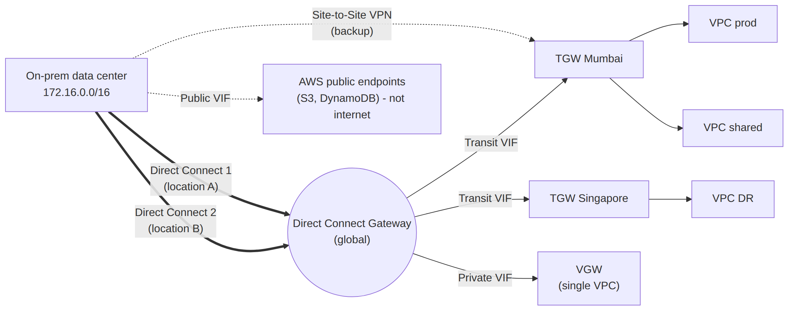

# 📚 Day 39 — AWS Direct Connect, Direct Connect Gateway ও VPN over DX

> 📊 **Visual Summary** — সহজে বোঝার জন্য diagram:



**সময়:** ২ ঘণ্টা | **Module:** ৬ (Multi-VPC & Private Connectivity) — Day 4

## 🎯 আজকের লক্ষ্য
- Direct Connect (DX) কী, কখন VPN-এর বদলে
- Dedicated বনাম Hosted connection
- **Virtual Interface (VIF)**: Private, Public, Transit
- **Direct Connect Gateway**: অনেক region আর VPC-তে একটা DX
- Resiliency model আর LAG
- Encryption: MACsec আর **VPN over Direct Connect**
- DX primary + VPN backup, BGP দিয়ে traffic নিয়ন্ত্রণ

---

## Part 1: Direct Connect কী?

**AWS Direct Connect** = আপনার data center/office থেকে AWS-এ একটা **dedicated, private physical network connection**, public internet ছাড়া।

```
Your data center ──(আপনার/partner-এর line)──► DX Location (colocation facility)
                                                  [আপনার router] ══cross-connect══ [AWS DX router]
                                                                                        │
                                                                                   AWS backbone → Region
```

- **DX Location** = AWS-এর router যেখানে আছে এমন colocation data center (বিশ্বের বড় শহরগুলোতে)
- **Cross-connect** = ঐ facility-র ভেতরে আপনার (বা partner-এর) router থেকে AWS router পর্যন্ত physical cable

### কেন DX?

| সুবিধা | ব্যাখ্যা |
|---|---|
| **Consistent performance** | Internet-এর congestion নেই; latency স্থির |
| **বেশি bandwidth** | ১, ১০, ১০০, ৪০০ Gbps (dedicated) |
| **কম data transfer খরচ** | AWS থেকে বাইরে যাওয়া data-র per-GB দাম internet-এর চেয়ে কম (বেশি data হলে বড় সাশ্রয়) |
| **Private** | Traffic public internet-এ যায় না |
| **Compliance** | কিছু নিয়মে dedicated সংযোগ দরকার |

### অসুবিধা
- Setup-এ **সপ্তাহ থেকে মাস** (physical cable, partner, LOA-CFA কাগজপত্র)
- **Default-এ encrypted না**
- একটা connection = একটা single point of failure (HA-র জন্য একাধিক লাগে)
- খরচ বেশি (port-hour + partner/circuit)

---

## Part 2: Dedicated বনাম Hosted Connection

| | **Dedicated** | **Hosted** |
|---|---|---|
| কে দেয় | AWS সরাসরি আপনাকে একটা physical port | **AWS Direct Connect Partner** তাদের port থেকে ভাগ করে |
| Speed | **১, ১০, ১০০, ৪০০ Gbps** | **৫০ Mbps থেকে ২৫ Gbps** পর্যন্ত বিভিন্ন ধাপ |
| VIF সংখ্যা | অনেক (৫০টা পর্যন্ত) | সাধারণত **একটা** VIF |
| Setup | AWS-এ request → LOA-CFA → cross-connect | Partner-এর মাধ্যমে, সাধারণত দ্রুত |
| **MACsec** | ✅ (নির্দিষ্ট speed-এ) | ❌ |
| কখন | বড় প্রতিষ্ঠান, DX location-এ উপস্থিতি আছে | ছোট/মাঝারি bandwidth, দ্রুত শুরু |

> **LOA-CFA** (Letter of Authorization – Connecting Facility Assignment) = AWS-এর দেওয়া অনুমতিপত্র, যেটা নিয়ে facility-কে cross-connect বসাতে বলা হয়।

---

## Part 3: Virtual Interfaces (VIF) — একটা Cable, অনেক ব্যবহার

একটা DX connection-এর উপর **VLAN (802.1Q)** দিয়ে কয়েকটা logical interface বানানো যায়। প্রতিটা VIF-এ আলাদা **BGP session**।

| VIF | কোথায় পৌঁছায় | ব্যবহার |
|---|---|---|
| **Private VIF** | একটা VPC-র **VGW**, অথবা **DX Gateway** (→ অনেক VPC-র VGW) | Private IP দিয়ে VPC-র resource |
| **Transit VIF** | **DX Gateway → Transit Gateway** | TGW-তে যুক্ত সব VPC (Day 37) |
| **Public VIF** | AWS-এর **public endpoint** (S3, DynamoDB-র public IP, সব region) | Internet ছাড়া public AWS service; VPN over DX (Part 6) |

```
DX connection (10 Gbps)
 ├── VLAN 101: Private VIF  → DX Gateway → VGW (VPC prod), VGW (VPC dev)
 ├── VLAN 102: Transit VIF  → DX Gateway → TGW (অনেক VPC)
 └── VLAN 103: Public VIF   → S3, DynamoDB public endpoints
```

> ⚠️ **Public VIF দিয়ে internet access পাবেন না**, শুধু AWS-এর public IP range। আর Public VIF-এ AWS সব AWS public prefix আপনার router-কে advertise করে; ফিল্টার করে শুধু দরকারি region/service রাখতে পারেন।

---

## Part 4: Direct Connect Gateway (DXGW)

**সমস্যা:** Private VIF সরাসরি একটা VGW-এ গেলে সেটা একটা VPC, একটা region। ৫টা region-এ ২০টা VPC থাকলে?

**সমাধান: Direct Connect Gateway** = একটা **global** resource, যেটা এক DX connection (বা অনেকগুলো)-কে **যেকোনো region-এর** অনেক VGW বা TGW-এর সাথে যুক্ত করে।

```
On-prem ══ DX (Mumbai location) ══ Private VIF ══► DXGW (global)
                                                     ├──► VGW (Mumbai VPC)
                                                     ├──► VGW (Singapore VPC)
                                                     └──► VGW (Frankfurt VPC)
On-prem ══ DX ══ Transit VIF ══► DXGW ──► TGW (Mumbai) ──► ২০টা VPC
                                      └──► TGW (Frankfurt)
```

### মনে রাখুন
- DXGW **global**, কিন্তু যেসব VPC/TGW যুক্ত তাদের **CIDR overlap** করা যাবে না
- DXGW দিয়ে **VPC থেকে VPC-তে** (বা region থেকে region-এ) traffic যায় না। এটা শুধু **on-prem ↔ AWS**। VPC↔VPC-র জন্য TGW/peering
- **Cross-account**: অন্য account-এর VGW/TGW-কে association proposal দিয়ে যুক্ত করা যায়
- Allowed prefixes: কোন VPC CIDR on-prem-এ advertise হবে তা নিয়ন্ত্রণ

---

## Part 5: Resiliency — একটা DX কখনো যথেষ্ট না

একটা DX = একটা cable, একটা router, একটা location। যেকোনোটা নষ্ট হলে সব বন্ধ।

| Model | কীভাবে | কখন |
|---|---|---|
| **Maximum resiliency** | **২টা আলাদা DX location**, প্রতিটায় **২টা connection** (মোট ৪) | Mission-critical |
| **High resiliency** | **২টা আলাদা location**, প্রতিটায় ১টা connection | Critical production |
| **Development/test** | ১টা location-এ ২টা connection (আলাদা device) | Non-critical |
| **DX + VPN backup** | ১টা DX + Site-to-Site VPN | খরচ কম রেখে কিছুটা নিরাপত্তা |

- **Direct Connect Resiliency Toolkit** (console wizard) দিয়ে এই model বেছে order করা যায়
- **Failover test** feature দিয়ে BGP session ইচ্ছা করে বন্ধ করে পরীক্ষা করা যায়

### LAG (Link Aggregation Group)
একই location-এর কয়েকটা dedicated connection (একই speed) জুড়ে **একটা logical connection**: bandwidth যোগ হয় (যেমন ৪ × ১০ Gbps = ৪০ Gbps)। তবে সব একই location-এ, তাই location-level HA দেয় না।

---

## Part 6: Encryption — DX নিজে encrypted না!

### উপায় ১: MACsec (Layer 2)
- Dedicated connection-এর নির্দিষ্ট speed-এ (১০/১০০/৪০০ Gbps) আর সমর্থিত location-এ
- আপনার router থেকে AWS router পর্যন্ত link encrypted, line-rate performance
- Router-এ MACsec support লাগে

### উপায় ২: IPsec VPN over Direct Connect
DX-এর উপর দিয়ে Site-to-Site VPN চালানো: DX-এর consistent পথ **আর** IPsec encryption।

| পদ্ধতি | কীভাবে |
|---|---|
| **Public VIF + VPN** | Public VIF দিয়ে AWS-এর VPN endpoint-এর public IP-তে পৌঁছানো, তারপর IPsec tunnel। Traffic internet-এ যায় না, DX দিয়েই যায় |
| **Private IP VPN (TGW)** | **Transit VIF** দিয়ে TGW-এর **private IP**-তে VPN tunnel; public IP-র দরকারই নেই |

> Trade-off: VPN tunnel-এর throughput সীমা (প্রতি tunnel ~১.২৫ Gbps) DX-এর পুরো bandwidth ব্যবহার করতে দেয় না; ECMP (TGW) দিয়ে কিছুটা বাড়ানো যায়। বেশি bandwidth + encryption দরকার হলে MACsec।

> 💡 App-level encryption (TLS/HTTPS) থাকলে অনেক ক্ষেত্রে network-level encryption ছাড়াই compliance পূরণ হয়। Requirement দেখে ঠিক করুন।

---

## Part 7: DX Primary + VPN Backup — BGP দিয়ে নিয়ন্ত্রণ

```
On-prem ══ DX (primary) ══► DXGW ─┐
        ═══ VPN (backup) ════════─┴─► TGW / VGW ──► VPCs
```

### AWS → On-prem traffic (AWS পথ বাছে)
Day 38-এর নিয়ম: একই prefix-এ **DX-কে VPN-এর চেয়ে বেশি পছন্দ করে**। তাই স্বাভাবিকভাবেই DX primary, DX পড়ে গেলে BGP route সরে যায় আর VPN-এ চলে যায়।

⚠️ **ফাঁদ:** VPN দিয়ে যদি **বেশি নির্দিষ্ট prefix** advertise হয় (যেমন VPN-এ `172.16.1.0/24`, DX-এ `172.16.0.0/16`), তাহলে **longest prefix match**-এর কারণে ঐ subnet-এর traffic **VPN দিয়ে** যাবে! দুই পথে **একই prefix** advertise করুন।

### On-prem → AWS traffic (আপনার router পথ বাছে)
On-prem router-এ **local preference** দিয়ে DX-কে পছন্দের পথ বানান।

### BGP Community (DX-এর বিশেষ সুবিধা)
একাধিক DX connection-এর মধ্যে AWS কোনটা পছন্দ করবে তা আপনি **community tag** দিয়ে বলে দিতে পারেন:

| Community | Preference |
|---|---|
| `7224:7300` | সবচেয়ে বেশি পছন্দ |
| `7224:7200` | মাঝারি |
| `7224:7100` | সবচেয়ে কম |

উদাহরণ: Mumbai-র DX-এ `7224:7300`, Chennai-র DX-এ `7224:7100` → স্বাভাবিকভাবে Mumbai (active/passive)।

Public VIF-এ scope community (যেমন শুধু local region-এ advertise) দিয়ে AWS prefix কতদূর ছড়াবে তা-ও নিয়ন্ত্রণ করা যায়।

---

## Part 8: খরচ ও সিদ্ধান্ত

### খরচের অংশ
- **Port-hour** (connection speed অনুযায়ী)
- **Data transfer out** (AWS → on-prem, DX rate, internet-এর চেয়ে কম)
- Data transfer in (on-prem → AWS): free
- DX partner/circuit provider-এর বিল (AWS-এর বাইরে)
- Cross-connect fee (facility)

### VPN বনাম DX সিদ্ধান্ত

| প্রশ্ন | VPN | DX |
|---|---|---|
| আজই দরকার? | ✅ | ❌ |
| মাসে কয়েক TB-র বেশি data out? | খরচ বেশি | ✅ সাশ্রয় |
| স্থির latency জরুরি (voice, trading, DB replication)? | ❌ | ✅ |
| ১০ Gbps+ bandwidth? | কঠিন | ✅ |
| Budget কম, ছোট office? | ✅ | ❌ |

👉 সবচেয়ে common production: **DX (resilient) + VPN backup**, সাথে **Transit VIF → DXGW → TGW**।

---

## Part 9: Troubleshooting

| সমস্যা | দেখুন |
|---|---|
| Connection DOWN | Physical layer: cross-connect, optic (light level), port; partner-এর সাথে যোগাযোগ |
| Connection UP, VIF DOWN | VLAN ID মিলছে কিনা, BGP peer IP, ASN, MD5 auth key |
| BGP UP, কিন্তু traffic নেই | Advertised prefix (দুই দিকে), DXGW allowed prefixes, VPC/TGW route table, SG/NACL |
| Traffic VPN দিয়ে যাচ্ছে, DX দিয়ে না | VPN-এ বেশি নির্দিষ্ট prefix advertise হচ্ছে (longest prefix match) |
| Throughput কম | VPN over DX-এর tunnel সীমা, বা LAG/connection speed |

**Monitor:** CloudWatch metric `ConnectionState`, `ConnectionBpsEgress/Ingress`, `VirtualInterfaceBpsEgress` ইত্যাদি; alarm দিন।

---

## 🎯 আজকের মূল Takeaways

1. DX = dedicated private line; consistent performance, বেশি bandwidth, কম data-out খরচ; setup সপ্তাহ–মাস
2. **Dedicated** (১–৪০০ Gbps, AWS সরাসরি) বনাম **Hosted** (৫০ Mbps–২৫ Gbps, partner)
3. VIF: **Private** (VGW/DXGW → VPC), **Transit** (DXGW → TGW), **Public** (AWS public endpoint, internet না)
4. **DX Gateway** = global; অনেক region-এর VGW/TGW; শুধু on-prem ↔ AWS, VPC↔VPC না
5. Resiliency: ২টা location, প্রতিটায় ২টা connection = maximum; অথবা DX + VPN backup
6. **Encryption নেই default-এ** → MACsec বা **VPN over DX** (Public VIF বা private IP VPN on TGW)
7. BGP: DX > VPN (একই prefix-এ), কিন্তু **longest prefix সবার আগে**; community `7224:7x00` দিয়ে DX-গুলোর মধ্যে preference

---

## 📝 Self-check Questions

1. ২ সপ্তাহের মধ্যে on-prem-কে AWS-এ যুক্ত করতে হবে, দীর্ঘমেয়াদে DX চাই। কী plan?
2. Private VIF আর Transit VIF-এর পার্থক্য কী?
3. তিনটা region-এর VPC-তে একটা DX দিয়ে পৌঁছাতে কী লাগবে?
4. Compliance বলছে DX-এর traffic encrypted হতে হবে। দুটো উপায় বলুন।
5. DX primary আর VPN backup, কিন্তু একটা subnet-এর traffic সবসময় VPN দিয়ে যাচ্ছে। কেন?
6. Mission-critical workload-এর জন্য DX resiliency কেমন design করবেন?
7. Public VIF দিয়ে কি on-prem থেকে internet browse করা যায়?

<details><summary>▶ উত্তর দেখুন</summary>

1. এখনই Site-to-Site VPN চালু; DX order দিন; DX আসলে সেটা primary আর VPN backup হিসেবে রাখুন।
2. Private VIF → VGW বা DXGW হয়ে VPC; Transit VIF → DXGW হয়ে Transit Gateway (অনেক VPC)।
3. Direct Connect Gateway, যার সাথে তিন region-এর VGW বা TGW associate করা (CIDR overlap ছাড়া)।
4. MACsec (সমর্থিত dedicated connection-এ), অথবা IPsec VPN over DX (Public VIF বা Transit VIF-এ private IP VPN)।
5. VPN দিয়ে ঐ subnet-এর বেশি নির্দিষ্ট prefix advertise হচ্ছে; longest prefix match DX-এর preference-এর আগে কাজ করে। দুই পথে একই prefix দিন।
6. Maximum resiliency: দুটো আলাদা DX location, প্রতিটায় দুটো connection (আলাদা device); দরকারে VPN backup-ও।
7. না; শুধু AWS-এর public IP range (S3, DynamoDB ইত্যাদি)-তে পৌঁছায়।
</details>

---

## 💡 Pro Tips

- DX order দেওয়ার আগে **VPN চালু করে** নিন; DX আসতে অনেক সময় লাগে
- নতুন design-এ **Transit VIF + DXGW + TGW** সবচেয়ে scalable
- Failover **নিয়মিত test** করুন (DX failover testing feature), না হলে দুর্যোগের দিনই প্রথম জানবেন যে backup কাজ করে না
- On-prem আর AWS-এর **IP plan** (Day 36) DX-এর আগে চূড়ান্ত করুন
- Hosted connection দিয়ে ছোট শুরু করে পরে dedicated-এ যাওয়া যায়

---

## 🎨 Quick Reference

```
Dedicated: 1/10/100/400 Gbps (AWS)      | Hosted: 50 Mbps–25 Gbps (partner), usually 1 VIF
VIFs: Private (VGW/DXGW→VPC) | Transit (DXGW→TGW) | Public (AWS public endpoints, not internet)
DXGW: global, many regions' VGW/TGW, on-prem↔AWS only, no overlapping CIDRs
Resiliency: max = 2 locations × 2 connections | high = 2 locations × 1 | + VPN backup
Encryption: MACsec (L2) | IPsec VPN over DX (Public VIF or private IP VPN via Transit VIF)
BGP: longest prefix first; DX preferred over VPN; communities 7224:7100/7200/7300
LAG: bundle same-location connections for bandwidth
```

---

## 🚨 বাস্তব পরিস্থিতি (যেসব ভুল প্রায়ই হয়)

**পরিস্থিতি ১:** Project-এর শেষ সপ্তাহে DX order দেওয়া হলো। Circuit আসতে ৬ সপ্তাহ লাগল, আর launch পিছিয়ে গেল।
**শিক্ষা:** DX-এর lead time বেশি; আগে VPN দিয়ে শুরু।

**পরিস্থিতি ২:** একটামাত্র DX ছিল, কোনো backup না। Facility-তে maintenance-এর সময় cable খুলে গেল, আর পুরো hybrid app ৫ ঘণ্টা বন্ধ।
**শিক্ষা:** Production-এ কমপক্ষে দুটো পথ (দুটো DX location, বা DX + VPN)।

**পরিস্থিতি ৩:** Backup VPN-এ network team ভুল করে `/24` advertise করেছিল, DX-এ `/16`। মাসের পর মাস একটা গুরুত্বপূর্ণ subnet-এর traffic ধীর VPN দিয়ে যাচ্ছিল।
**শিক্ষা:** দুই পথে একই prefix; নিয়মিত route table যাচাই।

---

**⏮ আগের দিন:** [Day 38 — Site-to-Site VPN ও BGP](./Day-38-Site-to-Site-VPN-BGP-Basics.md) | **⏭ পরের দিন:** [Day 40 — Organizations, RAM ও Shared VPC](./Day-40-Organizations-RAM-Shared-VPC-Multi-Account.md)
