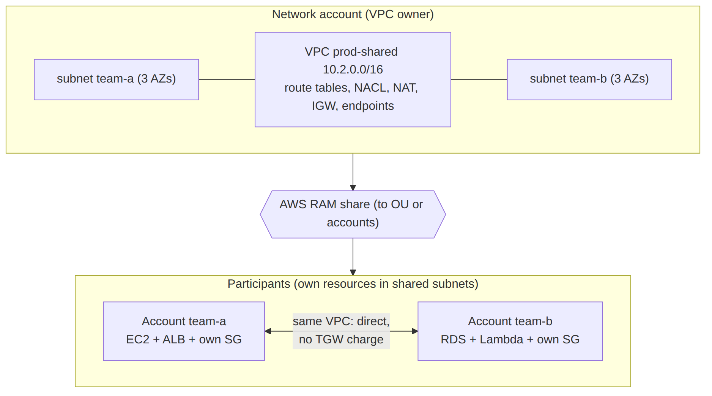
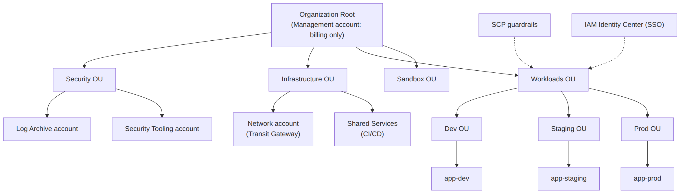

# 📚 Day 40 — AWS Organizations, RAM ও Shared VPC: Multi-account Network

> 📊 **Visual Summary** — সহজে বোঝার জন্য diagram:





**সময়:** ১.৫ ঘণ্টা | **Module:** ৬ (Multi-VPC & Private Connectivity) — Day 5

## 🎯 আজকের লক্ষ্য
- Multi-account strategy কেন, আর OU দিয়ে সাজানো
- Network-এর জন্য **Service Control Policy (SCP)** guardrail
- **AWS RAM (Resource Access Manager)**: কী কী share করা যায়
- **Shared VPC** (VPC sharing): owner আর participant
- **Network account** pattern: TGW, DX, egress, DNS এক জায়গায়
- Shared VPC বনাম আলাদা VPC + TGW: কখন কোনটা

> 📖 Organizations আর SCP-র মূল ধারণা Interview Q42 আর Q126-এ আছে; এখানে network-এর দিক থেকে গভীরে।

---

## Part 1: কেন Multi-account?

একটা account-এ সব রাখলে:
- একজনের ভুল (বা compromise) পুরো company-কে ক্ষতিগ্রস্ত করে
- Dev-এর কেউ ভুল করে prod database মুছে ফেলতে পারে
- কোন team কত খরচ করছে বোঝা কঠিন
- Service quota সবাই share করে

**Account = AWS-এর সবচেয়ে শক্ত isolation boundary।** তাই প্রতিটা workload/environment-এর আলাদা account।

### OU (Organizational Unit) structure (সংক্ষেপে)
```
Root (Management account: শুধু billing ও Organizations)
├── Security OU         → Log Archive, Security Tooling
├── Infrastructure OU   → Network account (TGW, DX, egress, DNS), Shared Services
├── Workloads OU
│    ├── Prod OU        → app-a-prod, app-b-prod
│    ├── Staging OU
│    └── Dev OU
├── Sandbox OU
└── Suspended OU
```

- **Control Tower** এই structure (landing zone) আর guardrail automatically বানিয়ে দেয়
- **Account Factory** দিয়ে নতুন account একই baseline-সহ তৈরি

---

## Part 2: Network-এর জন্য SCP Guardrail

SCP হলো **সর্বোচ্চ সীমা**: account-এর admin (এমনকি root)-ও এর বাইরে যেতে পারে না (management account বাদে)।

### উদাহরণ ১: Workload account-এ নিজে Internet Gateway বা VPC peering বানানো নিষেধ
সব internet egress আর যোগাযোগ network account দিয়ে যাবে, কেউ পাশ কাটাতে পারবে না।
```json
{
  "Version": "2012-10-17",
  "Statement": [{
    "Sid": "DenyNetworkBypass",
    "Effect": "Deny",
    "Action": [
      "ec2:CreateInternetGateway", "ec2:AttachInternetGateway",
      "ec2:CreateEgressOnlyInternetGateway",
      "ec2:CreateVpcPeeringConnection", "ec2:AcceptVpcPeeringConnection",
      "ec2:CreateVpnGateway", "ec2:CreateCustomerGateway",
      "directconnect:*"
    ],
    "Resource": "*",
    "Condition": {
      "ArnNotLike": { "aws:PrincipalArn": "arn:aws:iam::*:role/NetworkAdminRole" }
    }
  }]
}
```
> Network team-এর role-কে ছাড় দেওয়া আছে (`aws:PrincipalArn` condition)।

### উদাহরণ ২: শুধু অনুমোদিত region
```json
{
  "Effect": "Deny",
  "NotAction": ["iam:*", "organizations:*", "route53:*", "cloudfront:*", "support:*", "sts:*"],
  "Resource": "*",
  "Condition": { "StringNotEquals": { "aws:RequestedRegion": ["ap-south-1", "eu-west-1"] } }
}
```

### উদাহরণ ৩: VPC Flow Logs বন্ধ করা নিষেধ
`ec2:DeleteFlowLogs` deny → audit trail নষ্ট করা যাবে না।

> 💡 SCP permission **দেয় না**, শুধু **সীমা** দেয়। Account-এর ভেতরে IAM policy-ও লাগবে। নতুন SCP আগে একটা test OU-তে চালিয়ে দেখুন।

---

## Part 3: AWS RAM — Resource Share করা

**AWS Resource Access Manager (RAM)** = একটা account-এর resource অন্য account (বা পুরো Organization/OU)-এর সাথে **share** করার service। Copy না, একই resource সবাই ব্যবহার করে।

### Network-এর জন্য যা share করা যায় (গুরুত্বপূর্ণগুলো)

| Resource | কাজ |
|---|---|
| **VPC subnet** | Shared VPC (Part 4) |
| **Transit Gateway** | Workload account নিজের VPC attach করতে পারে (Day 37) |
| **Route 53 Resolver rule** | On-prem domain forward-এর rule সব account-এ (Day 41) |
| **Prefix list** (customer-managed) | SG/route-এ ব্যবহৃত IP list, এক জায়গায় update |
| **IPAM pool** | Account-গুলো নিজে VPC বানাতে pool থেকে CIDR নেয় (Day 36) |
| **Network Firewall policy**, **VPC Lattice service network** | Centralized security/service |

(Network ছাড়াও: License Manager config, Aurora DB cluster clone, Capacity Reservation ইত্যাদি।)

### কীভাবে
```bash
# Organization-এর সাথে sharing চালু (একবার, management account থেকে)
aws ram enable-sharing-with-aws-organization

# Network account থেকে TGW পুরো Workloads OU-এর সাথে share
aws ram create-resource-share --name tgw-share \
  --resource-arns arn:aws:ec2:ap-south-1:111111111111:transit-gateway/tgw-0abc \
  --principals arn:aws:organizations::999999999999:ou/o-abc123/ou-wkld-1234
```
- Organization-এর ভেতরে share করলে **accept করতে হয় না** (sharing চালু থাকলে)
- বাইরের account-এর সাথে share করলে invitation accept করতে হয়

---

## Part 4: Shared VPC (VPC Sharing)

**ধারণা:** একটা VPC-র মালিক (**owner**, সাধারণত network account) নিজের VPC-র **subnet** RAM দিয়ে অন্য account (**participant**)-এর সাথে share করে। Participant ঐ subnet-এ **নিজের** EC2, RDS, Lambda, ALB ইত্যাদি বানায়।

```
Network account (owner): VPC 10.1.0.0/16, subnets, route tables, NACL, IGW, NAT, TGW attachment
        │ RAM share: subnet-app-a, subnet-app-b
        ▼
Account "app-a" (participant): নিজের EC2 + SG, subnet-app-a-তে
Account "app-b" (participant): নিজের RDS + SG, subnet-app-b-তে
```

### কে কী করতে পারে?

| কাজ | Owner (network account) | Participant (app account) |
|---|---|---|
| VPC, subnet, route table, NACL, IGW, NAT, endpoint | ✅ তৈরি ও বদলানো | ❌ দেখতে পারে, বদলাতে পারে না |
| Participant-এর EC2/RDS/Lambda | ❌ বদলাতে পারে না | ✅ নিজের resource সম্পূর্ণ নিয়ন্ত্রণ |
| Security Group | নিজের SG | নিজের SG বানায়; **অন্য participant-এর SG reference করতে পারে** |
| Billing | VPC-র অংশ (NAT, endpoint...) | নিজের resource-এর খরচ নিজে দেয় |

### ✅ সুবিধা
- **কম VPC**: প্রতিটা account-এ আলাদা VPC, NAT, endpoint লাগে না, তাই খরচ আর জটিলতা কম
- **কম IP ব্যবহার** আর IP plan সহজ
- Network team central নিয়ন্ত্রণ রাখে; app team নিজের resource নিয়ন্ত্রণ করে (separation of duties)
- একই VPC, তাই resource-গুলো **TGW বা peering ছাড়াই** সরাসরি কথা বলে (কম latency, processing charge নেই)

### ⚠️ মনে রাখুন
- শুধু **একই AWS Organization**-এর account-এর সাথে (VPC sharing-এর জন্য)
- Default VPC share করা যায় না
- Participant account-এর isolation network level-এ কম (একই VPC); আলাদা করতে **আলাদা subnet + NACL + SG**
- একটা VPC-তে অনেক participant হলে VPC-র quota (যেমন ENI সংখ্যা, SG) মাথায় রাখুন

---

## Part 5: Shared VPC বনাম আলাদা VPC + Transit Gateway

| | **Shared VPC** | **প্রতি account আলাদা VPC + TGW** |
|---|---|---|
| VPC সংখ্যা | কম | অনেক |
| Account-এর মধ্যে traffic | সরাসরি (একই VPC) | TGW দিয়ে (processing charge) |
| Isolation | Subnet/SG-level | VPC-level (বেশি শক্ত) |
| App team-এর network স্বাধীনতা | কম (owner-এর উপর নির্ভর) | বেশি |
| NAT/endpoint | Shared, খরচ কম | প্রতি VPC বা centralized |
| কখন | একই environment-এর অনেক ছোট team/app যারা একে অপরের সাথে বেশি কথা বলে | আলাদা environment (prod বনাম dev), কঠোর isolation, বড় স্বাধীন team |

👉 বাস্তবে **দুটো মিলিয়ে**: প্রতিটা environment-এর জন্য একটা shared VPC (prod-shared, dev-shared), আর environment-গুলো TGW দিয়ে segmentation (Day 37)।

---

## Part 6: Network Account Pattern

একটা আলাদা **network account**-এ সব central network জিনিস:

```
Network account
 ├── Transit Gateway (RAM দিয়ে workload account-এ share)
 ├── Direct Connect + DX Gateway, Site-to-Site VPN (Day 38–39)
 ├── Egress VPC (centralized NAT, Day 37)
 ├── Inspection VPC (Network Firewall)
 ├── Shared VPCs (RAM subnet share)
 ├── Route 53 Resolver endpoints + rules (RAM share, Day 41)
 ├── Centralized interface VPC endpoints (Day 41)
 └── IPAM (Organization-wide IP plan)
```
- শুধু network team-এর access (SCP + IAM)
- Workload account-গুলোতে SCP দিয়ে network bypass নিষেধ (Part 2)
- সব IaC-তে (CloudFormation StackSets / Terraform), পরিবর্তন PR review দিয়ে

---

## Part 7: Hands-on Lab (Organization থাকলে)

> ⚠️ AWS Organizations আর একাধিক account লাগবে। Sandbox organization-এ করুন।

1. Management account-এ `aws ram enable-sharing-with-aws-organization`
2. Network account-এ VPC `shared-dev` (10.20.0.0/16) + দুটো private subnet + NAT
3. RAM দিয়ে একটা subnet `Dev` OU বা নির্দিষ্ট participant account-এর সাথে share
4. Participant account-এ console খুলে দেখুন: VPC আর subnet দেখা যাচ্ছে, কিন্তু route table বদলানো যাচ্ছে না
5. Participant account-এ ঐ subnet-এ একটা EC2 launch করুন (নিজের SG দিয়ে), internet-এ যেতে পারে কিনা দেখুন (owner-এর NAT দিয়ে)
6. একটা test OU-তে "Deny CreateInternetGateway" SCP লাগিয়ে IGW বানানোর চেষ্টা করুন → AccessDenied
7. সব পরিষ্কার করুন

---

## 🎯 আজকের মূল Takeaways

1. **Account = সবচেয়ে শক্ত isolation**; OU দিয়ে সাজানো; Control Tower দিয়ে landing zone
2. **SCP** দিয়ে network guardrail: IGW/peering/VPN নিজে বানানো নিষেধ, region সীমা, flow log মুছা নিষেধ
3. **RAM** = resource share (subnet, TGW, Resolver rule, prefix list, IPAM pool)
4. **Shared VPC**: owner নিয়ন্ত্রণ করে network, participant নিজের resource; একই Organization-এ
5. Shared VPC = কম VPC, কম খরচ, সরাসরি যোগাযোগ; আলাদা VPC + TGW = শক্ত isolation
6. **Network account** pattern: সব central networking এক জায়গায়, IaC আর সীমিত access

---

## 📝 Self-check Questions

1. Workload account-এর admin যেন নিজে Internet Gateway বানাতে না পারে, কীভাবে নিশ্চিত করবেন?
2. RAM দিয়ে network-এর কোন চারটা জিনিস share করা যায়?
3. Shared VPC-তে participant কি route table বদলাতে পারে? নিজের SG বানাতে পারে?
4. দশটা ছোট dev team, সবাই একে অপরের API call করে। Shared VPC নাকি আলাদা VPC + TGW?
5. Prod আর dev-এর মধ্যে শক্ত isolation চাই। কী design?
6. TGW একটা account-এ, VPC অন্য account-এ। কীভাবে attach করবেন?
7. Shared VPC-র NAT Gateway-র খরচ কে দেয়?

<details><summary>▶ উত্তর দেখুন</summary>

1. SCP-তে `ec2:CreateInternetGateway`/`AttachInternetGateway` deny (network admin role বাদে), Workloads OU-তে লাগানো।
2. VPC subnet, Transit Gateway, Route 53 Resolver rule, customer-managed prefix list, IPAM pool (যেকোনো চারটা)।
3. Route table বদলাতে পারে না (owner পারে); নিজের SG বানাতে পারে।
4. Shared VPC (dev-এর জন্য একটা): কম খরচ, সরাসরি যোগাযোগ, TGW processing charge নেই।
5. আলাদা VPC (বা আলাদা shared VPC) প্রতিটা environment-এর জন্য, TGW route table দিয়ে segmentation, আলাদা account/OU আর SCP।
6. Network account থেকে RAM দিয়ে TGW share; workload account নিজের VPC attach করে; network account attachment accept আর route table নিয়ন্ত্রণ করে।
7. VPC owner (network account); participant শুধু নিজের resource-এর খরচ দেয়।
</details>

---

## 💡 Pro Tips

- Resource share **OU-ভিত্তিক** করুন (নির্দিষ্ট account না), নতুন account OU-তে এলেই নিজে থেকে access পায়
- Shared VPC-র subnet-এর নাম আর tag-এ participant/team-এর নাম দিন
- Network account-এ break-glass access আর সব পরিবর্তনের CloudTrail alert
- IPAM pool OU অনুযায়ী ভাগ করে RAM দিয়ে share করলে team-গুলো নিজে VPC বানালেও overlap হয় না
- SCP লেখার আগে IAM Access Analyzer-এর policy validation আর test OU

---

## 🎨 Quick Reference

```
Org: Management (billing) → OUs (Security, Infrastructure, Workloads/Prod/Dev, Sandbox)
SCP = max permissions (not grants); network guardrails: deny IGW/peering/VPN/DX outside NetworkAdminRole
RAM shares: subnets (Shared VPC) | TGW | Resolver rules | prefix lists | IPAM pools
Shared VPC: owner = VPC/subnets/routes/NACL/NAT; participant = own EC2/RDS/SG; same Org only
Network account: TGW, DX/VPN, egress, inspection, shared VPCs, Resolver, endpoints, IPAM
```

```bash
aws ram enable-sharing-with-aws-organization
aws ram create-resource-share --name x --resource-arns <arn> --principals <ou-arn|account-id>
```

---

## 🚨 বাস্তব পরিস্থিতি (যেসব ভুল প্রায়ই হয়)

**পরিস্থিতি ১:** একটা app team নিজের account-এ Internet Gateway বানিয়ে central firewall পাশ কাটিয়ে সরাসরি internet-এ গেল। Security team অনেক দিন জানতেই পারেনি।
**শিক্ষা:** SCP guardrail + Config rule দিয়ে detect।

**পরিস্থিতি ২:** প্রতিটা ২০টা ছোট account-এর নিজের VPC, প্রতিটায় ৩টা NAT আর ১০টা interface endpoint। মাসিক network bill app-এর bill-এর চেয়ে বেশি হয়ে গেল।
**শিক্ষা:** Shared VPC আর centralized NAT/endpoint।

**পরিস্থিতি ৩:** RAM share নির্দিষ্ট account ID-তে করা হয়েছিল। নতুন account এলে প্রতিবার হাতে যোগ করতে ভুলে যাওয়া হতো।
**শিক্ষা:** OU-তে share করুন।

---

**⏮ আগের দিন:** [Day 39 — Direct Connect](./Day-39-Direct-Connect-DX-Gateway-VPN-over-DX.md) | **⏭ পরের দিন:** [Day 41 — Centralized PrivateLink ও Hybrid DNS](./Day-41-Centralized-PrivateLink-Endpoints-Hybrid-DNS.md)
