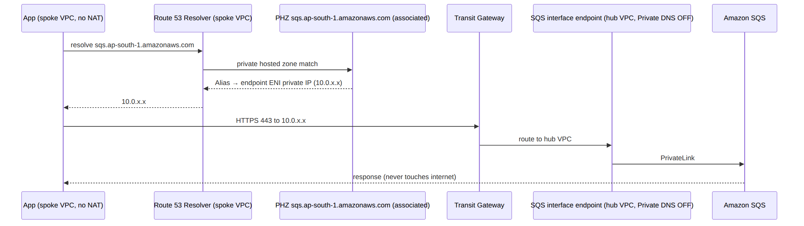
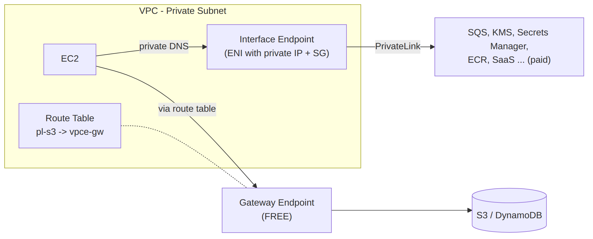

# 📚 Day 41 — Private Connectivity at Scale: Centralized Endpoints, PrivateLink Services ও Hybrid DNS

> 📊 **Visual Summary** — সহজে বোঝার জন্য diagram:





**সময়:** ২ ঘণ্টা | **Module:** ৬ (Multi-VPC & Private Connectivity) — Day 6

## 🎯 আজকের লক্ষ্য
- Endpoint-এর মূল ধারণা দ্রুত revision (Day 12)
- **Centralized interface endpoints**: ৫০টা VPC-তে আলাদা endpoint না বানিয়ে এক জায়গায়
- Endpoint-এর **DNS resolution** কীভাবে কাজ করে, আর Private Hosted Zone দিয়ে centralize করা
- **PrivateLink service** provider হিসেবে: অন্য account/customer-কে নিজের service দেওয়া
- **Hybrid DNS**: Route 53 Resolver inbound/outbound endpoint + RAM দিয়ে rule share
- VPC Lattice (সংক্ষেপে)

> 📖 Day 12 (VPC Endpoints & PrivateLink) আর Day 13 (Route 53 Resolver, Private Hosted Zone) আগে পড়ে নিন। আজ সেগুলোকে **multi-account আর hybrid** scale-এ নিয়ে যাব।

---

## Part 1: দ্রুত Revision

| | **Gateway endpoint** | **Interface endpoint (PrivateLink)** |
|---|---|---|
| Service | শুধু **S3, DynamoDB** | প্রায় সব AWS service + নিজের/partner-এর service |
| কীভাবে | Route table-এ entry | Subnet-এ **ENI** (private IP) |
| DNS | বদলায় না (public DNS, route দিয়ে redirect) | **Private DNS**: service-এর নাম ENI-র private IP-তে resolve |
| খরচ | **Free** | প্রতি AZ প্রতি ঘণ্টা + প্রতি GB |
| অন্য VPC / on-prem থেকে ব্যবহার | ❌ (edge-to-edge নেই) | ✅ (peering/TGW/VPN/DX দিয়ে) |

👉 আজকের পুরো কৌশল এই শেষ লাইনের উপর দাঁড়িয়ে: **interface endpoint অন্য জায়গা থেকেও ব্যবহার করা যায়**, তাই centralize করা সম্ভব।

---

## Part 2: সমস্যা — Endpoint-এর খরচ বিস্ফোরণ

ধরুন ৪০টা VPC, প্রতিটায় ১০টা service-এর interface endpoint (SSM, SSM messages, EC2 messages, KMS, Secrets Manager, SQS, SNS, ECR API, ECR DKR, CloudWatch Logs), প্রতিটা ৩টা AZ-এ:
```
40 VPC × 10 endpoint × 3 AZ = 1,200 endpoint-ENI ঘণ্টা প্রতি ঘণ্টায়
```
প্রতি মাসে বড় একটা bill, আর ১২০০টা জিনিস manage করা।

### ✅ সমাধান: Centralized Interface Endpoints
সব interface endpoint একটা **shared-services (hub) VPC**-তে বানান, বাকি VPC-গুলো **TGW** দিয়ে সেখানে পৌঁছায়।
```
Spoke VPCs ──TGW──► Hub VPC (endpoints: ssm, kms, sqs, secretsmanager, ecr...)
```
- ১০টা endpoint × ৩ AZ = ৩০টা, ১২০০-র বদলে
- Trade-off: TGW-এর **processing charge** যোগ হয়। অনেক বেশি data (যেমন ECR থেকে বিশাল image pull) হলে ঐ endpoint-টা spoke-এ রাখা সস্তা হতে পারে। হিসাব করে দেখুন
- **S3/DynamoDB-র জন্য প্রতিটা VPC-তে gateway endpoint-ই রাখুন** (free)

---

## Part 3: DNS — Centralized Endpoint-এর আসল কৌশল

### সমস্যা
Endpoint-এ **"Private DNS" চালু** করলে AWS একটা লুকানো private hosted zone বানায়, যেটা শুধু **ঐ VPC**-তে কাজ করে। Spoke VPC-র instance `sqs.ap-south-1.amazonaws.com` resolve করলে পায় **public IP**, তাই traffic hub endpoint-এ না গিয়ে NAT/internet-এর দিকে যায় (বা private subnet-এ fail করে)।

### সমাধান: নিজের Private Hosted Zone (PHZ)
1. Hub VPC-তে endpoint বানান **Private DNS বন্ধ রেখে**
2. প্রতিটা service-এর জন্য একটা **PHZ** বানান, service-এর পুরো নাম দিয়ে: `sqs.ap-south-1.amazonaws.com`
3. PHZ-এ একটা **Alias record** (zone apex): endpoint-এর regional DNS নাম-এর দিকে
4. PHZ-কে **সব spoke VPC**-র সাথে **associate** করুন (অন্য account-এর VPC হলে authorization লাগে, নিচে)

```bash
# Hub account: PHZ বানানো (hub VPC-র সাথে)
aws route53 create-hosted-zone --name sqs.ap-south-1.amazonaws.com \
  --vpc VPCRegion=ap-south-1,VPCId=vpc-hub --caller-reference sqs-$(date +%s) \
  --hosted-zone-config PrivateZone=true

# Cross-account spoke VPC associate করতে (দুই ধাপ):
# 1) PHZ-এর মালিক (hub account) অনুমতি দেয়
aws route53 create-vpc-association-authorization --hosted-zone-id Z123 \
  --vpc VPCRegion=ap-south-1,VPCId=vpc-spoke1
# 2) Spoke account নিজের VPC associate করে
aws route53 associate-vpc-with-hosted-zone --hosted-zone-id Z123 \
  --vpc VPCRegion=ap-south-1,VPCId=vpc-spoke1
```

ফলাফল:
```
Spoke instance: nslookup sqs.ap-south-1.amazonaws.com
 → PHZ (associated) → Alias → hub endpoint ENI-র private IP (10.0.x.x)
 → traffic: spoke → TGW → hub endpoint → SQS ✅
```

> 💡 ৪০টা VPC-তে ১০টা PHZ হাতে associate করা ঝামেলা। Automation (Lambda + EventBridge, নতুন VPC এলে associate) বা **Route 53 Profiles** (একগুচ্ছ PHZ আর Resolver rule একসাথে অনেক VPC-তে apply, RAM দিয়ে share) ব্যবহার করুন।

### Endpoint policy আর SG
- Hub endpoint-এর **Security Group**-এ spoke VPC-গুলোর CIDR থেকে **443** allow
- **Endpoint policy** দিয়ে শুধু নিজের Organization-এর resource/principal: `aws:PrincipalOrgID`, `aws:ResourceOrgID` condition

---

## Part 4: PrivateLink Service Provider — নিজের Service দেওয়া

Day 12-এ endpoint service-এর ধারণা দেখেছি। এবার multi-account/SaaS দৃষ্টিতে।

```
Provider account (আপনি)                         Consumer account (customer/অন্য team)
App ← NLB (বা GWLB) ← Endpoint Service ◄═PrivateLink═► Interface endpoint (consumer-এর VPC-তে)
     com.amazonaws.vpce.ap-south-1.vpce-svc-0abc
```

### কেন PrivateLink, peering/TGW না?
| সুবিধা | ব্যাখ্যা |
|---|---|
| **CIDR overlap কোনো সমস্যা না** | Consumer শুধু নিজের VPC-র একটা ENI দেখে |
| **শুধু একটা service expose** | পুরো network না; consumer provider-এর অন্য কিছু দেখে না |
| **One-way** | Consumer → provider শুরু করতে পারে; provider consumer-এর network-এ ঢুকতে পারে না |
| **Scale** | হাজারো customer, প্রতিটার আলাদা VPC |

### Provider setup
```bash
aws ec2 create-vpc-endpoint-service-configuration \
  --network-load-balancer-arns arn:aws:elasticloadbalancing:...:loadbalancer/net/api-nlb/abc \
  --acceptance-required
aws ec2 modify-vpc-endpoint-service-permissions --service-id vpce-svc-0abc \
  --add-allowed-principals arn:aws:iam::444455556666:root
```
- **Allowed principals**: কোন account/role endpoint বানাতে পারবে
- **Acceptance required**: প্রতিটা connection হাতে বা automation দিয়ে accept
- **Private DNS name** (যেমন `api.mycompany.com`): domain-এর মালিকানা TXT record দিয়ে verify করলে consumer সেই নামেই call করতে পারে
- Consumer-এর দিক থেকে: ঐ service name দিয়ে interface endpoint বানায়
- Cross-region PrivateLink-ও এখন সম্ভব (সর্বশেষ docs দেখুন)

### ব্যবহার
- SaaS company তাদের customer-দের private access দেয়
- Internal platform team অন্য team-কে একটা API দেয় (overlap-এর চিন্তা ছাড়া)
- Shared database proxy বা internal tool

---

## Part 5: Hybrid DNS — On-prem ↔ AWS নাম Resolve করা

দুটো প্রশ্ন:
1. AWS-এর instance কীভাবে **on-prem-এর নাম** (`db.corp.local`) resolve করবে?
2. On-prem server কীভাবে **AWS-এর private নাম** (`app.aws.internal`, বা centralized endpoint-এর নাম) resolve করবে?

### Route 53 Resolver Endpoints (Day 13-এর revision)
| | **Outbound endpoint** | **Inbound endpoint** |
|---|---|---|
| দিক | AWS → on-prem DNS | On-prem → AWS DNS |
| কীভাবে | **Forwarding rule**: `corp.local` → on-prem DNS server IP | On-prem DNS server-এ conditional forwarder: `aws.internal` → inbound endpoint-এর IP |
| কোথায় | VPC-তে ENI (কমপক্ষে দুটো AZ) | VPC-তে ENI (কমপক্ষে দুটো AZ) |

### Multi-account-এ centralize করা
```
Network account (hub VPC):
  Outbound endpoint + rule "corp.local → 172.16.0.10, 172.16.0.11"
       │ RAM share (rule)
       ▼
Workload account-গুলো: rule নিজের VPC-র সাথে associate → corp.local resolve হয়
       (DNS query hub-এর outbound endpoint দিয়ে TGW/VPN/DX হয়ে on-prem-এ যায়)

Inbound endpoint (hub VPC): on-prem-এর সব AWS-নাম query এখানে আসে
  → hub VPC-র সাথে associated সব PHZ resolve করতে পারে (centralized endpoint PHZ সহ!)
```

- **Resolver rule RAM দিয়ে share** করলে প্রতিটা account-এ আলাদা outbound endpoint লাগে না
- Inbound endpoint-কে hub VPC-তে রাখুন আর সব গুরুত্বপূর্ণ PHZ hub VPC-র সাথে associate করুন, তাহলে on-prem-ও centralized endpoint ব্যবহার করতে পারে (DX/VPN দিয়ে)
- Resolver endpoint-এর SG-তে **UDP ও TCP 53**
- **Route 53 Resolver DNS Firewall**: malicious domain block, data exfiltration ঠেকানো

---

## Part 6: VPC Lattice (সংক্ষেপে)

**Amazon VPC Lattice** = application-layer **service-to-service networking**: অনেক VPC আর account-এর service-কে একটা **service network**-এ যুক্ত করে।
- VPC peering/TGW ছাড়াই, **CIDR overlap-এও** কাজ করে
- HTTP/HTTPS/gRPC (আর TCP) routing, **IAM auth policy** দিয়ে কোন service কাকে call করতে পারবে
- Target: EC2, ECS, EKS, Lambda, IP
- ব্যবহার: microservice অনেক account-এ ছড়ানো, network জটিলতা ছাড়াই যোগাযোগ চাই

| | PrivateLink | VPC Lattice | TGW |
|---|---|---|---|
| Layer | TCP (NLB) | Application (HTTP/gRPC) + TCP | Network (IP) |
| Direction | One-way, service-ভিত্তিক | Service network, many-to-many | Network-wide |
| Auth | Allowed principals | **IAM auth policy per request** | SG/NACL |

---

## Part 7: Hands-on Lab — Centralized SQS Endpoint

1. Day 37-এর TGW lab-এর `shared` (hub) আর `prod` (spoke) VPC ব্যবহার করুন (TGW route ঠিক আছে ধরে নিচ্ছি)
2. Hub VPC-তে SQS interface endpoint, **Private DNS বন্ধ**, SG-তে `10.0.0.0/8` থেকে 443
3. PHZ `sqs.ap-south-1.amazonaws.com`, hub VPC-র সাথে; apex-এ Alias → endpoint-এর regional DNS name
4. PHZ-কে prod VPC-র সাথে associate করুন
5. Prod-এর private instance (NAT ছাড়া) থেকে:
```bash
nslookup sqs.ap-south-1.amazonaws.com      # hub endpoint-এর private IP দেখাবে
aws sqs list-queues --region ap-south-1     # কাজ করবে ✅
```
6. PHZ association সরিয়ে আবার চেষ্টা করুন → public IP, NAT না থাকায় timeout ❌
7. **সব মুছুন** (endpoint আর TGW-এর hourly খরচ)

---

## 🎯 আজকের মূল Takeaways

1. Interface endpoint অন্য VPC/on-prem থেকে ব্যবহার করা যায়, gateway endpoint না
2. **Centralized interface endpoints** (hub VPC + TGW) = অনেক কম endpoint আর খরচ; কিন্তু TGW processing charge; S3/DynamoDB gateway endpoint প্রতিটা VPC-তে
3. Centralize-এর চাবি **DNS**: endpoint-এ private DNS বন্ধ → service নামের **PHZ + Alias** → spoke VPC-তে **associate** (cross-account-এ authorization)
4. **PrivateLink provider**: NLB + endpoint service; overlap চলে, one-way, শুধু একটা service; allowed principals, acceptance
5. **Hybrid DNS**: Resolver **outbound** (AWS → on-prem, rule RAM দিয়ে share) + **inbound** (on-prem → AWS PHZ)
6. **VPC Lattice** = application-layer service network, IAM auth, overlap চলে

---

## 📝 Self-check Questions

1. Gateway endpoint centralize করা যায় না কেন?
2. Hub VPC-তে KMS endpoint আছে, spoke-এর instance এখনো KMS-এর public IP পাচ্ছে। কেন, আর সমাধান কী?
3. অন্য account-এর VPC-কে PHZ-এর সাথে associate করতে কী দুটো ধাপ লাগে?
4. দুটো company-র VPC-র CIDR একই। একটা company অন্যটার একটা API private ভাবে ব্যবহার করতে চায়। কী ব্যবহার করবেন?
5. AWS-এর Lambda-কে on-prem-এর `ldap.corp.local` resolve করাতে কী লাগবে?
6. On-prem server-কে AWS-এর centralized SQS endpoint ব্যবহার করাতে DNS কীভাবে সাজাবেন?
7. Centralized endpoint সবসময় সস্তা? কখন না?

<details><summary>▶ উত্তর দেখুন</summary>

1. Gateway endpoint route table entry; edge-to-edge routing নেই, তাই অন্য VPC বা on-prem থেকে ব্যবহার করা যায় না।
2. Endpoint-এর private DNS শুধু hub VPC-তে কাজ করে। Private DNS বন্ধ করে service নামের PHZ + Alias বানিয়ে spoke VPC-র সাথে associate করুন।
3. PHZ-এর মালিক `create-vpc-association-authorization`, তারপর VPC-র মালিক `associate-vpc-with-hosted-zone`।
4. PrivateLink (NLB + endpoint service); CIDR overlap সমস্যা না।
5. Route 53 Resolver outbound endpoint আর forwarding rule (`corp.local` → on-prem DNS), rule Lambda-র VPC-তে associate (VPC Lambda হতে হবে, network path TGW/VPN/DX)।
6. On-prem DNS-এ conditional forwarder: `sqs.ap-south-1.amazonaws.com` → hub VPC-র Resolver inbound endpoint; hub VPC-র সাথে ঐ PHZ associated থাকলে private IP পাবে।
7. না; অনেক বেশি data যায় এমন endpoint (যেমন ECR image pull)-এ TGW processing charge endpoint-এর খরচের চেয়ে বেশি হতে পারে।
</details>

---

## 💡 Pro Tips

- কোন endpoint centralize করবেন তা **CloudWatch/Cost Explorer**-এ data volume দেখে ঠিক করুন
- PHZ association automation বা **Route 53 Profiles** ছাড়া বড় scale-এ ভুল হবেই
- Endpoint policy-তে `aws:PrincipalOrgID` দিয়ে data exfiltration কমান
- Resolver query logging চালু রাখুন, hybrid DNS সমস্যায় অমূল্য
- PrivateLink service-এ NLB-র **cross-zone** আর target health ঠিক রাখুন, না হলে consumer-এর কিছু AZ-এ connection fail করে

---

## 🎨 Quick Reference

```
Centralized endpoints: hub VPC endpoints (Private DNS OFF) + PHZ per service (apex Alias → endpoint)
                       + associate PHZ with spoke VPCs (cross-account: authorization → associate)
                       + SG 443 from spokes + endpoint policy aws:PrincipalOrgID
Keep S3/DynamoDB gateway endpoints in every VPC (free)
PrivateLink provider: NLB → endpoint service → allowed principals → acceptance → consumer interface endpoint
Hybrid DNS: outbound endpoint + forwarding rule (RAM share) | inbound endpoint (on-prem conditional forwarder)
VPC Lattice: app-layer service network, IAM auth, overlapping CIDRs OK
```

---

## 🚨 বাস্তব পরিস্থিতি (যেসব ভুল প্রায়ই হয়)

**পরিস্থিতি ১:** Hub-এ endpoint বানানো হলো কিন্তু PHZ associate করা হয়নি। Spoke-এর SSM agent public endpoint-এ যেতে চাইল, NAT না থাকায় সব instance Session Manager থেকে উধাও।
**শিক্ষা:** Centralized endpoint = endpoint + PHZ + association, তিনটাই।

**পরিস্থিতি ২:** ECR endpoint centralize করার পর TGW data processing bill হঠাৎ বেড়ে গেল, কারণ CI প্রতিদিন কয়েক TB image pull করত।
**শিক্ষা:** বেশি data-র endpoint spoke-এ রাখুন; খরচ হিসাব করে centralize।

**পরিস্থিতি ৩:** Outbound Resolver rule শুধু একটা account-এ ছিল। নতুন account-এর app `corp.local` resolve করতে পারছিল না।
**শিক্ষা:** Rule RAM দিয়ে OU-তে share।

---

**⏮ আগের দিন:** [Day 40 — Organizations, RAM ও Shared VPC](./Day-40-Organizations-RAM-Shared-VPC-Multi-Account.md) | **⏭ পরের দিন:** [Day 42 — Module 6 Revision + Project](./Day-42-Module-6-Revision-Multi-Account-Network-Design.md)
