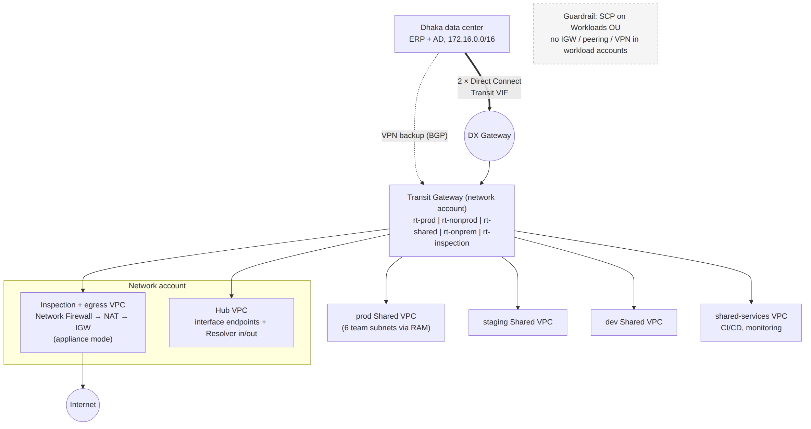

# 📚 Day 42 — Module 6 Revision + Project: Multi-account Hybrid Network Design

> 📊 **Visual Summary** — সহজে বোঝার জন্য diagram:



**সময়:** ২ ঘণ্টা | **Module:** ৬ (Multi-VPC & Private Connectivity) — Day 7 (শেষ দিন)

## 🎯 আজকের লক্ষ্য
- পুরো Module 6 এক নজরে
- সংযোগের সিদ্ধান্তের গাইড (কখন কোন service)
- Project: একটা growing company-র **multi-account hybrid network** design, ধাপে ধাপে
- Troubleshooting-এর ধারাবাহিক পদ্ধতি
- Final quiz (exam-ধাঁচের প্রশ্ন সহ)

---

# 🔁 Module 6 Revision

## 🗺 পুরো Module এক নজরে

| Day | বিষয় | এক লাইনে মনে রাখুন |
|---|---|---|
| 36 | VPC Peering, IP planning | 1:1, non-transitive, overlap না, edge-to-edge না; দুই পাশের route; IPAM |
| 37 | Transit Gateway | Hub router; association (কোন table দেখে) বনাম propagation (কোথায় route যায়); segmentation; egress/inspection; appliance mode |
| 38 | Site-to-Site VPN, BGP | CGW + VGW/TGW, ২ tunnel; BGP (ASN আলাদা); longest prefix → DX > VPN; TGW-তে ECMP |
| 39 | Direct Connect | Dedicated/hosted; Private/Transit/Public VIF; DX Gateway (global); resiliency; MACsec/VPN over DX; community |
| 40 | Organizations, RAM, Shared VPC | SCP guardrail; RAM share (subnet, TGW, Resolver rule, IPAM); owner বনাম participant; network account |
| 41 | Private connectivity at scale | Centralized endpoints (PHZ + association); PrivateLink provider; hybrid DNS (inbound/outbound); VPC Lattice |

## 🧭 কোন সংযোগ কখন? — সিদ্ধান্তের গাইড

```
দুই-তিনটা VPC, সরাসরি, কম খরচ, বেশি data?                → VPC Peering
অনেক VPC, transitive, on-prem share, segmentation?         → Transit Gateway
অনেক account একই network-এ ছোট ছোট workload?              → Shared VPC (RAM)
শুধু একটা service দিতে হবে / CIDR overlap?                  → PrivateLink (NLB + endpoint service)
Microservice অনেক account-এ, HTTP-level auth?              → VPC Lattice
On-prem, আজই, encrypted, কম bandwidth?                     → Site-to-Site VPN (TGW-তে)
On-prem, স্থির latency, বেশি bandwidth, অনেক data?          → Direct Connect (+ VPN backup)
DX-এ encryption?                                           → MACsec / VPN over DX
DX-কে অনেক region/VPC-তে?                                  → Direct Connect Gateway (+ TGW)
AWS service-এ private access (S3/DynamoDB)?                → Gateway endpoint (প্রতিটা VPC, free)
অন্য AWS service-এ private access, অনেক VPC?               → Centralized interface endpoints + PHZ
On-prem ↔ AWS নাম resolve?                                 → Route 53 Resolver inbound/outbound
User-এর laptop → VPC?                                      → Client VPN (বা SSM Session Manager)
```

---

# 🛠 Project: "ShopBD" Multi-account Hybrid Network

## পরিস্থিতি
ShopBD একটা ই-কমার্স company, দ্রুত বাড়ছে:
- Dhaka-য় একটা data center: পুরনো ERP (Oracle) আর Active Directory (`corp.shopbd.local`), range `172.16.0.0/16`
- AWS-এ তিনটা environment: **prod, staging, dev**; ৬টা product team
- **Requirement:**
  1. prod আর dev একে অপরকে দেখবে না; সবাই shared services (CI/CD, monitoring) দেখবে
  2. prod আর on-prem ERP private ভাবে কথা বলবে, স্থির latency, বছরে ৪০ TB data
  3. সব internet egress একটা firewall দিয়ে যাবে
  4. কোনো workload account নিজে internet gateway বা peering বানাতে পারবে না
  5. AWS থেকে `corp.shopbd.local` resolve হবে, আর on-prem থেকে AWS-এর internal নাম
  6. Network খরচ নিয়ন্ত্রণে থাকবে
  7. Mumbai-তে primary, পরে Singapore-এ DR

## ধাপ ১: Account ও OU (Day 40)
```
Root
├── Security OU:        log-archive, security-tooling
├── Infrastructure OU:  network (সব central network), shared-services (CI/CD, monitoring)
└── Workloads OU
     ├── Prod OU:    shop-prod
     ├── Staging OU: shop-staging
     └── Dev OU:     shop-dev
```
**SCP (Workloads OU):** `CreateInternetGateway`, `AttachInternetGateway`, `CreateVpcPeeringConnection`, VPN/DX, `DeleteFlowLogs` deny (NetworkAdminRole বাদে); region সীমা: `ap-south-1`, `ap-southeast-1`।

## ধাপ ২: IP Plan (Day 36)
```
10.0.0.0/8 AWS (on-prem 172.16.0.0/16 এড়িয়ে)
Mumbai 10.0.0.0/12:
  10.0.0.0/16  network hub (egress, inspection, endpoints, DNS)
  10.1.0.0/16  shared-services
  10.2.0.0/16  prod (Shared VPC: ৬ team-এর subnet)
  10.3.0.0/16  staging (Shared VPC)
  10.4.0.0/16  dev (Shared VPC)
Singapore 10.16.0.0/12 (DR, পরে)
```
**IPAM** pool এভাবে বানিয়ে RAM দিয়ে share।

## ধাপ ৩: VPC-গুলো (Day 40)
- network account-এ **prod, staging, dev** তিনটা VPC, প্রতিটা **Shared VPC**: ৬ team-এর subnet (৩টা AZ-এ) RAM দিয়ে ঐ environment-এর account-এর সাথে share
- প্রতিটা VPC-তে **S3 ও DynamoDB gateway endpoint** (free)
- কেন Shared VPC: একই environment-এর team-গুলো একে অপরের API বেশি call করে; আলাদা VPC-তে TGW charge আর NAT/endpoint-এর খরচ বেড়ে যেত

## ধাপ ৪: Transit Gateway ও Segmentation (Day 37)
TGW (network account), ASN `64512`, **default association/propagation বন্ধ**:

| TGW route table | Associate | Propagate / static |
|---|---|---|
| `rt-prod` | prod VPC | shared-services, on-prem (DX/VPN); static `0.0.0.0/0 → inspection` |
| `rt-nonprod` | staging, dev VPC | shared-services; static `0.0.0.0/0 → inspection` |
| `rt-shared` | shared-services VPC | prod, staging, dev, on-prem |
| `rt-onprem` | DX Gateway, VPN | prod, shared-services (dev না!) |
| `rt-inspection` | inspection VPC | সব VPC (ফেরত পথের জন্য) |

→ prod ↮ dev ✅, সবাই → shared ✅, শুধু prod ও shared → on-prem ✅

## ধাপ ৫: Egress আর Inspection (Day 37)
- **Inspection + egress VPC** (network account): AWS Network Firewall (domain allow-list, IPS) → NAT Gateway (প্রতি AZ) → IGW
- Inspection attachment-এ **appliance mode চালু**
- Spoke-এর `0.0.0.0/0` → TGW → inspection → NAT → internet

## ধাপ ৬: On-prem সংযোগ (Day 38–39)
- **Primary:** ২টা **Direct Connect** (Dhaka থেকে দুটো আলাদা DX location, partner-এর hosted বা dedicated), **Transit VIF → DX Gateway → TGW**
  - ৪০ TB/বছর data out: DX-এর data transfer rate-এ সাশ্রয়
- **Backup:** Site-to-Site **VPN on TGW** (দুটো ISP, BGP)
- **BGP:** on-prem ASN `65010`; DX আর VPN দুই পথে **একই prefix** `172.16.0.0/16` advertise; DX-দের মধ্যে community `7224:7300` / `7224:7100`
- ERP traffic sensitive, compliance চায় encryption → DX-এ **MACsec** (সমর্থিত হলে) বা app-level TLS

## ধাপ ৭: DNS (Day 41, Day 13)
- network hub VPC-তে Route 53 Resolver **outbound endpoint** + rule `corp.shopbd.local → 172.16.0.10, 172.16.0.11` → RAM দিয়ে Workloads আর Infrastructure OU-তে share
- **Inbound endpoint** (hub): on-prem DNS-এ conditional forwarder `aws.shopbd.internal` আর দরকারি AWS service নাম → inbound endpoint-এর IP
- Internal PHZ `aws.shopbd.internal` → সব VPC-র সাথে associate
- **DNS Firewall** দিয়ে malicious domain block

## ধাপ ৮: Centralized Interface Endpoints (Day 41)
- hub VPC-তে: `ssm`, `ssmmessages`, `ec2messages`, `kms`, `secretsmanager`, `sqs`, `sns`, `logs`, `monitoring`, `sts` (Private DNS বন্ধ)
- প্রতিটার PHZ + Alias, সব spoke VPC-র সাথে associate (automation / Route 53 Profiles)
- `ecr.api` আর `ecr.dkr` **প্রতিটা VPC-তে আলাদা** (বিশাল image pull, TGW processing charge এড়াতে)
- Endpoint policy: `aws:PrincipalOrgID`

## ধাপ ৯: Observability ও Security
- সব VPC-তে **VPC Flow Logs** → log-archive account-এর S3
- **TGW Flow Logs**, **Network Manager** (topology), **Reachability Analyzer**
- GuardDuty (সব account), Config rule (`vpc-flow-logs-enabled`, `restricted-ssh`)
- CloudWatch alarm: DX `ConnectionState`, VPN `TunnelState`, NAT `ErrorPortAllocation`, Network Firewall drop

## ধাপ ১০: DR (Singapore, পরে)
- Singapore-এ একই pattern: TGW + VPC-গুলো
- **Inter-region TGW peering** (Mumbai ↔ Singapore), দুই পাশে **static route**
- DX Gateway global, তাই Singapore TGW-কেও একই DXGW-এর সাথে associate → on-prem Singapore-এও পৌঁছায়

## 💰 খরচ নিয়ন্ত্রণ — সিদ্ধান্তের সারাংশ
| সিদ্ধান্ত | কেন সাশ্রয় |
|---|---|
| Shared VPC per environment | কম VPC, কম NAT/endpoint, team-দের মধ্যে TGW charge নেই |
| Centralized NAT + interface endpoints | শত শত endpoint/NAT-এর বদলে কয়েকটা |
| S3/DynamoDB gateway endpoint সবখানে | Free, NAT/TGW processing এড়ায় |
| ECR endpoint local | বিশাল data TGW-তে যায় না |
| DX (বেশি data) | Data-out-এর দাম কম |

## ✅ Design Review Checklist
- [ ] কোনো CIDR overlap নেই (AWS ↔ AWS, AWS ↔ on-prem)
- [ ] প্রতিটা TGW attachment-এ সব AZ-এর subnet
- [ ] prod ↮ dev test করে দেখা (Reachability Analyzer)
- [ ] DX failover test করা হয়েছে, VPN backup কাজ করে
- [ ] দুই পথে একই BGP prefix
- [ ] Workload account-এ SCP guardrail কাজ করছে (IGW বানাতে চেষ্টা করে দেখা)
- [ ] DNS দুই দিকে resolve হয় (AWS → corp, on-prem → AWS)
- [ ] Spoke থেকে centralized endpoint-এর নাম private IP-তে resolve হয়
- [ ] Flow logs, alarm, cost budget চালু
- [ ] পুরো network IaC-তে (Terraform/CloudFormation StackSets), PR review সহ

---

## 🔧 Network Troubleshooting — ধারাবাহিক পদ্ধতি

"A থেকে B-তে যাওয়া যায় না" হলে এই ক্রমে দেখুন:

```
1. DNS:        নাম ঠিক IP-তে resolve হচ্ছে? (private নাকি public IP?)
2. Source SG:  outbound allow?
3. Source NACL + subnet route table: destination-এর route আছে? (peering/TGW/VGW/NAT)
4. Transit:    TGW route table (associate করা table-এ destination আছে?), DXGW allowed prefix, BGP advertise
5. Destination route table: ফেরার পথ আছে?
6. Destination NACL (stateless, ephemeral port) + SG inbound
7. OS firewall / app listening (ss -tlnp)
```
**Tools:** Reachability Analyzer (path + কোথায় আটকায়), VPC/TGW Flow Logs (`REJECT` দেখুন), Resolver query logs, Network Access Analyzer (অনাকাঙ্ক্ষিত path খোঁজা)।

---

## 📝 Module 6 Final Quiz

1. VPC Peering-এর তিনটা সীমাবদ্ধতা বলুন।
2. TGW-তে association আর propagation-এর পার্থক্য কী?
3. VPN-এ BGP কেন static routing-এর চেয়ে ভালো?
4. Private VIF, Transit VIF আর Public VIF কোথায় পৌঁছায়?
5. Shared VPC-তে owner আর participant কে কী নিয়ন্ত্রণ করে?
6. Centralized interface endpoint কাজ করাতে DNS-এ কী করতে হয়?
7. DX primary, VPN backup; একটা subnet-এর traffic VPN দিয়ে যাচ্ছে। সম্ভাব্য কারণ?

### 🎓 Exam-ধাঁচের প্রশ্ন

**Q8.** A company has 30 VPCs across multiple accounts and needs all of them to reach an on-premises data center over a single Direct Connect connection, while preventing development VPCs from reaching production VPCs. What is the MOST scalable solution?
- A. Full-mesh VPC peering and a private VIF to each VPC
- B. A Transit Gateway with separate route tables for prod and dev, connected to Direct Connect through a transit VIF and Direct Connect gateway
- C. One Site-to-Site VPN connection per VPC
- D. A Shared VPC for all 30 workloads with a single route table

**Q9.** A SaaS provider wants to expose an API to hundreds of customer VPCs. Many customers use the same CIDR range as the provider. Traffic must not traverse the internet. What should the provider use?
- A. VPC peering with each customer
- B. Transit Gateway shared via AWS RAM
- C. AWS PrivateLink: a Network Load Balancer behind a VPC endpoint service
- D. Site-to-Site VPN to each customer

**Q10.** A company uses Direct Connect and must encrypt all traffic between on-premises and AWS with the LEAST operational overhead and without buying new hardware that supports MACsec. What should it do?
- A. Enable encryption on the private VIF.
- B. Create an IPsec Site-to-Site VPN that runs over the Direct Connect connection (for example, private IP VPN to a Transit Gateway over a transit VIF).
- C. Replace Direct Connect with VPC peering.
- D. Use a public VIF without VPN.

<details><summary>▶ উত্তর দেখুন</summary>

1. Non-transitive, CIDR overlap চলে না, edge-to-edge routing নেই (IGW/NAT/VPN/gateway endpoint share হয় না)।
2. Association = attachment-এর traffic কোন route table দেখবে; propagation = attachment-এর CIDR কোন route table-এ নিজে থেকে যোগ হবে।
3. Route স্বয়ংক্রিয়ভাবে আদান-প্রদান আর tunnel failover দ্রুত; নতুন subnet হাতে যোগ করতে হয় না।
4. Private VIF → VGW বা DXGW হয়ে VPC; Transit VIF → DXGW হয়ে TGW; Public VIF → AWS public endpoint (internet না)।
5. Owner: VPC, subnet, route table, NACL, NAT, endpoint; participant: নিজের EC2/RDS/Lambda আর নিজের SG।
6. Endpoint-এ private DNS বন্ধ, service নামের PHZ + Alias, আর সেই PHZ spoke VPC-গুলোর সাথে associate।
7. VPN দিয়ে ঐ subnet-এর বেশি নির্দিষ্ট prefix advertise হচ্ছে (longest prefix match), অথবা DX-এর BGP session সেই prefix advertise করছে না।
8. **B**: TGW + আলাদা route table দিয়ে segmentation, আর Transit VIF + DXGW দিয়ে একটা DX সব VPC-তে।
9. **C**: PrivateLink-এ CIDR overlap সমস্যা না, শুধু একটা service expose হয়, traffic AWS network-এ থাকে।
10. **B**: VPN over DX (IPsec) নতুন hardware ছাড়াই encryption দেয়; DX নিজে encrypt করে না, Public VIF একা encrypt করে না।
</details>

---

## 💡 Pro Tips

- Network design শুরুর আগে **একটা diagram আর IP plan document** বানান, team-এর সাথে review করুন
- সব কিছু IaC-তে; network-এর হাতে-করা পরিবর্তন সবচেয়ে বিপজ্জনক
- প্রতি quarter-এ **failover drill** (DX বন্ধ করে VPN, AZ বন্ধ করে)
- Network খরচ Cost Explorer-এ usage type দিয়ে (`NatGateway-Bytes`, `TransitGateway-Bytes`, `DataTransfer-Regional`) নিয়মিত দেখুন
- Module 7-এ এই network-এর সামনে **Route 53, CloudFront, ELB** বসাব (edge services)

---

## 🚨 বাস্তব পরিস্থিতি (যেসব ভুল প্রায়ই হয়)

**পরিস্থিতি ১:** Network টা হাতে console-এ বানানো হয়েছিল। যিনি বানিয়েছিলেন তিনি চলে যাওয়ার পর কেউ জানত না কোন TGW route কেন আছে, আর একটা "অপ্রয়োজনীয়" route মুছতেই ERP সংযোগ বন্ধ।
**শিক্ষা:** IaC + documentation + change review।

**পরিস্থিতি ২:** DX backup হিসেবে VPN ছিল, কিন্তু কখনো test করা হয়নি। DX কাটা পড়ার দিন দেখা গেল VPN-এর pre-shared key এক বছর আগে বদলানো হয়েছিল, tunnel কখনো ওঠেনি।
**শিক্ষা:** Backup path-এর `TunnelState` alarm আর নিয়মিত failover test।

---

**⏮ আগের দিন:** [Day 41 — Centralized PrivateLink ও Hybrid DNS](./Day-41-Centralized-PrivateLink-Endpoints-Hybrid-DNS.md) | **⏭ পরের module:** [Day 43 — CloudFront Basics (Module 7)](../08-Module-7-Edge-DNS-Load-Balancing/Day-43-CloudFront-Basics-Distributions-Origins.md)
