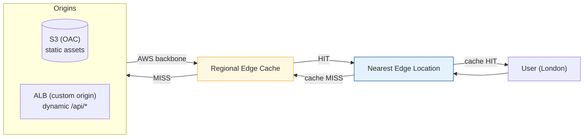

# 📚 Day 43 — CloudFront Basics: Distribution, Origin, Behavior ও HTTPS

> 📊 **Visual Summary** — সহজে বোঝার জন্য diagram:



**সময়:** ১.৫ ঘণ্টা | **Module:** ৭ (Edge Services, DNS & Load Balancing) — Day 1

## 🎯 আজকের লক্ষ্য
- CDN কী, আর CloudFront কীভাবে কাজ করে (edge location, regional edge cache)
- Distribution-এর গঠন: origin, cache behavior, settings
- Origin-এর ধরন: **S3 (OAC সহ)**, ALB/EC2/custom, VPC origin
- Path pattern দিয়ে একাধিক origin
- HTTPS: viewer ও origin protocol, ACM certificate (**us-east-1**), custom domain
- Price class আর খরচ
- RTMP distribution কী হয়েছে

---

## Part 1: CDN কী, কেন?

ধরুন আপনার website Mumbai region-এ। Dhaka-র user দ্রুত পায়, কিন্তু London বা New York-এর user-এর প্রতিটা request হাজারো কিলোমিটার ঘুরে আসে: **latency বেশি, page ধীর**।

**CDN (Content Delivery Network)** = বিশ্বজুড়ে ছড়ানো server-এ content-এর **copy (cache)** রাখা, যাতে user কাছের server থেকেই পায়।

**Amazon CloudFront** = AWS-এর CDN:
- বিশ্বজুড়ে কয়েকশো **edge location** (PoP) আর কিছু **regional edge cache**
- Traffic edge থেকে origin পর্যন্ত **AWS backbone**-এ যায় (internet-এর চেয়ে দ্রুত ও স্থির)
- Static (image, CSS, JS, video) আর **dynamic** (API, HTML) দুটোই

### সুবিধা
| সুবিধা | ব্যাখ্যা |
|---|---|
| ⚡ কম latency | কাছের edge থেকে content |
| 🛡 নিরাপত্তা | **Shield Standard** (DDoS) free, **WAF** যোগ করা যায়, origin লুকানো থাকে |
| 💰 কম খরচ | Origin থেকে CloudFront-এ data transfer **free**; cache hit হলে origin-এ load কম |
| 📈 Scale | হঠাৎ traffic spike edge সামলায় |
| 🔐 HTTPS | Free ACM certificate, TLS edge-এ |

---

## Part 2: CloudFront কীভাবে কাজ করে?

```
User (London) ──► নিকটতম Edge Location (London)
                     │ cache-এ আছে? ── হ্যাঁ (HIT) ──► সাথে সাথে ফেরত ⚡
                     │ না (MISS)
                     ▼
                  Regional Edge Cache (বড়, কম সংখ্যক)
                     │ আছে? ── হ্যাঁ ──► edge-এ রাখে, user-কে দেয়
                     │ না
                     ▼
                  Origin (S3 / ALB, Mumbai) ── AWS backbone দিয়ে
                     → response edge-এ cache হয় (TTL পর্যন্ত) → user
```

- **Cache hit ratio** = কত % request edge থেকেই উত্তর পেল। যত বেশি, তত দ্রুত আর সস্তা
- Response header `X-Cache: Hit from cloudfront` বা `Miss from cloudfront` দেখে বোঝা যায়

---

## Part 3: Distribution-এর গঠন

**Distribution** = CloudFront-এর একটা configuration, যার নিজস্ব domain: `d111111abcdef8.cloudfront.net`

```
Distribution
├── Origins          → content কোথা থেকে আসবে (S3, ALB, custom HTTP server)
├── Cache behaviors  → কোন path কোন origin-এ যাবে, কীভাবে cache হবে
│    ├── /api/*      → ALB origin, caching প্রায় বন্ধ
│    ├── /images/*   → S3 origin, লম্বা cache
│    └── Default (*) → S3 origin (website)
└── Settings         → custom domain (CNAME), certificate, price class, WAF, logging, default root object
```

---

## Part 4: Origin-এর ধরন

### 1️⃣ S3 Origin (static website, file)
**Origin Access Control (OAC)** দিয়ে bucket **private** রাখুন। শুধু CloudFront পড়তে পারবে, সরাসরি S3 URL দিয়ে কেউ না।

Bucket policy (OAC):
```json
{
  "Version": "2012-10-17",
  "Statement": [{
    "Sid": "AllowCloudFrontOAC",
    "Effect": "Allow",
    "Principal": { "Service": "cloudfront.amazonaws.com" },
    "Action": "s3:GetObject",
    "Resource": "arn:aws:s3:::my-website-bucket/*",
    "Condition": {
      "StringEquals": { "AWS:SourceArn": "arn:aws:cloudfront::111122223333:distribution/EDFDVBD6EXAMPLE" }
    }
  }]
}
```
- **OAC** নতুন ও recommended (SSE-KMS encrypted object, সব region support করে); পুরনো **OAI** (Origin Access Identity) legacy
- S3 **REST endpoint** (`bucket.s3.ap-south-1.amazonaws.com`) ব্যবহার করুন। S3 **website endpoint** দিলে সেটা custom origin হিসেবে ধরা হয়, OAC কাজ করে না, আর bucket public রাখতে হয়
- SPA (React) হলে 403/404 error-এ `/index.html` ফেরত দিতে **custom error response** configure করুন

### 2️⃣ Custom Origin (ALB, EC2, API Gateway, যেকোনো HTTP server)
- Dynamic content বা API
- Origin-কে **public** হতে হয় (বা VPC origin, নিচে)
- Origin-কে শুধু CloudFront থেকে traffic নিতে বাধ্য করার উপায়:
  - ALB-এর security group-এ **CloudFront managed prefix list** (`com.amazonaws.global.cloudfront.origin-facing`)
  - CloudFront একটা **secret custom header** পাঠায় (যেমন `X-Origin-Verify: <random>`), ALB listener rule শুধু সেই header থাকলে forward করে, বাকিদের 403

### 3️⃣ VPC Origin
**Private subnet**-এর ALB, NLB বা EC2-কে সরাসরি origin বানানো যায়: origin-এর কোনো public IP লাগে না, internet থেকে একেবারেই পৌঁছানো যায় না। নতুন design-এ সবচেয়ে নিরাপদ বিকল্প।

### Origin Group (Failover)
দুটো origin (primary + secondary) একটা group-এ। Primary নির্দিষ্ট error (যেমন 500, 502, 503, 504) দিলে CloudFront secondary থেকে আনে। উদাহরণ: দুই region-এর S3 bucket (CRR সহ)।

---

## Part 5: Cache Behavior — Path অনুযায়ী নিয়ম

প্রতিটা behavior-এ:
| Setting | মানে |
|---|---|
| **Path pattern** | `/api/*`, `*.jpg`, `/static/*`; **ক্রম** গুরুত্বপূর্ণ (প্রথম যেটা মেলে); শেষে **Default (`*`)** |
| **Origin** | কোন origin-এ যাবে |
| **Viewer protocol policy** | HTTP and HTTPS / **Redirect HTTP to HTTPS** (recommended) / HTTPS only |
| **Allowed methods** | GET, HEAD / + OPTIONS / সব (POST, PUT, DELETE: API-র জন্য) |
| **Cache policy** | কী cache key, কতক্ষণ (Day 44) |
| **Origin request policy** | Origin-এ কোন header/cookie/query যাবে (Day 44) |
| **Function association** | CloudFront Functions / Lambda@Edge (Day 44) |
| **Compress objects** | gzip/brotli চালু |

### উদাহরণ: একটা domain, দুটো origin
```
https://www.shopbd.com/            → S3 (React build)          cache: CachingOptimized
https://www.shopbd.com/static/*    → S3                        cache: ১ বছর (versioned file)
https://www.shopbd.com/api/*       → ALB (Mumbai)              cache: CachingDisabled, সব method
```
Frontend আর API **একই domain**-এ, তাই browser-এর **CORS সমস্যা থাকে না**।

---

## Part 6: HTTPS ও Custom Domain

### দুই অংশের HTTPS
```
Viewer ──(Viewer protocol)──► CloudFront ──(Origin protocol)──► Origin
         ACM certificate                   Origin-এর নিজস্ব certificate
```

### Custom domain (`www.shopbd.com`)
1. **ACM-এ certificate বানান `us-east-1` (N. Virginia) region-এ**। CloudFront শুধু সেখানকার certificate নেয়! (ALB-এর certificate থাকে ALB-এর region-এ)
2. DNS validation (Route 53-এ এক click)
3. Distribution-এর **Alternate domain name (CNAME)**-এ `www.shopbd.com` দিন, certificate select করুন
4. Route 53-এ **Alias record**: `www.shopbd.com` → distribution (apex `shopbd.com`-এর জন্যও Alias কাজ করে, CNAME না; Day 45)

### অন্যান্য
- **SNI** (default, free) দিয়ে একই IP-তে অনেক certificate
- **Security policy** (minimum TLS version, যেমন TLSv1.2_2021)
- **HTTP/2 আর HTTP/3 (QUIC)** চালু করা যায়
- Origin protocol: ALB-তে HTTPS রাখলে পুরো পথ encrypted

---

## Part 7: Price Class ও খরচ

| খরচ | কখন |
|---|---|
| **Data transfer out** (edge → user) | GB অনুযায়ী, অঞ্চলভেদে দাম আলাদা |
| **HTTP/HTTPS request** | প্রতি ১০ হাজার request |
| Invalidation | প্রতি মাসে প্রথম ১০০০ path free |
| Origin → CloudFront | **Free** (AWS origin থেকে) |
| Lambda@Edge, CloudFront Functions, WAF, Origin Shield | আলাদা |

**Price class:**
- **All**: সব edge location (সবচেয়ে ভালো performance)
- **200**: সবচেয়ে দামি কিছু অঞ্চল বাদ
- **100**: শুধু সবচেয়ে সস্তা অঞ্চলগুলো (উত্তর আমেরিকা, ইউরোপ ইত্যাদি)

বাদ দেওয়া অঞ্চলের user-রা তখনও site পায়, শুধু একটু দূরের edge থেকে।

> CloudFront-এর **flat-rate pricing plan** (নির্দিষ্ট মাসিক দামে CDN + WAF + কিছু সুবিধা)-ও চালু হয়েছে; ছোট/মাঝারি site-এর জন্য হিসাব সহজ। সর্বশেষ pricing page দেখুন।

---

## Part 8: RTMP Distribution কী হয়েছে?

আগে CloudFront-এ দুই ধরনের distribution ছিল: **Web** আর **RTMP** (Adobe Flash media streaming)। Flash বন্ধ হওয়ার সাথে সাথে **AWS ২০২০-এর শেষে RTMP distribution বন্ধ করে দিয়েছে**। এখন শুধু একটা ধরন আছে (যাকে আগে "web distribution" বলা হতো)।

**আধুনিক video streaming:**
- **HLS / DASH** format: video ছোট ছোট segment-এ ভাগ করে সাধারণ HTTP দিয়ে দেওয়া হয়, তাই CloudFront সরাসরি cache করতে পারে
- **VOD (on-demand):** AWS Elemental MediaConvert দিয়ে encode → S3 → CloudFront
- **Live:** AWS Elemental MediaLive + MediaPackage → CloudFront
- Access control: **signed URL/cookie** (Day 44)

> পুরনো exam dump-এ "RTMP distribution" প্রশ্ন থাকতে পারে; উত্তর হিসেবে এখন আর প্রাসঙ্গিক না।

---

## Part 9: Hands-on Lab — S3 Static Website + CloudFront

1. S3 bucket `shopbd-site-<random>` (**Block Public Access চালু রাখুন**), একটা `index.html` আর `style.css` upload
2. CloudFront → Create distribution:
   - Origin: S3 bucket (REST endpoint), **Origin access: OAC** (নতুন বানান), bucket policy copy করে বসান
   - Viewer protocol: Redirect HTTP to HTTPS
   - Cache policy: CachingOptimized
   - Default root object: `index.html`
3. Deploy শেষ হলে `https://dxxxx.cloudfront.net` খুলুন ✅
4. S3 object URL সরাসরি খুলুন → **AccessDenied** ✅ (bucket private)
5. `curl -I https://dxxxx.cloudfront.net/style.css` দুবার চালান: প্রথমবার `Miss`, দ্বিতীয়বার `Hit`
6. **বোনাস:** ALB বা API Gateway-কে দ্বিতীয় origin করে `/api/*` behavior যোগ করুন

---

## 🎯 আজকের মূল Takeaways

1. CloudFront = CDN: edge location + regional edge cache, AWS backbone দিয়ে origin
2. Distribution = origins + cache behaviors + settings
3. S3 origin → **OAC** + private bucket (REST endpoint); website endpoint দিলে OAC চলে না
4. Custom origin (ALB): prefix list SG + secret header, অথবা **VPC origin** (private)
5. Path pattern দিয়ে একই domain-এ S3 + API; CORS ঝামেলা কমে
6. Custom domain-এর ACM certificate **`us-east-1`**-এ; Route 53 **Alias**
7. Price class দিয়ে খরচ নিয়ন্ত্রণ; origin → CloudFront data free
8. RTMP বন্ধ; আধুনিক streaming = HLS/DASH over HTTP

---

## 📝 Self-check Questions

1. Cache hit আর miss-এ কী ঘটে?
2. S3 bucket private রেখে CloudFront দিয়ে দেখাতে কী লাগবে?
3. CloudFront-এর custom domain-এর certificate কোন region-এ বানাতে হয়?
4. ALB-কে সরাসরি internet থেকে না, শুধু CloudFront থেকে access দিতে দুটো উপায় বলুন।
5. `/api/*` আর বাকি সব আলাদা origin-এ পাঠাতে কী configure করবেন?
6. Origin failover কীভাবে করবেন?
7. আজকের দিনে CloudFront দিয়ে video streaming কীভাবে হয়?

<details><summary>▶ উত্তর দেখুন</summary>

1. Hit: edge নিজের cache থেকে সাথে সাথে দেয়। Miss: regional edge cache বা origin থেকে আনে, cache করে, তারপর দেয়।
2. Origin Access Control (OAC) আর bucket policy-তে শুধু ঐ distribution-কে `s3:GetObject` (Block Public Access চালু থাকবে)।
3. `us-east-1` (N. Virginia)।
4. ALB SG-তে CloudFront origin-facing managed prefix list, আর secret custom header যাচাই (বা private ALB-কে VPC origin)।
5. দুটো origin আর দুটো cache behavior: `/api/*` → ALB, Default (`*`) → S3।
6. Origin group: primary আর secondary origin, নির্দিষ্ট HTTP error code-এ failover।
7. HLS/DASH segment (MediaConvert/MediaLive + MediaPackage) HTTP দিয়ে CloudFront-এ; RTMP distribution বন্ধ।
</details>

---

## 💡 Pro Tips

- **Standard logging** বা **real-time logs** চালু রাখুন, cache hit ratio আর error দেখতে
- CloudFront console-এর **Reports & analytics**-এ popular object, top referrer, cache statistics দেখুন
- API-র সামনেও CloudFront দিলে TLS edge-এ শেষ হয় আর AWS backbone-এর সুবিধা মেলে, caching বন্ধ থাকলেও
- Distribution update deploy হতে কয়েক মিনিট লাগে; তাড়াহুড়ো করে বারবার বদলাবেন না
- IaC (CloudFormation/Terraform) দিয়ে distribution বানান, console-এ অনেক setting সহজে ভুল হয়

---

## 🎨 Quick Reference

```
Flow: user → edge (hit?) → regional edge cache → origin (AWS backbone)
Distribution = origins + behaviors (path pattern, viewer protocol, methods, cache/origin policy, functions) + settings
S3: REST endpoint + OAC + private bucket   (website endpoint = custom origin, no OAC)
ALB: prefix list com.amazonaws.global.cloudfront.origin-facing + secret header | VPC origin
Custom domain: ACM cert in us-east-1 + alternate domain name + Route 53 Alias
Price class: All | 200 | 100      Origin → CloudFront transfer: free
RTMP: discontinued (2020) → HLS/DASH
```

---

## 🚨 বাস্তব পরিস্থিতি (যেসব ভুল প্রায়ই হয়)

**পরিস্থিতি ১:** Certificate Mumbai region-এ বানানো হয়েছিল। CloudFront-এর certificate list-এ কিছুই দেখা যাচ্ছিল না, আর team ঘণ্টাখানেক ধরে কারণ খুঁজল।
**শিক্ষা:** CloudFront-এর certificate `us-east-1`-এ।

**পরিস্থিতি ২:** CloudFront ছিল, কিন্তু S3 bucket-ও public ছিল। Bot সরাসরি S3 URL দিয়ে download করায় S3 data transfer bill বাড়ল, আর WAF-এর সুরক্ষা পাশ কাটিয়ে গেল।
**শিক্ষা:** OAC + private bucket।

**পরিস্থিতি ৩:** ALB public ছিল আর কোনো বাধা ছিল না। Attacker CloudFront আর WAF এড়িয়ে সরাসরি ALB-এর DNS name-এ আক্রমণ করল।
**শিক্ষা:** Origin-কে শুধু CloudFront থেকে পৌঁছানো যায় এমন করুন (prefix list + header, বা VPC origin)।

---

**⏮ আগের module:** [Day 42 — Module 6 Revision](../07-Module-6-Multi-VPC-Private-Connectivity/Day-42-Module-6-Revision-Multi-Account-Network-Design.md) | **⏭ পরের দিন:** [Day 44 — CloudFront Caching, Security ও Edge Functions](./Day-44-CloudFront-Caching-Security-Edge-Functions.md)
