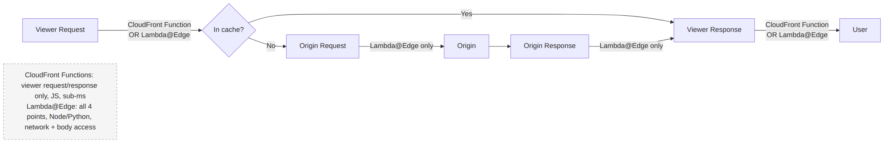

# 📚 Day 44 — CloudFront Caching, Security ও Edge Functions

> 📊 **Visual Summary** — সহজে বোঝার জন্য diagram:



**সময়:** ২ ঘণ্টা | **Module:** ৭ (Edge Services, DNS & Load Balancing) — Day 2

## 🎯 আজকের লক্ষ্য
- **Cache key** আর cache hit ratio বাড়ানোর কৌশল
- Cache policy বনাম origin request policy
- TTL: min/default/max আর `Cache-Control` header
- Invalidation বনাম versioned file name
- Origin Shield, compression
- Security: **signed URL/cookie**, **geo restriction**, **WAF**, Shield, response header policy
- **CloudFront Functions বনাম Lambda@Edge**

---

## Part 1: Cache Key — সবচেয়ে গুরুত্বপূর্ণ ধারণা

**Cache key** = CloudFront যেটা দিয়ে ঠিক করে "এই request-এর উত্তর cache-এ আছে কিনা"। Default: **domain + URL path**।

যদি cache key-তে query string, header বা cookie যোগ করেন, প্রতিটা আলাদা মান = **আলাদা cache entry**:
```
/product.jpg?size=large   ≠   /product.jpg?size=small     (query string key-তে থাকলে)
/product.jpg + cookie session=abc  ≠  /product.jpg + cookie session=xyz  (cookie key-তে থাকলে)
```

⚠️ **সবচেয়ে বড় ভুল:** সব header/cookie cache key-তে দেওয়া। প্রতিটা user-এর আলাদা session cookie থাকায় প্রতিটা request "নতুন", ফলে **cache hit ratio প্রায় শূন্য**, আর CloudFront শুধু একটা ধীর proxy হয়ে যায়।

### ✅ নিয়ম
- Cache key-তে **শুধু সেগুলো** দিন যেগুলো আসলেই response বদলায়
- Image resize-এর জন্য `size` query দরকার → শুধু `size` whitelist
- Language অনুযায়ী আলাদা page → শুধু `Accept-Language` (বা নিজের `lang` cookie)
- Static file-এ query/cookie/header কিছুই না

---

## Part 2: Cache Policy বনাম Origin Request Policy

আগে দুটো একসাথে ছিল (legacy "cache settings"); এখন আলাদা:

| | **Cache policy** | **Origin request policy** |
|---|---|---|
| কী ঠিক করে | **Cache key** (কী দিয়ে cache আলাদা হবে) + **TTL** | Cache miss-এ **origin-এ কী কী পাঠাবে** |
| প্রশ্ন | "কোন কোন জিনিস বদলালে আলাদা copy লাগবে?" | "Origin-এর কোন তথ্য দরকার?" |
| প্রভাব | Cache key বড় = hit ratio কম | Cache key-তে প্রভাব ফেলে না |

উদাহরণ: API-র origin-এর `Authorization` header আর user-agent দরকার, কিন্তু সেগুলো দিয়ে cache আলাদা করতে চান না (বা caching বন্ধ) → origin request policy দিয়ে পাঠান।

### Managed policy (ready-made, নিজে লিখতে হয় না)
| Policy | কখন |
|---|---|
| `CachingOptimized` | Static content (S3), লম্বা TTL, compression |
| `CachingDisabled` | API / dynamic, প্রতিবার origin |
| `CachingOptimizedForUncompressedObjects` | Compression চান না |
| Origin request: `AllViewer`, `AllViewerExceptHostHeader`, `CORS-S3Origin`, `UserAgentRefererHeaders` | Origin-এ দরকারি তথ্য পাঠানো |

> ⚠️ ALB/API Gateway origin-এ `Host` header পাঠালে origin ভুল domain পায়। API Gateway-র জন্য **`AllViewerExceptHostHeader`**।

---

## Part 3: TTL — কতক্ষণ Cache থাকবে

Cache policy-তে তিনটা মান:
| | মানে |
|---|---|
| **Minimum TTL** | Origin যাই বলুক, এর কম না |
| **Default TTL** | Origin কোনো `Cache-Control`/`Expires` না দিলে (managed policy-তে ২৪ ঘণ্টা) |
| **Maximum TTL** | Origin যাই বলুক, এর বেশি না |

### Origin-এর header দিয়ে নিয়ন্ত্রণ (recommended)
```
Cache-Control: max-age=31536000, immutable      ← versioned static file (১ বছর)
Cache-Control: max-age=60                        ← দ্রুত বদলায় এমন page
Cache-Control: no-cache / no-store / private     ← cache করবেন না (min TTL 0 হলে)
Cache-Control: max-age=0, s-maxage=300           ← browser cache না, CloudFront ৫ মিনিট
```
- `s-maxage` = শুধু shared cache (CloudFront)-এর জন্য; `max-age` browser-এর জন্যও
- S3 object-এ upload-এর সময় `Cache-Control` metadata দিন

---

## Part 4: Content বদলালে — Invalidation বনাম Versioning

### Invalidation
```bash
aws cloudfront create-invalidation --distribution-id EDFDVBD6EXAMPLE --paths "/index.html" "/css/*"
```
- Edge cache থেকে জোর করে মুছে ফেলে; পরের request origin থেকে নতুন আনে
- প্রতি মাসে প্রথম **১০০০ path free**, তারপর খরচ; `/*` = একটা path হিসেবে গোনা হয় কিন্তু **সব** cache মুছে দেয় (origin-এ হঠাৎ চাপ)
- কয়েক মিনিট লাগে; browser-এর নিজের cache মুছে না

### ✅ Versioned file name (recommended)
```
app.3f9a2c.js, style.v42.css, logo-2026-09.png
```
- File-এর নাম বদলালে এটা "নতুন file", invalidation লাগে না, **১ বছরের TTL** নিরাপদ
- শুধু `index.html` (যেটা নতুন file-এর নাম জানায়) ছোট TTL বা deploy-এর সময় invalidate
- React/Vite/webpack build নিজে থেকেই hash দেয়

---

## Part 5: Origin Shield ও Compression

### Origin Shield
Regional edge cache-এর উপরে আরও একটা **কেন্দ্রীয় caching layer**, আপনার পছন্দের region-এ (origin-এর কাছাকাছি)।
```
Edge (বহু) → Regional edge cache (কয়েকটা) → Origin Shield (একটা) → Origin
```
- একই object-এর জন্য বিভিন্ন অঞ্চল থেকে origin-এ অনেক request না গিয়ে একটাই যায়
- **Origin-এর load কমে**, hit ratio বাড়ে; live streaming, বিশ্বব্যাপী traffic, দুর্বল origin-এ কাজের
- বাড়তি খরচ আছে

### Compression
Cache policy-তে gzip/Brotli চালু + behavior-এ "Compress objects" → text-ভিত্তিক file (HTML, CSS, JS, JSON) ছোট হয়ে দ্রুত আসে, data transfer খরচ কমে।

---

## Part 6: Security

### 🔐 Signed URL ও Signed Cookie: শুধু অনুমোদিত user
Paid course video, private download, subscriber content-এর জন্য।

| | Signed URL | Signed Cookie |
|---|---|---|
| কখন | **একটা** file (একটা download link) | **অনেক** file একসাথে (পুরো video-র শত segment, member area) |
| URL বদলায়? | হ্যাঁ (signature যোগ হয়) | না |

- **Trusted key group** (public key CloudFront-এ, private key আপনার server-এ, recommended) দিয়ে sign
- Policy: কোন URL, কখন পর্যন্ত (expiry), কোন IP থেকে
- Backend login যাচাই করে signed URL/cookie দেয়

> **CloudFront signed URL বনাম S3 pre-signed URL:** CloudFront signed URL edge cache ব্যবহার করে, path pattern ও IP condition দেয়; S3 pre-signed URL সরাসরি S3 থেকে, একটা object, CloudFront-এর সুবিধা নেই।

### 🌍 Geo Restriction
- **Allow list** (শুধু এই দেশগুলো) বা **Block list** (এই দেশগুলো বাদে)
- License/compliance-এর কারণে (যেমন video শুধু বাংলাদেশে)
- দেশ-ভিত্তিক; আরও সূক্ষ্ম নিয়ন্ত্রণ (শহর, নির্দিষ্ট path) লাগলে **WAF geo match** বা edge function-এ `CloudFront-Viewer-Country` header

### 🛡 WAF ও Shield
- **Shield Standard**: সব distribution-এ free, Layer 3/4 DDoS
- **AWS WAF**-এর web ACL CloudFront-এ attach (WAF-টা **us-east-1**/global scope-এ): SQL injection, XSS, rate limit, bot control, IP block (Interview Q43)
- Edge-এ block হয়, origin পর্যন্ত আসেই না

### 🧾 Response Headers Policy
Code না বদলেই security header যোগ: `Strict-Transport-Security`, `X-Content-Type-Options`, `X-Frame-Options`, `Content-Security-Policy`, CORS header। Managed policy `SecurityHeadersPolicy` আছে।

### Field-level encryption
Form-এর নির্দিষ্ট field (যেমন card number) edge-এই public key দিয়ে encrypt, শুধু নির্দিষ্ট backend decrypt করতে পারে।

---

## Part 7: Edge Functions — CloudFront Functions বনাম Lambda@Edge

Request/response-এর পথে **edge-এ** ছোট code চালানো যায়।

### চারটা trigger point
```
Viewer ──(1) Viewer request──► CloudFront cache ──(2) Origin request──► Origin
Viewer ◄──(4) Viewer response── CloudFront cache ◄──(3) Origin response── Origin
```
- **Viewer request/response**: প্রতিটা request-এ চলে (cache hit হলেও)
- **Origin request/response**: শুধু cache miss-এ (origin-এ যাওয়ার সময়)

| | **CloudFront Functions** | **Lambda@Edge** |
|---|---|---|
| Trigger | শুধু **viewer request / viewer response** | চারটাই |
| Language | JavaScript (হালকা runtime) | Node.js, Python |
| Execution time | **Sub-millisecond** | Viewer trigger: কয়েক সেকেন্ড; origin trigger: আরও বেশি |
| Network / AWS SDK call | ❌ | ✅ |
| Request body access | ❌ | ✅ |
| Scale | প্রতি সেকেন্ডে লাখো | কম (তবু অনেক) |
| খরচ | **খুব সস্তা** | বেশি |
| কোথায় চলে | সব edge location | Regional edge cache |
| Deploy | CloudFront console | Function **us-east-1**-এ বানিয়ে version publish করে associate |
| Data store | **CloudFront KeyValueStore** (edge-এ key-value পড়া) | DynamoDB/S3 ইত্যাদি call |

### কখন কোনটা
**CloudFront Functions** (সহজ, দ্রুত, সস্তা):
- URL rewrite/redirect (`/about` → `/about/index.html`, `http→https`, `old-page → new-page`)
- Header যোগ/বদল, cache key normalize (query string sort, lowercase)
- সহজ token/JWT যাচাই (signature check), A/B test-এর জন্য cookie দেখে path বদলানো

**Lambda@Edge** (ভারী, network দরকার):
- Origin থেকে আসা response বদলানো (image resize, HTML-এ কিছু যোগ)
- বাইরের service call করে auth (DB/IdP-তে যাচাই)
- Body পড়া বা বদলানো
- Origin-কে dynamic ভাবে বাছাই (user-এর দেশ অনুযায়ী আলাদা origin)

### উদাহরণ: CloudFront Function (SPA-র pretty URL + www redirect)
```javascript
function handler(event) {
    var request = event.request;
    var host = request.headers.host.value;

    if (host === 'shopbd.com') {
        return {
            statusCode: 301,
            statusDescription: 'Moved Permanently',
            headers: { location: { value: 'https://www.shopbd.com' + request.uri } }
        };
    }
    if (request.uri.endsWith('/')) {
        request.uri += 'index.html';
    } else if (!request.uri.includes('.')) {
        request.uri += '/index.html';
    }
    return request;
}
```

---

## Part 8: Hands-on Lab

Day 43-এর distribution উন্নত করুন:
1. `style.css` আর `app.js`-কে versioned নামে (`app.v2.js`) upload, `Cache-Control: max-age=31536000, immutable`; `index.html`-এ `max-age=60`
2. `index.html` বদলে upload → invalidation ছাড়া ১ মিনিট পর নতুন দেখায় কিনা দেখুন
3. Response headers policy: `SecurityHeadersPolicy` যুক্ত করে `curl -I` দিয়ে header দেখুন
4. Geo restriction: allow list-এ শুধু নিজের দেশ দিন, VPN দিয়ে অন্য দেশ থেকে 403 দেখুন (ঐচ্ছিক)
5. Part 7-এর CloudFront Function বানিয়ে viewer request-এ associate করুন; `/about/`-এ গেলে `about/index.html` আসে কিনা দেখুন
6. CloudFront console-এ **Cache statistics** দেখুন: hit ratio

---

## 🎯 আজকের মূল Takeaways

1. **Cache key** যত ছোট, hit ratio তত বেশি; শুধু response-বদলানো জিনিস key-তে
2. **Cache policy** = key + TTL; **origin request policy** = origin-এ কী যাবে (key-তে প্রভাব নেই)
3. TTL: min/default/max; origin-এর `Cache-Control` দিয়ে নিয়ন্ত্রণ (`s-maxage`)
4. Invalidation-এর চেয়ে **versioned file name** ভালো; শুধু `index.html` ছোট TTL
5. **Origin Shield** = origin-এর load কমায়; compression চালু
6. **Signed URL** (একটা file) / **signed cookie** (অনেক file); geo restriction; WAF (global scope); security headers policy
7. **CloudFront Functions** (viewer only, sub-ms, সস্তা) বনাম **Lambda@Edge** (চার trigger, network, body)

---

## 📝 Self-check Questions

1. CloudFront থাকার পরও origin-এ প্রায় সব request যাচ্ছে। সম্ভাব্য কারণ কী?
2. Cache policy আর origin request policy-র পার্থক্য কী?
3. Deploy-এর পর user পুরনো CSS দেখছে। দুটো সমাধান বলুন; কোনটা ভালো?
4. একটা course-এর শত শত video segment শুধু paid user দেখবে। Signed URL নাকি signed cookie?
5. প্রতিটা request-এ header থেকে user-এর দেশ দেখে URL rewrite করতে কোনটা ব্যবহার করবেন?
6. Origin থেকে আসা image-কে resize করতে কোনটা লাগবে, আর কোন trigger-এ?
7. ১০টা edge অঞ্চল থেকে একই সময়ে একই object-এর জন্য origin-এ অনেক request যাচ্ছে। কী সাহায্য করবে?

<details><summary>▶ উত্তর দেখুন</summary>

1. Cache key-তে সব cookie/header/query (যেমন session cookie) আছে, তাই প্রায় প্রতিটা request আলাদা; অথবা TTL ০ বা origin `no-cache` দিচ্ছে, অথবা `CachingDisabled` policy।
2. Cache policy cache key আর TTL ঠিক করে; origin request policy cache miss-এ origin-এ কী পাঠাবে তা ঠিক করে, cache key-তে প্রভাব ফেলে না।
3. Invalidation (`/css/*`) বা versioned file name; versioned নাম ভালো (খরচ নেই, তাৎক্ষণিক, লম্বা TTL নিরাপদ)।
4. Signed cookie (অনেক file একসাথে)।
5. CloudFront Functions, viewer request trigger (`CloudFront-Viewer-Country` header)।
6. Lambda@Edge, origin response trigger (body বদলাতে হয়)।
7. Origin Shield।
</details>

---

## 💡 Pro Tips

- **Cache hit ratio ৯০%+** static site-এর জন্য লক্ষ্য রাখুন; কম হলে cache key দেখুন
- Query string-এর ক্রম আর case normalize করুন (CloudFront Function দিয়ে), hit ratio বাড়ে
- Lambda@Edge-এর log যায় **যে region-এ চলেছে** সেখানকার CloudWatch-এ (`us-east-1.<fn>` নামে); debug-এর সময় মনে রাখবেন
- WAF-এ **rate-based rule** দিন login আর API path-এ
- `Cache-Control: private` বা `no-store` দিন user-নির্দিষ্ট data (cart, profile)-এ, ভুলে অন্য user-এর কাছে cache হয়ে যাওয়া ঠেকাতে

---

## 🎨 Quick Reference

```
Cache key = what varies the response (keep it minimal) → hit ratio
Cache policy: key + TTL (min/default/max) | Origin request policy: what origin receives
Cache-Control: max-age (browser+CDN), s-maxage (CDN), no-store/private (don't cache)
Invalidate: create-invalidation --paths (1,000 free/month) | Prefer versioned filenames
Origin Shield: extra central cache layer, protects origin
Signed URL = 1 file | Signed cookie = many files | Trusted key groups
Geo restriction: allow/block list | WAF (global/us-east-1) | Security headers policy
CloudFront Functions: viewer req/resp, JS, sub-ms, no network, KeyValueStore
Lambda@Edge: all 4 triggers, Node/Python, network + body, deploy in us-east-1
```

---

## 🚨 বাস্তব পরিস্থিতি (যেসব ভুল প্রায়ই হয়)

**পরিস্থিতি ১:** "সব cookie forward" setting-এর কারণে cache hit ratio ছিল ৩%। CloudFront bill বাড়ছিল অথচ origin-এর load একটুও কমেনি।
**শিক্ষা:** Cache key minimal।

**পরিস্থিতি ২:** User profile API-তে ভুল করে ৫ মিনিটের cache ছিল। এক user-এর profile page অন্য user-এর কাছে দেখা গেল।
**শিক্ষা:** User-নির্দিষ্ট data-য় `CachingDisabled` আর `Cache-Control: private, no-store`।

**পরিস্থিতি ৩:** প্রতি deploy-এ `/*` invalidation চালানো হতো। বড় sale-এর দিন deploy-এর পর সব edge একসাথে origin-এ গেল, আর origin ধসে পড়ল।
**শিক্ষা:** Versioned file name; invalidation শুধু দরকারি path-এ; Origin Shield।

---

**⏮ আগের দিন:** [Day 43 — CloudFront Basics](./Day-43-CloudFront-Basics-Distributions-Origins.md) | **⏭ পরের দিন:** [Day 45 — Route 53 Hosted Zones ও Records](./Day-45-Route53-Hosted-Zones-Records.md)
