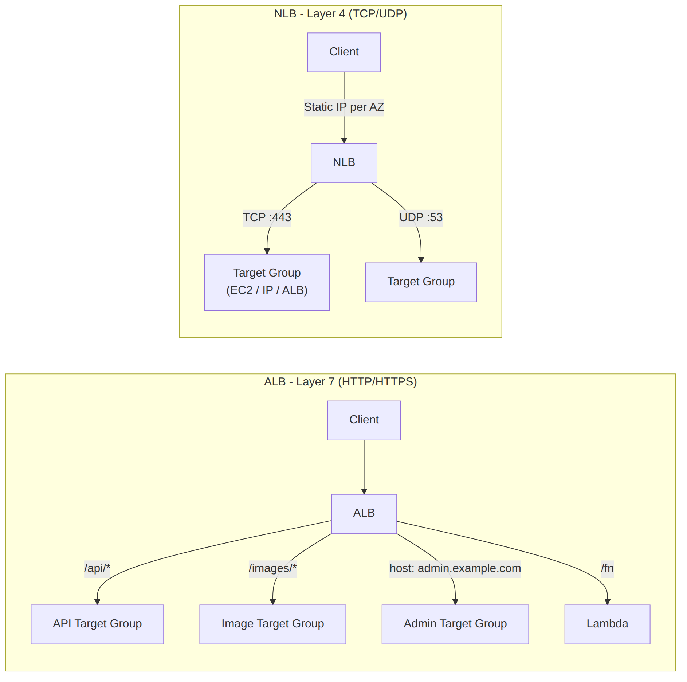

# 📚 Day 47 — Load Balancers গভীরে: ALB, NLB, GWLB, Target Groups ও Listener Rules

> 📊 **Visual Summary** — সহজে বোঝার জন্য diagram:



**সময়:** ২ ঘণ্টা | **Module:** ৭ (Edge Services, DNS & Load Balancing) — Day 5

## 🎯 আজকের লক্ষ্য
- Load Balancer কেন, কীভাবে কাজ করে (দ্রুত revision)
- **ALB**: listener rule, path/host-based routing, target group, sticky session
- **NLB**: static IP, extreme performance, TLS passthrough, client IP preserve
- **GWLB**: transparent traffic inspection (Day 37-এর সাথে সংযোগ)
- **Health check** configure করা
- Cross-zone load balancing
- Connection draining (deregistration delay)
- কখন কোনটা — সিদ্ধান্তের গাইড

> 📖 Module 3 (Day 19)-এ ALB-এর পেছনে app বসিয়েছিলাম। আজ ELB-কে নিজে গভীরে দেখব।

---

## Part 1: Load Balancer কেন, কীভাবে কাজ করে?

একটা server-এ সব traffic গেলে সেটাই **single point of failure**, আর একার পক্ষে বেশি traffic সামলানো কঠিন। **Load Balancer** একাধিক server-এর সামনে বসে traffic ভাগ করে দেয়, আর অসুস্থ server-কে বাদ দেয়।

```
Client ──► Load Balancer ──► Target 1 (healthy)
                          ──► Target 2 (healthy)
                          ─┴─ Target 3 (unhealthy, বাদ)
```

AWS-এর **Elastic Load Balancing (ELB)**-এর তিনটা প্রকার:

| | **ALB** | **NLB** | **GWLB** |
|---|---|---|---|
| Layer | **7** (HTTP/HTTPS/gRPC/WebSocket) | **4** (TCP/UDP/TLS) | **3** (IP, transparent) |
| Routing | Content-ভিত্তিক (path, host, header) | Port/protocol | সব traffic এক জায়গায় |
| Static IP | ❌ | ✅ প্রতি AZ-এ | ✅ (GENEVE endpoint) |
| Performance | ভালো | **সর্বোচ্চ, ultra-low latency** | High throughput |
| Target | Instance, IP, Lambda, ALB | Instance, IP, ALB | 3rd-party appliance |
| কখন | Web app, microservice, container | Gaming, IoT, financial, static IP দরকার | Firewall/IDS/IPS পুরো VPC-তে |

---

## Part 2: ALB — Listener, Rule ও Target Group

```
Client ──443──► ALB Listener (HTTPS)
                    │
                    ├─ Rule 1: path = /api/*        → Target Group: api-tg
                    ├─ Rule 2: host = admin.shop.com → Target Group: admin-tg
                    ├─ Rule 3: header X-Beta=true    → Target Group: beta-tg
                    └─ Default rule                  → Target Group: web-tg
```

### Listener
- Port + protocol যেখানে ALB শোনে (৪৪৩ HTTPS, ৮০ HTTP)
- HTTP listener-এ সাধারণত একটা rule: **redirect to HTTPS** (status 301)
- HTTPS listener-এ **ACM certificate** (Day 43-এর মতো, কিন্তু ALB-র নিজের region-এ), SNI দিয়ে একাধিক domain

### Listener Rule — condition ও action
**Condition (মিলানোর শর্ত):**
| Condition | উদাহরণ |
|---|---|
| Path pattern | `/api/*`, `/images/*.jpg` |
| Host header | `admin.shopbd.com` |
| HTTP header | `X-Beta-User: true` |
| Query string | `?version=2` |
| HTTP method | `POST` |
| Source IP | office CIDR |

**Action:**
| Action | কাজ |
|---|---|
| **Forward** | Target group-এ পাঠানো (weighted হলে একাধিক TG-তে % ভাগ) |
| **Redirect** | HTTP→HTTPS, বা নতুন URL-এ |
| **Fixed response** | সরাসরি একটা status/body (maintenance page) |
| **Authenticate** | Cognito বা OIDC দিয়ে auth-এর পর forward |

- Rule-গুলোর **priority** (নম্বর) অনুযায়ী evaluate হয়, প্রথম মিল জেতে; **Default rule** সবার শেষে

### Target Group
- Target: **Instance**, **IP address** (on-prem, peered VPC-ও), **Lambda**, বা অন্য **ALB** (multi-layer)
- **Protocol**: HTTP/HTTPS (ALB-তে); target-এর protocol ALB-র listener protocol থেকে আলাদা হতে পারে (HTTPS client → HTTP origin)
- একটা target অনেক target group-এ থাকতে পারে

### Sticky Session
Default-এ ALB request round-robin/least-outstanding-requests দিয়ে ভাগ করে, একই user বারবার একই target-এ নাও যেতে পারে।
- **ALB-generated cookie** (`AWSALB`) বা **application cookie**: একই user একই target-এ
- Session externalize (Module 3, Day 20-এর মতো ElastiCache) থাকলে sticky session না লাগলেও চলে; better scaling

---

## Part 3: Health Check

```
Target Group Health Check:
  Protocol: HTTP    Path: /health
  Port: traffic-port (বা নির্দিষ্ট)
  Healthy threshold: 3     Unhealthy threshold: 2
  Interval: 15s            Timeout: 5s
  Success codes: 200
```
- **Healthy threshold**: কতবার পরপর সফল হলে healthy ধরা হবে
- **Unhealthy threshold**: কতবার fail হলে unhealthy, traffic বন্ধ
- Unhealthy target ASG-তে থাকলে (Day 10, Module 2-এর concept) replace হয় (ASG-র নিজের health check settings অনুযায়ী)
- Target group-এর health status console/CLI-তে দেখা যায় (`describe-target-health`)

---

## Part 4: NLB — Static IP ও Extreme Performance

```
Client ──► NLB (প্রতি subnet/AZ-এ static/Elastic IP) ──► Target Group (TCP/UDP)
```

### বৈশিষ্ট্য
- **প্রতিটা AZ-এ static IP** (বা BYOIP); firewall whitelist-এ সহজ
- **Millions of requests/second**, খুব কম latency, connection-level load balancing (packet-এর ভেতর দেখে না)
- **Client-এর আসল source IP** target পর্যন্ত পৌঁছায় (ALB-তে `X-Forwarded-For` লাগে, Day 19)
- **TLS termination** করতে পারে (NLB-তে certificate), অথবা **TLS passthrough** (encrypted-ই target পর্যন্ত)
- Target: Instance, IP, ALB (NLB-এর সামনে থাকলে static IP + ALB-এর সব feature)

### কখন NLB
- Gaming server, IoT (MQTT), financial trading (microsecond latency)
- **Static IP** partner/client-কে whitelist করতে হবে
- **PrivateLink**-এর ভিত্তি (Day 41): endpoint service-এ NLB লাগে
- Non-HTTP protocol (raw TCP, UDP)
- খুব বেশি connection rate

---

## Part 5: Gateway Load Balancer (GWLB)

**উদ্দেশ্য:** সব traffic (বা নির্দিষ্ট traffic) কোনো **3rd-party security appliance** (firewall, IDS/IPS, deep packet inspection) দিয়ে **transparently** পাঠানো, appliance নিজে source/destination না বদলিয়ে।

```
Traffic ──► GWLB endpoint (VPC route table-এ) ──GENEVE protocol──► GWLB ──► Appliance fleet (ASG)
                                                                              │ inspect, pass back
Traffic ◄── (route অপরিবর্তিত, appliance transparent) ◄──────────────────────┘
```

- **GENEVE** (port 6081) protocol দিয়ে packet appliance-এ পাঠায়
- **GWLB endpoint** VPC route table-এ বসে (যেমন Day 37-এর inspection VPC-তে `0.0.0.0/0 → GWLB endpoint`)
- Appliance fleet নিজে ASG দিয়ে scale করে; GWLB তাদের মধ্যে flow ভাগ করে
- Health check দিয়ে খারাপ appliance বাদ

### GWLB বনাম Network Firewall
Module 6-এ **AWS Network Firewall** দেখেছিলাম — সেটা AWS-এর নিজস্ব managed firewall, GWLB-এর মতো architecture ব্যবহার করে ভেতরে ভেতরে। **GWLB নিজে** ব্যবহার করবেন যখন **3rd-party appliance** (Palo Alto, Fortinet, Check Point) চালাতে চান।

---

## Part 6: Cross-Zone Load Balancing

```
AZ-a: 8 targets      AZ-b: 2 targets
```
- **বন্ধ (off)**: প্রতিটা AZ-এর LB node শুধু নিজের AZ-এর target-এ পাঠায় → AZ-b-র target-গুলো বেশি traffic পায় (কম target, একই ভাগ)
- **চালু (on)**: সব LB node সব AZ-এর সব target-এ সমান ভাগে পাঠায় → ভালো ভারসাম্য

| | Cross-zone default |
|---|---|
| **ALB** | সবসময় চালু, বন্ধ করা যায় না, **free** |
| **NLB** | Default বন্ধ; চালু করা যায়, কিন্তু **AZ পার হলে data transfer charge** |
| **GWLB** | Default বন্ধ |

> 💡 প্রতিটা AZ-এ **সমান সংখ্যক target** রাখলে cross-zone না থাকলেও ভারসাম্য ভালো থাকে।

---

## Part 7: Connection Draining (Deregistration Delay)

Target সরানোর সময় (deploy, unhealthy, scale-in) হঠাৎ connection কাটলে user-এর request মাঝপথে ব্যর্থ হয়।

**Deregistration delay** (default ৩০০ সেকেন্ড): Target-কে "draining" অবস্থায় রাখা হয়— নতুন request আর পায় না, কিন্তু **চলমান request শেষ করার সময়** পায়। সময় শেষে সরিয়ে ফেলা হয়।

```bash
aws elbv2 modify-target-group-attributes --target-group-arn $TG \
  --attributes Key=deregistration_delay.timeout_seconds,Value=30
```
- ছোট মান দিলে দ্রুত deploy কিন্তু লম্বা request কাটা পড়ার ঝুঁকি
- CodeDeploy-র Day 21-এর "BeforeBlockTraffic/AllowTraffic" ধারণা এখানেই কাজ করে

---

## Part 8: কখন কোনটা — সিদ্ধান্তের গাইড

```
Web app, microservice, path/host routing, WebSocket?        → ALB
Container-based, ECS/EKS-এর Service-এর সামনে?                → ALB (সাধারণত)
Static IP লাগবে (partner whitelist)?                          → NLB
Extreme performance, non-HTTP, gaming/IoT?                    → NLB
TLS client-এর আসল IP প্রয়োজন, TLS passthrough?                → NLB
PrivateLink endpoint service বানাতে হবে?                       → NLB (আবশ্যক)
3rd-party firewall/IDS সব VPC traffic-এ?                       → GWLB
Layer 7 auth (Cognito), header/path routing দরকার + static IP?  → NLB (সামনে) → ALB (পেছনে)
```

---

## Part 9: Hands-on Lab

1. Two EC2 (বা ASG) target, health check `/health`
2. **ALB**: listener 443 (ACM cert) → rule `/api/*` → api-tg, default → web-tg; sticky session চালু করে দেখুন একই browser একই target-এ যাচ্ছে কিনা
3. একটা target-এর app বন্ধ করে health check unhealthy হতে দেখুন, traffic শুধু healthy target-এ যাচ্ছে কিনা
4. Deregistration delay ৩০ সেকেন্ড করে একটা target deregister করুন, চলমান connection শেষ হওয়ার সময় দেখুন
5. **বোনাস (NLB)**: একটা NLB বানিয়ে static IP দেখুন; client-এর access log-এ **আসল source IP** দেখুন (ALB-এর `X-Forwarded-For` বনাম NLB-এর সরাসরি source)
6. সব মুছুন

---

## 🎯 আজকের মূল Takeaways

1. ALB (L7, content routing) / NLB (L4, static IP, extreme performance) / GWLB (L3, transparent inspection)
2. ALB: listener → **rule (condition + action)** → target group; sticky session (cookie)
3. NLB: প্রতি AZ static IP, client IP preserve, TLS passthrough সম্ভব; PrivateLink-এর ভিত্তি
4. GWLB: GENEVE দিয়ে 3rd-party appliance-এ transparently traffic পাঠায় (Day 37-এর inspection VPC)
5. Health check-এর threshold/interval বুঝে সেট করুন
6. **Cross-zone**: ALB সবসময় on/free; NLB/GWLB default off (charge হতে পারে)
7. **Deregistration delay** = graceful connection draining

---

## 📝 Self-check Questions

1. একই ALB দিয়ে `/api/*` কে এক backend, বাকি সব আরেক backend-এ পাঠাতে কী লাগবে?
2. NLB কেন ALB-এর চেয়ে বেশি throughput/কম latency দেয়?
3. Client-এর আসল IP app পর্যন্ত পৌঁছাতে ALB-তে কী করতে হয়, NLB-তে কী দরকার হয় না?
4. GWLB-এর মূল কাজ কী, আর appliance কীভাবে "transparent" থাকে?
5. AZ-a-তে ৮টা, AZ-b-তে ২টা target। Cross-zone বন্ধ থাকলে কী সমস্যা হবে?
6. Deployment-এর সময় user-এর মাঝপথের request কাটা পড়া ঠেকাতে কী setting?
7. PrivateLink endpoint service বানাতে কোন load balancer লাগবে?

<details><summary>▶ উত্তর দেখুন</summary>

1. Listener rule: path pattern `/api/*` → api target group; default rule → বাকি backend।
2. NLB Layer 4-এ কাজ করে, connection-level, HTTP content দেখে না, তাই কম processing ওভারহেড।
3. ALB-তে `X-Forwarded-For` header পড়তে হয় (Day 19); NLB সরাসরি client-এর IP source হিসেবে target-এ পাঠায়, header লাগে না।
4. পুরো VPC-র traffic (বা নির্দিষ্ট route) 3rd-party appliance দিয়ে inspect করানো; GENEVE-এ encapsulate করে পাঠায় ও ফেরায়, তাই মূল packet-এর source/destination অপরিবর্তিত থাকে।
5. AZ-b-র ২টা target বেশি ভাগ পাবে (একই percentage ২টার মধ্যে ভাগ হবে), তাই তারা overload হতে পারে।
6. Target group-এর deregistration delay বাড়ানো (গ্রেসফুল drain)।
7. NLB (Network Load Balancer)।
</details>

---

## 💡 Pro Tips

- ALB-তে **request tracing** (`X-Amzn-Trace-Id`) চালু রাখুন, X-Ray-এর সাথে মিলিয়ে debug সহজ
- NLB-তে TLS termination করলে target-এর CPU থেকে TLS-এর কাজ সরে যায়, কিন্তু ALB-এর মতো L7 feature (path routing) পাবেন না
- Target group-এর health check path App-এর নিজস্ব `/health` endpoint হোক, `/` না (Day 46-এর মতো একই যুক্তি)
- ECS Service-এ ALB integration করলে dynamic port mapping নিজেই সামলায়
- GWLB endpoint বানানোর সময় VPC route table ঠিকমতো `0.0.0.0/0` (বা নির্দিষ্ট range) কে endpoint-এ পাঠাচ্ছে কিনা যাচাই করুন

---

## 🎨 Quick Reference

```
ALB: L7, listener → rules (path/host/header) → target groups, sticky cookie, WAF-compatible
NLB: L4, per-AZ static IP, client IP preserved, TLS passthrough, PrivateLink base
GWLB: L3, GENEVE, transparent 3rd-party inspection, appliance fleet via ASG
Health check: healthy/unhealthy threshold, interval, timeout, success codes
Cross-zone: ALB always on/free | NLB & GWLB default off (charge if enabled)
Deregistration delay: default 300s, graceful drain
```

---

## 🚨 বাস্তব পরিস্থিতি (যেসব ভুল প্রায়ই হয়)

**পরিস্থিতি ১:** App log-এ সব request একই IP (ALB-এর private IP) থেকে আসছিল দেখা গেল, rate limiting কাজ করছিল না।
**শিক্ষা:** ALB-এর পেছনে `X-Forwarded-For` পড়তে হয়; আসল IP দরকার হলে NLB বিবেচনা করুন।

**পরিস্থিতি ২:** Deploy-এর সময় deregistration delay ০ সেকেন্ড ছিল, target সরানোর সাথে সাথে চলমান API call ব্যর্থ হচ্ছিল।
**শিক্ষা:** যুক্তিসঙ্গত deregistration delay (৩০–৩০০ সেকেন্ড, app অনুযায়ী)।

**পরিস্থিতি ৩:** NLB-তে cross-zone বন্ধ ছিল, একটা AZ-এ target কম থাকায় সেখানকার instance-এ ৪ গুণ load।
**শিক্ষা:** প্রতিটা AZ-এ সমান target, বা cross-zone চালু (charge মাথায় রেখে)।

---

**⏮ আগের দিন:** [Day 46 — Route 53 Routing Policies](./Day-46-Route53-Routing-Policies-Health-Checks-Failover.md) | **⏭ পরের দিন:** [Day 48 — Global Accelerator + Module 7 Revision](./Day-48-Global-Accelerator-Module-7-Revision.md)
