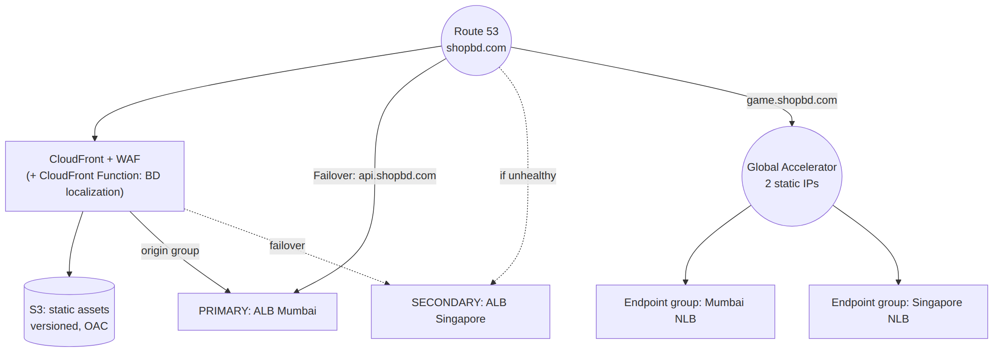

# 📚 Day 48 — Global Accelerator + Module 7 Revision: Global Traffic Architecture Project

> 📊 **Visual Summary** — সহজে বোঝার জন্য diagram:



**সময়:** ২ ঘণ্টা | **Module:** ৭ (Edge Services, DNS & Load Balancing) — Day 6 (শেষ দিন)

## 🎯 আজকের লক্ষ্য
- AWS Global Accelerator: anycast IP, endpoint group, traffic dial, client affinity
- Global Accelerator বনাম CloudFront (কবে দেখেছি, আজ গভীরে + hands-on angle)
- পুরো Module 7 এক নজরে revision
- Project: একটা global e-commerce-এর সামনের দিক (edge, DNS, load balancing) সম্পূর্ণ design
- Production checklist ও Final quiz

---

## Part 1: AWS Global Accelerator কী?

**সমস্যা:** DNS-based routing (Route 53 latency/failover, Day 46)-এ TTL আর client-side caching-এর কারণে failover-এ মিনিট লাগে, আর প্রতিটা resolver-ভেদে ভিন্ন IP পায় (whitelist করা কঠিন)।

**সমাধান: Global Accelerator** — **২টা static anycast IP** দেয় (বিশ্বজুড়ে সব জায়গায় একই IP), আর traffic AWS-এর নিকটতম **edge location**-এ ঢুকে, তারপর **AWS backbone network** দিয়ে সবচেয়ে ভালো (healthy, কাছের) region-এর endpoint-এ যায়।

```
User (যেকোনো জায়গা থেকে) ──► একই 2 static IP ──► নিকটতম AWS edge
                                                        │ AWS backbone (internet না)
                                                        ▼
                                              সবচেয়ে ভালো healthy endpoint
                                              (ALB/NLB/EC2/EIP, region অনুযায়ী)
```

### মূল উপাদান
| উপাদান | কী |
|---|---|
| **Accelerator** | ২টা static anycast IP (বা BYOIP) |
| **Listener** | Port/protocol (TCP/UDP) যেখানে শোনে |
| **Endpoint group** | প্রতিটা **region**-এর endpoint-দের group, একটা **traffic dial** (0–100%) |
| **Endpoint** | ALB, NLB, EC2 instance, Elastic IP |

### Traffic Dial ও Weight
- **Traffic dial**: একটা region-এ কত % traffic যাবে (০% = পুরো region বন্ধ — নতুন region চালু করার সময় ধীরে বাড়ানো যায়)
- **Endpoint weight**: একটা region-এর ভেতরে endpoint-দের মধ্যে ভাগ

### Client Affinity
- Default (`NONE`): প্রতিটা নতুন connection (flow) আলাদাভাবে ভাগ হতে পারে
- `SOURCE_IP`: একই client IP সবসময় একই endpoint-এ (UDP-ভিত্তিক gaming/streaming-এ দরকার)

### Health Check
প্রতিটা endpoint-এর নিজস্ব health check (ALB/NLB হলে তাদের নিজের target health, বা EC2-এর জন্য আলাদা)। Unhealthy region-এর traffic দ্রুত (**সাধারণত সেকেন্ডে**) অন্য healthy region-এ সরে যায়, কারণ ক্লায়েন্ট IP-ই বদলায় না, রাউটিং AWS-এর ভেতরে হয়।

---

## Part 2: Global Accelerator বনাম CloudFront — আরেকবার স্পষ্ট করে

দুটোই edge location আর AWS backbone ব্যবহার করে, কিন্তু কাজ সম্পূর্ণ আলাদা:

| | **CloudFront** | **Global Accelerator** |
|---|---|---|
| কাজ | Content **cache** করে (CDN) | Traffic **proxy/route** করে, cache করে না |
| Layer | 7 (HTTP/HTTPS) | 4 (TCP/UDP) |
| IP | Dynamic (DNS name) | **স্থায়ী anycast IP** |
| Best for | Static/cacheable content, video, API caching | Non-HTTP protocol, gaming, VoIP, IoT, static IP-নির্ভর whitelist, দ্রুত multi-region failover |
| Failover গতি | CloudFront নিজে cache miss হলে origin group failover (Day 43) | সেকেন্ডের মধ্যে, DNS/TTL-এর উপর নির্ভর না |
| Endpoint | S3, ALB, custom HTTP origin | ALB, NLB, EC2, EIP |

### একসাথে ব্যবহার
Static content + dynamic API দুটোই থাকা multi-region app-এ:
```
Static assets → CloudFront → S3
Dynamic API   → Global Accelerator → ALB (multi-region)
```
বা API-ও HTTP হলে অনেক সময় শুধু CloudFront (origin group failover)-ই যথেষ্ট; **non-HTTP** বা **অতি দ্রুত failover** আলাদাভাবে দরকার হলে Global Accelerator।

---

## Part 3: Hands-on Lab — Global Accelerator

1. দুই region-এ দুটো ALB (Day 47-এর মতো), প্রতিটার পেছনে EC2 target
2. Global Accelerator তৈরি: listener TCP 443 → দুটো endpoint group (দুই region), প্রতিটায় ALB endpoint
3. Accelerator-এর static IP-তে test করুন:
```bash
curl https://<static-ip-1>/
```
4. একটা region-এর ALB-কে unhealthy করে (target বন্ধ করে) দেখুন traffic দ্রুত অন্য region-এ চলে যায় কিনা
5. একটা endpoint group-এর traffic dial ৫০%-এ নামিয়ে বারবার call করে ভাগ দেখুন
6. সব মুছুন (accelerator-এর hourly + data transfer charge)

---

# 🔁 Module 7 Revision

## 🗺 পুরো Module এক নজরে

| Day | বিষয় | এক লাইনে মনে রাখুন |
|---|---|---|
| 43 | CloudFront basics | Edge cache; S3 origin + OAC; custom origin + prefix list/VPC origin; ACM `us-east-1` |
| 44 | CloudFront caching ও security | Cache key ছোট রাখুন; versioned filename > invalidation; signed URL/cookie; CloudFront Functions (viewer, দ্রুত) বনাম Lambda@Edge (৪ trigger, network) |
| 45 | Route 53 hosted zones | Public/private zone; Alias (apex + free) বনাম CNAME; TTL; external registrar delegation |
| 46 | Route 53 routing policies | Weighted/Latency/Failover/Geolocation (**default দিন**!)/Geoproximity/Multivalue/IP-based; health check ৩ ধরন |
| 47 | Load balancers | ALB (L7, rule-based) / NLB (L4, static IP, client IP) / GWLB (L3, transparent inspection); cross-zone; deregistration delay |
| 48 | Global Accelerator | Static anycast IP, non-HTTP, দ্রুত failover; CloudFront ≠ Global Accelerator |

## 🧭 "সামনের দিক" ডিজাইনের সিদ্ধান্ত গাইড

```
Static/cacheable content দ্রুত সবার কাছে?         → CloudFront (S3/custom origin)
Domain আর DNS record?                            → Route 53 hosted zone
একাধিক region-এর মধ্যে user ভাগ করা?              → Route 53 latency/geolocation routing
Primary down হলে backup?                          → Route 53 failover + health check
Web app-এর ভেতরে path/host দিয়ে ভাগ?              → ALB
Static IP / non-HTTP / extreme perf?              → NLB
3rd-party firewall পুরো VPC-তে?                    → GWLB
Non-HTTP, দ্রুততম multi-region failover?           → Global Accelerator
HTTP content-ও দ্রুত multi-region failover?        → CloudFront origin group (প্রথমে চেষ্টা করুন)
```

---

# 🛠 Project: "ShopBD Global" — Edge, DNS ও Load Balancing Architecture

## Requirement (Day 42-এর ShopBD network-এর উপর ভিত্তি করে)
- `shopbd.com` আর `www.shopbd.com` — global user, দ্রুত load
- Static asset (image, JS, CSS) বিশ্বজুড়ে cache
- `api.shopbd.com` — dynamic API, দুই region (Mumbai active, Singapore standby)
- একটা IoT/mobile game feature UDP ব্যবহার করে, static IP whitelist দরকার
- Region-এর কোনোটা down হলে দ্রুত (মিনিটের কম) সরে যেতে হবে
- Bangladesh-এর user-দের জন্য আলাদা localized landing page (compliance/marketing)
- সব traffic-এ WAF সুরক্ষা

## Architecture
```
                                        Route 53 (shopbd.com hosted zone)
                                        ┌─────────────┴─────────────┐
                                  shopbd.com/www                  api.shopbd.com
                                  Alias (apex OK, free)            Failover routing
                                        │                          ┌──────┴──────┐
                                  CloudFront + WAF              PRIMARY      SECONDARY
                                  ┌───────┴───────┐          (Mumbai ALB) (Singapore ALB)
                              Origin: S3        Origin:      (evaluate target health)
                              (static assets)   ALB Mumbai
                              (versioned files, (dynamic HTML,
                               1yr cache)        CachingDisabled)
                                        │
                              CloudFront Function (viewer request):
                              CloudFront-Viewer-Country == BD
                                → rewrite path to /bd/index.html

                              Game UDP feature:
                              Global Accelerator (2 static IP)
                                → endpoint group Mumbai (ALB/NLB) [dial 100%]
                                → endpoint group Singapore (NLB)  [dial 100%, health-based]
```

## ধাপে ধাপে সিদ্ধান্ত

### ১. Static content — CloudFront (Day 43–44)
- S3 origin + OAC, versioned filename (`app.abc123.js`), `Cache-Control: max-age=31536000, immutable`
- `index.html` ছোট TTL

### ২. localization — CloudFront Function (Day 44)
```javascript
function handler(event) {
    var request = event.request;
    var country = request.headers['cloudfront-viewer-country'];
    if (country && country.value === 'BD' && request.uri === '/') {
        request.uri = '/bd/index.html';
    }
    return request;
}
```
Viewer request trigger-এ association, কম খরচে, network call ছাড়াই।

### ৩. API — CloudFront origin group **অথবা** সরাসরি Route 53 failover
- API HTTP-ভিত্তিক, তাই **CloudFront origin group** (Mumbai ALB primary, Singapore ALB secondary, 5xx-এ failover) বিবেচনা করুন — cache miss মাত্রই স্যুইচ, DNS TTL-এর সীমা নেই
- বিকল্প/সম্পূরক: `api.shopbd.com` **Route 53 Failover** Alias → Mumbai ALB (evaluate target health) primary, Singapore ALB secondary — সহজ, কিন্তু DNS TTL-নির্ভর
- ALB-এর listener rule: `/v2/*` → নতুন backend, default → পুরনো (Day 47)

### ৪. Game UDP — Global Accelerator (Day 48)
- HTTP না, তাই CloudFront/origin group প্রযোজ্য না
- ২টা endpoint group (Mumbai, Singapore), health check অনুযায়ী automatic failover, static IP client-এ hardcode করা যায়

### ৫. Security — সব layer-এ
- CloudFront + WAF (Day 44): SQLi/XSS/rate-limit
- ALB origin-কে শুধু CloudFront থেকে (prefix list + secret header, Day 43)
- Global Accelerator-এর পেছনের NLB/ALB-এর SG-তে শুধু দরকারি port

### ৬. DNS — Route 53 (Day 45–46)
```
shopbd.com        Alias A → CloudFront
www.shopbd.com     Alias A → CloudFront
api.shopbd.com     Failover Alias (PRIMARY: Mumbai ALB, SECONDARY: Singapore ALB) + health check
game.shopbd.com    A → Global Accelerator static IPs
```

## ✅ Design Review Checklist
- [ ] সব public domain-এর certificate সঠিক region-এ (CloudFront → `us-east-1`; ALB → নিজ region)
- [ ] S3 bucket private (OAC), origin সরাসরি internet থেকে পৌঁছানো যায় না
- [ ] Cache key minimal, versioned static file
- [ ] Health check অর্থবহ path-এ, deep dependency-তে অতিরিক্ত সংবেদনশীল না
- [ ] Failover আসলে কাজ করে কিনা test করা (primary বন্ধ করে দেখা)
- [ ] Geolocation/routing policy-তে default/fallback record আছে
- [ ] WAF সব public entry point-এ (CloudFront অন্তত)
- [ ] Global Accelerator/NLB দরকার শুধু non-HTTP বা static-IP প্রয়োজনে, অহেতুক না
- [ ] DNS আর load balancer config IaC-তে

---

## 📝 Module 7 Final Quiz

1. `shopbd.com` (apex)-কে CloudFront-এর দিকে point করতে কী দরকার, কেন CNAME চলবে না?
2. Cache hit ratio বাড়ানোর সবচেয়ে গুরুত্বপূর্ণ নিয়ম কী?
3. Route 53 Failover আর CloudFront origin group failover-এর মধ্যে failover-এর গতির পার্থক্য কেন হয়?
4. Client-এর আসল source IP backend-এ দরকার হলে কোন load balancer, বা ALB-তে কী পড়তে হয়?
5. একটা UDP গেম সার্ভিসের জন্য static IP আর দ্রুত multi-region failover দরকার। কী ব্যবহার করবেন, কেন CloudFront না?
6. Geolocation routing policy-তে কোন record বাধ্যতামূলক?
7. GWLB কী ধরনের সমস্যায় ব্যবহার করবেন?

### 🎓 Exam-ধাঁচের প্রশ্ন

**Q8.** A company's static website is served from S3 through CloudFront. Users report that recently updated images still show the old version for up to a year, even though CloudFront has cached them. What is the MOST cost-effective long-term solution?
- A. Reduce the S3 bucket's default TTL to 0 for all objects.
- B. Use versioned/hashed file names for updated assets instead of relying on invalidation.
- C. Run a CloudFront invalidation for `/*` after every deployment.
- D. Disable caching for the entire distribution.

**Q9.** A gaming company needs two fixed IP addresses that never change, low-latency UDP routing to the nearest healthy regional endpoint, and failover within seconds if a region becomes unhealthy. Which service meets this requirement?
- A. Amazon CloudFront with an origin group
- B. Route 53 latency-based routing
- C. AWS Global Accelerator
- D. Application Load Balancer with cross-zone load balancing

**Q10.** A company wants all traffic entering its VPC to be inspected by a third-party intrusion detection appliance without changing the source or destination of packets, and the appliance fleet must scale automatically. What should be used?
- A. Application Load Balancer in front of the appliances
- B. Network Load Balancer with TLS termination
- C. Gateway Load Balancer with the appliances in an Auto Scaling group
- D. Route 53 Resolver DNS Firewall

<details><summary>▶ উত্তর দেখুন</summary>

1. **Alias record** (A/AAAA); DNS standard অনুযায়ী zone apex-এ CNAME দেওয়া যায় না, আর Alias AWS resource-এ free আর health-aware।
2. Cache key যতটা সম্ভব ছোট রাখা — শুধু response সত্যিই বদলায় এমন query/header/cookie cache key-তে রাখা।
3. Route 53 failover DNS TTL আর client cache-এর উপর নির্ভর করে (মিনিটের ঘরে); CloudFront origin group cache miss-এই সরাসরি origin থেকে fail করলে পরের origin চেষ্টা করে, DNS-এর অপেক্ষা লাগে না।
4. NLB (client IP সরাসরি পৌঁছায়); ALB হলে `X-Forwarded-For` header পড়তে হয়।
5. Global Accelerator; CloudFront শুধু HTTP/HTTPS ক্যাশ করে, UDP বা non-HTTP protocol সামলাতে পারে না।
6. **Default** location record, নাহলে অনির্ধারিত দেশের user কোনো উত্তর পাবে না।
7. যখন 3rd-party firewall/IDS/IPS দিয়ে VPC-র সব (বা নির্দিষ্ট) traffic transparently inspect করতে হবে, appliance-এর source/destination না বদলিয়ে।
8. **B**: versioned/hashed filename — নতুন নাম মানেই নতুন cache entry, invalidation লাগে না, লম্বা TTL নিরাপদ।
9. **C**: শুধু Global Accelerator static anycast IP + non-HTTP (UDP) + দ্রুত regional failover দেয়; CloudFront/Route 53/ALB এগুলো একসাথে দেয় না।
10. **C**: Gateway Load Balancer transparent inspection দেয় (GENEVE), আর appliance ASG-তে scale করে।
</details>

---

## 💡 Pro Tips

- Module 6 (network) আর Module 7 (edge/DNS/LB) মিলিয়ে দেখুন: TGW/VPN/DX ভেতরের সংযোগ, আজকের সব service বাইরের/সামনের সংযোগ
- Real production-এ প্রায়ই **CloudFront + ALB (multi-region origin group) + Route 53** যথেষ্ট; Global Accelerator শুধু non-HTTP বা বিশেষ static-IP প্রয়োজনে যোগ করুন, অকারণে জটিলতা বাড়াবেন না
- WAF-কে CloudFront আর ALB দুই জায়গাতেই বসানো যায়; edge-এ (CloudFront) বসালে origin পর্যন্ত ভাঙা traffic পৌঁছায়ই না
- প্রতিটা routing/failover সিদ্ধান্ত নিয়মিত **test** করুন (game day), শুধু ডায়াগ্রামে লিখে রাখলেই কাজ হয় না

---

## 🚨 বাস্তব পরিস্থিতি (যেসব ভুল প্রায়ই হয়)

**পরিস্থিতি ১:** UDP game traffic-এর জন্য CloudFront ব্যবহারের চেষ্টা হয়েছিল, কারণ team ভেবেছিল "CDN মানেই সব দ্রুত"। কাজ করেনি — CloudFront শুধু HTTP/HTTPS বোঝে।
**শিক্ষা:** Protocol অনুযায়ী সঠিক service বাছুন; non-HTTP → Global Accelerator বা NLB।

**পরিস্থিতি ২:** Route 53 failover সেট করা ছিল কিন্তু কখনো test হয়নি। আসল outage-এর দিন দেখা গেল secondary ALB-এর target group-ই খালি ছিল।
**শিক্ষা:** DR/failover নিয়মিত drill; শুধু কনফিগার করলেই যথেষ্ট না।

---

**⏮ আগের দিন:** [Day 47 — Load Balancers গভীরে](./Day-47-Load-Balancers-ALB-NLB-GWLB-Deep-Dive.md) | **⏭ পরের module:** Module 8 — Network Security & Monitoring (আসছে)
