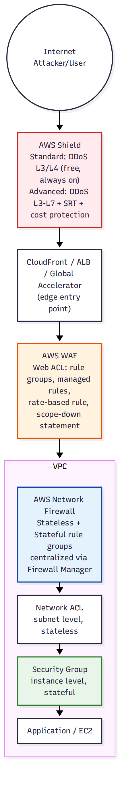

# 📚 Day 49 — Firewalls গভীরে: WAF, Shield ও Network Firewall

> 📊 **Visual Summary** — সহজে বোঝার জন্য diagram:



**সময়:** ২ ঘণ্টা | **Module:** ৮ (Network Security & Monitoring) — Day 1

## 🎯 আজকের লক্ষ্য
- Defense-in-depth: কোন firewall কোন layer রক্ষা করে
- **AWS WAF** গভীরে: Web ACL, rule group, managed rules, rate-based rule, scope-down
- **Shield Standard বনাম Advanced**, cost protection, SRT
- **AWS Network Firewall**: rule group (stateless/stateful), firewall policy, centralized deployment (Day 37-এর সাথে সংযোগ)
- Firewall Manager দিয়ে multi-account নিয়ন্ত্রণ
- কোন আক্রমণে কোন firewall

> 📖 Interview Q43 (WAF), Q97 (Shield) আর Module 6, Day 37 (GWLB, inspection VPC)-এ ভিত্তি দেওয়া আছে। আজ প্রতিটার rule/policy-র গভীরে আর সব একসাথে কীভাবে কাজ করে।

---

## Part 1: Defense in Depth — কোন Firewall কোন Layer

```
Internet
   │
   ▼
[Route 53]                              ← DNS-level (Day 46, DNS Firewall Day 41)
   │
   ▼
[CloudFront + WAF + Shield]             ← Layer 7 edge (Day 43-44)
   │
   ▼
[ALB + WAF]                             ← Layer 7 regional
   │
   ▼
[Network Firewall / Security Group / NACL]  ← Layer 3/4 (VPC-এর ভেতরে, Day 9-10)
   │
   ▼
[EC2 / Container / Lambda]              ← Application code, OS hardening
```

| Layer | Service | কী থেকে রক্ষা |
|---|---|---|
| L3/L4 network-wide (volumetric DDoS) | **Shield Standard/Advanced** | SYN flood, UDP reflection, বিশাল bandwidth attack |
| L7 HTTP request | **WAF** | SQLi, XSS, bad bot, credential stuffing, rate abuse |
| L3/L4/L7 VPC traffic (stateful inspection) | **Network Firewall** | Malicious domain, intrusion, protocol anomaly, egress control |
| Instance/subnet | **Security Group / NACL** (Module 2, Day 9-10) | নির্দিষ্ট port/IP allow-deny |

**একটাই যথেষ্ট না** — production-এ সবগুলো layer একসাথে চলে।

---

## Part 2: AWS WAF গভীরে

### গঠন
```
Web ACL (attach: CloudFront, ALB, API Gateway, AppSync, Cognito, App Runner, Verified Access)
 ├── Rules / Rule Groups (ক্রম অনুযায়ী evaluate, priority number)
 │    ├── Managed Rule Group (AWS বা Marketplace)
 │    ├── Custom Rule
 │    └── Rate-based Rule
 └── Default action: Allow বা Block
```

### Rule-এর Action
| Action | কাজ |
|---|---|
| **Allow** | পাস |
| **Block** | 403 ফেরত |
| **Count** | শুধু গোনে, block করে না (**নতুন rule test করার সময়** ব্যবহার করুন) |
| **CAPTCHA** | Puzzle সমাধান করলে পাস |
| **Challenge** | Browser-এর silent JS challenge (bot ঠেকাতে CAPTCHA-র চেয়ে কম বিরক্তিকর) |

### Rule Statement — কীসের উপর match
- IP set (allow/block নির্দিষ্ট IP)
- Geo match (দেশ)
- String/regex match (URI, header, body, query — SQLi/XSS pattern)
- Size constraint (বড় request body আটকানো)
- **Rate-based**: নির্দিষ্ট সময়ে (৫ মিনিট) একটা key (IP, বা custom: header/cookie) থেকে threshold-এর বেশি request হলে block
- `AND` / `OR` / `NOT` দিয়ে জটিল শর্ত

### AWS Managed Rule Groups (সবচেয়ে বেশি ব্যবহৃত)
| Rule group | রক্ষা করে |
|---|---|
| **Core rule set (CRS)** | OWASP Top 10-এর common pattern |
| **Known bad inputs** | পরিচিত exploit pattern |
| **SQL database** | SQL injection |
| **Linux/Windows/PHP OS** | OS-নির্দিষ্ট exploit |
| **Amazon IP reputation list** | পরিচিত malicious IP |
| **Anonymous IP list** | VPN/proxy/Tor |
| **Bot Control** | ভালো/খারাপ bot চেনা, scraper ঠেকানো |
| **Account Takeover Prevention (ATP)** | Credential stuffing, leaked password |
| **Account Creation Fraud Prevention (ACFP)** | Fake account creation |

### Custom rule উদাহরণ: Login API-তে rate limit
```json
{
  "Name": "LoginRateLimit",
  "Priority": 1,
  "Action": { "Block": {} },
  "Statement": {
    "RateBasedStatement": {
      "Limit": 100,
      "AggregateKeyType": "IP",
      "ScopeDownStatement": {
        "ByteMatchStatement": {
          "SearchString": "/api/login",
          "FieldToMatch": { "UriPath": {} },
          "TextTransformations": [{ "Priority": 0, "Type": "NONE" }],
          "PositionalConstraint": "STARTS_WITH"
        }
      }
    }
  }
}
```
- **ScopeDownStatement** দিয়ে rate limit শুধু `/api/login`-এ প্রযোজ্য, পুরো site-এ না
- `AggregateKeyType`: `IP`, বা custom key (JA3 fingerprint, header)

### ⚠️ Deployment Best Practice
1. নতুন managed rule group প্রথমে **Count mode**-এ যোগ করুন
2. কয়েক দিন **CloudWatch metrics / sampled requests** দেখুন — false positive আছে কিনা
3. নিশ্চিত হয়ে **Block**-এ পরিবর্তন
4. Web ACL-এর **logging** (Kinesis Firehose → S3/OpenSearch) চালু রাখুন

### WAF-এর scope
- **CloudFront**: global, Web ACL **us-east-1**-এ বানাতে হয়
- **ALB, API Gateway (regional), AppSync**: সেই resource-এর region-এ

---

## Part 3: Shield Standard বনাম Advanced (Revision + গভীরে)

| | Standard | Advanced |
|---|---|---|
| খরচ | Free, automatic | $3,000/মাস (organization-level), ১ বছর commitment |
| Protection | L3/4 common (SYN/UDP flood, reflection) | L3/4 বড় sophisticated attack + WAF-এর সাথে L7 |
| Resource | সব | নির্দিষ্ট: EIP, ALB/NLB/CLB, CloudFront, Global Accelerator, Route 53 |
| **DDoS Response Team (DRT/SRT)** | ❌ | ✅ ২৪/৭ (Business/Enterprise support লাগে) |
| **Cost protection** | ❌ | ✅ DDoS-এর কারণে auto-scale-এর বাড়তি bill ফেরত (ELB, CloudFront, Route 53, EC2) |
| Visibility | Basic | Real-time attack diagnostics, historical attack, health-based detection |
| WAF fee | আলাদা | Protected resource-এ **included** |
| Proactive engagement | ❌ | ✅ SRT নিজে থেকে যোগাযোগ করে বড় attack-এ |

**Shield Advanced-এর health-based detection:** Route 53 health check বা CloudWatch alarm-কে "health indicator" হিসেবে যুক্ত করলে Shield বুঝতে পারে resource আসলে সমস্যায় আছে কিনা (শুধু traffic বাড়া মানেই attack না, হতে পারে viral marketing)।

---

## Part 4: AWS Network Firewall গভীরে

Module 6 (Day 37)-এ centralized inspection architecture দেখেছি (GWLB + appliance mode)। **Network Firewall** হলো AWS-এর নিজস্ব managed stateful firewall, একই architecture ব্যবহার করে কিন্তু 3rd-party appliance manage করতে হয় না।

### গঠন
```
Firewall (VPC-তে, dedicated subnet প্রতি AZ-এ)
 └── Firewall Policy
      ├── Stateless rule groups (default action + fast filter)
      └── Stateful rule groups
           ├── 5-tuple rules (source/dest IP:port, protocol)
           ├── Domain list (allow/deny নির্দিষ্ট domain)
           └── Suricata-compatible IPS rules (deep signature-based)
```

### Stateless বনাम Stateful
| | Stateless | Stateful |
|---|---|---|
| দেখে | প্রতিটা packet আলাদাভাবে (5-tuple) | পুরো **connection/flow**, context বোঝে |
| গতি | দ্রুত, প্রাথমিক ফিল্টার | গভীর inspection |
| ব্যবহার | সহজ allow/drop (default rule) | IPS, domain filtering, protocol-aware |

### Domain filtering (খুব common ব্যবহার)
```
Egress traffic শুধু এই domain-এ যেতে পারবে:
  .amazonaws.com, .company-approved-vendor.com
বাকি সব domain: DROP
```
Data exfiltration ঠেকাতে আর কর্মীরা অননুমোদিত সাইটে যাওয়া আটকাতে ব্যবহার হয়।

### Suricata Rule উদাহরণ (IPS)
```
alert tcp any any -> any 445 (msg:"SMB traffic detected"; sid:1000001; rev:1;)
drop tcp $HOME_NET any -> $EXTERNAL_NET any (msg:"Block known C2 IP"; sid:1000002;)
```

### Deployment (Module 6, Day 37-এর সাথে)
```
Spoke VPCs → TGW → Inspection VPC → Network Firewall endpoint → NAT → IGW
```
- Firewall endpoint প্রতি AZ-এ; VPC route table-এ traffic firewall endpoint-এর দিকে
- **Centralized architecture** (একটা inspection VPC সব traffic-এর জন্য) বেশিরভাগ সময় সবচেয়ে সহজ manage
- Logging: alert log, flow log → CloudWatch Logs / S3 / Firehose

---

## Part 5: AWS Firewall Manager — Multi-account নিয়ন্ত্রণ

Organizations-এর সব account/VPC-তে **একই security policy** কেন্দ্রীয়ভাবে চাপানো (Module 6, Day 40-এর SCP guardrail-এর মতো ধারণা, কিন্তু firewall-নির্দিষ্ট):

| Policy type | কী করে |
|---|---|
| WAF policy | সব (বা নির্দিষ্ট tag-এর) CloudFront/ALB-তে একই rule group বাধ্যতামূলক |
| Shield Advanced policy | সব eligible resource protect করা নিশ্চিত করা |
| Security Group policy | অডিট (কেউ `0.0.0.0/0`-এ port 22 খুললে alert/auto-remediate) |
| Network Firewall policy | কেন্দ্রীয় inspection VPC সব account-এ enforce |
| DNS Firewall policy | কেন্দ্রীয় domain block list |

- নতুন account Organization-এ যোগ হলে policy **automatically** apply হয়
- Compliance dashboard: কোন account/resource non-compliant

---

## Part 6: কোন আক্রমণে কোন Firewall

| আক্রমণ | সমাধান |
|---|---|
| SYN flood, বিশাল UDP reflection (volumetric) | **Shield** (+ Advanced বড় হলে) |
| SQL injection, XSS | **WAF** managed rules |
| Login brute force / credential stuffing | **WAF** rate-based rule + ATP |
| Bad bot / scraper | **WAF** Bot Control |
| VPC-র ভেতর malware C2 communication | **Network Firewall** (domain/IPS rule) + **GuardDuty** (Day 50) |
| Data exfiltration (অনুমোদনহীন domain-এ data পাঠানো) | **Network Firewall** domain allow-list |
| নির্দিষ্ট country থেকে block | **WAF** geo match (HTTP) বা **Network Firewall** (non-HTTP-ও) |
| Compromised EC2 port scanning | **Security Group** + **GuardDuty** |
| Multi-account-এ consistent policy | **Firewall Manager** |

---

## Part 7: Hands-on Lab

1. ALB-এর সামনে Web ACL: 
   - AWS Managed Rule `Core rule set` (Count mode আগে, তারপর Block)
   - Rate-based rule: `/api/login`-এ ১০০ req/৫min/IP
   - IP set rule দিয়ে নিজের IP allow, বাকি সব block (test)
2. `curl` দিয়ে ১০০+ বার `/api/login` call করে ব্লক হতে দেখুন
3. Web ACL logging চালু করে CloudWatch Logs-এ sampled request দেখুন
4. **বোনাস (Network Firewall):** Module 6-এর inspection VPC-তে Network Firewall বসিয়ে domain allow-list rule (`.amazonaws.com` ছাড়া সব drop) test করুন
5. সব মুছুন

---

## 🎯 আজকের মূল Takeaways

1. Defense in depth: Shield (L3/4 volumetric) → WAF (L7 HTTP) → Network Firewall (VPC-wide L3-7, domain/IPS) → SG/NACL (instance/subnet)
2. WAF: Web ACL → rules (priority) → managed rule group (Count আগে!) + custom + rate-based (ScopeDown দিয়ে path-নির্দিষ্ট)
3. Shield Standard = free সবার জন্য; Advanced = cost protection + SRT + নির্দিষ্ট resource
4. Network Firewall: stateless (দ্রুত filter) + stateful (domain list, Suricata IPS); Module 6-এর centralized inspection architecture-এ বসে
5. **Firewall Manager** = Organization-জুড়ে policy বাধ্যতামূলক, নতুন account-এও স্বয়ংক্রিয়
6. CloudFront-এর WAF সবসময় **us-east-1**

---

## 📝 Self-check Questions

1. Login API-তে brute force ঠেকাতে কোন WAF feature, আর কীভাবে শুধু login path-এ প্রয়োগ করবেন?
2. নতুন managed rule group সরাসরি Block mode-এ দিলে কী ঝুঁকি?
3. Shield Advanced-এর "cost protection" কী রক্ষা করে?
4. VPC-র ভেতর থেকে কোনো instance অননুমোদিত external domain-এ data পাঠাচ্ছে সন্দেহ। কী দিয়ে আটকাবেন?
5. ৫০টা account-এর সব ALB-তে একই WAF rule বাধ্যতামূলক করতে কী ব্যবহার করবেন?
6. Stateless আর stateful rule group-এর পার্থক্য কী?
7. CloudFront distribution-এর জন্য WAF Web ACL কোন region-এ বানাতে হয়?

<details><summary>▶ উত্তর দেখুন</summary>

1. Rate-based rule; `ScopeDownStatement`-এ URI path `/api/login` দিয়ে শুধু ঐ path-এ সীমাবদ্ধ।
2. False positive-এ বৈধ traffic block হয়ে যেতে পারে, business-এর ক্ষতি; তাই আগে Count mode-এ test।
3. DDoS-জনিত auto-scaling-এর বাড়তি খরচ (EC2, ELB, CloudFront, Route 53) ফেরত দেয়।
4. AWS Network Firewall-এ domain allow-list (শুধু অনুমোদিত domain-এ egress যাবে, বাকি drop)।
5. AWS Firewall Manager (WAF policy সব account-এ enforce)।
6. Stateless প্রতিটা packet আলাদা দেখে (দ্রুত, প্রাথমিক ফিল্টার); stateful পুরো connection/flow-এর context বোঝে (deep inspection, domain filtering, IPS)।
7. `us-east-1` (N. Virginia), কারণ CloudFront global service।
</details>

---

## 💡 Pro Tips

- WAF rule-এর **sampled requests** নিয়মিত দেখুন, false positive ধরতে
- Rate-based rule-এ শুধু `IP` না, প্রয়োজনে **custom aggregate key** (যেমন session cookie) ব্যবহার করুন, shared NAT/office IP-র সমস্যা এড়াতে
- Network Firewall-এর logging আলাদা S3 bucket-এ, retention আর query (Athena) সহজ করতে
- Firewall Manager policy টেস্ট OU-তে আগে চালিয়ে দেখুন
- WAF + Shield Advanced + Network Firewall তিনটাই থাকলে খরচ যোগ হয়; ছোট app-এ শুধু WAF + Shield Standard-ই যথেষ্ট হতে পারে

---

## 🎨 Quick Reference

```
Shield Standard (free, all) | Shield Advanced ($3k/mo, cost protection, SRT, specific resources)
WAF: Web ACL → rules (priority) → managed/custom/rate-based; Count → test → Block
     CloudFront WAF must be in us-east-1; regional (ALB/API GW) in own region
Network Firewall: stateless (fast filter) + stateful (5-tuple, domain list, Suricata IPS)
                  deployed in centralized inspection VPC (Day 37) via firewall endpoints
Firewall Manager: org-wide WAF/Shield/SG/NF/DNS Firewall policies, auto-applies to new accounts
```

---

## 🚨 বাস্তব পরিস্থিতি (যেসব ভুল প্রায়ই হয়)

**পরিস্থিতি ১:** নতুন WAF managed rule group সরাসরি Block mode-এ চালু করা হলো। একটা legitimate API client-এর request pattern false positive হিসেবে block হয়ে গেল, production outage।
**শিক্ষা:** সবসময় Count mode দিয়ে শুরু।

**পরিস্থিতি ২:** Rate-based rule পুরো site-এ ছিল, ScopeDown ছাড়া। Office-এর shared IP থেকে অনেক user ব্যবহার করায় স্বাভাবিক traffic-ই block হচ্ছিল।
**শিক্ষা:** ScopeDown দিয়ে নির্দিষ্ট sensitive path-এ, আর aggregate key বিবেচনা করে।

**পরিস্থিতি ৩:** একটা compromised EC2 প্রতিদিন রাতে অচেনা domain-এ data পাঠাচ্ছিল, কেউ খেয়াল করেনি কারণ কোনো egress filtering ছিল না।
**শিক্ষা:** Network Firewall domain allow-list + GuardDuty (Day 50)।

---

**⏮ আগের module:** [Day 48 — Global Accelerator + Module 7 Revision](../08-Module-7-Edge-DNS-Load-Balancing/Day-48-Global-Accelerator-Module-7-Revision.md) | **⏭ পরের দিন:** [Day 50 — VPC Flow Logs, Traffic Mirroring ও GuardDuty](./Day-50-VPC-Flow-Logs-Traffic-Mirroring-GuardDuty.md)
