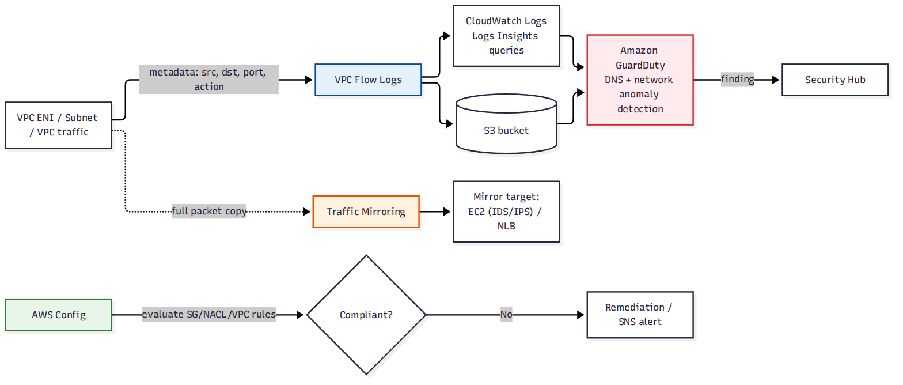

# 📚 Day 50 — Network Monitoring: VPC Flow Logs, Traffic Mirroring, Config ও GuardDuty

> 📊 **Visual Summary** — সহজে বোঝার জন্য diagram:



**সময়:** ২ ঘণ্টা | **Module:** ৮ (Network Security & Monitoring) — Day 2

## 🎯 আজকের লক্ষ্য
- **VPC Flow Logs**: format, destination, filter, Logs Insights query
- Flow logs দিয়ে troubleshooting (REJECT খুঁজে বের করা)
- **Traffic Mirroring**: প্যাকেটের আসল কনটেন্ট দেখা (flow logs যা দেখায় না)
- **AWS Config**: network resource-এর compliance rule
- **GuardDuty**-এর network/DNS দিক গভীরে
- সব একসাথে: একটা security incident-এ কোন tool কী বলে

---

## Part 1: VPC Flow Logs — Revision + গভীরে

**VPC Flow Logs** = VPC, subnet, বা ENI-স্তরে **traffic-এর metadata** (কে কার সাথে, কোন port, কত byte) capture করে। **প্যাকেটের ভেতরের content দেখায় না**, শুধু "কে কথা বলেছে"।

### Record Format (version 2, default)
```
version account-id interface-id srcaddr dstaddr srcport dstport protocol packets bytes start end action log-status
2 111122223333 eni-0abc 10.0.1.5 10.0.2.10 443 51234 6 10 1500 1633024800 1633024860 ACCEPT OK
```

### Custom format (version 5+, recommended) — আরও field
```
${version} ${account-id} ${interface-id} ${srcaddr} ${dstaddr} ${srcport} ${dstport}
${protocol} ${packets} ${bytes} ${start} ${end} ${action} ${log-status}
${vpc-id} ${subnet-id} ${instance-id} ${tcp-flags} ${type} ${pkt-srcaddr} ${pkt-dstaddr}
${az-id} ${flow-direction} ${traffic-path}
```
- `tcp-flags`: SYN, ACK, FIN, RST বোঝা যায় (connection সফল হয়েছিল কিনা)
- `pkt-srcaddr`/`pkt-dstaddr`: NAT-এর **আগের** আসল IP (translated না)
- `flow-direction`: ingress/egress
- `traffic-path`: traffic কোন পথে গেছে (IGW, VGW, intra-VPC, gateway endpoint...)

### Destination
| Destination | কখন |
|---|---|
| **CloudWatch Logs** | Real-time দেখা, Logs Insights query, alarm |
| **S3** | দীর্ঘমেয়াদি, সস্তা, Athena দিয়ে query |
| **Kinesis Data Firehose** | Real-time streaming, 3rd-party SIEM-এ পাঠানো |

### কোথায় enable করবেন
- **VPC-level**: পুরো VPC-র সব ENI
- **Subnet-level**: একটা subnet-এর সব ENI
- **ENI-level**: একটা নির্দিষ্ট interface

---

## Part 2: Flow Logs দিয়ে Troubleshooting

### REJECT খুঁজে বের করা (Logs Insights)
```
fields @timestamp, srcAddr, dstAddr, dstPort, action
| filter action = "REJECT"
| stats count(*) as rejects by srcAddr, dstPort
| sort rejects desc
```
"কে কোন port-এ যেতে পারছে না" — SG/NACL সমস্যা ধরার প্রথম ধাপ।

### একটা নির্দিষ্ট সংযোগ পরীক্ষা
```
fields @timestamp, srcAddr, srcPort, dstAddr, dstPort, protocol, action, bytes
| filter srcAddr = "10.0.1.5" and dstAddr = "10.0.2.10"
| sort @timestamp desc
```

### সন্দেহজনক outbound traffic
```
fields @timestamp, srcAddr, dstAddr, dstPort, bytes
| filter dstPort = 22 or dstPort = 3389
| filter isIpInternal(dstAddr) == 0     -- অনির্দিষ্ট বাইরের IP-তে SSH/RDP চেষ্টা
| stats sum(bytes) as totalBytes by srcAddr, dstAddr
| sort totalBytes desc
```

### ⚠️ Flow Logs-এর সীমা
- **NACL-এর কারণে block** হওয়া traffic-ও Flow Logs-এ দেখা যায় (REJECT), কিন্তু **কোন NACL rule বা SG rule-এর কারণে** ঠিক দেখায় না — সেটা বোঝার জন্য rule review করতে হয়, বা **Reachability Analyzer** (Module 6, Day 36) ব্যবহার করুন
- Flow log-এ **কিছুটা দেরি** হয় (তাৎক্ষণিক না, সাধারণত কয়েক মিনিট)
- DNS query দেখায় না (তার জন্য Route 53 Resolver query logging, Day 13/41)
- Content দেখায় না — সেটার জন্য Traffic Mirroring

---

## Part 3: VPC Traffic Mirroring — আসল প্যাকেট কনটেন্ট

Flow Logs বলে "A থেকে B-তে ৫০০ byte গেছে port 443-এ", কিন্তু **কী গেছে** তা বলে না। কখনো actual packet content দরকার হয়: deep packet inspection, IDS/IPS, malware analysis, forensics।

**Traffic Mirroring** = একটা ENI-র traffic-এর **copy** আরেকটা target (ENI বা NLB)-এ পাঠানো, monitoring appliance বিশ্লেষণ করতে পারে — মূল traffic-এ কোনো প্রভাব ছাড়াই।

```
Source ENI (production instance)
   │ (copy, original চলতে থাকে)
   ▼
Mirror Session (filter: শুধু port 80/443, বা সব)
   │
   ▼
Mirror Target: ENI (monitoring appliance) বা NLB (scale করার জন্য)
```

### গঠন
| উপাদান | কাজ |
|---|---|
| **Mirror source** | যে ENI-র traffic copy হবে |
| **Mirror target** | কোথায় পাঠাবে (ENI বা NLB) |
| **Mirror filter** | কোন traffic (rule: protocol, port range, direction, accept/reject) |
| **Mirror session** | source + target + filter + priority + VNI (encapsulation ID) |

### Filter উদাহরণ
```
Rule 1: Accept, TCP, dest port 80,443, ingress+egress   ← শুধু web traffic mirror
Rule 2: Reject, TCP, dest port 22                        ← SSH traffic মিরর করবেন না (sensitive)
```

### ব্যবহার
- IDS/IPS appliance (Suricata, Zeek) দিয়ে গভীর inspection
- Security incident-এর forensic analysis
- Application troubleshooting (protocol-level debug)
- Compliance-এর জন্য নির্দিষ্ট traffic archive

> ⚠️ Traffic Mirroring খরচ ও bandwidth-এ প্রভাব ফেলে (copy তৈরি করতে GENEVE encapsulation লাগে); শুধু দরকারি traffic filter করে mirror করুন।

---

## Part 4: AWS Config — Network Compliance

**AWS Config** (Interview Q99-এ ভূমিকা) network-এর জন্য বিশেষভাবে গুরুত্বপূর্ণ managed rule:

| Config Rule | চেক করে |
|---|---|
| `vpc-flow-logs-enabled` | সব VPC-তে flow logs চালু আছে কিনা |
| `restricted-ssh` / `restricted-common-ports` | SG-তে `0.0.0.0/0`-এ 22/3389 খোলা কিনা |
| `vpc-sg-open-only-to-authorized-ports` | SG নির্দিষ্ট port ছাড়া খোলা কিনা |
| `subnet-auto-assign-public-ip-disabled` | Private subnet-এ ভুলে public IP auto-assign চালু কিনা |
| `vpc-default-security-group-closed` | Default SG-তে কোনো rule নেই তা নিশ্চিত করা |
| `nacl-no-unrestricted-ssh-rdp` | NACL-এ port 22/3389 সম্পূর্ণ খোলা কিনা |

### Remediation
Config rule non-compliant হলে **SSM Automation document** দিয়ে **auto-remediate** করা যায় (যেমন `0.0.0.0/0`-এর port 22 rule নিজে থেকে মুছে ফেলা)। সতর্কতার সাথে ব্যবহার করুন — ভুল remediation legitimate access-ও কেটে দিতে পারে।

### Conformance Pack
একগুচ্ছ Config rule + remediation একসাথে (CIS Benchmark, PCI-DSS-এর জন্য ready-made pack), Organization-জুড়ে deploy।

---

## Part 5: GuardDuty — Network/DNS দিক গভীরে

Interview Q98/Q16-এ GuardDuty-র সাধারণ ভূমিকা দেখেছি। আজ **কোন data source থেকে কোন network finding** আসে তা স্পষ্ট করি।

### Data source ও তার থেকে আসা finding

| Data source | কী থেকে finding আসে |
|---|---|
| **VPC Flow Logs** | Port scanning, unusual outbound (data exfiltration), known malicious IP-র সাথে communication |
| **DNS logs** | Instance-এর **known C2 domain**-এ query, crypto-mining pool-এর সাথে DNS lookup, DGA (algorithm-generated) domain pattern |
| **CloudTrail** | অস্বাভাবিক API call location/time, root usage, security tool বন্ধ করার চেষ্টা |
| **S3 data events** (optional) | সন্দেহজনক data access/exfiltration pattern |
| **EKS audit logs** | Container-এর সন্দেহজনক আচরণ |
| **Runtime Monitoring** (agent) | Process-level malware, reverse shell |

### গুরুত্বপূর্ণ network-related finding উদাহরণ
```
UnauthorizedAccess:EC2/MaliciousIPCaller.Custom
Backdoor:EC2/C2Activity.B!DNS         ← instance C2 server-এ DNS query করছে
Trojan:EC2/DNSDataExfiltration        ← DNS query দিয়ে data বের করার চেষ্টা (tunneling)
Recon:EC2/PortProbeUnprotectedPort    ← বাইরের কেউ port scan করছে
CryptoCurrency:EC2/BitcoinTool.B      ← crypto-mining software-এর network pattern
```

### Response Automation
```
GuardDuty finding → EventBridge rule (severity ≥ HIGH) → Lambda:
  ├── SG পরিবর্তন করে instance isolate (শুধু forensic SG রাখা)
  ├── IAM credential বাতিল (যদি credential compromise)
  ├── SNS/Slack-এ alert
  └── Snapshot নেওয়া (forensic analysis-এর জন্য, isolate করার আগে)
```

---

## Part 6: সব একসাথে — একটা Incident-এ কে কী বলে

**পরিস্থিতি:** একটা EC2 instance compromise হয়েছে, crypto-mining আর data exfiltration হচ্ছে সন্দেহ।

| Tool | কী দেখাবে |
|---|---|
| **GuardDuty** | `CryptoCurrency:EC2/BitcoinTool` finding, আর `Trojan:EC2/DNSDataExfiltration` |
| **VPC Flow Logs** | ঐ instance-এর ENI থেকে অস্বাভাবিক destination-এ (crypto pool IP) অনেক outbound connection, বড় byte count |
| **Route 53 Resolver query logs** | ঐ instance বারবার অচেনা domain resolve করছে |
| **Traffic Mirroring** (চালু থাকলে) | Mining protocol বা exfiltration-এর আসল packet content |
| **CloudTrail** | কীভাবে compromise হলো — কোন IAM credential/API call দিয়ে instance-এ প্রবেশ করা হয়েছিল |
| **Config** | timeline-এ কী configuration change হয়েছিল (SG খোলা হয়েছিল কিনা) |
| **Security Hub** | সব উপরের finding এক dashboard-এ aggregate |

**Response:** GuardDuty finding → EventBridge → Lambda instance isolate + snapshot → CloudTrail দিয়ে root cause বিশ্লেষণ → credential rotate → patch → পুনরায় চালু।

---

## Part 7: Hands-on Lab

1. VPC-তে **Flow Logs** চালু (custom format, CloudWatch Logs destination)
2. SG দিয়ে একটা port block করে রাখা instance-এ সেই port-এ connect করার চেষ্টা করুন; Logs Insights দিয়ে `action = REJECT` খুঁজুন
3. `GuardDuty` চালু করে **sample finding generate** করুন (console-এ built-in feature) — কী ধরনের finding আসে দেখুন
4. একটা Config rule (`restricted-ssh`) চালু করে ইচ্ছাকৃত `0.0.0.0/0:22` SG বানিয়ে non-compliant দেখুন
5. **বোনাস (Traffic Mirroring):** একটা mirror session বানিয়ে (target: আরেকটা EC2-র ENI) সেই target-এ `tcpdump`/Wireshark দিয়ে mirrored traffic দেখুন
6. সব মুছুন / বন্ধ করুন

---

## 🎯 আজকের মূল Takeaways

1. **VPC Flow Logs** = metadata (কে-কাকে-কখন-কত), content না; custom format-এ `tcp-flags`, `pkt-srcaddr`, `traffic-path`
2. Logs Insights দিয়ে REJECT খুঁজে troubleshoot; সঠিক কোন rule-এর কারণে জানতে Reachability Analyzer
3. **Traffic Mirroring** = আসল packet content, IDS/forensic-এর জন্য; filter দিয়ে শুধু দরকারি অংশ
4. **Config**: network-এর compliance rule (`restricted-ssh`, `vpc-flow-logs-enabled`); auto-remediation সতর্কতার সাথে
5. **GuardDuty**: VPC Flow Logs + DNS logs + CloudTrail থেকে network-related threat (C2, exfiltration, port scan, crypto-mining)
6. Incident-এ সব tool একসাথে ব্যবহার করে পুরো ছবি বোঝা

---

## 📝 Self-check Questions

1. Flow Logs-এ `REJECT` দেখাচ্ছে কিন্তু বোঝা যাচ্ছে না SG নাকি NACL-এর কারণে। কী ব্যবহার করবেন?
2. Flow Logs কি DNS query দেখায়?
3. আসল packet-এর payload দেখতে হলে কোন tool?
4. GuardDuty-র `Trojan:EC2/DNSDataExfiltration` finding কোন data source থেকে আসে?
5. একটা SG rule `0.0.0.0/0:22` তৈরি হওয়ার সাথে সাথে জানতে/আটকাতে কী ব্যবহার করবেন?
6. Traffic Mirroring-এ SSH traffic mirror না করা কেন যুক্তিসঙ্গত হতে পারে?
7. একটা security incident-এ কোন সময়ে কী পরিবর্তন হয়েছিল তা জানতে কোন service?

<details><summary>▶ উত্তর দেখুন</summary>

1. VPC Reachability Analyzer, যেটা path বিশ্লেষণ করে সঠিক কোন component (SG/NACL/route) block করছে তা দেখায়।
2. না; DNS query দেখতে Route 53 Resolver query logging লাগে।
3. VPC Traffic Mirroring।
4. DNS logs (instance-এর DNS query pattern data tunneling-এর মতো দেখাচ্ছে)।
5. AWS Config rule (`restricted-ssh`) দিয়ে detect, EventBridge + Lambda বা Config auto-remediation দিয়ে আটকানো/ঠিক করা।
6. SSH traffic-এ sensitive credential থাকতে পারে; শুধু দরকারি (যেমন web) traffic mirror করে খরচ ও exposure কমানো।
7. AWS Config (configuration history/timeline) এবং CloudTrail (কে, কখন, কোন API call করেছে)।
</details>

---

## 💡 Pro Tips

- Flow Logs-এর custom format ব্যবহার করুন, default format-এ `traffic-path` আর `pkt-srcaddr` মতো গুরুত্বপূর্ণ field নেই
- GuardDuty-র finding-এ severity অনুযায়ী priority দিন (CRITICAL/HIGH আগে)
- Traffic Mirroring শুধু incident investigation বা নির্দিষ্ট compliance দরকারে চালু রাখুন, সবসময় না (খরচ)
- Config + CloudTrail + GuardDuty + Flow Logs সব **Security Hub**-এ aggregate করলে একটা dashboard-এই পুরো ছবি
- Flow Logs S3-তে রেখে Athena দিয়ে query করলে দীর্ঘমেয়াদি pattern খোঁজা সহজ ও সস্তা

---

## 🎨 Quick Reference

```
Flow Logs: metadata only (who-whom-when-how much); custom format for tcp-flags, pkt-srcaddr, traffic-path
           destinations: CloudWatch Logs | S3 | Kinesis Firehose
Traffic Mirroring: actual packet copy → ENI/NLB target, with filter rules (IDS, forensics)
Config: network compliance rules (restricted-ssh, vpc-flow-logs-enabled) + SSM auto-remediation
GuardDuty network findings from: VPC Flow Logs + DNS logs + CloudTrail
  → Recon:PortProbe | Backdoor:C2Activity | Trojan:DNSDataExfiltration | CryptoCurrency:BitcoinTool
Reachability Analyzer: which exact SG/NACL/route is blocking a path
```

---

## 🚨 বাস্তব পরিস্থিতি (যেসব ভুল প্রায়ই হয়)

**পরিস্থিতি ১:** কোনো VPC-তে Flow Logs চালু ছিল না। একটা security incident হওয়ার পর investigation-এর জন্য কোনো historical network data পাওয়া গেল না।
**শিক্ষা:** সব production VPC-তে Flow Logs default চালু (Config rule দিয়ে enforce)।

**পরিস্থিতি ২:** GuardDuty finding আসছিল কিন্তু কেউ দেখছিল না — শুধু console-এ পড়ে ছিল। মাসখানেক পর ধরা পড়ল একটা instance অনেকদিন ধরে crypto-mine করছিল।
**শিক্ষা:** Finding-এর জন্য EventBridge + SNS/Slack alert, শুধু console dashboard যথেষ্ট না।

**পরিস্থিতি ৩:** Config auto-remediation দিয়ে সব `0.0.0.0/0` SG rule স্বয়ংক্রিয়ভাবে মুছে ফেলার rule চালু করা হলো, কিন্তু একটা legitimate public-facing ALB-এর rule-ও মুছে গিয়ে outage হলো।
**শিক্ষা:** Auto-remediation-এ scope আর exception ঠিকমতো define করুন, ব্যাপক rule বিপজ্জনক।

---

**⏮ আগের দিন:** [Day 49 — WAF, Shield ও Network Firewall](./Day-49-WAF-Shield-Network-Firewall-Deep-Dive.md) | **⏭ পরের দিন:** [Day 51 — Security Hub, Inspector, Access Analyzer, Macie ও Detective](./Day-51-Security-Hub-Inspector-Access-Analyzer-Macie-Detective.md)
