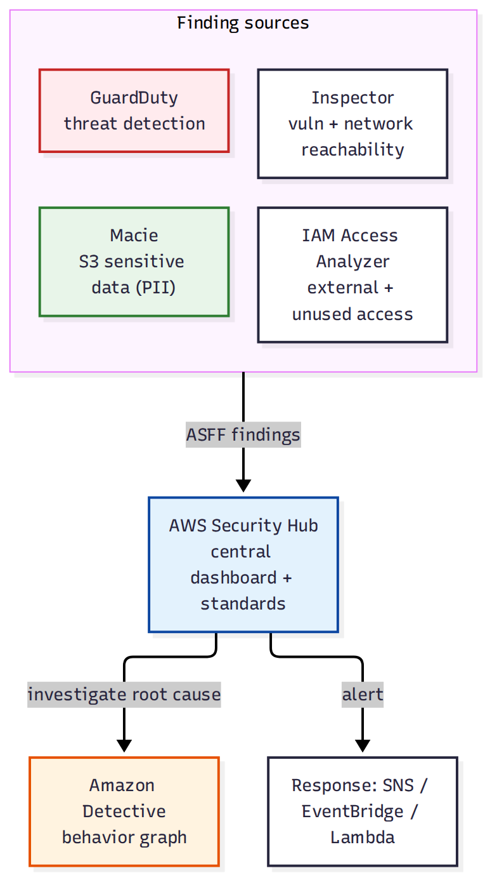

# 📚 Day 51 — Security Services: Security Hub, Inspector, Access Analyzer, Macie ও Detective

> 📊 **Visual Summary** — সহজে বোঝার জন্য diagram:



**সময়:** ২ ঘণ্টা | **Module:** ৮ (Network Security & Monitoring) — Day 3

## 🎯 আজকের লক্ষ্য
- **Security Hub**: সব security tool-এর central dashboard, standard, ASFF
- **Amazon Inspector**-এর **network reachability** দিক (নতুন)
- **IAM Access Analyzer**-এর দুই কাজ: external access + unused access
- **Macie**: S3-এর sensitive data (PII) খুঁজে বের করা
- **Detective**: root cause investigation, behavior graph
- সব security service একসাথে কীভাবে কাজ করে (workflow)

> 📖 GuardDuty (Day 50), Inspector আর Macie-র ভূমিকা Interview Q98-Q100-এ সংক্ষেপে ছিল। আজ Security Hub-এর দৃষ্টিতে সব একসাথে দেখব, আর Inspector-এর network reachability (নতুন কোণ) + Access Analyzer + Detective গভীরে।

---

## Part 1: AWS Security Hub — Central Dashboard

সমস্যা: GuardDuty, Inspector, Macie, Config, Firewall Manager — প্রতিটার নিজস্ব console, আলাদা আলাদা দেখতে হয়। **Security Hub** সব finding **এক জায়গায়** আনে।

```
GuardDuty ──┐
Inspector ──┤
Macie ──────┼──► Security Hub (ASFF format) ──► Insights, Score, EventBridge
Config ─────┤
IAM Access Analyzer ─┘
```

### মূল feature
| Feature | কাজ |
|---|---|
| **Aggregation** | সব AWS security service + 3rd-party tool-এর finding, একই **ASFF (AWS Security Finding Format)**-এ |
| **Security Standards** | **AWS Foundational Security Best Practices**, **CIS AWS Foundations Benchmark**, **PCI DSS** — automated check চালিয়ে compliance score দেয় |
| **Insights** | পূর্বনির্ধারিত বা custom query (যেমন "সবচেয়ে বেশি compromise-এর ঝুঁকিতে থাকা EC2 instance") |
| **Security score** | কতগুলো check pass করেছে (%), সময়ের সাথে track |
| **Cross-account/region aggregation** | Organization-এর সব account-এর finding একটা admin account-এ |
| **Automated response** | EventBridge rule → finding severity অনুযায়ী Lambda/SSM automation (Custom Actions) |

### Workflow
```
1. Security Hub চালু + standards enable (CIS, FSBP)
2. GuardDuty, Inspector, Macie, Config চালু (Security Hub এদের সাথে integrate করে)
3. Finding আসে → severity/status অনুযায়ী triage
4. EventBridge rule: CRITICAL/HIGH → Slack/PagerDuty alert, বা auto-remediation Lambda
5. Insights দিয়ে trend দেখা, security score-এ improvement track
```

> Security Hub নিজে scan করে না (Config rule ছাড়া) — এটা **aggregator + standard checker**। আসল detection GuardDuty/Inspector/Macie করে।

---

## Part 2: Amazon Inspector — Network Reachability (নতুন কোণ)

Interview Q100-এ Inspector-এর vulnerability scanning (CVE) দেখেছি। Inspector-এর আরেকটা গুরুত্বপূর্ণ দিক — **network reachability analysis**।

### কী করে
Inspector প্রতিটা EC2 instance-এর জন্য বিশ্লেষণ করে:
- SG, NACL, route table, IGW/NAT/peering/VPN — **সব মিলিয়ে**
- **কোন port internet থেকে সরাসরি পৌঁছানো যায়** (reachable), সেটা কি ইচ্ছাকৃত নাকি ভুল

```
Instance i-0abc123
  Port 22 (SSH): reachable from 0.0.0.0/0    ⚠️ সমস্যা!
  Port 443 (HTTPS): reachable from 0.0.0.0/0  ✅ ইচ্ছাকৃত (public web server)
  Port 3306 (MySQL): reachable from 0.0.0.0/0 🚨 CRITICAL (DB সরাসরি খোলা!)
```

### Inspector Risk Score
শুধু CVSS score না, **context** যোগ করে:
```
Risk Score = CVSS base score × Exploitability × Network Reachability
```
একটা vulnerability যদি **internet-facing** instance-এ থাকে, সেটা একই vulnerability-র **private, unreachable** instance-এর চেয়ে অনেক বেশি priority পায় — এটাই Inspector-এর contextual risk scoring-এর মূল সুবিধা।

### Continuous scanning
- EC2, ECR image, Lambda — নতুন CVE publish হলে বা নতুন package install হলে **automatically** re-scan
- SBOM (Software Bill of Materials) export

---

## Part 3: IAM Access Analyzer — দুই ধরনের বিশ্লেষণ

### 1️⃣ External Access Analyzer (পুরনো, পরিচিত)
S3 bucket, IAM role, KMS key, Lambda, SQS, SNS, Secrets Manager — এসবের resource policy বিশ্লেষণ করে বলে **"এই resource কি Organization-এর বাইরের কেউ access করতে পারে?"**

```
Finding: S3 bucket "shopbd-backups" — bucket policy অনুযায়ী account 999999999999 (বহিরাগত) থেকে s3:GetObject করা যায়
```

### 2️⃣ Unused Access Analyzer (নতুন, গুরুত্বপূর্ণ)
Least privilege (Interview Q37)-এর জন্য সবচেয়ে কার্যকর tool। CloudTrail-এর actual API usage বিশ্লেষণ করে বের করে:
- **Unused permissions**: IAM policy-তে দেওয়া কিন্তু ৯০+ দিনে ব্যবহার হয়নি এমন action
- **Unused roles**: কখনো assume হয়নি এমন role
- **Unused access keys**: দীর্ঘদিন ব্যবহার হয়নি এমন access key

```
Finding: role "data-processor" -এর policy-তে dynamodb:DeleteTable আছে,
         কিন্তু গত ৯০ দিনে কখনো ব্যবহার হয়নি → সরিয়ে ফেলার সুপারিশ
```

### 3️⃣ Policy Generation (Access Analyzer-এর আরেকটা ব্যবহার)
CloudTrail log দেখে **actual ব্যবহৃত action**-এর ভিত্তিতে একটা **least-privilege policy draft** তৈরি করে দেয় — নতুন role তৈরি বা পুরনো role-এর permission কমানোর সময় খুব কাজের।

### Custom Policy Checks
নতুন IAM policy লেখার/দেওয়ার সময় validate করে:
- **Security warnings**: policy কি খুব বেশি permissive?
- **Errors**: syntax ভুল
- **Check against**: "এই নতুন policy কি আগে যা ছিল তার চেয়ে বেশি access দেয়?" (CI/CD pipeline-এ IAM policy deploy করার আগে চালানো যায়)

---

## Part 4: Macie — S3-এর Sensitive Data

**Macie** ML আর pattern matching দিয়ে S3-এর object-এ **PII/sensitive data** খুঁজে বের করে, আর bucket-এর security posture দেখে।

### দুই ধরনের কাজ
| কাজ | কী দেখে |
|---|---|
| **Bucket-level (automated discovery)** | প্রতিটা bucket public কিনা, encrypted কিনা, sharing (cross-account) আছে কিনা — চালু হলেই automatic, নিয়মিত |
| **Sensitive data discovery job** | Object-এর **ভেতরের content** স্ক্যান করে: credit card number, SSN, passport, API key, medical record ইত্যাদি খুঁজে বের করে |

### Managed data identifiers (উদাহরণ)
- Financial: credit card number, bank account
- PII: name + address, national ID, passport number
- Credentials: AWS access key, private key
- Custom identifier: নিজের regex দিয়ে (যেমন company-নির্দিষ্ট customer ID format)

### Workflow
```
1. Macie চালু → automated discovery সব bucket স্ক্যান করে
2. High-priority bucket-এ sensitive data discovery job চালানো (sample বা পুরো bucket)
3. Finding: "orders-export bucket-এ 4,500 object-এ credit card number pattern পাওয়া গেছে"
4. Security team: encryption/access review, বা bucket policy কড়া করা
5. Security Hub-এ finding পাঠানো
```

> Macie খরচ data-র পরিমাণ অনুযায়ী; বড় bucket-এ প্রথমে **sampling** দিয়ে scope বোঝা ভালো।

---

## Part 5: Amazon Detective — Root Cause Investigation

GuardDuty একটা finding দেয় ("এই instance সন্দেহজনক"), কিন্তু **"কেন? কীভাবে শুরু হলো? আর কী প্রভাবিত হয়েছে?"** — এই গভীর তদন্তের জন্য **Detective**।

### কীভাবে কাজ করে
- CloudTrail, VPC Flow Logs, GuardDuty findings থেকে automatically একটা **behavior graph** তৈরি করে (৩৬৫ দিন পর্যন্ত data)
- Entity-গুলোর (IAM role, IP address, EC2 instance) মধ্যে সম্পর্ক visualize করে
- "এই IP আর কোন কোন resource-এর সাথে কথা বলেছে?", "এই role গত এক মাসে কী কী করেছে?" — এমন প্রশ্নের দ্রুত উত্তর

```
GuardDuty finding: "role X থেকে অস্বাভাবিক API call"
   → Detective-এ click → দেখা যায়:
       role X গত ৩০ দিনে কোন কোন IP থেকে ব্যবহৃত হয়েছে
       কোন কোন API call করেছে (timeline সহ)
       কোন resource access করেছে
       → বোঝা যায়: credential leak হয়েছিল, নাকি insider, নাকি misconfiguration
```

### GuardDuty বনাম Detective
| | GuardDuty | Detective |
|---|---|---|
| কাজ | **Detect** (কিছু ভুল হচ্ছে কিনা বলা) | **Investigate** (কেন, কীভাবে, কতদূর বলা) |
| Output | Finding (alert) | Behavior graph, timeline, visualization |
| ব্যবহার | Real-time monitoring | Incident হওয়ার পর deep dive |

---

## Part 6: সব Security Service একসাথে — Workflow Diagram

```
প্রতিরোধ (Prevent)     detection (Detect)        তদন্ত (Investigate)      প্রতিকার (Respond)
─────────────────      ──────────────────        ────────────────────     ─────────────────
SCP (Module 6)          GuardDuty (threat)         Detective (root cause)   Lambda auto-remediation
WAF/Shield/NF (Day 49)  Config (compliance)        CloudTrail (audit)       SSM Automation
IAM least priv          Inspector (vuln + reach)                           Security Hub Custom Action
Access Analyzer         Macie (sensitive data)
   │                          │                           │                       │
   └──────────────────────────┴─────► Security Hub (aggregation, ASFF, score) ◄───┘
                                              │
                                      EventBridge → SNS/Slack/Lambda
```

---

## Part 7: Hands-on Lab

1. Security Hub চালু, **AWS Foundational Security Best Practices** standard enable, প্রাথমিক security score দেখুন
2. GuardDuty, Config চালু থাকলে Security Hub-এ finding aggregate হচ্ছে কিনা দেখুন
3. IAM Access Analyzer:
   - External Access analyzer চালু, একটা S3 bucket-এ cross-account policy দিয়ে finding তৈরি করুন
   - Unused Access analyzer চালু করে (৯০ দিনের ডেটা লাগবে; নতুন account-এ কম দেখাবে) কনসেপ্ট বুঝুন
4. Macie চালু করে automated discovery দেখুন, একটা test bucket-এ ভুয়া credit card নম্বরসহ ফাইল রেখে sensitive data discovery job চালান
5. **বোনাস (Detective):** Detective চালু করে (GuardDuty ও চালু থাকতে হবে) একটা sample finding-এ click করে behavior graph দেখুন
6. সব বন্ধ/মুছে ফেলুন (কিছু service-এ ট্রায়ালের পরে খরচ আছে)

---

## 🎯 আজকের মূল Takeaways

1. **Security Hub** = সব security tool-এর aggregator + compliance standard checker (CIS, FSBP, PCI); নিজে detect করে না
2. **Inspector**-এর network reachability: শুধু CVE না, **কোন vulnerability internet থেকে পৌঁছানো যায়** তা priority দেয়
3. **Access Analyzer**: external access (কে বাইরে থেকে দেখতে পারে) + **unused access** (least privilege-এর জন্য সেরা tool) + policy generation
4. **Macie**: bucket-level posture (automated) + sensitive data content scan (job)
5. **Detective**: GuardDuty-র finding-এর **root cause** — behavior graph দিয়ে "কেন, কীভাবে, কতদূর"
6. Prevent → Detect → Investigate → Respond — একটা pipeline, Security Hub সবকিছু এক জায়গায় দেখায়

---

## 📝 Self-check Questions

1. Security Hub নিজে কি vulnerability scan করে?
2. একটা EC2-তে একই CVE severity-র দুটো vulnerability, একটা public, একটা private subnet-এ। Inspector কোনটাকে বেশি priority দেবে, কেন?
3. একটা IAM role-এর policy-তে ৫০টা action আছে, কিন্তু ৬ মাসে মাত্র ৫টা ব্যবহার হয়েছে। কোন tool এটা ধরবে?
4. S3 bucket-এ customer-এর credit card number আছে কিনা কীভাবে জানবেন?
5. GuardDuty বলছে একটা role-এ সন্দেহজনক activity, কিন্তু কেন/কীভাবে হলো বুঝতে কী ব্যবহার করবেন?
6. নতুন IAM policy deploy করার আগে সেটা অতিরিক্ত permissive কিনা কীভাবে যাচাই করবেন?
7. Security Hub-এর "security score" কী পরিমাপ করে?

<details><summary>▶ উত্তর দেখুন</summary>

1. না; এটা GuardDuty/Inspector/Macie/Config-এর finding aggregate করে, নিজে scan করে না (নিজস্ব compliance standard check ছাড়া)।
2. Public subnet-এরটা; কারণ Inspector risk score-এ network reachability যোগ হয়, internet-facing vulnerability বেশি বিপজ্জনক।
3. IAM Access Analyzer-এর **Unused Access** analyzer।
4. Macie-তে sensitive data discovery job চালিয়ে (credit card managed data identifier)।
5. Amazon Detective (behavior graph দিয়ে timeline, related entity)।
6. IAM Access Analyzer-এর **Custom Policy Checks** (CI/CD-তে দিয়ে policy deploy-এর আগে validate)।
7. কতগুলো security best practice check pass করছে (%), সময়ের সাথে trend।
</details>

---

## 💡 Pro Tips

- Security Hub-এর **Insights** নিয়মিত দেখুন, শুধু individual finding না — pattern খুঁজুন
- Access Analyzer-এর Unused Access finding মাসে একবার review করে role/policy ছোট করুন (least privilege maintenance)
- Macie প্রথমে **sampling** দিয়ে scope বুঝে তারপর পুরো bucket scan করুন, খরচ নিয়ন্ত্রণে রাখতে
- Detective শুধু GuardDuty চালু থাকলেই সবচেয়ে কার্যকর — আগে থেকে চালু রাখুন, incident হওয়ার পর চালু করলে পুরনো data থাকবে না
- সব service **Organization-এর delegated admin** দিয়ে কেন্দ্রীয়ভাবে manage করুন (Module 6-এর multi-account pattern-এর মতো)

---

## 🎨 Quick Reference

```
Security Hub: aggregator (ASFF) + standards (CIS, FSBP, PCI) + score + Insights + auto-response
Inspector: CVE + network reachability → contextual risk score (internet-facing = higher priority)
Access Analyzer: external access (who outside can see) + unused access (least-privilege) + policy generation + custom policy checks
Macie: bucket posture (auto) + sensitive data discovery job (content scan, managed/custom identifiers)
Detective: root cause investigation, behavior graph, 365-day history (needs GuardDuty)
Pipeline: Prevent (SCP/WAF/IAM) → Detect (GuardDuty/Config/Inspector/Macie) → Investigate (Detective/CloudTrail) → Respond (Lambda/SSM)
```

---

## 🚨 বাস্তব পরিস্থিতি (যেসব ভুল প্রায়ই হয়)

**পরিস্থিতি ১:** Team ভেবেছিল Security Hub চালু করলেই automatically সব vulnerability/threat scan হবে। আসলে GuardDuty/Inspector/Config আলাদাভাবে চালু করতে হতো, তাই মাসের পর মাস কোনো real finding আসেনি।
**শিক্ষা:** Security Hub aggregator মাত্র; underlying service-গুলো আলাদাভাবে চালু করতে হয়।

**পরিস্থিতি ২:** একটা role-এ বছরের পর বছর `AdministratorAccess`-এর মতো বড় policy ছিল "সময় বাঁচানোর জন্য"। Compromise হলে পুরো account ঝুঁকিতে পড়ল। Access Analyzer-এর Unused Access finding কখনো review করা হয়নি।
**শিক্ষা:** নিয়মিত Unused Access review, least privilege maintenance একবারের কাজ না।

**পরিস্থিতি ৩:** একটা backup bucket-এ customer data years ধরে ছিল, কেউ জানত না সেখানে unencrypted credit card নম্বর আছে। Compliance audit-এ ধরা পড়ল, বড় জরিমানার ঝুঁকি।
**শিক্ষা:** Macie দিয়ে নিয়মিত sensitive data discovery, বিশেষ করে backup/export bucket-এ।

---

**⏮ আগের দিন:** [Day 50 — VPC Flow Logs, Traffic Mirroring ও GuardDuty](./Day-50-VPC-Flow-Logs-Traffic-Mirroring-GuardDuty.md) | **⏭ পরের দিন:** [Day 52 — Compliance ও Audit: CloudTrail, Config Rules, Encryption ও Secrets Rotation](./Day-52-Compliance-Audit-CloudTrail-Config-Encryption-Secrets.md)
