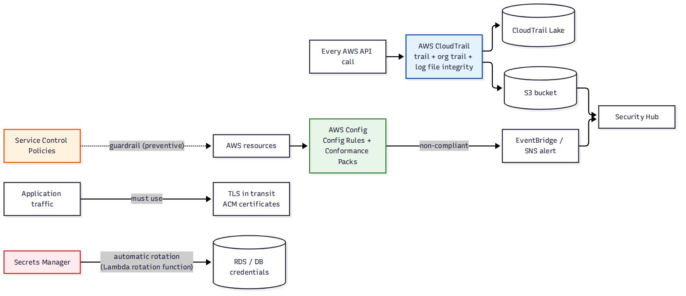

# 📚 Day 52 — Compliance ও Audit: CloudTrail, Config Rules, SCP, Encryption ও Secrets Rotation

> 📊 **Visual Summary** — সহজে বোঝার জন্য diagram:



**সময়:** ১.৫ ঘণ্টা | **Module:** ৮ (Network Security & Monitoring) — Day 4

## 🎯 আজকের লক্ষ্য
- **CloudTrail** গভীরে: trail, event type, organization trail, log file integrity, Lake
- **Config Rules ও Conformance Pack** দিয়ে continuous compliance
- **SCP**-কে compliance guardrail হিসেবে (revision + network-নির্দিষ্ট)
- **Encryption in transit**: TLS সব জায়গায় নিশ্চিত করা
- **Secrets rotation**: Secrets Manager-এর automatic rotation গভীরে (Lambda rotation function)
- সব মিলিয়ে একটা compliance framework

> 📖 CloudTrail-এর মূল ধারণা Interview Q51-এ, SCP Q42-এ, Secrets Manager Q40-এ আছে। আজ network/compliance দৃষ্টিতে গভীরে, আর automatic rotation-এর ভেতরের কাজ।

---

## Part 1: CloudTrail গভীরে

### Event Type — Revision + বিস্তারিত

| Event type | কী | Default |
|---|---|---|
| **Management events** | Control plane action: `CreateVPC`, `RunInstances`, `AuthorizeSecurityGroupIngress`, `PutBucketPolicy` | ✅ চালু, ৯০ দিন free (Event history) |
| **Data events** | Resource-level action: S3 `GetObject`/`PutObject`, Lambda `Invoke`, DynamoDB item-level | ❌ আলাদাভাবে চালু, বাড়তি খরচ (উচ্চ volume) |
| **Insights events** | ML দিয়ে **অস্বাভাবিক API call pattern** detect (হঠাৎ `RunInstances`-এর সংখ্যা বেড়ে যাওয়া) | ❌ আলাদা চালু, বাড়তি খরচ |
| **Network activity events** (নতুন) | VPC endpoint-এর মধ্য দিয়ে যাওয়া AWS API call (নতুন ক্যাটাগরি) | ❌ আলাদা চালু |

### Trail — দীর্ঘমেয়াদি রাখা
- **Event history** (default) মাত্র ৯০ দিন, শুধু console/API-তে দেখা যায়
- **Trail** বানালে সব event **S3**-এ (+ চাইলে CloudWatch Logs) চিরস্থায়ী ভাবে যায়
- **Organization trail**: management account থেকে বানালে সব member account-এর event automatically একই S3 bucket-এ (Module 6-এর multi-account-এর সাথে সংযোগ)
- **Log file integrity validation**: প্রতিটা log file-এর hash আরেকটা file-এ রাখা হয় (digest file), কেউ log বদলালে/মুছলে ধরা পড়ে (tamper-evident)

### CloudTrail Lake
SQL দিয়ে সরাসরি CloudTrail event query (আলাদা S3/Athena setup ছাড়াই):
```sql
SELECT eventTime, userIdentity.arn, eventName, sourceIPAddress
FROM event_data_store
WHERE eventName = 'AuthorizeSecurityGroupIngress'
  AND eventTime > '2026-01-01'
ORDER BY eventTime DESC
```
Long-term retention (৭ বছর পর্যন্ত), compliance audit-এর জন্য সুবিধাজনক।

### Network-নির্দিষ্ট গুরুত্বপূর্ণ event (alarm দিন)
```
AuthorizeSecurityGroupIngress / RevokeSecurityGroupIngress
CreateInternetGateway / AttachInternetGateway
CreateVpcPeeringConnection
DeleteFlowLogs
CreateRoute / DeleteRoute (0.0.0.0/0-এর route)
ModifyVpcEndpointServicePermissions
```

---

## Part 2: Config Rules ও Conformance Pack — Continuous Compliance

Day 50-এ network-নির্দিষ্ট Config rule দেখেছি। আজ পুরো compliance framework হিসেবে।

### Managed vs Custom Rule
| | Managed Rule | Custom Rule |
|---|---|---|
| কে লেখে | AWS (২০০+ ready-made) | আপনি (Lambda বা **Guard** — declarative policy language) |
| উদাহরণ | `s3-bucket-public-read-prohibited`, `encrypted-volumes` | কোম্পানি-নির্দিষ্ট নিয়ম (যেমন সব resource-এ `CostCenter` tag বাধ্যতামূলক) |

### Conformance Pack
একগুচ্ছ Config rule + remediation, একসাথে deploy:
- **Operational Best Practices for CIS AWS Foundations Benchmark**
- **PCI DSS**, **HIPAA**, **NIST**-ভিত্তিক ready-made pack
- Organization-এর সব account-এ StackSet-এর মতো deploy

### Compliance Dashboard
```
Conformance Pack: CIS-Benchmark
  Rule: restricted-ssh              → 45/50 accounts COMPLIANT
  Rule: root-account-mfa-enabled    → 50/50 accounts COMPLIANT
  Rule: cloudtrail-enabled          → 48/50 accounts COMPLIANT
```
Non-compliant resource-এর তালিকা, আর কবে থেকে non-compliant তার timeline।

---

## Part 3: SCP — Compliance Guardrail হিসেবে (Revision)

Module 6, Day 40-এ network guardrail দেখেছি। Compliance দৃষ্টিতে SCP-র ভূমিকা:

```json
{
  "Effect": "Deny",
  "Action": ["cloudtrail:StopLogging", "cloudtrail:DeleteTrail", "cloudtrail:UpdateTrail"],
  "Resource": "*"
}
```
```json
{
  "Effect": "Deny",
  "Action": ["config:DeleteConfigRule", "config:StopConfigurationRecorder"],
  "Resource": "*"
}
```
**নিয়ম:** যেসব service compliance-এর জন্য জরুরি (CloudTrail, Config, GuardDuty) — সেগুলো **বন্ধ করা বা মুছে ফেলা** SCP দিয়ে নিষেধ করুন। এভাবে technical control আর policy control দুটো একসাথে কাজ করে: Config **detect** করে অনিয়ম, SCP **prevent** করে সেই detection-কেই বন্ধ করা।

---

## Part 4: Encryption in Transit — সব জায়গায় নিশ্চিত করা

Interview Q101-এ at-rest/in-transit-এর তুলনা দেখেছি। আজ **network audit-এর দৃষ্টিতে কীভাবে নিশ্চিত করবেন**।

### Checklist — কোথায় TLS নিশ্চিত করবেন
| জায়গা | কীভাবে enforce |
|---|---|
| **Client → ALB/CloudFront** | HTTP listener-এ redirect to HTTPS (Day 43, 47); HTTP listener সম্পূর্ণ বন্ধও করা যায় |
| **ALB/CloudFront → Origin** | Origin protocol policy = HTTPS only |
| **S3 bucket access** | Bucket policy: `aws:SecureTransport = false` হলে Deny (Interview Q19-এ দেখেছি) |
| **RDS connection** | Parameter group-এ `rds.force_ssl = 1` (PostgreSQL/MySQL) |
| **VPC-এর ভেতরে** | Nitro instance-এর মধ্যে traffic automatic encrypted (সমর্থিত instance type); app-level mTLS যোগ করা যায় |
| **On-prem ↔ AWS** | Site-to-Site VPN (IPsec, built-in) বা Direct Connect + MACsec/VPN over DX (Module 6) |
| **Route 53 Resolver** | DoH (DNS over HTTPS) সমর্থন যাচাই |

### Audit করার উপায়
- **AWS Config rule**: `alb-http-to-https-redirection-check`, `s3-bucket-ssl-requests-only`, `rds-instance-http-check`
- **Security Hub**: FSBP standard-এর অনেক check TLS/encryption-এর জন্য
- **Network Firewall**: TLS inspection দিয়ে দেখা কেউ plaintext দিয়ে sensitive data পাঠাচ্ছে কিনা

---

## Part 5: Secrets Rotation — গভীরে

Interview Q40-এ Secrets Manager বনাম Parameter Store দেখেছি। আজ **automatic rotation ভেতরে কীভাবে কাজ করে**।

### Rotation-এর চারটা ধাপ (Lambda rotation function)
```
createSecret  → নতুন password তৈরি, secret-এ "AWSPENDING" label দিয়ে সংরক্ষণ
setSecret     → ঐ নতুন password দিয়ে actual database/service-এ user-এর password বদলানো
testSecret    → নতুন credential দিয়ে connect করে যাচাই (সত্যিই কাজ করছে কিনা)
finishSecret  → সফল হলে "AWSPENDING" → "AWSCURRENT" label বদলে চূড়ান্ত করা
```

```
সময়    label
t0     AWSCURRENT = old_password
t1     createSecret → AWSPENDING = new_password (DB-তে এখনো বদলায়নি)
t2     setSecret → DB-তে new_password সেট করা হলো
t3     testSecret → new_password দিয়ে connect test ✅
t4     finishSecret → AWSCURRENT = new_password, AWSPENDING সরানো
```

### Built-in rotation (কোনো code লিখতে হয় না)
RDS (MySQL, PostgreSQL, MariaDB, SQL Server, Oracle), Redshift, DocumentDB-এর জন্য AWS **ready-made rotation Lambda template** দেয়। শুধু secret বানিয়ে rotation চালু করলেই হয়:
```bash
aws secretsmanager rotate-secret --secret-id prod/db/password \
  --rotation-lambda-arn arn:aws:lambda:...:function:SecretsManagerRDSRotation \
  --rotation-rules AutomaticallyAfterDays=30
```

### Custom rotation (নিজের API key, 3rd-party service)
নিজের Lambda লিখতে হয় উপরের ৪টা step follow করে — এটাই সবচেয়ে flexible কিন্তু বেশি কাজ।

### ⚠️ Rotation-এর সাধারণ সমস্যা (Day 26-এর সাথে সংযোগ)
Lambda যদি secret **cache** করে রাখে (Day 26-এর idempotency/caching pattern), rotation হওয়ার পরও পুরনো password দিয়ে চেষ্টা করে fail করতে পারে।
**সমাধান:**
- Cache-এ TTL দিন, বা
- `AccessDenied`/authentication error পেলে **cache invalidate করে আবার fetch** করার logic রাখুন
- Rotation window-এ (multi-user rotation strategy) দুই set credential আগে থেকে active রাখা যায় (zero-downtime rotation)

---

## Part 6: সব মিলিয়ে — Compliance Framework

```
Prevent:   SCP (guardrail) + IAM least privilege + Network Firewall (Day 49)
Detect:    Config Rules + Conformance Pack + GuardDuty (Day 50) + Security Hub (Day 51)
Audit:     CloudTrail (organization trail, Lake, integrity validation)
Encrypt:   TLS everywhere (in transit) + KMS (at rest, Interview Q39)
Rotate:    Secrets Manager automatic rotation
Aggregate: Security Hub (compliance score, standards)
```

**একটা audit-এর প্রশ্নের উত্তর কোথায় পাবেন:**
| Auditor-এর প্রশ্ন | উত্তর |
|---|---|
| "গত ৬ মাসে কে root account ব্যবহার করেছে?" | CloudTrail Lake query |
| "আমাদের সব S3 bucket কি encrypted?" | Config rule `s3-bucket-server-side-encryption-enabled` |
| "DB password কতদিন পরপর বদলায়?" | Secrets Manager rotation schedule |
| "নেটওয়ার্ক configuration-এর change history?" | Config resource timeline |
| "PCI-DSS-এর সব requirement মানা হচ্ছে?" | Security Hub PCI DSS standard score |

---

## Part 7: Hands-on Lab

1. Organization trail (বা single trail) বানিয়ে S3 + log file integrity validation চালু
2. CloudTrail Lake event data store বানিয়ে একটা query চালান (`SELECT * FROM event_data_store WHERE eventName = 'CreateVpc'`)
3. Config-এ Conformance Pack `Operational-Best-Practices-for-CIS-AWS-Foundations-Benchmark` deploy করে compliance score দেখুন
4. একটা S3 bucket policy-তে `aws:SecureTransport: false` → Deny যোগ করে HTTP দিয়ে access করার চেষ্টা করুন (ব্যর্থ হওয়া উচিত)
5. RDS secret-এ automatic rotation চালু করুন (৩০ দিন), rotation-এর প্রথম ধাপ manually trigger করে CloudWatch log-এ ৪টা ধাপ দেখুন
6. SCP-তে `cloudtrail:StopLogging` deny যোগ করে trail বন্ধ করার চেষ্টা করুন → AccessDenied

---

## 🎯 আজকের মূল Takeaষায়

1. CloudTrail: management (default) + data + Insights + network activity events; **organization trail** + **log integrity validation**; **Lake** দিয়ে SQL query
2. **Conformance Pack** = Config rule-এর bundle (CIS, PCI), organization-wide deploy, compliance score
3. SCP দিয়ে compliance tool (CloudTrail, Config) নিজে বন্ধ করা নিষেধ করুন — prevent + detect একসাথে
4. Encryption in transit **checklist**: client-ALB, ALB-origin, S3 policy, RDS force_ssl, VPN/DX
5. Secrets rotation ৪ ধাপ: **create → set → test → finish**; built-in (RDS) বনাম custom Lambda
6. Rotation-এর সাথে caching মিলিয়ে design করুন, নাহলে rotation-এর পর app fail করবে

---

## 📝 Self-check Questions

1. Default CloudTrail (trail ছাড়া) কতদিন event রাখে, আর কোথায় দেখা যায়?
2. S3 object-level API call log করতে কোন event type চালু করতে হবে?
3. Conformance Pack কী, এক কথায়?
4. SCP দিয়ে কোন ধরনের action deny করা compliance রক্ষা করে?
5. S3 bucket-এ HTTP দিয়ে access বন্ধ করতে কী করবেন?
6. Secrets rotation-এর `testSecret` ধাপ কী করে, আর এটা বাদ দিলে কী ঝুঁকি?
7. একটা Lambda rotation-এর পরও পুরনো password দিয়ে DB connect করার চেষ্টা করছে। সম্ভাব্য কারণ?

<details><summary>▶ উত্তর দেখুন</summary>

1. ৯০ দিন, Event history-তে (console/API), ট্রেইল না বানালে S3-তে যায় না।
2. Data events (S3 GetObject/PutObject ইত্যাদি) — আলাদাভাবে চালু করতে হয়, default বন্ধ।
3. একগুচ্ছ AWS Config rule (+ remediation) একসাথে বান্ডিল, কোনো standard (CIS, PCI) মেনে চলার জন্য।
4. CloudTrail/Config/GuardDuty বন্ধ বা মুছে ফেলার action (`StopLogging`, `DeleteTrail`, `DeleteConfigRule`) deny করা।
5. Bucket policy-তে `aws:SecureTransport: false` হলে Deny statement যোগ করা।
6. নতুন password দিয়ে সত্যিই connect করা যায় কিনা যাচাই করে, চূড়ান্ত করার আগে; বাদ দিলে ভুল password দিয়ে rotation "finish" হয়ে app-এর access পুরোপুরি বন্ধ হয়ে যেতে পারে।
7. App/Lambda secret **cache** করে রেখেছে (TTL অনেক লম্বা), rotation-এর পর নতুন secret fetch করছে না; cache invalidation/retry logic দরকার।
</details>

---

## 💡 Pro Tips

- Organization trail একবার বানালে নতুন member account-ও automatically cover হয় — প্রতিটা account-এ আলাদা trail বানানোর দরকার নেই
- CloudTrail Lake-এর retention অনেক লম্বা রাখা যায়; compliance audit-এর জন্য এটাই সবচেয়ে সহজ (Athena setup ছাড়াই)
- Conformance Pack deploy করার আগে non-prod OU-তে test করে দেখুন কত resource non-compliant আসে
- Rotation window ছোট রাখুন (দ্রুত create→set→test→finish), যাতে "pending" অবস্থায় বেশিক্ষণ না থাকে
- Encryption in transit-এর checklist একটা Config Conformance Pack বানিয়ে স্থায়ীভাবে monitor করুন, একবার চেক করে ভুলে যাবেন না

---

## 🎨 Quick Reference

```
CloudTrail: management (default, 90d history) | data events | Insights | network activity (all opt-in extras go to trail)
Organization trail: management account → covers all member accounts
Log integrity validation: tamper-evident digest files
CloudTrail Lake: SQL query, long retention
Conformance Pack: bundled Config rules + remediation (CIS, PCI, HIPAA)
SCP: deny StopLogging/DeleteTrail/DeleteConfigRule → protect the detectors
Encryption in transit checklist: HTTPS redirect, HTTPS origin, S3 aws:SecureTransport, RDS force_ssl, VPN/DX
Secrets rotation: createSecret → setSecret → testSecret → finishSecret (AWSPENDING → AWSCURRENT)
```

---

## 🚨 বাস্তব পরিস্থিতি (যেসব ভুল প্রায়ই হয়)

**পরিস্থিতি ১:** একজন disgruntled employee root/admin access দিয়ে CloudTrail trail মুছে ফেলে নিজের কার্যকলাপের প্রমাণ লুকানোর চেষ্টা করেছিল। SCP না থাকায় সফলও হয়ে গিয়েছিল।
**শিক্ষা:** SCP দিয়ে CloudTrail/Config-এর delete/stop action সব account-এ deny (management account বাদে)।

**পরিস্থিতি ২:** Compliance audit-এর সময় জানতে চাওয়া হলো "গত ৩ বছরে কে কে root account ব্যবহার করেছে?" কিন্তু default CloudTrail event history মাত্র ৯০ দিন রাখে, ট্রেইল ছিল না।
**শিক্ষা:** শুরু থেকেই trail (বা organization trail) + দীর্ঘ retention চালু।

**পরিস্থিতি ৩:** DB password rotation চালু করার পর app কিছুক্ষণ ধরে connection error দিচ্ছিল, কারণ app secret ৬ ঘণ্টা cache করে রাখত।
**শিক্ষা:** Rotation period-এর সাথে মিলিয়ে cache TTL ঠিক করুন, বা auth error-এ retry+refetch logic।

---

**⏮ আগের দিন:** [Day 51 — Security Hub, Inspector, Access Analyzer, Macie, Detective](./Day-51-Security-Hub-Inspector-Access-Analyzer-Macie-Detective.md) | **⏭ পরের দিন:** [Day 53 — Module 8 Revision + Final Project: Complete Secure Network Architecture](./Day-53-Module-8-Revision-Complete-Secure-Architecture-Project.md)
