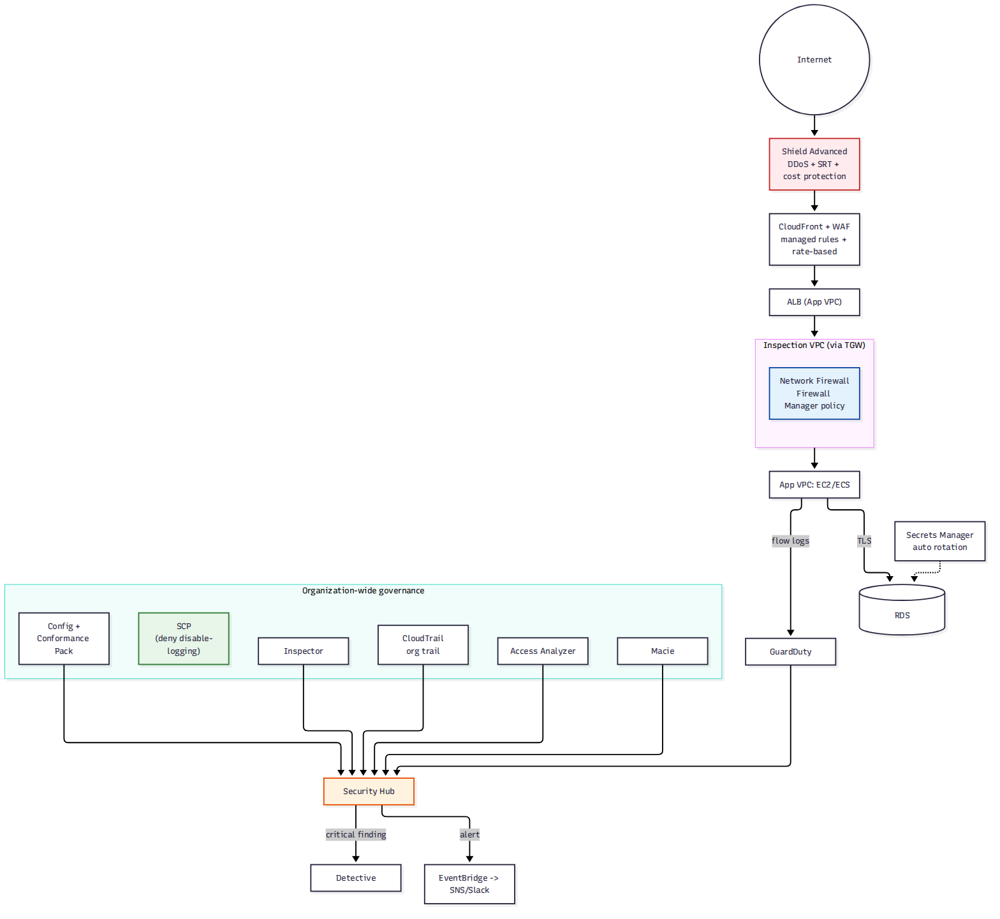

# 📚 Day 53 — Module 8 Revision + Final Project: Complete Secure Network Architecture

> 📊 **Visual Summary** — সহজে বোঝার জন্য diagram:



**সময়:** ২ ঘণ্টা | **Module:** ৮ (Network Security & Monitoring) — Day 4 (শেষ দিন)

## 🎯 আজকের লক্ষ্য
- পুরো Module 8 এক নজরে revision (WAF/Shield/Network Firewall → Flow Logs/GuardDuty → Security Hub/Inspector/Macie/Detective → CloudTrail/Config/Secrets)
- Project: একটা production ফিনটেক অ্যাপের জন্য সম্পূর্ণ secure ও auditable network architecture design
- Production security checklist ও Final quiz (পুরো Module 8)

---

# 🔁 Module 8 Revision

## 🗺 পুরো Module এক নজরে

| Day | বিষয় | এক লাইনে মনে রাখুন |
|---|---|---|
| 49 | WAF, Shield, Network Firewall | WAF = L7 (HTTP rule); Shield = DDoS (Standard free, Advanced + SRT + cost protection); Network Firewall = VPC-level stateful/stateless, Firewall Manager দিয়ে কেন্দ্রীয় |
| 50 | Flow Logs, Traffic Mirroring, Config, GuardDuty | Flow Logs = মেটাডেটা (কে-কাকে-কোন port, REJECT খোঁজা); Traffic Mirroring = আসল প্যাকেট; Config = compliance rule; GuardDuty = threat intelligence (ML) |
| 51 | Security Hub, Inspector, Access Analyzer, Macie, Detective | Security Hub = central dashboard (ASFF); Inspector = vuln + network reachability; Access Analyzer = external+unused access; Macie = S3 PII; Detective = root-cause graph |
| 52 | CloudTrail, Config Rules, SCP, Encryption, Secrets | CloudTrail = API audit (কে কী করলো); Config Rules = continuous compliance; SCP = preventive guardrail; TLS everywhere; Secrets Manager = automatic rotation |

## 🧭 "কোন সমস্যায় কোন সার্ভিস" ডিজাইন গাইড

```
বাইরে থেকে HTTP আক্রমণ (SQLi, XSS, bot)?        → WAF
Volumetric DDoS?                                → Shield (Standard সবসময়; Advanced + cost protection দরকার হলে)
VPC-level firewall, centralized, non-HTTP?      → Network Firewall + Firewall Manager
"কে কার সাথে কথা বলল" জানতে হবে?                 → VPC Flow Logs
আসল প্যাকেট কনটেন্ট পরীক্ষা করতে হবে?             → Traffic Mirroring
"এই resource কি নিয়ম মানছে" যাচাই?              → AWS Config + Conformance Pack
সন্দেহজনক network/DNS আচরণ (auto-detect)?        → GuardDuty
সব security finding এক জায়গায় দেখা?              → Security Hub
Network reachability / vulnerable package?      → Inspector
IAM role/bucket বাইরের কেউ access করতে পারে কিনা? → Access Analyzer
S3-তে PII/sensitive data আছে কিনা?               → Macie
"কেন এটা হলো" root cause investigation?          → Detective
"কে কী API call করলো" audit trail?               → CloudTrail
Root/admin action একদমই আটকাতে হবে?              → SCP (preventive)
DB password rotate করতে হবে automatic?           → Secrets Manager rotation
```

---

# 🛠 Project: "PayBD" — Complete Secure & Auditable Network Architecture

## Requirement
PayBD একটা fintech প্ল্যাটফর্ম, PCI-DSS ঘেঁষা compliance দরকার:
- Public web/API সব সময় HTTP আক্রমণ ও bot traffic থেকে সুরক্ষিত থাকতে হবে
- একবার বড় DDoS আক্রমণ হয়েছিল — এবার আর্থিক সুরক্ষা (cost protection) দরকার
- সব VPC traffic centrally inspect হবে (multi-account organization, Day 40-এর কাঠামোর উপর)
- Network-এ কোনো অস্বাভাবিক আচরণ (data exfiltration, port scan) হলে সাথে সাথে জানতে হবে
- সব security finding এক জায়গায়, আর incident হলে দ্রুত root cause বের করতে হবে
- S3-তে থাকা customer document-এ PII (NID, card number) স্ক্যান করে জানতে হবে
- প্রতিটা API call-এর অডিট ট্রেইল ৭ বছর রাখতে হবে (regulatory)
- কোনো account-এ যেন কেউ manually security log মুছতে/বন্ধ করতে না পারে
- DB credential automatic rotate হবে, in-transit সব জায়গায় TLS

## Architecture
```
                         Internet
                            │
                      ┌─────▼─────┐
                      │  Shield   │  Advanced (DDoS + SRT + cost protection)
                      │ Advanced  │
                      └─────┬─────┘
                      ┌─────▼─────┐
                      │ CloudFront │
                      │  + WAF     │  Managed rules + rate-based rule + bot control
                      └─────┬─────┘
                      ┌─────▼─────┐
                      │    ALB     │  (per Day 47) — শুধু CloudFront prefix list থেকে
                      └─────┬─────┘
       ┌────────────────────┼────────────────────┐
       │              Security/Inspection VPC     │
       │         ┌─────────────────────────┐      │
       │         │  AWS Network Firewall    │◄─────┤  Firewall Manager: সব account-এ policy push
       │         │  (centralized via TGW)   │      │
       │         └─────────────────────────┘      │
       └────────────────────┬────────────────────┘
                      ┌─────▼─────┐
                      │  App VPC   │
                      │ EC2/ECS +  │──► VPC Flow Logs ──► CloudWatch Logs ──► GuardDuty
                      │ Security   │──► Traffic Mirroring (সন্দেহ হলে) ──► IDS appliance
                      │ Groups     │
                      └─────┬─────┘
                      ┌─────▼─────┐
                      │  RDS (TLS  │◄── Secrets Manager (automatic rotation, Lambda fn)
                      │  force)    │
                      └───────────┘

  Cross-cutting (সব account/VPC জুড়ে, organization trail):
  CloudTrail (org trail, S3 + Lake, log file integrity) ──► Security Hub ◄── GuardDuty
  AWS Config (Conformance Pack) ──► Security Hub ◄── Inspector (reachability + vuln)
  Access Analyzer (external+unused access) ──► Security Hub ◄── Macie (S3 PII scan)
  Security Hub finding (critical) ──► EventBridge ──► Lambda ──► Detective (investigate) + Slack/PagerDuty
  SCP (management account): deny StopLogging/DeleteTrail/DeleteDetector সব account-এ (security account বাদে)
```

## ধাপে ধাপে সিদ্ধান্ত

### ১. Edge protection — Shield Advanced + WAF (Day 49)
- Shield Advanced: cost protection (attack-এর সময় scale-out বিল কভার) + SRT (Shared Responsibility Team)
- WAF Web ACL: AWS Managed Rules (Core rule set + SQLi) + custom rate-based rule (একই IP থেকে বেশি request) + bot control
- CloudFront-এ association (origin ALB-এ পৌঁছানোর আগেই ফিল্টার)

### ২. Centralized VPC firewall — Network Firewall + Firewall Manager (Day 49, Day 40-এর সাথে সংযোগ)
- Inspection VPC-তে Network Firewall, TGW দিয়ে সব spoke VPC-এর traffic route
- Firewall Manager policy: management account থেকে সব member account-এ একই rule group push, কেউ override করতে পারবে না

### ৩. Network visibility — Flow Logs + Traffic Mirroring + GuardDuty (Day 50)
- প্রতিটা VPC-তে Flow Logs → CloudWatch Logs Insights (REJECT pattern খোঁজা)
- সন্দেহজনক instance-এ ad-hoc Traffic Mirroring (আসল payload দেখতে)
- GuardDuty organization-wide enable (delegated admin account থেকে)

### ৪. Central compliance visibility — Security Hub + Inspector + Access Analyzer + Macie + Detective (Day 51)
- Security Hub: delegated admin, সব account auto-enroll, CIS/PCI-DSS standard enable
- Inspector: EC2/ECR/Lambda স্ক্যান, network reachability দিয়ে "ইন্টারনেট থেকে exposed" instance ধরা
- Access Analyzer: প্রতিটা account-এ external access analyzer + unused access analyzer
- Macie: customer-document S3 bucket-এ scheduled classification job
- Detective: Security Hub থেকে critical finding এলে সরাসরি investigate (behavior graph)

### ৫. Audit ও compliance guardrail — CloudTrail + Config + SCP + Secrets (Day 52)
- Organization trail: সব account, log file validation on, S3 + CloudTrail Lake (৭ বছর retention-এর জন্য Lake বা S3 lifecycle → Glacier)
- Config Conformance Pack: PCI-DSS-related rule (encrypted volume, no public S3, restricted SSH ইত্যাদি)
- SCP (management account, security account বাদে সব OU-তে): `cloudtrail:StopLogging`, `cloudtrail:DeleteTrail`, `guardduty:DeleteDetector`, `config:DeleteConfigurationRecorder` — Deny
- RDS: `rds.force_ssl` parameter, Secrets Manager rotation প্রতি ৩০ দিনে (Lambda rotation function)

## ✅ Production Security Checklist
- [ ] Shield Advanced + WAF সব internet-facing entry point-এ (CloudFront/ALB)
- [ ] Network Firewall/Firewall Manager centralized, প্রতিটা নতুন account default-এ inherit করে
- [ ] Flow Logs সব VPC-তে on, retention আর storage cost হিসাব করা
- [ ] GuardDuty, Security Hub, Access Analyzer, Inspector — সব organization-wide delegated admin দিয়ে enable
- [ ] Macie regularly S3 bucket scan করে, নতুন bucket auto-include
- [ ] CloudTrail organization trail + log file validation + অন্তত ২ region-এ (বা Lake)
- [ ] SCP দিয়ে security/logging service বন্ধ করা আটকানো (root account সহ)
- [ ] Config Conformance Pack + auto-remediation (যেখানে সম্ভব)
- [ ] Secrets rotation চালু, app-এর cache TTL rotation period-এর সাথে সামঞ্জস্যপূর্ণ
- [ ] সব finding → EventBridge → on-call notification (SNS/Slack/PagerDuty), শুধু dashboard-এ বসে না থেকে
- [ ] বছরে অন্তত একবার incident response drill (Detective ব্যবহার করে practice)

---

## 📝 Module 8 Final Quiz

1. WAF আর Shield-এর কাজের পার্থক্য কী — একই layer-এ কাজ করে কি?
2. VPC Flow Logs আর Traffic Mirroring-এর মধ্যে কোনটা আসল প্যাকেট payload দেখায়?
3. GuardDuty আর Security Hub-এর সম্পর্ক কী — একটা কি অন্যটাকে replace করে?
4. IAM Access Analyzer-এর দুই ধরনের analysis কী কী?
5. CloudTrail আর AWS Config-এর মূল পার্থক্য কী (একটা "কে করলো" বলে, আরেকটা কী বলে)?
6. SCP কীভাবে root account-কেও আটকাতে পারে?
7. Secrets Manager rotation-এর ৪টা ধাপ (Lambda function-এর) কী কী?

### 🎓 Exam-ধাঁচের প্রশ্ন

**Q8.** A security team needs a single, near real-time signal that an EC2 instance is communicating with a known command-and-control server, without writing custom detection logic. Which service provides this out of the box?
- A. VPC Flow Logs analyzed manually
- B. AWS Config
- C. Amazon GuardDuty
- D. AWS CloudTrail

**Q9.** An organization wants to prevent any IAM user or role, including the root user, in its member accounts from ever disabling CloudTrail or deleting a GuardDuty detector. What should be implemented?
- A. IAM permission boundaries on every user
- B. A Service Control Policy attached at the OU level denying the relevant actions
- C. A Config rule that flags the action after it happens
- D. A CloudWatch alarm on the API call

**Q10.** A compliance team must prove, for the last 7 years, exactly which IAM principal called `DeleteBucket` on a specific S3 bucket. Which combination is required?
- A. VPC Flow Logs with a long retention period
- B. CloudTrail with a trail delivering to S3 (or CloudTrail Lake) and an appropriate retention/lifecycle policy
- C. AWS Config with a 7-year snapshot schedule
- D. Amazon Macie with S3 auditing enabled

<details><summary>▶ উত্তর দেখুন</summary>

1. WAF অ্যাপ্লিকেশন layer (L7) request content (SQLi/XSS/rate) দেখে ফিল্টার করে; Shield network/transport layer (L3/L4) volumetric DDoS থেকে রক্ষা করে — দুটো ভিন্ন layer-এ, একসাথে ব্যবহার হয়।
2. Traffic Mirroring — Flow Logs শুধু মেটাডেটা (কে-কাকে-কোন port-এ) দেয়, payload দেয় না।
3. GuardDuty একটা **finding source** (threat detection); Security Hub সব source (GuardDuty, Inspector, Macie, Access Analyzer, ইত্যাদি)-এর finding একত্র করে দেখানো **central dashboard** — একটা আরেকটাকে replace করে না, complement করে।
4. External access analyzer (বাইরের account/public থেকে resource-এ কে পৌঁছাতে পারে) আর unused access analyzer (granted কিন্তু ব্যবহার হচ্ছে না এমন permission)।
5. CloudTrail বলে "**কে**, **কখন**, **কোন API call** করলো" (audit log); Config বলে "resource **এখন** কী অবস্থায় আছে এবং নিয়ম মানছে কিনা" (compliance state), সাথে সময়ের সাথে configuration history।
6. SCP account-এর **সর্বোচ্চ permission boundary** নির্ধারণ করে — root user সহ কারও কাছে SCP-তে deny করা action-এর permission effectively থাকে না, IAM policy যাই বলুক না কেন।
7. `createSecret` (নতুন version pending তৈরি) → `setSecret` (actual credential set করা, e.g., DB-তে নতুন password) → `testSecret` (নতুন credential দিয়ে test connection) → `finishSecret` (AWSPENDING কে AWSCURRENT বানানো)।
8. **C**: GuardDuty threat intelligence feed (known malicious IP/domain) ব্যবহার করে সরাসরি এই ধরনের finding দেয়, কোনো custom rule লেখার দরকার নেই।
9. **B**: SCP account-এর maximum boundary, root account-সহ সবার উপর প্রযোজ্য — শুধু SCP-ই root-কেও আটকাতে পারে।
10. **B**: CloudTrail-ই একমাত্র সার্ভিস যা "কোন principal কোন API call করলো" রেকর্ড করে; দীর্ঘমেয়াদী প্রমাণের জন্য S3/Lake-এ delivery + যথাযথ retention/lifecycle দরকার।
</details>

---

## 💡 Pro Tips

- Module 8-এর সব সার্ভিস আলাদা আলাদা না ভেবে **একটা pipeline** হিসেবে দেখুন: prevent (WAF/Shield/NFW/SCP) → detect (Flow Logs/GuardDuty/Inspector/Macie) → centralize (Security Hub) → investigate (Detective) → audit (CloudTrail/Config)
- Delegated administrator দিয়ে security service (GuardDuty, Security Hub, Macie, Access Analyzer) organization-wide manage করুন — প্রতিটা account আলাদাভাবে চালু করা ভুলে যাওয়ার সুযোগ কমায়
- Security finding দেখা আর **response automation** (EventBridge → Lambda/SNS) থাকা এক জিনিস না — dashboard-এ ভালো দেখানো যথেষ্ট না, alert কারো কাছে পৌঁছাতে হবে
- Compliance মানে শুধু "রুল সেট করা" না, নিয়মিত **audit ও drill** — SCP/Config থাকা মানেই সব ঠিক আছে ধরে নেওয়া যাবে না

---

## 🚨 বাস্তব পরিস্থিতি (যেসব ভুল প্রায়ই হয়)

**পরিস্থিতি ১:** একটা টিম মনে করেছিল WAF থাকলে আর Shield দরকার নেই। বড় volumetric DDoS আক্রমণে WAF (L7) কিছুই করতে পারেনি, কারণ আক্রমণ network layer-এ হচ্ছিল।
**শিক্ষা:** WAF আর Shield দুটো ভিন্ন layer রক্ষা করে, একটা আরেকটার বিকল্প না।

**পরিস্থিতি ২:** Security Hub-এ শত শত critical finding জমেছিল কিন্তু কেউ দেখেনি, কারণ শুধু console-এ manually check করার পরিকল্পনা ছিল।
**শিক্ষা:** EventBridge rule দিয়ে critical finding সরাসরি on-call-এর কাছে পাঠান, dashboard শুধু passive ভরসা না।

**পরিস্থিতি ৩:** একটা compromised IAM user CloudTrail trail বন্ধ করে দিয়েছিল আক্রমণের প্রমাণ লুকাতে; SCP ছাড়া কেউ থামাতে পারেনি।
**শিক্ষা:** Security/logging service বন্ধ করার permission SCP দিয়ে management account বাদে সবার জন্য deny করে রাখুন, IAM policy-র উপর একা ভরসা না করে।

---

**⏮ আগের দিন:** [Day 52 — Compliance ও Audit: CloudTrail, Config Rules, SCP, Encryption ও Secrets Rotation](./Day-52-Compliance-Audit-CloudTrail-Config-Encryption-Secrets.md) | **⏭ পরের module:** [Day 54 — RDS Fundamentals](../10-Module-9-Databases-RDS-DynamoDB/Day-54-RDS-Fundamentals-Multi-AZ-Read-Replicas.md)
