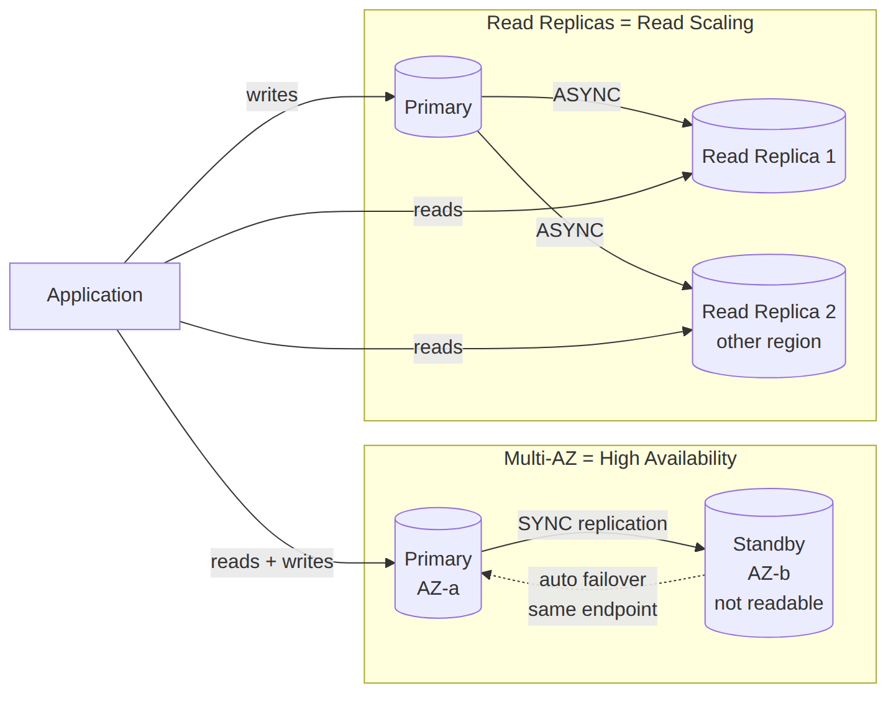

# 📚 Day 54 — RDS Fundamentals: Engines, Multi-AZ ও Read Replicas

> 📊 **Visual Summary** — সহজে বোঝার জন্য diagram:



**সময়:** ২ ঘণ্টা | **Module:** ৯ (Databases: RDS & DynamoDB) — Day 1

## 🎯 আজকের লক্ষ্য
- কেন managed relational database দরকার, RDS কী সমস্যা সমাধান করে
- RDS-এর supported engine: MySQL, PostgreSQL, MariaDB, Oracle, SQL Server, Aurora
- **Multi-AZ**: high availability, sync replication, automatic failover
- **Read Replica**: read scaling, async replication, cross-region
- Storage type: gp3, io1/io2, Provisioned IOPS
- Parameter Group ও Option Group
- Backup: automated backup, manual snapshot, Point-in-Time Recovery (PITR)

---

## Part 1: RDS কী সমস্যা সমাধান করে?

**সমস্যা (EC2-তে নিজে DB চালালে):** OS patching, DB engine patching, backup script লেখা, failover নিজে handle করা, replication নিজে সেটআপ করা — সবই manual, ভুল হওয়ার সুযোগ বেশি।

**সমাধান: Amazon RDS** — AWS নিজে patching, backup, failover, monitoring manage করে; আপনি শুধু schema আর query নিয়ে ভাবেন।

```
আপনার দায়িত্ব (RDS-এ):  Schema design, Query optimization, IAM/SG, Data
AWS-এর দায়িত্ব:         OS patching, DB engine patching, hardware, backup infra, Multi-AZ failover
```

### Supported Engines
| Engine | ব্যবহার |
|---|---|
| MySQL / MariaDB | সাধারণ web app, open-source |
| PostgreSQL | জটিল query, JSON support, extension (PostGIS) |
| Oracle / SQL Server | Enterprise, license-heavy legacy migration |
| **Aurora** (MySQL/PostgreSQL compatible) | AWS-এর নিজস্ব engine, ৩–৫ গুণ পারফরম্যান্স (Day 55-এ গভীরে) |

---

## Part 2: Multi-AZ — High Availability

**উদ্দেশ্য:** DB instance বা পুরো AZ down হলেও app যেন downtime কম পায়।

- Primary DB (AZ-a) থেকে standby (AZ-b)-এ **synchronous** replication
- Standby **সরাসরি readable না** (শুধু failover-এর জন্য)
- Primary fail করলে AWS automatically **DNS endpoint** standby-এর দিকে সরিয়ে দেয় (৬০–১২০ সেকেন্ড, app-কে কোনো config বদলাতে হয় না)
- Patching-এর সময়ও Multi-AZ downtime কমায় (standby আগে patch হয়, তারপর failover)

> **মনে রাখার কৌশল:** Multi-AZ = "availability" (একটাই logical DB, backup copy রেডি), replica না — standby-তে query চালানো যায় না।

---

## Part 3: Read Replica — Read Scaling

**উদ্দেশ্য:** Read-heavy app-এ primary DB-র উপর থেকে read load সরানো।

- Primary → Replica: **asynchronous** replication (কিছুটা lag থাকতে পারে — eventual consistency)
- Replica **সরাসরি readable** — app-এর read query replica-তে পাঠানো যায়
- একই region-এ বা **cross-region** replica বানানো যায় (DR বা কাছের user-দের জন্য latency কমাতে)
- Replica-কে standalone DB-তে **promote** করা যায় (তখন replication বন্ধ হয়ে যায়)
- সর্বোচ্চ ৫টা read replica (Aurora-তে ১৫টা পর্যন্ত)

### Multi-AZ বনাম Read Replica
| | **Multi-AZ** | **Read Replica** |
|---|---|---|
| উদ্দেশ্য | High Availability | Read scaling |
| Replication | Synchronous | Asynchronous |
| Readable? | না (standby) | হ্যাঁ |
| Failover | Automatic | Manual promote |
| Region | একই region (AZ ভিন্ন) | Same বা cross-region |

**একসাথে ব্যবহার:** Production-এ সাধারণত **Multi-AZ primary + একাধিক Read Replica** — availability আর read scaling দুটোই।

---

## Part 4: Storage Types

| Type | ব্যবহার |
|---|---|
| **gp3** (General Purpose SSD) | Default, বেশিরভাগ workload, IOPS/throughput আলাদাভাবে scale করা যায় (EBS gp3-এর মতো, Day 4) |
| **io1 / io2** (Provisioned IOPS) | High-performance transactional DB (OLTP), consistent low-latency দরকার |
| **Magnetic** (পুরনো, deprecated) | ব্যবহার করবেন না |

**Storage Auto Scaling:** থ্রেশহোল্ডের নিচে free space গেলে RDS নিজে storage বাড়ায় (downtime ছাড়া)।

---

## Part 5: Parameter Group ও Option Group

- **Parameter Group**: DB engine-এর configuration (যেমন `max_connections`, `innodb_buffer_pool_size`) — EC2-তে config file এডিট করার মতো, কিন্তু RDS-এ console/CLI দিয়ে
  - **Static parameter**: বদলাতে DB **reboot** লাগে
  - **Dynamic parameter**: সাথে সাথে apply হয়
- **Option Group**: কিছু engine-specific feature enable করতে (যেমন Oracle-এর TDE, SQL Server-এর mirroring)

---

## Part 6: Backup ও Recovery

| ধরন | বৈশিষ্ট্য |
|---|---|
| **Automated Backup** | Daily snapshot + transaction log; retention ০–৩৫ দিন; enable থাকলে **PITR** (Point-in-Time Recovery) সম্ভব — সেকেন্ড-পর্যায়ের যেকোনো মুহূর্তে restore |
| **Manual Snapshot** | ইচ্ছেমতো সময়ে নেওয়া, retention **অসীম** (নিজে না মুছলে থাকে), region-এর মধ্যে copy/share করা যায় |
| **Restore আচরণ** | Snapshot/PITR থেকে restore করলে **নতুন DB instance** (নতুন endpoint) তৈরি হয় — পুরনোটার উপর overwrite হয় না |

> **গুরুত্বপূর্ণ:** RDS instance ডিলিট করার সময় "final snapshot" নেওয়ার অপশন থাকে — স্কিপ করলে সব ডেটা হারিয়ে যায়।

---

## Part 7: Hands-on Lab

1. RDS Console → Create database → MySQL, **Multi-AZ** enable করে launch
2. Parameter group-এ একটা dynamic parameter বদলে দেখুন সাথে সাথে apply হয় কিনা
3. একটা **Read Replica** তৈরি করুন, replica-তে SELECT চালিয়ে দেখুন
4. Primary-তে একটা row insert করে replica-তে কতক্ষণে দেখা যায় (replication lag) পরীক্ষা করুন
5. Manual snapshot নিন, তারপর সেই snapshot থেকে নতুন DB restore করুন
6. Multi-AZ instance-এ "Reboot with failover" চালিয়ে দেখুন app কতক্ষণ downtime পায়
7. সব resource মুছুন (RDS ঘণ্টাপ্রতি বিল হয়)

---

## 🎯 আজকের মূল Takeaways
- Multi-AZ = availability (standby non-readable, sync, auto failover); Read Replica = scaling (readable, async, manual promote)
- Production-এ দুটোই একসাথে ব্যবহার করা সাধারণ
- gp3 default, io1/io2 high-performance OLTP-এর জন্য
- Automated backup + PITR retention ৩৫ দিন পর্যন্ত; manual snapshot চিরস্থায়ী
- Restore মানেই নতুন endpoint — DNS/connection string বদলাতে হবে

## 📝 Self-check Questions
1. Multi-AZ standby-তে সরাসরি read query কেন চালানো যায় না?
2. Read Replica-তে "eventual consistency" কেন হতে পারে?
3. Static আর dynamic parameter-এর মধ্যে পার্থক্য কী?
4. PITR চালু রাখতে কোন backup সেটিং দরকার?
5. RDS instance ডিলিট করার সময় ডেটা বাঁচাতে কী করতে হবে?

## 💡 Pro Tips
- Production DB-তে সবসময় Multi-AZ চালু রাখুন — খরচ বাড়ে ঠিকই, কিন্তু outage-এর খরচ আরও বেশি
- Read replica lag মনিটর করুন (`ReplicaLag` metric); খুব বেশি হলে অ্যাপের read consistency-তে সমস্যা হতে পারে
- Manual snapshot নেওয়ার আগে automated backup retention ভুলে বন্ধ করবেন না — দুটো ভিন্ন জিনিস
- Parameter group পরিবর্তনের আগে staging-এ টেস্ট করুন, কিছু পরিবর্তনে reboot লাগে (production downtime)

## 🎨 Quick Reference
```
Multi-AZ: sync, standby non-readable, automatic failover (~60-120s), same region
Read Replica: async, readable, manual promote, same/cross-region, max 5 (Aurora 15)
Storage: gp3 (default) | io1/io2 (high IOPS OLTP)
Backup: Automated (0-35 days, PITR) | Manual snapshot (infinite retention)
Restore → always creates a NEW DB instance/endpoint
```

## 🚨 বাস্তব পরিস্থিতি (যেসব ভুল প্রায়ই হয়)

**পরিস্থিতি ১:** একটা টিম মনে করেছিল Multi-AZ মানেই read scaling হয়ে গেছে, standby-তে read query পাঠানোর চেষ্টা করল — কানেকশন এরর।
**শিক্ষা:** Read scaling দরকার হলে আলাদা Read Replica বানাতে হয়, Multi-AZ শুধু availability দেয়।

**পরিস্থিতি ২:** RDS instance টেস্টের জন্য ডিলিট করার সময় "skip final snapshot" বেছে নেওয়া হলো, পরে বোঝা গেল দরকারি ডেটা ছিল।
**শিক্ষা:** যেকোনো RDS ডিলিটের আগে final snapshot নেওয়া default habit বানান।

**পরিস্থিতি ৩:** একটা static parameter বদলে production-এ সাথে সাথে apply হবে ভেবে বসে ছিল টিম, কিন্তু আসলে reboot না হওয়া পর্যন্ত পুরনো value-ই কাজ করছিল।
**শিক্ষা:** Parameter group পরিবর্তনের আগে সেটা static না dynamic যাচাই করুন।

---

**⏮ আগের module:** [Day 53 — Module 8 Revision](../09-Module-8-Network-Security-Monitoring/Day-53-Module-8-Revision-Complete-Secure-Architecture-Project.md) | **⏭ পরের দিন:** [Day 55 — Aurora, RDS Proxy ও Advanced Backup](./Day-55-Aurora-RDS-Proxy-Advanced-Backup.md)
