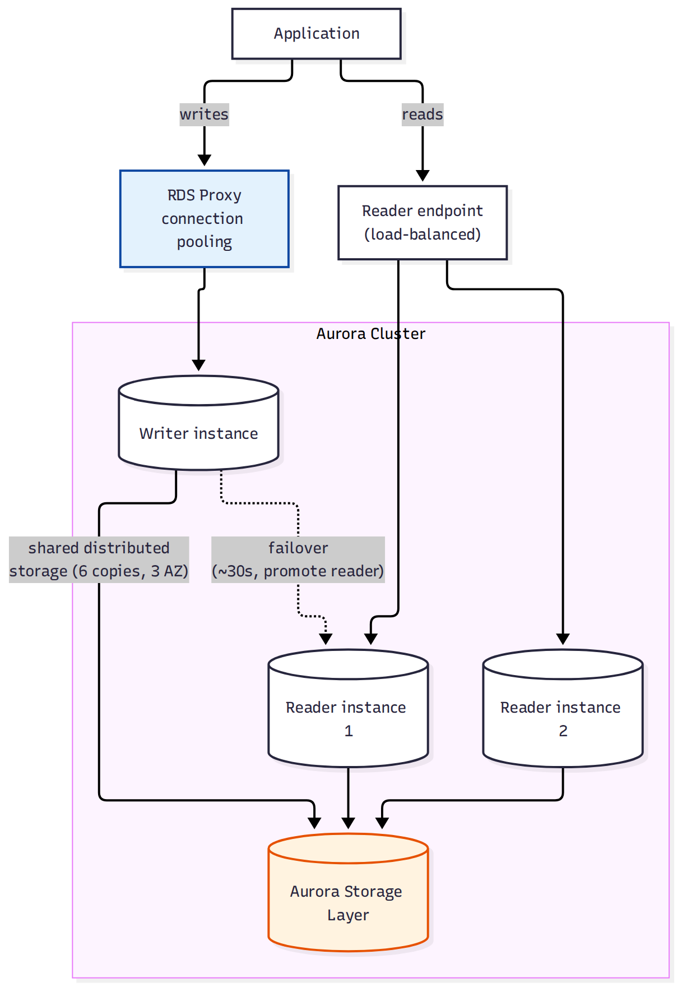

# 📚 Day 55 — Aurora, RDS Proxy ও Advanced Backup Strategies

> 📊 **Visual Summary** — সহজে বোঝার জন্য diagram:



**সময়:** ২ ঘণ্টা | **Module:** ৯ (Databases: RDS & DynamoDB) — Day 2

## 🎯 আজকের লক্ষ্য
- **Amazon Aurora**: distributed storage architecture, কেন MySQL/PostgreSQL-এর চেয়ে দ্রুত
- Aurora Replica, **Aurora Serverless v2**, Global Database
- **RDS Proxy**: connection pooling সমস্যা ও সমাধান
- **Blue/Green Deployment** (RDS)-এ zero-downtime schema change/major version upgrade
- Performance Insights দিয়ে bottleneck খোঁজা
- Cross-region backup ও disaster recovery strategy

---

## Part 1: Amazon Aurora — কেন আলাদা?

সাধারণ RDS (MySQL/PostgreSQL)-এ storage আর compute একসাথে bundled। **Aurora storage layer আলাদা** — একটা distributed, self-healing storage যা **৬টা কপি, ৩টা AZ**-জুড়ে ছড়ানো থাকে।

```
সাধারণ RDS:  Compute + Storage (একই instance-এ, EBS ভলিউম)
Aurora:      Compute (writer/reader instance) ─┐
                                                ├──► Shared Distributed Storage Layer
             Compute (writer/reader instance) ─┘     (6 copies, 3 AZ, auto-healing)
```

**ফলাফল:**
- Write শুধু quorum (৬-এর মধ্যে ৪টা কপি)-তে হলেই commit — MySQL-এর চেয়ে ৫ গুণ, PostgreSQL-এর চেয়ে ৩ গুণ দ্রুত (AWS benchmark)
- Storage **auto-scale** হয় ১০ GB থেকে ১২৮ TB পর্যন্ত, manual provisioning লাগে না
- Reader instance **একই storage** পড়ে — তাই replication lag প্রায় শূন্য (সাধারণ RDS read replica-র মতো async copy না)
- Crash হলে storage layer নিজে থেকে repair হয় (self-healing), পুরো volume restore করতে হয় না

### Aurora Replica ও Failover
- সর্বোচ্চ ১৫টা Aurora Replica (সাধারণ RDS-এ ৫টা)
- Writer fail করলে একটা Replica-কে **promote** করা হয় (~৩০ সেকেন্ড), কোনো data copy লাগে না (storage already shared)
- **Reader endpoint**: সব reader-এর মধ্যে load balance করে

### Aurora Serverless v2
- Compute capacity (ACU) **automatically scale** করে workload অনুযায়ী, second-এর হিসেবে বিল
- Unpredictable/spiky workload, dev/test environment-এর জন্য উপযুক্ত (২৪/৭ instance চালানোর দরকার নেই)

### Aurora Global Database
- এক region-এর writer, **অন্য region**-এ (৫টা পর্যন্ত) read replica — storage-level replication (< ১ সেকেন্ড lag)
- Region outage হলে secondary region-কে **সেকেন্ডে** promote করা যায় (cross-region DR, Day 18-এর RPO/RTO ধারণার সাথে সংযোগ)

---

## Part 2: RDS Proxy — Connection Pooling সমস্যা

**সমস্যা:** Lambda-এর মতো serverless compute হঠাৎ হাজার হাজার concurrent connection খুলতে পারে (Day 26-এ Lambda VPC connection সমস্যা)। RDS/Aurora-এর max connection সীমিত — DB "too many connections" error দেয়।

**সমাধান: RDS Proxy** — application আর DB-এর মাঝে বসে, connection **pool ও reuse** করে।

```
1000+ Lambda invocation ──► RDS Proxy (connection pool) ──► কয়েকশ actual DB connection
```

### মূল সুবিধা
- Connection pooling: হাজারো client connection-কে কম সংখ্যক actual DB connection-এ multiplex করে
- Failover time কমায়: Multi-AZ failover-এর সময় Proxy নতুন endpoint নিজে খুঁজে নেয়, app-কে reconnect করতে হয় না
- **IAM authentication** সমর্থন করে (password ছাড়া, Secrets Manager-এর সাথে ইন্টিগ্রেশন)
- Read/write traffic আলাদা রুট করা যায় (read replica-এর দিকে)

---

## Part 3: Blue/Green Deployment (RDS)

**সমস্যা:** Major version upgrade বা বড় schema change করতে গেলে downtime বা ভুল হওয়ার ঝুঁকি থাকে।

**সমাধান:** RDS **Blue/Green Deployment** — production (blue)-এর একটা সম্পূর্ণ কপি (green) তৈরি হয়, replication দিয়ে sync থাকে, তারপর green-এ পরিবর্তন/টেস্ট করে switchover করা হয় (Day 17-এর ALB blue/green deployment ধারণার মতোই, কিন্তু DB-তে)।

```
Blue (production, live traffic) ──replication──► Green (copy, upgrade/test করুন)
                              switchover (কয়েক সেকেন্ড downtime)
                                        ▼
                              Green এখন নতুন Blue (live traffic)
```

---

## Part 4: Performance Insights

- প্রতিটা RDS/Aurora instance-এর জন্য **DB load** গ্রাফ দেখায় — কোন SQL query, কোন wait event সবচেয়ে বেশি সময় নিচ্ছে
- "Top SQL" আর "Top wait" ট্যাব দিয়ে bottleneck চিহ্নিত করা যায় কোনো external tool ছাড়াই

---

## Part 5: Backup ও DR Strategy সংক্ষেপে (Day 18-এর সাথে সংযোগ)

| Strategy | RTO/RPO | কীভাবে |
|---|---|---|
| Backup & Restore | ঘণ্টা/দিন | Automated backup/snapshot cross-region copy |
| Pilot Light | মিনিট-ঘণ্টা | Read Replica cross-region, promote করলে সচল |
| Warm Standby | মিনিট | ছোট আকারে অন্য region-এ সবসময় চালু (Read Replica + scaled-down app) |
| Multi-Site Active-Active | সেকেন্ড | Aurora Global Database, দুই region-ই active |

---

## Part 6: Hands-on Lab

1. Aurora MySQL cluster তৈরি করুন (১টা writer, ১টা reader)
2. RDS Proxy তৈরি করে writer-এর সামনে বসান, app-কে Proxy endpoint দিয়ে কানেক্ট করান
3. Writer instance-এ failover ঘটিয়ে (reboot with failover) দেখুন Proxy কতটা দ্রুত নতুন writer খুঁজে নেয়
4. Performance Insights-এ গিয়ে একটা ভারী query চালিয়ে "Top SQL"-এ দেখুন
5. একটা Aurora Serverless v2 cluster তৈরি করে ACU scaling দেখুন
6. সব resource মুছুন

---

## 🎯 আজকের মূল Takeaways
- Aurora-র distributed storage layer-ই আসল পার্থক্য — replica-দের replication lag প্রায় শূন্য
- RDS Proxy connection storm (serverless/Lambda) সামলায় ও failover দ্রুত করে
- Blue/Green deployment major upgrade/schema change-এ downtime কমায়
- Aurora Global Database সবচেয়ে দ্রুত cross-region DR দেয় (Multi-Site Active-Active-এর কাছাকাছি)
- Performance Insights কোনো external APM ছাড়াই query-level bottleneck দেখায়

## 📝 Self-check Questions
1. Aurora replica-র replication lag সাধারণ RDS read replica-র চেয়ে কম কেন?
2. RDS Proxy কীভাবে "too many connections" সমস্যা সমাধান করে?
3. Blue/Green deployment আর Multi-AZ failover-এর মধ্যে পার্থক্য কী?
4. Aurora Global Database কোন DR strategy-র কাছাকাছি (Backup & Restore, Pilot Light, Warm Standby, নাকি Multi-Site Active-Active)?
5. Aurora Serverless v2 কোন ধরনের workload-এ সবচেয়ে বেশি খরচ বাঁচায়?

## 💡 Pro Tips
- Lambda + RDS/Aurora ব্যবহার করলে RDS Proxy প্রায় সবসময় দরকার, না হলে connection exhaustion অনিবার্য
- Major version upgrade করার আগে Blue/Green-এ টেস্ট করুন, সরাসরি production-এ upgrade না
- Aurora Global Database শুধু সত্যিকারের multi-region requirement থাকলে ব্যবহার করুন — খরচ বেশি
- Performance Insights কম রিটেনশনে (৭ দিন) ফ্রি, দরকার হলে extended retention কিনুন

## 🎨 Quick Reference
```
Aurora: shared distributed storage (6 copies/3 AZ), max 15 replicas, ~30s failover
RDS Proxy: connection pooling + IAM auth + fast failover, serverless-এর জন্য প্রায় must
Blue/Green: production copy sync → test → switchover (কয়েক সেকেন্ড downtime)
Aurora Global DB: cross-region, <1s replication lag, secondary promote সেকেন্ডে
Performance Insights: Top SQL / Top Wait, কোনো agent ছাড়াই
```

## 🚨 বাস্তব পরিস্থিতি (যেসব ভুল প্রায়ই হয়)

**পরিস্থিতি ১:** Lambda ফাংশন হঠাৎ ট্রাফিক স্পাইকে হাজার হাজার concurrent execution চালু করল, প্রতিটা সরাসরি RDS-এ কানেক্ট করল — "too many connections" error-এ পুরো সিস্টেম বসে গেল।
**শিক্ষা:** Serverless compute-এর সাথে RDS/Aurora ব্যবহার করলে RDS Proxy দিয়ে কানেক্ট করুন, সরাসরি না।

**পরিস্থিতি ২:** একটা টিম production-এ সরাসরি major version upgrade চালিয়ে দিল, compatibility সমস্যায় অ্যাপ কয়েক ঘণ্টা down থাকল।
**শিক্ষা:** Blue/Green deployment দিয়ে আগে test করে switchover করুন।

**পরিস্থিতি ৩:** Aurora Global Database সেটআপ করা ছিল, কিন্তু কখনো secondary region promote করে টেস্ট করা হয়নি। আসল outage-এর দিন promote প্রক্রিয়া নিয়ে টিম confused হয়ে গেল।
**শিক্ষা:** DR setup থাকলেই যথেষ্ট না, নিয়মিত failover drill করুন (Day 53-এর pro tip-এর মতোই)।

---

**⏮ আগের দিন:** [Day 54 — RDS Fundamentals](./Day-54-RDS-Fundamentals-Multi-AZ-Read-Replicas.md) | **⏭ পরের দিন:** [Day 56 — DynamoDB Fundamentals: Partition Key, Capacity Mode ও Index](./Day-56-DynamoDB-Fundamentals-Partition-Key-Capacity-Modes.md)
