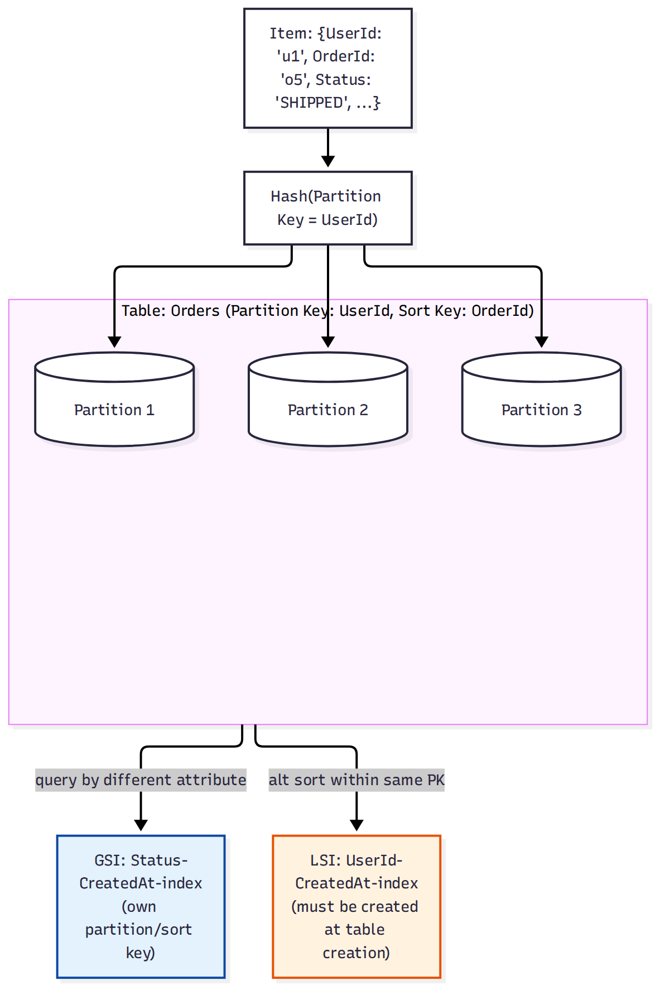

# 📚 Day 56 — DynamoDB Fundamentals: Partition Key, Capacity Mode ও Index

> 📊 **Visual Summary** — সহজে বোঝার জন্য diagram:



**সময়:** ২ ঘণ্টা | **Module:** ৯ (Databases: RDS & DynamoDB) — Day 3

## 🎯 আজকের লক্ষ্য
- DynamoDB কী, কেন NoSQL, RDS-এর সাথে মূল পার্থক্য
- **Partition Key** ও **Sort Key** — কীভাবে data distribute হয়
- **Capacity Mode**: On-Demand বনাম Provisioned (RCU/WCU)
- **Global Secondary Index (GSI)** বনাম **Local Secondary Index (LSI)**
- Item, attribute, data type (String, Number, Map, List, Set)
- Consistency model: Eventually বনাম Strongly consistent read

---

## Part 1: DynamoDB কী?

**Amazon DynamoDB** — fully managed **NoSQL key-value/document database**, single-digit millisecond latency, automatic horizontal scaling।

| | **RDS (Relational)** | **DynamoDB (NoSQL)** |
|---|---|---|
| Schema | Fixed (table/column/type আগে থেকে) | Schemaless (শুধু primary key ফিক্সড, বাকি attribute item-ভেদে ভিন্ন হতে পারে) |
| Scaling | Vertical (বড় instance) + Read Replica | Horizontal, automatic, virtually unlimited |
| Query | SQL, JOIN, complex query | Key-based lookup, GSI/LSI; JOIN নেই |
| Consistency | Strong (default) | Eventually consistent (default) বা strong (optional) |
| ব্যবহার | Complex relationship, transaction-heavy, reporting | High-scale key lookup, session store, IoT, gaming leaderboard |

> **সিদ্ধান্ত নিয়ম:** সম্পর্কযুক্ত (relational) ডেটা আর জটিল query দরকার হলে RDS/Aurora; predictable access pattern-এর সাথে massive scale আর কম latency দরকার হলে DynamoDB।

---

## Part 2: Partition Key ও Sort Key

প্রতিটা item-এর একটা **Primary Key** থাকে, যা দুই ধরনের হতে পারে:

### Simple Primary Key (শুধু Partition Key)
- একটাই attribute (যেমন `UserId`), যা **হ্যাশ** হয়ে ঠিক করে item কোন internal partition-এ যাবে
- Partition Key-এর মান **unique** হতে হবে

### Composite Primary Key (Partition Key + Sort Key)
- `UserId` (Partition Key) + `OrderId` (Sort Key)
- একই Partition Key-র একাধিক item থাকতে পারে, Sort Key দিয়ে আলাদা করা হয়, আর sort key অনুযায়ী **sorted** থাকে
- এক user-এর সব order একই partition-এ, `begins_with`, `between` ইত্যাদি দিয়ে range query করা যায়

```
Table: Orders
Partition Key: UserId   Sort Key: OrderId
─────────────────────────────────────────
u1        | o1    | ...
u1        | o2    | ...   ← একই partition (u1), sort key দিয়ে range query
u2        | o1    | ...   ← ভিন্ন partition
```

### Hot Partition সমস্যা
- একটা Partition Key-তে অস্বাভাবিক বেশি traffic গেলে (যেমন সবার জন্য একই `Status = "ACTIVE"` key) সেই partition **throttle** হয়ে যায়
- **সমাধান:** high-cardinality attribute (UserId, DeviceId) partition key হিসেবে বাছুন, দরকার হলে key-তে random suffix যোগ করে distribute করুন (write sharding)

---

## Part 3: Capacity Mode

| Mode | কীভাবে কাজ করে | কবে ব্যবহার |
|---|---|---|
| **On-Demand** | Auto-scale, ব্যবহার অনুযায়ী বিল (per-request) | Unpredictable/spiky traffic, নতুন অ্যাপ (traffic pattern অজানা) |
| **Provisioned** | RCU/WCU আগে থেকে ঠিক করা, Auto Scaling policy যোগ করা যায় | Predictable/steady traffic, খরচ optimize করতে চাইলে |

- **RCU (Read Capacity Unit)**: ১টা strongly consistent read (৪ KB পর্যন্ত) প্রতি সেকেন্ডে
- **WCU (Write Capacity Unit)**: ১টা write (১ KB পর্যন্ত) প্রতি সেকেন্ডে
- Eventually consistent read-এ RCU **অর্ধেক** লাগে (২টা eventually consistent read = ১ RCU)

---

## Part 4: Global Secondary Index (GSI) বনাম Local Secondary Index (LSI)

**সমস্যা:** Primary key দিয়ে ছাড়া অন্য attribute দিয়ে query করতে হলে (যেমন `Status` দিয়ে সব order খোঁজা) পুরো টেবিল scan করতে হতো — ধীর ও ব্যয়বহুল।

**সমাধান: Secondary Index** — অন্য attribute-এ দ্রুত query করার জন্য।

| | **GSI** | **LSI** |
|---|---|---|
| Partition Key | মূল টেবিলের চেয়ে **ভিন্ন** হতে পারে | মূল টেবিলের **সমান** (partition key বদলানো যায় না) |
| Sort Key | ভিন্ন attribute | ভিন্ন attribute (কিন্তু একই partition key-র মধ্যে) |
| তৈরি | যেকোনো সময় যোগ/মুছা যায় | **শুধু টেবিল তৈরির সময়** সেট করতে হয় |
| Capacity | নিজস্ব RCU/WCU (on-demand মোডে auto) | মূল টেবিলের capacity শেয়ার করে |
| সংখ্যা | প্রতি টেবিলে ২০টা পর্যন্ত | প্রতি টেবিলে ৫টা পর্যন্ত |
| Consistency | শুধু eventually consistent | strongly বা eventually — দুটোই সম্ভব |

> **ব্যবহারিক পরামর্শ:** বেশিরভাগ ক্ষেত্রে **GSI** যথেষ্ট এবং নমনীয়; LSI দরকার হয় শুধু তখন যখন একই partition-এর মধ্যে অন্য attribute দিয়ে strongly consistent sort/query দরকার।

---

## Part 5: Data Type ও Item

- **Scalar**: String (S), Number (N), Binary (B), Boolean, Null
- **Document**: Map (JSON object-এর মতো), List (array-এর মতো)
- **Set**: String Set, Number Set, Binary Set (unique value-এর collection)
- প্রতিটা item সর্বোচ্চ **400 KB**

---

## Part 6: Consistency Model

- **Eventually Consistent Read** (default): সবচেয়ে সস্তা ও দ্রুত, কিন্তু সদ্য লেখা ডেটা সাথে সাথে নাও দেখাতে পারে (< ১ সেকেন্ড lag)
- **Strongly Consistent Read**: সবসময় সর্বশেষ committed ডেটা দেয়, কিন্তু বেশি RCU লাগে ও latency সামান্য বেশি
- **Transactional Read/Write** (Day 57-এ বিস্তারিত): multi-item ACID transaction

---

## Part 7: Hands-on Lab

1. একটা টেবিল তৈরি করুন: `Orders` (Partition Key: `UserId`, Sort Key: `OrderId`), On-Demand mode
2. কয়েকটা item insert করুন, একই `UserId`-এর একাধিক `OrderId` দিয়ে
3. `Query` দিয়ে একজন user-এর সব order বের করুন (Scan না, Query ব্যবহার করুন)
4. `Status` attribute-এ একটা GSI যোগ করুন, `Status = "SHIPPED"` দিয়ে query করুন
5. একই query strongly consistent আর eventually consistent দুই মোডে চালিয়ে পার্থক্য (latency) দেখুন
6. Provisioned mode-এ পরিবর্তন করে কম RCU/WCU দিয়ে ThrottlingException তৈরি করে দেখুন
7. টেবিল মুছুন

---

## 🎯 আজকের মূল Takeaways
- Partition Key data distribution ঠিক করে; ভুল বাছাই করলে hot partition তৈরি হয়
- On-Demand = unpredictable traffic-এর জন্য নিরাপদ ডিফল্ট; Provisioned = খরচ-নিয়ন্ত্রিত, predictable traffic
- GSI নমনীয়, যেকোনো সময় যোগ করা যায়; LSI শুধু টেবিল তৈরির সময়, সীমিত ব্যবহার
- Scan এড়িয়ে সবসময় Query ব্যবহারের চেষ্টা করুন (partition key জানা থাকলে)
- Eventually consistent read ডিফল্ট এবং সস্তা; strong consistency দরকার হলে explicit করে চাইতে হয়

## 📝 Self-check Questions
1. Composite primary key-তে একই partition key-র একাধিক item কীভাবে আলাদা হয়?
2. Hot partition সমস্যা কেন হয়, আর কীভাবে এড়ানো যায়?
3. GSI-তে নতুন index যোগ করতে টেবিল রিক্রিয়েট করা লাগে কি? LSI-তে?
4. ১টা RCU দিয়ে কতগুলো strongly consistent read আর কতগুলো eventually consistent read করা যায়?
5. Scan আর Query-এর মধ্যে পারফরম্যান্স/খরচের পার্থক্য কেন হয়?

## 💡 Pro Tips
- নতুন অ্যাপ শুরু করলে On-Demand দিয়ে শুরু করুন, traffic pattern স্থির হলে Provisioned + Auto Scaling-এ সরে যান (খরচ কমাতে)
- Access pattern **আগে থেকে ডিজাইন করুন** — DynamoDB-তে "পরে যোগ করব" মানসিকতায় schema বদলানো কঠিন (single-table design, Day 57)
- Scan এড়িয়ে চলুন; দরকার হলে GSI বানান
- Item সাইজ ছোট রাখুন (৪০০ KB সীমা), বড় blob S3-তে রেখে DynamoDB-তে শুধু reference/URL

## 🎨 Quick Reference
```
Primary Key: Simple (PK) বা Composite (PK + SK)
RCU: 1 strongly consistent read (4 KB) = 2 eventually consistent read
WCU: 1 write (1 KB)
Capacity mode: On-Demand (auto, spiky) | Provisioned (fixed/auto-scaling, steady)
GSI: ভিন্ন PK/SK, যেকোনো সময় যোগ, নিজস্ব capacity, max 20
LSI: একই PK ভিন্ন SK, টেবিল তৈরির সময়ই, শেয়ার্ড capacity, max 5
Consistency: Eventually (default, সস্তা) | Strongly (explicit, বেশি খরচ)
Max item size: 400 KB
```

## 🚨 বাস্তব পরিস্থিতি (যেসব ভুল প্রায়ই হয়)

**পরিস্থিতি ১:** সব user-এর জন্য partition key হিসেবে `"ALL_USERS"` জাতীয় constant value ব্যবহার করা হয়েছিল — পুরো ট্রাফিক একটা partition-এ গিয়ে throttle শুরু হলো।
**শিক্ষা:** Partition key-তে high-cardinality attribute বাছুন (UserId, DeviceId, ইত্যাদি)।

**পরিস্থিতি ২:** একটা রিপোর্টিং ফিচারের জন্য বারবার `Scan` চালানো হচ্ছিল পুরো টেবিলের উপর, খরচ আর latency দুটোই বেড়ে গেল।
**শিক্ষা:** Access pattern অনুযায়ী GSI ডিজাইন করে Query ব্যবহার করুন, Scan-কে শেষ উপায় হিসেবে রাখুন।

**পরিস্থিতি ৩:** LSI পরে যোগ করতে গিয়ে দেখা গেল টেবিল রিক্রিয়েট করা ছাড়া উপায় নেই, কারণ LSI টেবিল তৈরির সময়ই সেট করতে হয়।
**শিক্ষা:** ভবিষ্যতের query pattern আগেই ভেবে নিন, না হলে GSI দিয়ে সমাধান করুন (LSI নয়)।

---

**⏮ আগের দিন:** [Day 55 — Aurora, RDS Proxy ও Advanced Backup](./Day-55-Aurora-RDS-Proxy-Advanced-Backup.md) | **⏭ পরের দিন:** [Day 57 — DynamoDB Streams, Global Tables, DAX ও Transactions](./Day-57-DynamoDB-Streams-Global-Tables-DAX-Transactions.md)
