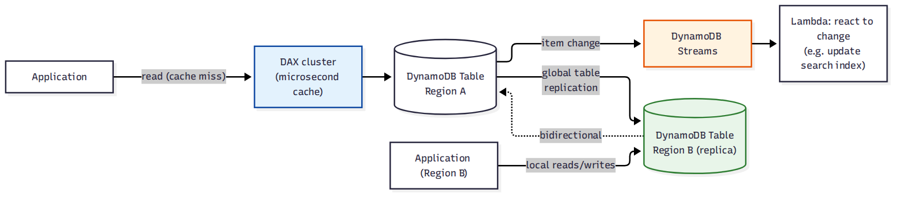

# 📚 Day 57 — DynamoDB Streams, Global Tables, DAX ও Transactions

> 📊 **Visual Summary** — সহজে বোঝার জন্য diagram:



**সময়:** ২ ঘণ্টা | **Module:** ৯ (Databases: RDS & DynamoDB) — Day 4

## 🎯 আজকের লক্ষ্য
- **DynamoDB Streams**: item-level change capture, Lambda ট্রিগার (Day 25-এর সাথে সংযোগ)
- **Global Tables**: multi-region active-active replication
- **DAX (DynamoDB Accelerator)**: microsecond in-memory cache
- **Transactions**: multi-item ACID অপারেশন
- **TTL (Time to Live)**: automatic item expiry
- Single-table design-এর মূল ধারণা

---

## Part 1: DynamoDB Streams

টেবিলে **create/update/delete** হলে সেই পরিবর্তনের একটা ordered log — Streams তৈরি করে। প্রতিটা event ২৪ ঘণ্টা ধরে রাখা হয়।

```
DynamoDB Table (item change) ──► DynamoDB Stream ──► Lambda trigger (Day 25)
                                                   ──► Kinesis Data Streams (fan-out)
```

### View Type
| ধরন | কী থাকে |
|---|---|
| `KEYS_ONLY` | শুধু বদলানো item-এর key |
| `NEW_IMAGE` | পরিবর্তনের **পরের** পুরো item |
| `OLD_IMAGE` | পরিবর্তনের **আগের** পুরো item |
| `NEW_AND_OLD_IMAGES` | দুটোই — before/after তুলনা করার জন্য সবচেয়ে বেশি ব্যবহৃত |

### Use Case
- Real-time analytics/audit log (কে কী বদলালো)
- Cross-table replication (custom)
- Search index sync (DynamoDB → OpenSearch)
- CQRS pattern-এর read model আপডেট (Day 34-এর সাথে সংযোগ)

---

## Part 2: Global Tables — Multi-Region Active-Active

- একই টেবিল **একাধিক region**-এ replicate হয়, প্রতিটা region-এ **read এবং write** দুটোই করা যায় (active-active, Aurora Global Database-এর read-only secondary-র থেকে ভিন্ন)
- Replication **DynamoDB Streams**-এর মাধ্যমে হয়, সাধারণত < ১ সেকেন্ড
- **Conflict resolution**: "last writer wins" (timestamp-ভিত্তিক) — একই item দুই region-এ একসাথে বদলালে পরেরটাই টিকে থাকে

```
Region: ap-south-1 (Mumbai)          Region: ap-southeast-1 (Singapore)
Table: Orders  ◄──── bidirectional ────►  Table: Orders (replica)
   ▲ local write/read                        ▲ local write/read
   │                                          │
User (Bangladesh/India)              User (Singapore/Malaysia)
```

**ব্যবহার:** Global user base-এর জন্য প্রতিটা region-এ কম-latency local read/write, আর region outage হলে অন্য region সাথে সাথে কাজ চালিয়ে যেতে পারে।

---

## Part 3: DAX — DynamoDB Accelerator

**সমস্যা:** কিছু read-heavy অ্যাপে DynamoDB-এর millisecond latency-ও যথেষ্ট দ্রুত না (যেমন gaming leaderboard, real-time bidding)।

**সমাধান: DAX** — DynamoDB-এর সামনে বসা **in-memory cache cluster**, **microsecond** latency দেয়, DynamoDB API-compatible (কোড বদলাতে হয় না বললেই চলে)।

```
App ──► DAX cluster (cache hit: microsecond) ──► (cache miss হলে) ──► DynamoDB Table
```

- Item cache + Query/Scan result cache দুটোই সমর্থন করে
- ElastiCache (Day-এ আলোচিত হয়নি, তবে concept একই — Redis/Memcached)-এর মতোই ধারণা, কিন্তু **শুধু DynamoDB-এর জন্য বিশেষায়িত**

---

## Part 4: Transactions — Multi-Item ACID

সাধারণ DynamoDB অপারেশন একটা item-এর উপর কাজ করে। কিন্তু কখনো একাধিক item **একসাথে সব-অথবা-কিছুই-না (all-or-nothing)** আপডেট করতে হয়।

**উদাহরণ:** টাকা transfer — Account A থেকে টাকা কমানো, Account B-তে বাড়ানো — দুটোই সফল হতে হবে, একটা fail করলে দুটোই rollback।

```javascript
TransactWriteItems({
  TransactItems: [
    { Update: { Table: "Accounts", Key: {AccountId: "A"}, ... } }, // decrement
    { Update: { Table: "Accounts", Key: {AccountId: "B"}, ... } }  // increment
  ]
})
// দুটোই সফল, নাহলে দুটোই ব্যর্থ (atomic)
```

- `TransactWriteItems`: একাধিক table-জুড়ে ১০০টা পর্যন্ত item, atomic write
- `TransactGetItems`: একাধিক item consistent snapshot হিসেবে read
- সাধারণ (non-transactional) অপারেশনের চেয়ে বেশি RCU/WCU লাগে (প্রায় দ্বিগুণ)

---

## Part 5: TTL (Time to Live)

- একটা attribute (Unix timestamp)-কে TTL হিসেবে চিহ্নিত করলে, সেই সময় পার হলে DynamoDB **automatically item ডিলিট** করে দেয় (background, বিনামূল্যে, কোনো WCU খরচ হয় না)
- **ব্যবহার:** Session data, temporary cache entry, log/event data যা নির্দিষ্ট সময় পর দরকার নেই

---

## Part 6: Single-Table Design (ধারণা)

RDS-এ normalization করে আলাদা আলাদা table বানানো হয়, কিন্তু DynamoDB-তে JOIN নেই। তাই high-performance অ্যাপে প্রায়ই **একটা মাত্র টেবিলে** বিভিন্ন ধরনের entity রাখা হয়, generic partition/sort key নাম দিয়ে (`PK`, `SK`)।

```
PK           | SK              | ...attributes
USER#u1      | METADATA        | name, email
USER#u1      | ORDER#o1        | orderDate, total
USER#u1      | ORDER#o2        | orderDate, total
ORDER#o1     | ITEM#p1         | productId, qty
```

একটা `Query` (PK = `USER#u1`) দিয়েই user-এর metadata আর তার সব order একসাথে পাওয়া যায় — একাধিক round-trip বা JOIN লাগে না। এটা advanced technique, ভালোভাবে access pattern ডিজাইন করে শুরু করতে হয় (Day 56-এর পরামর্শের মতো)।

---

## Part 7: Hands-on Lab

1. একটা টেবিলে DynamoDB Stream enable করুন (`NEW_AND_OLD_IMAGES`)
2. একটা Lambda function ট্রিগার করুন যা প্রতিটা change লগ করে
3. Item insert/update/delete করে Lambda log-এ দেখুন
4. একটা attribute-এ TTL enable করুন, ছোট TTL সময় দিয়ে টেস্ট করুন item automatically মুছছে কিনা
5. `TransactWriteItems` দিয়ে দুইটা item একসাথে আপডেট করুন, একটাতে ইচ্ছাকৃত এরর দিয়ে rollback দেখুন
6. (ঐচ্ছিক, খরচ সচেতন থেকে) দুই region-এ একটা Global Table সেটআপ করে দুই দিক থেকে write করে replication দেখুন

---

## 🎯 আজকের মূল Takeaways
- Streams দিয়ে item change-এ react করা যায় (Lambda, Kinesis) — event-driven architecture-এর সাথে সরাসরি সংযোগ
- Global Tables সত্যিকারের active-active multi-region, conflict resolution = last writer wins
- DAX শুধু তখনই দরকার যখন millisecond-ও যথেষ্ট দ্রুত না
- Transactions ACID guarantee দেয় কিন্তু বেশি capacity খরচ করে
- TTL বিনামূল্যে automatic cleanup দেয়, কিন্তু ডিলিট হওয়ার সময় সুনির্দিষ্ট (near real-time, তাৎক্ষণিক না)

## 📝 Self-check Questions
1. `NEW_AND_OLD_IMAGES` view type কেন `NEW_IMAGE`-এর চেয়ে বেশি তথ্য দেয়?
2. Global Tables আর Aurora Global Database-এর মধ্যে "active-active" বনাম "active-read-only" পার্থক্য কী?
3. DAX কবে ব্যবহার করা উচিত না (কোন ধরনের workload-এ কাজে লাগবে না)?
4. `TransactWriteItems`-এ একটা item আপডেট fail করলে বাকি item-গুলোর কী হয়?
5. TTL দিয়ে ডিলিট হওয়া item-এর জন্য কি WCU খরচ হয়?

## 💡 Pro Tips
- Streams থেকে Lambda ট্রিগার করলে batch size আর error handling ভালোভাবে ডিজাইন করুন (Day 25-এর মতোই)
- Global Tables ব্যবহারের আগে conflict resolution ("last writer wins") আপনার ব্যবসায়িক লজিকের জন্য গ্রহণযোগ্য কিনা ভাবুন
- DAX শুধু read-heavy, repeat-query workload-এ কাজে লাগে; write-heavy বা unique-query workload-এ লাভ নেই
- Single-table design খুব শক্তিশালী কিন্তু জটিল — ছোট/সাধারণ অ্যাপে multi-table ডিজাইনই সহজ ও যথেষ্ট

## 🎨 Quick Reference
```
Streams: 24h retention, view type KEYS_ONLY/NEW_IMAGE/OLD_IMAGE/NEW_AND_OLD_IMAGES
Global Tables: multi-region active-active, replication via Streams, last-writer-wins
DAX: microsecond cache, DynamoDB API-compatible, read-heavy workload
Transactions: TransactWriteItems/TransactGetItems, up to 100 items, ~2x capacity cost
TTL: Unix timestamp attribute, background auto-delete, free
Single-table design: generic PK/SK (e.g. ENTITY#id), avoids JOIN by co-locating related items
```

## 🚨 বাস্তব পরিস্থিতি (যেসব ভুল প্রায়ই হয়)

**পরিস্থিতি ১:** টাকা transfer-এর দুটো আলাদা `UpdateItem` কল আলাদাভাবে করা হয়েছিল, দ্বিতীয়টা fail করায় টাকা একদিকে কমল কিন্তু আরেকদিকে বাড়ল না।
**শিক্ষা:** Multi-item atomic অপারেশনে সবসময় `TransactWriteItems` ব্যবহার করুন।

**পরিস্থিতি ২:** একটা টিম প্রতিটা read-এর জন্য DAX বসাল, কিন্তু তাদের workload মূলত write-heavy আর প্রতিটা query ইউনিক ছিল — cache hit rate প্রায় শূন্য, শুধু বাড়তি খরচ হলো।
**শিক্ষা:** DAX বসানোর আগে read pattern (repeat query কতটা) বিশ্লেষণ করুন।

**পরিস্থিতি ৩:** Global Table-এ দুই region থেকে প্রায় একই সময়ে একই item আপডেট হলো, একজনের পরিবর্তন নীরবে হারিয়ে গেল (last writer wins), কেউ জানতেই পারল না।
**শিক্ষা:** সত্যিকারের concurrent-write conflict সম্ভাবনা থাকলে item-level versioning বা conditional write ব্যবহার করুন।

---

**⏮ আগের দিন:** [Day 56 — DynamoDB Fundamentals](./Day-56-DynamoDB-Fundamentals-Partition-Key-Capacity-Modes.md) | **⏭ পরের দিন:** [Day 58 — Module 9 Revision + Project: Polyglot Persistence Architecture](./Day-58-Module-9-Revision-Polyglot-Persistence-Project.md)
