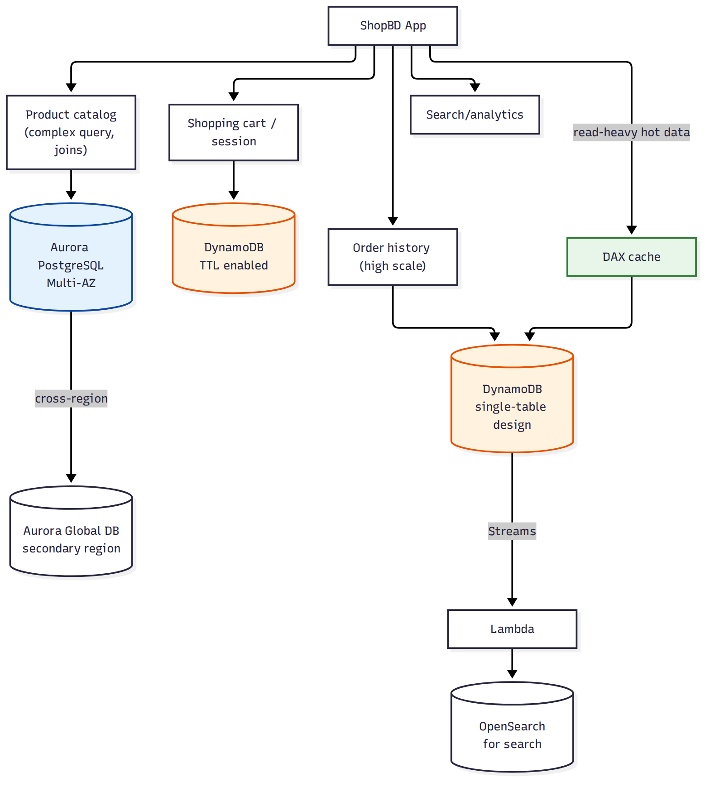

# 📚 Day 58 — Module 9 Revision + Project: Polyglot Persistence Architecture

> 📊 **Visual Summary** — সহজে বোঝার জন্য diagram:



**সময়:** ২ ঘণ্টা | **Module:** ৯ (Databases: RDS & DynamoDB) — Day 5 (শেষ দিন)

## 🎯 আজকের লক্ষ্য
- পুরো Module 9 এক নজরে revision
- RDS বনাম DynamoDB — সিদ্ধান্ত নেওয়ার clear framework
- Project: একটা e-commerce অ্যাপের জন্য সঠিক ডেটাবেস বাছাই (polyglot persistence)
- Production database checklist ও Final quiz

---

# 🔁 Module 9 Revision

## 🗺 পুরো Module এক নজরে

| Day | বিষয় | এক লাইনে মনে রাখুন |
|---|---|---|
| 54 | RDS Fundamentals | Multi-AZ = availability (sync, non-readable standby); Read Replica = scaling (async, readable) |
| 55 | Aurora, RDS Proxy | Aurora = shared distributed storage (দ্রুত, কম lag replica); RDS Proxy = connection pooling + fast failover |
| 56 | DynamoDB Fundamentals | Partition Key data distribute করে; On-Demand (spiky) বনাম Provisioned (steady); GSI নমনীয়, LSI টেবিল তৈরির সময়ই |
| 57 | DynamoDB Streams, DAX, Transactions | Streams = change capture (event-driven); Global Tables = active-active; DAX = microsecond cache; Transactions = multi-item ACID |

## 🧭 RDS বনাম DynamoDB — সিদ্ধান্ত গাইড

```
জটিল JOIN, multi-table relationship, reporting/analytics query?     → RDS/Aurora
ACID transaction বারবার লাগে, complex business logic DB-তে?         → RDS/Aurora
Traffic pattern predictable, বছরে খুব একটা scale বদলায় না?          → RDS (Multi-AZ + Read Replica)
Massive scale (মিলিয়ন request/সেকেন্ড), key-based lookup?           → DynamoDB
Access pattern আগে থেকে জানা, schema flexibility দরকার?             → DynamoDB
Global user-base-এ প্রতিটা region-এ local read/write দরকার?         → DynamoDB Global Tables (বা Aurora Global DB read-only secondary)
Session store, TTL দিয়ে auto-cleanup দরকার?                         → DynamoDB (TTL)
Existing app legacy RDBMS-নির্ভর, migration ব্যয়বহুল?              → RDS (বা Aurora migration, Day 55)
একই সিস্টেমে দুটোই দরকার?                                           → Polyglot persistence (আজকের project)
```

**মনে রাখার সহজ নিয়ম:** "Relationship আর complex query দরকার হলে RDS; scale আর simple/predictable access pattern দরকার হলে DynamoDB।" বাস্তব প্রোডাকশন সিস্টেমে প্রায়ই দুটোই একসাথে থাকে — এটাকেই বলে **polyglot persistence**।

---

# 🛠 Project: "ShopBD" — Polyglot Persistence Architecture

## Requirement
ShopBD একটা e-commerce অ্যাপ, বিভিন্ন অংশের ডেটা access pattern সম্পূর্ণ আলাদা:
- **Product catalog**: category, filter, complex search — জটিল relational query
- **Shopping cart / session**: প্রতি user আলাদা, temporary, খুব দ্রুত read/write, নির্দিষ্ট সময় পর মুছে যাওয়া উচিত
- **Order history**: millions of user, প্রতিটা order lookup দ্রুত হতে হবে, ভবিষ্যতে আরও scale হবে
- **Search/analytics**: order আর product-এর উপর ভিত্তি করে trending/search feature
- একটা hot leaderboard/inventory-counter ফিচার আছে যেখানে read latency microsecond-এ চাই
- Disaster recovery দরকার (region outage হলেও ব্যবসা চলবে)

## ধাপে ধাপে সিদ্ধান্ত

### ১. Product Catalog — Aurora PostgreSQL (Day 54–55)
- Category, brand, price, inventory — সব সম্পর্কযুক্ত, জটিল filter/JOIN দরকার
- **Aurora PostgreSQL, Multi-AZ**, কয়েকটা **Read Replica** (catalog browsing read-heavy)
- Read replica-গুলো "product listing" API সার্ভ করবে, writer শুধু admin/inventory update-এর জন্য

### ২. Shopping Cart / Session — DynamoDB + TTL (Day 56–57)
- Partition Key: `UserId`, item-এ cart content (Map/List attribute)
- **On-Demand capacity** (ট্রাফিক spiky — sale event-এ হঠাৎ বেড়ে যায়)
- **TTL** সেট করা — ৭ দিন inactive থাকলে cart automatically মুছে যাবে

### ৩. Order History — DynamoDB, Single-table design (Day 56–57)
- `PK = USER#<id>`, `SK = ORDER#<orderDate>#<orderId>` — একজন user-এর সব order একই partition-এ, sort key দিয়ে সময় অনুযায়ী range query
- GSI: `Status-CreatedAt-index` — "সব pending order" জাতীয় cross-user query-র জন্য
- **DynamoDB Streams** enable → Lambda → search index/analytics আপডেট

### ৪. Search/Analytics — Streams → OpenSearch (Day 57, Day 25-এর সাথে সংযোগ)
- Order/product টেবিলের Streams থেকে Lambda ট্রিগার হয়ে OpenSearch-এ sync হয় (near real-time, DB-তে load না বাড়িয়ে)

### ৫. Hot Inventory Counter — DynamoDB + DAX (Day 57)
- "কতগুলো স্টকে আছে" — খুব ঘন ঘন read হওয়া, একই key বারবার — **DAX** বসিয়ে microsecond latency
- Write (stock কমানো)-তে **conditional update** ব্যবহার (overselling আটকাতে, transactions-এর নীতি)

### ৬. Disaster Recovery — দুটো ডেটাবেসের জন্য দুই কৌশল
- Aurora: **Aurora Global Database** (secondary region, promote করলে সেকেন্ডে সচল)
- DynamoDB: **Global Tables** (cart/order history-ও অন্য region-এ active-active রাখা যায়, প্রয়োজন অনুযায়ী)

## ✅ Production Database Checklist
- [ ] Relational data (catalog, billing) → RDS/Aurora, ভবিষ্যতের scale চাহিদা অনুযায়ী Aurora বিবেচনা করা
- [ ] High-scale/simple-access-pattern data → DynamoDB, partition key hot-spot এড়িয়ে ডিজাইন করা
- [ ] Multi-AZ (RDS) সবসময় production-এ চালু
- [ ] Read replica/GSI দিয়ে read scaling, লেখা টেবিলে সরাসরি ভারী read query না চালানো
- [ ] Backup: automated backup + PITR (RDS), point-in-time recovery (DynamoDB) দুটোই চালু
- [ ] Serverless compute (Lambda) → RDS/Aurora কানেক্ট করলে RDS Proxy বাধ্যতামূলক ভাবা
- [ ] TTL/lifecycle policy দিয়ে অপ্রয়োজনীয় ডেটা automatically পরিষ্কার
- [ ] DR strategy (Day 18, Day 55) ডেটাবেস-লেভেলেও প্রযোজ্য কিনা যাচাই ও নিয়মিত টেস্ট করা
- [ ] Secrets Manager দিয়ে DB credential (Day 52), hardcode না করা

---

## 📝 Module 9 Final Quiz

1. Multi-AZ standby আর Read Replica-র মধ্যে "readable" পার্থক্যটা কেন গুরুত্বপূর্ণ?
2. Aurora replica-র lag সাধারণ RDS read replica-র চেয়ে কম কেন?
3. DynamoDB-তে কোন ধরনের access pattern-এ GSI-এর বদলে LSI বাছবেন?
4. একটা payment system-এ multi-item atomic update দরকার হলে DynamoDB-তে কোন feature ব্যবহার করবেন?
5. প্রোডাকশনে কেন RDS/Aurora-এর সাথে Lambda ব্যবহার করলে RDS Proxy প্রায় বাধ্যতামূলক মনে করা হয়?

### 🎓 Exam-ধাঁচের প্রশ্ন

**Q6.** An application requires complex SQL joins across multiple normalized tables and strict ACID transactions for financial reporting. Which database is MOST appropriate?
- A. Amazon DynamoDB with transactions
- B. Amazon Aurora (or RDS)
- C. Amazon S3 with Athena
- D. DynamoDB with a single-table design

**Q7.** A gaming company needs a leaderboard read with microsecond latency, on top of a DynamoDB table that already serves millions of requests per second. What should be added WITHOUT re-architecting the data model?
- A. Read Replica
- B. RDS Proxy
- C. DynamoDB Accelerator (DAX)
- D. Increase provisioned RCU only

**Q8.** A company wants its DynamoDB table's data to be available for read AND write in two AWS regions simultaneously, with automatic conflict resolution. What should they use?
- A. DynamoDB Streams with a custom Lambda replicator
- B. DynamoDB Global Tables
- C. RDS Read Replica in another region
- D. Aurora Global Database

<details><summary>▶ উত্তর দেখুন</summary>

1. Standby-তে read পাঠানো যায় না বলেই read scaling-এর জন্য Multi-AZ যথেষ্ট না — আলাদা Read Replica লাগে, যেটা সরাসরি readable।
2. Aurora replica একই shared distributed storage layer পড়ে (আলাদা async copy না), তাই replication lag প্রায় শূন্যের কাছাকাছি; সাধারণ RDS replica পুরো ডেটা asynchronously copy করে।
3. যখন একই partition key-র মধ্যে অন্য attribute দিয়ে **strongly consistent** sort/query দরকার এবং সেটা টেবিল তৈরির সময়ই জানা থাকে — LSI সেই একমাত্র ক্ষেত্রে উপযুক্ত, নাহলে GSI বেশি নমনীয়।
4. `TransactWriteItems` — একাধিক item-এ all-or-nothing atomic write গ্যারান্টি দেয়।
5. Lambda concurrent invocation হঠাৎ হাজার হাজার connection তৈরি করতে পারে, যা RDS/Aurora-এর max connection সীমা ছাড়িয়ে যায়; RDS Proxy সেই connection pool করে reuse করে, connection exhaustion আটকায়।
6. **B**: জটিল JOIN আর multi-table ACID transaction relational database-এর মূল শক্তি — DynamoDB-তে JOIN নেই।
7. **C**: DAX শুধু DynamoDB-এর সামনে বসিয়ে data model অপরিবর্তিত রেখে microsecond cache যোগ করে।
8. **B**: DynamoDB Global Tables-ই একমাত্র option যা active-active (দুই region-এই read+write) এবং built-in conflict resolution (last writer wins) দেয়; Aurora Global DB-এর secondary সাধারণত read-only।
</details>

---

## 💡 Pro Tips

- একটা সিস্টেমে সব ডেটার জন্য একটাই ডেটাবেস ব্যবহার করার চেষ্টা প্রায়ই ভুল সিদ্ধান্তে নিয়ে যায় — access pattern অনুযায়ী **polyglot persistence** স্বাভাবিক ও প্রয়োজনীয়
- RDS/Aurora থেকে DynamoDB-তে migrate করার আগে নিশ্চিত হোন access pattern সত্যিই key-based lookup-ভিত্তিক, শুধু "scale করতে হবে" ভেবে migrate করবেন না
- Module 8 (security/monitoring)-এর নিয়ম ডেটাবেসেও প্রযোজ্য: encryption at rest/in transit, IAM/Secrets Manager দিয়ে credential, CloudTrail দিয়ে audit
- Database migration (RDS ↔ RDS, on-prem → RDS) দরকার হলে **AWS DMS** (Database Migration Service) ব্যবহার করুন, নিজে script লিখে না

---

## 🚨 বাস্তব পরিস্থিতি (যেসব ভুল প্রায়ই হয়)

**পরিস্থিতি ১:** একটা টিম সব ডেটা (catalog থেকে order থেকে session সব) একটাই RDS instance-এ রেখেছিল। Sale event-এর দিন traffic স্পাইকে পুরো ডেটাবেস (catalog browsing সহ) ধীর হয়ে গেল।
**শিক্ষা:** ভিন্ন access pattern-এর ডেটা ভিন্ন ডেটাবেসে আলাদা করলে একটার লোড আরেকটাকে প্রভাবিত করে না।

**পরিস্থিতি ২:** DynamoDB-তে migrate করার সময় RDS-এর মতোই multi-table normalized design রাখা হয়েছিল, ফলে প্রতিটা page load-এ ৫-৬টা আলাদা query (JOIN-এর বিকল্প নেই) লাগছিল।
**শিক্ষা:** DynamoDB-তে migrate করলে access pattern অনুযায়ী নতুন করে ডিজাইন করুন (single-table design বিবেচনা করুন), RDS schema হুবহু কপি করবেন না।

**পরিস্থিতি ৩:** DR প্ল্যানে Aurora Global Database ছিল, কিন্তু DynamoDB টেবিলগুলোর জন্য কোনো cross-region strategy ছিল না। Region outage-এ অর্ধেক সিস্টেম চালু থাকল, বাকিটা বন্ধ।
**শিক্ষা:** DR ডিজাইন করার সময় প্রতিটা ডেটাস্টোরের জন্য আলাদাভাবে RPO/RTO ভাবুন, শুধু একটা প্রধান ডেটাবেস কভার করলেই যথেষ্ট না।

---

**⏮ আগের দিন:** [Day 57 — DynamoDB Streams, Global Tables, DAX ও Transactions](./Day-57-DynamoDB-Streams-Global-Tables-DAX-Transactions.md) | **⏭ পরের module:** [99 — Interview Q&A](../99-Interview-QA/01-Questions.md) অথবা [98 — SAA-C03 Exam Prep](../98-SAA-C03-Exam-Prep/01-Exam-Overview-and-Strategy.md)
