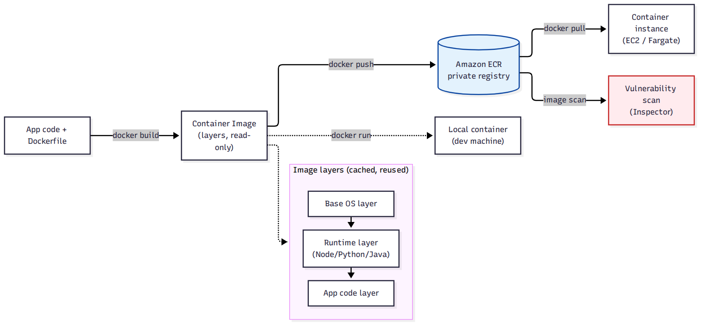

# 📚 Day 59 — Docker ও Container Fundamentals, Amazon ECR

> 📊 **Visual Summary** — সহজে বোঝার জন্য diagram:



**সময়:** ২ ঘণ্টা | **Module:** ১০ (Containers: ECS, EKS & Fargate) — Day 1

## 🎯 আজকের লক্ষ্য
- Container কী, VM-এর সাথে পার্থক্য
- Docker Image ও Layer কীভাবে কাজ করে
- Dockerfile-এর মূল instruction
- **Amazon ECR** (Elastic Container Registry): private registry, image push/pull
- Image vulnerability scanning
- কেন containerize করলে EC2 (Day 2-7)-এর তুলনায় deployment সহজ হয়

---

## Part 1: Container কেন? VM বনাম Container

**সমস্যা (VM-based deployment, Day 15-21):** প্রতিটা app-এর জন্য আলাদা EC2/VM চালালে পুরো OS বুট করতে হয়, resource নষ্ট হয়, "আমার মেশিনে তো চলছিল" জাতীয় সমস্যা হয় (environment mismatch)।

**সমাধান: Container** — App আর তার dependency-কে একটা **portable, lightweight package**-এ বন্দি করা, যা host OS-এর kernel শেয়ার করে (আলাদা OS বুট করতে হয় না)।

```
Virtual Machine:                    Container:
┌─────────────────────┐             ┌─────────────────────┐
│ App A │ App B        │             │ App A     │ App B    │
│ Guest OS │ Guest OS  │             │ (libs)    │ (libs)   │
│    Hypervisor        │             │   Container Engine   │
│    Host OS           │             │      Host OS         │
└─────────────────────┘             └─────────────────────┘
ভারী, ধীর বুট (মিনিট)                হালকা, দ্রুত বুট (সেকেন্ড)
```

| | **VM (EC2)** | **Container** |
|---|---|---|
| Isolation | পূর্ণ (নিজস্ব kernel) | Process-level (host kernel শেয়ার) |
| Boot time | মিনিট | সেকেন্ড |
| সাইজ | GB | MB |
| Portability | Hypervisor-নির্ভর | যেকোনো Docker-compatible host-এ একই রকম চলে |

---

## Part 2: Docker Image ও Layer

একটা **image** হলো container চালানোর জন্য দরকারি সবকিছুর (code, runtime, library, config) একটা **read-only template**। Image **layer** দিয়ে তৈরি — প্রতিটা layer আগেরটার উপর যোগ হয়, আর **cache** হয় (একই layer বারবার rebuild করতে হয় না)।

```dockerfile
FROM node:20-alpine          # Layer 1: base OS + runtime
WORKDIR /app
COPY package*.json ./        # Layer 2: dependency file (আলাদা রাখলে cache কাজে লাগে)
RUN npm install               # Layer 3: dependency install
COPY . .                      # Layer 4: app code (সবচেয়ে বেশি বদলায়)
EXPOSE 3000
CMD ["node", "server.js"]     # Container start হলে কী চলবে
```

### গুরুত্বপূর্ণ Dockerfile Instruction
| Instruction | কাজ |
|---|---|
| `FROM` | Base image বাছাই |
| `WORKDIR` | Container-এর ভেতরে working directory |
| `COPY` / `ADD` | Host থেকে ফাইল container-এ কপি |
| `RUN` | Build-time-এ command চালানো (image তৈরির সময়) |
| `CMD` / `ENTRYPOINT` | Container **start** হওয়ার সময় কী চলবে |
| `EXPOSE` | কোন পোর্ট ব্যবহার হবে (ডকুমেন্টেশন, actual publish আলাদা) |

> **Layer ordering টিপ:** কম বদলানো instruction (base image, dependency install) উপরে রাখুন, বেশি বদলানো (app code) নিচে — তাহলে rebuild দ্রুত হয় (cache hit বেশি)।

---

## Part 3: Amazon ECR — Private Container Registry

Docker Hub-এর মতো, কিন্তু AWS-এর নিজস্ব **private registry**, IAM দিয়ে access control, VPC-এর ভেতর থেকে সরাসরি পৌঁছানো যায় (Interface Endpoint, Day 12)।

```bash
# ECR-এ login
aws ecr get-login-password --region ap-south-1 | docker login --username AWS --password-stdin <account-id>.dkr.ecr.ap-south-1.amazonaws.com

# Build, tag, push
docker build -t myapp .
docker tag myapp:latest <account-id>.dkr.ecr.ap-south-1.amazonaws.com/myapp:latest
docker push <account-id>.dkr.ecr.ap-south-1.amazonaws.com/myapp:latest
```

### মূল ফিচার
- **Repository policy**: কোন IAM principal push/pull করতে পারবে
- **Image scanning**: push হওয়ার সময় automatically vulnerability scan (Amazon Inspector-এর সাথে ইন্টিগ্রেটেড, Day 51)
- **Lifecycle policy**: পুরনো/unused image automatically মুছে ফেলা (খরচ কমাতে)
- **Image tag immutability**: একবার push হওয়া tag আবার overwrite করা আটকানো যায় (production safety)

---

## Part 4: Hands-on Lab

1. একটা সাধারণ Node.js/Python app-এর জন্য Dockerfile লিখুন
2. `docker build` দিয়ে image তৈরি করুন, `docker run` দিয়ে local-এ চালান
3. একটা ECR repository তৈরি করুন
4. Image build → tag → push করুন ECR-এ
5. Image scanning রেজাল্ট দেখুন (vulnerability থাকলে)
6. Lifecycle policy যোগ করুন: ৫টার বেশি untagged image ৭ দিন পর মুছে যাবে
7. Repository policy দিয়ে অন্য একটা IAM role-কে শুধু pull access দিন

---

## 🎯 আজকের মূল Takeaways
- Container host kernel শেয়ার করে, তাই VM-এর চেয়ে হালকা ও দ্রুত
- Image layer cache হয় — Dockerfile-এ কম বদলানো instruction উপরে রাখলে build দ্রুত হয়
- ECR হলো AWS-এর নিজস্ব private, IAM-secured container registry
- Image scanning ও lifecycle policy production hygiene-এর জন্য জরুরি

## 📝 Self-check Questions
1. Container VM-এর চেয়ে দ্রুত বুট করে কেন?
2. Dockerfile-এ `COPY package*.json ./` কে `COPY . .`-এর আগে কেন রাখা হয়?
3. ECR আর Docker Hub-এর মূল পার্থক্য কী?
4. Image tag immutability কেন production-এ গুরুত্বপূর্ণ?

## 💡 Pro Tips
- Base image যতটা সম্ভব ছোট বাছুন (`alpine` variant) — attack surface ও pull time দুটোই কমে
- `.dockerignore` ব্যবহার করুন (`node_modules`, `.git` ইত্যাদি bake না করতে)
- Secret কখনো Dockerfile-এ hardcode করবেন না — Secrets Manager/environment variable ব্যবহার করুন
- CI pipeline-এ প্রতিটা push-এ automatic ECR scan-এর ফলাফল check করুন

## 🎨 Quick Reference
```
Image = read-only layered template | Container = running instance of an image
Dockerfile: FROM → WORKDIR → COPY → RUN → CMD/ENTRYPOINT → EXPOSE
ECR: private, IAM-secured, scan on push, lifecycle policy, tag immutability
```

## 🚨 বাস্তব পরিস্থিতি (যেসব ভুল প্রায়ই হয়)

**পরিস্থিতি ১:** একটা টিম প্রতিটা code change-এ পুরো `npm install` আবার চালাচ্ছিল কারণ Dockerfile-এ `COPY . .` সবার উপরে ছিল — build ৫ মিনিট লাগত।
**শিক্ষা:** Dependency file আলাদা কপি করে আগে install করুন, layer cache কাজে লাগবে।

**পরিস্থিতি ২:** ECR-এ কোনো lifecycle policy ছিল না, বছরখানেক পর হাজার হাজার পুরনো image জমে বিল বেড়ে গেল।
**শিক্ষা:** শুরু থেকেই lifecycle policy সেট করুন।

---

**⏮ আগের module:** [Day 58 — Module 9 Revision](../10-Module-9-Databases-RDS-DynamoDB/Day-58-Module-9-Revision-Polyglot-Persistence-Project.md) | **⏭ পরের দিন:** [Day 60 — Amazon ECS: Cluster, Task Definition ও Service](./Day-60-ECS-Cluster-Task-Definition-Service.md)
