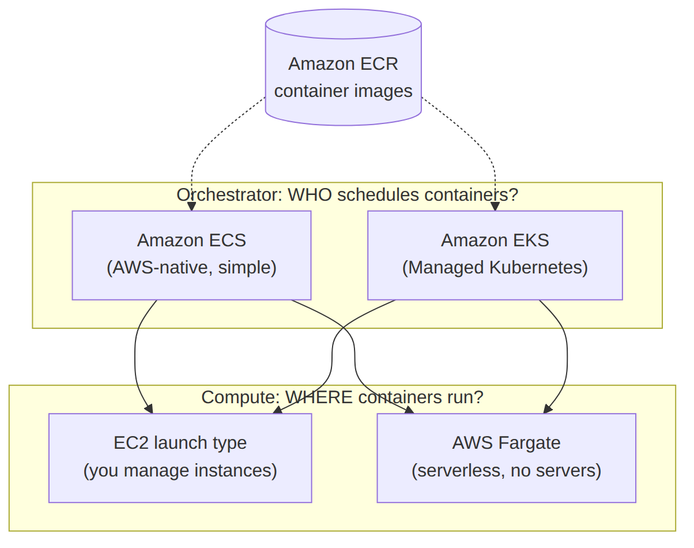

# 📚 Day 61 — Amazon EKS ও ECS বনাম EKS বনাম Fargate

> 📊 **Visual Summary** — সহজে বোঝার জন্য diagram:



**সময়:** ২ ঘণ্টা | **Module:** ১০ (Containers: ECS, EKS & Fargate) — Day 3

## 🎯 আজকের লক্ষ্য
- Kubernetes কী, কেন এত জনপ্রিয়
- **Amazon EKS**: managed Kubernetes control plane
- Node Group: Managed বনাম Self-managed বনাম **Fargate profile**
- EKS-এর মূল object: Pod, Deployment, Service (concept-level)
- **ECS বনাম EKS** — কবে কোনটা বাছবেন (পুরো Module-এর সিদ্ধান্ত)

---

## Part 1: Kubernetes কী?

**Kubernetes (K8s)** একটা **open-source container orchestrator** — Google-এ তৈরি, এখন industry standard। ECS-এর মতোই কাজ করে (container schedule, scale, self-heal), কিন্তু:
- **Cloud-agnostic** — AWS, GCP, Azure, on-prem — যেকোনো জায়গায় একই রকম চলে (vendor lock-in কম)
- অনেক বড় **ecosystem** (Helm, operators, service mesh) আছে
- শেখার curve ECS-এর চেয়ে বেশি খাড়া

---

## Part 2: Amazon EKS — Managed Kubernetes

নিজে Kubernetes control plane (API server, etcd, scheduler) চালানো জটিল ও ঝুঁকিপূর্ণ। **Amazon EKS** সেই control plane AWS-এর পক্ষ থেকে manage করে, Multi-AZ, patched, highly available।

```
আপনার দায়িত্ব:        Worker node (বা Fargate profile), Pod/Deployment config, application
AWS-এর দায়িত্ব (EKS): Control plane (API server, etcd) — HA, patching, scaling
```

### Node Group-এর ধরন
| ধরন | বৈশিষ্ট্য |
|---|---|
| **Managed Node Group** | AWS EC2 worker node provision ও lifecycle manage করে (Auto Scaling Group-ভিত্তিক) |
| **Self-managed Node Group** | আপনি নিজে EC2 worker node manage করেন (বেশি কাস্টমাইজেশন দরকার হলে) |
| **Fargate Profile** | EC2 worker node একদমই না — প্রতিটা Pod সরাসরি Fargate-এ চলে (serverless Kubernetes) |

---

## Part 3: Kubernetes-এর মূল Object (Concept-level)

| Object | কাজ |
|---|---|
| **Pod** | সবচেয়ে ছোট deployable unit — একটা বা একাধিক related container একসাথে |
| **Deployment** | কয়টা Pod replica চালু থাকবে সেটা বজায় রাখে (ECS Service-এর মতোই ধারণা) |
| **Service** | Pod-দের group-এর জন্য একটা স্থায়ী network endpoint (Pod বদলালেও endpoint একই থাকে) |
| **Namespace** | একই cluster-এর ভেতরে logical isolation (team/environment ভাগ করতে) |

```
Deployment (replicas: 3) ──► Pod 1, Pod 2, Pod 3 (প্রতিটাতে 1+ container)
Service ──► stable endpoint যা Pod-গুলোর মধ্যে load balance করে
```

---

## Part 4: ECS বনাম EKS — সিদ্ধান্ত গাইড

| | **ECS** | **EKS** |
|---|---|---|
| Complexity | সহজ, AWS-native, কম শেখার curve | জটিল, কিন্তু বেশি নমনীয় |
| Portability | শুধু AWS | Multi-cloud/on-prem portable (standard Kubernetes API) |
| Ecosystem | AWS-এর নিজস্ব টুল | বিশাল open-source ecosystem (Helm charts, operators) |
| Team-এর দক্ষতা | নতুন team, AWS-only strategy | ইতিমধ্যে Kubernetes অভিজ্ঞতা আছে, বা multi-cloud দরকার |
| খরচ | Cluster নিজে ফ্রি (শুধু resource-এর বিল) | Control plane-এর জন্য ঘণ্টাপ্রতি ফি (+ resource) |

```
টিম নতুন, শুধু AWS-এ থাকবে, দ্রুত শুরু করতে চায়?        → ECS
টিমের আগে থেকে Kubernetes অভিজ্ঞতা/multi-cloud দরকার?   → EKS
সরল microservice, কম operational overhead চাই?         → ECS + Fargate
বিশাল, জটিল, portable microservice architecture?        → EKS (+ Fargate profile বা managed node group)
```

---

## Part 5: Fargate — ECS ও EKS দুটোতেই serverless compute

Fargate কোনো নিজস্ব orchestrator না — এটা একটা **serverless compute engine** যা ECS বা EKS দুটোর সাথেই ব্যবহার করা যায়। মূল ধারণা:

```
Orchestrator (WHO schedules?):  ECS  বা  EKS
Compute (WHERE it runs?):       EC2 (আপনি manage করেন)  বা  Fargate (serverless)
```

তাই "ECS বনাম Fargate" প্রশ্নটাই ভুল — সঠিক প্রশ্ন হলো "orchestrator হিসেবে ECS/EKS কোনটা" আর "compute হিসেবে EC2/Fargate কোনটা", দুটো স্বাধীন সিদ্ধান্ত।

---

## Part 6: Hands-on Lab

1. `eksctl` বা console দিয়ে একটা ছোট EKS cluster তৈরি করুন
2. একটা Managed Node Group যোগ করুন (২টা t3.small node)
3. `kubectl` দিয়ে cluster-এ কানেক্ট করুন, একটা সাধারণ Deployment (৩টা replica) apply করুন
4. একটা Service (`LoadBalancer` type) তৈরি করে বাইরে থেকে অ্যাক্সেস করুন
5. একটা Fargate profile যোগ করে সেই namespace-এ Pod চালিয়ে দেখুন EC2 node ছাড়াই চলে কিনা
6. Cluster ও সব resource মুছুন (EKS control plane খরচ ঘণ্টাপ্রতি)

---

## 🎯 আজকের মূল Takeaways
- EKS = managed Kubernetes control plane; worker node EC2 (managed/self-managed) বা Fargate profile হতে পারে
- Pod → Deployment → Service — Kubernetes-এর তিনটা মূল বিল্ডিং ব্লক
- ECS সহজ ও AWS-native; EKS জটিল কিন্তু portable ও বিশাল ecosystem
- Fargate নিজে orchestrator না — compute engine, ECS আর EKS দুটোর সাথেই কাজ করে

## 📝 Self-check Questions
1. EKS-এ AWS ঠিক কোন অংশটা manage করে, আর কোনটা আপনার দায়িত্ব?
2. Managed Node Group আর Fargate profile-এর মধ্যে পার্থক্য কী?
3. "ECS বনাম Fargate" প্রশ্নটা কেন সঠিক প্রশ্ন না?
4. কোন পরিস্থিতিতে ECS-এর বদলে EKS বাছবেন?

## 💡 Pro Tips
- টিমের আগে থেকে Kubernetes অভিজ্ঞতা না থাকলে সরাসরি EKS-এ ঝাঁপ দেবেন না — ECS দিয়ে শুরু করে দরকার হলে পরে migrate করুন
- EKS control plane-এর ফ্ল্যাট ফি আছে (resource-নির্ভর না) — ছোট ওয়ার্কলোডে এটা উল্লেখযোগ্য খরচ হতে পারে
- Fargate profile ব্যবহার করলে node patching/scaling নিয়ে একদম ভাবতে হয় না
- Multi-cloud strategy না থাকলে "portability" যুক্তি দিয়ে EKS বাছাই অনেক সময় অপ্রয়োজনীয় জটিলতা যোগ করে

## 🎨 Quick Reference
```
EKS = managed Kubernetes control plane (Multi-AZ, patched by AWS)
Node group: Managed (AWS-provisioned EC2) | Self-managed (আপনার EC2) | Fargate profile (no EC2)
Pod (smallest unit) → Deployment (replica count) → Service (stable endpoint)
ECS: simple, AWS-native | EKS: portable, ecosystem-rich, complex
Fargate: compute engine (works with BOTH ECS and EKS), not an orchestrator itself
```

## 🚨 বাস্তব পরিস্থিতি (যেসব ভুল প্রায়ই হয়)

**পরিস্থিতি ১:** একটা ছোট স্টার্টআপ "সবাই Kubernetes ব্যবহার করে" শুনে সরাসরি EKS বেছে নিল, কিন্তু টিমের কারো Kubernetes অভিজ্ঞতা ছিল না — মাসখানেক শুধু cluster সেটআপ আর debugging-এই গেল।
**শিক্ষা:** টিমের দক্ষতা আর প্রকৃত প্রয়োজন (multi-cloud, portability) বিবেচনা না করে জনপ্রিয়তার ভিত্তিতে টুল বাছবেন না।

**পরিস্থিতি ২:** একটা টিম মনে করেছিল Fargate মানে শুধু ECS-এর ফিচার, তাই EKS-এ node পুরোপুরি EC2-ভিত্তিক রেখে patching-এর বোঝা বহন করছিল।
**শিক্ষা:** EKS-এও Fargate profile ব্যবহার করে node management এড়ানো যায়।

---

**⏮ আগের দিন:** [Day 60 — ECS: Cluster, Task Definition ও Service](./Day-60-ECS-Cluster-Task-Definition-Service.md) | **⏭ পরের দিন:** [Day 62 — Container Networking ও Auto Scaling](./Day-62-Container-Networking-Service-Discovery-Auto-Scaling.md)
