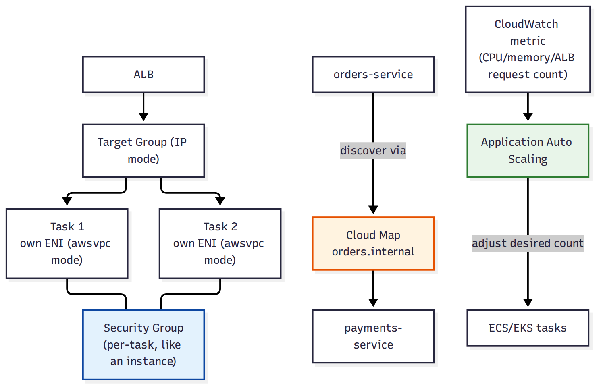

# 📚 Day 62 — Container Networking, Service Discovery ও Auto Scaling

> 📊 **Visual Summary** — সহজে বোঝার জন্য diagram:



**সময়:** ২ ঘণ্টা | **Module:** ১০ (Containers: ECS, EKS & Fargate) — Day 4

## 🎯 আজকের লক্ষ্য
- **awsvpc** network mode: প্রতিটা task নিজস্ব ENI ও Security Group পায়
- ALB target group type "IP" কেন দরকার (Day 60-এর সাথে সংযোগ)
- **Service Discovery (Cloud Map)**: container-থেকে-container যোগাযোগ
- ECS/EKS **Service Auto Scaling**: CPU/memory/custom metric-ভিত্তিক
- Logging ও monitoring: CloudWatch Container Insights

---

## Part 1: awsvpc Network Mode — প্রতিটা Task একটা "মিনি EC2"

Fargate ও আধুনিক ECS setup-এ **awsvpc** mode ব্যবহার হয় — প্রতিটা task তার নিজস্ব **Elastic Network Interface (ENI)** ও **প্রাইভেট IP** পায়, ঠিক EC2 instance-এর মতো।

```
আগের mode (bridge):  Container Instance-এর IP শেয়ার করত সব container, পোর্ট conflict হতো
awsvpc mode:          প্রতিটা Task = নিজস্ব ENI + নিজস্ব IP + নিজস্ব Security Group
```

**ফলাফল:**
- প্রতিটা task-এ আলাদা Security Group লাগানো যায় (VPC-তে EC2 instance-এর মতোই, Day 3)
- Port conflict হয় না — প্রতিটা task নিজের IP-তে একই পোর্ট ব্যবহার করতে পারে
- VPC Flow Logs (Day 50)-এ task-level traffic দেখা যায়

---

## Part 2: ALB Target Group Type "IP"

যেহেতু প্রতিটা task-এর নিজস্ব IP আছে (awsvpc mode), ALB target group **type "IP"** দিয়ে সরাসরি সেই IP-তে route করে (Instance ID দিয়ে না, Day 47-এর ALB টপিকের সম্প্রসারণ)।

```
ALB ──► Target Group (type: IP) ──► Task 1 (10.0.1.5:3000)
                                 ──► Task 2 (10.0.2.8:3000)
```

Task replace হলে (crash/deployment) নতুন IP automatically target group-এ register হয় — ECS নিজেই এই deregister/register সামলায়।

---

## Part 3: Service Discovery — Container-থেকে-Container যোগাযোগ

**সমস্যা:** Microservice architecture-এ (Day 34-এর মতো) একটা service-কে আরেকটা service খুঁজে বের করতে হয়, কিন্তু IP বারবার বদলায় (task replace হয়)।

**সমাধান: AWS Cloud Map** — ECS/EKS Service-এর সাথে integrate করে একটা internal DNS নাম দেয়, যা backend-এ আসল (বদলানো) IP-তে resolve হয়।

```
orders-service ──► DNS query: "payments.internal" ──► Cloud Map ──► বর্তমান healthy task IP
```

এতে hard-coded IP বা manual service registry ছাড়াই microservice-রা একে অপরকে খুঁজে পায়।

---

## Part 4: Service Auto Scaling

EC2 Auto Scaling Group-এর মতোই ধারণা (Day 7), কিন্তু ECS/EKS Service-এর **desired count** স্কেল করে।

| Scaling Policy | কীভাবে |
|---|---|
| **Target Tracking** | একটা metric (যেমন CPU 50%) টার্গেট রেখে desired count auto-adjust | 
| **Step Scaling** | Metric থ্রেশহোল্ড অনুযায়ী ধাপে ধাপে বাড়ানো/কমানো |
| **Scheduled Scaling** | নির্দিষ্ট সময়ে (যেমন ব্যবসায়িক সময়ে বেশি capacity) |

```
CloudWatch metric (CPUUtilization > 70%) ──► Application Auto Scaling ──► ECS Service desired count বাড়ায়
```

Fargate-এ task বাড়লে automatically নতুন serverless capacity বরাদ্দ হয়; EC2 launch type-এ প্রথমে cluster-এর underlying EC2 capacity (Auto Scaling Group) যথেষ্ট আছে কিনা নিশ্চিত করতে হয় (Capacity Provider ব্যবহার করে)।

---

## Part 5: Logging ও Monitoring — Container Insights

- প্রতিটা container-এর log সাধারণত `awslogs` driver দিয়ে সরাসরি **CloudWatch Logs**-এ যায় (Day 17-এর CloudWatch Agent ধারণার container সংস্করণ)
- **CloudWatch Container Insights** cluster/service/task-level CPU, memory, network metric aggregate করে dashboard দেয় — আলাদা কোনো agent বসাতে হয় না (ECS-এ built-in)

---

## Part 6: Hands-on Lab

1. Day 60-এর ECS Service-এ awsvpc mode আর নিজস্ব Security Group কনফার্ম করুন
2. Cloud Map namespace তৈরি করে Service-এর সাথে integrate করুন
3. দুটো আলাদা Service (`orders`, `payments`) চালিয়ে একটা থেকে আরেকটাকে service discovery নাম দিয়ে কল করুন
4. Service-এ Target Tracking Auto Scaling যোগ করুন (CPU 50% target)
5. Load generate করে (বা manually desired count বাড়িয়ে) auto scaling কাজ করছে কিনা দেখুন
6. CloudWatch Container Insights enable করে dashboard-এ CPU/memory দেখুন

---

## 🎯 আজকের মূল Takeaways
- awsvpc mode প্রতিটা task-কে নিজস্ব ENI/IP/Security Group দেয় — VPC-তে EC2-এর মতোই আচরণ
- ALB target group type "IP" ব্যবহার হয় কারণ task ID না, IP-ই স্থায়ী route target
- Cloud Map দিয়ে microservice-রা হার্ডকোড IP ছাড়াই একে অপরকে খুঁজে পায়
- Service Auto Scaling EC2 ASG-এর মতোই ধারণা, কিন্তু task count স্কেল করে
- Container Insights built-in monitoring দেয়, আলাদা agent লাগে না

## 📝 Self-check Questions
1. awsvpc mode-এর আগে (bridge mode) কী সমস্যা হতো?
2. ALB target group "Instance" টাইপের বদলে "IP" টাইপ কেন দরকার হয় Fargate-এ?
3. Cloud Map ছাড়া microservice-রা একে অপরকে কীভাবে খুঁজে পেত, আর সেখানে সমস্যা কী?
4. Target Tracking আর Scheduled Scaling-এর মধ্যে পার্থক্য কী?

## 💡 Pro Tips
- প্রতিটা microservice-এর জন্য আলাদা Security Group রাখুন (awsvpc mode-এর সুবিধা কাজে লাগান), সবার জন্য একই SG না
- Auto scaling target metric বাছার সময় বাস্তব bottleneck কী (CPU/memory/request count) সেটা বিবেচনা করুন
- Container Insights কিছুটা বাড়তি খরচ করে (CloudWatch metric/log), প্রোডাকশনে চালু রাখুন কিন্তু dev/test-এ প্রয়োজন অনুযায়ী বন্ধ রাখুন
- Service discovery নাম আর ALB — দুটো ভিন্ন উদ্দেশ্যে: ALB বাইরের ট্রাফিকের জন্য, Cloud Map ভেতরের service-to-service-এর জন্য

## 🎨 Quick Reference
```
awsvpc mode: প্রতি task = নিজস্ব ENI + IP + Security Group
ALB target group type "IP": awsvpc/Fargate task-এর জন্য বাধ্যতামূলক
Cloud Map: internal DNS-ভিত্তিক service discovery
Auto Scaling: Target Tracking | Step Scaling | Scheduled Scaling (desired count adjust করে)
Container Insights: built-in cluster/service/task metric dashboard
```

## 🚨 বাস্তব পরিস্থিতি (যেসব ভুল প্রায়ই হয়)

**পরিস্থিতি ১:** সব microservice-এর task-এ একটাই wide-open Security Group ব্যবহার করা হচ্ছিল, যদিও awsvpc mode-এ প্রতিটার আলাদা SG দেওয়ার সুযোগ ছিল।
**শিক্ষা:** প্রতিটা service-এর জন্য least-privilege আলাদা Security Group ডিজাইন করুন।

**পরিস্থিতি ২:** একটা service-এর hostname অন্য service-এর কোডে hardcode করা ছিল (IP-ভিত্তিক)। Task replace হতেই কল fail করা শুরু করল।
**শিক্ষা:** Service discovery (Cloud Map) ব্যবহার করুন, IP hardcode না করে।

---

**⏮ আগের দিন:** [Day 61 — EKS ও ECS বনাম EKS বনাম Fargate](./Day-61-EKS-Fundamentals-ECS-vs-EKS-vs-Fargate.md) | **⏭ পরের দিন:** [Day 63 — Module 10 Revision + Project: Containerized Microservices Platform](./Day-63-Module-10-Revision-Containerized-Microservices-Project.md)
