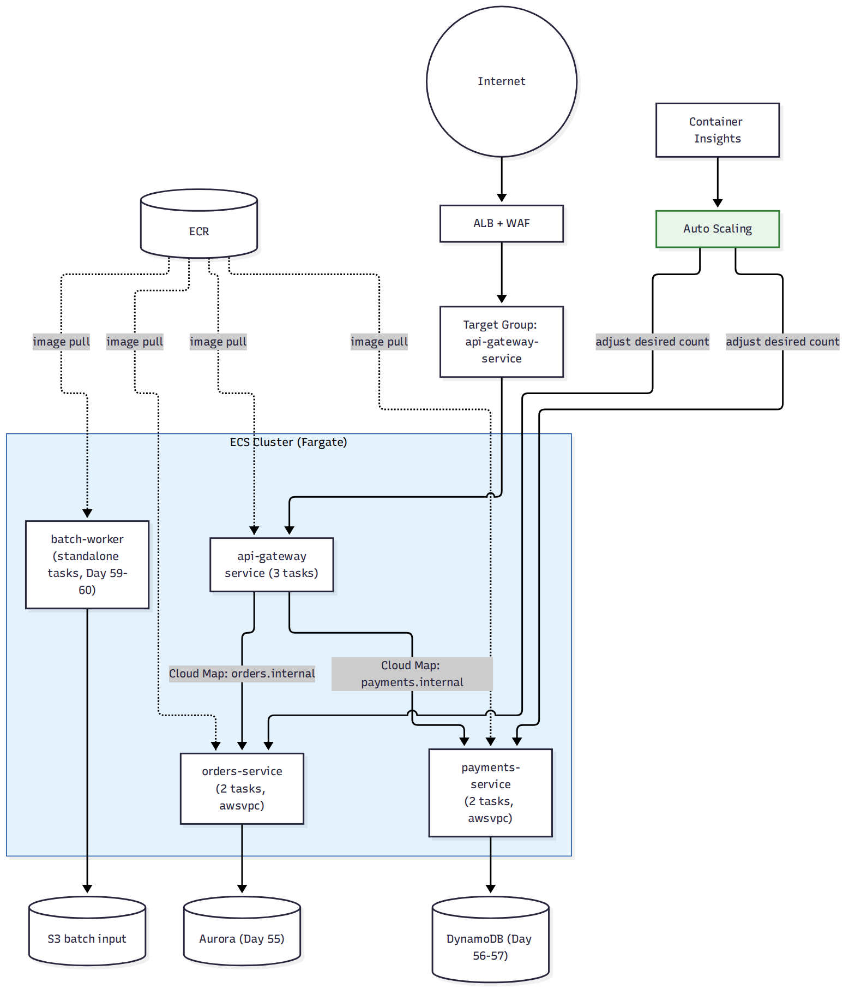

# 📚 Day 63 — Module 10 Revision + Project: Containerized Microservices Platform

> 📊 **Visual Summary** — সহজে বোঝার জন্য diagram:



**সময়:** ২ ঘণ্টা | **Module:** ১০ (Containers: ECS, EKS & Fargate) — Day 5 (শেষ দিন)

## 🎯 আজকের লক্ষ্য
- পুরো Module 10 এক নজরে revision
- Project: একটা e-commerce-এর জন্য সম্পূর্ণ containerized microservices platform ডিজাইন (Module 9-এর ডেটাবেস ডিজাইনের উপর ভিত্তি করে)
- Production container checklist ও Final quiz

---

# 🔁 Module 10 Revision

## 🗺 পুরো Module এক নজরে

| Day | বিষয় | এক লাইনে মনে রাখুন |
|---|---|---|
| 59 | Docker, Image, ECR | Image = layered read-only template; ECR = private, IAM-secured registry, scan on push |
| 60 | ECS Cluster, Task, Service | Task Definition = blueprint; Service = desired count + self-healing; Fargate = serverless compute |
| 61 | EKS, ECS বনাম EKS | EKS = managed Kubernetes control plane; Fargate কাজ করে ECS আর EKS দুটোর সাথেই |
| 62 | Networking, Discovery, Scaling | awsvpc = task-level ENI/SG; Cloud Map = internal DNS discovery; Auto Scaling = desired count adjust |

## 🧭 সিদ্ধান্ত গাইড

```
কোন orchestrator?
  শুধু AWS, দ্রুত শুরু, কম শেখার curve?        → ECS
  Multi-cloud/portable, বড় ecosystem দরকার?   → EKS

কোন compute (launch type)?
  ন্যূনতম operational overhead?                → Fargate
  খরচ optimize/বিশেষ instance type দরকার?      → EC2 launch type

Container-থেকে-Container যোগাযোগ কীভাবে?       → Cloud Map (service discovery), IP hardcode না
বাইরের ট্রাফিক কীভাবে আসবে?                    → ALB + target group (type: IP for awsvpc)
Batch/one-time job?                            → Standalone ECS Task (Service না)
```

---

# 🛠 Project: "ShopBD" — Containerized Microservices Platform

## Requirement (Day 58-এর ডেটাবেস ডিজাইনের সম্প্রসারণ)
- `api-gateway`, `orders-service`, `payments-service` — তিনটা আলাদা microservice, স্বাধীনভাবে deploy/scale হবে
- একটা `batch-worker` আছে যা রাতে একবার চলে (রিপোর্ট generate করে) — সবসময় চালু রাখার দরকার নেই
- Orders-service Aurora-তে (Day 55), Payments-service DynamoDB-তে (Day 56-57) কথা বলে
- সব service-এর image ECR-এ থাকবে, CI pipeline থেকে push হবে
- ন্যূনতম operational overhead — টিম ছোট, EC2 patch করার লোক নেই
- Traffic স্পাইক হলে automatically scale করতে হবে, কিন্তু হঠাৎ খরচ যেন বিস্ফোরিত না হয়

## ধাপে ধাপে সিদ্ধান্ত

### ১. Orchestrator ও Launch Type (Day 60–61)
- টিম ছোট, AWS-only, Kubernetes অভিজ্ঞতা নেই → **ECS**
- Operational overhead কমাতে → **Fargate** launch type (EC2 patch করার দরকার নেই)

### ২. Image ও Registry (Day 59)
- প্রতিটা service-এর নিজস্ব ECR repository, CI pipeline প্রতিটা merge-এ build → scan → push করে
- Lifecycle policy দিয়ে পুরনো image পরিষ্কার

### ৩. Networking (Day 62)
- সব Service awsvpc mode-এ, প্রতিটার নিজস্ব Security Group:
  - `api-gateway`: ইন্টারনেট থেকে শুধু ALB, বাইরে শুধু internal service-এ যাওয়ার অনুমতি
  - `orders-service`/`payments-service`: শুধু `api-gateway` থেকে ইনবাউন্ড অনুমতি, ইন্টারনেট থেকে সরাসরি না
- **Cloud Map** দিয়ে `orders.internal`, `payments.internal` — `api-gateway` এই নাম দিয়েই কল করে, IP hardcode না

### ৪. Batch Worker (Day 60)
- সবসময় চালু Service না, বরং **standalone ECS Task**, EventBridge scheduled rule (Day 31)-এ প্রতি রাতে ট্রিগার হয় — অপ্রয়োজনীয় সময় বিল হয় না

### ৫. Auto Scaling (Day 62)
- `orders-service`/`payments-service`-এ Target Tracking (CPU 60%), min 2 - max 10 task — স্পাইক সামলাবে কিন্তু max limit খরচ নিয়ন্ত্রণে রাখবে
- `api-gateway`-এ ALB request count-ভিত্তিক target tracking

### ৬. Security ও Monitoring (Module 8-এর সাথে সংযোগ)
- Task Role-এ প্রতিটা service-এর জন্য আলাদা least-privilege IAM role (orders-service শুধু Aurora secret পড়তে পারবে, payments-service শুধু DynamoDB টেবিল)
- Container Insights + CloudWatch Logs সব service-এ চালু
- ALB-এর সামনে WAF (Day 49)

## ✅ Production Container Checklist
- [ ] প্রতিটা microservice-এর আলাদা ECR repository + lifecycle policy + image scan চালু
- [ ] awsvpc mode, প্রতিটা service-এর নিজস্ব least-privilege Security Group
- [ ] Task Role আর Execution Role আলাদা, প্রতিটাতে ন্যূনতম প্রয়োজনীয় permission
- [ ] Internet-facing শুধু যেসব service-এর দরকার (সাধারণত শুধু api-gateway), বাকিরা internal
- [ ] Cloud Map/internal DNS দিয়ে service discovery, IP hardcode নয়
- [ ] Auto Scaling min/max limit সেট করা (হঠাৎ খরচ বিস্ফোরণ আটকাতে)
- [ ] One-time/scheduled job → standalone Task + EventBridge, ২৪/৭ Service না
- [ ] Container Insights + centralized logging চালু, প্রতিটা service আলাদা log group-এ
- [ ] Rolling deployment configuration (minimum healthy percent) zero-downtime নিশ্চিত করছে কিনা যাচাই

---

## 📝 Module 10 Final Quiz

1. Fargate-কে "orchestrator" বলা ভুল কেন?
2. একটা task-এর app code S3 access করতে পারছে না — কোন role-এ permission যোগ করবেন?
3. Cloud Map ছাড়া কেন microservice architecture-এ সমস্যা হতে পারে?
4. একবার চালানো batch job-কে কেন ECS Service না বানিয়ে standalone Task হিসেবে রাখা উচিত?

### 🎓 Exam-ধাঁচের প্রশ্ন

**Q5.** A company wants to run containerized workloads on AWS with the least operational overhead, without managing any EC2 instances. Which combination should they choose?
- A. ECS with EC2 launch type
- B. ECS or EKS with Fargate
- C. EKS with self-managed node groups
- D. EC2 Auto Scaling Group running Docker manually

**Q6.** Two ECS services running in awsvpc mode need to communicate using a stable internal DNS name that survives task replacement. What should be used?
- A. Hardcoded private IP addresses
- B. AWS Cloud Map (Service Discovery)
- C. Elastic IP addresses on each task
- D. Route 53 public hosted zone

<details><summary>▶ উত্তর দেখুন</summary>

1. Fargate একটা **compute engine** — এটা ECS বা EKS দুটো orchestrator-এর যেকোনোটার সাথেই কাজ করে; নিজে schedule/scale করার সিদ্ধান্ত নেয় না, শুধু serverless ভাবে container চালায়।
2. **Task Role**-এ — app code-এর permission সবসময় Task Role-এ দিতে হয়, Execution Role শুধু ECS agent-এর (image pull, log push)।
3. প্রতিটা task replace হলে নতুন IP পায়; hardcode করা IP/hostname দ্রুত পুরনো হয়ে যায়, service কল fail করতে শুরু করে।
4. Service ক্রমাগত desired count বজায় রাখার চেষ্টা করে — একবার চালানো job-কে Service বানালে কাজ শেষ হওয়ার পরও নতুন task চালু হতে থাকবে, অপ্রয়োজনীয় খরচ ও জটিলতা তৈরি করবে।
5. **B**: শুধু Fargate (ECS বা EKS-এর সাথে) EC2 instance পুরোপুরি এড়িয়ে যায়।
6. **B**: Cloud Map internal DNS নাম দেয় যা backend-এ পরিবর্তনশীল task IP-তে resolve হয়, hardcode/Elastic IP/public hosted zone কোনোটাই এই সমস্যার সঠিক সমাধান না।
</details>

---

## 💡 Pro Tips

- ছোট বা মাঝারি স্কেলের প্রোডাক্টে ECS + Fargate সাধারণত সবচেয়ে কম ঝামেলার সমাধান — EKS-এর জটিলতা তখনই নিন যখন সত্যিকারের প্রয়োজন (multi-cloud, বিশাল দল, বিদ্যমান Kubernetes ecosystem) আছে
- Module 9 (database) আর Module 10 (container) মিলিয়ে দেখুন: RDS Proxy Lambda-এর জন্য যেমন জরুরি, container থেকে RDS/Aurora কানেক্ট করলেও connection pooling নিয়ে একই সচেতনতা দরকার
- প্রতিটা microservice-কে independently deployable রাখুন — একটার deployment আরেকটাকে না থামায়
- Auto Scaling-এ সবসময় একটা **max limit** রাখুন, নাহলে bug/আক্রমণ হঠাৎ বিশাল বিল তৈরি করতে পারে

---

## 🚨 বাস্তব পরিস্থিতি (যেসব ভুল প্রায়ই হয়)

**পরিস্থিতি ১:** একটা টিম প্রতিটা microservice আলাদা EC2 instance-এ চালাত, deployment-এ প্রতিবার manual SSH করে আপডেট করতে হতো, মাঝে মাঝে ভুল version থেকে যেত।
**শিক্ষা:** ECS/Fargate-এ migrate করলে consistent, repeatable deployment পাওয়া যায়।

**পরিস্থিতি ২:** Auto Scaling-এ max limit সেট করা ছিল না, একটা bug অসীম loop-এ request পাঠাতে শুরু করল, task সংখ্যা শত শতে পৌঁছে বিল আকাশছোঁয়া হয়ে গেল।
**শিক্ষা:** সবসময় max task count নির্ধারণ করে রাখুন।

**পরিস্থিতি ৩:** ব্যাচ জব-কে ECS Service হিসেবে চালানো হচ্ছিল desired count 1 দিয়ে; জব শেষ হওয়ার পর ECS বারবার নতুন task চালু করছিল (কারণ desired count বজায় রাখার চেষ্টা), অকারণে চলতেই থাকল।
**শিক্ষা:** One-time job সবসময় standalone Task হিসেবে চালান, Service হিসেবে না।

---

**⏮ আগের দিন:** [Day 62 — Container Networking ও Auto Scaling](./Day-62-Container-Networking-Service-Discovery-Auto-Scaling.md) | **⏭ পরের module:** [99 — Interview Q&A](../99-Interview-QA/01-Questions.md) অথবা [98 — SAA-C03 Exam Prep](../98-SAA-C03-Exam-Prep/01-Exam-Overview-and-Strategy.md)
