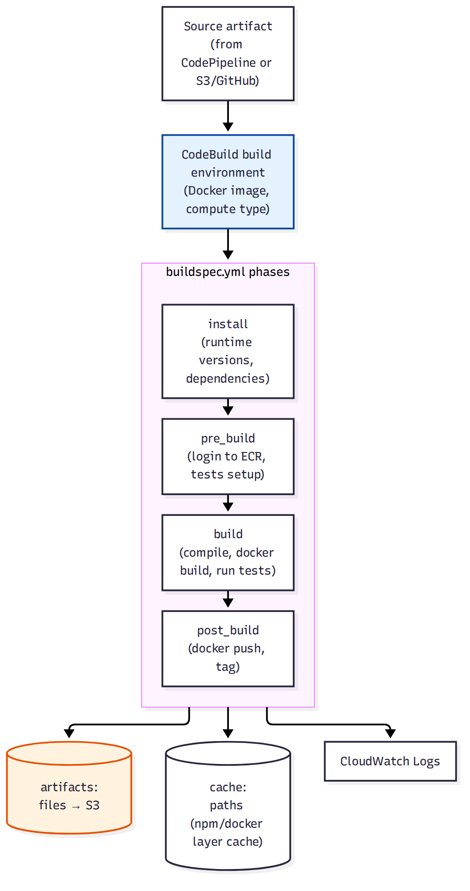

# 📚 Day 64 — AWS CodeBuild Fundamentals: Buildspec ও Build Phases

> 📊 **Visual Summary** — সহজে বোঝার জন্য diagram:



**সময়:** ২ ঘণ্টা | **Module:** ১১ (CI/CD: CodePipeline & CodeBuild) — Day 1

## 🎯 আজকের লক্ষ্য
- AWS CodeBuild কী সমস্যা সমাধান করে (Jenkins/self-hosted build server-এর বিকল্প)
- **buildspec.yml**-এর মূল phase: install, pre_build, build, post_build
- Build environment: managed image বনাম custom Docker image
- Artifact ও Cache কনফিগারেশন
- CodeBuild দিয়ে Docker image build করে ECR-এ push (Day 59-এর সাথে সংযোগ)
- Compute type ও pricing model

---

## Part 1: CodeBuild কী সমস্যা সমাধান করে?

**সমস্যা (self-hosted Jenkins/build server):** নিজে build server চালাতে হলে patching, scaling, idle capacity-র খরচ — নিজেই একটা infrastructure management দায়িত্ব হয়ে যায়।

**সমাধান: AWS CodeBuild** — fully managed, **serverless build service**। কোড compile, test চালানো, Docker image build — সব managed compute-এ হয়, ব্যবহার অনুযায়ী বিল (per-minute)।

```
আপনার দায়িত্ব:  buildspec.yml লেখা (কী কী স্টেপ চলবে)
AWS-এর দায়িত্ব: Build environment provision, scale, patch, বিল শুধু ব্যবহৃত সময়ের
```

---

## Part 2: buildspec.yml — Build-এর নির্দেশনা

`appspec.yml` (Day 21, CodeDeploy-এর জন্য "কীভাবে deploy হবে") থেকে ভিন্ন — `buildspec.yml` বলে "**কীভাবে build হবে**"।

```yaml
version: 0.2

phases:
  install:
    runtime-versions:
      nodejs: 20
    commands:
      - echo "Installing dependencies..."
  pre_build:
    commands:
      - echo "Logging in to ECR..."
      - aws ecr get-login-password | docker login --username AWS --password-stdin $ECR_REPO
      - npm ci
      - npm test
  build:
    commands:
      - echo "Building Docker image..."
      - docker build -t $ECR_REPO:$CODEBUILD_RESOLVED_SOURCE_VERSION .
  post_build:
    commands:
      - echo "Pushing image to ECR..."
      - docker push $ECR_REPO:$CODEBUILD_RESOLVED_SOURCE_VERSION
      - printf '[{"name":"web","imageUri":"%s"}]' $ECR_REPO:$CODEBUILD_RESOLVED_SOURCE_VERSION > imagedefinitions.json

artifacts:
  files:
    - imagedefinitions.json

cache:
  paths:
    - node_modules/**/*
```

### ৪টা Phase
| Phase | কাজ |
|---|---|
| `install` | Runtime version সেট, প্রাথমিক টুল ইনস্টল |
| `pre_build` | Login, dependency install, test চালানো (build fail হওয়ার আগেই সমস্যা ধরা) |
| `build` | মূল build/compile/docker build কমান্ড |
| `post_build` | Push/notify (build সফল হলেই চলে); imagedefinitions.json-এর মতো output ফাইল বানানো, যা পরে CodePipeline-এর ECS deploy action ব্যবহার করে (Day 66) |

> যেকোনো phase-এ command fail করলে build সাথে সাথে **FAILED** status-এ থেমে যায়।

---

## Part 3: Build Environment

- **Managed Image**: AWS-এর প্রি-বিল্ট image (Amazon Linux/Ubuntu + নির্দিষ্ট runtime), সবচেয়ে সহজ শুরু
- **Custom Docker Image**: নিজস্ব ECR/Docker Hub image ব্যবহার করা যায়, বিশেষ টুল/লাইব্রেরি দরকার হলে
- **Compute Type**: `BUILD_GENERAL1_SMALL/MEDIUM/LARGE` — CPU/memory অনুযায়ী; Docker-in-Docker build-এর জন্য **privileged mode** enable করতে হয়

---

## Part 4: Artifacts ও Cache

- **Artifacts**: build-এর আউটপুট (compiled code, `imagedefinitions.json`, test report) — S3-তে স্টোর হয়, পরের পাইপলাইন স্টেজে ব্যবহৃত হয়
- **Cache**: `node_modules`, Docker layer ইত্যাদি S3-তে cache রেখে পরের build দ্রুত করা যায় (Day 59-এর Docker layer caching ধারণার মতোই)

---

## Part 5: Local vs CodeBuild — Environment Variable

CodeBuild কিছু built-in environment variable দেয়, যেমন `CODEBUILD_RESOLVED_SOURCE_VERSION` (commit hash) — image tagging-এ ব্যবহার করা যায় (উপরের উদাহরণে দেখানো হয়েছে), যাতে প্রতিটা build-এর একটা unique, traceable tag থাকে।

---

## Part 6: Hands-on Lab

1. একটা CodeBuild project তৈরি করুন, source: S3 বা GitHub repo (Day 21-এর app)
2. উপরের মতো `buildspec.yml` লিখুন, ECR push সহ
3. Build চালিয়ে CloudWatch Logs-এ প্রতিটা phase-এর আউটপুট দেখুন
4. ইচ্ছাকৃতভাবে একটা টেস্ট fail করান, দেখুন build কোন phase-এ থামে
5. Cache enable করে দ্বিতীয়বার build চালিয়ে সময়ের পার্থক্য দেখুন
6. Project মুছুন

---

## 🎯 আজকের মূল Takeaways
- CodeBuild = serverless, managed build compute — patching/scaling নিয়ে ভাবতে হয় না
- buildspec.yml-এর ৪টা phase: install → pre_build → build → post_build
- যেকোনো phase fail করলে build সাথে সাথে থামে
- Artifact ও cache আলাদা জিনিস — artifact পরের স্টেজের ইনপুট, cache শুধু build দ্রুত করার জন্য
- `imagedefinitions.json` output CodePipeline-এর ECS deploy action-এর জন্য দরকারি (Day 66)

## 📝 Self-check Questions
1. `buildspec.yml` আর `appspec.yml`-এর কাজের পার্থক্য কী?
2. Test সাধারণত কোন phase-এ চালানো ভালো, আর কেন?
3. Docker build চালাতে CodeBuild project-এ কোন সেটিং enable করতে হয়?
4. Cache আর Artifact-এর মধ্যে পার্থক্য কী?

## 💡 Pro Tips
- Test `pre_build`-এ চালান যাতে ভুল কোড build/push হওয়ার আগেই ধরা পড়ে
- Docker layer cache enable করলে repeat build-এ সময় অনেক কমে
- Secret (API key, DB password) buildspec-এ hardcode না করে Parameter Store/Secrets Manager থেকে টানুন
- Compute type workload অনুযায়ী বাছুন — ছোট build-এ বড় compute type শুধু খরচ বাড়ায়

## 🎨 Quick Reference
```
buildspec.yml phases: install → pre_build → build → post_build
Environment: Managed image (সহজ) | Custom Docker image (বিশেষ প্রয়োজন)
Docker build দরকার হলে: privileged mode = true
Artifacts → S3 (পরের pipeline stage-এর input) | Cache → S3 (শুধু build দ্রুত করতে)
```

## 🚨 বাস্তব পরিস্থিতি (যেসব ভুল প্রায়ই হয়)

**পরিস্থিতি ১:** টেস্ট `post_build`-এ রাখা হয়েছিল, ফলে ভাঙা কোড build+push হয়ে যেত, তারপর টেস্ট fail করলেও ইমেজ ততক্ষণে ECR-এ চলে গেছে।
**শিক্ষা:** Test সবসময় `pre_build` বা `build`-এর শুরুতে চালান, push-এর আগে।

**পরিস্থিতি ২:** Docker build চালাতে গিয়ে "Cannot connect to Docker daemon" error — privileged mode enable করা ছিল না।
**শিক্ষা:** Docker-in-Docker build-এর জন্য CodeBuild project-এ privileged mode চালু করুন।

---

**⏮ আগের module:** [Day 63 — Module 10 Revision](../11-Module-10-Containers-ECS-EKS-Fargate/Day-63-Module-10-Revision-Containerized-Microservices-Project.md) | **⏭ পরের দিন:** [Day 65 — AWS CodePipeline: Stage, Action ও Artifact](./Day-65-CodePipeline-Fundamentals-Stages-Actions.md)
